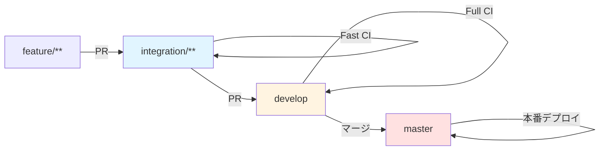

# ブランチ戦略

本ドキュメントは、本プロジェクトでのブランチ戦略を定義したものである。

---

## 種類

本プロジェクトでは、開発の粒度に応じて以下の 4 種類のブランチを運用する。

### 1. 作業ブランチ (デプロイ対象外)

個別タスクや小規模な改修を行うためのブランチ。

- 各開発者が作業を行うためのブランチ
- **開発環境へのデプロイは行わない**
- 完了したら `integration/<App名>` へマージする

---

### 2. 統合ブランチ (機能単位、デプロイ対象)

各アプリケーションごとの機能統合作業を行うためのブランチ。  
このブランチに積み上げた状態で開発環境へデプロイし、動作検証を行う。

```
integration/**
```

- 複数 task の統合ポイント
- **開発環境へ自動デプロイされる**
- 機能としてまとまったら `develop` へマージする

---

### 3. develop ブランチ (全体統合、デプロイ対象)

- 全アプリケーションの統合テストを行う地点
- **開発環境へ自動デプロイされる**
- リリース可能な状態になったら `master` へマージする

---

### 4. master ブランチ (本番)

- 本番リリース用ブランチ
- `master` にマージされたタイミングで本番環境へデプロイされる

---

## ブランチ運用フロー

以下は代表的なフロー例。

1. 機能 A-1 の対応
    - `feature/AppA/A-1` を作成し作業
2. A-1 がまとまり次第
    - `integration/AppA` にマージ  
        → 開発環境へ自動デプロイ
3. 機能 A 一式が揃ったら
    - `develop` にマージ
4. 全体としてリリース可能な状態になれば
    - `master` にマージ  
        → 本番デプロイ

---

## デプロイ戦略 (GitHub Actions)

### 開発環境デプロイ

次のブランチに更新があった場合、自動で開発環境へデプロイする。

```
develop
integration/**
```

#### 対応するワークフロートリガー例

```yaml
on:
  push:
    branches:
      - develop
      - integration/**
```

- `feature/**` は対象外のため、作業中に勝手にデプロイされることはない
- 各アプリケーションの integration ブランチは後勝ちデプロイとなる

---

### 本番デプロイ

```
master
```

`master` にマージされたタイミングで自動デプロイされる。

---

## ブランチ命名ルールまとめ

| 種類     | ブランチ例              | デプロイ   | 目的           |
| ------ | ------------------ | ------ | ------------ |
| 作業ブランチ | `feature/AppA/A-1`    | ❌      | 個別作業・WIP     |
| App 統合 | `integration/AppA` | ✅      | App 単位の統合・検証 |
| 全体統合   | `develop`          | ✅      | 全サービス統合      |
| 本番     | `master`           | 本番デプロイ | 安定版          |

---

## CI/CD 戦略

### PR 検証の2段階戦略

プルリクエストの検証は、スピードと品質のバランスを取るために2段階で実施します。

#### Fast CI (高速フィードバック)

- **対象ブランチ**: `integration/**` へのPR
- **目的**: 開発中の素早いフィードバックを提供
- **実行内容**:
    - ビルド検証
    - リント・フォーマットチェック
    - ユニットテスト実行
    - E2Eテスト実行（chromium-mobile のみ）

#### Full CI (完全テスト)

- **対象ブランチ**: `develop` へのPR
- **目的**: マージ前の完全な品質検証
- **実行内容**:
    - ビルド検証
    - リント・フォーマットチェック
    - ユニットテスト実行
    - **テストカバレッジチェック（80%以上必須）**
    - E2Eテスト実行（全デバイス: chromium-desktop, chromium-mobile, webkit-mobile）

### ブランチとCI/CDの関係図



### ブランチ・CI・デプロイの対応表

| ブランチ         | 環境 | PR検証     | 自動デプロイ |
| ---------------- | ---- | ---------- | ------------ |
| `develop`        | 開発 | ✅ Full CI | ✅           |
| `integration/**` | 開発 | ✅ Fast CI | ✅           |
| `master`         | 本番 | -          | ✅           |

---

## 注意点

- 開発環境は「後勝ちデプロイ」を前提とした運用のため、複数アプリケーションが同時に更新されると状態が上書きされる
- 必要に応じてアプリケーションごとに別の開発環境にするなどの拡張を検討可能
- テストカバレッジ80%未満の場合、Full CI（develop へのPR）で自動的に失敗します

---

## 関連ドキュメント

- [テスト戦略](./development/testing.md) - テストの詳細とCI/CD設定
- [コーディング規約](./development/rules.md) - 開発時の必須ルールと推奨事項
