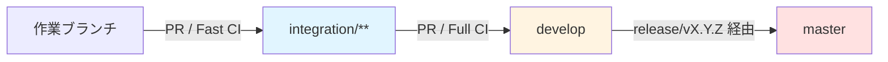

# ブランチ戦略

本ドキュメントは、本プロジェクトでのブランチ戦略を定義したものである。

---

## 全体像

```
作業ブランチ  →  integration/**  →  develop  →  master
             (Fast CI)          (Full CI)     (本番)
```

| 種類 | 名前 | デプロイ | 目的 |
|---|---|---|---|
| 作業ブランチ | 自由 | なし | 個別の作業 |
| 統合ブランチ | `integration/{issue-number}-{slug}` | 開発環境 | Issue 単位で資材を組み立て、開発環境で検証する |
| develop | `develop` | 開発環境 | 完成した資材だけが載る、いつでもリリース可能な地点 |
| release | `release/vX.Y.Z` | なし | リリースの準備 (バージョン更新など) |
| master | `master` | 本番 | 本番に出ている資材 |

---

## 作業ブランチ

- 名前は自由とする。PR のマージで消えるため、名前で追跡する場面がない。どの Issue の作業かは、PR の関連 Issue で追える。
- 開発環境へはデプロイされない。作業中の資材が勝手に出ることはない。

---

## 統合ブランチ (integration)

- **Issue 単位**で切る。命名は `integration/{issue-number}-{slug}`、分岐元は `develop`。
- 開発環境へ自動デプロイされる。資材を積み上げながら、開発環境で動作を検証する場である。
- Issue の資材がすべて揃い、検証が済んだら `develop` へマージする。

### Issue 単位にする理由

develop を「いつでもリリース可能」に保つためである。完成前の資材が develop に載ると、完成済みの資材だけを先にリリースできなくなる。integration はその手前で資材を組み立てる場であり、develop に載るのは常に完結した単位になる。

アプリ単位で integration を切ると、同じアプリの別の Issue が混ざり、片方が完成しても、もう片方が終わるまで develop に出せなくなる。

### integration を切らない変更

開発環境に資材が出ない軽量な変更 (CLAUDE.md や docs の更新、小さなワークフローの改修など) は、integration を切らず `develop` へ直接 PR を出してよい。開発環境で検証するものがないためである。

例外として、**Portal の技術記事は Markdown だが integration を経由する**。原稿の差分では良し悪しが判断できず、開発環境の描画を見て初めて検証できるためである。書き方は [`portal-article`](../.claude/skills/portal-article/SKILL.md) スキルに従う。

---

## develop

- 全サービスの資材が統合される地点。開発環境へ自動デプロイされる。
- 完成した資材だけが載る。リリースしたいときに、いつでも `master` へ出せる状態を保つ。

---

## リリース

### 守ること

**master と develop の資材をずらしたままにしない。** master に入れた変更は develop にも入れる。

一時的にずらすことは許容する。たとえば本番だけで失敗する変更 (DynamoDB の GSI を 1 回の更新で 2 つ作る、など) を段階的に反映するため、片方を外してリリースし、次のリリースで戻すような場合である。外したら戻すまでを 1 組として扱い、ずれたまま残さない。

### release ブランチの起点

`release/vX.Y.Z` で準備し、`master` 向けと `develop` 向けの両方に PR を出す。起点は状況で決める。

| 状況 | 起点 |
|---|---|
| 通常 | `develop` |
| develop に、まだ本番に出せない資材が載っている | `master` (必要な修正だけを入れる) |

本番の不具合修正も、急ぎかどうかにかかわらずリリースとして扱う。「hotfix」という別の手順は設けない。個別の事情がある場合は、上の「守ること」の範囲で都度判断する。

手順の詳細は [`release`](../.claude/skills/release/SKILL.md) スキルを参照する。

---

## デプロイ

| ブランチ | 環境 | 契機 |
|---|---|---|
| `integration/**` | 開発 | push |
| `develop` | 開発 | push |
| `master` | 本番 | push (マージ) |

```yaml
on:
  push:
    branches:
      - develop
      - integration/**
```

- 作業ブランチはデプロイ対象外。
- 開発環境は複数の integration と develop で共有しており、**後勝ち**で上書きされる。同時に複数の integration を検証すると、互いの状態を上書きしうる。

---

## CI

PR の検証は、スピードと品質を両立させるため 2 段階で行う。

| 段階 | 対象 | 内容 |
|---|---|---|
| Fast CI | `integration/**` への PR | ビルド、リント・フォーマット、ユニットテスト、E2E (chromium-mobile のみ) |
| Full CI | `develop` への PR | Fast CI の内容 + カバレッジ 80% 以上の検査 + E2E (chromium-desktop, chromium-mobile, webkit-mobile) |


```mermaid
graph LR
    A[作業ブランチ] -->|PR / Fast CI| B[integration/**]
    B -->|PR / Full CI| C[develop]
    C -->|release/vX.Y.Z 経由| D[master]

    style B fill:#e1f5ff
    style C fill:#fff4e1
    style D fill:#ffe1e1
```

カバレッジが 80% 未満の場合、Full CI (develop への PR) で自動的に失敗する。

---

## 関連ドキュメント

- [テスト戦略](./development/testing.md) - テストの詳細と CI/CD 設定
- [コーディング規約](./development/rules.md) - 開発時の必須ルールと推奨事項
