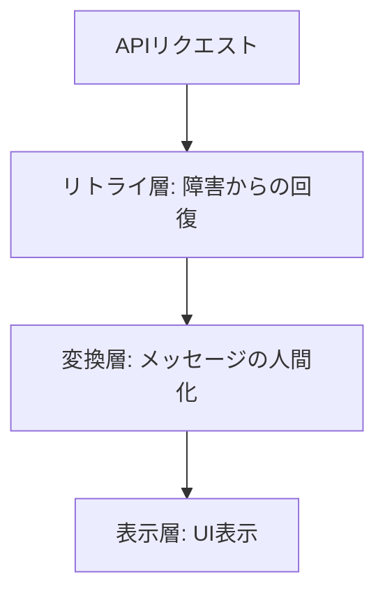

# APIクライアント設計思想

## 設計の背景

プラットフォーム全体で統一されたAPIクライアントを提供することで、以下を実現する：

- **一貫性**: 全サービスで同じエラーハンドリング体験
- **信頼性**: 一時的な障害からの自動回復
- **保守性**: 共通ロジックの集約による重複削減

## パッケージ分割の思想

| パッケージ       | 設計意図                                   |
| ---------------- | ------------------------------------------ |
| `@nagiyu/common` | フレームワーク非依存。どの環境でも利用可能 |
| `@nagiyu/react`  | React統合。状態管理とライフサイクルに対応  |

## エラーハンドリングの設計思想

### 3層アーキテクチャ

エラー処理を3つの責務に分離することで、関心の分離を実現：



#### リトライ層の設計意図

**目的**: 一時的な障害からの自動回復

- ネットワーク断、サーバー過負荷、レート制限などは一時的な問題
- 自動リトライにより、ユーザー操作を不要にする
- エクスポネンシャルバックオフでサーバー負荷を分散

**判断基準**: HTTPステータスコードによる分類

- リトライ可能: 0（ネットワークエラー）、408、429、5xx
- リトライ不可: 4xx（クライアントエラーは再試行しても無駄）

#### 変換層の設計意図

**目的**: 技術的エラーコードを人間が理解できるメッセージに変換

- 2段階マッピング: サービス固有 → 共通メッセージ
- サービス固有メッセージで業務文脈を表現
- 共通メッセージでフォールバック保証

**設計原則**:

- メッセージは定数化（多言語化の準備）
- ユーザーが取るべき行動を示す
- 技術的詳細は隠蔽

#### 表示層の設計意図

**目的**: 適切なタイミングと方法でユーザーに通知

- 依存注入パターンでUI実装を分離
- React層ではコールバックで通知を受け取る
- 表示方法（トースト、ダイアログ等）はアプリケーション判断

## エクスポネンシャルバックオフの思想

**なぜ指数関数的に増加させるか**:

- 瞬間的な障害: 短い待機で回復
- 深刻な障害: 長い待機が必要
- サーバー負荷分散: 遅延を徐々に増やし、サーバー回復の猶予を与える

**計算式**:

```
delay = min(initialDelay × backoffMultiplier^attempt, maxDelay) ± jitter
```

**ジッターの意義**:

- 複数クライアントが同時リトライする「雷鳴問題」を回避
- ランダム性により、リトライタイミングを分散

## 型安全性の思想

**TypeScript strict mode の強制**:

- レスポンス型を明示することで、実行時エラーを防ぐ
- 型推論により、開発体験を向上
- 型定義がドキュメントの役割も果たす

## 依存注入パターンの採用

**なぜトースト通知を分離するか**:

- ビジネスロジックとUI表示の責務分離
- テスタビリティの向上（モック化が容易）
- 表示方法の柔軟な変更（トースト、ダイアログ、ログ等）

## 関連ドキュメント

- [APIクライアントマイグレーションガイド](./api-client-migration.md)
- [アーキテクチャ方針](./architecture.md)
