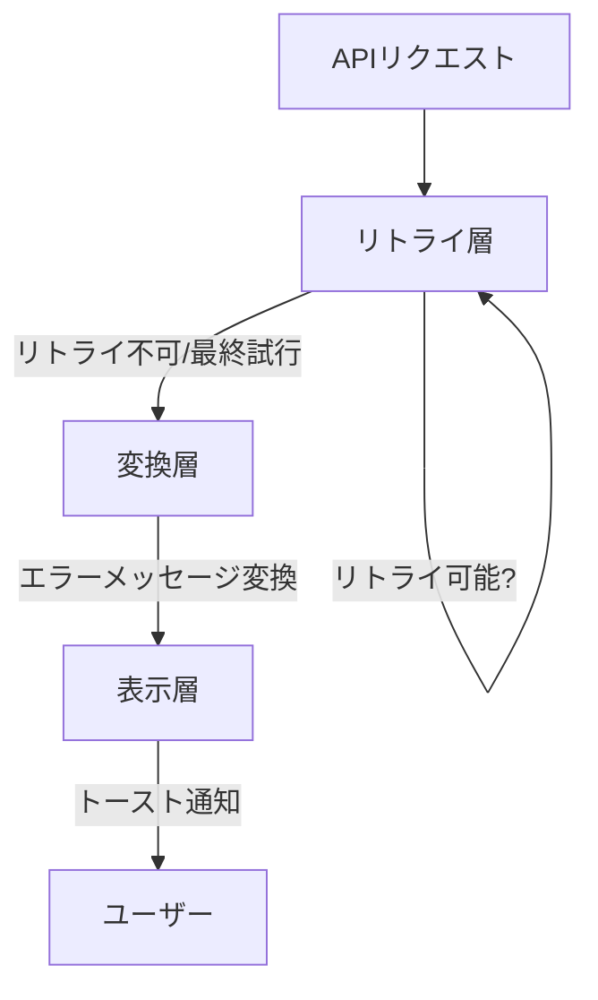

# APIクライアント使用ガイド

## 目次

-   [概要](#概要)
-   [アーキテクチャ](#アーキテクチャ)
-   [@nagiyu/commonの使い方](#nagiyucommonの使い方)
-   [@nagiyu/reactの使い方](#nagiyureactの使い方)
-   [サービス固有のエラーメッセージ定義](#サービス固有のエラーメッセージ定義)
-   [コード例とサンプル](#コード例とサンプル)

## 概要

Nagiyu Platform では、APIリクエストを統一的に扱うためのクライアントライブラリを提供しています。このライブラリは以下の機能を提供します：

-   **リトライ機能**: 一時的なネットワークエラーやサーバーエラーに対する自動リトライ
-   **エクスポネンシャルバックオフ**: リトライ時の遅延時間を指数関数的に増加
-   **タイムアウト制御**: リクエストのタイムアウト設定
-   **エラーハンドリング**: 統一的なエラー処理とユーザーフレンドリーなメッセージ変換
-   **型安全性**: TypeScriptの型推論によるレスポンスデータの型保証

### パッケージ構成

| パッケージ       | 責務                                           | 依存           |
| ---------------- | ---------------------------------------------- | -------------- |
| `@nagiyu/common` | フレームワーク非依存のAPIクライアント機能      | なし           |
| `@nagiyu/react`  | Reactフック（useAPIRequest）とReact統合機能    | `@nagiyu/common` |

## アーキテクチャ

### 3層エラー処理モデル

APIクライアントは3つの層でエラーを処理します：



#### 1. リトライ層（Retry Layer）

-   **責務**: 一時的なエラーに対する自動リトライ
-   **対象エラー**:
    -   ネットワークエラー（`NetworkError`）
    -   タイムアウト（`TimeoutError`）
    -   サーバーエラー（5xx）
    -   Too Many Requests（429）
-   **戦略**: エクスポネンシャルバックオフ + ジッター

#### 2. 変換層（Transform Layer）

-   **責務**: 技術的なエラーコードをユーザーフレンドリーなメッセージに変換
-   **2段階マッピング**:
    1.  サービス固有メッセージマッピング（オプション）
    2.  共通メッセージマッピング（フォールバック）

#### 3. 表示層（Display Layer）

-   **責務**: エラーメッセージをUIに表示
-   **実装**: トースト通知、エラーダイアログなど
-   **React統合**: `useAPIRequest` フックで自動処理

### エクスポネンシャルバックオフ戦略

リトライ時の遅延時間は以下の式で計算されます：

```
delay = min(initialDelay × backoffMultiplier^attempt, maxDelay) ± jitter
```

-   **initialDelay**: 初回リトライの遅延時間（デフォルト: 1秒）
-   **backoffMultiplier**: 増加率（デフォルト: 2倍）
-   **maxDelay**: 最大遅延時間（デフォルト: 10秒）
-   **jitter**: 遅延時間の±25%のランダム値（複数クライアントの同時リトライを分散）

**例**:

| Attempt | Base Delay | Actual Delay (with jitter) |
| ------- | ---------- | -------------------------- |
| 0       | 1秒        | 0.75秒 ～ 1.25秒          |
| 1       | 2秒        | 1.5秒 ～ 2.5秒            |
| 2       | 4秒        | 3秒 ～ 5秒                |
| 3       | 8秒        | 6秒 ～ 10秒               |

### リトライ可能性の判定ロジック

```typescript
function isRetryableError(status: number): boolean {
    // ネットワークエラー、タイムアウト、サーバーエラーはリトライ可能
    if (status === 0 || status === 408 || status >= 500) {
        return true;
    }

    // 429 (Too Many Requests) もリトライ可能
    if (status === 429) {
        return true;
    }

    return false;
}
```

## @nagiyu/commonの使い方

### インストール

```json
{
    "dependencies": {
        "@nagiyu/common": "workspace:*"
    }
}
```

### 基本的な使い方

#### 1. `apiRequest<T>()` の使い方

最も基本的なAPIリクエスト関数です。すべてのHTTPメソッドに対応しています。

```typescript
import { apiRequest } from '@nagiyu/common';

// 型を指定してリクエスト
interface User {
    id: number;
    name: string;
    email: string;
}

const user = await apiRequest<User>('/api/users/1', {
    method: 'GET',
});

console.log(user.name); // 型安全にアクセス可能
```

#### 2. 便利なHTTPメソッドラッパー

`apiRequest()` のラッパー関数も提供されています：

```typescript
import { get, post, put, del } from '@nagiyu/common';

// GETリクエスト
const user = await get<User>('/api/users/1');

// POSTリクエスト
const newUser = await post<User>('/api/users', {
    name: 'John Doe',
    email: 'john@example.com',
});

// PUTリクエスト
const updatedUser = await put<User>('/api/users/1', {
    name: 'Jane Doe',
});

// DELETEリクエスト
await del('/api/users/1');
```

### リトライ設定のカスタマイズ

リトライ動作をカスタマイズできます：

```typescript
import { apiRequest, type RetryConfig } from '@nagiyu/common';

// リトライ設定のカスタマイズ
const customRetryConfig: Partial<RetryConfig> = {
    maxRetries: 5, // 最大5回リトライ
    initialDelay: 2000, // 初回遅延2秒
    maxDelay: 30000, // 最大遅延30秒
    backoffMultiplier: 3, // 3倍ずつ増加
};

const data = await apiRequest<DataType>('/api/data', {
    method: 'GET',
    retry: customRetryConfig,
});
```

**リトライを無効化する場合**:

```typescript
const data = await apiRequest<DataType>('/api/data', {
    method: 'GET',
    retry: {
        maxRetries: 0, // リトライなし
    },
});
```

### タイムアウト設定

デフォルトのタイムアウトは30秒です。カスタマイズする場合：

```typescript
import { apiRequest } from '@nagiyu/common';

// タイムアウトを60秒に設定
const data = await apiRequest<DataType>('/api/long-running-task', {
    method: 'POST',
    timeout: 60000, // ミリ秒単位
});
```

### エラーハンドリング

#### 基本的なエラーハンドリング

```typescript
import { apiRequest, APIError } from '@nagiyu/common';

try {
    const data = await apiRequest<DataType>('/api/data');
    console.log(data);
} catch (error) {
    if (error instanceof APIError) {
        console.error('ステータスコード:', error.status);
        console.error('エラーメッセージ:', error.message);
        console.error('エラータイプ:', error.errorInfo.type); // 'error' | 'warning' | 'info'
        console.error('詳細:', error.errorInfo.details);
        console.error('リトライ可能:', error.errorInfo.shouldRetry);
    } else {
        console.error('予期しないエラー:', error);
    }
}
```

#### エラー情報の構造

```typescript
interface ErrorInfo {
    type: 'error' | 'warning' | 'info';
    message: string; // ユーザーフレンドリーなメッセージ
    details?: string[]; // 詳細情報（オプション）
    shouldRetry?: boolean; // リトライ可能か
}

class APIError extends Error {
    constructor(
        public readonly status: number, // HTTPステータスコード
        public readonly errorInfo: ErrorInfo,
        message: string
    ) {
        super(message);
    }
}
```

### カスタムヘッダーの追加

認証トークンなどのカスタムヘッダーを追加できます：

```typescript
import { apiRequest } from '@nagiyu/common';

const data = await apiRequest<DataType>('/api/protected', {
    method: 'GET',
    headers: {
        Authorization: `Bearer ${token}`,
        'X-Custom-Header': 'custom-value',
    },
});
```

### 共通エラーメッセージ定数

`@nagiyu/common` は共通のエラーメッセージ定数を提供しています：

```typescript
import { COMMON_ERROR_MESSAGES } from '@nagiyu/common';

console.log(COMMON_ERROR_MESSAGES.UNAUTHORIZED); // "ログインが必要です。再度ログインしてください"
console.log(COMMON_ERROR_MESSAGES.NETWORK_ERROR); // "ネットワーク接続を確認してください"
console.log(COMMON_ERROR_MESSAGES.SERVER_ERROR); // "サーバーエラーが発生しました。しばらくしてから再度お試しください"
```

**利用可能なメッセージ**:

| キー                | メッセージ                                                           |
| ------------------- | -------------------------------------------------------------------- |
| `UNAUTHORIZED`      | ログインが必要です。再度ログインしてください                         |
| `FORBIDDEN`         | この操作を実行する権限がありません                                   |
| `SESSION_EXPIRED`   | セッションが期限切れです。再度ログインしてください                   |
| `NETWORK_ERROR`     | ネットワーク接続を確認してください                                   |
| `TIMEOUT_ERROR`     | 接続がタイムアウトしました。しばらくしてから再度お試しください       |
| `SERVER_ERROR`      | サーバーエラーが発生しました。しばらくしてから再度お試しください     |
| `INVALID_REQUEST`   | 入力内容に誤りがあります。確認してください                           |
| `VALIDATION_ERROR`  | 入力データが不正です                                                 |
| `NOT_FOUND`         | データが見つかりませんでした                                         |
| `CREATE_ERROR`      | 登録に失敗しました                                                   |
| `UPDATE_ERROR`      | 更新に失敗しました                                                   |
| `DELETE_ERROR`      | 削除に失敗しました                                                   |
| `FETCH_ERROR`       | データの取得に失敗しました                                           |
| `UNKNOWN_ERROR`     | 予期しないエラーが発生しました                                       |

## @nagiyu/reactの使い方

### インストール

```json
{
    "dependencies": {
        "@nagiyu/react": "workspace:*",
        "@nagiyu/common": "workspace:*"
    }
}
```

### `useAPIRequest()` の基本的な使い方

`useAPIRequest` は、APIリクエストを実行し、状態管理とエラーハンドリングを提供するReactフックです。

```typescript
'use client';

import { useAPIRequest } from '@nagiyu/react';

interface User {
    id: number;
    name: string;
    email: string;
}

function UserProfile({ userId }: { userId: number }) {
    const { data, loading, error, execute } = useAPIRequest<User>();

    const loadUser = async () => {
        await execute(`/api/users/${userId}`);
    };

    if (loading) {
        return <div>読み込み中...</div>;
    }

    if (error) {
        return <div>エラー: {error.message}</div>;
    }

    if (!data) {
        return <button onClick={loadUser}>ユーザー情報を読み込む</button>;
    }

    return (
        <div>
            <h2>{data.name}</h2>
            <p>{data.email}</p>
        </div>
    );
}
```

### useAPIRequest の戻り値

```typescript
interface UseAPIRequestReturn<T> {
    data: T | null; // レスポンスデータ
    loading: boolean; // ローディング状態
    error: APIError | null; // エラー情報
    execute: (url: string, options?: APIRequestOptions) => Promise<T | null>; // リクエスト実行
    reset: () => void; // 状態をリセット
    retry: () => Promise<T | null>; // 最後のリクエストをリトライ
}
```

### コールバック関数の使用

成功時やエラー時のコールバックを設定できます：

```typescript
'use client';

import { useAPIRequest } from '@nagiyu/react';
import { useToast } from '@/hooks/useToast'; // 例: トースト通知フック

function CreateUserForm() {
    const toast = useToast();
    const { loading, execute } = useAPIRequest<User>({
        onSuccess: (user) => {
            toast.success(`ユーザー「${user.name}」を作成しました`);
        },
        onError: (error) => {
            toast.error(error.message);
        },
    });

    const handleSubmit = async (formData: FormData) => {
        await execute('/api/users', {
            method: 'POST',
            body: JSON.stringify({
                name: formData.get('name'),
                email: formData.get('email'),
            }),
            headers: {
                'Content-Type': 'application/json',
            },
        });
    };

    return <form onSubmit={handleSubmit}>{/* フォームフィールド */}</form>;
}
```

### リトライ機能

最後のリクエストを再実行する `retry()` 関数が提供されています：

```typescript
'use client';

import { useAPIRequest } from '@nagiyu/react';

function DataList() {
    const { data, loading, error, execute, retry } = useAPIRequest<DataType[]>();

    useEffect(() => {
        execute('/api/data');
    }, []);

    if (error) {
        return (
            <div>
                <p>エラー: {error.message}</p>
                <button onClick={retry}>再試行</button>
            </div>
        );
    }

    // ... レンダリング
}
```

### 状態のリセット

`reset()` 関数で状態をクリアできます：

```typescript
'use client';

import { useAPIRequest } from '@nagiyu/react';

function SearchComponent() {
    const { data, loading, error, execute, reset } = useAPIRequest<SearchResult>();

    const handleSearch = async (query: string) => {
        await execute(`/api/search?q=${encodeURIComponent(query)}`);
    };

    const handleClear = () => {
        reset(); // data, error, loading をすべて初期化
    };

    return (
        <div>
            <input type="text" onChange={(e) => handleSearch(e.target.value)} />
            <button onClick={handleClear}>クリア</button>
            {/* 結果表示 */}
        </div>
    );
}
```

### HTTPメソッドの指定

`execute()` 関数には `APIRequestOptions` を渡すことができます：

```typescript
'use client';

import { useAPIRequest } from '@nagiyu/react';

function UserEditor() {
    const { data, execute } = useAPIRequest<User>();

    // GET
    const loadUser = (userId: number) => {
        execute(`/api/users/${userId}`, {
            method: 'GET',
        });
    };

    // POST
    const createUser = (userData: Partial<User>) => {
        execute('/api/users', {
            method: 'POST',
            headers: { 'Content-Type': 'application/json' },
            body: JSON.stringify(userData),
        });
    };

    // PUT
    const updateUser = (userId: number, userData: Partial<User>) => {
        execute(`/api/users/${userId}`, {
            method: 'PUT',
            headers: { 'Content-Type': 'application/json' },
            body: JSON.stringify(userData),
        });
    };

    // DELETE
    const deleteUser = (userId: number) => {
        execute(`/api/users/${userId}`, {
            method: 'DELETE',
        });
    };

    // ...
}
```

### トースト通知の統合方法

`onSuccess` と `onError` コールバックを使って、トースト通知と統合します：

```typescript
'use client';

import { useAPIRequest } from '@nagiyu/react';
import { useToast } from '@/hooks/useToast';

function TodoList() {
    const toast = useToast();

    const { data, loading, execute } = useAPIRequest<Todo[]>({
        onSuccess: () => {
            toast.success('タスクを読み込みました');
        },
        onError: (error) => {
            // エラータイプに応じた通知
            if (error.errorInfo.type === 'error') {
                toast.error(error.message);
            } else if (error.errorInfo.type === 'warning') {
                toast.warning(error.message);
            } else {
                toast.info(error.message);
            }
        },
    });

    // ...
}
```

### エラーハンドリングのベストプラクティス

#### 1. グローバルエラーハンドラーとの併用

```typescript
'use client';

import { useAPIRequest } from '@nagiyu/react';
import { useEffect } from 'react';
import { useRouter } from 'next/navigation';

function ProtectedComponent() {
    const router = useRouter();
    const { data, error, execute } = useAPIRequest<ProtectedData>({
        onError: (error) => {
            // 認証エラーの場合はログインページにリダイレクト
            if (error.status === 401) {
                router.push('/login');
            }
        },
    });

    useEffect(() => {
        execute('/api/protected-data');
    }, []);

    // ...
}
```

#### 2. エラーの詳細情報を表示

```typescript
'use client';

import { useAPIRequest } from '@nagiyu/react';
import { APIError } from '@nagiyu/common';

function DetailedErrorDisplay() {
    const { error, execute } = useAPIRequest<DataType>();

    return (
        <div>
            {error && (
                <div className="error-panel">
                    <h3>{error.message}</h3>
                    <p>ステータスコード: {error.status}</p>
                    {error.errorInfo.details && (
                        <ul>
                            {error.errorInfo.details.map((detail, index) => (
                                <li key={index}>{detail}</li>
                            ))}
                        </ul>
                    )}
                </div>
            )}
        </div>
    );
}
```

#### 3. ローディング状態の適切な表示

```typescript
'use client';

import { useAPIRequest } from '@nagiyu/react';
import CircularProgress from '@mui/material/CircularProgress';

function DataView() {
    const { data, loading, error, execute } = useAPIRequest<DataType>();

    useEffect(() => {
        execute('/api/data');
    }, []);

    if (loading) {
        return (
            <div style={{ display: 'flex', justifyContent: 'center', padding: '2rem' }}>
                <CircularProgress />
            </div>
        );
    }

    if (error) {
        return <ErrorMessage error={error} />;
    }

    if (!data) {
        return <div>データがありません</div>;
    }

    return <DataDisplay data={data} />;
}
```

## サービス固有のエラーメッセージ定義

### 2段階マッピング戦略

APIクライアントは、エラーメッセージを2段階でマッピングします：

1.  **第1段階**: サービス固有のメッセージマッピング（オプション）
2.  **第2段階**: 共通メッセージマッピング（フォールバック）

### サービス固有メッセージの定義方法

#### 1. エラーメッセージ定数の作成

サービス固有のエラーメッセージを定義します：

```typescript
// services/stock-tracker/core/src/constants/error-messages.ts

export const STOCK_ERROR_MESSAGES = {
    // Stock Tracker 固有のエラー
    STOCK_NOT_FOUND: '指定された銘柄が見つかりませんでした',
    INVALID_SYMBOL: '銘柄コードの形式が正しくありません',
    MARKET_CLOSED: '市場が閉まっています。取引時間内にお試しください',
    PRICE_FETCH_FAILED: '株価情報の取得に失敗しました',
    PORTFOLIO_FULL: 'ポートフォリオの登録上限に達しています',
    DUPLICATE_STOCK: 'この銘柄は既に登録されています',
} as const;
```

#### 2. APIリクエスト時に適用

`apiRequest()` の第3引数にサービス固有メッセージを渡します：

```typescript
// services/stock-tracker/core/src/api/stock-api.ts

import { apiRequest } from '@nagiyu/common';
import { STOCK_ERROR_MESSAGES } from '../constants/error-messages';

export async function getStockPrice(symbol: string): Promise<StockPrice> {
    return apiRequest<StockPrice>(
        `/api/stocks/${symbol}/price`,
        {
            method: 'GET',
        },
        STOCK_ERROR_MESSAGES // サービス固有メッセージを渡す
    );
}

export async function addStockToPortfolio(symbol: string): Promise<Portfolio> {
    return apiRequest<Portfolio>(
        '/api/portfolio',
        {
            method: 'POST',
            headers: { 'Content-Type': 'application/json' },
            body: JSON.stringify({ symbol }),
        },
        STOCK_ERROR_MESSAGES
    );
}
```

#### 3. Reactフックでの使用

Reactフックでは、APIクライアント関数をラップして使用します：

```typescript
// services/stock-tracker/web/src/hooks/useStockAPI.ts

'use client';

import { useAPIRequest } from '@nagiyu/react';
import { getStockPrice, addStockToPortfolio } from 'stock-tracker-core/api/stock-api';

export function useStockPrice() {
    const { data, loading, error, execute } = useAPIRequest<StockPrice>({
        onError: (error) => {
            // サービス固有のエラーメッセージが適用される
            toast.error(error.message);
        },
    });

    const fetchPrice = async (symbol: string) => {
        // apiRequest() を直接呼ぶ代わりに、ラップされた関数を使用
        const result = await getStockPrice(symbol);
        return result;
    };

    return { data, loading, error, fetchPrice };
}
```

### マッピングの優先順位

エラーコード `INVALID_SYMBOL` が発生した場合の処理フロー：

1.  **サービス固有メッセージを確認**
    -   `STOCK_ERROR_MESSAGES.INVALID_SYMBOL` が存在する場合 → 「銘柄コードの形式が正しくありません」
2.  **共通メッセージを確認**
    -   サービス固有メッセージがない場合 → `COMMON_ERROR_MESSAGES` から検索
3.  **APIレスポンスのメッセージを使用**
    -   共通メッセージもない場合 → APIレスポンスの `message` フィールドをそのまま使用
4.  **デフォルトメッセージ**
    -   すべてがない場合 → `COMMON_ERROR_MESSAGES.UNKNOWN_ERROR`

### バックエンドAPIレスポンス形式

サービス固有メッセージを正しくマッピングするには、バックエンドAPIが以下の形式でエラーを返す必要があります：

```json
{
    "error": "INVALID_SYMBOL",
    "message": "Invalid stock symbol format",
    "details": ["Symbol must be 4 alphanumeric characters"]
}
```

-   **error**: エラーコード（マッピングのキー）
-   **message**: 技術的なエラーメッセージ（マッピングされなかった場合に使用）
-   **details**: 詳細情報（オプション）

## コード例とサンプル

### 例1: シンプルなGETリクエスト

```typescript
import { get } from '@nagiyu/common';

interface Todo {
    id: number;
    title: string;
    completed: boolean;
}

async function fetchTodos(): Promise<Todo[]> {
    try {
        const todos = await get<Todo[]>('/api/todos');
        console.log('取得したTodo:', todos);
        return todos;
    } catch (error) {
        console.error('Todoの取得に失敗:', error);
        throw error;
    }
}
```

### 例2: POSTリクエストでデータを作成

```typescript
import { post, APIError } from '@nagiyu/common';

interface CreateTodoRequest {
    title: string;
    completed?: boolean;
}

interface Todo {
    id: number;
    title: string;
    completed: boolean;
}

async function createTodo(data: CreateTodoRequest): Promise<Todo> {
    try {
        const newTodo = await post<Todo>('/api/todos', data);
        console.log('作成されたTodo:', newTodo);
        return newTodo;
    } catch (error) {
        if (error instanceof APIError) {
            if (error.status === 400) {
                console.error('バリデーションエラー:', error.errorInfo.details);
            } else {
                console.error('サーバーエラー:', error.message);
            }
        }
        throw error;
    }
}
```

### 例3: カスタムリトライ設定

```typescript
import { apiRequest } from '@nagiyu/common';

async function uploadLargeFile(file: File): Promise<{ url: string }> {
    const formData = new FormData();
    formData.append('file', file);

    return apiRequest<{ url: string }>('/api/upload', {
        method: 'POST',
        body: formData,
        timeout: 120000, // 2分
        retry: {
            maxRetries: 5, // 大きいファイルなので5回リトライ
            initialDelay: 3000, // 初回3秒待つ
            maxDelay: 60000, // 最大60秒
        },
    });
}
```

### 例4: Reactフックでのリスト取得と作成

```typescript
'use client';

import { useAPIRequest } from '@nagiyu/react';
import { useState } from 'react';

interface Todo {
    id: number;
    title: string;
    completed: boolean;
}

function TodoApp() {
    const [todos, setTodos] = useState<Todo[]>([]);
    const [title, setTitle] = useState('');

    const { loading: listLoading, execute: fetchTodos } = useAPIRequest<Todo[]>({
        onSuccess: (data) => {
            setTodos(data);
        },
    });

    const { loading: createLoading, execute: createTodo } = useAPIRequest<Todo>({
        onSuccess: (newTodo) => {
            setTodos((prev) => [...prev, newTodo]);
            setTitle(''); // フォームをクリア
            toast.success('Todoを作成しました');
        },
        onError: (error) => {
            toast.error(error.message);
        },
    });

    const handleLoad = () => {
        fetchTodos('/api/todos');
    };

    const handleCreate = async (e: React.FormEvent) => {
        e.preventDefault();
        await createTodo('/api/todos', {
            method: 'POST',
            headers: { 'Content-Type': 'application/json' },
            body: JSON.stringify({ title, completed: false }),
        });
    };

    return (
        <div>
            <button onClick={handleLoad} disabled={listLoading}>
                {listLoading ? '読み込み中...' : 'Todoを読み込む'}
            </button>

            <form onSubmit={handleCreate}>
                <input
                    type="text"
                    value={title}
                    onChange={(e) => setTitle(e.target.value)}
                    placeholder="新しいTodo"
                    required
                />
                <button type="submit" disabled={createLoading}>
                    {createLoading ? '作成中...' : '作成'}
                </button>
            </form>

            <ul>
                {todos.map((todo) => (
                    <li key={todo.id}>{todo.title}</li>
                ))}
            </ul>
        </div>
    );
}
```

### 例5: 認証トークンを使った保護されたAPI呼び出し

```typescript
'use client';

import { useAPIRequest } from '@nagiyu/react';
import { useAuth } from '@/hooks/useAuth'; // 認証フック

interface UserProfile {
    id: string;
    name: string;
    email: string;
}

function ProfilePage() {
    const { token } = useAuth();
    const { data, loading, error, execute } = useAPIRequest<UserProfile>();

    const loadProfile = async () => {
        await execute('/api/user/profile', {
            method: 'GET',
            headers: {
                Authorization: `Bearer ${token}`,
            },
        });
    };

    useEffect(() => {
        if (token) {
            loadProfile();
        }
    }, [token]);

    if (loading) return <div>読み込み中...</div>;
    if (error) return <div>エラー: {error.message}</div>;
    if (!data) return null;

    return (
        <div>
            <h1>{data.name}</h1>
            <p>{data.email}</p>
        </div>
    );
}
```

### 例6: ページネーション付きリスト

```typescript
'use client';

import { useAPIRequest } from '@nagiyu/react';
import { useState } from 'react';

interface PaginatedResponse<T> {
    items: T[];
    total: number;
    page: number;
    pageSize: number;
}

interface Article {
    id: number;
    title: string;
    content: string;
}

function ArticleList() {
    const [page, setPage] = useState(1);
    const pageSize = 10;

    const { data, loading, execute } = useAPIRequest<PaginatedResponse<Article>>();

    const loadPage = (pageNumber: number) => {
        execute(`/api/articles?page=${pageNumber}&pageSize=${pageSize}`);
        setPage(pageNumber);
    };

    useEffect(() => {
        loadPage(1);
    }, []);

    if (loading) return <div>読み込み中...</div>;
    if (!data) return null;

    const totalPages = Math.ceil(data.total / data.pageSize);

    return (
        <div>
            <div>
                {data.items.map((article) => (
                    <article key={article.id}>
                        <h2>{article.title}</h2>
                        <p>{article.content}</p>
                    </article>
                ))}
            </div>

            <div className="pagination">
                <button disabled={page === 1} onClick={() => loadPage(page - 1)}>
                    前へ
                </button>
                <span>
                    {page} / {totalPages}
                </span>
                <button disabled={page === totalPages} onClick={() => loadPage(page + 1)}>
                    次へ
                </button>
            </div>
        </div>
    );
}
```

### 例7: 並列リクエスト

```typescript
import { get } from '@nagiyu/common';

interface User {
    id: number;
    name: string;
}

interface Post {
    id: number;
    title: string;
    userId: number;
}

async function loadUserWithPosts(userId: number) {
    try {
        // 並列実行
        const [user, posts] = await Promise.all([
            get<User>(`/api/users/${userId}`),
            get<Post[]>(`/api/users/${userId}/posts`),
        ]);

        return { user, posts };
    } catch (error) {
        console.error('データの取得に失敗:', error);
        throw error;
    }
}
```

### 例8: サービス固有エラーメッセージの使用

```typescript
import { post, APIError } from '@nagiyu/common';

// サービス固有のエラーメッセージ
const STOCK_ERROR_MESSAGES = {
    STOCK_NOT_FOUND: '指定された銘柄が見つかりませんでした',
    INVALID_SYMBOL: '銘柄コードの形式が正しくありません',
    MARKET_CLOSED: '市場が閉まっています',
};

interface StockPrice {
    symbol: string;
    price: number;
    timestamp: string;
}

async function getStockPrice(symbol: string): Promise<StockPrice> {
    try {
        // 第3引数にサービス固有メッセージを渡す
        const price = await post<StockPrice>(
            '/api/stocks/price',
            { symbol },
            {},
            STOCK_ERROR_MESSAGES
        );
        return price;
    } catch (error) {
        if (error instanceof APIError) {
            // エラーメッセージは自動的にマッピングされる
            console.error(error.message); // "指定された銘柄が見つかりませんでした" など
        }
        throw error;
    }
}
```

## 関連ドキュメント

-   [APIクライアントマイグレーションガイド](./api-client-migration.md)
-   [アーキテクチャ方針](./architecture.md)
-   [共通ライブラリ設計](./shared-libraries.md)
-   [テスト戦略](./testing.md)
