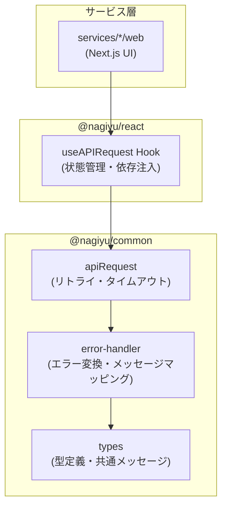

# アーキテクチャ方針

## 目的

本ドキュメントは、サービス設計における基本的なアーキテクチャ方針と推奨パターンを定義する。

## レイヤー分離の原則

### サービス固有パッケージの分離

サービスは以下のパッケージに分離することで、責務を明確化する：

- **core**: ビジネスロジック層
  - フレームワーク非依存のビジネスロジック
  - 純粋関数として実装
  - Unit Test 必須
  - 相対パスで import（path alias 使用不可）
- **web**: プレゼンテーション層
  - Next.js + React による UI 実装
  - E2E Test 主体
  - path alias（`@/`）使用可能
- **batch**: バッチ処理層
  - 定期実行やイベント駆動の処理
  - Lambda などでの実行を想定
  - Unit Test 必須

### 基本方針

- **UI層とビジネスロジックの分離**: プレゼンテーション（`web/`）とビジネスロジック（`core/`）を明確に分離
- **core/ 配下の構成は自由**: サービスの特性に応じて最適な構成を選択

### 依存関係の原則

```
web   → core → libs/common
      → libs/ui → libs/browser → libs/common

batch → core → libs/common
```

- **web** と **batch** は **core** に依存可能
- **core** は UI に依存しない（web, libs/ui への依存禁止）
- **core** は相対パスで import（path alias 不使用）

### 分離の利点

- ユニットテストの容易性（ビジネスロジックを独立してテスト可能）
- コンポーネントの再利用性向上
- 責務の明確化
- バッチ処理の追加が容易

## Pure Business Logic Functions パターン

### 概要

Pure Business Logic Functions（純粋関数によるビジネスロジック）は、副作用のない関数としてビジネスロジックを実装するパターンです。このパターンにより、テスト容易性、保守性、予測可能性が向上します。

### 純粋関数とは

純粋関数（Pure Function）は以下の特性を持つ関数です：

1. **同じ入力に対して常に同じ出力を返す**
   - 関数の戻り値は、入力パラメータのみに依存
   - 外部状態（グローバル変数、データベース、API等）に依存しない

2. **副作用がない**
   - 外部状態を変更しない
   - ファイルI/O、データベース更新、API呼び出しなどを行わない
   - 引数として受け取ったオブジェクトを変更しない（イミュータブル）

### なぜ純粋関数を使用するのか

#### テスト容易性

- **モック不要**: 外部依存がないため、モックやスタブを用意する必要がない
- **単純なテスト**: 入力と期待する出力を定義するだけでテストできる
- **高速なテスト実行**: I/O操作がないため、テストが高速に実行される

#### 保守性

- **予測可能な動作**: 同じ入力に対して常に同じ結果が返るため、動作が予測しやすい
- **デバッグの容易性**: 関数の入力と出力のみを確認すればよい
- **リファクタリングの安全性**: 副作用がないため、関数の内部実装を変更しやすい

#### 再利用性

- **独立性**: 外部依存がないため、複数の場所から呼び出し可能
- **テスタビリティ**: 型安全性により、関数のインターフェースが明確

### 適用すべきケースと適用しないケース

#### 適用すべきケース

- **計算ロジック**: 価格計算、税金計算、ポイント計算など
- **データ変換**: フォーマット変換、正規化、マッピングなど
- **バリデーション**: 入力チェック、ビジネスルールの検証など
- **データ集計**: 合計、平均、フィルタリングなど

#### 適用しないケース

- **外部I/Oが必要**: API呼び出し、データベースアクセス、ファイル操作など
- **副作用が必須**: 状態更新、ログ出力、イベント発行など
- **非同期処理**: Promise、async/awaitを使用する処理

これらのケースでは、純粋関数を呼び出す**サービス層**やリポジトリ層で副作用を扱います。

### ディレクトリ構造と配置ルール

#### MUST: ビジネスロジックの純粋関数は `services/{service}/core/src/libs/` に配置

```
services/{service}/core/src/
├── libs/                   # 純粋なビジネスロジック（MUST）
│   ├── calculations.ts     # 計算ロジック
│   ├── formatters.ts       # データフォーマット
│   ├── validators.ts       # バリデーション
│   └── converters.ts       # データ変換
├── services/               # ステートフルなサービス層（該当する場合）
│   └── data-service.ts     # 副作用を持つ処理（API、DB等）
├── repositories/           # データアクセス層（該当する場合）
│   └── user-repository.ts
└── types.ts                # 型定義
```

**配置ルールの理由**:

- **libs/**: "libraries" の略で、ライブラリのような再利用可能な純粋関数を配置
- **責務の明確化**: 純粋関数（libs/）と副作用を持つ処理（services/, repositories/）を分離
- **テストの容易性**: libs/ 配下のコードは高いカバレッジでユニットテストを実施

### 関数設計ガイドライン

#### 純粋関数の実装ルール

##### MUST: 同じ入力に対して常に同じ出力を返す

```typescript
// ✅ OK: 純粋関数
export function calculateTax(price: number, taxRate: number): number {
  return price * taxRate;
}

// ❌ NG: 外部状態（Date.now()）に依存
export function calculateDiscount(price: number): number {
  const now = Date.now();
  return now % 2 === 0 ? price * 0.9 : price;
}
```

##### MUST: 外部状態を変更しない（副作用なし）

```typescript
// ✅ OK: 新しいオブジェクトを返す（イミュータブル）
export function addItem(items: Item[], newItem: Item): Item[] {
  return [...items, newItem];
}

// ❌ NG: 引数のオブジェクトを変更（ミュータブル）
export function addItem(items: Item[], newItem: Item): Item[] {
  items.push(newItem); // 副作用
  return items;
}
```

##### MUST: エラーメッセージは定数オブジェクトで管理

```typescript
// ✅ OK
export const ERROR_MESSAGES = {
  INVALID_INPUT: '入力が不正です',
  OUT_OF_RANGE: '値が範囲外です',
} as const;

export function validatePrice(price: number): void {
  if (price < 0) {
    throw new Error(ERROR_MESSAGES.OUT_OF_RANGE);
  }
}

// ❌ NG: エラーメッセージを直接記述
export function validatePrice(price: number): void {
  if (price < 0) {
    throw new Error('値が範囲外です'); // 定数化されていない
  }
}
```

**理由**:

- エラーメッセージの一元管理
- テストでのエラーメッセージの検証が容易
- メッセージ変更時の影響範囲が明確

##### MUST: エラーは例外（throw Error）で処理

```typescript
// ✅ OK: 例外を投げる
export function calculateTargetPrice(averagePrice: number): number {
  if (averagePrice < 0) {
    throw new Error(ERROR_MESSAGES.INVALID_PRICE);
  }
  return averagePrice * 1.2;
}

// ❌ NG: null や undefined を返す（型安全性が損なわれる）
export function calculateTargetPrice(averagePrice: number): number | null {
  if (averagePrice < 0) {
    return null;
  }
  return averagePrice * 1.2;
}
```

**理由**:

- Next.js の Error Boundary と相性が良い
- 型安全性が保たれる（戻り値の型が単純）
- エラーハンドリングが呼び出し側で明示的になる

#### JSDoc コメントの必須項目

##### MUST: 関数の説明、@param、@returns

```typescript
/**
 * 目標価格の算出
 *
 * @param averagePrice - 平均取得価格
 * @returns 目標価格（平均取得価格 × 1.2）
 */
export function calculateTargetPrice(averagePrice: number): number {
  return averagePrice * 1.2;
}
```

##### SHOULD: @throws（例外を投げる場合）

```typescript
/**
 * 目標価格の算出
 *
 * @param averagePrice - 平均取得価格
 * @returns 目標価格（平均取得価格 × 1.2）
 * @throws Error - 無効な価格の場合
 */
export function calculateTargetPrice(averagePrice: number): number {
  if (averagePrice < 0) {
    throw new Error(ERROR_MESSAGES.INVALID_PRICE);
  }
  return averagePrice * 1.2;
}
```

##### SHOULD: @example（使用例）

```typescript
/**
 * 目標価格の算出
 *
 * @param averagePrice - 平均取得価格
 * @returns 目標価格（平均取得価格 × 1.2）
 * @throws Error - 無効な価格の場合
 *
 * @example
 * calculateTargetPrice(100.00) // => 120.00
 * calculateTargetPrice(250.50) // => 300.60
 */
export function calculateTargetPrice(averagePrice: number): number {
  if (averagePrice < 0) {
    throw new Error(ERROR_MESSAGES.INVALID_PRICE);
  }
  return averagePrice * 1.2;
}
```

### テスト戦略

#### MUST: 純粋関数のテストカバレッジは 80% 以上

ビジネスロジック（`libs/` 配下）は重点的にテストを実施します。テストカバレッジ 80% 未満の場合、Full CI（develop へのPR）で自動的に失敗します。

#### テストの基本パターン

##### AAA パターン（Arrange, Act, Assert）

```typescript
describe('calculateTargetPrice', () => {
  it('平均取得価格 × 1.2 で目標価格を算出する', () => {
    // Arrange: テストデータの準備
    const averagePrice = 100.0;

    // Act: 関数の実行
    const result = calculateTargetPrice(averagePrice);

    // Assert: 結果の検証
    expect(result).toBe(120.0);
  });
});
```

##### 一つのテストで一つの検証

```typescript
// ✅ OK: 一つのテストで一つのケースを検証
describe('calculateTargetPrice', () => {
  it('正常な価格の場合、1.2倍した値を返す', () => {
    expect(calculateTargetPrice(100)).toBe(120);
  });

  it('負の価格の場合、エラーを投げる', () => {
    expect(() => calculateTargetPrice(-100)).toThrow(PRICE_CALCULATOR_ERROR_MESSAGES.INVALID_PRICE);
  });
});

// ❌ NG: 一つのテストで複数のケースを検証
describe('calculateTargetPrice', () => {
  it('目標価格を正しく計算する', () => {
    expect(calculateTargetPrice(100)).toBe(120);
    expect(calculateTargetPrice(200)).toBe(240); // 複数の検証
    expect(() => calculateTargetPrice(-100)).toThrow(); // 異なる種類の検証
  });
});
```

#### 純粋関数はモック化しない

純粋関数は副作用がないため、モック化せずにそのまま実行します。

```typescript
// ✅ OK: 純粋関数をそのまま実行
import { calculateTargetPrice } from './calculations';

describe('PriceService', () => {
  it('目標価格を正しく計算する', () => {
    const result = calculateTargetPrice(100);
    expect(result).toBe(120);
  });
});

// ❌ NG: 純粋関数をモック化（不要）
import * as calculations from './calculations';

describe('PriceService', () => {
  it('目標価格を正しく計算する', () => {
    jest.spyOn(calculations, 'calculateTargetPrice').mockReturnValue(120);
    // ...
  });
});
```

**モック化が必要なのは副作用がある処理のみ**:

- API呼び出し（fetch, axios等）
- データベースアクセス
- ファイルI/O
- 現在時刻の取得（Date.now()）

#### 参考

詳細なテスト戦略については、[testing.md](./testing.md) を参照してください。

## 推奨アーキテクチャパターン

### Parser/Formatter パターン

入力データの変換処理を行うサービスに適用。

#### 構成

- **Parser**: 入力データのバリデーション＋構造化
- **Formatter**: 構造化データ＋設定 → 出力データ

#### 適用ケース

- テキスト変換ツール
- データフォーマット変換
- 入力の正規化が必要な処理

#### 設計のポイント

- エラーメッセージは定数化して管理
- Parser と Formatter は純粋関数として実装
- 中間データ構造を型定義

### Repository パターン

データアクセス層をビジネスロジックから分離し、データソースへの依存を抽象化するパターン。

#### 設計思想

- **関心の分離**: データアクセスの詳細をビジネスロジックから隠蔽
- **テスト容易性**: データソースをモック化して独立したテスト実行
- **保守性**: データベース変更の影響をリポジトリ層に限定

#### 適用判断

- DynamoDB等の外部データストアを使用する場合
- データアクセスロジックが複雑化する場合
- 複数サービスで共通のデータモデルを扱う場合

#### Single Table Design vs Multiple Table Design

**Single Table Design**: 複数エンティティを1テーブルに格納

- 利点: パフォーマンス向上、コスト削減、トランザクション対応
- 欠点: 設計複雑性、学習コスト
- 適用: 関連性の高いエンティティ、明確なアクセスパターン

**Multiple Table Design**: エンティティごとに独立テーブル

- 利点: シンプル、理解容易、変更柔軟性
- 欠点: パフォーマンス、コスト増加
- 適用: 独立性の高いエンティティ、不明確なアクセスパターン

採用判断はアクセスパターンの明確性、エンティティ間の関連性、パフォーマンス要求を考慮して行う。

### Service パターン

複雑なビジネスロジックのカプセル化を行うパターン。複数リポジトリの組み合わせやトランザクション制御が必要な場合に適用。

### Hook パターン

React固有のロジックの再利用を行うパターン。複数コンポーネントで共通するState管理や副作用処理の共通化に適用。

## State Management

### 基本方針

- **React Hooks**: useStateやuseReducerで管理
- **localStorage**: 永続化が必要な設定値
- **外部ライブラリは慎重に**: 必要性を十分検討してから導入

### localStorage の扱い

- SSR対応: useEffect内でアクセス
- エラーハンドリング: プライベートモードやクォータ超過に対応
- 共通ライブラリのラッパーを利用

## コーディング規約

### TypeScript

- **strict mode 必須**: 厳格な型チェックを有効化
- **型定義の配置**: `types/` ディレクトリに集約
- **デフォルト値とセット**: 型定義と一緒にデフォルト値を定義

### エラーハンドリング

- **日本語メッセージ**: ユーザー向けエラーは日本語で
- **定数化**: エラーメッセージは定数オブジェクトで管理
- **ユーザーフレンドリー**: 技術的な詳細より対処方法を優先

## エラーハンドリング戦略

### 概要

本プラットフォームでは、APIリクエストに対する統一的なエラーハンドリング戦略を採用している。この戦略は、リトライ機能、エラー変換、ユーザーへの表示を3層で処理することで、信頼性とユーザー体験を向上させる。

### 3層エラー処理アーキテクチャ

APIエラーハンドリングは以下の3つの層で構成される：

```
┌─────────────────────────────────────────────────┐
│  第3層: 表示層 (Presentation Layer)              │
│  - トースト通知                                  │
│  - エラーメッセージの表示                        │
│  - リトライボタンの表示                          │
│  (@nagiyu/react - useAPIRequest Hook)           │
└──────────────────┬──────────────────────────────┘
                   │
                   │ APIError (日本語メッセージ)
                   │
┌──────────────────▼──────────────────────────────┐
│  第2層: 変換層 (Transformation Layer)           │
│  - HTTPステータスコードの解釈                    │
│  - エラーメッセージの多段階マッピング            │
│  - エラー種別の判定 (error/warning/info)        │
│  (@nagiyu/common - error-handler.ts)            │
└──────────────────┬──────────────────────────────┘
                   │
                   │ HTTP Response / Network Error
                   │
┌──────────────────▼──────────────────────────────┐
│  第1層: リトライ層 (Retry Layer)                │
│  - エクスポネンシャルバックオフ                  │
│  - リトライ可能性の判定                          │
│  - タイムアウト制御                              │
│  (@nagiyu/common - client.ts)                   │
└─────────────────────────────────────────────────┘
```

#### 第1層: リトライ層（Retry Layer）

最下層で、ネットワークレベルのエラーに対してリトライを実行する。

**責務**:

-   リトライ可能なエラーの判定
-   エクスポネンシャルバックオフによる遅延制御
-   タイムアウト制御

**実装パッケージ**: `@nagiyu/common` (`client.ts`)

#### 第2層: 変換層（Transformation Layer）

エラーレスポンスをユーザーフレンドリーなメッセージに変換する。

**責務**:

-   HTTPステータスコードの解釈
-   エラーコードから日本語メッセージへのマッピング
-   エラー種別の判定（error / warning / info）
-   リトライ可能性の判定

**実装パッケージ**: `@nagiyu/common` (`error-handler.ts`)

#### 第3層: 表示層（Presentation Layer）

変換されたエラーをユーザーインターフェースに表示する。

**責務**:

-   トースト通知の表示
-   エラーメッセージの表示
-   リトライボタンの提供
-   ローディング状態の管理

**実装パッケージ**: `@nagiyu/react` (`useAPIRequest.ts`)

### エクスポネンシャルバックオフ戦略

#### 概要

エクスポネンシャルバックオフは、リトライ間隔を指数関数的に増加させることで、サーバーへの負荷を軽減し、一時的な障害からの復旧を待つ戦略。

#### アルゴリズム

```
delay = min(initialDelay * (backoffMultiplier ^ attempt), maxDelay) + jitter
```

-   **initialDelay**: 初期遅延時間（デフォルト: 1000ms）
-   **backoffMultiplier**: バックオフ乗数（デフォルト: 2）
-   **maxDelay**: 最大遅延時間（デフォルト: 10000ms）
-   **jitter**: ランダムなゆらぎ（遅延時間の±25%）

#### リトライスケジュール例

デフォルト設定（maxRetries: 3, initialDelay: 1000ms, backoffMultiplier: 2）の場合：

| リトライ回数 | 基本遅延時間 | ジッター範囲        | 実際の遅延時間       |
| ------------ | ------------ | ------------------- | -------------------- |
| 1回目        | 1000ms       | 750ms - 1250ms      | 約1秒                |
| 2回目        | 2000ms       | 1500ms - 2500ms     | 約2秒                |
| 3回目        | 4000ms       | 3000ms - 5000ms     | 約4秒                |

合計待機時間: 約7秒（最大3回のリトライ）

#### ジッターの目的

ランダムなゆらぎ（jitter）を加えることで、複数のクライアントが同時にリトライすることによるサーバーへの集中アクセス（Thundering Herd）を回避する。

### リトライ可能性の判定ロジック

#### リトライ可能なエラー（shouldRetry: true）

以下の条件に該当する場合、リトライを実行する：

**HTTPステータスコードベース**:

-   **0**: ネットワークエラー（fetchが失敗）
-   **408**: Request Timeout（リクエストタイムアウト）
-   **429**: Too Many Requests（レート制限）
-   **500番台**: サーバーエラー（Internal Server Error, Bad Gateway等）

**エラー種別ベース**:

-   **TypeError** with "fetch": ネットワーク接続の失敗
-   **AbortError**: タイムアウトエラー

#### リトライしないエラー（shouldRetry: false）

以下の条件に該当する場合、リトライせずに即座にエラーを返す：

**HTTPステータスコードベース**:

-   **400番台**（408, 429を除く）: クライアントエラー
    -   401 Unauthorized（認証エラー）
    -   403 Forbidden（権限エラー）
    -   404 Not Found（リソース未発見）
    -   422 Unprocessable Entity（バリデーションエラー）

**理由**:

-   クライアントエラーは、リクエスト内容に問題があるため、リトライしても成功しない
-   認証エラーや権限エラーは、ユーザーの操作が必要
-   リソース未発見は、リトライしても存在しない

### エラーメッセージの多段階マッピング

エラーメッセージは以下の優先順位で決定される：

#### 優先順位1: サービス固有メッセージ

各サービスが定義したエラーコードとメッセージのマッピング。

**例: Stock Trackerのエラーメッセージ**

```typescript
export const STOCK_TRACKER_ERROR_MESSAGES = {
    TICKER_NOT_FOUND: '指定されたティッカーシンボルが見つかりませんでした',
    MARKET_CLOSED: '市場が閉まっています。取引時間中に再度お試しください',
    INVALID_PRICE: '価格が不正です。正の数値を入力してください',
} as const;
```

#### 優先順位2: 共通メッセージ

`@nagiyu/common` で定義された汎用エラーメッセージ。

**共通エラーメッセージの例**:

| エラーコード       | メッセージ                                                     |
| ------------------ | -------------------------------------------------------------- |
| `UNAUTHORIZED`     | ログインが必要です。再度ログインしてください                   |
| `FORBIDDEN`        | この操作を実行する権限がありません                             |
| `NETWORK_ERROR`    | ネットワーク接続を確認してください                             |
| `TIMEOUT_ERROR`    | 接続がタイムアウトしました。しばらくしてから再度お試しください |
| `SERVER_ERROR`     | サーバーエラーが発生しました。しばらくしてから再度お試しください |
| `VALIDATION_ERROR` | 入力データが不正です                                           |
| `NOT_FOUND`        | データが見つかりませんでした                                   |

#### 優先順位3: APIレスポンスのメッセージ

サーバーから返却されたメッセージをそのまま使用する。

**マッピングの流れ**:

```
APIレスポンス { error: "TICKER_NOT_FOUND", message: "Ticker not found" }
    ↓
1. サービス固有メッセージを確認
    → "指定されたティッカーシンボルが見つかりませんでした"（採用）
    ↓
2. 共通メッセージを確認（サービス固有がない場合）
    → マッピングなし
    ↓
3. APIレスポンスのメッセージを使用（上記が全てない場合）
    → "Ticker not found"
```

### パッケージ構成と責務

#### @nagiyu/common の責務

**位置づけ**: フレームワーク非依存のコア機能

**提供機能**:

-   APIリクエストのコア処理（`apiRequest()`, `get()`, `post()`, `put()`, `del()`）
-   リトライ機能とエクスポネンシャルバックオフ
-   タイムアウト制御
-   エラーハンドリングとメッセージ変換
-   共通エラーメッセージの定義

**依存関係**: なし（完全フレームワーク非依存）

**配置**: `libs/common/src/api/`

#### @nagiyu/react の責務

**位置づけ**: React専用のAPIリクエストフック

**提供機能**:

-   React Hookによる状態管理（`useAPIRequest()`）
-   依存注入パターン（`onSuccess`, `onError` コールバック）
-   リトライ機能の提供
-   状態リセット機能

**依存関係**: React, `@nagiyu/common`

**配置**: `libs/react/src/hooks/`

#### 依存関係の図



### 実装ガイドライン

#### サービス固有エラーメッセージの定義

各サービスは、APIエンドポイントが返すエラーコードに対応するメッセージを定義することを推奨する。

**配置**: `services/{service}/web/lib/error-messages.ts`

**実装例**:

```typescript
/**
 * サービス固有のエラーメッセージ
 */
export const SERVICE_ERROR_MESSAGES = {
    SPECIFIC_ERROR_CODE: '具体的なエラーメッセージ',
    ANOTHER_ERROR: '別のエラーメッセージ',
} as const;
```

#### APIクライアントの使用方法

詳細な使い方については、[api-client-guide.md](./api-client-guide.md) を参照。

**基本的な使用例（React）**:

```typescript
import { useAPIRequest } from '@nagiyu/react';
import { useSnackbar } from '../components/SnackbarProvider';

function MyComponent() {
    const { showSuccess, showError } = useSnackbar();

    const { data, loading, error, execute } = useAPIRequest<DataType>({
        onSuccess: (data) => showSuccess('データの取得に成功しました'),
        onError: (error) => showError(error.message),
    });

    const handleFetch = async () => {
        await execute('/api/data');
    };

    // ...
}
```

### 設計の利点

#### 信頼性の向上

-   一時的なネットワークエラーやサーバーエラーに対して自動リトライ
-   エクスポネンシャルバックオフによる負荷分散

#### ユーザー体験の向上

-   日本語による分かりやすいエラーメッセージ
-   リトライ可能なエラーに対する明示的なUIフィードバック
-   一貫したエラー表示

#### 保守性の向上

-   エラーハンドリングロジックの一元化
-   サービス固有メッセージによる柔軟性
-   テスト容易性（各層を独立してテスト可能）

### 参考

-   [api-client-guide.md](./api-client-guide.md): API クライアント利用ガイド
-   [shared-libraries.md](./shared-libraries.md): 共通ライブラリ設計

### コードフォーマット

- **Prettier**: モノレポ全体で統一設定を使用
- **ESLint**: Next.js公式設定をベースに拡張

## ブラウザ API の扱い

### ラッパー化の推奨

以下のAPIは共通ライブラリのラッパーを使用：

- Clipboard API
- localStorage / sessionStorage
- その他ブラウザ固有API

### 理由

- エラーハンドリングの統一
- テストの容易性
- ブラウザ互換性の吸収

## 共通ライブラリの活用

### 依存関係の原則

- `libs/ui/`: Next.js + Material-UI 依存
- `libs/browser/`: ブラウザAPI依存
- `libs/common/`: 完全フレームワーク非依存

詳細は [shared-libraries.md](./shared-libraries.md) を参照。

## パフォーマンス

### 基本方針

- **過度な最適化は避ける**: 必要になってから対応
- **測定してから最適化**: 推測ではなく計測に基づく
- **スマホファースト**: モバイル環境での動作を優先

### 推奨事項

- 画像の最適化（Next.js Image コンポーネント）
- 不要な再レンダリングの削減（React.memo、useMemo）
- バンドルサイズの監視

## セキュリティ

### 基本原則

- **入力のバリデーション**: すべての外部入力を検証
- **XSS対策**: Reactのデフォルト挙動を信頼、dangerouslySetInnerHTMLは避ける
- **環境変数の管理**: 秘密情報はビルド時変数に含めない

## 参考

- [rules.md](./rules.md): コーディング規約・べからず集
- [service-template.md](./service-template.md): サービステンプレート
- [testing.md](./testing.md): テスト戦略
- [shared-libraries.md](./shared-libraries.md): 共通ライブラリ設計
- [api-client-guide.md](./api-client-guide.md): API クライアント利用ガイド
