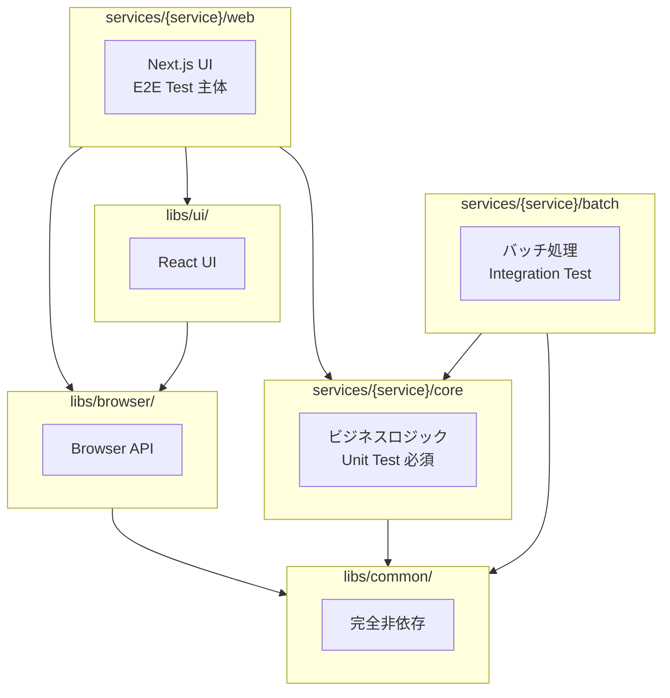

# モノレポ構成

## 目的

本ドキュメントは、nagiyu-platform のモノレポ構成における標準パターンと設計原則を定義する。

## 1. 用語定義

### ワークスペース (Workspace)

npm workspaces を使用してモノレポ内の各パッケージを管理する単位。`package.json` を持つディレクトリが1つのワークスペースとなる。

- **ルートワークスペース**: リポジトリルートの `package.json` でモノレポ全体を統括
- **パッケージワークスペース**: 各サービス・ライブラリの `package.json` で個別パッケージを定義

### 共通パッケージ (libs/\*)

全サービスで共有可能なライブラリパッケージ。

- **対象**: `libs/common/`, `libs/browser/`, `libs/ui/`, `libs/react/`, `libs/aws/`
- **責務**: フレームワーク・ブラウザAPI・AWS SDKに依存した汎用機能の提供
- **バージョン管理**: 各ライブラリで独立したバージョン管理

### 固有パッケージ (services/\*/xxx)

特定サービス専用のパッケージ。

- **対象**: `services/{service}/core`, `services/{service}/web`, `services/{service}/batch` など
- **責務**: サービス固有のビジネスロジック、UI、バッチ処理
- **バージョン管理**: 各パッケージで独立したバージョン管理

## 2. ディレクトリ構造

### 標準パターン

基本的なサービス構成は以下の3パッケージ構成を標準とする。

```
services/{service}/
├── core/           # ビジネスロジック（Unit Test 必須）
│   ├── src/
│   ├── tests/
│   ├── package.json
│   └── tsconfig.json
├── web/            # Next.js UI（E2E Test 主体）
│   ├── src/
│   ├── e2e/        # E2E テスト
│   ├── package.json
│   └── tsconfig.json
└── batch/          # バッチ処理（Integration Test）
    ├── src/
    ├── tests/
    ├── package.json
    └── tsconfig.json
```

### 拡張パターン

複数の Web アプリやバッチ処理が必要な場合、ハイフン区切りで拡張する。

```
services/{service}/
├── core/
├── web/            # メインWebアプリ
├── web-admin/      # 管理画面
├── web-api/        # API サーバー
├── batch/          # メインバッチ
├── batch-daily/    # 日次バッチ
└── batch-hourly/   # 時間毎バッチ
```

**命名規則**:

- ハイフン区切り（`web-admin`, `batch-daily`）
- 小文字のみ使用
- 役割を明確に表す名前

### 共通ライブラリ構造

```
libs/
├── common/         # フレームワーク非依存
│   ├── src/
│   ├── tests/
│   ├── package.json
│   └── tsconfig.json
├── browser/        # ブラウザAPI依存
│   ├── src/
│   ├── tests/
│   ├── package.json
│   └── tsconfig.json
├── ui/             # Next.js + Material-UI 依存
│   ├── src/
│   ├── tests/
│   ├── package.json
│   └── tsconfig.json
├── react/          # React依存（React hooks等）
│   ├── src/
│   ├── tests/
│   ├── package.json
│   └── tsconfig.json
└── aws/            # AWS SDK依存
    ├── src/
    ├── tests/
    ├── package.json
    └── tsconfig.json
```

## 3. 依存関係ルール

### 依存方向の図



### 依存関係の原則

1. **一方向性**: 依存は常に下位レイヤー（より汎用的なパッケージ）へ向かう
2. **循環依存禁止**: 上位パッケージから下位パッケージへの依存のみ許可
3. **独立性**: `libs/common` は外部依存なし（Node.js標準ライブラリのみ可）

### ライブラリ間の依存

```
libs/ui → libs/browser → libs/common
libs/react → libs/common
libs/aws (独立、外部依存なし)
```

- `libs/ui`: `libs/browser` に依存可
- `libs/browser`: `libs/common` に依存可
- `libs/react`: `libs/common` に依存可
- `libs/aws`: 独立（外部依存なし）
- `libs/common`: 外部依存なし

### 禁止パターン

```
❌ libs/common → libs/browser     # 下位から上位への依存
❌ libs/browser → libs/ui → libs/browser  # 循環依存
❌ services/{service}/core → services/{service}/web  # 逆方向の依存
❌ services/{serviceA}/core → services/{serviceB}/core  # サービス間の直接依存
```

## 4. パッケージ種別と役割

### services/{service}/core

**責務**: ビジネスロジックの実装

- ドメインロジック
- データ変換処理
- バリデーション
- ビジネスルール

**特徴**:

- UI フレームワーク非依存
- 純粋関数として実装推奨
- Unit Test 必須（カバレッジ 80%以上）

**依存可能なパッケージ**:

- `libs/common`

**ビルド**: 必須（Lambda 等で利用するため）

### services/{service}/web

**責務**: Web UI の実装

- Next.js アプリケーション
- React コンポーネント
- ページルーティング
- UI ロジック

**特徴**:

- `services/{service}/core` のビジネスロジックを利用
- E2E Test 主体（Playwright）
- PWA 対応可能

**依存可能なパッケージ**:

- `services/{service}/core`
- `libs/ui`
- `libs/browser`
- `libs/common`

**ビルド**: 不要（Next.js が実行時にビルド）

### services/{service}/batch

**責務**: バッチ処理の実装

- スケジュールジョブ
- データ処理
- 外部API連携

**特徴**:

- `services/{service}/core` のビジネスロジックを利用
- Integration Test 主体
- AWS Lambda 等で実行

**依存可能なパッケージ**:

- `services/{service}/core`
- `libs/common`

**ビルド**: 必須（Lambda にデプロイするため）

### libs/common

**責務**: 完全フレームワーク非依存の汎用ユーティリティ

- 共通型定義
- 汎用関数
- データ変換ロジック

**特徴**:

- 外部依存なし（Node.js標準ライブラリのみ可）
- 純粋関数として実装
- 高いテストカバレッジ維持

**パッケージ名**: `@nagiyu/common`

**ビルド**: 必須

### libs/browser

**責務**: ブラウザAPI依存のユーティリティ

- Clipboard API ラッパー
- localStorage/sessionStorage ラッパー
- その他ブラウザ固有APIの抽象化

**特徴**:

- SSR 対応（ブラウザ環境チェック）
- エラーハンドリングの統一
- テスト容易性（モック化しやすい設計）

**依存可能なパッケージ**:

- `libs/common`

**パッケージ名**: `@nagiyu/browser`

**ビルド**: 必須

### libs/ui

**責務**: Next.js + Material-UI 依存の UI コンポーネント

- Header, Footer コンポーネント
- ThemeRegistry（Material-UI プロバイダー）
- テーマ設定（カラーパレット、タイポグラフィ）
- グローバルCSS

**特徴**:

- React Server Components 対応
- Material-UI v7 使用
- Next.js v16+ 対応

**依存可能なパッケージ**:

- `libs/browser`
- `libs/common`

**パッケージ名**: `@nagiyu/ui`

**ビルド**: 必須

### libs/react

**責務**: React依存のユーティリティ

- React hooks（`useAPIRequest` 等）
- React コンポーネント
- React固有の抽象化

**特徴**:

- React に依存
- フレームワーク固有機能の提供
- テスト容易性（モック化しやすい設計）

**依存可能なパッケージ**:

- `libs/common`

**パッケージ名**: `@nagiyu/react`

**ビルド**: 必須

### libs/aws

**責務**: AWS SDK 補助・拡張ライブラリ

- DynamoDB Repository パターン実装
- エラークラス（`RepositoryError`、`EntityNotFoundError` 等）
- 抽象基底クラス（`AbstractDynamoDBRepository`）
- バリデーション関数
- ヘルパー関数

**特徴**:

- AWS SDK に依存（peerDependencies）
- Single Table Design 対応
- 型安全なマッピング
- 日本語エラーメッセージ

**依存可能なパッケージ**:

- なし（完全独立）

**パッケージ名**: `@nagiyu/aws`

**ビルド**: 必須

## 5. テスト戦略

### services/{service}/core

**テスト種別**: Unit Test（Jest）

**テスト対象**:

- ビジネスロジック
- データ変換処理
- バリデーション
- エラーハンドリング

**カバレッジ目標**: 80%以上必須

**配置**:

```
services/{service}/core/
└── tests/
    └── unit/
        ├── parser.test.ts
        └── formatter.test.ts
```

### services/{service}/web

**テスト種別**: E2E Test（Playwright）主体

**テスト対象**:

- ユーザーフロー
- クリティカルパス
- PWA機能（オフライン動作、インストール）

**テストデバイス**:

- chromium-desktop（Desktop Chrome 1920x1080）
- chromium-mobile（モバイルChrome Pixel 5想定）
- webkit-mobile（モバイルSafari iPhone想定）

**配置**:

```
services/{service}/web/
└── e2e/
    ├── basic.spec.ts
    └── pwa.spec.ts
```

**補足**: Unit Test は必要に応じて実施（複雑なUIロジックがある場合）

### services/{service}/batch

**テスト種別**: Integration Test（Jest）

**テスト対象**:

- バッチ処理フロー
- 外部API連携（モック使用）
- エラーハンドリング

**配置**:

```
services/{service}/batch/
└── tests/
    └── integration/
        └── batch.test.ts
```

### 共通ライブラリ（libs/\*）

**テスト種別**: Unit Test（Jest）

**カバレッジ目標**: 80%以上推奨

**配置**:

```
libs/{library}/
└── tests/
    └── unit/
        └── util.test.ts
```

詳細は [testing.md](./testing.md) を参照。

## 6. workspaces 設定

### 基本パターン

ルート `package.json` での標準設定:

```json
{
  "name": "nagiyu-platform",
  "private": true,
  "workspaces": ["services/*/core", "services/*/web", "services/*/batch", "libs/*"]
}
```

### 拡張パターン対応

複数の web/batch パッケージに対応:

```json
{
  "name": "nagiyu-platform",
  "private": true,
  "workspaces": [
    "services/*/core",
    "services/*/web",
    "services/*/web-*",
    "services/*/batch",
    "services/*/batch-*",
    "services/*/api",
    "libs/*"
  ]
}
```

**ポイント**:

- ワイルドカード `*` で柔軟なパターンマッチング
- `web-*`, `batch-*` で拡張パッケージに対応
- `api` 等の追加パターンも定義可能

### workspaces の利点

- **依存関係の自動解決**: ローカルパッケージ間の参照を自動的にシンボリックリンク
- **一括コマンド実行**: `npm run test --workspaces` 等でテストやリントを一括実行可能（注: ビルドは依存順序に従って順次実行が必要）
- **効率的な開発**: ローカル変更が即座に反映される

## 7. TypeScript Project References

### 基本方針

モノレポでは TypeScript Project References を活用し、型チェックとビルドを効率化する。

**利点**:

- 増分ビルドによる高速化
- パッケージ間の型情報の共有
- エディタでの型補完の改善

### composite 設定

依存されるパッケージ（`libs/*`, `services/*/core`）では `composite: true` を設定。

**`libs/common/tsconfig.json` の例**:

```json
{
  "extends": "../../configs/tsconfig.base.json",
  "compilerOptions": {
    "lib": ["ES2020"],
    "composite": true,
    "declaration": true,
    "outDir": "./dist"
  },
  "include": ["src/**/*", "tests/**/*"],
  "exclude": ["node_modules", "dist"]
}
```

**`libs/browser/tsconfig.json` の例**:

```json
{
  "extends": "../../configs/tsconfig.base.json",
  "compilerOptions": {
    "lib": ["ES2020", "DOM"],
    "composite": true,
    "declaration": true,
    "outDir": "./dist"
  },
  "include": ["src/**/*", "tests/**/*"],
  "exclude": ["node_modules", "dist"],
  "references": [{ "path": "../common" }]
}
```

### references 設定

依存するパッケージを `references` で指定。

**`services/tools/core/tsconfig.json` の例**:

```json
{
  "extends": "../../../configs/tsconfig.base.json",
  "compilerOptions": {
    "lib": ["ES2020"],
    "composite": true,
    "declaration": true,
    "outDir": "./dist"
  },
  "include": ["src/**/*", "tests/**/*"],
  "exclude": ["node_modules", "dist"],
  "references": [{ "path": "../../../libs/common" }]
}
```

**`services/tools/web/tsconfig.json` の例**:

```json
{
  "extends": "../../../configs/tsconfig.base.json",
  "compilerOptions": {
    "lib": ["DOM", "DOM.Iterable", "ES2020"],
    "jsx": "preserve",
    "paths": {
      "@/*": ["./src/*"]
    }
  },
  "include": ["next-env.d.ts", "**/*.ts", "**/*.tsx", ".next/types/**/*.ts"],
  "exclude": ["node_modules"],
  "references": [
    { "path": "../core" },
    { "path": "../../../libs/ui" },
    { "path": "../../../libs/browser" },
    { "path": "../../../libs/common" }
  ]
}
```

### 設定のポイント

- **`composite: true`**: 依存されるパッケージで必須
- **`declaration: true`**: 型定義ファイル（`.d.ts`）の出力を有効化
- **`references`**: 依存するパッケージを相対パスで指定
- **順序**: 依存関係の順序に従って references を記述
- **Next.js の場合**: `web` パッケージでは `composite` を設定しない（Next.js が独自にビルド）

## 8. 命名規則

### パッケージ名 (package.json の name フィールド)

**共通ライブラリ**:

- フォーマット: `@nagiyu/{library}`
- 例: `@nagiyu/common`, `@nagiyu/browser`, `@nagiyu/ui`

**サービス固有パッケージ**:

- フォーマット: `{service}-{type}` または `@{service}/{type}`
- 例: `tools-core`, `tools-web`, `tools-batch`
- 例（スコープ付き）: `@tools/core`, `@tools/web`

**拡張パッケージ**:

- フォーマット: `{service}-{type}-{suffix}`
- 例: `tools-web-admin`, `tools-batch-daily`

### ディレクトリ名

**基本ルール**:

- 小文字のみ使用
- ハイフン区切り（kebab-case）
- 役割を明確に表す名前

**例**:

```
✅ services/tools/web-admin/
✅ services/tools/batch-daily/
✅ libs/common/
❌ services/tools/WebAdmin/        # キャメルケース禁止
❌ services/tools/batch_daily/     # アンダースコア禁止
```

### ハイフン区切りルール

**標準パターン**: ハイフンなし

- `core`, `web`, `batch`

**拡張パターン**: ハイフン区切り

- `web-admin`: 管理画面
- `web-api`: API サーバー
- `batch-daily`: 日次バッチ
- `batch-hourly`: 時間毎バッチ

**禁止**:

- アンダースコア（`web_admin`）
- キャメルケース（`webAdmin`）
- パスカルケース（`WebAdmin`）

## 9. 境界保護 (ESLint)

### core の no-restricted-imports

`services/{service}/core` では UI フレームワークのインポートを禁止する。

**`services/{service}/core/eslint.config.mjs` の例**:

```javascript
import baseConfig from '../../../configs/eslint.config.base.mjs';

export default [
  ...baseConfig,
  {
    rules: {
      'no-restricted-imports': [
        'error',
        {
          patterns: [
            {
              group: ['react', 'react-dom', 'next', 'next/*'],
              message:
                'core パッケージでは UI フレームワークを使用できません。ビジネスロジックのみを実装してください。',
            },
            {
              group: ['@mui/*'],
              message: 'core パッケージでは Material-UI を使用できません。',
            },
          ],
        },
      ],
    },
  },
];
```

### 設定のポイント

- **目的**: ビジネスロジック（core）と UI（web）の境界を明確化
- **効果**: 誤って UI 依存のコードを core に混入するのを防ぐ
- **カスタマイズ**: サービスの特性に応じて禁止パターンを追加可能

### libs/common の境界保護

`libs/common` では外部依存を最小化する。

**`libs/common/eslint.config.mjs` の例**:

```javascript
import baseConfig from '../../configs/eslint.config.base.mjs';

export default [
  ...baseConfig,
  {
    rules: {
      'no-restricted-imports': [
        'error',
        {
          patterns: [
            {
              group: ['react', 'next', '@mui/*', '**/browser*'],
              message:
                'libs/common では外部フレームワークに依存できません。Node.js標準ライブラリのみ使用可能です。',
            },
          ],
        },
      ],
    },
  },
];
```

## 10. ビルド戦略

### ビルドの必要性

| パッケージ                 | ビルド要否 | 理由                                            |
| -------------------------- | ---------- | ----------------------------------------------- |
| `services/{service}/core`  | ✅ 必須    | Lambda 等で利用するため、トランスパイルが必要   |
| `services/{service}/web`   | ❌ 不要    | Next.js が実行時にビルド                        |
| `services/{service}/batch` | ✅ 必須    | Lambda にデプロイするため、トランスパイルが必要 |
| `libs/common`              | ✅ 必須    | 他パッケージから参照されるため                  |
| `libs/browser`             | ✅ 必須    | 他パッケージから参照されるため                  |
| `libs/ui`                  | ✅ 必須    | 他パッケージから参照されるため                  |
| `libs/react`               | ✅ 必須    | 他パッケージから参照されるため                  |
| `libs/aws`                 | ✅ 必須    | 他パッケージから参照されるため                  |

### CI ビルド順序

依存関係に基づき、以下の順序でビルドする。

**順序**:

1. **共通ライブラリ（依存なし）** - 並列実行可能

   ```bash
   npm run build --workspace @nagiyu/common
   npm run build --workspace @nagiyu/aws
   ```

2. **React/ブラウザライブラリ（common に依存）** - 並列実行可能

   ```bash
   npm run build --workspace @nagiyu/react
   npm run build --workspace @nagiyu/browser
   ```

3. **UI ライブラリ（browser に依存）**

   ```bash
   npm run build --workspace @nagiyu/ui
   ```

4. **サービス core（common に依存）**

   ```bash
   npm run build --workspace tools-core
   ```

5. **サービス batch（core に依存）**

   ```bash
   npm run build --workspace tools-batch
   ```

6. **サービス web（Next.js ビルド、任意）**
   ```bash
   npm run build --workspace tools-web
   ```

### GitHub Actions での実装例

```yaml
- name: Build shared libraries
  run: |
    npm run build --workspace @nagiyu/common && \
    npm run build --workspace @nagiyu/aws && \
    npm run build --workspace @nagiyu/react && \
    npm run build --workspace @nagiyu/browser && \
    npm run build --workspace @nagiyu/ui

- name: Build service core
  run: npm run build --workspace tools-core

- name: Build service batch
  run: npm run build --workspace tools-batch

- name: Build Next.js (optional)
  run: npm run build --workspace tools-web
```

### 重要な注意点

**並列ビルドの禁止**:

```bash
# ❌ 依存関係の順序が保証されず、エラーになる可能性
npm run build --workspaces
```

**順次ビルドの実施**:

```bash
# ✅ 依存関係の順序に従って順次ビルド
npm run build --workspace @nagiyu/common && \
npm run build --workspace @nagiyu/aws && \
npm run build --workspace @nagiyu/react && \
npm run build --workspace @nagiyu/browser && \
npm run build --workspace @nagiyu/ui
```

詳細は [shared-libraries.md](./shared-libraries.md) の「ビルド順序」セクションを参照。

## 参考

- [アーキテクチャ方針](./architecture.md): レイヤー分離、推奨パターン
- [共通ライブラリ設計](./shared-libraries.md): libs/\* の設計方針
- [テスト戦略](./testing.md): テスト配置、デバイス、カバレッジ
- [コーディング規約](./rules.md): TypeScript、エラーハンドリング、べからず集
- [共通設定ファイル](./configs.md): tsconfig.base.json、eslint.config.base.mjs
