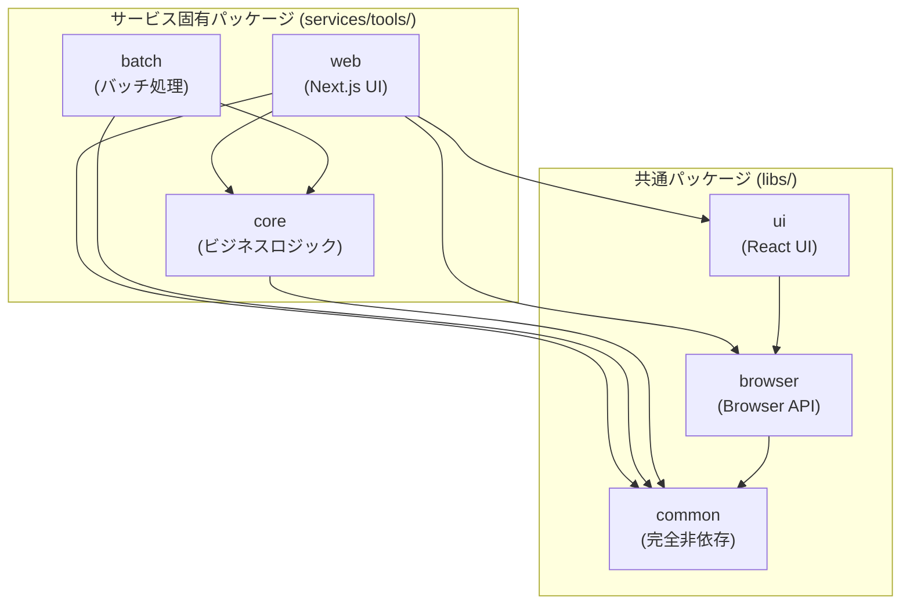

# 共通ライブラリ設計

## 目的

本ドキュメントは、プラットフォームにおける共通ライブラリの設計方針と利用ガイドラインを定義する。

## 基本方針

- **依存関係の明確化**: ライブラリ間の依存を一方向に保つ
- **責務の分離**: フレームワーク依存度によって分割
- **再利用性**: サービス間で共通コードを共有

## 共通パッケージと固有パッケージの関係

### パッケージの分類

本プラットフォームでは、以下の2種類のパッケージを使い分ける。

#### 共通パッケージ (libs/\*)

全サービスで共有可能なライブラリパッケージ。

- **対象**: `libs/common/`, `libs/browser/`, `libs/ui/`, `libs/aws/`
- **責務**: フレームワーク・ブラウザAPI・AWS SDKに依存した汎用機能の提供
- **バージョン管理**: 各ライブラリで独立したバージョン管理
- **パッケージ名**: `@nagiyu/common`, `@nagiyu/browser`, `@nagiyu/ui`, `@nagiyu/aws`

#### 固有パッケージ (services/\*/xxx)

特定サービス専用のパッケージ。

- **対象**: `services/{service}/core`, `services/{service}/web`, `services/{service}/batch` など
- **責務**: サービス固有のビジネスロジック、UI、バッチ処理
- **バージョン管理**: 各パッケージで独立したバージョン管理
- **パッケージ名**: `{service}-core`, `{service}-web`, `{service}-batch` など

### パッケージ間の依存関係

固有パッケージは共通パッケージに依存することができるが、共通パッケージは固有パッケージに依存してはならない。

```
services/{service}/web   → libs/ui, libs/browser, libs/common
services/{service}/core  → libs/common のみ
services/{service}/batch → libs/common のみ
```

詳細は「依存関係ルール」セクションを参照。

## ライブラリ構成

### ライブラリ分類

```
libs/
├── ui/           # Next.js + Material-UI 依存
├── browser/      # ブラウザAPI依存
├── aws/          # AWS SDK 依存
└── common/       # 完全フレームワーク非依存
```

### 依存関係ルール

#### 共通ライブラリ (libs/\*) 間の依存

```
ui → browser → common
```

- **一方向のみ**: 上位から下位への依存のみ許可
- **循環依存禁止**: 下位ライブラリは上位を参照しない
- **独立性**: common は外部依存なし

#### 固有パッケージから共通ライブラリへの依存

固有パッケージは、その責務に応じて特定の共通ライブラリのみに依存可能。

| 固有パッケージ     | 依存可能な共通ライブラリ                 | 理由                                   |
| ------------------ | ---------------------------------------- | -------------------------------------- |
| `services/*/core`  | `libs/common` のみ                       | ビジネスロジックはフレームワーク非依存 |
| `services/*/web`   | `libs/common`, `libs/browser`, `libs/ui` | UI実装にフレームワーク機能が必要       |
| `services/*/batch` | `libs/common` のみ                       | バッチ処理はフレームワーク非依存       |

#### 依存関係の図



#### 禁止パターン

```
❌ libs/common → services/*/core          # 共通から固有への依存
❌ services/*/core → libs/ui              # core から UI ライブラリへの依存
❌ services/*/batch → libs/ui             # batch から UI ライブラリへの依存
❌ services/{serviceA}/* → services/{serviceB}/*  # サービス間の直接依存
```

## libs/ui/

### 責務

Next.jsとMaterial-UIに依存するUIコンポーネント。

### 含まれるもの

- Header, Footer コンポーネント
- ThemeRegistry（Material-UIプロバイダー）
- theme.ts（カラーパレット、タイポグラフィ）
- グローバルCSS

### パッケージ名

`@nagiyu/ui`

### 利用方法

各サービスの package.json で参照。

## libs/browser/

### 責務

ブラウザAPIに依存するユーティリティ。

### 含まれるもの

- Clipboard APIラッパー
- localStorage/sessionStorageラッパー
- その他ブラウザ固有APIの抽象化

### パッケージ名

`@nagiyu/browser`

### 設計のポイント

- エラーハンドリングの統一
- SSR対応（ブラウザ環境チェック）
- テスト容易性（モック化しやすい設計）

## libs/common/

### 責務

完全フレームワーク非依存の汎用ユーティリティ。

### 含まれるもの

- 共通型定義
- 汎用ユーティリティ関数
- データ変換ロジック

### パッケージ名

`@nagiyu/common`

### 設計のポイント

- 純粋関数として実装
- 外部依存なし（Node.js標準ライブラリのみ可）
- 高いテストカバレッジを維持

## libs/aws/

### 責務

AWS SDK 補助・拡張ライブラリ。AWS SDKを使用する際の共通機能を提供。

### 含まれるもの

- DynamoDB Repository 用の共通エラークラス
    - `RepositoryError` (基底クラス)
    - `EntityNotFoundError`
    - `EntityAlreadyExistsError`
    - `InvalidEntityDataError`
    - `DatabaseError`

### パッケージ名

`@nagiyu/aws`

### サブパスエクスポート

- `@nagiyu/aws/dynamodb` - DynamoDB関連機能

### 設計のポイント

- AWS SDKをpeerDependenciesとして外部化
- サブパスエクスポートによる機能分離
- 日本語エラーメッセージの定数化
- 継承による階層的なエラー設計

### 使用例

```typescript
import {
  EntityNotFoundError,
  EntityAlreadyExistsError,
  InvalidEntityDataError,
  DatabaseError,
} from '@nagiyu/aws/dynamodb';

// エンティティが見つからない場合
throw new EntityNotFoundError('Alert', 'alert-123');

// データベースエラーが発生した場合
try {
  // DynamoDB操作
} catch (error) {
  throw new DatabaseError('アイテムの取得に失敗しました', error);
}
```

## バージョン管理

### 基本方針

- **各ライブラリで独立管理**: ui, browser, common それぞれが独自のバージョン
- **セマンティックバージョニング**: 破壊的変更はメジャーバージョンアップ
- **初期バージョン**: 1.0.0 から開始

### 更新の影響範囲

各ライブラリの更新は、それを利用するサービスにのみ影響。

## ビルド順序

### 依存関係に基づくビルド順序

ライブラリ間の依存関係により、ビルドは以下の順序で実行する必要があります:

1. 並列実行可能（依存なし）:
    - `@nagiyu/common`
    - `@nagiyu/aws`
2. `@nagiyu/browser` - `@nagiyu/common` に依存
3. `@nagiyu/ui` - `@nagiyu/browser` に依存

### 正しいビルドコマンド

**モノレポ全体をビルドする場合:**

```bash
npm run build --workspace @nagiyu/common
npm run build --workspace @nagiyu/aws
npm run build --workspace @nagiyu/browser
npm run build --workspace @nagiyu/ui
```

**重要**: `npm run build --workspaces` は並列実行されるため、依存関係の順序が保証されず、ビルドエラーが発生する可能性があります。

### CI/CDでのビルド

GitHub Actions などの CI/CD 環境でも、同じ順序でビルドを実行してください。

```yaml
- name: Build shared libraries
    run: |
        npm run build --workspace @nagiyu/common
        npm run build --workspace @nagiyu/aws
        npm run build --workspace @nagiyu/browser
        npm run build --workspace @nagiyu/ui
```

詳細は [testing.md](./testing.md) の「GitHub Actions ワークフロー設計パターン」を参照してください。

## 利用ガイド

### 共通ライブラリの使用 (Next.jsサービス)

Next.jsサービス（`services/{service}/web`）の package.json で必要なライブラリを指定。

```json
{
  "dependencies": {
    "@nagiyu/ui": "workspace:*",
    "@nagiyu/browser": "workspace:*",
    "@nagiyu/common": "workspace:*"
  }
}
```

### 固有パッケージでの使用

#### services/{service}/core の例

ビジネスロジックパッケージでは `@nagiyu/common` のみ使用。

```json
{
    "name": "tools-core",
    "dependencies": {
        "@nagiyu/common": "workspace:*"
    }
}
```

```typescript
// ビジネスロジックの実装
import { someUtil } from '@nagiyu/common';

export function processData(input: string): string {
    return someUtil(input);
}
```

#### services/{service}/web の例

Web UIパッケージでは、core パッケージと共通ライブラリを使用。

```json
{
    "name": "tools-web",
    "dependencies": {
        "tools-core": "workspace:*",
        "@nagiyu/ui": "workspace:*",
        "@nagiyu/browser": "workspace:*",
        "@nagiyu/common": "workspace:*"
    }
}
```

```typescript
// UIコンポーネントの実装
import { Header, Footer } from '@nagiyu/ui';
import { clipboard } from '@nagiyu/browser';
import { processData } from 'tools-core';

export default function ToolsPage() {
    const handleClick = async () => {
        const result = processData('input');
        await clipboard.writeText(result);
    };

    return (
        <>
            <Header />
            <button onClick={handleClick}>処理して貼り付け</button>
            <Footer />
        </>
    );
}
```

#### services/{service}/batch の例

バッチ処理パッケージでは、core パッケージと `@nagiyu/common` のみ使用。

```json
{
    "name": "tools-batch",
    "dependencies": {
        "tools-core": "workspace:*",
        "@nagiyu/common": "workspace:*"
    }
}
```

```typescript
// バッチ処理の実装
import { processData } from 'tools-core';
import { someUtil } from '@nagiyu/common';

export async function dailyBatch() {
    const data = await fetchData();
    const processed = processData(data);
    await saveResult(processed);
}
```

### インポート方法

```typescript
// 共通ライブラリのインポート
import { Header, Footer } from '@nagiyu/ui';
import { clipboard } from '@nagiyu/browser';
import { someUtil } from '@nagiyu/common';

// 固有パッケージのインポート (coreからの機能)
import { processData } from 'tools-core';
```

## ライブラリ内部の実装ルール

### パスエイリアス禁止

ライブラリ内部では相対パスのみ使用。

```typescript
// ❌ 禁止
import { something } from '@/components/Button';

// ✅ 推奨
import { something } from '../components/Button';
```

### 理由

- ライブラリとして配布する際の一貫性
- ビルド設定の複雑化を回避
- 依存関係の明確化

## TypeScript設定の方針

### テストコードも型チェック対象に含める

ライブラリの `tsconfig.json` では、`tests/` ディレクトリを型チェック対象に含める。

### 理由

- **早期発見**: テストコードの型エラーを開発時に検出
- **品質向上**: Testing Library のマッチャー（`toBeInTheDocument` 等）の型補完が効く
- **一貫性**: プロダクションコードと同じ型安全性をテストコードでも維持

### 設計のポイント

- `include` に `tests/**/*` を追加
- `rootDir` は指定しない（TypeScript が自動的に共通の親ディレクトリを判断）
- ビルド出力は `dist/src/` と `dist/tests/` に分かれるが、`package.json` の `exports` で `dist/src/index.js` を指定
- テストファイル（`.test.ts`）は実行時のみ使用され、配布には影響しない

## 拡張性

### 将来の展開

- 他フレームワーク対応（Vue, Svelte等）の場合、新しいライブラリを追加
- 依存関係ルールは維持（一方向性）

### 新規ライブラリの追加基準

- 複数サービスで共通利用される
- 明確な責務を持つ
- 既存ライブラリと責務が重複しない

## 参考

- [rules.md](./rules.md): コーディング規約・べからず集
- [service-template.md](./service-template.md): サービステンプレート
- [architecture.md](./architecture.md): アーキテクチャ方針
