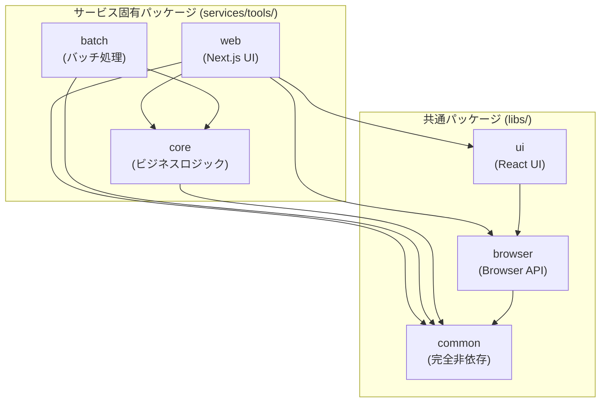

# 共通ライブラリ設計

## 目的

本ドキュメントは、プラットフォームにおける共通ライブラリの設計方針と利用ガイドラインを定義する。

## 基本方針

- **依存関係の明確化**: ライブラリ間の依存を一方向に保つ
- **責務の分離**: フレームワーク依存度によって分割
- **再利用性**: サービス間で共通コードを共有

## 共通パッケージと固有パッケージの関係

### パッケージの分類

本プラットフォームでは、以下の2種類のパッケージを使い分ける。

#### 共通パッケージ (libs/\*)

全サービスで共有可能なライブラリパッケージ。

- **対象**: `libs/common/`, `libs/browser/`, `libs/ui/`, `libs/aws/`
- **責務**: フレームワーク・ブラウザAPI・AWS SDKに依存した汎用機能の提供
- **バージョン管理**: 各ライブラリで独立したバージョン管理
- **パッケージ名**: `@nagiyu/common`, `@nagiyu/browser`, `@nagiyu/ui`, `@nagiyu/aws`

#### 固有パッケージ (services/\*/xxx)

特定サービス専用のパッケージ。

- **対象**: `services/{service}/core`, `services/{service}/web`, `services/{service}/batch` など
- **責務**: サービス固有のビジネスロジック、UI、バッチ処理
- **バージョン管理**: 各パッケージで独立したバージョン管理
- **パッケージ名**: `{service}-core`, `{service}-web`, `{service}-batch` など

### パッケージ間の依存関係

固有パッケージは共通パッケージに依存することができるが、共通パッケージは固有パッケージに依存してはならない。

```
services/{service}/web   → libs/ui, libs/browser, libs/common
services/{service}/core  → libs/common のみ
services/{service}/batch → libs/common のみ
```

詳細は「依存関係ルール」セクションを参照。

## ライブラリ構成

### ライブラリ分類

```
libs/
├── ui/           # Next.js + Material-UI 依存
├── browser/      # ブラウザAPI依存
├── aws/          # AWS SDK 依存
└── common/       # 完全フレームワーク非依存
```

### 依存関係ルール

#### 共通ライブラリ (libs/\*) 間の依存

```
ui → browser → common
```

- **一方向のみ**: 上位から下位への依存のみ許可
- **循環依存禁止**: 下位ライブラリは上位を参照しない
- **独立性**: common は外部依存なし

#### 固有パッケージから共通ライブラリへの依存

固有パッケージは、その責務に応じて特定の共通ライブラリのみに依存可能。

| 固有パッケージ     | 依存可能な共通ライブラリ                 | 理由                                   |
| ------------------ | ---------------------------------------- | -------------------------------------- |
| `services/*/core`  | `libs/common` のみ                       | ビジネスロジックはフレームワーク非依存 |
| `services/*/web`   | `libs/common`, `libs/browser`, `libs/ui` | UI実装にフレームワーク機能が必要       |
| `services/*/batch` | `libs/common` のみ                       | バッチ処理はフレームワーク非依存       |

#### 依存関係の図



#### 禁止パターン

```
❌ libs/common → services/*/core          # 共通から固有への依存
❌ services/*/core → libs/ui              # core から UI ライブラリへの依存
❌ services/*/batch → libs/ui             # batch から UI ライブラリへの依存
❌ services/{serviceA}/* → services/{serviceB}/*  # サービス間の直接依存
```

## libs/ui/

### 責務

Next.jsとMaterial-UIに依存するUIコンポーネント。

### 含まれるもの

- Header, Footer コンポーネント
- ThemeRegistry（Material-UIプロバイダー）
- theme.ts（カラーパレット、タイポグラフィ）
- グローバルCSS

### パッケージ名

`@nagiyu/ui`

### 利用方法

各サービスの package.json で参照。

## libs/browser/

### 責務

ブラウザAPIに依存するユーティリティ。

### 含まれるもの

- Clipboard APIラッパー
- localStorage/sessionStorageラッパー
- その他ブラウザ固有APIの抽象化

### パッケージ名

`@nagiyu/browser`

### 設計のポイント

- エラーハンドリングの統一
- SSR対応（ブラウザ環境チェック）
- テスト容易性（モック化しやすい設計）

## libs/common/

### 責務

完全フレームワーク非依存の汎用ユーティリティ。

### 含まれるもの

- 共通型定義
- 汎用ユーティリティ関数
- データ変換ロジック

### パッケージ名

`@nagiyu/common`

### 設計のポイント

- 純粋関数として実装
- 外部依存なし（Node.js標準ライブラリのみ可）
- 高いテストカバレッジを維持

## libs/aws/

### 責務

AWS SDK 補助・拡張ライブラリ。AWS SDKを使用する際の共通機能を提供。

### 含まれるもの

#### DynamoDB Repository 用の共通機能

- **エラークラス**:
  - `RepositoryError` (基底クラス)
  - `EntityNotFoundError`
  - `EntityAlreadyExistsError`
  - `InvalidEntityDataError`
  - `DatabaseError`

- **抽象基底クラス**:
  - `AbstractDynamoDBRepository` - CRUD操作の共通実装を提供

- **バリデーション関数**:
  - `validateStringField` - 文字列フィールドのバリデーション
  - `validateNumberField` - 数値フィールドのバリデーション
  - `validateEnumField` - 列挙型フィールドのバリデーション
  - `validateBooleanField` - 真偽値フィールドのバリデーション
  - `validateTimestampField` - タイムスタンプフィールドのバリデーション

- **ヘルパー関数**:
  - `buildUpdateExpression` - UpdateExpression を動的に生成
  - `conditionalPut` - 条件付きPUT（存在しない場合のみ作成）
  - `conditionalUpdate` - 条件付きUPDATE（存在する場合のみ更新）
  - `conditionalDelete` - 条件付きDELETE（存在する場合のみ削除）

- **型定義**:
  - `DynamoDBItem` - Single Table Design の基本Item構造
  - `PaginatedResult` - ページネーション結果
  - `RepositoryConfig` - リポジトリ設定

### パッケージ名

`@nagiyu/aws`

### peerDependencies

このパッケージは AWS SDK に依存しています。使用するプロジェクトでは、以下のパッケージを明示的にインストールする必要があります：

```json
{
  "dependencies": {
    "@nagiyu/aws": "workspace:*",
    "@aws-sdk/client-dynamodb": "^3.0.0",
    "@aws-sdk/lib-dynamodb": "^3.0.0"
  }
}
```

**理由**: AWS SDK は頻繁に更新されるため、各サービスで必要なバージョンを柔軟に選択できるようにするため、`@nagiyu/aws` では peerDependencies として管理しています。

### 使用例

#### 基本的なリポジトリ実装

```typescript
import {
  AbstractDynamoDBRepository,
  type DynamoDBItem,
  validateStringField,
  validateTimestampField,
} from '@nagiyu/aws';
import { DynamoDBDocumentClient } from '@aws-sdk/lib-dynamodb';

interface User {
  userId: string;
  name: string;
  email: string;
  createdAt: number;
  updatedAt: number;
}

class UserRepository extends AbstractDynamoDBRepository<User, { userId: string }> {
  constructor(docClient: DynamoDBDocumentClient, tableName: string) {
    super(docClient, {
      tableName,
      entityType: 'User',
    });
  }

  protected buildKeys(key: { userId: string }) {
    return {
      PK: `USER#${key.userId}`,
      SK: 'PROFILE',
    };
  }

  protected mapToEntity(item: Record<string, unknown>): User {
    return {
      userId: validateStringField(item.UserId, 'UserId'),
      name: validateStringField(item.Name, 'Name'),
      email: validateStringField(item.Email, 'Email'),
      createdAt: validateTimestampField(item.CreatedAt, 'CreatedAt'),
      updatedAt: validateTimestampField(item.UpdatedAt, 'UpdatedAt'),
    };
  }

  protected mapToItem(
    entity: Omit<User, 'createdAt' | 'updatedAt'>
  ): Omit<DynamoDBItem, 'CreatedAt' | 'UpdatedAt'> {
    const keys = this.buildKeys({ userId: entity.userId });
    return {
      ...keys,
      Type: this.config.entityType,
      UserId: entity.userId,
      Name: entity.name,
      Email: entity.email,
    };
  }
}
```

#### CRUD操作の使用

```typescript
const docClient = DynamoDBDocumentClient.from(new DynamoDBClient({ region: 'ap-northeast-1' }));
const userRepository = new UserRepository(docClient, 'MyTable');

// 作成
const newUser = await userRepository.create({
  userId: 'user-123',
  name: 'John Doe',
  email: 'john@example.com',
});

// 取得
const user = await userRepository.getById({ userId: 'user-123' });

// 更新
const updated = await userRepository.update({ userId: 'user-123' }, { name: 'Jane Doe' });

// 削除
await userRepository.delete({ userId: 'user-123' });
```

#### エラーハンドリング

```typescript
import { EntityNotFoundError, EntityAlreadyExistsError, DatabaseError } from '@nagiyu/aws';

try {
  const user = await userRepository.getById({ userId: 'user-123' });
  if (!user) {
    throw new EntityNotFoundError('User', 'user-123');
  }
} catch (error) {
  if (error instanceof EntityNotFoundError) {
    console.error('ユーザーが見つかりません:', error.message);
  } else if (error instanceof DatabaseError) {
    console.error('データベースエラー:', error.message);
  } else {
    throw error;
  }
}
```

### 設計のポイント

- **AWS SDKを通常の依存関係として管理**: 各サービスで必要なバージョンを選択可能
- **日本語エラーメッセージの定数化**: ユーザーフレンドリーなエラーメッセージ
- **継承による階層的なエラー設計**: エラータイプごとに適切な処理が可能
- **型安全なバリデーション**: バリデーション関数により、DynamoDBからのデータを型安全にマッピング
- **CRUD操作の共通化**: AbstractDynamoDBRepository により、実装の重複を削減
- **Single Table Design 対応**: DynamoDBItem 型により、Single Table Design を標準化

### 参考ドキュメント

詳細な使い方は以下のドキュメントを参照してください：

- [Repository Pattern 設計ガイド](./repository-pattern.md)
- [Repository Pattern 移行ガイド](./repository-migration.md)
- 実装例: `services/stock-tracker/core/src/repositories/`

## バージョン管理

### 基本方針

- **各ライブラリで独立管理**: ui, browser, common それぞれが独自のバージョン
- **セマンティックバージョニング**: 破壊的変更はメジャーバージョンアップ
- **初期バージョン**: 1.0.0 から開始

### 更新の影響範囲

各ライブラリの更新は、それを利用するサービスにのみ影響。

## ビルド順序

### 依存関係に基づくビルド順序

ライブラリ間の依存関係により、ビルドは以下の順序で実行する必要があります:

1. 並列実行可能（依存なし）:
   - `@nagiyu/common`
   - `@nagiyu/aws`
2. `@nagiyu/browser` - `@nagiyu/common` に依存
3. `@nagiyu/ui` - `@nagiyu/browser` に依存

### 正しいビルドコマンド

**モノレポ全体をビルドする場合:**

```bash
npm run build --workspace @nagiyu/common
npm run build --workspace @nagiyu/aws
npm run build --workspace @nagiyu/browser
npm run build --workspace @nagiyu/ui
```

**重要**: `npm run build --workspaces` は並列実行されるため、依存関係の順序が保証されず、ビルドエラーが発生する可能性があります。

### CI/CDでのビルド

GitHub Actions などの CI/CD 環境でも、同じ順序でビルドを実行してください。

```yaml
- name: Build shared libraries
    run: |
        npm run build --workspace @nagiyu/common
        npm run build --workspace @nagiyu/aws
        npm run build --workspace @nagiyu/browser
        npm run build --workspace @nagiyu/ui
```

詳細は [testing.md](./testing.md) の「GitHub Actions ワークフロー設計パターン」を参照してください。

## 利用ガイド

### 共通ライブラリの使用 (Next.jsサービス)

Next.jsサービス（`services/{service}/web`）の package.json で必要なライブラリを指定。

```json
{
  "dependencies": {
    "@nagiyu/ui": "workspace:*",
    "@nagiyu/browser": "workspace:*",
    "@nagiyu/common": "workspace:*"
  }
}
```

### 固有パッケージでの使用

#### services/{service}/core の例

ビジネスロジックパッケージでは `@nagiyu/common` のみ使用。

```json
{
  "name": "tools-core",
  "dependencies": {
    "@nagiyu/common": "workspace:*"
  }
}
```

```typescript
// ビジネスロジックの実装
import { someUtil } from '@nagiyu/common';

export function processData(input: string): string {
  return someUtil(input);
}
```

#### services/{service}/web の例

Web UIパッケージでは、core パッケージと共通ライブラリを使用。

```json
{
  "name": "tools-web",
  "dependencies": {
    "tools-core": "workspace:*",
    "@nagiyu/ui": "workspace:*",
    "@nagiyu/browser": "workspace:*",
    "@nagiyu/common": "workspace:*"
  }
}
```

```typescript
// UIコンポーネントの実装
import { Header, Footer } from '@nagiyu/ui';
import { clipboard } from '@nagiyu/browser';
import { processData } from 'tools-core';

export default function ToolsPage() {
    const handleClick = async () => {
        const result = processData('input');
        await clipboard.writeText(result);
    };

    return (
        <>
            <Header />
            <button onClick={handleClick}>処理して貼り付け</button>
            <Footer />
        </>
    );
}
```

#### services/{service}/batch の例

バッチ処理パッケージでは、core パッケージと `@nagiyu/common` のみ使用。

```json
{
  "name": "tools-batch",
  "dependencies": {
    "tools-core": "workspace:*",
    "@nagiyu/common": "workspace:*"
  }
}
```

```typescript
// バッチ処理の実装
import { processData } from 'tools-core';
import { someUtil } from '@nagiyu/common';

export async function dailyBatch() {
  const data = await fetchData();
  const processed = processData(data);
  await saveResult(processed);
}
```

### インポート方法

```typescript
// 共通ライブラリのインポート
import { Header, Footer } from '@nagiyu/ui';
import { clipboard } from '@nagiyu/browser';
import { someUtil } from '@nagiyu/common';

// 固有パッケージのインポート (coreからの機能)
import { processData } from 'tools-core';
```

## ライブラリ内部の実装ルール

### パスエイリアス禁止

ライブラリ内部では相対パスのみ使用。

```typescript
// ❌ 禁止
import { something } from '@/components/Button';

// ✅ 推奨
import { something } from '../components/Button';
```

### 理由

- ライブラリとして配布する際の一貫性
- ビルド設定の複雑化を回避
- 依存関係の明確化

## TypeScript設定の方針

### テストコードも型チェック対象に含める

ライブラリの `tsconfig.json` では、`tests/` ディレクトリを型チェック対象に含める。

### 理由

- **早期発見**: テストコードの型エラーを開発時に検出
- **品質向上**: Testing Library のマッチャー（`toBeInTheDocument` 等）の型補完が効く
- **一貫性**: プロダクションコードと同じ型安全性をテストコードでも維持

### 設計のポイント

- `include` に `tests/**/*` を追加
- `rootDir` は指定しない（TypeScript が自動的に共通の親ディレクトリを判断）
- ビルド出力は `dist/src/` と `dist/tests/` に分かれるが、`package.json` の `exports` で `dist/src/index.js` を指定
- テストファイル（`.test.ts`）は実行時のみ使用され、配布には影響しない

## 拡張性

### 将来の展開

- 他フレームワーク対応（Vue, Svelte等）の場合、新しいライブラリを追加
- 依存関係ルールは維持（一方向性）

### 新規ライブラリの追加基準

- 複数サービスで共通利用される
- 明確な責務を持つ
- 既存ライブラリと責務が重複しない

## 参考

- [rules.md](./rules.md): コーディング規約・べからず集
- [service-template.md](./service-template.md): サービステンプレート
- [architecture.md](./architecture.md): アーキテクチャ方針
