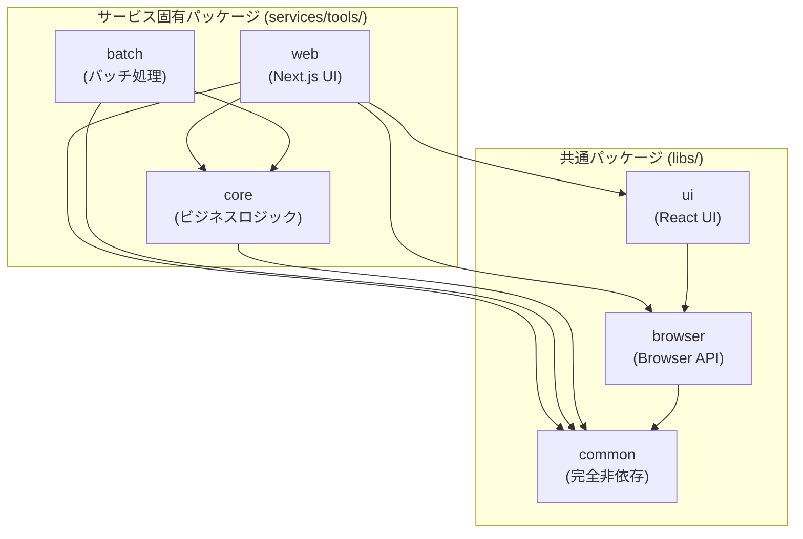

# 共通ライブラリ設計

## 目的

本ドキュメントは、プラットフォームにおける共通ライブラリの設計方針と利用ガイドラインを定義する。

## 基本方針

- **依存関係の明確化**: ライブラリ間の依存を一方向に保つ
- **責務の分離**: フレームワーク依存度によって分割
- **再利用性**: サービス間で共通コードを共有

## 共通パッケージと固有パッケージの関係

### パッケージの分類

本プラットフォームでは、以下の2種類のパッケージを使い分ける。

#### 共通パッケージ (libs/\*)

全サービスで共有可能なライブラリパッケージ。

- **対象**: `libs/common/`, `libs/browser/`, `libs/ui/`, `libs/react/`, `libs/nextjs/`, `libs/aws/`
- **責務**: フレームワーク・ブラウザAPI・React・Next.js・AWS SDKに依存した汎用機能の提供
- **バージョン管理**: 各ライブラリで独立したバージョン管理
- **パッケージ名**: `@nagiyu/common`, `@nagiyu/browser`, `@nagiyu/ui`, `@nagiyu/react`, `@nagiyu/nextjs`, `@nagiyu/aws`

#### 固有パッケージ (services/\*/xxx)

特定サービス専用のパッケージ。

- **対象**: `services/{service}/core`, `services/{service}/web`, `services/{service}/batch` など
- **責務**: サービス固有のビジネスロジック、UI、バッチ処理
- **バージョン管理**: 各パッケージで独立したバージョン管理
- **パッケージ名**: `{service}-core`, `{service}-web`, `{service}-batch` など

### パッケージ間の依存関係

固有パッケージは共通パッケージに依存することができるが、共通パッケージは固有パッケージに依存してはならない。

```
services/{service}/web   → libs/ui, libs/browser, libs/common
services/{service}/core  → libs/common のみ
services/{service}/batch → libs/common のみ
```

詳細は「依存関係ルール」セクションを参照。

## ライブラリ構成

### ライブラリ分類

```
libs/
├── ui/           # Next.js + Material-UI 依存
├── browser/      # ブラウザAPI依存
├── react/        # React依存
├── nextjs/       # Next.js依存（APIルートヘルパー等）
├── aws/          # AWS SDK 依存
└── common/       # 完全フレームワーク非依存
```

### 依存関係ルール

#### 共通ライブラリ (libs/\*) 間の依存

```
ui → browser → common
react → common
nextjs → common
aws (モノレポ内の他ライブラリに依存しない)
```

- **一方向のみ**: 上位から下位への依存のみ許可
- **循環依存禁止**: 下位ライブラリは上位を参照しない
- **独立性**: common は外部依存なし、aws はモノレポ内の他ライブラリに依存しない

#### 固有パッケージから共通ライブラリへの依存

固有パッケージは、その責務に応じて特定の共通ライブラリのみに依存可能。

| 固有パッケージ     | 依存可能な共通ライブラリ                 | 理由                                   |
| ------------------ | ---------------------------------------- | -------------------------------------- |
| `services/*/core`  | `libs/common` のみ                       | ビジネスロジックはフレームワーク非依存 |
| `services/*/web`   | `libs/common`, `libs/browser`, `libs/ui` | UI実装にフレームワーク機能が必要       |
| `services/*/batch` | `libs/common` のみ                       | バッチ処理はフレームワーク非依存       |

#### 依存関係の図


```mermaid
flowchart TB
    subgraph services["サービス固有パッケージ (services/tools/)"]
        web["web<br/>(Next.js UI)"]
        core["core<br/>(ビジネスロジック)"]
        batch["batch<br/>(バッチ処理)"]
    end

    subgraph libs["共通パッケージ (libs/)"]
        ui["ui<br/>(React UI)"]
        browser["browser<br/>(Browser API)"]
        common["common<br/>(完全非依存)"]
    end

    web --> core
    web --> ui
    web --> browser
    web --> common

    batch --> core
    batch --> common

    core --> common

    ui --> browser
    browser --> common
```

#### 禁止パターン

```
❌ libs/common → services/*/core          # 共通から固有への依存
❌ services/*/core → libs/ui              # core から UI ライブラリへの依存
❌ services/*/batch → libs/ui             # batch から UI ライブラリへの依存
❌ services/{serviceA}/* → services/{serviceB}/*  # サービス間の直接依存
```

## libs/ui/

### 責務

Next.jsとMaterial-UIに依存するUIコンポーネント。

### 含まれるもの

- Header, Footer コンポーネント
- AppLayout（MUI テーマプロバイダー・`AppRouterCacheProvider` ラッパー）
- ServiceLayout（`AppLayout + Header + main + Footer` の標準レイアウト）
- AppThemeProvider（`AppRouterCacheProvider + ThemeProvider + CssBaseline` の軽量プロバイダー。`ServiceLayout` を採用しないサービス向け）
- theme.ts（カラーパレット、タイポグラフィ）
- グローバルCSS
- ServiceWorkerRegistration
- ErrorBoundary（React エラーキャッチ用クラスコンポーネント）
- ErrorAlert（MUI Alert ラッパー。アクセシビリティ対応済みのエラー表示）
- LoadingState（MUI CircularProgress ラッパー。ローディング表示）
- ConfirmDialog（汎用確認ダイアログ。削除系操作の確認に利用。Props: `open / title / description / confirmLabel / cancelLabel / loading / onConfirm / onCancel`）

### パッケージ名

`@nagiyu/ui`

### 利用方法

各サービスの package.json で参照。

### エラー・ローディング表示

サービスの web パッケージでエラーやローディング状態を表示する場合は `@nagiyu/ui` のコンポーネントを利用する。

- **`ErrorBoundary`**: React のエラーバウンダリ。コンポーネントツリーで発生したエラーをキャッチして代替 UI を表示する。`'use client'` コンポーネント。
- **`ErrorAlert`**: MUI `Alert` をラップしたエラー表示コンポーネント。アクセシビリティ対応済み。`'use client'` コンポーネント。
- **`LoadingState`**: MUI `CircularProgress` をラップしたローディング表示コンポーネント。`'use client'` コンポーネント。

各コンポーネントのインポート元は `@nagiyu/ui`（ルートインデックス）。

## libs/react/

### 責務

React依存のユーティリティ。

### 含まれるもの

- React hooks（`useAPIRequest` 等）
- React コンポーネント
- React固有の抽象化
- Web Push 購読 Hook（`usePushSubscription`）

### パッケージ名

`@nagiyu/react`

### 設計のポイント

- React に依存
- フレームワーク固有機能の提供
- テスト容易性（モック化しやすい設計）

### Web Push 購読 Hook（`usePushSubscription`）

`@nagiyu/browser` の `subscribePush` を React Hook としてラップしたもの。状態管理（`supported` / `permission` / `subscribed` / `loading` / `error`）と `subscribe()` / `unsubscribe()` メソッドを提供する。

```tsx
import { usePushSubscription } from '@nagiyu/react';

function NotifyButton() {
  const { supported, subscribed, loading, error, subscribe, unsubscribe } = usePushSubscription({
    vapidPublicKey: () => fetchVapidPublicKey(),
    onSubscribed: async (subscription) => {
      await fetch('/api/push/subscribe', {
        method: 'POST',
        body: JSON.stringify(subscription),
      });
    },
  });
  // ...
}
```

- 初期化時に既存 subscription をチェックして `subscribed` を反映する。
- 取得した `subscription` を後続の API 呼び出しで利用する必要がある場合（例: stock-tracker の `/api/alerts`）は、Hook ではなく `subscribePush` を直接呼ぶ方が自然。

## libs/nextjs/

### 責務

Next.js に依存するユーティリティ。

### 含まれるもの

- APIルート認証ヘルパー（`withAuth`）
- リポジトリ初期化ヘルパー
- ページネーション
- APIエラーレスポンス生成（`handleApiError`・`createErrorResponse`）
- NextAuth 設定ファクトリ（`createAuthConfig`・`createServiceAuthConfig`）
- Health ルートファクトリ（`createHealthRoute`）
- NextAuth 型定義（`types/next-auth.d.ts`）
- 認証ミドルウェアファクトリ（`createAuthMiddleware`）
- セッション取得ファクトリ（`createSessionGetter`）
- Push ルートファクトリ（`createVapidPublicKeyRoute`・`createPushSubscribeRoute`・`validatePushSubscription`・`createSubscriptionId`）

### パッケージ名

`@nagiyu/nextjs`

### 設計のポイント

- Next.js API Route 専用
- `@nagiyu/common` のみに依存
- テスト容易性（モック化しやすい設計）

### NextAuth 設定の共通化

プラットフォーム内の NextAuth 設定（Cookie オプション・セッション設定・コールバック）は、`@nagiyu/nextjs` が提供するファクトリ関数を利用して統一する。

- **Auth サービス（OAuth プロバイダーあり）**: `createAuthConfig()` を利用（providers は呼び出し側で指定）
- **Consumer サービス（OAuth プロバイダーなし）**: `createServiceAuthConfig()` を利用（`pages.signIn` を自動設定）

`createServiceAuthConfig({ includeSubAsUserIdFallback?: boolean })` は NextAuth の `session`・`cookies`・`callbacks`・`pages` を含む設定オブジェクトを返す。`NEXT_PUBLIC_AUTH_URL/signin` をサインインページとして自動設定するため、各サービスで個別指定は不要。`sub` クレームを userId のフォールバックとして使う場合は `includeSubAsUserIdFallback: true` を指定する。

### NextAuth 型定義の集約

プラットフォーム全体で共通の NextAuth 型定義（`Session`, `User`, `JWT`）は `libs/nextjs/src/types/next-auth.d.ts` に集約する。各サービスに `types/next-auth.d.ts` を個別配置しない。

### Health ルートの共通化

全サービスの Health ルートは `createHealthRoute({ service, version })` で生成する。サービス名とバージョンをオプションとして渡すことで、統一されたレスポンス形式を保証する。

### 認証ミドルウェアの共通化

Consumer サービスのミドルウェアは `createAuthMiddleware()` を利用して統一する。オプションとして `getSignInBaseUrl`（サインインページの URL 生成）、`getCallbackUrl`（コールバック URL 生成）、`onAuthConfigError`（設定エラー時のハンドラー）を受け取る。`SKIP_AUTH_CHECK` 環境変数を設定すると、開発・テスト時に認証チェックをバイパスできる。

### セッション取得の共通化

Consumer サービスのセッション取得は `createSessionGetter()` を利用して統一する。オプションとして `auth`（サービスの auth 関数）、`createTestSession`（`SKIP_AUTH_CHECK` 有効時に返すモックセッション生成関数）、`mapSession`（NextAuth セッションをサービス固有のセッション型に変換する関数、**省略可**）を受け取る。`mapSession` を省略した場合は NextAuth セッションをそのままパススルーする。`createAuthCallbacks` 等でセッション形状が既に正規化されている場合は `mapSession` を省略してよい。

### Web Push ルートの共通化

Push 通知機能を持つサービスの API ルートは `@nagiyu/nextjs` が提供するファクトリ関数を利用して実装する。

- **`createVapidPublicKeyRoute()`**: VAPID 公開鍵を返す `GET /api/push/vapid-public-key` ルートハンドラーを生成する。`VAPID_PUBLIC_KEY` 環境変数が未設定の場合は 500 エラーを返す。
- **`createPushSubscribeRoute()`**: Push サブスクリプション登録用のルートハンドラーを生成する。
- **`validatePushSubscription(subscription)`**: Push サブスクリプション情報のバリデーション。endpoint が有効な URL 形式で keys.p256dh と keys.auth が非空文字列の場合に `true` を返す type guard。
- **`createSubscriptionId(endpoint)`**: Push サブスクリプション endpoint を SHA-256 ハッシュで一意な ID（`sub_` プレフィックス + 32文字）に変換する。

### next.config.ts の transpilePackages 標準設定

全 web サービスの `next.config.ts` で共通して指定すべきベースリスト:

- `@nagiyu/ui`
- `@nagiyu/browser`
- `@nagiyu/common`
- `@nagiyu/nextjs`

サービス固有の追加パッケージ（必要に応じて追加）: `@nagiyu/aws`, `@nagiyu/react`, `@nagiyu/{service}-core` など

## libs/browser/

### 責務

ブラウザAPIに依存するユーティリティ。

### 含まれるもの

- Clipboard APIラッパー
- localStorage/sessionStorageラッパー
- Web Push 用 Base64 URL デコード（`urlBase64ToUint8Array`）
- Web Push 購読フロー（`subscribePush`）
- その他ブラウザ固有APIの抽象化

### パッケージ名

`@nagiyu/browser`

### 設計のポイント

- エラーハンドリングの統一
- SSR対応（ブラウザ環境チェック）
- テスト容易性（モック化しやすい設計）

### Web Push 購読フロー（`subscribePush`）

Web Push の購読フローを 1 関数に集約する。サービス側の重複（permission 取得 → SW 登録 → vapid 取得 → `pushManager.subscribe` → サーバへの POST）を解消する。

```ts
import { subscribePush } from '@nagiyu/browser';

const subscription = await subscribePush({
  vapidPublicKey: () => fetchVapidPublicKey(),
  swPath: '/service-worker.js',
  onSubscribed: async (subscription) => {
    await fetch('/api/push/subscribe', {
      method: 'POST',
      body: JSON.stringify(subscription),
    });
  },
});
```

- `vapidPublicKey` は `string` または `() => Promise<string>` を受け付ける。関数形式の場合、許可チェック後にのみ呼ばれる（許可拒否時に不要な fetch を避ける）。
- `swPath` 省略時は `/service-worker.js` を使用する。
- `onSubscribed` は購読成功時に呼ばれるコールバック。サーバへの POST ボディ形式の差異を呼び出し側で吸収する。
- 既存 subscription がある場合は再利用する（重複登録を避ける）。
- 非対応ブラウザ・許可拒否時は `PUSH_ERROR_MESSAGES` 由来のエラーをスローする。

Hook として状態管理込みで利用したい場合は `@nagiyu/react` の `usePushSubscription` を併用する。

## libs/common/

### 責務

完全フレームワーク非依存の汎用ユーティリティ。

### 含まれるもの

- 共通型定義
- Pushサブスクリプション共通型
- 汎用ユーティリティ関数
- データ変換ロジック
- 共通エラーメッセージ定数（`COMMON_ERROR_MESSAGES`）
- バックエンド向けリトライ処理（`withRetry<T>`・`RetryOptions`・`DEFAULT_RETRY_OPTIONS`）
- Web Push 用 VAPID キー正規化（`normalizeVapidKey`）
- Web Push VAPID 設定取得（`getVapidConfig`）
- Web Push 送信クライアント（`sendWebPushNotification`）

### パッケージ名

`@nagiyu/common`

### 設計のポイント

- 純粋関数として実装
- 外部依存なし（Node.js標準ライブラリのみ可）
- 高いテストカバレッジを維持

### User 型定義

プラットフォーム全体で使用するユーザー情報の型は `@nagiyu/common` の `User` インターフェースを利用する。各サービスが独自の `User` 型を定義してはならない。

- **主要フィールド**: `userId`・`googleId`・`email`・`name`・`roles`・`createdAt`・`updatedAt`
- **`picture?: string`**: OAuth プロバイダーから取得したプロフィール画像 URL（省略可能）。UI で表示する際は XSS 対策を遵守すること（`dangerouslySetInnerHTML` 禁止）

### Web Push VAPID 設定

バッチサービスから Web Push を送信する際の VAPID 設定は `@nagiyu/common/push` の `getVapidConfig()` で取得する。

- **戻り値**: `publicKey`・`privateKey`・`subject` を含む `VapidConfig` オブジェクト
- **環境変数**: `VAPID_PUBLIC_KEY`・`VAPID_PRIVATE_KEY` を参照する
- **サーバーサイド専用**: VAPID 秘密鍵をクライアントサイドに露出しないよう、バッチ・バックエンドでのみ使用すること
- **サービス側での個別実装禁止**: 各サービスで VAPID 設定を環境変数から直接読み込む実装を作らず、この関数を利用すること

### Web Push 送信クライアント

バッチサービスから Web Push 通知を送信する場合は `@nagiyu/common/push` の `sendWebPushNotification` を利用する。

- **引数**: `subscription`（`PushSubscription`）、`payload`（`NotificationPayload`）、`vapidConfig`（`VapidConfig`）
- **戻り値**: 成功時 `true`、失敗時（410/404 含む）`false`
- **VAPID 未設定時**: 例外をスロー
- **VAPID 設定の取得**: `VapidConfig` は `getVapidConfig()` で取得して渡すこと
- **インポートパス**: `@nagiyu/common/push`（ルートインデックスではなくサブパスから参照すること。不要なモジュールの読み込みを避けるため）
- **薄いラッパー禁止**: サービス側で `sendWebPushNotification()` をラップした関数を作らず、呼び出し元から直接呼び出すこと
- **通知アイコン**: 通知ペイロードの `icon` は `@nagiyu/common/push` の `DEFAULT_NOTIFICATION_ICON` を利用する。サービス側で同一の URL をハードコードしない（サービス共通のアイコンを差し替える際の影響範囲を最小化するため）

### API レスポンス型の共通化

API ルートのレスポンス型は `@nagiyu/common` から提供される共通型を利用する。サービス側で同等の型を再定義しない。

- **`ApiSuccessResponse<T>`**: 成功レスポンス `{ data: T }`
- **`APIErrorResponse`（別名 `ErrorResponse`）**: エラーレスポンス `{ error: string; message: string; details?: string[] }`
- **`ApiResponse<T>`**: 成功・失敗のユニオン型 `ApiSuccessResponse<T> | APIErrorResponse`

**エラーレスポンスはフラット形式 `{ error, message, details? }` を標準とする**。`{ error: { code, message } }` のようなネスト形式を新たに導入しない（API クライアント側の取り扱いを統一するため）。

## libs/aws/

### 責務

AWS SDK 補助・拡張ライブラリ。DynamoDB Repository パターン実装のための共通機能を提供。

### 設計思想

- **標準化**: Repository パターンの一貫した実装を保証
- **型安全性**: バリデーションによる実行時エラーの早期発見
- **エラーの意味付け**: 技術的エラーをビジネス文脈に変換

### 含まれるもの

- **エラークラス**: 階層的なエラー設計（`RepositoryError`基底、`EntityNotFoundError`等）
- **抽象基底クラス**: CRUD操作の共通実装（`AbstractDynamoDBRepository`）
- **バリデーション関数**: 型安全なマッピング（文字列、数値、列挙型、タイムスタンプ等）
- **ヘルパー関数**: 条件付き操作、UpdateExpression生成
- **型定義**: Single Table Design対応（`DynamoDBItem`、`PaginatedResult`等）
- **DynamoDB クライアントファクトリ**: `getDynamoDBDocumentClient()`、`getTableName()`、`clearDynamoDBClientCache()`
- **Batch クライアントファクトリ**: `getBatchClient()`、`clearBatchClientCache()`
- **リポジトリファクトリー共通化ヘルパー**: InMemory/DynamoDB の切り替えを含む初期化処理を共通化

### AbstractDynamoDBRepository 適用方針

新規追加する DynamoDB リポジトリには `AbstractDynamoDBRepository<TEntity, TKey>` を継承する。

- **新規リポジトリへの適用**: `getById`・`create`・`update`・`delete` の共通 CRUD 実装を活用し、サービス固有のロジックのみを追加する。
- **既存リポジトリの移行は段階的**: 複数パラメータのキー・非標準 CRUD インターフェース・GSI 更新ロジックなど基底クラスと非互換のリポジトリが存在するため、既存リポジトリへの適用は大きな変更が発生したタイミングで対応する。

### DynamoDB クライアントファクトリ

サービス間で共通の DynamoDB クライアント初期化パターンを `@nagiyu/aws` のファクトリ関数として提供する。

- `getDynamoDBDocumentClient(region?)`: リージョン別シングルトンを返す。未指定時は `AWS_REGION` 環境変数、さらに未設定の場合は `us-east-1` をデフォルトとする。
- `getTableName(defaultValue?)`: `DYNAMODB_TABLE_NAME` 環境変数を検証して返す。
- `clearDynamoDBClientCache()`: テスト用のキャッシュリセット。

**デフォルトリージョン**: CloudFront との整合を取るため `us-east-1` に統一する。

### Batch クライアントファクトリ

AWS Batch の操作に使用するクライアントを `@nagiyu/aws` のファクトリ関数として提供する。

- `getBatchClient(region?)`: リージョン別シングルトンを返す。未指定時は `AWS_REGION` 環境変数、さらに未設定の場合は `us-east-1` をデフォルトとする。
- `clearBatchClientCache()`: テスト用のキャッシュリセット。

### Lambda クライアントファクトリ

Lambda 関数呼び出しに使用するクライアントを `@nagiyu/aws` のファクトリ関数として提供する。

- `getLambdaClient(region?)`: リージョン別シングルトンを返す。未指定時は `AWS_REGION` 環境変数、さらに未設定の場合は `us-east-1` をデフォルトとする。
- `clearLambdaClientCache()`: テスト用のキャッシュリセット。
- `getAwsClients()` の戻り値に `lambdaClient` も含まれる。

### DynamoDB cursor ヘルパー

DynamoDB のページネーションで使用する `LastEvaluatedKey` ↔ base64 cursor 変換を `@nagiyu/aws` のヘルパー関数として提供する。サービス側で個別に Buffer.from/JSON.parse を記述しない。

- `encodeCursor(lastEvaluatedKey)`: `LastEvaluatedKey` を base64 文字列に変換する。`undefined` の場合は `undefined` を返す。
- `decodeCursor(cursor)`: base64 文字列を `LastEvaluatedKey` に戻す。不正な値（不正な base64・不正な JSON）は例外を投げず `undefined` を返す（無効カーソルとして扱う）。

### DynamoDB ConditionalCheckFailedException マッパー

DynamoDB の `ConditionalCheckFailedException` を Entity 例外にマッピングする共通ヘルパーを `@nagiyu/aws` に提供する。

```typescript
mapConditionalCheckFailed(error, { onExists?, onMissing? });
```

- `onExists`: conditional put（`attribute_not_exists` 条件）が失敗した場合、すなわちアイテムが既に存在する場合に呼ぶコールバック。
- `onMissing`: conditional update/delete（`attribute_exists` 条件）が失敗した場合、すなわちアイテムが存在しない場合に呼ぶコールバック。
- `ConditionalCheckFailedException` 以外のエラーは無視し、呼び出し元で再スローする。

```typescript
// 使用例（conditional put → EntityAlreadyExistsError）
} catch (error) {
  mapConditionalCheckFailed(error, {
    onExists: () => { throw new EntityAlreadyExistsError('Ticker', tickerId); },
  });
  throw error;
}
```

### crypto ユーティリティ（AES-256-GCM + Secrets Manager）

AWS Secrets Manager からキーを取得して AES-256-GCM 暗号化・復号化を行うユーティリティを `@nagiyu/aws` の `crypto` モジュールとして提供する。Secrets Manager 連携を伴うため `libs/common` ではなく `libs/aws` に配置する。

- `encrypt(plaintext, config)`: AES-256-GCM で文字列を暗号化し `EncryptedData`（`ciphertext`・`iv`・`authTag`）を返す。
- `decrypt(encryptedData, config)`: 暗号化データを復号化して平文を返す。
- `getEncryptionKey(config)`: Secrets Manager から 32 バイトのキーを取得する（キャッシュ付き）。
- `clearCache()`: テスト用のキャッシュリセット。

`CryptoConfig` は `{ secretName: string; region?: string }` 形式。`region` 未指定時は `ap-northeast-1` を使用する。

### Lambda / Batch エントリポイントの共通化（`withErrorReporting`）

Lambda ハンドラーおよび Batch エントリポイントの `try/catch → reportErrorEvent → re-throw/exit` パターンを `withErrorReporting` でラップして定型処理を一元化する。

```ts
import { withErrorReporting } from '@nagiyu/aws';

export const main = async () => {
  await runBatch();
};

withErrorReporting(
  {
    serviceId: 'my-service',
    severity: 'critical',
    title: '処理失敗',
    exitOnError: true,
    runIfNotTest: true,
  },
  main
);
```

**オプション一覧**

| オプション     | 型                         | デフォルト | 説明                                                                                 |
| -------------- | -------------------------- | ---------- | ------------------------------------------------------------------------------------ |
| `serviceId`    | `string`                   | 必須       | エラーイベントのサービスID                                                           |
| `title`        | `string`                   | 必須       | エラーイベントのタイトル                                                             |
| `severity`     | `ErrorSeverity`            | `'error'`  | エラーの重要度                                                                       |
| `context`      | `Record<string, unknown>`  | なし       | 追加コンテキスト（エラーの stack/message/name は自動付与）                           |
| `exitOnError`  | `boolean`                  | `false`    | `true` のとき catch 後に `process.exit(1)` を呼ぶ（Batch 向け）                      |
| `runIfNotTest` | `boolean`                  | `false`    | `true` のとき `NODE_ENV !== 'test'` の場合のみ fn を実行する（エントリポイント向け） |
| `onSuccess`    | `() => Promise<void>`      | なし       | fn 成功時に呼ばれるコールバック                                                      |
| `onError`      | `(error) => Promise<void>` | なし       | catch 内の追加副作用（ジョブステータス FAILED 更新等）を渡す                         |

エラーの `stack` / `message` / `name` は `context` に自動マージされるため、呼び出し側で指定する必要はない。

### 必須環境変数の一括チェック（`requireEnv`）

複数の必須環境変数を一括で検証し、不足があれば一括エラーを投げるユーティリティを `@nagiyu/common` の validation モジュールとして提供する。

```ts
import { requireEnv } from '@nagiyu/common';

const env = requireEnv(['JOB_ID', 'DYNAMODB_TABLE_NAME', 'S3_BUCKET', 'AWS_REGION']);
// → { JOB_ID: '...', DYNAMODB_TABLE_NAME: '...', ... }
```

- 空文字列も「未設定」とみなす（`?.trim() ?? ''` 挙動を踏襲）
- 不足キーを一括収集して `必要な環境変数が設定されていません: KEY1, KEY2` でスロー
- 戻り値はトリム済みの `Record<string, string>`

### AWS クライアント初期化の統一方針

DynamoDB・S3・Batch・Lambda を含むすべての AWS クライアントの初期化には、`@nagiyu/aws` が提供するファクトリ関数（`getDynamoDBDocumentClient()`・`getBatchClient()`・`getLambdaClient()` 等）を使用する。

- **独自実装禁止**: 各サービスで AWS クライアントのシングルトンキャッシュを個別に実装しない。リージョン別キャッシュは `@nagiyu/aws` が内部で管理しており、独自実装と同等のパフォーマンスを提供する。
- **背景**: 各サービスが独自のキャッシュ実装を持つとコードが重複し、保守コストが増大するため。

### パッケージ名

`@nagiyu/aws`

### 依存関係設計

AWS SDKはpeerDependenciesとして管理。各サービスが必要なバージョンを柔軟に選択可能にすることで、SDKの頻繁な更新に対応。

### 設計のポイント

- **日本語エラーメッセージ**: ユーザーフレンドリーなエラー表現
- **継承による拡張**: 基底クラス継承でサービス固有の実装を追加
- **CRUD自動化**: タイムスタンプ管理等の定型処理を抽象化

## バージョン管理

### 基本方針

- **各ライブラリで独立管理**: ui, browser, common それぞれが独自のバージョン
- **セマンティックバージョニング**: 破壊的変更はメジャーバージョンアップ
- **初期バージョン**: 1.0.0 から開始

### 更新の影響範囲

各ライブラリの更新は、それを利用するサービスにのみ影響。

## ビルド順序

### 依存関係に基づくビルド順序

ライブラリ間の依存関係により、ビルドは以下の順序で実行する必要があります:

1. 並列実行可能（依存なし）:
   - `@nagiyu/common`
   - `@nagiyu/aws`
2. 並列実行可能（`@nagiyu/common` に依存）:
   - `@nagiyu/react`
   - `@nagiyu/browser`
   - `@nagiyu/nextjs`
3. `@nagiyu/ui` - `@nagiyu/browser` に依存

### 正しいビルドコマンド

**モノレポ全体をビルドする場合:**

```bash
npm run build --workspace @nagiyu/common
npm run build --workspace @nagiyu/aws
npm run build --workspace @nagiyu/react
npm run build --workspace @nagiyu/browser
npm run build --workspace @nagiyu/nextjs
npm run build --workspace @nagiyu/ui
```

**重要**: `npm run build --workspaces` は並列実行されるため、依存関係の順序が保証されず、ビルドエラーが発生する可能性があります。

### CI/CDでのビルド

GitHub Actions などの CI/CD 環境でも、同じ順序でビルドを実行してください。

```yaml
- name: Build shared libraries
    run: |
        npm run build --workspace @nagiyu/common
        npm run build --workspace @nagiyu/aws
        npm run build --workspace @nagiyu/react
        npm run build --workspace @nagiyu/browser
        npm run build --workspace @nagiyu/nextjs
        npm run build --workspace @nagiyu/ui
```

詳細は [testing.md](./testing.md) の「GitHub Actions ワークフロー設計パターン」を参照してください。

## 利用ガイド

### 共通ライブラリの使用 (Next.jsサービス)

Next.jsサービス（`services/{service}/web`）の package.json で必要なライブラリを指定。

```json
{
  "dependencies": {
    "@nagiyu/ui": "workspace:*",
    "@nagiyu/browser": "workspace:*",
    "@nagiyu/common": "workspace:*"
  }
}
```

### 固有パッケージでの使用

#### services/{service}/core の例

ビジネスロジックパッケージでは `@nagiyu/common` のみ使用。

```json
{
  "name": "tools-core",
  "dependencies": {
    "@nagiyu/common": "workspace:*"
  }
}
```

```typescript
// ビジネスロジックの実装
import { someUtil } from '@nagiyu/common';

export function processData(input: string): string {
  return someUtil(input);
}
```

#### services/{service}/web の例

Web UIパッケージでは、core パッケージと共通ライブラリを使用。

```json
{
  "name": "tools-web",
  "dependencies": {
    "tools-core": "workspace:*",
    "@nagiyu/ui": "workspace:*",
    "@nagiyu/browser": "workspace:*",
    "@nagiyu/common": "workspace:*"
  }
}
```

```typescript
// UIコンポーネントの実装
import { Header, Footer } from '@nagiyu/ui';
import { clipboard } from '@nagiyu/browser';
import { processData } from 'tools-core';

export default function ToolsPage() {
    const handleClick = async () => {
        const result = processData('input');
        await clipboard.writeText(result);
    };

    return (
        <>
            <Header />
            <button onClick={handleClick}>処理して貼り付け</button>
            <Footer />
        </>
    );
}
```

#### services/{service}/batch の例

バッチ処理パッケージでは、core パッケージと `@nagiyu/common` のみ使用。

```json
{
  "name": "tools-batch",
  "dependencies": {
    "tools-core": "workspace:*",
    "@nagiyu/common": "workspace:*"
  }
}
```

```typescript
// バッチ処理の実装
import { processData } from 'tools-core';
import { someUtil } from '@nagiyu/common';

export async function dailyBatch() {
  const data = await fetchData();
  const processed = processData(data);
  await saveResult(processed);
}
```

### インポート方法

```typescript
// 共通ライブラリのインポート
import { Header, Footer } from '@nagiyu/ui';
import { clipboard } from '@nagiyu/browser';
import { someUtil } from '@nagiyu/common';

// 固有パッケージのインポート (coreからの機能)
import { processData } from 'tools-core';
```

## ライブラリ内部の実装ルール

### パスエイリアス禁止

ライブラリ内部では相対パスのみ使用。

```typescript
// ❌ 禁止
import { something } from '@/components/Button';

// ✅ 推奨
import { something } from '../components/Button';
```

### 理由

- ライブラリとして配布する際の一貫性
- ビルド設定の複雑化を回避
- 依存関係の明確化

## TypeScript設定の方針

### テストコードも型チェック対象に含める

ライブラリの `tsconfig.json` では、`tests/` ディレクトリを型チェック対象に含める。

### 理由

- **早期発見**: テストコードの型エラーを開発時に検出
- **品質向上**: Testing Library のマッチャー（`toBeInTheDocument` 等）の型補完が効く
- **一貫性**: プロダクションコードと同じ型安全性をテストコードでも維持

### 設計のポイント

- `include` に `tests/**/*` を追加
- `rootDir` は指定しない（TypeScript が自動的に共通の親ディレクトリを判断）
- ビルド出力は `dist/src/` と `dist/tests/` に分かれるが、`package.json` の `exports` で `dist/src/index.js` を指定
- テストファイル（`.test.ts`）は実行時のみ使用され、配布には影響しない

## 拡張性

### 将来の展開

- 他フレームワーク対応（Vue, Svelte等）の場合、新しいライブラリを追加
- 依存関係ルールは維持（一方向性）

### 新規ライブラリの追加基準

- 複数サービスで共通利用される
- 明確な責務を持つ
- 既存ライブラリと責務が重複しない

## 参考

- [rules.md](./rules.md): コーディング規約・べからず集
- [service-template.md](./service-template.md): サービステンプレート
- [architecture.md](./architecture.md): アーキテクチャ方針
- [shared-ui-components.md](./shared-ui-components.md): `libs/ui/` における共通 UI コンポーネントの設計方針・API 規約・開発フロー
