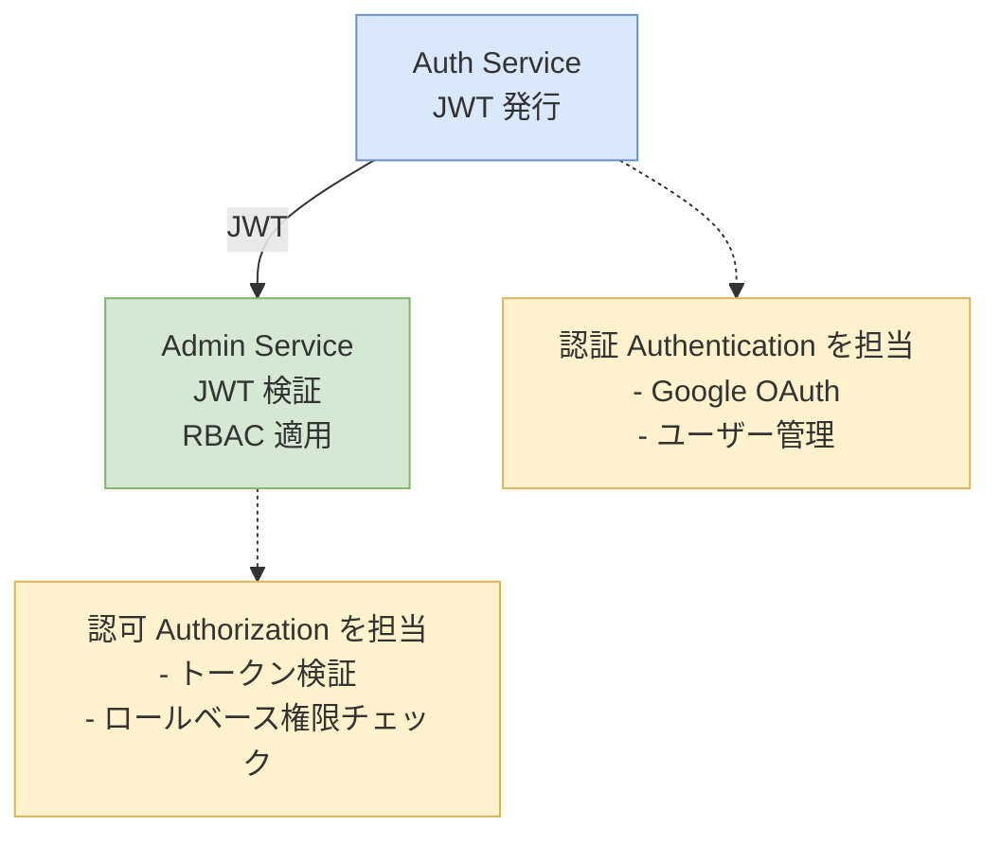
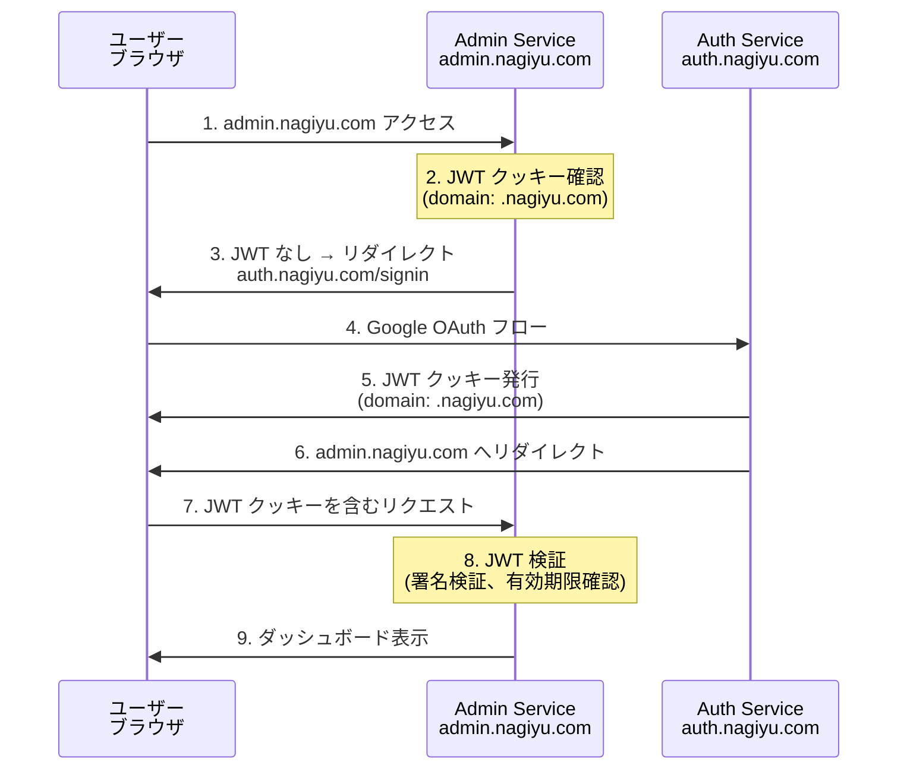
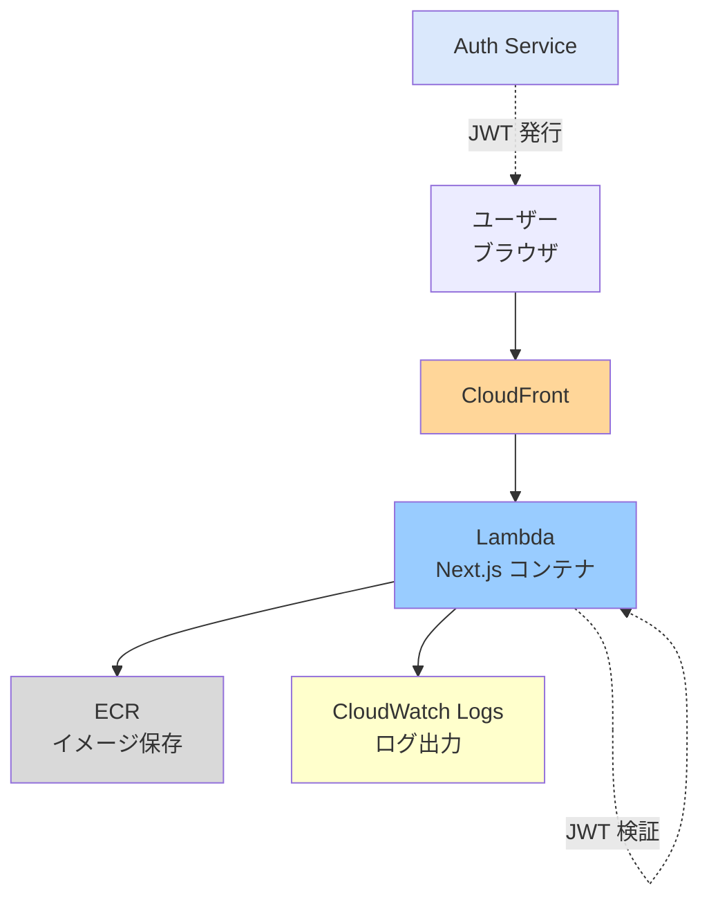

# Admin サービス アーキテクチャ設計書

---

## 1. システム概要

Admin サービスは、nagiyu プラットフォームの管理機能を提供する Web アプリケーションです。Phase 1 では、Auth サービスとの **SSO 連携動作確認** を主目的とした最小限のダッシュボードを実装します。

### 1.1 全体構成図


**構成要素**:
- **ユーザー（ブラウザ）**: 管理者が Web ブラウザからアクセス
- **CloudFront**: グローバル配信、エッジキャッシング
- **Lambda (Next.js)**: サーバーレス Next.js 実行環境（コンテナイメージ）
- **Auth サービス**: JWT 発行、ユーザー認証を担当
- **共有クッキー**: `.nagiyu.com` ドメインで Auth と Admin が JWT を共有

---

## 2. 技術スタック

### 2.1 フロントエンド

| カテゴリ | 技術 | 用途 |
|---------|------|------|
| フレームワーク | Next.js 16.x | SSR/SSG 対応の React フレームワーク |
| UI ライブラリ | Material-UI (MUI) 7.x | 統一された UI コンポーネント |
| 言語 | TypeScript 5.x | 型安全な開発 |
| スタイリング | Emotion 11.x | CSS-in-JS (MUI の依存) |

### 2.2 バックエンド

| カテゴリ | 技術 | 用途 |
|---------|------|------|
| ランタイム | Node.js | サーバーサイド処理 |
| HTTP クライアント | axios 1.x | Auth サービス API 呼び出し（Phase 2） |

### 2.3 インフラ

| カテゴリ | 技術 | 用途 |
|---------|------|------|
| コンピューティング | AWS Lambda (コンテナイメージ) | サーバーレス Next.js 実行環境 |
| CDN | Amazon CloudFront | コンテンツ配信 |
| コンテナレジストリ | Amazon ECR | Docker イメージ保存 |
| IaC | AWS CDK (TypeScript) | インフラ定義 |

### 2.4 開発ツール

| カテゴリ | 技術 | 用途 |
|---------|------|------|
| パッケージマネージャ | npm | 依存関係管理 |
| リンター | ESLint | コード品質チェック |
| フォーマッター | Prettier | コード整形 |
| テスト | Jest, Playwright | ユニット・E2Eテスト |

---

## 3. アーキテクチャパターン

### 3.1 設計思想

#### 1. 軽量かつシンプルな実装

Admin サービスは Phase 1 において**認証基盤の動作確認**を主目的としています。そのため、以下の原則に従います：

- **最小限の機能実装**: ダッシュボードは「ログインユーザー情報の表示」のみ
- **複雑なロジックは持たない**: ビジネスロジックは Auth サービスに委譲
- **早期デプロイ検証**: CI/CD パイプラインを先行構築し、動作確認を優先

#### 2. 認証・認可の分離

Admin サービスは**認可（Authorization）のみ**を担当します：



#### 3. SSO によるシームレスな体験

- Auth サービスで発行された JWT クッキー（domain: `.nagiyu.com`）を共有
- Admin サービスはトークンを検証し、セッションを確立
- ユーザーは一度のログインで全サービスにアクセス可能

#### 4. 将来の拡張性を考慮した設計

Phase 1 ではシンプルな実装としますが、Phase 2 以降で以下の拡張を想定しています：

- CloudWatch Logs 閲覧 UI の追加
- ユーザー管理機能（Auth サービス API を呼び出し）
- プラットフォーム統計ダッシュボード
- ロール・権限マトリクスの UI 管理

### 3.2 データフロー（SSO 認証）



### 3.3 コンポーネント構成

#### UI レイヤー (`app/`, `components/`)
- **Next.js App Router**: ルーティング、ページレンダリング
- **React コンポーネント**: ユーザー情報カード、認証ステータスカード
- **共通 UI ライブラリ (`@nagiyu/ui`)**: Header, Footer コンポーネント

#### ビジネスロジック (`lib/`)
- **JWT 検証**: トークンの署名、有効期限、発行者を検証
- **権限チェック**: ロールベースのアクセス制御ロジック

#### Middleware
- **認証チェック**: 全リクエストで JWT クッキーを検証
- **リダイレクト**: 認証失敗時は Auth サービスへリダイレクト

---

## 4. データモデル

### 4.1 JWT ペイロード構造

Admin サービスが検証する JWT のペイロード:

```typescript
interface JWTPayload {
  sub: string;          // ユーザーID
  email: string;        // メールアドレス
  roles: string[];      // ロール一覧（例: ["admin", "user-manager"]）
  iss: string;          // 発行者（"auth.nagiyu.com"）
  exp: number;          // 有効期限（Unix タイムスタンプ）
  iat: number;          // 発行時刻（Unix タイムスタンプ）
}
```

### 4.2 セッション型

Admin サービス内部で使用するセッション型:

```typescript
interface Session {
  userId: string;
  email: string;
  roles: string[];
  expiresAt: Date;
}
```

---

## 5. インフラ構成

### 5.1 AWS 構成図



### 5.2 リソース一覧

| リソース           | 説明                                                  | 設定                                                        |
| ------------------ | ----------------------------------------------------- | ----------------------------------------------------------- |
| Lambda 関数        | Next.js アプリケーションの実行環境                    | メモリ: 1024 MB, タイムアウト: 30秒, コンテナイメージ起動 |
| CloudFront         | グローバル配信、HTTPS 強制                            | Lambda Function URL をオリジンとして設定                    |
| ECR リポジトリ     | Docker イメージ保存                                   | イメージタグ: `admin-{env}:latest`                          |
| CloudWatch Logs    | Lambda 実行ログ                                       | ロググループ: `/aws/lambda/admin-{env}`, 保持期間: 7日      |
| Lambda Function URL| Lambda への直接アクセス URL                           | 認証: なし（CloudFront 経由のアクセスを前提）                |

### 5.3 ネットワーク設計

- **VPC**: 共有 VPC (`nagiyu-{env}-vpc`) を使用
- **サブネット**: パブリックサブネットに Lambda を配置（VPC 外でも可）
- **セキュリティグループ**: Lambda には付与しない（VPC 外の場合）
- **通信経路**: ユーザー → CloudFront → Lambda Function URL

---

## 6. セキュリティ設計

### 6.1 認証・認可

#### JWT 検証
- **署名検証**: Auth サービスと共有する秘密鍵（または公開鍵）で署名を検証
- **有効期限チェック**: `exp` クレームを確認し、期限切れトークンを拒否
- **発行者検証**: `iss` クレームが `auth.nagiyu.com` であることを確認

#### RBAC（ロールベースアクセス制御）
- **Phase 1 サポートロール**: `admin`, `user-manager`
- **権限チェック**: Middleware, API Route, UI で権限を検証
- **権限不足時の挙動**: 403 Forbidden レスポンス

### 6.2 データ暗号化

- **通信暗号化**: HTTPS 強制（CloudFront で HTTP → HTTPS リダイレクト）
- **クッキー**: `Secure` フラグ付き JWT クッキー（HTTPS 通信でのみ送信）

### 6.3 セキュリティヘッダー

Next.js で以下のセキュリティヘッダーを設定:

- **HSTS**: `Strict-Transport-Security: max-age=31536000; includeSubDomains`
- **X-Frame-Options**: `DENY`（クリックジャッキング対策）
- **X-Content-Type-Options**: `nosniff`
- **Referrer-Policy**: `strict-origin-when-cross-origin`

### 6.4 その他のセキュリティ対策

- **レート制限**: AWS WAF でリクエストレート制限（Phase 2 で検討）
- **最小権限の原則**: Lambda 実行ロールは必要最小限の権限のみ付与
- **クッキーセキュリティ**: `SameSite=Lax`（CSRF 保護）、`Domain=.nagiyu.com`

---

## 7. ディレクトリ構成

```
services/admin/web/
├── src/
│   ├── app/                          # Next.js App Router
│   │   ├── api/                      # API Routes
│   │   │   ├── health/
│   │   │   │   └── route.ts          # ヘルスチェック (Public)
│   │   │   └── users/                # Phase 2: ユーザー管理 API
│   │   │       ├── route.ts          # 一覧・作成
│   │   │       └── [userId]/
│   │   │           └── route.ts      # 詳細・更新・削除
│   │   ├── (protected)/              # 認証必須ルート
│   │   │   └── dashboard/
│   │   │       └── page.tsx          # ダッシュボード
│   │   ├── layout.tsx                # ルートレイアウト
│   │   └── globals.css               # グローバルスタイル
│   ├── components/                   # React コンポーネント
│   │   ├── ThemeRegistry.tsx         # MUI テーマ + @nagiyu/ui レイアウト
│   │   └── dashboard/
│   │       ├── UserInfoCard.tsx      # ユーザー情報カード
│   │       └── AuthStatusCard.tsx    # 認証ステータスカード
│   ├── lib/                          # ビジネスロジック
│   │   └── auth/
│   │       ├── jwt.ts                # JWT 検証ユーティリティ
│   │       └── permissions.ts        # 権限チェックロジック
│   ├── types/                        # 型定義
│   │   ├── auth.ts                   # 認証関連型
│   │   └── user.ts                   # ユーザー型（Auth サービスと共有）
│   ├── middleware.ts                 # Next.js Middleware (JWT 検証)
│   └── next.config.ts                # Next.js 設定
├── tests/                            # テストファイル
│   ├── unit/
│   │   └── lib/
│   │       └── auth/
│   │           ├── jwt.test.ts
│   │           └── permissions.test.ts
│   └── e2e/
│       └── dashboard.spec.ts         # E2E テスト
├── Dockerfile                        # Lambda コンテナイメージ
├── package.json
└── tsconfig.json
```

---

## 8. 技術選定理由

### Next.js 16.x

**理由**:
- SSR/SSG 対応により、SEO とパフォーマンスを両立
- App Router による直感的なルーティング
- Middleware による認証チェックの実装が容易
- プラットフォーム標準技術として統一

**代替案との比較**:
- **React SPA**: SSR が不要な場合は選択肢だが、Admin は SEO 不要のため検討不要
- **Vue.js/Nuxt.js**: Next.js の方がプラットフォーム内で統一しやすい

### Material-UI (MUI) 7.x

**理由**:
- プラットフォーム標準の UI ライブラリ
- 豊富なコンポーネントライブラリ
- `@nagiyu/ui` 共通コンポーネントとの親和性

**代替案との比較**:
- **Tailwind CSS**: カスタマイズ性は高いが、統一性が低くなる
- **Ant Design**: MUI と同等だが、プラットフォーム標準として MUI を採用

### AWS Lambda (コンテナイメージ)

**理由**:
- サーバーレスで運用コストが低い
- 自動スケーリング対応
- コンテナイメージによる Next.js の実行が可能
- プラットフォーム標準のホスティング方式

**代替案との比較**:
- **ECS/Fargate**: 常時稼働が必要な場合は選択肢だが、Admin は低トラフィックのため Lambda で十分
- **Vercel**: 外部サービスへの依存を避けたい

---

## 9. 制約事項

### 9.1 技術的制約

- **Lambda コールドスタート**: 初回アクセス時に 1-2秒の遅延が発生する可能性
- **Lambda タイムアウト**: 30秒でタイムアウト（長時間実行する処理には不向き）
- **コンテナイメージサイズ**: 10 GB 制限（Next.js アプリケーションは問題なし）

### 9.2 運用制約

- **Phase 1 では最小限の機能**: CloudWatch Logs 閲覧、ユーザー管理は Phase 2 以降
- **Auth サービス依存**: Auth サービスが稼働していないと Admin サービスも機能しない
- **共有クッキー**: `.nagiyu.com` ドメインのクッキーを共有するため、ドメイン設定が必須

---

## 10. 将来拡張

### Phase 2 以降で検討する拡張

- **CloudWatch Logs 閲覧機能**: ログクエリ UI の追加
- **ユーザー管理 UI**: Auth サービスの API を呼び出してユーザーを管理
- **プラットフォーム統計ダッシュボード**: 各サービスの利用状況を可視化
- **ロール・権限マトリクス管理**: UI でロールと権限を管理
- **外部 API の提供**: Admin 機能を他サービスから呼び出せるようにする（要検討）

