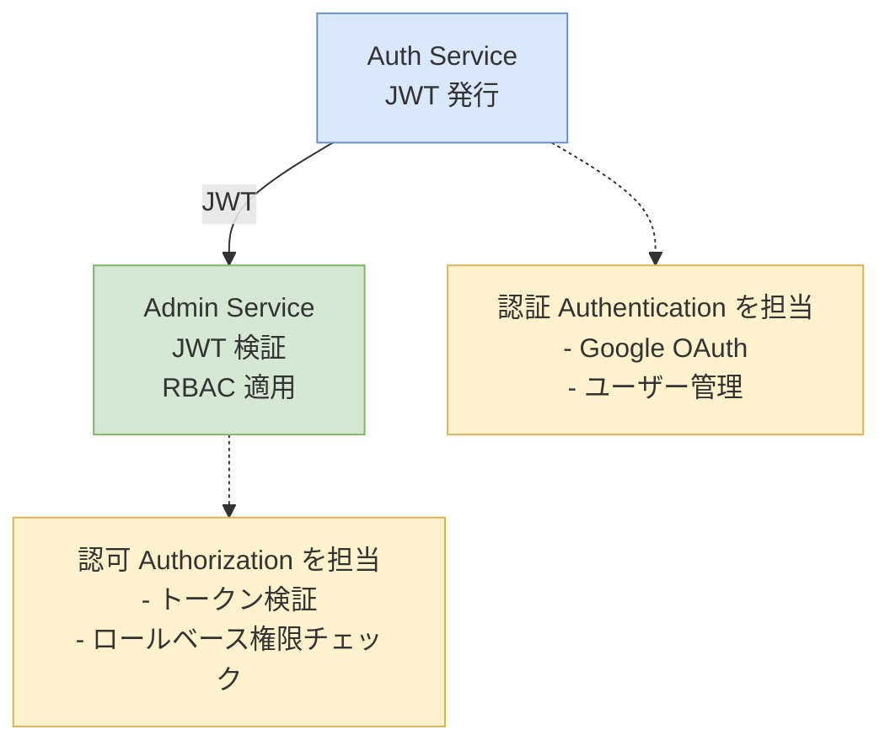
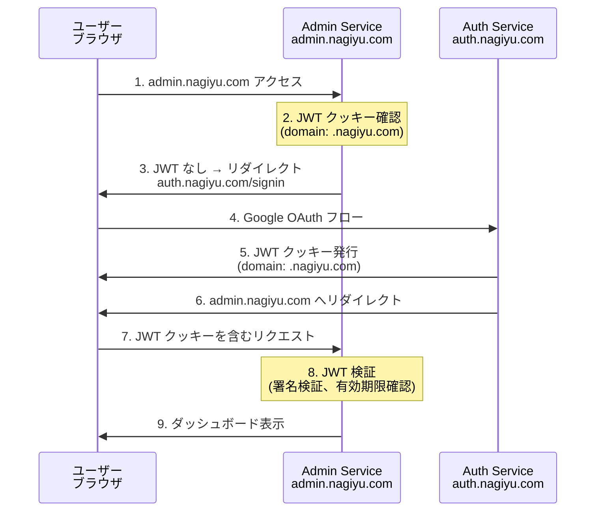

# Admin サービス アーキテクチャ

## 概要

Admin サービスは、nagiyu プラットフォームの管理機能を提供する Web アプリケーションです。認証された管理者ユーザーが、プラットフォーム全体のユーザー管理、ログ閲覧（Phase 2）、各種設定を行うための統合ダッシュボードとして機能します。

Phase 1 では、**Auth サービスとの SSO 連携動作確認**を主目的とした最小限のダッシュボードを実装します。

## サービス責務

### Phase 1 スコープ

| 責務 | 説明 |
|------|------|
| **JWT 検証** | Auth サービスが発行した JWT トークンを検証し、ユーザー情報を取得 |
| **SSO 連携** | Auth サービスとのシングルサインオンを実現 |
| **シンプルなダッシュボード** | ログイン済みユーザーの情報を表示する最小限の UI |
| **ロールベースアクセス制御 (RBAC)** | ユーザーのロールに基づいたルート保護とアクセス制限 |

### Phase 2 以降で追加予定

- CloudWatch Logs 閲覧機能
- ユーザー管理 UI（Auth サービスの API を呼び出し）
- ロール割り当て UI
- プラットフォーム統計ダッシュボード

## 技術スタック

### フレームワーク・ライブラリ

| カテゴリ | 技術 | バージョン | 用途 |
|---------|------|-----------|------|
| **フレームワーク** | Next.js | 16.x | SSR/SSG 対応の React フレームワーク |
| **言語** | TypeScript | 5.x | 型安全な開発 |
| **UI ライブラリ** | Material-UI (MUI) | 7.x | 統一された UI コンポーネント |
| **スタイリング** | Emotion | 11.x | CSS-in-JS (MUI の依存) |
| **HTTP クライアント** | axios | 1.x | Auth サービス API 呼び出し |
| **テスト** | Jest, Playwright | latest | ユニットテスト、E2E テスト |

### インフラストラクチャ

| コンポーネント | 技術 | 用途 |
|--------------|------|------|
| **ホスティング** | AWS Lambda (コンテナイメージ) | サーバーレス Next.js 実行環境 |
| **CDN** | Amazon CloudFront | グローバル配信、エッジキャッシング |
| **コンテナレジストリ** | Amazon ECR | Docker イメージ保存 |
| **IaC** | AWS CDK (TypeScript) | インフラストラクチャコード |
| **CI/CD** | GitHub Actions | 自動デプロイパイプライン |

## 設計思想

### 1. 軽量かつシンプルな実装

Admin サービスは Phase 1 において**認証基盤の動作確認**を主目的としています。そのため、以下の原則に従います：

- **最小限の機能実装**: ダッシュボードは「ログインユーザー情報の表示」のみ
- **複雑なロジックは持たない**: ビジネスロジックは Auth サービスに委譲
- **早期デプロイ検証**: CI/CD パイプラインを先行構築し、動作確認を優先

### 2. 認証・認可の分離

Admin サービスは**認可（Authorization）のみ**を担当します：



### 3. SSO によるシームレスな体験

- Auth サービスで発行された JWT クッキー（domain: `.nagiyu.com`）を共有
- Admin サービスはトークンを検証し、セッションを確立
- ユーザーは一度のログインで全サービスにアクセス可能

### 4. 将来の拡張性を考慮した設計

Phase 1 ではシンプルな実装としますが、Phase 2 以降で以下の拡張を想定しています：

- CloudWatch Logs 閲覧 UI の追加
- ユーザー管理機能（Auth サービス API を呼び出し）
- プラットフォーム統計ダッシュボード
- ロール・権限マトリクスの UI 管理

## アーキテクチャ

### システム構成図


### 認証フロー（SSO）



### 認証・認可の実装方針

#### JWT 検証

Admin サービスは Next.js Middleware で全リクエストの JWT を検証します：

**実装場所:** `services/admin/web/src/middleware.ts`

**処理フロー:**
1. リクエストから JWT クッキー (`nagiyu-session`) を取得
2. トークンがない場合 → Auth サービスの `/signin` へリダイレクト
3. トークンを検証（署名、有効期限）
4. 検証成功 → ユーザー情報をリクエストヘッダーに追加して次の処理へ
5. 検証失敗 → Auth サービスへリダイレクト

**公開ルート:**
- `/api/health`: ヘルスチェック（認証不要）

#### ロールベースアクセス制御 (RBAC)

**実装場所:** `services/admin/web/src/lib/auth/permissions.ts`

**ロール・権限定義:**
- Auth サービスの `libs/common/src/auth/roles.ts` と同じ定義を使用
- Phase 1 では `admin` と `user-manager` のみサポート
- Phase 2 で `log-viewer` を追加予定

**権限チェック方法:**
- API Route: `requirePermission()` で権限チェック、失敗時は 403 Forbidden
- Middleware: ルートパターンに基づいた権限チェック
- UI: `hasPermission()` でコンポーネントの表示制御（セキュリティ目的ではない）

## ディレクトリ構成

```
services/admin/web/
├── src/
│   ├── app/                          # Next.js App Router
│   │   ├── api/                      # API Routes
│   │   │   ├── health/
│   │   │   │   └── route.ts          # ヘルスチェック (Public)
│   │   │   └── users/                # Phase 2: ユーザー管理 API
│   │   │       ├── route.ts          # 一覧・作成
│   │   │       └── [userId]/
│   │   │           └── route.ts      # 詳細・更新・削除
│   │   ├── (protected)/              # 認証必須ルート
│   │   │   └── dashboard/
│   │   │       └── page.tsx          # ダッシュボード
│   │   ├── layout.tsx                # ルートレイアウト
│   │   └── globals.css               # グローバルスタイル
│   ├── components/                   # React コンポーネント
│   │   ├── ThemeRegistry.tsx         # MUI テーマ + @nagiyu/ui レイアウト
│   │   └── dashboard/
│   │       ├── UserInfoCard.tsx      # ユーザー情報カード
│   │       └── AuthStatusCard.tsx    # 認証ステータスカード
│   ├── lib/                          # ビジネスロジック
│   │   └── auth/
│   │       ├── jwt.ts                # JWT 検証ユーティリティ
│   │       └── permissions.ts        # 権限チェックロジック
│   ├── types/                        # 型定義
│   │   ├── auth.ts                   # 認証関連型
│   │   └── user.ts                   # ユーザー型（Auth サービスと共有）
│   ├── middleware.ts                 # Next.js Middleware (JWT 検証)
│   └── next.config.ts                # Next.js 設定
├── tests/                            # テストファイル
│   ├── unit/
│   │   └── lib/
│   │       └── auth/
│   │           ├── jwt.test.ts
│   │           └── permissions.test.ts
│   └── e2e/
│       └── dashboard.spec.ts         # E2E テスト
├── Dockerfile                        # Lambda コンテナイメージ
├── package.json
└── tsconfig.json
```

## 画面設計

### Phase 1: シンプルなダッシュボード


**設計方針：**

- **モバイルファースト**: スマートフォンでの閲覧を前提とした UI 設計（375px 幅を基準）
- **共通レイアウトの活用**: `@nagiyu/ui` の Header/Footer コンポーネントを使用
- **レスポンシブ対応**: PC でも同じ UI で閲覧可能（必要に応じてタブレット・PC 向けレイアウト調整）

**画面構成：**

- **Header** (`@nagiyu/ui`): "Admin" タイトル表示
- **メインコンテンツ**:
    - ユーザー情報カード（名前、メールアドレス、ロール一覧）
    - 認証ステータス（JWT 有効期限表示）
    - 動作確認メッセージ（"Auth サービスとの SSO 連携が正常に動作しています"）
    - メニュー（ダッシュボード、ログ閲覧※、ユーザー管理※）
    - ログアウトボタン
- **Footer** (`@nagiyu/ui`): バージョン情報、プライバシーポリシー、利用規約

※ Phase 2 で実装予定の機能

### Phase 2 以降で追加予定の画面

- ユーザー一覧・編集画面
- ログ閲覧画面（CloudWatch Logs クエリ UI）
- ロール・権限マトリクス管理画面

## セキュリティ設計

### 1. JWT 検証

- **署名検証**: Auth サービスと共有する秘密鍵（または公開鍵）で署名を検証
- **有効期限チェック**: `exp` クレームを確認し、期限切れトークンを拒否
- **発行者検証**: `iss` クレームが `auth.nagiyu.com` であることを確認

### 2. クッキーセキュリティ

Admin サービスは JWT クッキーを**読み取り専用**として扱います：

- **発行しない**: JWT の発行は Auth サービスのみ
- **検証のみ**: クッキーの署名と有効期限を検証
- **SameSite=Lax**: CSRF 保護
- **Secure フラグ**: HTTPS 通信でのみ送信

### 3. HTTPS 強制

- CloudFront で HTTPS リダイレクト設定
- HTTP Strict Transport Security (HSTS) ヘッダー送信

### 4. レート制限

- AWS WAF でリクエストレート制限
- API Routes に対する過度なアクセスを防止

### 5. 最小権限の原則

- Lambda 実行ロールは必要最小限の権限のみ付与
- Phase 1 では DynamoDB, CloudWatch Logs への読み取り権限なし（Phase 2 で追加）

## 非機能要件

### パフォーマンス

| 項目 | 目標値 |
|------|--------|
| **初回表示速度** | < 2秒 (グローバル平均) |
| **Time to Interactive (TTI)** | < 3秒 |
| **Lambda コールドスタート** | < 1秒 |

### 可用性

| 項目 | 目標値 |
|------|--------|
| **稼働率** | 99.9% (月間ダウンタイム < 43分) |
| **RTO (復旧目標時間)** | < 30分 |
| **RPO (復旧目標時点)** | 0 (ステートレス) |

### スケーラビリティ

- Lambda の自動スケーリングにより、同時リクエスト数に応じて拡張
- CloudFront キャッシュにより、静的アセットの配信を高速化

### 監視・ロギング

| 項目 | ツール/方法 |
|------|-----------|
| **アプリケーションログ** | CloudWatch Logs (Phase 2 で libs/common logger 統合) |
| **エラー追跡** | CloudWatch Logs Insights |
| **メトリクス** | CloudWatch Metrics (Lambda 実行時間、エラー率) |
| **アラート** | CloudWatch Alarms (エラー率 > 5%, Lambda タイムアウト) |

## 開発・運用

### 環境

| 環境 | URL | 用途 |
|------|-----|------|
| **dev** | admin-dev.nagiyu.com | 開発・動作確認 |
| **prod** | admin.nagiyu.com | 本番環境 |

### デプロイフロー

```
開発ブランチ (integration/admin)
    ↓ PR作成
develop ブランチ
    ↓ マージ → CI/CD 実行
dev 環境へデプロイ
    ↓ 動作確認 OK
master ブランチへ PR
    ↓ マージ → CI/CD 実行
prod 環境へデプロイ
```

### CI/CD パイプライン

**GitHub Actions ワークフロー:**

1. **admin-verify-fast.yml** (integration/** PR)
    - ユニットテスト実行
    - ビルド検証
    - トリガー: integration/** ブランチへの push

2. **admin-verify-full.yml** (develop PR)
    - ユニットテスト + E2E テスト
    - カバレッジ計測 (80% 以上)
    - トリガー: develop ブランチへの PR

3. **admin-deploy.yml** (develop/master へのマージ)
    - Docker イメージビルド
    - ECR へプッシュ
    - AWS CDK デプロイ
    - Lambda 関数更新
    - CloudFront キャッシュクリア

### テスト戦略

| テスト種別 | ツール | カバレッジ目標 |
|-----------|--------|---------------|
| **ユニットテスト** | Jest | 80% 以上 |
| **E2E テスト** | Playwright | 主要フロー 100% |
| **セキュリティテスト** | 手動 | JWT 検証、RBAC |

**E2E テストシナリオ（Phase 1）:**

1. 未認証ユーザーが admin.nagiyu.com にアクセス → auth.nagiyu.com へリダイレクト
2. Google OAuth ログイン → JWT クッキー発行 → admin.nagiyu.com へリダイレクト
3. ダッシュボードにユーザー情報が表示される
4. JWT 有効期限切れ → auth.nagiyu.com へリダイレクト

## Phase 2 以降の拡張計画

### CloudWatch Logs 閲覧機能

- CloudWatch Logs Insights API を使用したログクエリ
- サービス、ログレベル、時刻範囲でフィルタリング
- リアルタイムログストリーム表示

### ユーザー管理 UI

- Auth サービスの `/api/users` エンドポイントを呼び出し
- ユーザー一覧、作成、編集、削除
- ロール割り当て UI

### プラットフォーム統計

- 各サービスの利用状況ダッシュボード
- ユーザー数、アクティブユーザー数、エラー率などの可視化

## 関連ドキュメント

- [Auth サービス アーキテクチャ](../auth/architecture.md)
- [Auth サービス API 仕様](../auth/api-spec.md)
- [ロール・権限定義](../auth/roles-and-permissions.md)
