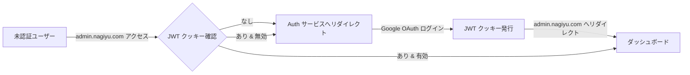

# Admin サービス 要件定義書

---

## 1. ビジネス要件

### 1.1 背景・目的

nagiyu プラットフォームの管理機能を提供する Web アプリケーションとして、Admin サービスを開発します。

**Phase 1 の目的**:
- Auth サービスとの **SSO（シングルサインオン）連携動作確認**
- JWT ベースの認証基盤の実地検証
- ロールベースアクセス制御（RBAC）の動作確認

Phase 1 は最小限の実装（MVP）とし、早期にデプロイ・動作検証することで、認証基盤の信頼性を確保します。

### 1.2 対象ユーザー

**プライマリーユーザー**: プラットフォーム管理者
- Auth サービスで `admin` ロールを付与されたユーザー
- プラットフォーム全体の管理権限を持つ

**セカンダリーユーザー**: ユーザー管理者（Phase 2 以降）
- `user-manager` ロールを持つユーザー
- ユーザー管理機能にのみアクセス可能

### 1.3 ビジネスゴール

#### Phase 1 (MVP)
1. **SSO 連携の動作検証**: Auth サービスで発行された JWT クッキーを検証し、シームレスなログイン体験を提供
2. **RBAC の動作確認**: ロールベースでのアクセス制御が正常に機能することを確認
3. **早期デプロイ**: CI/CD パイプラインを先行構築し、開発環境へのデプロイを実現

#### Phase 2 以降
- CloudWatch Logs 閲覧機能の提供
- ユーザー管理 UI の実装
- プラットフォーム統計ダッシュボードの提供

---

## 2. 機能要件

### 2.1 ユースケース

#### UC-001: SSO によるログイン

- **概要**: Auth サービスで認証済みのユーザーが、Admin サービスにシームレスにアクセスする
- **アクター**: 管理者ユーザー
- **前提条件**: Auth サービスで Google OAuth ログインが完了し、JWT クッキーが発行されている
- **正常フロー**:
  1. ユーザーが `admin.nagiyu.com` にアクセス
  2. Admin サービスが JWT クッキー (`nagiyu-session`) を検証
  3. JWT が有効な場合、ダッシュボードを表示
- **代替フロー**: JWT が存在しない、または無効な場合 → Auth サービスの `/signin` へリダイレクト
- **例外フロー**: JWT の署名が不正な場合 → Auth サービスへリダイレクト

#### UC-002: ユーザー情報の表示

- **概要**: ダッシュボードでログイン中のユーザー情報を表示する
- **アクター**: 管理者ユーザー
- **前提条件**: UC-001 が完了し、ダッシュボードにアクセスしている
- **正常フロー**:
  1. ダッシュボードにアクセス
  2. ユーザー情報カードに以下が表示される:
     - 名前
     - メールアドレス
     - 保有ロール一覧
  3. 認証ステータスカードに以下が表示される:
     - JWT 有効期限
     - SSO 連携動作確認メッセージ
- **代替フロー**: なし
- **例外フロー**: JWT 有効期限切れ → Auth サービスへリダイレクト

#### UC-003: ロールベースアクセス制御（RBAC）

- **概要**: ユーザーのロールに基づいてアクセス可能な機能を制限する
- **アクター**: 管理者ユーザー
- **前提条件**: UC-001 が完了し、JWT にロール情報が含まれている
- **正常フロー**:
  1. ユーザーがダッシュボードにアクセス
  2. Middleware が JWT からロールを抽出
  3. `admin` ロールを持つ場合、全機能にアクセス可能
  4. UI に権限に応じたメニューが表示される（Phase 2 以降）
- **代替フロー**: 必要なロールがない場合 → 403 Forbidden
- **例外フロー**: JWT にロール情報が含まれない → Auth サービスへリダイレクト

### 2.2 機能一覧

| 機能ID | 機能名                 | 説明                                                        | 優先度 |
| ------ | ---------------------- | ----------------------------------------------------------- | ------ |
| F-001  | JWT 検証               | Auth サービスが発行した JWT トークンを検証                  | 高     |
| F-002  | SSO 連携               | Auth サービスとのシングルサインオンを実現                   | 高     |
| F-003  | ダッシュボード表示     | ログイン済みユーザーの情報を表示する最小限の UI             | 高     |
| F-004  | RBAC                   | ユーザーのロールに基づいたルート保護とアクセス制限          | 高     |
| F-005  | ヘルスチェック API     | サービス稼働状態を返す公開エンドポイント                    | 中     |
| F-006  | CloudWatch Logs 閲覧   | ログクエリ UI（Phase 2）                                    | 低     |
| F-007  | ユーザー管理 UI        | Auth サービスの API を呼び出してユーザーを管理（Phase 2）   | 低     |

---

## 3. 非機能要件

### 3.1 パフォーマンス要件

| 項目                          | 要件                       |
| ----------------------------- | -------------------------- |
| 初回表示速度                  | < 2秒 (グローバル平均)     |
| Time to Interactive (TTI)     | < 3秒                      |
| Lambda コールドスタート        | < 1秒                      |

### 3.2 セキュリティ要件

#### 認証・認可
- **JWT 検証**: Auth サービスと共有する秘密鍵（または公開鍵）で署名を検証
- **有効期限チェック**: `exp` クレームを確認し、期限切れトークンを拒否
- **発行者検証**: `iss` クレームが `auth.nagiyu.com` であることを確認
- **RBAC**: ロールベースでのアクセス制御、権限不足時は 403 Forbidden

#### クッキーセキュリティ
- **読み取り専用**: Admin サービスは JWT クッキーを発行せず、検証のみ実施
- **SameSite=Lax**: CSRF 保護
- **Secure フラグ**: HTTPS 通信でのみ送信
- **Domain**: `.nagiyu.com` で Auth サービスとクッキーを共有

#### 通信セキュリティ
- **HTTPS 強制**: CloudFront で HTTPS リダイレクト設定
- **HSTS ヘッダー**: HTTP Strict Transport Security (HSTS) ヘッダー送信

#### その他のセキュリティ対策
- **レート制限**: AWS WAF でリクエストレート制限
- **最小権限の原則**: Lambda 実行ロールは必要最小限の権限のみ付与

### 3.3 可用性要件

| 項目                     | 要件                            |
| ------------------------ | ------------------------------- |
| 稼働率                   | 99.9% (月間ダウンタイム < 43分) |
| RTO (復旧目標時間)       | < 30分                          |
| RPO (復旧目標時点)       | 0 (ステートレス)                |

### 3.4 保守性・拡張性要件

#### 保守性
- **コード品質**: TypeScript strict mode、ESLint、Prettier によるコード品質保証
- **テストカバレッジ**: ビジネスロジック（`lib/`）80%以上
- **ドキュメント**: アーキテクチャ、API 仕様、デプロイ手順のドキュメント整備

#### 拡張性
- **Phase 2 以降の拡張**: CloudWatch Logs 閲覧、ユーザー管理 UI の追加を想定した設計
- **モジュール化**: ビジネスロジック（`lib/`）と UI（`components/`, `app/`）を分離

### 3.5 その他の非機能要件

#### スケーラビリティ
- Lambda の自動スケーリングにより、同時リクエスト数に応じて拡張
- CloudFront キャッシュにより、静的アセットの配信を高速化

#### 監視・ロギング
| 項目                     | ツール/方法                                                |
| ------------------------ | ---------------------------------------------------------- |
| アプリケーションログ     | CloudWatch Logs (Phase 2 で libs/common logger 統合)      |
| エラー追跡               | CloudWatch Logs Insights                                   |
| メトリクス               | CloudWatch Metrics (Lambda 実行時間、エラー率)            |
| アラート                 | CloudWatch Alarms (エラー率 > 5%, Lambda タイムアウト)    |

---

## 4. UI/UX 要件

### 4.1 画面一覧

| 画面名             | パス         | 説明                                                       | 優先度 |
| ------------------ | ------------ | ---------------------------------------------------------- | ------ |
| ダッシュボード     | `/dashboard` | ログイン済みユーザーの情報を表示する最小限の UI            | 高     |
| ヘルスチェック API | `/api/health`| サービス稼働状態を返す公開エンドポイント（認証不要）       | 中     |

### 4.2 画面遷移図

### 4.3 主要画面の UI 要件

#### ダッシュボード (`/dashboard`)

**概要**: ログイン済みユーザーの情報を表示し、SSO 連携の動作確認を行う画面

**主要UI要素**:
- **Header** (`@nagiyu/ui` 共通コンポーネント): "Admin" タイトル表示
- **ユーザー情報カード**:
  - 名前
  - メールアドレス
  - ロール一覧（バッジ表示）
- **認証ステータスカード**:
  - JWT 有効期限
  - 動作確認メッセージ（"Auth サービスとの SSO 連携が正常に動作しています"）
- **メニュー** (Phase 2 以降):
  - ダッシュボード（Phase 1 で有効）
  - ログ閲覧※（Phase 2）
  - ユーザー管理※（Phase 2）
- **ログアウトボタン**
- **Footer** (`@nagiyu/ui` 共通コンポーネント): バージョン情報、プライバシーポリシー、利用規約

**インタラクション**:
- ログアウトボタンをクリック → Auth サービスの `/signout` へリダイレクト
- JWT 有効期限が切れた場合 → Auth サービスへ自動リダイレクト

**表示条件**: `admin` または `user-manager` ロールを持つユーザーのみアクセス可能

### 4.4 レスポンシブ対応要件

| デバイス     | 対応要件                                                     |
| ------------ | ------------------------------------------------------------ |
| デスクトップ | 1920x1080 を基準、Material-UI の Grid で柔軟なレイアウト    |
| タブレット   | 768px 以上でデスクトップと同等のレイアウト                   |
| モバイル     | 375px を基準（スマホファースト）、縦積みレイアウト           |

### 4.5 アクセシビリティ要件

- **WCAG 準拠レベル**: AA
- **キーボード操作**: Tab キーでフォーカス移動、Enter キーでボタン操作
- **スクリーンリーダー対応**: ARIA ラベルの適切な設定
- **カラーコントラスト**: WCAG AA 準拠（4.5:1 以上）

### 4.6 UI/UX ガイドライン

- **デザインシステム**: Material-UI (MUI) v7.x、共通 UI ライブラリ `@nagiyu/ui`
- **カラーパレット**: Material-UI のデフォルトテーマ
- **タイポグラフィ**: Material-UI のデフォルトフォント（システムフォント）
- **スペーシング**: Material-UI の spacing システム（8px グリッド）

---

## 5. スコープ外

以下は Phase 1 の実装スコープ外とし、Phase 2 以降で実装を検討します：

- ❌ CloudWatch Logs 閲覧機能（Phase 2）
- ❌ ユーザー管理 UI（Phase 2）
- ❌ ロール割り当て UI（Phase 2）
- ❌ プラットフォーム統計ダッシュボード（Phase 2）
- ❌ リアルタイムログストリーム表示（Phase 2）
- ❌ 外部 API の提供（Phase 2 以降で検討）

---

## 6. 用語集

| 用語    | 定義                                                                          |
| ------- | ----------------------------------------------------------------------------- |
| SSO     | Single Sign-On。一度のログインで複数サービスにアクセス可能にする仕組み       |
| JWT     | JSON Web Token。認証情報を含む署名付きトークン                               |
| RBAC    | Role-Based Access Control。ロールベースアクセス制御                           |
| MVP     | Minimum Viable Product。最小限の機能を持つ実用可能な製品                      |
| Phase 1 | SSO 連携動作確認を主目的とした最小限のダッシュボード実装フェーズ              |
| Phase 2 | CloudWatch Logs 閲覧、ユーザー管理 UI などの本格的な管理機能の実装フェーズ   |
