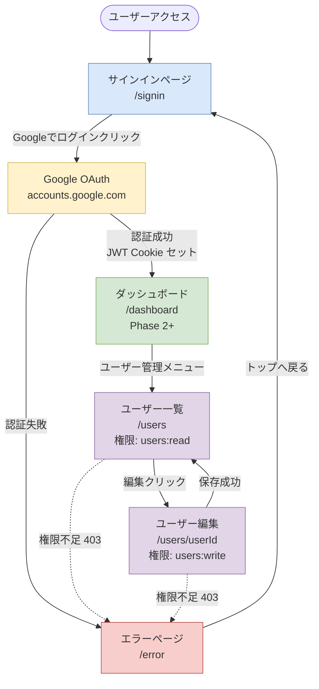

# Auth サービス 基本設計書

---

## 1. システムアーキテクチャ

### 1.1 全体構成図


#### 構成概要

```
ユーザー (ブラウザ)
    ↓ HTTPS
外部DNSサービス
    ↓ CNAME (auth.nagiyu.com → d123456.cloudfront.net)
CloudFront Distribution
    ↓ オリジン
Lambda Function URL (Next.js SSR + Lambda Web Adapter)
    ├─ Next.js App Router
    ├─ NextAuth.js (Google OAuth)
    ├─ Material UI コンポーネント
    └─ DynamoDB アクセス (ユーザー管理)
```

### 1.2 サービスの責務

Auth サービスは、nagiyu プラットフォームの **認証・認可の中核** を担います。

#### 主要責務

1. **認証 (Authentication)**
    - Google OAuth による外部認証
    - JWT トークンの発行・検証
    - セッション管理 (ステートレスJWT)

2. **ユーザー管理**
    - プラットフォーム共通ユーザー ID の管理
    - Google ID とプラットフォーム ID の紐付け
    - ユーザープロフィール情報の管理

3. **認可 (Authorization)**
    - ロールベースアクセス制御 (RBAC)
    - ユーザーへのロール割り当て
    - 権限情報の提供 (JWT に含める)

4. **シングルサインオン (SSO) 基盤**
    - domain: '.nagiyu.com' での JWT クッキー発行
    - 他サービス (admin など) への認証情報共有

#### スコープ外

- ❌ パスワード認証 (Phase 1 では Google OAuth のみ)
- ❌ 多要素認証 (MFA) (将来フェーズ)
- ❌ アクセスログ閲覧 (logs サービスの責務)
- ❌ システム監視・設定 (admin サービスの責務)

### 1.3 設計思想

#### 1. 認証と認可の分離

- **認証 (Who are you?)**: NextAuth.js が OAuth フローを処理
- **認可 (What can you do?)**: ロール・権限システムをアプリケーション層で実装
- **利点**: OAuth プロバイダー変更時も認可ロジックは不変

#### 2. ステートレス認証

- **JWT トークン**: ユーザー情報・ロールをトークンに含める
- **DynamoDB**: プロフィール更新時のみアクセス
- **利点**: Lambda コールドスタート時もデータベース接続不要、スケーラビリティ向上

#### 3. 最小権限の原則

- ロールは **必要最小限の権限セット**
- デフォルトは権限なし (明示的な割り当てが必要)
- 権限の命名規則: `{リソース}:{操作}` (Phase 1 例: `users:write`, `roles:assign`)

#### 4. 拡張性の確保

- **OAuth プロバイダー追加**: NextAuth.js の providers 配列に追加するだけ
- **独自認証への移行**: NextAuth.js を外して custom JWT 発行に切り替え可能
- **DynamoDB スキーマ**: Single Table Design で柔軟な属性追加が可能

### 1.4 技術スタック

#### フロントエンド

| カテゴリ | 技術 | バージョン | 用途 |
|---------|------|----------|------|
| フレームワーク | Next.js | 16.x | React SSR フレームワーク |
| UI ライブラリ | Material UI (MUI) | 7.x | React コンポーネントライブラリ |
| 言語 | TypeScript | 5.x | 型安全な開発 |
| 認証ライブラリ | NextAuth.js | 5.x (beta) | OAuth + セッション管理 |
| 状態管理 | React Context / useState | - | ローカル状態管理 |

#### バックエンド

| カテゴリ | 技術 | バージョン | 用途 |
|---------|------|----------|------|
| ランタイム | Node.js | 22.x | JavaScript 実行環境 |
| フレームワーク | Next.js API Routes | 16.x | サーバーサイド処理 |
| Lambda Adapter | AWS Lambda Web Adapter | 0.8.x | Lambda で Web アプリ実行 |
| OAuth Provider | Google OAuth 2.0 | - | 外部認証 |

#### インフラ

| カテゴリ | 技術 | 用途 |
|---------|------|------|
| コンピューティング | AWS Lambda | Next.js 実行環境 (コンテナ) |
| データベース | Amazon DynamoDB | ユーザー情報管理 |
| シークレット管理 | AWS Secrets Manager | Google OAuth 認証情報 |
| コンテナレジストリ | Amazon ECR | Docker イメージ保存 |
| CDN | Amazon CloudFront | コンテンツ配信、カスタムドメイン |
| SSL/TLS | AWS ACM | HTTPS 証明書 (共通基盤) |
| DNS | 外部DNSサービス | ドメイン管理 |
| IaC | AWS CDK (TypeScript) | インフラ定義 |
| CI/CD | GitHub Actions | 自動ビルド・デプロイ |

#### 開発ツール

| カテゴリ | 技術 | 用途 |
|---------|------|------|
| パッケージマネージャ | npm | 依存関係管理 |
| リンター | ESLint | コード品質チェック |
| フォーマッター | Prettier | コード整形 |
| テスト (単体) | Jest + React Testing Library | ユニットテスト |
| テスト (E2E) | Playwright | ブラウザ自動化テスト |

---

## 2. 認証アーキテクチャ

### 2.1 OAuth 認証フロー


### 2.2 JWT トークン構造

```json
{
  "header": {
    "alg": "HS256",
    "typ": "JWT"
  },
  "payload": {
    "sub": "user_01234567890abcdef",  // userId
    "email": "user@example.com",
    "name": "山田太郎",
    "roles": ["admin"],
    "iat": 1703001234,  // 発行時刻
    "exp": 1705593234   // 有効期限 (30日後)
  },
  "signature": "..."
}
```

#### JWT 設計方針

- **最小限の情報**: ユーザーID、ロールのみ (詳細はDynamoDBから取得)
- **短期有効期限**: 30日 (セキュリティとUXのバランス)
- **自動更新**: NextAuth.js が自動的にトークンをリフレッシュ

### 2.3 セッション管理

#### ステートレスJWT戦略

- **保存場所**: 暗号化された HTTP-only クッキー
- **検証方法**: JWT 署名検証 (NEXTAUTH_SECRET)
- **有効期限**: 30日間 (アクセスごとに延長)

#### クッキー設定

```typescript
cookies: {
  sessionToken: {
    name: 'nagiyu-session',
    options: {
      httpOnly: true,     // XSS 対策
      sameSite: 'lax',    // CSRF 対策
      path: '/',
      secure: true,       // HTTPS のみ
      domain: '.nagiyu.com', // サブドメイン全体で共有
    }
  }
}
```

### 2.4 他サービスとの認証共有 (SSO)


#### SSO の仕組み

**JWT Cookie 詳細:**
- **Cookie 名**: `nagiyu-session`
- **Domain**: `.nagiyu.com` (全サブドメインで共有)
- **属性**: `HttpOnly; Secure; SameSite=Lax`
- **有効期限**: 30日

**メリット:**
- ✓ 一度のログインで全サービスにアクセス可能
- ✓ 各サービスは独立して JWT を検証（Auth Service への問い合わせ不要）
- ✓ 認証ロジックが Auth Service に集約され保守性向上

#### シナリオ: admin.nagiyu.com へのアクセス

```
1. ユーザーが admin.nagiyu.com にアクセス
    ↓
2. Admin サービスのミドルウェアがクッキーをチェック
    - クッキー名: nagiyu-session
    - domain: .nagiyu.com なので admin でも読み取れる
    ↓
3. クッキーがない場合
    → auth.nagiyu.com/api/auth/signin にリダイレクト
    → OAuth ログイン後、admin.nagiyu.com に戻る
    ↓
4. クッキーがある場合
    → JWT を検証 (NEXTAUTH_SECRET で署名確認)
    → payload から userId, roles を取得
    → 権限チェック (例: users:read が必要)
    → OK なら画面表示、NG なら 403 Forbidden
```

---

## 3. ユーザー管理アーキテクチャ

### 3.1 DynamoDB スキーマ設計

#### テーブル名

`nagiyu-auth-users-{env}`
- dev: `nagiyu-auth-users-dev`
- prod: `nagiyu-auth-users-prod`

#### Primary Key

| 属性名 | 型 | キータイプ | 説明 |
|--------|---|----------|------|
| userId | String | HASH (PK) | プラットフォーム共通ユーザーID (UUID v4) |

#### Global Secondary Index (GSI)

**Index 名**: `googleId-index`

| 属性名 | 型 | キータイプ | 説明 |
|--------|---|----------|------|
| googleId | String | HASH | Google OAuth ID |

**用途**: Google ID からユーザーを検索 (OAuth callback 時)

#### 属性

| 属性名 | 型 | 必須 | 説明 |
|--------|---|------|------|
| userId | String | ✅ | プラットフォーム共通ユーザーID (UUID v4) |
| googleId | String | ✅ | Google OAuth ID (sub claim) |
| email | String | ✅ | メールアドレス |
| name | String | ✅ | 表示名 |
| roles | String[] | ✅ | ロールID配列 (例: ["admin", "user-manager"]) |
| createdAt | String | ✅ | 作成日時 (ISO 8601) |
| updatedAt | String | ✅ | 更新日時 (ISO 8601) |
| lastLoginAt | String | - | 最終ログイン日時 (ISO 8601) |

#### 設計方針

- **Single Table Design**: 将来的に拡張可能
- **GSI による高速検索**: googleId → userId の変換
- **ロール配列**: 複数ロール対応 (例: `["admin", "user-manager"]`)
- **ISO 8601 日時**: タイムゾーン非依存、ソート可能

### 3.2 ユーザーライフサイクル

#### 新規ユーザー作成

```
Google OAuth 初回ログイン
    ↓
NextAuth.js signIn callback
    ↓
DynamoDB Query (googleId-index)
    - 結果なし (新規ユーザー)
    ↓
userId 生成 (UUID v4)
    ↓
DynamoDB PutItem
    - userId, googleId, email, name
    - roles: [] (デフォルトは権限なし)
    - createdAt, updatedAt
    ↓
JWT 発行 (roles: [])
```

#### ユーザー情報更新

```
管理者が /users/{userId} で編集
    ↓
API Route: PUT /api/users/{userId}
    ↓
DynamoDB UpdateItem
    - name, roles, updatedAt を更新
    ↓
次回ログイン時に新しい roles が JWT に反映
```

#### ロール変更の反映タイミング

- **即座には反映されない**: JWT は既に発行済み
- **反映タイミング**: 次回ログイン時、または JWT 有効期限切れ時
- **強制反映**: ユーザーにサインアウト → サインインを依頼

---

## 4. ロール・権限アーキテクチャ

### 4.1 RBAC (Role-Based Access Control)

#### ロール定義 (コード管理) - Phase 1

```typescript
// src/lib/auth/roles.ts
export const ROLES = {
    admin: {
        id: 'admin',
        name: '管理者',
        description: 'Phase 1 ではユーザー管理とロール割り当ての全権限を持つ',
        permissions: [
            'users:read',
            'users:write',
            'roles:assign',
        ],
    },
    userManager: {
        id: 'user-manager',
        name: 'ユーザー管理者',
        description: 'ユーザー管理のみ可能',
        permissions: ['users:read', 'users:write'],
    },
} as const;
```

**Phase 2 以降で追加予定:**
- `log-viewer` ロール (`logs:read` 権限)
- admin ロールへの `logs:read`, `logs:write` 権限追加

#### 権限命名規則

`{リソース}:{操作}`

**Phase 1 リソース:**
- `users`: ユーザー情報
- `roles`: ロール割り当て

**Phase 2 以降で追加予定:**
- `logs`: ログデータ
- `tools`: Tools サービス管理
- `settings`: プラットフォーム設定

**操作**:
- `read`: 閲覧
- `write`: 作成・更新・削除
- `assign`: 割り当て (ロール専用)
- (将来) `delete`: 削除のみ

### 4.2 権限チェックロジック

#### サーバーサイド (API Route)

```typescript
// src/lib/auth/permissions.ts
export function hasPermission(
    userRoles: string[],
    requiredPermission: string
): boolean {
    const userPermissions = userRoles.flatMap(
        (roleId) => ROLES[roleId]?.permissions ?? []
    );
    return userPermissions.includes(requiredPermission);
}

// src/app/api/users/route.ts
export async function GET(request: NextRequest) {
    const session = await auth();
    if (!session || !hasPermission(session.user.roles, 'users:read')) {
        return NextResponse.json({ error: 'Forbidden' }, { status: 403 });
    }
    // ...
}
```

#### クライアントサイド (UI表示制御)

```typescript
// src/components/UserMenu.tsx
export function UserMenu({ user }: { user: User }) {
    const canManageUsers = hasPermission(user.roles, 'users:write');

    return (
        <Menu>
            {canManageUsers && (
                <MenuItem href="/users">ユーザー管理</MenuItem>
            )}
        </Menu>
    );
}
```

---

## 5. API 設計

### 5.1 認証 API (NextAuth.js)

#### POST /api/auth/signin

Google OAuth サインイン開始

**リクエスト**:
```
GET /api/auth/signin?callbackUrl=/dashboard
```

**レスポンス**:
```
302 Redirect to https://accounts.google.com/o/oauth2/v2/auth?...
```

#### GET /api/auth/callback/google

OAuth コールバック (Google からのリダイレクト)

**リクエスト**:
```
GET /api/auth/callback/google?code=xxx&state=yyy
```

**処理**:
1. authorization code を access token に交換
2. Google User Info 取得
3. DynamoDB でユーザー検索/作成
4. JWT 発行 + クッキーセット

#### GET /api/auth/session

現在のセッション取得

**レスポンス**:
```json
{
    "user": {
        "id": "user_01234567890abcdef",
        "email": "user@example.com",
        "name": "山田太郎",
        "roles": ["admin"]
    },
    "expires": "2024-01-15T12:34:56.789Z"
}
```

#### POST /api/auth/signout

サインアウト

**処理**:
1. JWT クッキーを削除
2. セッション無効化

### 5.2 ユーザー管理 API

#### GET /api/users

ユーザー一覧取得

**権限**: `users:read`

**レスポンス**:
```json
{
    "users": [
        {
            "userId": "user_01234567890abcdef",
            "email": "user@example.com",
            "name": "山田太郎",
            "roles": ["admin"],
            "createdAt": "2024-01-01T00:00:00.000Z",
            "lastLoginAt": "2024-01-15T10:00:00.000Z"
        }
    ]
}
```

#### GET /api/users/{userId}

ユーザー詳細取得

**権限**: `users:read`

**レスポンス**:
```json
{
    "userId": "user_01234567890abcdef",
    "googleId": "1234567890",
    "email": "user@example.com",
    "name": "山田太郎",
    "roles": ["admin"],
    "createdAt": "2024-01-01T00:00:00.000Z",
    "updatedAt": "2024-01-10T00:00:00.000Z",
    "lastLoginAt": "2024-01-15T10:00:00.000Z"
}
```

#### PUT /api/users/{userId}

ユーザー情報更新

**権限**: `users:write`

**リクエスト**:
```json
{
    "name": "山田花子",
    "roles": ["user-manager"]
}
```

**レスポンス**:
```json
{
    "userId": "user_01234567890abcdef",
    "email": "user@example.com",
    "name": "山田花子",
    "roles": ["user-manager"],
    "updatedAt": "2024-01-15T12:00:00.000Z"
}
```

#### DELETE /api/users/{userId}

ユーザー削除

**権限**: `users:write`

**レスポンス**:
```json
{
    "success": true
}
```

---

## 6. セキュリティ設計

### 6.1 OAuth セキュリティ

#### CSRF 対策

- **state パラメータ**: NextAuth.js が自動生成・検証
- **SameSite クッキー**: `sameSite: 'lax'` で CSRF 攻撃を防止

#### リダイレクト URI 検証

- Google OAuth Console で許可する URI を制限
- dev: `https://dev-auth.nagiyu.com/api/auth/callback/google`
- prod: `https://auth.nagiyu.com/api/auth/callback/google`

#### クライアントシークレットの管理

- **保存場所**: AWS Secrets Manager
- **取得タイミング**: Lambda 起動時に環境変数から取得
- **ローテーション**: 四半期ごとに手動更新 (将来自動化)

### 6.2 セッションセキュリティ

#### JWT 署名

- **アルゴリズム**: HS256 (HMAC + SHA-256)
- **秘密鍵**: `NEXTAUTH_SECRET` (32文字以上のランダム文字列)
- **保存場所**: Secrets Manager

#### クッキーセキュリティ

| 属性 | 値 | 目的 |
|------|---|------|
| httpOnly | true | JavaScript からのアクセス防止 (XSS 対策) |
| secure | true | HTTPS 通信のみ (中間者攻撃対策) |
| sameSite | lax | CSRF 攻撃防止 |
| domain | .nagiyu.com | サブドメイン全体で共有 (SSO) |
| path | / | 全パスでアクセス可能 |
| maxAge | 2592000 | 30日間 (秒単位) |

### 6.3 API セキュリティ

#### 認証チェック

すべての保護APIで `auth()` を呼び出し、セッション存在を確認

```typescript
const session = await auth();
if (!session) {
    return NextResponse.json({ error: 'Unauthorized' }, { status: 401 });
}
```

#### 権限チェック

操作ごとに必要な権限を確認

```typescript
if (!hasPermission(session.user.roles, 'users:write')) {
    return NextResponse.json({ error: 'Forbidden' }, { status: 403 });
}
```

#### 入力検証

- Zod スキーマで型安全なバリデーション
- SQLインジェクション対策 (DynamoDB は NoSQL だが、属性名の検証は実施)
- XSS 対策 (React の自動エスケープ + DOMPurify)

### 6.4 インフラセキュリティ

#### Lambda IAM ロール

最小権限の原則:

```yaml
Policies:
  - DynamoDBAccess:
      - dynamodb:GetItem
      - dynamodb:PutItem
      - dynamodb:UpdateItem
      - dynamodb:Query
      - dynamodb:Scan
    Resource: arn:aws:dynamodb:*:*:table/nagiyu-auth-users-*

  - SecretsManagerAccess:
      - secretsmanager:GetSecretValue
    Resource: arn:aws:secretsmanager:*:*:secret:nagiyu/auth/*
```

#### DynamoDB 暗号化

- **At Rest**: AWS KMS による暗号化
- **In Transit**: HTTPS 通信

---

## 7. 画面設計

### 7.1 画面一覧

| 画面ID | 画面名 | URL | 権限 | 説明 |
|--------|-------|-----|------|------|
| SCR-001 | サインインページ | `/signin` | 公開 | Google OAuth ボタン |
| SCR-002 | ユーザー一覧 | `/users` | `users:read` | 登録ユーザー一覧 |
| SCR-003 | ユーザー詳細・編集 | `/users/{userId}` | `users:write` | ロール割り当て等 |

### 7.2 画面遷移図



**凡例:**
- 🔵 Phase 1 画面（サインインページのみ）
- 🟢 Phase 2+ 画面（ダッシュボード）
- 🟣 Phase 2+ 画面（ユーザー管理）
- 🟡 外部サービス（Google OAuth）
- 🔴 エラー画面

---

## 8. 非機能要件

### 8.1 パフォーマンス

- **応答時間**: 95パーセンタイルで 2秒以内
- **OAuth ログイン**: 5秒以内 (Google API 依存)
- **JWT 検証**: 100ms 以内 (署名検証のみ)

### 8.2 スケーラビリティ

- **Lambda 同時実行数**: 自動スケール (最大1000)
- **DynamoDB**: オンデマンド課金 (自動スケール)

### 8.3 可用性

- **目標稼働率**: 99.9% (AWS SLA に準拠)
- **Multi-AZ**: DynamoDB, Lambda は自動的に Multi-AZ

### 8.4 データ保持

- **ユーザーデータ**: 無期限 (削除されるまで)
- **CloudWatch Logs**: 30日 (dev), 90日 (prod)

---

## 9. 制約事項

### 9.1 技術的制約

- **OAuth プロバイダー**: Phase 1 は Google のみ (GitHub, メールアドレス認証は Phase 2 以降)
- **PWA**: Auth サービスは PWA 無効 (認証が必須のため)
- **JWT 有効期限**: 固定30日 (カスタマイズ不可)

### 9.2 運用制約

- **Google OAuth 認証情報**: 手動でSecrets Managerに登録
- **初期管理者**: デプロイ後、手動でDynamoDBに登録
- **ロール変更の即時反映**: 不可 (次回ログイン時に反映)

---

## 10. 将来拡張

### Phase 2 以降で検討

- GitHub OAuth 対応
- メールアドレス + パスワード認証
- 多要素認証 (MFA)
- パスワードリセット機能
- アカウント削除のセルフサービス
- 監査ログ (ログイン履歴、操作履歴)
