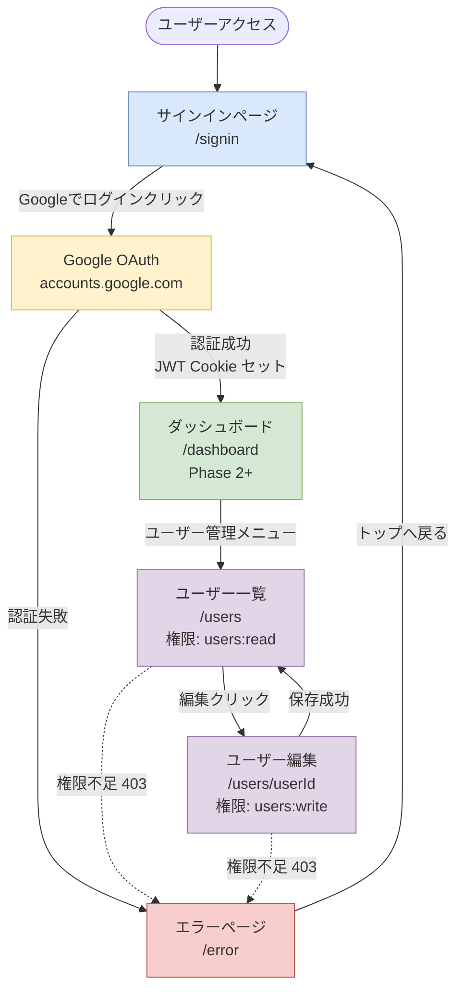

# Auth サービス 要件定義書

---

## 1. ビジネス要件

### 1.1 背景・目的

nagiyu プラットフォームは複数のサービス (admin, logs, tools 等) で構成されており、各サービスで統一された認証・認可機能が必要です。Auth サービスは、プラットフォーム全体の認証・認可を一元管理し、シームレスなユーザー体験を提供します。

**課題**:
- 各サービスで個別に認証機能を実装するとコストが増大
- 認証情報の一貫性が保てない
- セキュリティポリシーの統一管理が困難

**解決策**:
- Auth サービスで認証・認可を集約
- JWT トークンを用いたステートレス認証
- サブドメイン全体でのシングルサインオン (SSO)

### 1.2 対象ユーザー

#### プライマリーユーザー
- **プラットフォーム管理者**: ユーザー管理、ロール割り当てを行う
- **エンドユーザー**: Google アカウントでログインし、各サービスを利用

#### セカンダリーユーザー
- **開発者**: Auth サービスのAPIを利用して他サービスを実装
- **運用担当者**: デプロイ、監視、障害対応を実施

### 1.3 ビジネスゴール

#### Phase 1 の目標
1. **認証基盤の確立**: Google OAuth による安全な認証機能を提供
2. **SSO 実現**: 一度のログインで全サービスにアクセス可能
3. **ユーザー管理**: プラットフォーム共通のユーザー情報管理
4. **ロール・権限管理**: 管理者とユーザーを区別し、適切なアクセス制御

#### Phase 2 以降の目標
- 複数 OAuth プロバイダー対応 (GitHub 等)
- パスワード認証の追加
- 多要素認証 (MFA) の実装
- 監査ログ機能

---

## 2. 機能要件

### 2.1 ユースケース

#### UC-001: Google アカウントでログイン

- **概要**: ユーザーが Google アカウントを使用してプラットフォームにログインする
- **アクター**: エンドユーザー
- **前提条件**: ユーザーが Google アカウントを所持している
- **正常フロー**:
  1. ユーザーが `/signin` にアクセス
  2. 「Google でログイン」ボタンをクリック
  3. Google OAuth 認証画面にリダイレクト
  4. Google アカウントでログイン・同意
  5. Auth サービスにコールバック
  6. JWT トークンが発行され、クッキーにセット
  7. ダッシュボードにリダイレクト (Phase 2+)
- **代替フロー**: なし (Phase 1 では Google OAuth のみ)
- **例外フロー**: 
  - Google 認証失敗時: エラーページを表示
  - ユーザー作成失敗時: エラーページを表示

#### UC-002: 他サービスへのシングルサインオン

- **概要**: Auth サービスでログイン後、他サービスに自動的にログインできる
- **アクター**: エンドユーザー
- **前提条件**: Auth サービスでログイン済み (JWT クッキーが存在)
- **正常フロー**:
  1. ユーザーが `admin.nagiyu.com` にアクセス
  2. Admin サービスが JWT クッキーを検証
  3. 有効な場合、ダッシュボードを表示
  4. 無効な場合、Auth サービスのログインページにリダイレクト
- **代替フロー**: なし
- **例外フロー**: JWT 有効期限切れの場合、再ログインが必要

#### UC-003: ユーザー一覧の閲覧

- **概要**: 管理者がプラットフォームに登録されているユーザー一覧を閲覧する
- **アクター**: 管理者 (users:read 権限を持つユーザー)
- **前提条件**: ログイン済み、users:read 権限を所持
- **正常フロー**:
  1. 管理者が `/users` にアクセス
  2. ユーザー一覧が表示される (メールアドレス、名前、ロール、最終ログイン日時)
  3. ページネーションで次ページを読み込み可能
- **代替フロー**: なし
- **例外フロー**: 権限不足の場合、403 Forbidden

#### UC-004: ユーザー情報の編集とロール割り当て

- **概要**: 管理者がユーザーの名前やロールを変更する
- **アクター**: 管理者 (users:write, roles:assign 権限を持つユーザー)
- **前提条件**: ログイン済み、適切な権限を所持
- **正常フロー**:
  1. 管理者がユーザー一覧から対象ユーザーをクリック
  2. ユーザー詳細・編集画面が表示
  3. 名前やロールを変更
  4. 「保存」ボタンをクリック
  5. 変更が DynamoDB に保存される
  6. ユーザー一覧に戻る
- **代替フロー**: なし
- **例外フロー**: 
  - 権限不足の場合、403 Forbidden
  - 自分自身のロールを変更しようとした場合、エラー

#### UC-005: サインアウト

- **概要**: ユーザーがログアウトする
- **アクター**: エンドユーザー
- **前提条件**: ログイン済み
- **正常フロー**:
  1. ユーザーが「サインアウト」をクリック
  2. JWT クッキーが削除される
  3. サインインページにリダイレクト
- **代替フロー**: なし
- **例外フロー**: なし

### 2.2 機能一覧

| 機能ID | 機能名               | 説明                                                       | 優先度 |
| ------ | -------------------- | ---------------------------------------------------------- | ------ |
| F-001  | Google OAuth ログイン | Google アカウントを使用した認証                             | 高     |
| F-002  | JWT トークン発行      | ステートレスな認証トークンを発行                            | 高     |
| F-003  | セッション管理        | JWT クッキーによるセッション管理                            | 高     |
| F-004  | シングルサインオン    | サブドメイン全体での認証共有                                | 高     |
| F-005  | ユーザー一覧取得      | 登録ユーザーの一覧を取得する API                            | 高     |
| F-006  | ユーザー詳細取得      | 特定ユーザーの詳細情報を取得する API                        | 高     |
| F-007  | ユーザー情報更新      | ユーザーの名前やロールを更新する API                        | 高     |
| F-008  | ユーザー削除          | ユーザーを削除する API                                      | 中     |
| F-009  | ロール・権限管理      | ロールベースアクセス制御 (RBAC) の実装                      | 高     |
| F-010  | サインアウト          | JWT クッキーを削除してログアウト                            | 高     |

---

## 3. 非機能要件

### 3.1 パフォーマンス要件

| 項目               | 要件                                    |
| ------------------ | --------------------------------------- |
| 応答時間           | 95パーセンタイルで 2秒以内              |
| OAuth ログイン時間 | 5秒以内 (Google API 依存)               |
| JWT 検証時間       | 100ms 以内 (署名検証のみ)               |
| DynamoDB 応答時間  | 100ms 以内 (オンデマンド課金)           |

### 3.2 セキュリティ要件

#### 認証・認可
- **OAuth プロトコル**: OAuth 2.0 に準拠
- **JWT 署名**: HMAC-SHA256 (HS256) で署名
- **クッキー属性**: HttpOnly, Secure, SameSite=Lax
- **権限チェック**: サーバーサイドで必須実施

#### データ保護
- **DynamoDB 暗号化**: AWS KMS による暗号化 (At Rest)
- **通信暗号化**: HTTPS 通信 (In Transit)
- **シークレット管理**: AWS Secrets Manager で管理

#### セキュリティ対策
- **CSRF 対策**: state パラメータ、SameSite クッキー
- **XSS 対策**: React の自動エスケープ、DOMPurify
- **権限昇格防止**: 自分自身のロールを変更不可

### 3.3 可用性要件

| 項目               | 要件                                    |
| ------------------ | --------------------------------------- |
| 稼働率             | 99.9% (AWS SLA に準拠)                  |
| Multi-AZ           | DynamoDB, Lambda は自動的に Multi-AZ    |
| 復旧目標時間 (RTO) | 30分以内                                |
| 復旧目標時点 (RPO) | 5分以内 (DynamoDB Point-in-Time Recovery) |

### 3.4 保守性・拡張性要件

#### コード品質
- TypeScript strict mode 必須
- テストカバレッジ 80%以上
- ESLint, Prettier による自動チェック

#### モジュール化
- ロール・権限定義はコードで管理 (`libs/common/src/auth/`)
- NextAuth.js を使用し、OAuth プロバイダー追加が容易

#### 拡張ポイント
- OAuth プロバイダーの追加 (GitHub, メールアドレス認証等)
- 新しいロール・権限の追加
- Phase 2 以降での監査ログ機能追加

### 3.5 その他の非機能要件

#### スケーラビリティ
- Lambda 同時実行数: 自動スケール (最大1000)
- DynamoDB: オンデマンド課金で自動スケール

#### データ保持
- ユーザーデータ: 無期限 (削除されるまで)
- CloudWatch Logs: 30日 (dev), 90日 (prod)

#### 互換性
- ブラウザ: Chrome, Safari, Firefox の最新版をサポート
- モバイル: iOS Safari, Android Chrome をサポート

---

## 4. UI/UX 要件

### 4.1 画面一覧

| 画面名               | パス               | 説明                                     | 優先度 |
| -------------------- | ------------------ | ---------------------------------------- | ------ |
| サインインページ     | `/signin`          | Google OAuth ボタンを表示                | 高     |
| ユーザー一覧         | `/users`           | 登録ユーザー一覧を表示 (users:read 必要) | 高     |
| ユーザー詳細・編集   | `/users/{userId}`  | ユーザー情報の編集とロール割り当て       | 高     |
| エラーページ         | `/error`           | 認証エラー、権限エラーを表示             | 中     |

### 4.2 画面遷移図

### 4.3 主要画面の UI 要件

#### サインインページ (/signin)

**概要**: Google OAuth ログインボタンを表示する最小限のページ

**主要UI要素**:
- Google ログインボタン (Material-UI Button コンポーネント)
- プラットフォームロゴ
- 簡単な説明文 (「nagiyu プラットフォームへようこそ」等)

**インタラクション**:
- ボタンクリック時: Google OAuth 認証画面にリダイレクト

**表示条件**: 常に表示 (ログイン済みの場合は別ページへリダイレクト)

#### ユーザー一覧ページ (/users)

**概要**: 登録ユーザーをテーブル形式で表示

**主要UI要素**:
- データテーブル (Material-UI Table コンポーネント)
  - カラム: メールアドレス、名前、ロール、最終ログイン日時
- ページネーション (次ページ、前ページ)
- 検索・フィルタ機能 (Phase 2 以降)

**インタラクション**:
- 行クリック: ユーザー詳細ページへ遷移
- ページネーション: 次ページのデータを取得

**表示条件**: users:read 権限が必要

#### ユーザー詳細・編集ページ (/users/{userId})

**概要**: ユーザー情報の表示と編集、ロール割り当て

**主要UI要素**:
- テキストフィールド: 名前 (編集可能)
- セレクトボックス: ロール (複数選択可能)
- 保存ボタン、キャンセルボタン
- 削除ボタン (users:write 権限が必要)

**インタラクション**:
- 保存ボタンクリック: API 呼び出し、成功時にユーザー一覧へ戻る
- キャンセルボタンクリック: 編集内容を破棄してユーザー一覧へ戻る
- 削除ボタンクリック: 確認ダイアログ表示後、削除実行

**表示条件**: users:write 権限が必要 (ロール変更には roles:assign も必要)

### 4.4 レスポンシブ対応要件

| デバイス     | 対応要件                                                                 |
| ------------ | ------------------------------------------------------------------------ |
| デスクトップ | 1920x1080 を基準に最適化                                                 |
| タブレット   | 768px 以上で表示可能 (テーブルは横スクロール可)                          |
| モバイル     | 375px 以上で表示可能 (テーブルはカード形式に変更)                        |

### 4.5 アクセシビリティ要件

- **WCAG 準拠レベル**: AA
- **キーボード操作**: Tab キーでフォーカス移動、Enter キーで実行
- **スクリーンリーダー対応**: aria-label, aria-describedby を適切に使用
- **カラーコントラスト**: 4.5:1 以上 (WCAG AA 準拠)

### 4.6 UI/UX ガイドライン

- **デザインシステム**: Material-UI 7.x を使用
- **カラーパレット**: Material-UI デフォルトテーマを基準
- **タイポグラフィ**: システムフォント (Geist は使用しない、ビルド環境の制約のため)
- **スペーシング**: Material-UI の spacing 関数を使用 (8px グリッド)

---

## 5. スコープ外

以下は Phase 1 で実装しない機能です:

- ❌ パスワード認証 (Phase 2 以降で検討)
- ❌ GitHub OAuth、その他 OAuth プロバイダー (Phase 2 以降で検討)
- ❌ 多要素認証 (MFA) (Phase 2 以降で検討)
- ❌ パスワードリセット機能 (パスワード認証実装後)
- ❌ アカウント削除のセルフサービス (Phase 2 以降で検討)
- ❌ 監査ログ閲覧 (logs サービスの責務、Phase 2 以降)
- ❌ PWA 対応 (Auth サービスは認証が必須のため、PWA は無効)

---

## 6. 用語集

| 用語          | 定義                                                                 |
| ------------- | -------------------------------------------------------------------- |
| SSO           | Single Sign-On。一度のログインで複数サービスにアクセスできる仕組み |
| JWT           | JSON Web Token。JSON 形式の署名付きトークン                          |
| RBAC          | Role-Based Access Control。ロールベースアクセス制御                  |
| OAuth 2.0     | 認可のためのオープン標準プロトコル                                   |
| DynamoDB      | AWS の NoSQL データベースサービス                                    |
| CloudFront    | AWS のコンテンツ配信ネットワーク (CDN)                               |
| NextAuth.js   | Next.js 用の認証ライブラリ                                           |
| ACM           | AWS Certificate Manager。SSL/TLS 証明書管理サービス                  |
