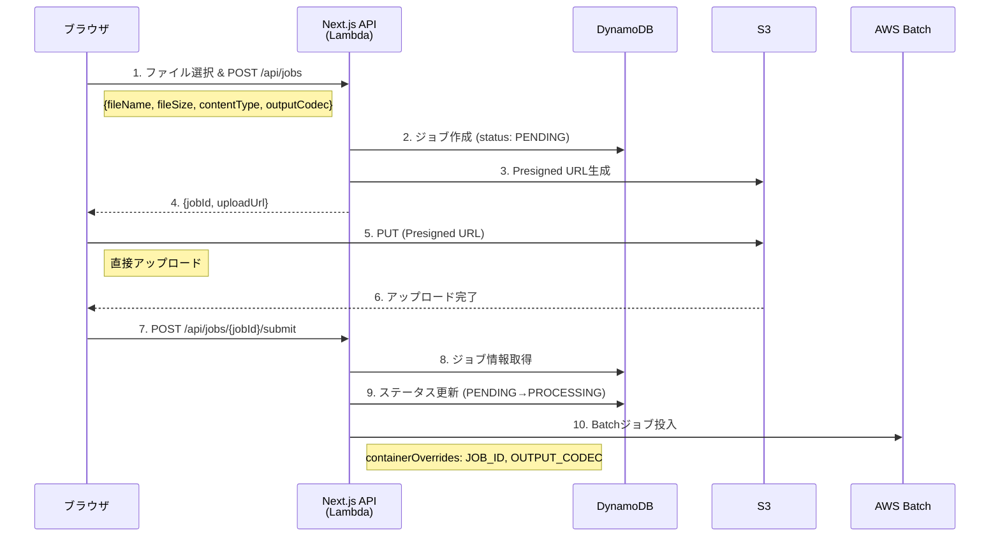
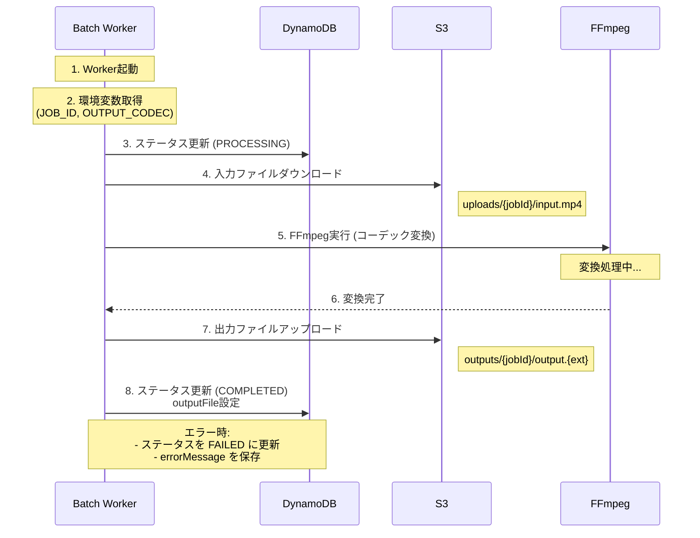
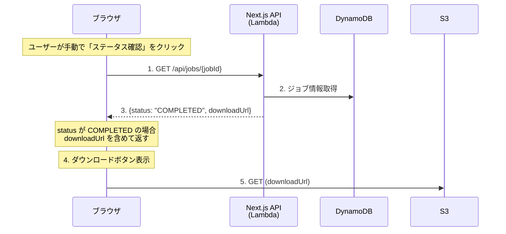

# アーキテクチャ設計

## システム概要

Codec Converterは、サーバーレスアーキテクチャを採用した動画変換サービスです。
フロントエンドはNext.jsをLambdaで実行し、変換処理はAWS Batchで行います。

### 主要コンポーネント

| コンポーネント | 役割 | 技術 |
|-------------|------|------|
| **CloudFront** | CDN、SSL/TLS終端、カスタムドメイン | AWS CloudFront |
| **Lambda** | Next.js SSR、API | AWS Lambda (コンテナ) + Lambda Web Adapter |
| **S3** | 動画ファイルストレージ | Amazon S3 |
| **DynamoDB** | ジョブ管理 | Amazon DynamoDB |
| **Batch** | 動画変換処理 | AWS Batch (Fargate) + FFmpeg |
| **ECR** | コンテナイメージレジストリ | Amazon ECR |

### 共有パッケージ: `@nagiyu-platform/codec-converter-common`

Next.js Lambda と Batch Worker で共通して使用する TypeScript パッケージ。

**配置場所**: `services/codec-converter-common/`

**提供機能**:
- **型定義**: `Job`, `JobStatus`, `CodecType`
- **定数**: `MAX_FILE_SIZE` (500MB), `CONVERSION_TIMEOUT_SECONDS` (7200秒), `JOB_EXPIRATION_SECONDS` (86400秒), `ALLOWED_MIME_TYPES`, `ALLOWED_FILE_EXTENSIONS`, `CODEC_FILE_EXTENSIONS`
- **バリデーション関数**: `validateFileSize()`, `validateMimeType()`, `validateFileExtension()`, `validateFile()`

**使用例**:
```typescript
import {
  Job,
  JobStatus,
  MAX_FILE_SIZE,
  validateFile,
} from '@nagiyu-platform/codec-converter-common';

// バリデーション
const result = validateFile('video.mp4', 100 * 1024 * 1024, 'video/mp4');
if (!result.isValid) {
  return { error: result.errorMessage };
}

// 型安全なジョブ作成
const job: Job = {
  jobId: uuid(),
  status: 'PENDING',
  outputCodec: 'h264',
  // ...
};
```

**注**: このパッケージは `services/` 配下に配置されており、Codec Converter サービス専用です。プラットフォーム全体で共有するライブラリは `libs/` 配下に配置します。

---

## システム構成図


---

## データフロー

### 1. アップロードフロー



**ステップ**:

1. ブラウザ上でユーザーがファイルを選択し、Next.js API Routes (`/api/jobs`) を呼び出し
    - Request: `{ fileName, fileSize, contentType, outputCodec }`
2. Next.js API (Lambda上で実行):
    - ジョブIDを生成 (UUID v4)
    - DynamoDBにジョブレコード作成 (status: PENDING)
    - S3 Presigned URL生成 (uploads/{jobId}/input.mp4)
3. Next.js API → ブラウザ: `{ jobId, uploadUrl }`
4. ブラウザ → S3: PUT (Presigned URL)
    - 直接アップロード（Lambda/Next.jsを経由しない）
5. アップロード完了後、ブラウザ → Next.js API: `POST /api/jobs/{jobId}/submit`
6. Next.js API (Lambda上で実行):
    - DynamoDBからジョブ情報取得
    - ジョブステータスをPENDING → PROCESSINGに更新（条件付き更新で競合防止）
    - Batchジョブ投入
        - containerOverrides.environment: JOB_ID, OUTPUT_CODEC

### 2. 変換処理フロー



**ステップ**:

1. Batch Worker起動
2. 環境変数から取得: JOB_ID, OUTPUT_CODEC, S3_BUCKET, DYNAMODB_TABLE
3. DynamoDBのステータスを PROCESSING に更新
4. S3から入力ファイルダウンロード (`uploads/{jobId}/input.mp4`)
5. FFmpegで変換実行
    - H.264: libx264, CRF 23, AAC 128k
    - VP9: libvpx-vp9, CRF 30, Opus 128k
    - AV1: libaom-av1, CRF 30 cpu-used 4, Opus 128k
6. S3へ出力ファイルアップロード (`outputs/{jobId}/output.{ext}`)
7. DynamoDBのステータスを COMPLETED に更新
    - outputFile を設定
8. エラー時:
    - DynamoDBのステータスを FAILED に更新
    - errorMessage を保存

### 3. ダウンロードフロー



**ステップ**:

1. ユーザーが「ステータス確認」ボタンをクリック
2. ブラウザ → Next.js API: `GET /api/jobs/{jobId}`
3. Next.js API (Lambda上で実行):
    - DynamoDBからジョブ情報取得
    - ステータスが `COMPLETED` の場合、S3 Presigned URL生成 (`outputs/{jobId}/output.{ext}`)
    - 有効期限: 24時間
4. Next.js API → ブラウザ: `{ jobId, status, fileName, ..., downloadUrl? }`
    - `downloadUrl` は `status === "COMPLETED"` の場合のみ含まれる
5. ブラウザ: ステータス表示、COMPLETED なら「ダウンロード」ボタンを表示
6. ユーザーがダウンロードボタンをクリック → S3から直接ダウンロード

---

## API設計

### エンドポイント一覧

| メソッド | パス | 説明 |
|---------|------|------|
| POST | `/api/jobs` | 新規ジョブ作成、アップロード用Presigned URL取得 |
| POST | `/api/jobs/{jobId}/submit` | Batchジョブ投入 |
| GET | `/api/jobs/{jobId}` | ジョブステータス取得、COMPLETED時はダウンロードURL含む |

---

### POST /api/jobs

新しい変換ジョブを作成し、アップロード用の Presigned URL を取得します。

**リクエスト**:
```json
{
    "fileName": "sample.mp4",
    "fileSize": 52428800,
    "contentType": "video/mp4",
    "outputCodec": "h264"
}
```

**リクエストボディ**:

| フィールド | 型 | 必須 | 説明 |
|----------|------|------|------|
| fileName | string | ✅ | ファイル名（拡張子含む） |
| fileSize | number | ✅ | ファイルサイズ（バイト）、最大 524,288,000（500MB） |
| contentType | string | ✅ | `video/mp4` のみ許可 |
| outputCodec | string | ✅ | `h264` / `vp9` / `av1` のいずれか |

**レスポンス（201 Created）**:
```json
{
    "jobId": "550e8400-e29b-41d4-a716-446655440000",
    "uploadUrl": "https://codec-converter-storage.s3.us-east-1.amazonaws.com/uploads/550e8400-e29b-41d4-a716-446655440000/input.mp4?X-Amz-Algorithm=...",
    "expiresIn": 3600
}
```

| フィールド | 型 | 説明 |
|----------|------|------|
| jobId | string | ジョブID（UUID v4） |
| uploadUrl | string | S3 Presigned URL（有効期限1時間） |
| expiresIn | number | Presigned URL の有効期限（秒） |

**エラー（400 Bad Request）**:
```json
{
    "error": "INVALID_FILE_SIZE",
    "message": "ファイルサイズは500MB以下である必要があります"
}
```

---

### POST /api/jobs/{jobId}/submit

アップロード完了後、変換ジョブを実行開始します。

**パスパラメータ**:

| パラメータ | 型 | 説明 |
|----------|------|------|
| jobId | string | ジョブID（UUID v4） |

**レスポンス（200 OK）**:
```json
{
    "jobId": "550e8400-e29b-41d4-a716-446655440000",
    "status": "PROCESSING"
}
```

**エラー（404 Not Found）**:
```json
{
    "error": "JOB_NOT_FOUND",
    "message": "指定されたジョブが見つかりません"
}
```

**エラー（409 Conflict）**:
```json
{
    "error": "INVALID_STATUS",
    "message": "ジョブは既に実行中または完了しています"
}
```

---

### GET /api/jobs/{jobId}

ジョブの現在のステータスを取得します。ステータスが `COMPLETED` の場合、レスポンスに `downloadUrl` を含めます。

**パスパラメータ**:

| パラメータ | 型 | 説明 |
|----------|------|------|
| jobId | string | ジョブID（UUID v4） |

**レスポンス（200 OK - PROCESSING時）**:
```json
{
    "jobId": "550e8400-e29b-41d4-a716-446655440000",
    "status": "PROCESSING",
    "fileName": "sample.mp4",
    "fileSize": 52428800,
    "outputCodec": "h264",
    "createdAt": 1704067200,
    "updatedAt": 1704067800
}
```

**レスポンス（200 OK - COMPLETED時）**:
```json
{
    "jobId": "550e8400-e29b-41d4-a716-446655440000",
    "status": "COMPLETED",
    "fileName": "sample.mp4",
    "fileSize": 52428800,
    "outputCodec": "h264",
    "createdAt": 1704067200,
    "updatedAt": 1704067800,
    "downloadUrl": "https://codec-converter-storage.s3.us-east-1.amazonaws.com/outputs/550e8400-e29b-41d4-a716-446655440000/output.mp4?X-Amz-Algorithm=..."
}
```

**レスポンスフィールド**:

| フィールド | 型 | 説明 |
|----------|------|------|
| jobId | string | ジョブID |
| status | string | `PENDING` / `PROCESSING` / `COMPLETED` / `FAILED` |
| fileName | string | 元のファイル名 |
| fileSize | number | ファイルサイズ（バイト） |
| outputCodec | string | 出力コーデック |
| createdAt | number | 作成日時（Unix timestamp 秒） |
| updatedAt | number | 更新日時（Unix timestamp 秒） |
| downloadUrl | string | ダウンロード用 Presigned URL（`COMPLETED` 時のみ、有効期限24時間） |
| errorMessage | string | エラーメッセージ（`FAILED` 時のみ） |

**エラー（404 Not Found）**:
```json
{
    "error": "JOB_NOT_FOUND",
    "message": "指定されたジョブが見つかりません"
}
```

---

## データモデル

### DynamoDBテーブル: `codec-converter-jobs-{env}`

**主キー**: `jobId` (String)

**属性**:
```typescript
{
    jobId: string;              // UUID v4
    status: "PENDING" | "PROCESSING" | "COMPLETED" | "FAILED";
    inputFile: string;          // S3キー: uploads/{jobId}/input.mp4
    outputFile?: string;        // S3キー: outputs/{jobId}/output.{ext}
    outputCodec: "h264" | "vp9" | "av1";
    fileName: string;           // 元ファイル名
    fileSize: number;           // バイト
    createdAt: number;          // Unix timestamp (秒)
    updatedAt: number;          // Unix timestamp (秒)
    expiresAt: number;          // Unix timestamp (秒), TTL用
    errorMessage?: string;      // FAILED時のエラー内容
}
```

**TTL設定**: `expiresAt` フィールド（ジョブ作成時に `createdAt + 86400` をセット）

### S3バケット: `codec-converter-storage-{env}`

**構造**:
```
codec-converter-storage-{env}/
├── uploads/
│   └── {jobId}/
│       └── input.mp4
└── outputs/
    └── {jobId}/
        └── output.{mp4|webm}
```

**設定**:
- 暗号化: SSE-S3
- Lifecycle Policy: すべてのオブジェクトを24時間後に削除
- バージョニング: 無効
- 公開アクセス: ブロック（Presigned URLのみ）

---

## インフラ構成

### AWS Batch

**Compute Environment**:
- タイプ: Fargate
- 最大vCPU: 6（3ジョブ × 2vCPU）
- サブネット: パブリックサブネット（プラットフォーム共通VPC: `nagiyu-{env}-vpc`）

**Job Queue**:
- スケジューリング: デフォルト（投入順に処理）
- 優先度: 1

**Job Definition**:
- プラットフォーム: Fargate
- vCPU: 2
- メモリ: 4096 MB
- タイムアウト: 7200秒（2時間）
- リトライ: 1回
- イメージ: `{account}.dkr.ecr.{region}.amazonaws.com/codec-converter-ffmpeg-{env}:latest`
- 環境変数（静的）:
    - `S3_BUCKET`: `codec-converter-storage-{env}`
    - `DYNAMODB_TABLE`: `codec-converter-jobs-{env}`
    - `AWS_REGION`: リージョン
- 環境変数（動的、containerOverridesで渡す）:
    - `JOB_ID`: ジョブID
    - `OUTPUT_CODEC`: 出力コーデック

### Lambda

**設定**:
- ランタイム: コンテナイメージ
- メモリ: 1024 MB
- タイムアウト: 30秒
- 環境変数:
    - `DYNAMODB_TABLE`: `codec-converter-jobs-{env}`
    - `S3_BUCKET`: `codec-converter-storage-{env}`
    - `BATCH_JOB_QUEUE`: Batch Job Queue名
    - `BATCH_JOB_DEFINITION`: Batch Job Definition名
    - `AWS_REGION`: リージョン

**Function URL**:
- 認証: NONE（パブリックアクセス）
- CORS: 有効

### CloudFront

**設定**:
- オリジン: Lambda Function URL
- ビヘイビア:
    - デフォルト: Lambda（キャッシュ無効、すべてのHTTPメソッド許可）
    - `/api/*`: Lambda（キャッシュ無効）
    - `/_next/static/*`: Lambda（キャッシュ有効、1年）
    - `/favicon.ico`: Lambda（キャッシュ有効、1日）
- カスタムドメイン: `codec-converter.{domain}`（ACM証明書使用）
- 圧縮: 有効（Gzip, Brotli）

---

## セキュリティ設計

### データ暗号化

**転送時**:
- すべての通信でHTTPS使用
- CloudFront → Lambda: TLS 1.2以上
- Lambda → S3/DynamoDB: TLS 1.2以上

**保存時**:
- S3: SSE-S3（サーバー側暗号化）
- DynamoDB: デフォルト暗号化（AWS管理キー）

### アクセス制御

**S3バケット**:
- パブリックアクセス: すべてブロック
- アクセス方法: Presigned URLのみ
- CORS設定:
    ```json
    {
        "AllowedOrigins": ["https://codec-converter.{domain}"],
        "AllowedMethods": ["PUT", "GET"],
        "AllowedHeaders": ["*"],
        "MaxAgeSeconds": 3600
    }
    ```

**DynamoDB**:
- アクセス方法: IAMロールのみ
    - Lambda実行ロール: GetItem, PutItem, UpdateItem
    - Batch実行ロール: GetItem, UpdateItem

**IAMロール設計**:
- Lambda実行ロール:
    - S3: GetObject, PutObject（Presigned URL生成のみ、実際のアクセスはユーザーから）
    - DynamoDB: GetItem, PutItem, UpdateItem, DeleteItem
    - Batch: SubmitJob
    - CloudWatch Logs: CreateLogGroup, CreateLogStream, PutLogEvents
- Batch Job実行ロール:
    - S3: GetObject, PutObject（実際のファイル操作）
    - DynamoDB: GetItem, UpdateItem
    - CloudWatch Logs: CreateLogGroup, CreateLogStream, PutLogEvents

### セキュリティヘッダー

CloudFrontで以下のヘッダーを設定:
```
Strict-Transport-Security: max-age=31536000; includeSubDomains
X-Content-Type-Options: nosniff
X-Frame-Options: DENY
Content-Security-Policy: default-src 'self'; script-src 'self' 'unsafe-inline' 'unsafe-eval'; style-src 'self' 'unsafe-inline';
Referrer-Policy: strict-origin-when-cross-origin
```

---

## CI/CD パイプライン

### 環境構成

| 環境 | ブランチ | デプロイタイミング | 用途 |
|------|---------|------------------|------|
| **dev** | `integration/codec-converter`, `develop` | マージ時に自動デプロイ | 開発・検証環境 |
| **prod** | `master` | マージ時に自動デプロイ | 本番環境 |

**リソース命名規則**:
- S3バケット: `codec-converter-storage-{env}`
- DynamoDBテーブル: `codec-converter-jobs-{env}`
- Lambda関数: `codec-converter-{env}`
- Batchジョブ定義: `codec-converter-job-{env}`
- Batchジョブキュー: `codec-converter-queue-{env}`
- CloudFrontドメイン:
    - dev: `dev-codec-converter.{domain}` (例: `dev-codec-converter.example.com`)
    - prod: `codec-converter.{domain}` (例: `codec-converter.example.com`)

### GitHub Actions ワークフロー

#### 1. Fast Verify (`.github/workflows/codec-converter-verify-fast.yml`)

**トリガー**: `integration/codec-converter` ブランチへのPull Request

**実行内容**:
- 共通ライブラリのビルド（依存関係順: common → browser → ui）
- Next.jsアプリケーションのビルド検証
- Batch Worker のビルド検証
- 両サービスのユニットテスト実行
- E2Eテスト実行（chromium-desktop のみ、codec-converter のみ）
- 両サービスの Lint/Format チェック

**目的**: 開発中の素早いフィードバック

#### 2. Full Verify (`.github/workflows/codec-converter-verify-full.yml`)

**トリガー**: `develop`, `master` ブランチへのPull Request

**実行内容**:
- Fast Verifyと同じ内容
- 両サービスのカバレッジチェック（80%以上）

**目的**: 本番マージ前の完全な品質チェック

#### 3. Deploy (`.github/workflows/codec-converter-deploy.yml`)

**トリガー**: `integration/codec-converter`, `develop`, `master` ブランチへのマージ完了時

**実行内容**:
1. 環境判定
    - `integration/codec-converter` → `dev`
    - `develop` → `dev`
    - `master` → `prod`
2. 共通ライブラリのビルド（依存関係順: common → browser → ui）
3. Lambda コンテナイメージのビルド・プッシュ（ECR）
4. Batch Worker コンテナイメージのビルド・プッシュ（ECR）
5. Lambda関数の更新（イメージ URI 更新）
6. Batchジョブ定義の更新

### テスト戦略

#### テストデバイス構成

Codec Converterは**PCターゲット**のため、以下のデバイス構成を採用:
- **chromium-desktop**: 1920x1080（デスクトップPC環境）

**注**: 本プラットフォームの標準テスト戦略ではスマホファースト（chromium-mobile優先）を推奨していますが、Codec Converterは大容量ファイルを扱うサービス特性上、PC環境のみを対象とします。

#### E2Eテストシナリオ（最小構成）

**シナリオ1: 正常系（H.264変換）**
1. トップ画面にアクセス
2. 50MBのMP4ファイルをドラッグ&ドロップ
3. 出力コーデック「H.264」を選択
4. 「変換開始」ボタンをクリック
5. ジョブ詳細画面に遷移し、ジョブIDが表示される
6. ステータスが「PENDING」と表示される
7. 「ステータス確認」ボタンをクリック
8. ステータスが「PROCESSING」に変わる（モック環境では即座に「COMPLETED」に変更）
9. 「ダウンロード」ボタンが表示される
10. ダウンロードボタンをクリックし、ファイルがダウンロードされる

**シナリオ2: 異常系（ファイルサイズ超過）**
1. トップ画面にアクセス
2. 600MBのMP4ファイルを選択
3. エラーメッセージ「ファイルサイズは500MB以下である必要があります」が表示される
4. 「変換開始」ボタンが非活性のまま

**シナリオ3: 異常系（不正なファイル形式）**
1. トップ画面にアクセス
2. MP4以外のファイル（例: test.txt）を選択
3. エラーメッセージ「MP4ファイルのみアップロード可能です」が表示される
4. 「変換開始」ボタンが非活性のまま

#### ユニットテストカバレッジ目標

- **ビジネスロジック** (`lib/`): 80%以上
    - Parser/Formatter: バリデーション、形式変換ロジック
    - AWS SDK ラッパー関数 (S3, DynamoDB, Batch)
    - エラーハンドリング関数
- **UI層** (`components/`, `app/`): E2Eテストで補完（カバレッジ目標なし）

### 共通ライブラリのビルド順序

**依存関係**:
- `@nagiyu/common`: フレームワーク非依存（他に依存なし）
- `@nagiyu/browser`: `@nagiyu/common` に依存
- `@nagiyu/ui`: `@nagiyu/browser` と Next.js + Material-UI に依存
- アプリケーション: `@nagiyu/ui` に依存

**重要な制約**:
- 並列ビルド（`npm run build --workspaces`）は依存関係を考慮しないため使用禁止
- 必ず依存関係順に逐次ビルドすること（common → browser → ui → アプリケーション）

**注**: Codec Converter と Codec Converter Worker の共通処理（AWS SDKラッパーなど）は `services/codec-converter/src/lib/shared/` のようにサービス内に配置し、Dockerfileで両方のコンテナに含める。`libs/` 配下には配置しない。

### 開発環境セットアップ

#### AWS SDK の依存注入 (DI)

**方針**:
- S3, DynamoDB, Batch などの AWS SDK クライアントは依存注入パターンを採用
- テスト時にモック実装を注入可能にする
- ビジネスロジックを AWS サービスから切り離してテスト容易性を確保

**実装方針**:
- AWS SDK ラッパー関数（`services/codec-converter/src/lib/shared/aws/`）でクライアントを受け取る設計
- ユニットテスト: モックオブジェクトを注入
- E2Eテスト: 実際の AWS SDK クライアント、または localstack を使用
- 本番: 実際の AWS SDK クライアントを注入

**モック環境**:
- ユニットテスト: Jest のモック機能を使用
- E2Eテスト: AWS SDK の実クライアントを使用（dev 環境のリソースに接続）
- ローカル開発: 必要に応じて localstack を使用（オプション）

#### ログ出力

**方針**:
- 構造化ログ形式（JSON）を採用
- CloudWatch Logs に出力
- ログレベル: INFO 以上（DEBUG はローカル開発時のみ）

**ログフォーマット**:
```json
{
    "level": "INFO",
    "timestamp": "2024-01-01T12:00:00.000Z",
    "service": "codec-converter",
    "jobId": "550e8400-e29b-41d4-a716-446655440000",
    "message": "Job status updated",
    "details": {
        "previousStatus": "PENDING",
        "newStatus": "PROCESSING"
    }
}
```

**ログレベル**:
- **ERROR**: エラー発生時（FFmpeg 失敗、AWS SDK エラーなど）
- **WARN**: 警告（リトライ発生など）
- **INFO**: 重要なイベント（ジョブステータス変更、ファイルアップロード完了など）
- **DEBUG**: デバッグ情報（ローカル開発時のみ）

### 環境変数管理

#### Lambda環境変数

| 環境変数 | 説明 | 例 |
|---------|------|-----|
| `DYNAMODB_TABLE` | DynamoDBテーブル名 | `codec-converter-jobs-dev` |
| `S3_BUCKET` | S3バケット名 | `codec-converter-storage-dev` |
| `BATCH_JOB_QUEUE` | Batchジョブキュー名 | `codec-converter-queue-dev` |
| `BATCH_JOB_DEFINITION` | Batchジョブ定義名 | `codec-converter-job-dev` |
| `AWS_REGION` | AWSリージョン | `us-east-1` |

#### Batch Worker環境変数（動的、containerOverridesで渡す）

| 環境変数 | 説明 | 例 |
|---------|------|-----|
| `JOB_ID` | ジョブID（UUID v4） | `550e8400-e29b-41d4-a716-446655440000` |
| `OUTPUT_CODEC` | 出力コーデック | `h264` / `vp9` / `av1` |
| `DYNAMODB_TABLE` | DynamoDBテーブル名 | `codec-converter-jobs-dev` |
| `S3_BUCKET` | S3バケット名 | `codec-converter-storage-dev` |
| `AWS_REGION` | AWSリージョン | `us-east-1` |

### デプロイ手順とロールバック

#### 手動デプロイ（緊急時のみ）

Lambda関数を特定のイメージURIで更新する。

#### ロールバック

Lambda関数は以前のバージョンへ即座にロールバック可能:
- AWS CLI: 以前のイメージタグを指定して関数コードを更新
- Lambda コンソール: "Previous version" を選択して復元

---

## 技術選定理由

### Next.js + Lambda Web Adapter

**理由**:
- SSRでSEO対応可能（将来的に必要になる可能性）
- API Routesで簡単にAPIを実装
- Lambda Web Adapterで簡単にLambdaにデプロイ可能
- コンテナイメージで依存関係を統一管理

**代替案との比較**:
- Static Export + API Gateway: SSRが不要ならこちらも選択肢だが、将来の拡張性を考慮
- ECS/Fargate: 常時起動のためコスト高（Phase 1では不採用）

### AWS Batch (Fargate)

**理由**:
- 長時間処理（最大2時間）に対応
- キュー管理が組み込み（FIFO）
- Fargateでサーバー管理不要
- 同時実行数の制御が容易

**代替案との比較**:
- Lambda: 15分制限があり、長時間動画に対応できない
- ECS Service: Batchよりも複雑、キュー管理を自前で実装する必要がある
- EC2: サーバー管理が必要、オートスケーリングの実装が複雑

### DynamoDB

**理由**:
- サーバーレス、自動スケール
- TTLで24時間後に自動削除（運用コスト削減）
- オンデマンド課金で小規模運用に最適
- シンプルなキーバリューストアで十分（複雑なクエリ不要）

**代替案との比較**:
- RDS: オーバースペック、コスト高、サーバー管理が必要
- ElastiCache: TTLは可能だが永続化が課題、障害時にデータ消失

### S3 Presigned URL

**理由**:
- Lambdaのペイロードサイズ制限（6MB）を回避
- ユーザーからS3へ直接アップロード/ダウンロード
- Lambdaの帯域コストを削減
- 実装がシンプル

**代替案との比較**:
- Lambda経由: 500MBのファイルには対応不可
- CloudFront Signed URL: S3 Presigned URLで十分

### AWS CDK (TypeScript)

**理由**:
- プラットフォームの主要言語がTypeScriptで統一性が高い
- 型安全性とIDE補完による開発効率向上
- プログラマティックな記述で複雑なインフラ構成を柔軟に表現可能
- AWS公式サポート、活発なコミュニティ、豊富なドキュメント

**代替案との比較**:
- CloudFormation (YAML): 本プラットフォームの標準だが、複雑な構成では冗長になりやすい
- Terraform: マルチクラウド対応だが、今回はAWS専用で十分
- Pulumi: CDKと同等の機能だが、AWSエコシステムではCDKが主流

**IaC構成**:
- CDKプロジェクトは `infra/codec-converter/` に配置
- 環境ごとのスタック (dev/prod) を分離
- CI/CDからCDKデプロイを実行

### AWS リージョン選定（us-east-1）

**理由**:
- CloudFront との親和性が高い（同一リージョン）
- API リクエストの大半はキャッシュされないため、Lambda へのアクセスが頻繁
- CloudFront → Lambda の通信レイテンシーを最小化
- CloudFront の ACM 証明書は us-east-1 での発行が推奨

**トレードオフ**:
- Lambda/Batch → DynamoDB/S3 の通信は us-east-1 内で完結
- データ保存場所は米国東部（日本国内ではない）
- 日本ユーザーからの体感速度は CloudFront のエッジキャッシュで補完

### CloudFront

**理由**:
- カスタムドメイン対応
- SSL/TLS証明書（ACM）の簡単な設定
- 静的アセット（_next/static/*）のキャッシュで高速化
- DDoS保護（AWS Shield Standard）

**代替案との比較**:
- Lambda Function URL直接: カスタムドメイン未対応、キャッシュなし

---

## スケーラビリティ設計

### フロントエンド（Lambda）

- Lambdaの同時実行数: デフォルト1000（リージョンごと）
- アカウントレベルの制限内で自動スケール
- 想定同時ユーザー数: 小規模（具体的な数値設定なし）

### 変換処理（AWS Batch）

- 同時実行ジョブ数: 3（Phase 1）
- Compute Environmentの最大vCPU: 6（3ジョブ × 2vCPU）
- キューに蓄積されたジョブは順次処理

**将来の拡張**:
- 最大vCPUを増やすことで同時実行数を増加可能
- ジョブの優先度設定（Phase 2以降）

### ストレージ（S3, DynamoDB）

- S3: 自動スケール、容量制限なし
- DynamoDB: オンデマンドモードで自動スケール

---

## 運用設計

### ログ管理

**CloudWatch Logs**:
- Lambda: 自動的に出力、保持期間7日
- Batch Worker: 標準出力をCloudWatch Logsに送信、保持期間7日
- ロググループ:
    - `/aws/lambda/codec-converter-{env}`
    - `/aws/batch/job/codec-converter-{env}`

### モニタリング

**CloudWatch メトリクス**:
- Lambda: 実行時間、エラー率、同時実行数
- Batch: ジョブ数（成功/失敗）、実行時間
- DynamoDB: 読み込み/書き込みユニット消費量
- S3: リクエスト数、データ転送量

**アラーム** (Phase 2以降):
- Batchジョブ失敗率が高い場合
- Lambdaエラー率が高い場合

### データライフサイクル

**自動削除**:
- S3オブジェクト: Lifecycle Policyで24時間後に削除
- DynamoDBレコード: TTLで24時間後に削除

**削除タイミングの詳細**:
- ジョブ作成時に `expiresAt = createdAt + 86400` を設定
- DynamoDB TTLは遅延する可能性があるが、ユーザー影響は軽微（ダウンロード期限は別途Presigned URLの有効期限で制御）

### コスト管理

**主なコスト要素**:
- Lambda: リクエスト数 + 実行時間
- Batch (Fargate): vCPU時間 + メモリ時間
- S3: ストレージ + リクエスト + データ転送
- DynamoDB: 読み込み/書き込みリクエスト（オンデマンド）
- CloudFront: リクエスト + データ転送

**コスト見積もり** (Phase 1, 月間100ジョブ想定):
- Lambda: ~$1
- Batch: ~$5（平均15分/ジョブ × 100ジョブ）
- S3: ~$1（24時間保持のため少量）
- DynamoDB: ~$1
- CloudFront: ~$1
- 合計: ~$10/月
