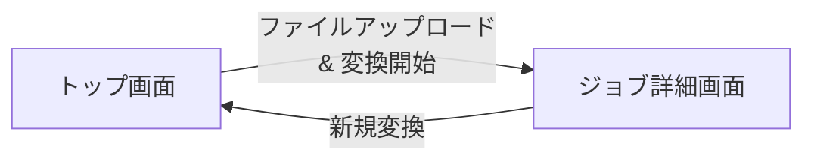

# UI設計

## 概要

Codec Converter の画面設計を定義します。

### 技術スタック

- **UIフレームワーク**: Material-UI (MUI) v7
- **共通UIライブラリ**: `@nagiyu/ui`（Header/Footer、テーマ定義）
- **テーマ管理**: ThemeRegistry（`@nagiyu/ui` のテーマを適用）
- **レイアウト**: Material-UI の Box コンポーネント

### 共通UIコンポーネント

本サービスはプラットフォーム共通の UI コンポーネントを使用しています：

- **Header**: サービスタイトル表示、ナビゲーション
- **Footer**: バージョン情報表示
- **ThemeRegistry**: Material-UI テーマの一元管理、CssBaseline 適用

以下のドキュメントでは、サービス固有のメインコンテンツエリアのみを記載します。

## 画面一覧

| 画面名 | パス | 説明 |
|-------|------|------|
| トップ/アップロード画面 | `/` | ファイルアップロードとコーデック選択 |
| ジョブ詳細画面 | `/jobs/{jobId}` | ジョブステータス確認とダウンロード |

---

## 画面遷移図



---

## 1. トップ/アップロード画面 (`/`)

### 画面概要

動画ファイルをアップロードし、変換コーデックを選択して変換を開始します。

### ワイヤーフレーム


### UI要素

#### ページタイトル
- **表示**: 「Codec Converter」
- **説明**: 「動画ファイルのコーデックを変換します」

#### ファイルアップロードエリア
- **コンポーネント**: Material-UI Box、Button、Typography
- **表示**:
    - 枠線付きの領域（破線、高さ 200px 程度）
    - アイコン: CloudUpload アイコン（@mui/icons-material）
    - テキスト: 「ファイルをドラッグ&ドロップ または クリックして選択」
    - 注釈: 「MP4ファイルのみ、最大500MB」
- **挙動**:
    - ファイルドラッグ時: 枠線をハイライト
    - ファイル選択後: ファイル名とサイズを表示
    - クリック時: ファイル選択ダイアログを開く

#### 出力コーデック選択
- **コンポーネント**: Material-UI FormControl、FormLabel、RadioGroup、Radio
- **選択肢**:
    - `H.264` (デフォルト選択)
    - `VP9`
    - `AV1`
- **説明**: 各コーデックの簡単な説明を表示
    - H.264: 互換性重視（MP4）
    - VP9: バランス型（WebM）
    - AV1: 高圧縮率（WebM）

#### 変換開始ボタン
- **コンポーネント**: Material-UI Button (variant="contained")
- **表示**: 「変換開始」ボタン
- **状態**:
    - 初期状態: 非活性（ファイル未選択）
    - ファイル選択後: 活性化
    - アップロード中: 「アップロード中...」表示、CircularProgress（ローディングスピナー）
- **挙動**:
    - クリック時: ファイルをS3にアップロード → ジョブ詳細画面に遷移

#### エラー表示
- **コンポーネント**: Material-UI Alert (severity="error")
- **表示条件**: バリデーションエラー時
- **エラーメッセージ例**:
    - 「ファイルサイズは500MB以下である必要があります」
    - 「MP4ファイルのみアップロード可能です」
    - 「ファイルのアップロードに失敗しました」

---

## 2. ジョブ詳細画面 (`/jobs/{jobId}`)

### 画面概要

変換ジョブのステータスを確認し、完了後にファイルをダウンロードします。

### ワイヤーフレーム


### UI要素

#### ページタイトル
- **表示**: 「変換ジョブ詳細」

#### ジョブ情報表示
- **コンポーネント**: Material-UI Card、CardContent、Typography
- **ジョブID**: UUID（一部省略表示、例: `550e8400-...`）
- **ファイル名**: 元のファイル名（例: `sample.mp4`）
- **ファイルサイズ**: 人間が読める形式（例: `50.0 MB`）
- **出力コーデック**: 選択したコーデック（例: `H.264`）
- **作成日時**: 日時表示（例: `2024-01-01 12:00:00`）

#### ステータス表示
- **コンポーネント**: Material-UI Chip（ステータスバッジ）、Alert（説明文）
- **表示内容**:
    - **PENDING**: 🟡 待機中 - 「変換処理を待っています」（Chip color="warning"）
    - **PROCESSING**: 🔵 処理中 - 「動画を変換しています...」（Chip color="primary"）
    - **COMPLETED**: 🟢 完了 - 「変換が完了しました」（Chip color="success"）
    - **FAILED**: 🔴 失敗 - エラーメッセージを表示（Chip color="error"、Alert severity="error"）

#### ステータス確認ボタン
- **コンポーネント**: Material-UI Button (variant="outlined")
- **表示**: 「ステータス確認」ボタン
- **表示条件**: PENDING または PROCESSING 時
- **挙動**:
    - クリック時: API を呼び出してステータスを更新
    - ローディング中: ボタンを非活性化、CircularProgress（スピナー）表示

#### ダウンロードボタン
- **コンポーネント**: Material-UI Button (variant="contained", color="primary")
- **表示**: 「ダウンロード」ボタン
- **表示条件**: COMPLETED 時のみ
- **挙動**:
    - クリック時: Presigned URL にアクセスしてダウンロード開始

#### エラーメッセージ表示
- **コンポーネント**: Material-UI Alert (severity="error", role="alert")
- **表示条件**: FAILED 時
- **内容**: `errorMessage` を表示
    - 例: 「FFmpeg conversion failed: Invalid codec parameters」

#### 新規変換ボタン
- **コンポーネント**: Material-UI Button (variant="text")
- **表示**: 「新しい動画を変換」ボタン
- **挙動**: トップ画面に遷移

---

## UI仕様

### レスポンシブ対応

- **デスクトップ**: 最大幅 800px、中央配置（Material-UI Container）
- **モバイル**: 全幅、パディング 16px

### カラー

- **プライマリカラー**: Material-UI テーマのプライマリカラー（`@nagiyu/ui` のテーマ定義に従う）
- **ステータスカラー**（Material-UI Chip の標準色を使用）:
    - PENDING: `warning`（オレンジ）
    - PROCESSING: `primary`（青）
    - COMPLETED: `success`（緑）
    - FAILED: `error`（赤）

### タイポグラフィ

Material-UI Typography コンポーネントを使用:
- **ページタイトル**: `variant="h4"`（太字）
- **セクションタイトル**: `variant="h6"`（太字）
- **本文**: `variant="body1"`
- **注釈**: `variant="body2"`, `color="text.secondary"`

### スペーシング

Material-UI のスペーシングシステム（8px基準）を使用:
- **セクション間**: `sx={{ mb: 4 }}`（32px）
- **要素間**: `sx={{ mb: 2 }}`（16px）
- **パディング**: `sx={{ p: 2 }}`（16px）

---

## コンポーネント構成

### ThemeRegistry

**役割**: Material-UI テーマの一元管理とグローバルレイアウト

**配置**: `src/components/ThemeRegistry.tsx`

**機能**:
- `@nagiyu/ui` から提供される統一テーマの適用
- CssBaseline による CSS リセット
- AppRouterCacheProvider による Next.js App Router との統合
- Header/Footer コンポーネントの配置
- flexbox レイアウト（最小高さ 100vh）

**使用方法**:
```tsx
// src/app/layout.tsx
import ThemeRegistry from '@/components/ThemeRegistry';

export default function RootLayout({ children }) {
  return (
    <html lang="ja">
      <body>
        <ThemeRegistry version="1.0.0">{children}</ThemeRegistry>
      </body>
    </html>
  );
}
```

### Header/Footer

**提供元**: `@nagiyu/ui` パッケージ

**Header**:
- プロパティ: `title`（サービス名）、`ariaLabel`（アクセシビリティ用）
- 表示位置: ページ最上部
- 機能: サービスタイトル表示、ナビゲーション（プラットフォーム共通）

**Footer**:
- プロパティ: `version`（バージョン番号）
- 表示位置: ページ最下部
- 機能: バージョン情報表示（プラットフォーム共通）

### 新規ページ作成時のテンプレート

新しいページを作成する場合、以下のテンプレートを使用:

```tsx
// src/app/new-page/page.tsx
import { Container, Typography, Box } from '@mui/material';

export default function NewPage() {
  return (
    <Container maxWidth="md" sx={{ py: 4 }}>
      <Typography variant="h4" component="h1" gutterBottom>
        ページタイトル
      </Typography>
      <Box sx={{ mt: 2 }}>
        {/* ページコンテンツ */}
      </Box>
    </Container>
  );
}
```

### Material-UI コンポーネントの使用

**推奨コンポーネント**:
- **レイアウト**: Container, Box, Stack, Grid2
- **ボタン**: Button, IconButton
- **フォーム**: TextField, Select, Radio, Checkbox, FormControl
- **フィードバック**: Alert, CircularProgress, Snackbar, Chip
- **データ表示**: Card, List, Typography
- **アイコン**: `@mui/icons-material` のアイコンを使用

**スタイリング方法**:
- `sx` prop を使用（推奨）
- 複雑なスタイルは `styled` API を使用
- インラインスタイルは使用しない

**参考実装**:
- トップページ: `services/codec-converter/web/src/app/page.tsx`
- ジョブ詳細ページ: `services/codec-converter/web/src/app/jobs/[jobId]/page.tsx`

---

## アクセシビリティ

Material-UI の組み込みアクセシビリティ機能を活用:
- **フォーカス管理**: キーボードナビゲーション対応（Material-UI コンポーネントのデフォルト動作）
- **ARIA 属性**: Material-UI コンポーネントが自動的に適切な ARIA 属性を付与
- **カラーコントラスト**: Material-UI テーマの色は WCAG AA 基準に準拠
- **エラーメッセージ**: Alert コンポーネントに `role="alert"` を自動付与
- **フォームラベル**: FormControl、FormLabel を使用してラベルとフォーム要素を関連付け

---

## 補足

### 共通UIライブラリとの統合

- **ヘッダー・フッター**: `@nagiyu/ui` パッケージから提供
- **テーマ**: `@nagiyu/ui` の統一テーマを ThemeRegistry で適用
- **Material-UI コンポーネント**: `@mui/material` v7 を使用
- **アイコン**: `@mui/icons-material` を使用

### 依存パッケージ

```json
{
  "@nagiyu/ui": "*",
  "@mui/material": "^7.3.6",
  "@mui/material-nextjs": "^7.3.6",
  "@mui/icons-material": "^7.3.6",
  "@emotion/react": "^11.14.0",
  "@emotion/styled": "^11.14.1"
}
```

### プラットフォーム全体の UI 統一

本サービスは、プラットフォーム内の他サービス（Auth、Admin、Tools）と同じ UI デザインシステムを採用しています。これにより、ユーザー体験の一貫性を保ち、保守性を向上させています。
