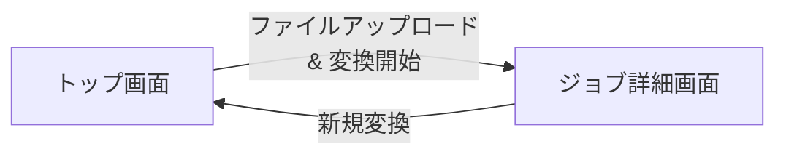

# UI設計

## 概要

Codec Converter の画面設計を定義します。共通UIライブラリのヘッダー・フッターは含まず、サービス固有のメインコンテンツエリアのみを記載します。

## 画面一覧

| 画面名 | パス | 説明 |
|-------|------|------|
| トップ/アップロード画面 | `/` | ファイルアップロードとコーデック選択 |
| ジョブ詳細画面 | `/jobs/{jobId}` | ジョブステータス確認とダウンロード |

---

## 画面遷移図

---

## 1. トップ/アップロード画面 (`/`)

### 画面概要

動画ファイルをアップロードし、変換コーデックを選択して変換を開始します。

### ワイヤーフレーム

### UI要素

#### ページタイトル
- **表示**: 「Codec Converter」
- **説明**: 「動画ファイルのコーデックを変換します」

#### ファイルアップロードエリア
- **コンポーネント**: ドラッグ&ドロップエリア
- **表示**:
    - 枠線付きの領域（破線、高さ 200px 程度）
    - アイコン: アップロードアイコン
    - テキスト: 「ファイルをドラッグ&ドロップ または クリックして選択」
    - 注釈: 「MP4ファイルのみ、最大500MB」
- **挙動**:
    - ファイルドラッグ時: 枠線をハイライト
    - ファイル選択後: ファイル名とサイズを表示
    - クリック時: ファイル選択ダイアログを開く

#### 出力コーデック選択
- **コンポーネント**: ラジオボタン
- **選択肢**:
    - `H.264` (デフォルト選択)
    - `VP9`
    - `AV1`
- **説明**: 各コーデックの簡単な説明を表示
    - H.264: 互換性重視（MP4）
    - VP9: バランス型（WebM）
    - AV1: 高圧縮率（WebM）

#### 変換開始ボタン
- **表示**: 「変換開始」ボタン
- **状態**:
    - 初期状態: 非活性（ファイル未選択）
    - ファイル選択後: 活性化
    - アップロード中: 「アップロード中...」表示、ローディングスピナー
- **挙動**:
    - クリック時: ファイルをS3にアップロード → ジョブ詳細画面に遷移

#### エラー表示
- **表示条件**: バリデーションエラー時
- **エラーメッセージ例**:
    - 「ファイルサイズは500MB以下である必要があります」
    - 「MP4ファイルのみアップロード可能です」
    - 「ファイルのアップロードに失敗しました」

---

## 2. ジョブ詳細画面 (`/jobs/{jobId}`)

### 画面概要

変換ジョブのステータスを確認し、完了後にファイルをダウンロードします。

### ワイヤーフレーム

### UI要素

#### ページタイトル
- **表示**: 「変換ジョブ詳細」

#### ジョブ情報表示
- **ジョブID**: UUID（一部省略表示、例: `550e8400-...`）
- **ファイル名**: 元のファイル名（例: `sample.mp4`）
- **ファイルサイズ**: 人間が読める形式（例: `50.0 MB`）
- **出力コーデック**: 選択したコーデック（例: `H.264`）
- **作成日時**: 日時表示（例: `2024-01-01 12:00:00`）

#### ステータス表示
- **コンポーネント**: ステータスバッジ + 説明文
- **表示内容**:
    - **PENDING**: 🟡 待機中 - 「変換処理を待っています」
    - **PROCESSING**: 🔵 処理中 - 「動画を変換しています...」
    - **COMPLETED**: 🟢 完了 - 「変換が完了しました」
    - **FAILED**: 🔴 失敗 - エラーメッセージを表示

#### ステータス確認ボタン
- **表示**: 「ステータス確認」ボタン
- **表示条件**: PENDING または PROCESSING 時
- **挙動**:
    - クリック時: API を呼び出してステータスを更新
    - ローディング中: ボタンを非活性化、スピナー表示

#### ダウンロードボタン
- **表示**: 「ダウンロード」ボタン
- **表示条件**: COMPLETED 時のみ
- **挙動**:
    - クリック時: Presigned URL にアクセスしてダウンロード開始

#### エラーメッセージ表示
- **表示条件**: FAILED 時
- **内容**: `errorMessage` を表示
    - 例: 「FFmpeg conversion failed: Invalid codec parameters」

#### 新規変換ボタン
- **表示**: 「新しい動画を変換」ボタン
- **挙動**: トップ画面に遷移

---

## UI仕様

### レスポンシブ対応

- **デスクトップ**: 最大幅 800px、中央配置
- **モバイル**: 全幅、パディング 16px

### カラー

- **プライマリカラー**: 共通UIライブラリのテーマカラーを使用
- **ステータスバッジ**:
    - PENDING: `#FFA500` (オレンジ)
    - PROCESSING: `#1E90FF` (青)
    - COMPLETED: `#32CD32` (緑)
    - FAILED: `#FF4500` (赤)

### タイポグラフィ

- **ページタイトル**: 24px、太字
- **セクションタイトル**: 18px、太字
- **本文**: 16px、標準
- **注釈**: 14px、グレー

### スペーシング

- **セクション間**: 32px
- **要素間**: 16px
- **パディング**: 16px

---

## アクセシビリティ

- **フォーカス**: キーボードナビゲーション対応
- **ARIA ラベル**: スクリーンリーダー対応
- **カラーコントラスト**: WCAG AA 基準準拠
- **エラーメッセージ**: `role="alert"` を使用

---

## 補足

### 共通UIライブラリとの統合

- **ヘッダー・フッター**: 共通UIライブラリから提供
- **ボタン・フォーム**: 共通UIライブラリのコンポーネントを使用
- **テーマ**: 共通UIライブラリのテーマを継承
