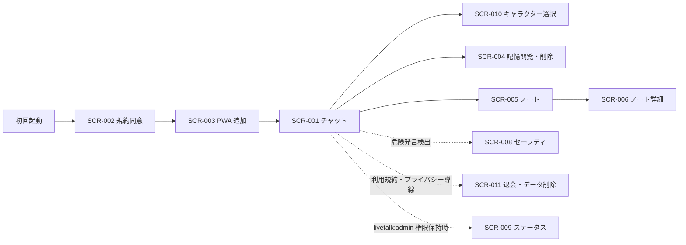
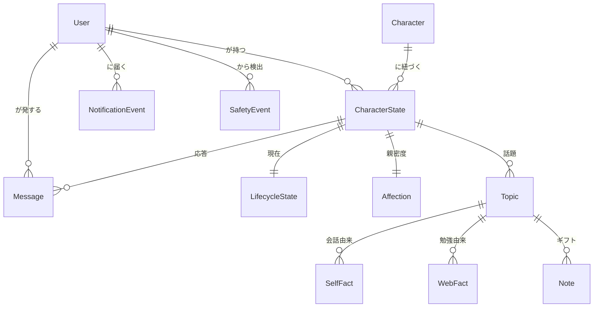

# リブトーク（LiveTalk）外部設計書

## 1. 画面設計

### 1.1 画面一覧

| 画面 ID | 画面名                           | パス                             | 対応ユースケース | 優先度 | Phase |
| ------- | -------------------------------- | -------------------------------- | ---------------- | ------ | ----- |
| SCR-001 | チャット画面                     | `/`                              | UC-001, UC-005   | 高     | 1     |
| SCR-002 | 利用規約・年齢同意               | （モーダル / オンボーディング）  | -                | 高     | 2     |
| SCR-003 | オンボーディング（PWA 追加誘導） | （オンボーディング）             | -                | 中     | 5     |
| SCR-004 | 記憶閲覧・削除画面               | `/memory`                        | UC-004           | 中     | 3     |
| SCR-005 | ノート一覧                       | `/notes`                         | -                | 中     | 5     |
| SCR-006 | ノート詳細                       | `/notes/[id]`                    | -                | 中     | 5     |
| SCR-007 | 法務ページ                       | `/legal/terms`, `/legal/privacy` | -                | 中     | 2     |
| SCR-008 | セーフティ介入画面               | （モーダル）                     | UC-006           | 高     | 2     |
| SCR-009 | ステータス画面（運用者向け）     | `/status`                        | UC-008           | 低     | 運用  |
| SCR-010 | キャラクター選択（モーダル）      | （チャット画面内モーダル）       | -                | 中     | マルチキャラ |
| SCR-011 | 退会・データ削除                 | （モーダル / 法務導線の近く）    | UC-007           | 高     | 公開前 |

### 1.2 画面遷移図

### 1.3 主要画面の設計

#### SCR-001: チャット画面（メイン）

**概要**

Live2D アバターが常時表示され、ユーザーがテキストを入力してキャラと会話するメイン画面。本サービスのほとんどの時間はこの画面で過ごされる。

**主要 UI 要素**

| 要素             | 種別         | 説明                                                                                 |
| ---------------- | ------------ | ------------------------------------------------------------------------------------ |
| Live2D Canvas    | 描画領域     | 現在のキャラクターが描画される。画面の主体（縦長レイアウトの上部）                   |
| キャラ選択ボタン | ボタン       | 現在のキャラ名を表示。タップで SCR-010（キャラクター選択モーダル）を開く。応答中は無効化 |
| 応答テキスト表示 | 領域         | 直近のキャラ応答テキスト（ストリーミング表示）。通知タップ起動時はキャラ第一声を表示 |
| 入力欄           | テキスト入力 | ユーザーのメッセージ入力                                                             |
| 送信ボタン       | ボタン       | 入力送信                                                                             |
| フッター         | 領域         | バージョン・ライセンス表記の常時表示 + 利用規約 / プライバシーのモーダル導線         |

**ユーザーインタラクション**

| 操作                | 結果                                                                                                                 |
| ------------------- | -------------------------------------------------------------------------------------------------------------------- |
| テキスト入力 + 送信 | LLM 応答生成 → 文単位で音声再生 + リップシンク                                                                       |
| 起動                | キャラの第一声（時間帯・親密度・通知有無で変化）。現在のキャラ以外に未消化通知があれば「○○から連絡が来てるよ」と提示 |
| 通知タップ起動      | 通知元キャラへ自動で切り替え、そのキャラの第一声を表示。さらに入力欄へ「〇〇について教えて」等のサジェスト発話をプリフィルし、ユーザーは送信するだけで会話を始められる（送信は手動） |

> **設計判断（通知タップ時のプリフィル）**: 自動送信せずプリフィルに留めるのは、VOICEVOX 音声の再生に「送信時の user gesture による AudioContext の unlock」が必要なため。自動送信だと user gesture が無く音声が鳴らない。プリフィル + 手動送信なら、その送信タップが user gesture となり音声が確実に再生され、誤タップでの意図しない送信も防げる。サジェスト発話は通知生成時にサーバ側で `NotificationEvent.SuggestedReply` として生成・保存し、通知タップ由来（URL の `from=push`）の起動時のみ入力欄へ反映する。

**表示条件・状態**

- ローディング: 応答待ち
- エラー: キャラの口調で「ちょっとごめんね、今うまく話せないみたい」を表示
- 空状態（初回）: キャラの自己紹介
- 睡眠時間帯: 半目 + 寝ぼけ口調（応答は継続）

#### SCR-004: 記憶閲覧・削除画面

**概要**

キャラがユーザー自身について覚えていること（SELF fact）を一覧表示し、閲覧・削除を可能にする。裏では複数 Topic の SELF fact を横断集約して表示する。Ani / Replika 等で問題となった「誤情報の永続化」への配慮として削除手段を提供する。

**主要 UI 要素**

| 要素            | 種別   | 説明                                                    |
| --------------- | ------ | ------------------------------------------------------- |
| SELF fact リスト | リスト | ユーザー由来の事実を表示。話題（Topic）でグルーピング可 |
| 削除ボタン       | ボタン | 該当事実を 1 件単位で決定的に削除（削除確認ダイアログ付き） |

**設計判断（なぜ）**

- **Tier 別タブ（A/B/C）とピン留めを廃止する**。想起を関連度で行う（ADR-2.24）ため、ユーザーに Tier の概念や常時想起のピンを見せる必要がない。常時想起は関連度＋（必要なら）極小のコアプロフィールで代替する。
- キャラが調べた知識（WEB fact）はこの画面に**出さない・削除対象にしない**（混入禁止）。この画面は「私について覚えていること」に限定する。

**補足**: **編集機能は提供しない**。訂正は会話で行うか削除する（前向き整合）。削除は物理削除で、所属 Topic の要約を即時再生成するため、削除内容は以降の応答にも導出物にも残らない（決定的忘却、ADR-2.24）。旧設計にあった「即時反映されない」注釈は不要になった。

#### SCR-005 / SCR-006: ノート一覧・詳細

**概要**

キャラが「あなたのために調べた」体験を贈るギフト面。共有ログ（Note）を新着順に一覧し（SCR-005）、詳細（SCR-006）では「なぜ調べたか（SELF フック）＋調べた内容（WEB）」の合成文と出典を見せる。中身は参照先 Topic の最新を反映する。

**設計判断（なぜ）**

- 従来の「事実報告書」から「SELF を根拠に WEB を贈る手紙」に変える。同一 Topic に SELF/WEB が同居する（ADR-2.24）ため、「なぜ調べたか」を根拠付きで語れる。
- 贈った瞬間（一回性）は共有ログとして不変に保ち、中身は生きた Topic を参照する。ノートはキャラの proactive なギフト専用で、ユーザーが会話で依頼した調べ物の結果は会話で返す。

#### SCR-008: セーフティ介入画面（モーダル）

**概要**

危険発言検出時に LLM をバイパスして即時表示されるモーダル。キャラの口調で心配を表明し、専門機関への案内を行う。**機械的なホットライン番号貼り付けは避ける**。

**主要 UI 要素**

| 要素                   | 種別     | 説明                                              |
| ---------------------- | -------- | ------------------------------------------------- |
| キャラからのメッセージ | テキスト | 「ねえ、今すごく心配。一人で抱え込まないでね」等  |
| リソースリスト         | リスト   | いのちの電話、よりそいホットライン、TELL Lifeline |
| 緊急時案内             | テキスト | 緊急時の連絡先                                    |
| 閉じるボタン           | ボタン   | モーダルを閉じて通常会話に戻る                    |

#### SCR-009: ステータス画面（運用者向け）

**概要**

`livetalk:admin` 権限を持つユーザーのみアクセス可能なデバッガー / 運用者向け画面。キャラの生活サイクル状態・通知判定状況・直近メトリクス等の内部状態を可視化する。ナビ導線も権限保持時のみ表示する。

**セーフティ横断レビュー（UC-008）**: 本画面に、全ユーザーの SafetyEvent を検出時刻の降順で一覧するセクションを設ける。requirements 3.2 の「人間レビュー可能」を実態として満たす手段で、運用者は検出パターン・時刻・キャラ・応答種別を確認し、辞書メンテ・対応妥当性の判断に用いる。全件 Scan を避けるため sparse GSI（GSI2）を Query する（architecture.md「2.22」）。退会済みユーザーの SafetyEvent は匿名化レコードとして表示される（ADR-2.21）。

#### SCR-010: キャラクター選択（モーダル）

**概要**

チャット画面のキャラ選択ボタンから開くモーダル。登録済みキャラクターを一覧表示し、会話相手を切り替える。複数キャラクター運用（ADR-2.15 / 2.16 / 2.17）の会話相手切替を担う。独立したページではなくチャット画面内のモーダルとして提供する。

**主要 UI 要素**

| 要素             | 種別     | 説明                                                                          |
| ---------------- | -------- | ----------------------------------------------------------------------------- |
| キャラクター一覧 | ラジオ   | 登録済みキャラを 1 件ずつ表示（表示名・説明・モデル・音声）。単一選択         |
| 決定ボタン       | ボタン   | 選択中のキャラへ切り替えてモーダルを閉じる                                    |
| キャンセルボタン | ボタン   | 切り替えずにモーダルを閉じる                                                  |

**補足**: 切替は会話相手（カレントキャラクター）の変更であり、各キャラの記憶・親密度・通知はキャラクター単位で独立する（ADR-2.16）。登録キャラの定義・描画解決は実装（`services/livetalk/web/src/lib/characters/`）を参照。

#### SCR-011: 退会・データ削除（モーダル）

**概要**

ユーザーが livetalk から退会し、自分のデータを一括削除する導線（UC-007）。独立した設定画面を持たない方針のため、チャット画面フッターの利用規約・プライバシー導線の近くから開くモーダルとして提供する。

**主要 UI 要素**

| 要素                 | 種別     | 説明                                                                          |
| -------------------- | -------- | ----------------------------------------------------------------------------- |
| 削除範囲の説明       | テキスト | 会話・記憶・親密度・ノート等が全て削除され、復元できない旨を明示              |
| セーフティログの注記 | テキスト | 安全のため、自傷検出ログのみ匿名化して一定期間保持する旨を明示（ADR-2.21）    |
| 確認入力             | 入力     | 誤操作防止の確認（チェック or 確認語の入力）                                  |
| 退会・削除ボタン     | ボタン   | 確認後に即時ハード削除を実行                                                  |
| キャンセルボタン     | ボタン   | 退会せずモーダルを閉じる                                                      |

**補足**: 削除は不可逆（即時ハード削除、ADR-2.21）。データエクスポートはセルフサービスでは提供せず、開示請求は運用で対応する。

### 1.4 レスポンシブ方針

- **モバイル（スマートフォン）**: プライマリ。縦長レイアウト、Live2D が画面上部、入力欄が下部固定
- **タブレット / デスクトップ**: モバイルレイアウトを拡大表示（中央寄せ）。本サービスはモバイル前提

### 1.5 アクセシビリティ方針

- WCAG 2.1 Level AA を目標
- 文字サイズはユーザー設定可能（OS 設定に追従）
- スクリーンリーダー対応：応答テキストは独立した領域で読み上げ可能
- 色覚配慮：色のみに依存しない情報伝達
- 音声 OFF 時もテキストで完結する設計（電車内利用配慮）

---

## 2. 概念データモデル

### 2.1 主要エンティティ一覧

| エンティティ      | 説明                       | 主要な属性（概念レベル）                               |
| ----------------- | -------------------------- | ------------------------------------------------------ |
| User              | サービスを利用するユーザー | googleId、作成日時、最終起動時刻                       |
| Character         | キャラクター定義           | キャラ ID、名前、性格、嗜好、生活サイクル設定          |
| CharacterState    | ユーザー × キャラの状態    | 親密度、最終接触日時                                   |
| LifecycleState    | キャラの現在のサイクル状態 | 就寝時刻、起床時刻、現在状態、ユーザー活動プロファイル |
| Message           | 会話 1 件（集約前の元データ） | 発言者、本文、タイムスタンプ                        |
| Topic             | 話題の集約体               | 話題名、要約、カテゴリ、care、想起用の座標             |
| SELF fact         | 会話由来のユーザー事実     | 本文、出所メモ、作成日時                               |
| WEB fact          | 勉強由来の知識             | 本文、ソース URL、揮発性、再確認期限、観測日時         |
| Note（共有ログ）  | 贈ったギフトの記録         | 見出し（SELF フック＋WEB 合成）、参照 Topic、共有日時、感想 |
| 集約カーソル      | 集約の進捗                 | ストリーム別のウォーターマーク                        |
| Affection         | 親密度                     | 値、変動履歴（累積接触量として保持。現状は体験へ未反映、ADR-2.23） |
| NotificationEvent | 通知配信履歴               | 通知元キャラ、種別、時刻、本文、サジェスト発話、消化状態 |
| SafetyEvent       | セーフティ検出ログ         | 検出パターン、時刻、応答内容                           |

### 2.2 エンティティ関係図

> 知識・記憶は Topic を集約単位とし、同一話題に SELF fact（会話由来）と WEB fact（勉強由来）を同居させる（ADR-2.24）。関連（related）は事前計算せず、想起時に埋め込み近傍でその場算出する。

物理データモデル（DynamoDB Single Table 設計、SK パターン）は実装（`services/livetalk/core/src/mappers/keys.ts`、`entities/`）を参照する。設計判断は [architecture.md](./architecture.md) を参照。

---

## 3. 設計上の決定事項（ADR）

> 主要な ADR は [architecture.md](./architecture.md) に集約している。本セクションでは外部設計フェーズで確定した画面・データ構造に関わる判断の索引のみを示す。

| ADR         | タイトル                                 | 参照先          |
| ----------- | ---------------------------------------- | --------------- |
| ADR-001     | Live2D クライアント描画                  | architecture.md |
| ADR-002     | DynamoDB Single Table 設計               | architecture.md |
| ADR-003     | VOICEVOX 文単位パイプライン              | architecture.md |
| ADR-005     | 親密度は上昇のみ                         | architecture.md |
| ADR-006     | 睡眠状態はスタイル変調                   | architecture.md |
| ADR-007     | メモリ階層 + 編集機能撤去（Tier は #3696 で撤廃・ADR-2.24 へ） | architecture.md |
| ADR-009     | セーフティ自前実装                       | architecture.md |
| ADR-011     | 通知設計（バックオフ + 時間帯）          | architecture.md |
| ADR (#3491) | 通知のキャラクター単位化（マルチキャラ） | architecture.md |
| ADR-2.21    | 退会・データ削除（即時ハード削除）       | architecture.md |
| ADR-2.22    | セーフティ横断レビュー（sparse GSI + admin） | architecture.md |
| ADR-2.23    | 親密度は保持のみで体験へ未反映（現状明文化） | architecture.md |
| ADR-2.24    | 知識・記憶を Topic 中心モデルに再設計       | architecture.md |

---

## 4. 関連ドキュメント

- [requirements.md](./requirements.md): 要件定義
- [architecture.md](./architecture.md): アーキテクチャ設計決定記録（ADR）
- [roadmap.md](./roadmap.md): Phase 6+ 将来拡張ロードマップ
- プラットフォーム認証: [../../development/authentication.md](../../development/authentication.md)
- プラットフォーム PWA: [../../development/pwa.md](../../development/pwa.md)
- ブランチ戦略: [../../branching.md](../../branching.md)
