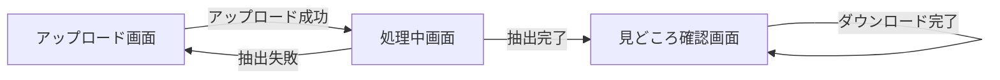
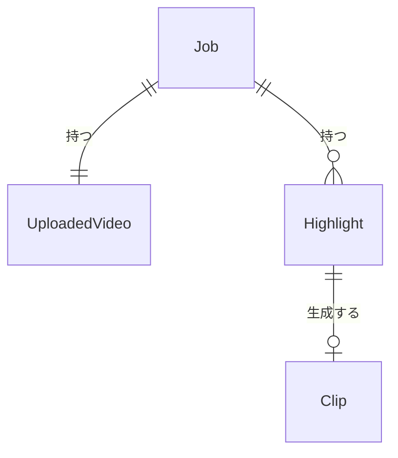

# さくっとクリップ (QuickClip) 外部設計書

---

## 1. 画面設計

### 1.1 画面一覧

| 画面 ID | 画面名 | パス | 対応ユースケース | 優先度 |
|--------|--------|------|--------------|-------|
| SCR-001 | アップロード画面 | / | UC-001 | 高 |
| SCR-002 | 処理中画面 | /jobs/{jobId} | UC-001 | 高 |
| SCR-003 | 見どころ確認画面 | /jobs/{jobId}/highlights | UC-002, UC-003 | 高 |

### 1.2 画面遷移図



### 1.3 主要画面の設計

#### SCR-001: アップロード画面

**概要**

動画ファイルを選択・アップロードして処理ジョブを開始する画面。

**主要 UI 要素**

| 要素 | 種別 | 説明 |
|-----|------|------|
| ファイル選択エリア | ドロップゾーン | ドラッグ&ドロップまたはクリックでファイルを選択 |
| アップロードボタン | ボタン | ファイル選択後に有効化される |
| エラーメッセージ | テキスト | ファイル検証エラー時に表示 |

**ユーザーインタラクション**

| 操作 | 結果 |
|------|------|
| ファイルをドロップ or クリックで選択 | ファイル名・サイズが表示され、アップロードボタンが有効化される |
| アップロードボタンをクリック | アップロード開始、完了後に SCR-002 へ遷移 |
| 非対応形式・サイズ超過のファイルを選択 | エラーメッセージを表示し、アップロードを無効化 |

**表示条件・状態**

- ローディング: アップロード中はローディングスピナーを表示（アップロードの進捗取得は行わない）
- エラー: バリデーションエラーメッセージをファイル選択エリア近くに表示
- 空状態: ファイル未選択時はアップロードボタンを無効化
- PoC 補足: ドラッグ&ドロップ UI は実装済み。ファイル検証は最小限（選択有無）で、形式・サイズの厳密検証は Phase 5 で強化する

---

#### SCR-002: 処理中画面

**概要**

見どころ抽出処理の進行状況を表示する画面。

**主要 UI 要素**

| 要素 | 種別 | 説明 |
|-----|------|------|
| ステータス表示 | テキスト | PENDING / PROCESSING / COMPLETED / FAILED |
| ローディングスピナー | インジケーター | PENDING / PROCESSING 中に表示。10秒毎に自動ポーリングでステータスを更新 |
| エラーメッセージ | テキスト | FAILED 時のみ表示 |
| 広告プレイヤー | 動画プレイヤー | 16:9 比率（最大幅 640px）の広告表示エリア。IMA SDK が内部に iframe を挿入する（`NEXT_PUBLIC_VAST_TAG_URL` 設定時） |
| 見どころ確認ボタン | ボタン | COMPLETED かつ広告完了後に表示（広告未完了またはジョブ未完了の場合は非表示） |

**ユーザーインタラクション**

| 操作 | 結果 |
|------|------|
| COMPLETED 状態かつ広告完了後に確認ボタンをクリック | SCR-003 へ遷移 |
| PENDING または PROCESSING 状態で画面が表示される | 広告の再生が自動開始される（`NEXT_PUBLIC_VAST_TAG_URL` 設定時） |
| 広告が再生完了またはスキップされる | 広告エリアが非表示になる |

**表示条件・状態**

| 状態 | 表示内容 |
|------|---------|
| PENDING / PROCESSING かつ広告未完了 | ステータスチップ + ローディング + 広告プレイヤー |
| PENDING / PROCESSING かつ広告完了済み | ステータスチップ + ローディング（広告エリアは非表示） |
| COMPLETED かつ広告未完了 | ステータスチップ「処理完了」 + 広告プレイヤー（ボタンはまだ非表示） |
| COMPLETED かつ広告完了済み | ステータスチップ「処理完了」 + 見どころ確認ボタン |
| FAILED | ステータスチップ「処理失敗」 + エラーメッセージ + 再アップロードリンク（広告なし） |

> `NEXT_PUBLIC_VAST_TAG_URL` が未設定の場合、広告は表示されず「広告完了済み」と同等の状態として扱う（= 従来通りの動作）。

---

#### SCR-003: 見どころ確認画面

**概要**

抽出された見どころの一覧を表示し、クリッププレビュー・採否チェック・時間調整・ダウンロードを行う画面。
左パネル（ディテール）と右パネル（マスター一覧）の横分割構成（マスター/ディテールレイアウト）。

**レイアウト**

```
┌─────────────────────────────┬──────────────────────────────────────────┐
│  [▶ 動画プレビュー]            │  No. │ 開始〜終了   │ 採否   │  [列設定]  │
│  (GENERATED 時のみ表示)       │  #1  │ 0:10〜0:20 │ [未確認]             │
│  (GENERATING: ローディング)   │  #2  │ 0:30〜0:40 │ [使える]    ●        │
│  (FAILED: エラー表示)         │  #3  │ 0:45〜0:55 │ [未確認]             │
│                              │  #4  │ 1:05〜1:15 │ [使えない]           │
│  ─────────────────────────  │  #5  │ 1:20〜1:30 │ [未確認]   ⟳         │
│  No.2 | 音量                  │  ...                                   │
│  ステータス:                   │                                        │
│  ○未確認 ● 使える ○ 使えない  │                                        │
│  開始: [  30  ]  終了:[  40  ]│                                        │
│                              │                                        │
│  (FAILED のときのみ)          │  [ZIP ダウンロード]                       │
│  [⟳ リトライ]                 │                                        │
└─────────────────────────────┴──────────────────────────────────────────┘
```

> 右パネルの ● は GENERATING 中の視覚的インジケーター（スピナー等）、⟳ は FAILED 行の表示例。

**主要 UI 要素**

| 要素 | 種別 | 説明 |
|-----|------|------|
| 左パネル（ディテール） | パネル | 選択中クリップの詳細を表示。未選択時はプレースホルダー「クリップを選択してください」を表示 |
| クリッププレビュー | 動画プレイヤー | 左パネルに配置。clipStatus が GENERATED の場合のみ動画を再生する。GENERATING 中はローディングインジケーター、FAILED はエラー表示 |
| クリップ情報 | テキスト | 左パネルに配置。選択中クリップの番号と抽出根拠（モーション / 音量 / 両方）を表示 |
| 採否ステータス | ラジオ / セグメント | 左パネルに配置。「未確認 / 使える / 使えない」の3状態を選択する |
| 開始時刻調整 | 入力 | 左パネルに配置。見どころの開始時刻を前後に調整。onBlur でコミット |
| 終了時刻調整 | 入力 | 左パネルに配置。見どころの終了時刻を前後に調整。onBlur でコミット |
| リトライボタン | ボタン | 左パネルに配置。clipStatus が FAILED のときのみ表示。押下でクリップ再生成を開始する |
| 右パネル（マスター） | パネル | 全見どころの簡易一覧。スクロール可能 |
| 見どころ一覧テーブル | テーブル | 右パネルに配置。番号・開始〜終了時刻・採否ステータスチップを行単位で表示。開始時間昇順に並ぶ。全行クリック可能 |
| 採否ステータスチップ | チップ | 右パネルの各行に配置。「未確認 / 使える / 使えない」を色分けして表示。GENERATING 中はローディングインジケーターを付加する |
| 列設定ボタン | アイコンボタン | 右パネルのテーブルヘッダー右上に配置。クリックするとポップオーバーが開き、オプション列（抽出根拠）の表示 / 非表示を切り替えるチェックボックスリストを表示する |
| ダウンロードボタン | ボタン | 右パネル下部に配置。採用した見どころをZIPでダウンロード |

**ユーザーインタラクション**

| 操作 | 結果 |
|------|------|
| 見どころ行をクリック（全行） | 左パネルに該当クリップの詳細を表示する。選択行をハイライト表示する |
| 採否ステータスを変更（ラジオ） | 採否状態が更新される（未確認 / 使える / 使えない を切替） |
| 開始・終了時刻を調整（onBlur） | clipStatus が GENERATING に遷移し自動でクリップ再生成が開始される。status が accepted/rejected の場合は unconfirmed にリセットされる |
| リトライボタンをクリック（FAILED） | クリップ再生成を開始する（clipStatus が GENERATING に遷移） |
| 列設定ボタンをクリック | ポップオーバーが開き、オプション列（抽出根拠）の ON/OFF チェックボックスを表示する |
| 抽出根拠のチェックボックスを変更 | テーブルへの「抽出根拠」列の表示 / 非表示が即座に切り替わる |
| ダウンロードボタンをクリック | 採用（使える）した見どころを分割クリップとしてZIPダウンロード開始 |

**表示条件・状態**

- ローディング（初期）: 見どころ一覧取得中はスケルトン表示
- 左パネル未選択時: 「クリップを選択してください」プレースホルダーを表示
- 左パネルの clipStatus に応じた表示:
    - PENDING / GENERATING: ローディングインジケーターを表示（動画プレイヤーは非表示）
    - GENERATED: 動画プレイヤーを表示して再生可能にする
    - FAILED: エラー表示 + リトライボタンを表示
- 右パネルの行状態:
    - GENERATING: 採否チップにローディングインジケーターを付加する
    - FAILED: 採否チップにエラーアイコンを付加する
- クリップ生成: clipStatus が PENDING または GENERATING のクリップが存在する間は定期ポーリングで状態を更新する
- 空状態: 見どころが0件の場合「見どころが検出されませんでした」を表示
- ダウンロード中: ダウンロードボタンを無効化し、処理中を示すインジケーターを表示
- 採用0件: ダウンロードボタンを無効化
- クリップ未生成あり: 採用（使える）クリップに GENERATED でないものが含まれる場合はダウンロードボタンを無効化

### 1.4 レスポンシブ方針

PC（デスクトップ）のみを対象とする。スマートフォン対応は行わない（`requirements.md` 3.5 節参照）。

- SCR-003（見どころ確認画面）は横方向マスター/ディテールレイアウト: 左パネルに選択クリップの詳細（動画プレビュー・採否選択・時間調整）、右パネルに見どころ一覧テーブルを配置する

### 1.5 アクセシビリティ方針

初版では特別な対応は行わない。

---

## 2. 概念データモデル

### 2.1 主要エンティティ一覧

| エンティティ | 説明 | 主要な属性（概念レベル） |
|------------|------|-------------------|
| Job | 動画処理ジョブ | ジョブID、ステータス、作成日時、有効期限 |
| UploadedVideo | アップロード済み動画 | ファイル名、ファイルサイズ、形式、保存パス |
| Highlight | 見どころ区間 | 開始時刻、終了時刻、採否ステータス、クリップ生成ステータス（clipStatus）、順序番号 |
| Clip | 分割クリップ | 対応するHighlight、ファイルパス |

### 2.2 エンティティ関係図


