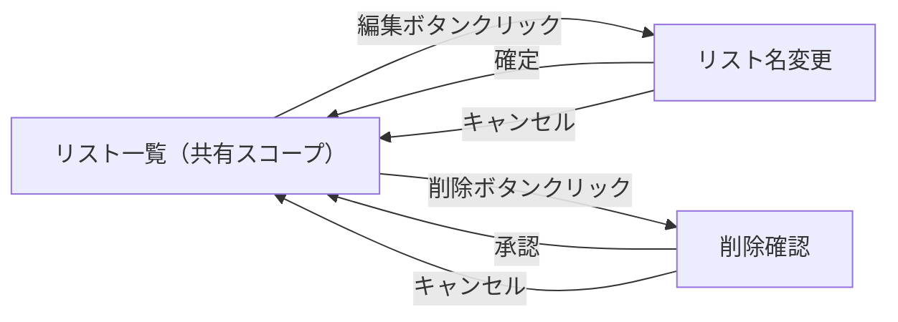
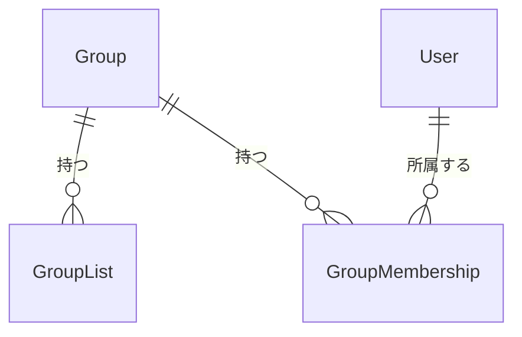

# Share Together 外部設計書

## 1. 画面設計

### 1.1 画面一覧

| 画面 ID | 画面名 | パス | 対応ユースケース | 優先度 |
| ------- | ------ | ---- | -------------- | ------ |
| SCR-001 | リスト一覧（共有スコープ） | /lists | UC-001, UC-002 | 高 |

### 1.2 画面遷移図

### 1.3 主要画面の設計

#### SCR-001: リスト一覧（共有スコープ）サイドバー

**概要**

リスト一覧画面のサイドバー部分。共有スコープ選択時に、各共有リストに編集・削除アイコンボタンを追加表示する。

**主要 UI 要素**

| 要素 | 種別 | 説明 |
| ---- | ---- | ---- |
| 編集ボタン（鉛筆アイコン） | IconButton | 共有リストの名前変更プロンプトを開く |
| 削除ボタン（ゴミ箱アイコン） | IconButton | 削除確認後、共有リストを削除する |
| スナックバー | Snackbar | 操作の成功・失敗をユーザーに通知する |

**ユーザーインタラクション**

| 操作 | 結果 |
| ---- | ---- |
| 編集ボタンをクリック | リスト名入力プロンプトが表示され、確定するとリスト名が更新される |
| 削除ボタンをクリック | 確認ダイアログが表示され、承認するとリストが削除される |
| 削除後に他のリストが存在する | 先頭のリストに自動遷移する |
| 削除後にリストが 0 件になる | リスト未選択状態になる |

**表示条件・状態**

- 共有スコープ選択時のみ編集・削除ボタンを表示する
- 個人スコープではボタンを非表示にする（既存の挙動を維持）

### 1.4 レスポンシブ方針

- モバイル（スマートフォン）: 既存のサイドバーの縦積みレイアウトを踏襲する
- デスクトップ: サイドバー幅内に収まるよう、アイコンボタンを小サイズで配置する

### 1.5 アクセシビリティ方針

- アイコンボタンには `aria-label` を付与する（例: `「{リスト名}」を編集`、`「{リスト名}」を削除`）

---

## 2. 概念データモデル

### 2.1 主要エンティティ一覧

| エンティティ | 説明 | 主要な属性（概念レベル） |
| ----------- | ---- | -------------------- |
| GroupList | グループに紐づく共有 ToDo リスト | リスト名、グループ ID、作成日時 |
| GroupMembership | ユーザーとグループの紐付け | ユーザー ID、グループ ID、ステータス |

### 2.2 エンティティ関係図

