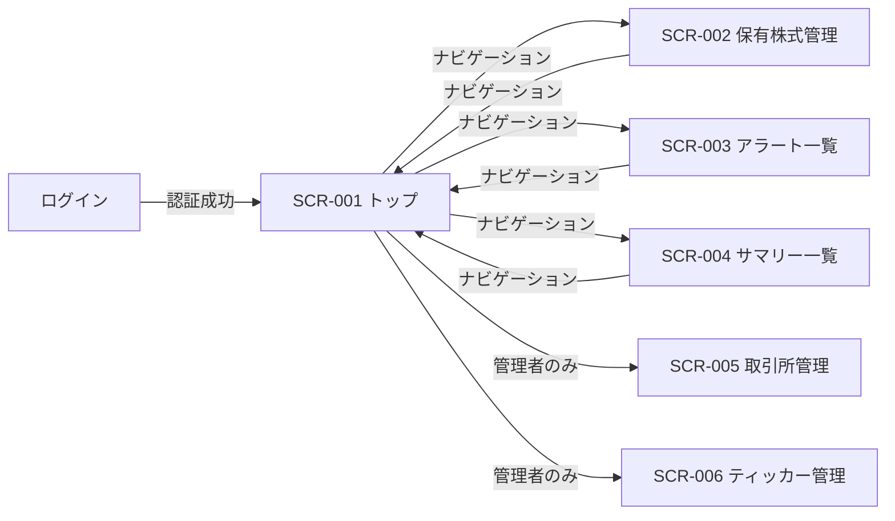
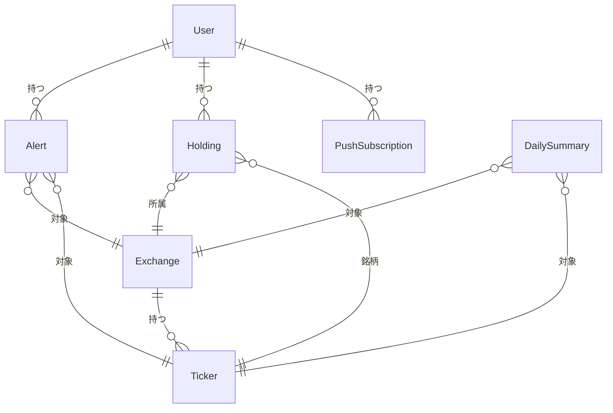

# Stock Tracker 外部設計書

## 1. 画面設計

### 1.1 画面一覧

| 画面 ID | 画面名 | パス | 対応ユースケース | 優先度 |
|--------|--------|------|--------------|-------|
| SCR-001 | トップ画面（チャート表示） | `/` | UC-001, UC-009 | 高 |
| SCR-002 | 保有株式管理画面 | `/holdings` | UC-003 | 高 |
| SCR-003 | アラート一覧画面 | `/alerts` | UC-002 | 高 |
| SCR-004 | サマリー一覧画面 | `/summaries` | UC-004 | 中 |
| SCR-005 | 取引所管理画面 | `/exchanges` | — | 低（管理者専用） |
| SCR-006 | ティッカー管理画面 | `/tickers` | — | 低（管理者専用） |

### 1.2 画面遷移図

### 1.3 主要画面の設計

#### SCR-001: トップ画面（チャート表示）

**概要**

取引所・ティッカーを選択して株価チャートを表示する、サービスの中心となる画面。チャートに加えて、選択銘柄の日次サマリー・保有株式情報・アラート情報を同一画面に統合表示する。

**主要 UI 要素**

| 要素 | 種別 | 説明 |
|-----|------|------|
| 取引所セレクタ | ドロップダウン | 表示対象の取引所を選択する |
| ティッカーセレクタ | ドロップダウン | 表示対象の銘柄を選択する |
| 時間枠セレクタ | セレクタ / タブ | チャートの表示期間（日・週・月など）を切り替える |
| 株価チャート | チャート | 選択銘柄の OHLCV データをチャートで表示する |
| 日次サマリーパネル | 情報パネル | 選択銘柄の直近サマリーと投資判断を表示する |
| 保有株式パネル | 情報パネル | 選択銘柄の保有情報（数量・平均取得価格）を表示する |
| アラートパネル | 情報パネル | 選択銘柄に設定されているアラート一覧を表示する |

**ユーザーインタラクション**

| 操作 | 結果 |
|------|------|
| 取引所を選択 | ティッカーリストが選択取引所でフィルタされる |
| ティッカーを選択 | チャート・サマリー・保有株式・アラートの各パネルが更新される |
| 時間枠を切り替え | チャートの表示期間が変わる |

**表示条件・状態**

- ローディング: データ取得中はチャートエリアにスピナーを表示する
- エラー: データ取得失敗時はエラーメッセージとリトライ手段を提示する
- 空状態: 保有株式・アラートが未登録の場合は登録への導線を表示する

---

#### SCR-003: アラート一覧画面

**概要**

ユーザーが設定したアラートを一覧表示し、新規作成・編集・削除・絞り込みを行う画面。

**主要 UI 要素**

| 要素 | 種別 | 説明 |
|-----|------|------|
| アラート一覧 | リスト | 登録済みアラートを条件・ステータスとともに表示する |
| 絞り込みフィルタ | フィルタ | 取引所・ティッカー・条件タイプで絞り込む |
| アラート作成ボタン | ボタン | 新規アラート作成ダイアログを開く |
| 編集ボタン | ボタン（行単位） | 対象アラートの編集ダイアログを開く |
| 削除ボタン | ボタン（行単位） | 対象アラートを削除する（確認あり） |

**ユーザーインタラクション**

| 操作 | 結果 |
|------|------|
| アラートを作成 | 取引所・ティッカー・条件タイプ・目標価格・通知有無を設定して保存する |
| フィルタを変更 | 一覧が絞り込まれて再表示される |
| 削除を実行 | 確認ダイアログ後にアラートが削除される |

**表示条件・状態**

- ローディング: 一覧取得中はスケルトンまたはスピナーを表示する
- 空状態: アラートが未登録の場合は作成促進メッセージを表示する

### 1.4 レスポンシブ方針

スマートフォンファーストで設計する（[プラットフォーム全体の開発ガイドライン](../../development/rules.md) に準拠）。

- モバイル（スマートフォン）: 縦スクロールを基本とし、チャートや各パネルを縦方向に積み重ねて表示する
- デスクトップ: 横方向のレイアウトを活用し、チャートと各パネルを並列配置できる幅を確保する

### 1.5 アクセシビリティ方針

Material UI（MUI）コンポーネントが提供する標準的なアクセシビリティ機能（ARIA 属性・キーボード操作・フォーカス管理）を活用する。カスタム実装が必要な箇所では MUI の方針に倣い、適切なラベルとロール指定を行う。

---

## 2. 概念データモデル

### 2.1 主要エンティティ一覧

| エンティティ | 説明 | 主要な属性（概念レベル） |
|------------|------|-------------------|
| Exchange（取引所） | 株式が取引される市場 | 名称、識別コード |
| Ticker（ティッカー） | 個別銘柄を識別するシンボル | シンボル、銘柄名、所属取引所 |
| Holding（保有株式） | ユーザーが保有する銘柄の情報 | 銘柄、数量、平均取得価格 |
| Alert（アラート） | 価格条件に基づく通知設定 | 銘柄、条件タイプ、目標価格、通知有無、有効フラグ |
| PushSubscription | Web Push 通知の購読情報 | エンドポイント、購読キー（ユーザーに紐づき、そのユーザーのアラート発火時に通知先として使用される） |
| DailySummary（日次サマリー） | 取引所ごとのティッカー日次 OHLCV データ | 日付、始値・高値・安値・終値・出来高、投資判断 |

### 2.2 エンティティ関係図

---

## 3. 設計上の決定事項（ADR）

### ADR-001: チャート・サマリー・保有株式・アラートの統合表示

**背景・問題**

株価チャートを確認する際、ユーザーは同じ銘柄の保有状況・アラート設定・最新サマリーを同時に参照したいケースが多い。これらを別々の画面に配置した場合、画面遷移のたびにコンテキストが失われ、銘柄ごとの全体像を把握しにくくなる。

**決定**

トップ画面（チャート表示）に、選択銘柄の日次サマリー・保有株式・アラートの各情報パネルを統合表示する。

**根拠・トレードオフ**

- 銘柄選択という単一の操作で関連情報がすべて更新されるため、銘柄ごとの投資判断に必要な情報を一画面で把握できる
- 保有株式管理・アラート一覧は独立した専用画面（SCR-002, SCR-003）にも存在し、一覧操作・編集はそちらで行う設計とすることで、トップ画面の責務を「閲覧・確認」に絞る
- トップ画面の情報量が増えるため、モバイルでは縦スクロールが長くなる可能性があるが、最も利用頻度の高い情報を集約することを優先した
