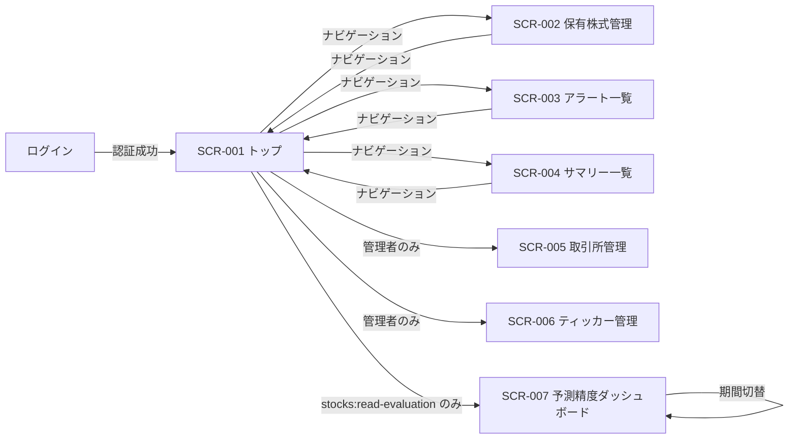
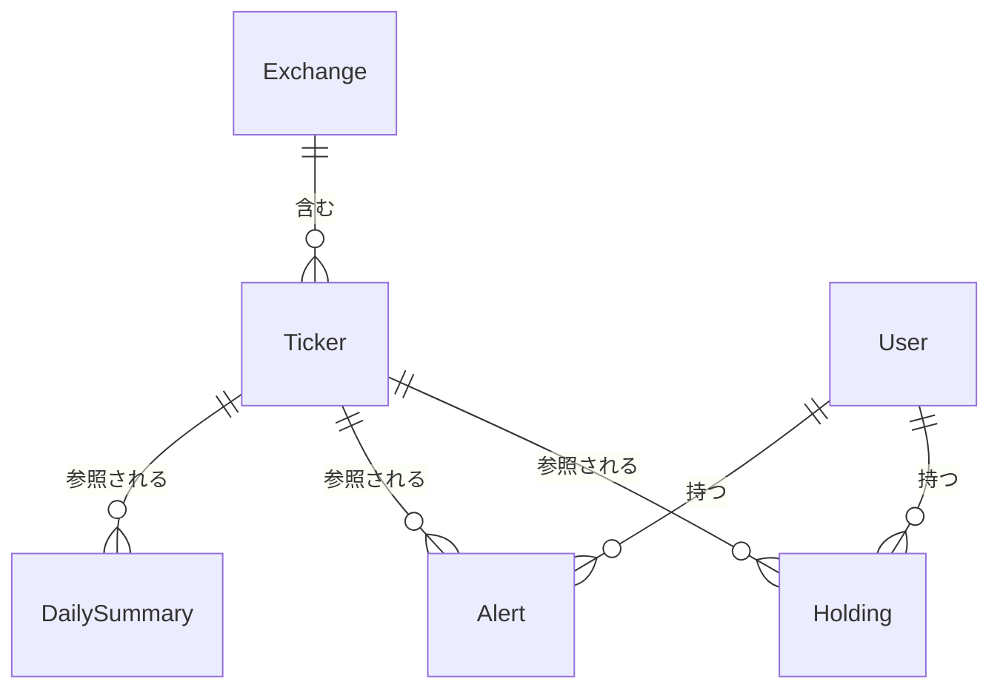

# Stock Tracker 外部設計書

## 1. 画面設計

### 1.1 画面一覧

| 画面 ID | 画面名 | パス | 対応ユースケース | 備考 |
|--------|--------|------|--------------|------|
| SCR-001 | トップ画面（チャート表示） | `/` | UC-001, UC-009 | — |
| SCR-002 | 保有株式管理画面 | `/holdings` | UC-003 | — |
| SCR-003 | アラート一覧画面 | `/alerts` | UC-002 | — |
| SCR-004 | サマリー一覧画面 | `/summaries` | UC-004 | — |
| SCR-005 | 取引所管理画面 | `/exchanges` | — | 管理者専用 |
| SCR-006 | ティッカー管理画面 | `/tickers` | — | 管理者専用 |
| SCR-007 | 予測精度ダッシュボード | `/prediction-evaluation` | UC-011, UC-012 | `stocks:read-evaluation` 権限必須 |

### 1.2 画面遷移図



### 1.3 画面の設計

#### SCR-001: トップ画面（チャート表示）

**概要**

取引所・ティッカーを選択して株価チャートを表示する、サービスの中心となる画面。チャートに加えて、選択銘柄の日次サマリー・保有株式情報・アラート情報を同一画面に統合表示する。

**主要 UI 要素**

| 要素 | 種別 | 説明 |
|-----|------|------|
| 取引所セレクタ | ドロップダウン | 表示対象の取引所を選択する |
| ティッカーセレクタ | ドロップダウン | 表示対象の銘柄を選択する |
| 時間枠セレクタ | セレクタ / タブ | チャートの時間枠（1分・5分・60分・日足）を切り替える |
| 表示本数セレクタ | セレクタ | チャートの表示本数（10 / 30 / 50 / 100）を切り替える |
| 自動更新ボタン | トグルボタン | チャートの自動更新（10秒ごと）を開始・停止する |
| 株価チャート | チャート | 選択銘柄の OHLCV ローソク足チャート（上部）と出来高バー（下部）を表示する。保有株式がある場合は平均取得価格ライン（アンバー破線）、有効なアラートがある場合は上限ライン（赤）・下限ライン（青）をオーバーレイ表示する |
| 日次サマリーパネル | 情報パネル | 選択銘柄の直近サマリーと投資判断を表示する。投資判断・買いシグナル・売りシグナル・AI 判定・更新時間・サポートレベル・レジスタンスレベルを表示し、詳細ダイアログボタンを提供する |
| 保有株式パネル | 情報パネル | 選択銘柄の保有情報（数量・平均取得価格）を表示する。追加・編集・削除ボタンから保有株式の CRUD 操作が可能 |
| アラートパネル | 情報パネル | 選択銘柄に設定されているアラート一覧を表示する。追加・編集・削除ボタンからアラートの CRUD 操作が可能 |

**ユーザーインタラクション**

| 操作 | 結果 |
|------|------|
| 取引所を選択 | ティッカーリストが選択取引所でフィルタされる |
| ティッカーを選択 | チャート・サマリー・保有株式・アラートの各パネルが更新される |
| 時間枠を切り替え | チャートの表示時間枠が変わる |
| 表示本数を変更 | チャートの表示本数が変わる |
| 自動更新を切り替え | 10秒ごとのチャート自動更新が開始・停止される |
| 保有株式パネルの追加・編集・削除ボタンをクリック | 対応するダイアログが開き、操作完了後に保有株式パネルが更新される |
| アラートパネルの追加・編集・削除ボタンをクリック | 対応するダイアログが開き、操作完了後にアラートパネルが更新される |
| サマリーパネルの詳細ボタンをクリック | 詳細ダイアログが開き AI 解析内容が表示される |

**表示条件・状態**

- ローディング: データ取得中はチャートエリアにスピナーを表示する
- エラー: データ取得失敗時はエラーメッセージとリトライ手段を提示する
- 空状態: 保有株式・アラートが未登録の場合は登録への導線を表示する

---

#### SCR-002: 保有株式管理画面（`/holdings`）

**概要**

ユーザーが保有する銘柄の情報（数量・平均取得価格）を管理する画面。

**主要 UI 要素**

| 要素 | 種別 | 説明 |
|-----|------|------|
| 保有株式一覧 | リスト | 登録済みの保有銘柄を取引所・ティッカー・数量・平均取得価格とともに表示する |
| 保有追加ボタン | ボタン | 新規保有登録ダイアログを開く |
| 編集ボタン | ボタン（行単位） | 対象保有株式の編集ダイアログを開く |
| 削除ボタン | ボタン（行単位） | 対象保有株式を削除する（確認あり） |

**ユーザーインタラクション**

| 操作 | 結果 |
|------|------|
| 保有を追加 | 取引所・ティッカー・数量・平均取得価格を入力して保存する |
| 保有を編集 | 数量・平均取得価格を変更して保存する |
| 保有を削除 | 確認ダイアログ後に保有情報が削除される |

**表示条件・状態**

- ローディング: 一覧取得中はスピナーを表示する
- 空状態: 保有株式が未登録の場合は登録促進メッセージを表示する

---

#### SCR-003: アラート一覧画面

**概要**

ユーザーが設定したアラートを一覧表示し、新規作成・編集・削除・絞り込みを行う画面。

**主要 UI 要素**

| 要素 | 種別 | 説明 |
|-----|------|------|
| アラート一覧 | リスト | 登録済みアラートを条件・ステータスとともに表示する |
| 絞り込みフィルタ | フィルタ | 取引所・ティッカー・条件タイプで絞り込む |
| アラート作成ボタン | ボタン | 新規アラート作成ダイアログを開く |
| 編集ボタン | ボタン（行単位） | 対象アラートの編集ダイアログを開く |
| 削除ボタン | ボタン（行単位） | 対象アラートを削除する（確認あり） |
| プレビューチャート | チャート（ダイアログ内） | アラート作成・編集ダイアログ内に表示されるチャート。設定したアラート条件（上限・下限価格）をラインとしてオーバーレイ表示する |

**ユーザーインタラクション**

| 操作 | 結果 |
|------|------|
| アラートを作成 | 取引所・ティッカー・条件タイプ・目標価格・通知有無を設定して保存する |
| フィルタを変更 | 一覧が絞り込まれて再表示される |
| 削除を実行 | 確認ダイアログ後にアラートが削除される |

**表示条件・状態**

- ローディング: 一覧取得中はスケルトンまたはスピナーを表示する
- 空状態: アラートが未登録の場合は作成促進メッセージを表示する

---

#### SCR-004: サマリー一覧画面（`/summaries`）

**概要**

取引所ごとにグループ化されたティッカーの日次サマリー一覧を表示する画面。各ティッカーの投資判断・パターン分析件数・アラート数を一覧で確認できる。`stocks:read` 権限が必要。

**主要 UI 要素**

| 要素 | 種別 | 説明 |
|-----|------|------|
| 取引所グループ | グループヘッダ | 取引所名でティッカーをグループ化して表示する |
| ティッカー一覧 | リスト | シンボル・銘柄名・保有可否・投資判断・パターン数・アラート数を表示する |
| 詳細ダイアログ | ダイアログ | 対象ティッカーの AI 解析および日足ローソク足チャート（直近50本、自動更新なし）を表示する。SCR-001 トップ画面のサマリーパネルからも同じダイアログを流用する。モバイル幅での横幅オーバーを修正済み（`overflow-x: hidden` およびコンテンツの折り返し対応） |

**ユーザーインタラクション**

| 操作 | 結果 |
|------|------|
| ティッカー行をクリック | 詳細ダイアログが開き AI 解析内容が表示される |

**表示条件・状態**

- ローディング: 一覧取得中はスピナーを表示する
- 空状態: サマリーデータが存在しない取引所は空状態メッセージを表示する
- AI 解析未生成: 「AI 解析はまだ生成されていません」を表示する
- AI 解析エラー: 「AI 解析の取得に失敗しました」を表示する

---

#### SCR-005: 取引所管理画面（`/exchanges`）

**概要**

取引所マスタデータを管理する画面。`stocks:manage-data` 権限（stock-admin ロール）を持つ管理者のみアクセス可能。

**主要 UI 要素**

| 要素 | 種別 | 説明 |
|-----|------|------|
| 取引所一覧 | リスト | 登録済み取引所を ID・名称・タイムゾーン・取引時間とともに表示する |
| 取引所追加ボタン | ボタン | 新規取引所登録ダイアログを開く |
| 編集ボタン | ボタン（行単位） | 対象取引所の編集ダイアログを開く |
| 削除ボタン | ボタン（行単位） | 対象取引所を削除する（確認あり） |

**表示条件・状態**

- 空状態: 取引所が未登録の場合は登録促進メッセージを表示する

---

#### SCR-006: ティッカー管理画面（`/tickers`）

**概要**

ティッカーマスタデータを管理する画面。`stocks:manage-data` 権限（stock-admin ロール）を持つ管理者のみアクセス可能。

**主要 UI 要素**

| 要素 | 種別 | 説明 |
|-----|------|------|
| ティッカー一覧 | リスト | 登録済みティッカーを ID・シンボル・銘柄名・所属取引所とともに表示する |
| ティッカー追加ボタン | ボタン | 新規ティッカー登録ダイアログを開く |
| 編集ボタン | ボタン（行単位） | 対象ティッカーの編集ダイアログを開く |
| 削除ボタン | ボタン（行単位） | 対象ティッカーを削除する（確認あり） |

**表示条件・状態**

- 空状態: ティッカーが未登録の場合は登録促進メッセージを表示する

#### SCR-007: 予測精度ダッシュボード（`/prediction-evaluation`）

**概要**

AI 予測の採点結果を期間別に可視化する単一ページ画面。日毎の的中率（方向精度）を目視確認するための評価基盤 UI で、AI 改善ロジック（Phase 2-4）の効果測定基盤として位置付ける。`stocks:read-evaluation` 権限を持つユーザーのみアクセス可能（Phase 1 では `stock-admin` ロールのみ）。

**主要 UI 要素**

| 要素 | 種別 | 説明 |
|------|------|------|
| 主要指標テキスト | サブタイトルテキスト | 期間ラベル + 方向精度 + 採点件数 + 総合精度 の 1 行。判定済み 0 件のときは「期間ラベル: 採点済みの予測がありません」。読み込み中は「期間ラベル: 集計中...」 |
| 期間セレクタ | ドロップダウン | 直近 7 日 / **直近 30 日（デフォルト）** / 直近 90 日 / 全期間 |
| 日次推移グラフ | 2 軸グラフ（折れ線 + 棒）+ 数値テーブル | 本ダッシュボードの中心指標。折れ線で方向精度、棒で判定済み件数を表示。数値テーブルを併設する |
| シグナル別精度 | 棒グラフ + 数値テーブル | BULLISH / NEUTRAL / BEARISH ごとのヒット率と件数を表示する |

**ユーザーインタラクション**

| 操作 | 結果 |
|------|------|
| 期間ドロップダウンを変更 | 主要指標テキスト・日次推移グラフ・シグナル別グラフが再集計され表示更新（ローディング表示あり） |

**表示条件・状態**

- **ローディング**: データ取得中はローディング表示。主要指標テキストは「集計中...」
- **空状態（判定済み 0 件）**: 主要指標テキストが「期間ラベル: 採点済みの予測がありません」に変化。日次推移・シグナル別セクションは描画しない
- **エラー**: エラー時はエラーメッセージを表示。再読み込みはブラウザのリロードで対応（Phase 1 では専用ボタンを設けない）
- **未認証 / `stocks:read-evaluation` 権限なし**: 既存認証フロー経由でログイン誘導。権限なし時は「予測精度ダッシュボードを表示する権限がありません。」を表示する

---

### 1.4 レスポンシブ方針

スマートフォンファーストで設計する（[プラットフォーム全体の開発ガイドライン](../../development/rules.md) に準拠）。

- モバイル（スマートフォン）: 縦スクロールを基本とし、チャートや各パネルを縦方向に積み重ねて表示する
- デスクトップ: 横方向のレイアウトを活用し、チャートと各パネルを並列配置できる幅を確保する

### 1.5 アクセシビリティ方針

Material UI（MUI）コンポーネントが提供する標準的なアクセシビリティ機能（ARIA 属性・キーボード操作・フォーカス管理）を活用する。カスタム実装が必要な箇所では MUI の方針に倣い、適切なラベルとロール指定を行う。

---

## 2. 概念データモデル

### 2.1 主要エンティティ一覧

| エンティティ | 説明 | 主要な属性（概念レベル） |
|------------|------|-------------------|
| Exchange（取引所） | 株式が取引される市場 | 名称、識別コード |
| Ticker（ティッカー） | 個別銘柄を識別するシンボル | シンボル、銘柄名、所属取引所 |
| Holding（保有株式） | ユーザーが保有する銘柄の情報 | 銘柄、数量、平均取得価格 |
| Alert（アラート） | 価格条件に基づく通知設定。Web Push サブスクリプション情報を内包する | 銘柄、条件リスト、通知頻度、有効フラグ、Web Push エンドポイント・キー |
| DailySummary（日次サマリー） | ティッカーごとの日次 OHLCV データ・パターン分析結果・AI 解析結果・採点結果（Evaluation\* フィールドを同一レコードで管理） | 日付、始値・高値・安値・終値・出来高、パターン分析件数、投資判断、採点日・実績リターン・Hit 判定（採点済みのみ） |

### 2.2 エンティティ関係図



---

## 3. 設計上の決定事項（ADR）

### ADR-001: チャート・サマリー・保有株式・アラートの統合表示

**背景・問題**

株価チャートを確認する際、ユーザーは同じ銘柄の保有状況・アラート設定・最新サマリーを同時に参照したいケースが多い。これらを別々の画面に配置した場合、画面遷移のたびにコンテキストが失われ、銘柄ごとの全体像を把握しにくくなる。

**決定**

トップ画面（チャート表示）に、選択銘柄の日次サマリー・保有株式・アラートの各情報パネルを統合表示する。

**根拠・トレードオフ**

- 銘柄選択という単一の操作で関連情報がすべて更新されるため、銘柄ごとの投資判断に必要な情報を一画面で把握できる
- 保有株式管理・アラート一覧は独立した専用画面（SCR-002, SCR-003）にも存在し、一覧操作・編集はそちらで行う設計とすることで、トップ画面の責務を「閲覧・確認」に絞る
- トップ画面の情報量が増えるため、モバイルでは縦スクロールが長くなる可能性があるが、最も利用頻度の高い情報を集約することを優先した

---

### ADR-002: 予測精度ダッシュボードを既存 web に新規ページとして追加する

**背景・問題**

精度可視化の表示手段として、(a) 既存 web に新規ページ追加 / (b) 別アプリ（管理ダッシュボード等）として独立 / (c) DynamoDB 直接参照のみ、の選択肢があった。

**決定**

(a) 既存 web に新規ページ（SCR-007）を追加する。

**根拠・トレードオフ**

- 既存認証フローが流用でき、運用がシンプル
- Material-UI コンポーネントを既存の規約通り使えるので開発コストが低い
- 「採点データを見ること」自体が利用者にとって新たな価値の一部であり、メインの web 体験から切り離す必要がない
- 別アプリ案は infra コストと認証実装の二重化が発生するため不採用

---

### ADR-003: シグナル別精度に NEUTRAL を含めて表示する

**背景・問題**

NEUTRAL は実取引上「アクションなし」を意味するが、シグナル分布や AI が「逃げているだけかどうか」を判断する材料として可視化する価値がある。

**決定**

シグナル別精度棒グラフには NEUTRAL を含めて 3 段階で表示する。NEUTRAL 比率は独立指標としては UI に出さず、シグナル別の `count` から導出可能な情報として扱う。

**根拠・トレードオフ**

- NEUTRAL 比率を独立カードに出すと、精度ではない値が並び座りが悪い
- シグナル別棒グラフで NEUTRAL の棒の存在と件数が見えれば、保守的すぎる挙動の検知は十分可能
- 「方向精度（BULLISH+BEARISH のみ）」を主要指標テキストの中心数値に据えることで、実用的な精度感は一目で分かるようにする

---

### ADR-004: KPI カードを廃止し、見出し直下の主要指標テキスト 1 行に集約する

**背景・問題**

PoC では `総合精度 / 方向精度 / NEUTRAL 比率 / 判定済み件数 / AI 失敗件数` の KPI カード 5 枚をページ上部に並べていたが、本ダッシュボードの主目的（評価基盤の据え付け、日毎の的中率を目視確認）に照らすと過剰だった。

**決定**

KPI カードという UI 要素そのものを廃止し、ページ見出し直下のサブタイトルテキスト 1 行に主要指標を集約する：

```
直近 N 日の方向精度: XX.X%（採点 N 件、総合精度 XX.X%）
```

判定済み 0 件のときは「期間ラベル: 採点済みの予測がありません」、ロード中は「期間ラベル: 集計中...」。

**根拠・トレードオフ**

- カード形式は 1-2 指標を強調する用途にしては装飾過剰で、「マーケティング用ダッシュボード」風になりがち。土台ツールとしては情報密度を優先する
- 中心指標は日次推移グラフ（折れ線）であり、KPI カードを独立に置く必要性が薄い
- モバイルでも 1 行に収まり、レイアウトが整う

---

### ADR-005: NEUTRAL 比率・AI 失敗件数・判定済み件数の単独カードを廃止する

**背景・問題**

PoC で個別の KPI カードとして並んでいた 3 指標について、保持する意義を再評価した。

**決定**

- **NEUTRAL 比率**: 単独表示を廃止。シグナル別棒グラフから視覚的に把握する
- **AI 失敗件数**: UI から完全に外す。AI 解析失敗は「予測精度の分析」とは性質が違う運用監視指標で、UI で出すのが妥当でない。将来 CloudWatch メトリクス等で監視する想定
- **判定済み件数**: 単独表示を廃止。日次推移グラフの右軸棒で件数推移は把握可能。期間全体の合計は主要指標テキストの括弧内に併記する

**根拠・トレードオフ**

- 主要指標が絞られることで「何を見るダッシュボードか」が明確になる
- AI 失敗件数は UI から外すが、将来の運用監視整備で取り戻す（Phase 1 ではトレードオフとして許容）
- 判定済み件数を主要指標テキストの括弧内に残すのは、精度値の信頼性チェック（n=5 か n=500 か）を一目で確認できるようにするため

---

### ADR-006: 銘柄別・取引所別の集計表示を Phase 1 UI から外す

**背景・問題**

PoC では銘柄別精度テーブル（ソート可、最低件数フィルタ可）と取引所別テーブルを実装していたが、本タスクの目的（評価基盤の据え付け）に照らすと優先度は低い。

**決定**

Phase 1 UI からは銘柄別・取引所別の表示を外す。将来 AI 改善ロジック（Phase 2-4）が必要としたとき、または運用観点で「どの銘柄が外れやすい」を確認したくなったときに、API + UI を再追加する想定。

データ側（DailySummary に Evaluation\* フィールドを保存）は影響を受けないため、将来集計の素材は変わらず蓄積される。

**根拠・トレードオフ**

- 統計的に意味のある粒度（最低件数フィルタ）の議論や、銘柄詳細遷移の検討を Phase 1 から外せる
- 「どの銘柄が外れやすいか」が見えなくなるが、Phase 1 では「全体精度の動きを定量的に把握できる」が達成できれば十分
- 再追加時は API レスポンス型の拡張のみで済む（DB スキーマ変更は不要）

---

### ADR-007: KPI 前期比は Phase 1 では実装しない

**背景・問題**

主要指標テキストに「前期比 +1.2pt」のような差分を出すと改善トレンドが一目で分かるが、Phase 1 ではデータ蓄積が始まったばかりで前期との比較が意味を成しにくい。

**決定**

Phase 1 では前期比は出さない。データが数十日分以上蓄積されてから、Phase 2 以降の改善ロジック評価フェーズで再検討する。

**根拠・トレードオフ**

- 前期定義（直近 7 日に対する前 7 日 / 同期間前年 等）の決め込みコストを後回しにできる
- ノイズ（少数サンプルでの大きな差分）が UI に出ない
- 改善施策の効果は当面、推移グラフを目視で読み取る運用で代替

---

### ADR-008: 過去データ遡及採点はダッシュボード初期表示に含めない

**背景・問題**

蓄積済みの予測データを遡って採点すれば初期表示時から豊富なデータが見えるが、本 Issue のスコープからは外している。

**決定**

Phase 1 では新規予測のみ採点する。ダッシュボード初期は「採点済みの予測がありません」または少ないデータからスタートし、日次で増えていく。

**根拠・トレードオフ**

- スコープを絞り Phase 1 を最短で完了することを優先
- 遡及採点は別 Issue でリスクと工数を独立して評価する
- 初期データが少ない問題は数日〜数週間で自然解消する

---

### ADR-009: 予測精度ダッシュボードのアクセス制御は専用 permission を新設する

**背景・問題**

PoC では既存の `stocks:read` 権限でガードしていたが、本ダッシュボードは AI 改善判断のための運用者向け機能であり、一般 Stock 利用者（`stock-viewer` / `stock-user`）に公開する性質ではない。一方で `stocks:manage-data`（マスタデータ管理）を流用するのも意味が拡散する。

**決定**

新規 permission **`stocks:read-evaluation`** を導入し、Phase 1 では `stock-admin` ロールにのみ付与する。

**根拠・トレードオフ**

- 命名が意図と一致する（`stocks:read-evaluation`）。`stocks:read` 流用だと「Stock 関連の閲覧者なら誰でも見える」と読めてしまう
- `stocks:manage-data` 流用案も検討したが、本来「マスタデータの書き込み」を表す名前なので、read 用途を載せると意味が拡散する
- 将来「精度ダッシュボードだけ見せる中間ロール」を作りたい時に、permission を分けておけば対応コストが低い
- Phase 2 以降で一般利用者にも公開する判断になった場合、permission 自体を `stock-user` 等に付与し直す選択がある
