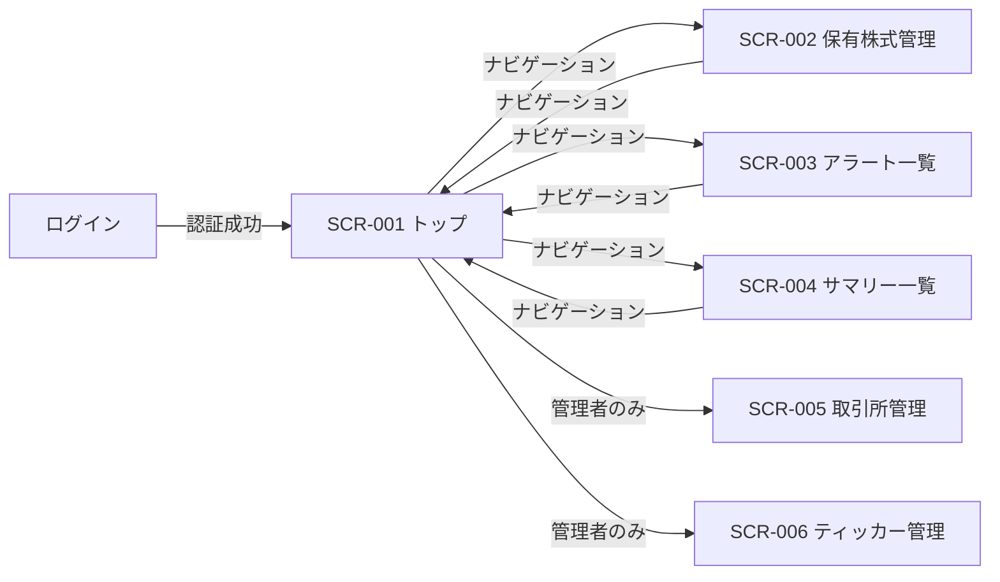
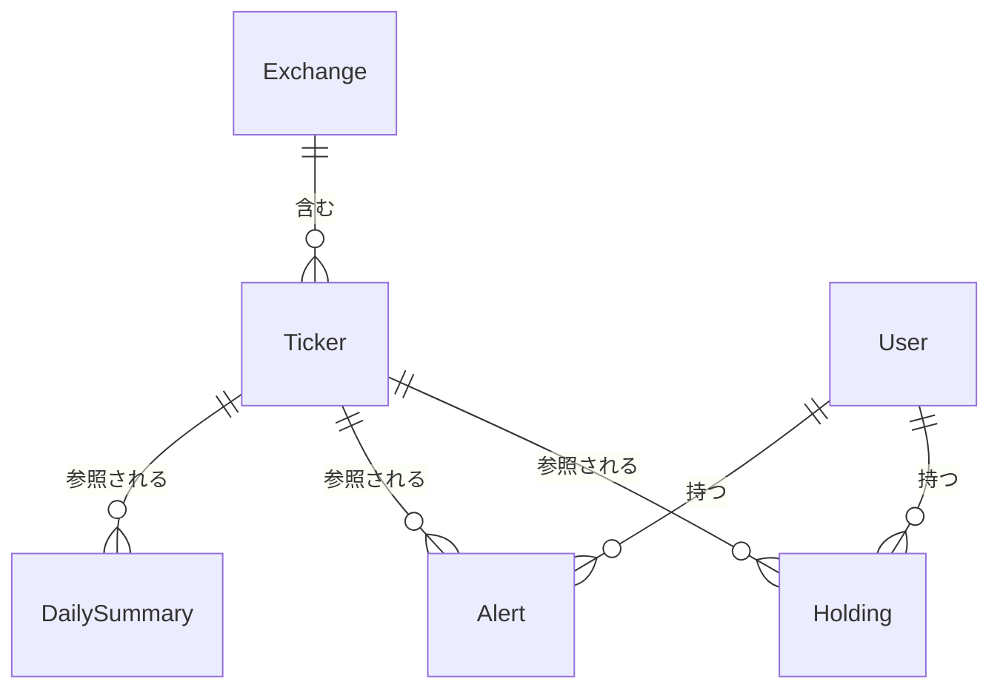

# Stock Tracker 外部設計書

## 1. 画面設計

### 1.1 画面一覧

| 画面 ID | 画面名 | パス | 対応ユースケース | 備考 |
|--------|--------|------|--------------|------|
| SCR-001 | トップ画面（チャート表示） | `/` | UC-001, UC-009 | — |
| SCR-002 | 保有株式管理画面 | `/holdings` | UC-003 | — |
| SCR-003 | アラート一覧画面 | `/alerts` | UC-002 | — |
| SCR-004 | サマリー一覧画面 | `/summaries` | UC-004 | — |
| SCR-005 | 取引所管理画面 | `/exchanges` | — | 管理者専用 |
| SCR-006 | ティッカー管理画面 | `/tickers` | — | 管理者専用 |

### 1.2 画面遷移図

### 1.3 画面の設計

#### SCR-001: トップ画面（チャート表示）

**概要**

取引所・ティッカーを選択して株価チャートを表示する、サービスの中心となる画面。チャートに加えて、選択銘柄の日次サマリー・保有株式情報・アラート情報を同一画面に統合表示する。

**主要 UI 要素**

| 要素 | 種別 | 説明 |
|-----|------|------|
| 取引所セレクタ | ドロップダウン | 表示対象の取引所を選択する |
| ティッカーセレクタ | ドロップダウン | 表示対象の銘柄を選択する |
| 時間枠セレクタ | セレクタ / タブ | チャートの時間枠（1分・5分・60分・日足）を切り替える |
| 表示本数セレクタ | セレクタ | チャートの表示本数（10 / 30 / 50 / 100）を切り替える |
| 自動更新ボタン | トグルボタン | チャートの自動更新（10秒ごと）を開始・停止する |
| 株価チャート | チャート | 選択銘柄の OHLCV ローソク足チャート（上部）と出来高バー（下部）を表示する。保有株式がある場合は平均取得価格ライン（アンバー破線）、有効なアラートがある場合は上限ライン（赤）・下限ライン（青）をオーバーレイ表示する |
| 日次サマリーパネル | 情報パネル | 選択銘柄の直近サマリーと投資判断を表示する。投資判断・買いシグナル・売りシグナル・AI 判定・更新時間・サポートレベル・レジスタンスレベルを表示し、詳細ダイアログボタンを提供する |
| 保有株式パネル | 情報パネル | 選択銘柄の保有情報（数量・平均取得価格）を表示する。追加・編集・削除ボタンから保有株式の CRUD 操作が可能 |
| アラートパネル | 情報パネル | 選択銘柄に設定されているアラート一覧を表示する。追加・編集・削除ボタンからアラートの CRUD 操作が可能 |

**ユーザーインタラクション**

| 操作 | 結果 |
|------|------|
| 取引所を選択 | ティッカーリストが選択取引所でフィルタされる |
| ティッカーを選択 | チャート・サマリー・保有株式・アラートの各パネルが更新される |
| 時間枠を切り替え | チャートの表示時間枠が変わる |
| 表示本数を変更 | チャートの表示本数が変わる |
| 自動更新を切り替え | 10秒ごとのチャート自動更新が開始・停止される |
| 保有株式パネルの追加・編集・削除ボタンをクリック | 対応するダイアログが開き、操作完了後に保有株式パネルが更新される |
| アラートパネルの追加・編集・削除ボタンをクリック | 対応するダイアログが開き、操作完了後にアラートパネルが更新される |
| サマリーパネルの詳細ボタンをクリック | 詳細ダイアログが開き AI 解析内容が表示される |

**表示条件・状態**

- ローディング: データ取得中はチャートエリアにスピナーを表示する
- エラー: データ取得失敗時はエラーメッセージとリトライ手段を提示する
- 空状態: 保有株式・アラートが未登録の場合は登録への導線を表示する

---

#### SCR-002: 保有株式管理画面（`/holdings`）

**概要**

ユーザーが保有する銘柄の情報（数量・平均取得価格）を管理する画面。

**主要 UI 要素**

| 要素 | 種別 | 説明 |
|-----|------|------|
| 保有株式一覧 | リスト | 登録済みの保有銘柄を取引所・ティッカー・数量・平均取得価格とともに表示する |
| 保有追加ボタン | ボタン | 新規保有登録ダイアログを開く |
| 編集ボタン | ボタン（行単位） | 対象保有株式の編集ダイアログを開く |
| 削除ボタン | ボタン（行単位） | 対象保有株式を削除する（確認あり） |

**ユーザーインタラクション**

| 操作 | 結果 |
|------|------|
| 保有を追加 | 取引所・ティッカー・数量・平均取得価格を入力して保存する |
| 保有を編集 | 数量・平均取得価格を変更して保存する |
| 保有を削除 | 確認ダイアログ後に保有情報が削除される |

**表示条件・状態**

- ローディング: 一覧取得中はスピナーを表示する
- 空状態: 保有株式が未登録の場合は登録促進メッセージを表示する

---

#### SCR-003: アラート一覧画面

**概要**

ユーザーが設定したアラートを一覧表示し、新規作成・編集・削除・絞り込みを行う画面。

**主要 UI 要素**

| 要素 | 種別 | 説明 |
|-----|------|------|
| アラート一覧 | リスト | 登録済みアラートを条件・ステータスとともに表示する |
| 絞り込みフィルタ | フィルタ | 取引所・ティッカー・条件タイプで絞り込む |
| アラート作成ボタン | ボタン | 新規アラート作成ダイアログを開く |
| 編集ボタン | ボタン（行単位） | 対象アラートの編集ダイアログを開く |
| 削除ボタン | ボタン（行単位） | 対象アラートを削除する（確認あり） |
| プレビューチャート | チャート（ダイアログ内） | アラート作成・編集ダイアログ内に表示されるチャート。設定したアラート条件（上限・下限価格）をラインとしてオーバーレイ表示する |

**ユーザーインタラクション**

| 操作 | 結果 |
|------|------|
| アラートを作成 | 取引所・ティッカー・条件タイプ・目標価格・通知有無を設定して保存する |
| フィルタを変更 | 一覧が絞り込まれて再表示される |
| 削除を実行 | 確認ダイアログ後にアラートが削除される |

**表示条件・状態**

- ローディング: 一覧取得中はスケルトンまたはスピナーを表示する
- 空状態: アラートが未登録の場合は作成促進メッセージを表示する

---

#### SCR-004: サマリー一覧画面（`/summaries`）

**概要**

取引所ごとにグループ化されたティッカーの日次サマリー一覧を表示する画面。各ティッカーの投資判断・パターン分析件数・アラート数を一覧で確認できる。`stocks:read` 権限が必要。

**主要 UI 要素**

| 要素 | 種別 | 説明 |
|-----|------|------|
| 取引所グループ | グループヘッダ | 取引所名でティッカーをグループ化して表示する |
| ティッカー一覧 | リスト | シンボル・銘柄名・保有可否・投資判断・パターン数・アラート数を表示する |
| 詳細ダイアログ | ダイアログ | 対象ティッカーの AI 解析および日足ローソク足チャート（直近50本、自動更新なし）を表示する。SCR-001 トップ画面のサマリーパネルからも同じダイアログを流用する。モバイル幅での横幅オーバーを修正済み（`overflow-x: hidden` およびコンテンツの折り返し対応） |

**ユーザーインタラクション**

| 操作 | 結果 |
|------|------|
| ティッカー行をクリック | 詳細ダイアログが開き AI 解析内容が表示される |

**表示条件・状態**

- ローディング: 一覧取得中はスピナーを表示する
- 空状態: サマリーデータが存在しない取引所は空状態メッセージを表示する
- AI 解析未生成: 「AI 解析はまだ生成されていません」を表示する
- AI 解析エラー: 「AI 解析の取得に失敗しました」を表示する

---

#### SCR-005: 取引所管理画面（`/exchanges`）

**概要**

取引所マスタデータを管理する画面。`stocks:manage-data` 権限（stock-admin ロール）を持つ管理者のみアクセス可能。

**主要 UI 要素**

| 要素 | 種別 | 説明 |
|-----|------|------|
| 取引所一覧 | リスト | 登録済み取引所を ID・名称・タイムゾーン・取引時間とともに表示する |
| 取引所追加ボタン | ボタン | 新規取引所登録ダイアログを開く |
| 編集ボタン | ボタン（行単位） | 対象取引所の編集ダイアログを開く |
| 削除ボタン | ボタン（行単位） | 対象取引所を削除する（確認あり） |

**表示条件・状態**

- 空状態: 取引所が未登録の場合は登録促進メッセージを表示する

---

#### SCR-006: ティッカー管理画面（`/tickers`）

**概要**

ティッカーマスタデータを管理する画面。`stocks:manage-data` 権限（stock-admin ロール）を持つ管理者のみアクセス可能。

**主要 UI 要素**

| 要素 | 種別 | 説明 |
|-----|------|------|
| ティッカー一覧 | リスト | 登録済みティッカーを ID・シンボル・銘柄名・所属取引所とともに表示する |
| ティッカー追加ボタン | ボタン | 新規ティッカー登録ダイアログを開く |
| 編集ボタン | ボタン（行単位） | 対象ティッカーの編集ダイアログを開く |
| 削除ボタン | ボタン（行単位） | 対象ティッカーを削除する（確認あり） |

**表示条件・状態**

- 空状態: ティッカーが未登録の場合は登録促進メッセージを表示する

### 1.4 レスポンシブ方針

スマートフォンファーストで設計する（[プラットフォーム全体の開発ガイドライン](../../development/rules.md) に準拠）。

- モバイル（スマートフォン）: 縦スクロールを基本とし、チャートや各パネルを縦方向に積み重ねて表示する
- デスクトップ: 横方向のレイアウトを活用し、チャートと各パネルを並列配置できる幅を確保する

### 1.5 アクセシビリティ方針

Material UI（MUI）コンポーネントが提供する標準的なアクセシビリティ機能（ARIA 属性・キーボード操作・フォーカス管理）を活用する。カスタム実装が必要な箇所では MUI の方針に倣い、適切なラベルとロール指定を行う。

---

## 2. 概念データモデル

### 2.1 主要エンティティ一覧

| エンティティ | 説明 | 主要な属性（概念レベル） |
|------------|------|-------------------|
| Exchange（取引所） | 株式が取引される市場 | 名称、識別コード |
| Ticker（ティッカー） | 個別銘柄を識別するシンボル | シンボル、銘柄名、所属取引所 |
| Holding（保有株式） | ユーザーが保有する銘柄の情報 | 銘柄、数量、平均取得価格 |
| Alert（アラート） | 価格条件に基づく通知設定。Web Push サブスクリプション情報を内包する | 銘柄、条件リスト、通知頻度、有効フラグ、Web Push エンドポイント・キー |
| DailySummary（日次サマリー） | ティッカーごとの日次 OHLCV データ・パターン分析結果・AI 解析結果 | 日付、始値・高値・安値・終値・出来高、パターン分析件数、投資判断 |

### 2.2 エンティティ関係図

---

## 3. 設計上の決定事項（ADR）

### ADR-001: チャート・サマリー・保有株式・アラートの統合表示

**背景・問題**

株価チャートを確認する際、ユーザーは同じ銘柄の保有状況・アラート設定・最新サマリーを同時に参照したいケースが多い。これらを別々の画面に配置した場合、画面遷移のたびにコンテキストが失われ、銘柄ごとの全体像を把握しにくくなる。

**決定**

トップ画面（チャート表示）に、選択銘柄の日次サマリー・保有株式・アラートの各情報パネルを統合表示する。

**根拠・トレードオフ**

- 銘柄選択という単一の操作で関連情報がすべて更新されるため、銘柄ごとの投資判断に必要な情報を一画面で把握できる
- 保有株式管理・アラート一覧は独立した専用画面（SCR-002, SCR-003）にも存在し、一覧操作・編集はそちらで行う設計とすることで、トップ画面の責務を「閲覧・確認」に絞る
- トップ画面の情報量が増えるため、モバイルでは縦スクロールが長くなる可能性があるが、最も利用頻度の高い情報を集約することを優先した
