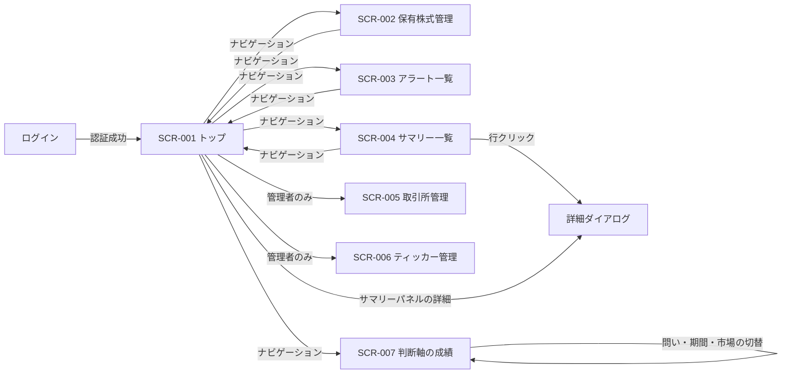
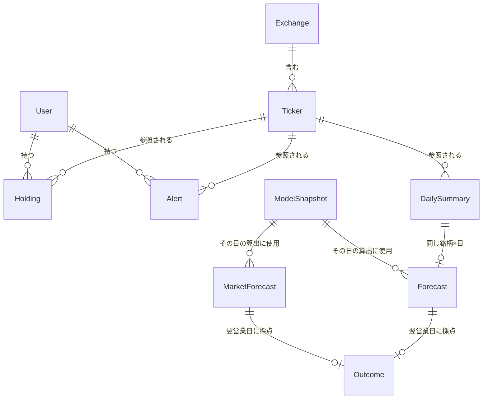

# Stock Tracker 外部設計書

## 1. 画面設計

### 1.1 画面一覧

| 画面 ID | 画面名 | パス | 対応ユースケース | 備考 |
|--------|--------|------|--------------|------|
| SCR-001 | トップ画面（チャート表示） | `/` | UC-001, UC-009 | — |
| SCR-002 | 保有株式管理画面 | `/holdings` | UC-003 | — |
| SCR-003 | アラート一覧画面 | `/alerts` | UC-002 | — |
| SCR-004 | サマリー一覧画面 | `/summaries` | UC-004, UC-006 | — |
| SCR-005 | 取引所管理画面 | `/exchanges` | — | 管理者専用 |
| SCR-006 | ティッカー管理画面 | `/tickers` | — | 管理者専用 |
| SCR-007 | 判断軸の成績画面 | `/axis-performance` | UC-012 | 旧パス `/prediction-evaluation` からリダイレクトする |

### 1.2 画面遷移図

```mermaid
graph LR
    Login[ログイン] -->|認証成功| Top[SCR-001 トップ]
    Top -->|ナビゲーション| Holdings[SCR-002 保有株式管理]
    Top -->|ナビゲーション| Alerts[SCR-003 アラート一覧]
    Top -->|ナビゲーション| Summaries[SCR-004 サマリー一覧]
    Top -->|管理者のみ| Exchanges[SCR-005 取引所管理]
    Top -->|管理者のみ| Tickers[SCR-006 ティッカー管理]
    Top -->|ナビゲーション| Perf[SCR-007 判断軸の成績]
    Holdings -->|ナビゲーション| Top
    Alerts -->|ナビゲーション| Top
    Summaries -->|ナビゲーション| Top
    Summaries -->|行クリック| Detail[詳細ダイアログ]
    Top -->|サマリーパネルの詳細| Detail
    Perf -->|問い・期間・市場の切替| Perf
```

### 1.3 画面の設計

#### 確度の表示の共通ルール

確度は SCR-001・SCR-004・詳細ダイアログ・SCR-007 にまたがって出るため、表記を揃える。

**ラベルと確率**

| 問い | 中立帯の外 (上側) | 中立帯の外 (下側) | 中立帯の内側 | 併記する確率 |
|------|----------------|----------------|------------|------------|
| 方向 (Q-DIR) | 強含み | 弱含み | 中立 | 上回る確率 |
| 荒れ (Q-VOL) | 荒れそう | 平常 | 平常 | 荒れる確率 |
| 市場の荒れ (Q-MKT) | 荒れそう | 平常 | 平常 | 荒れる確率 |

- ラベルは文字だけのチップにし、確率は別に数字で出す (ADR-014)。方向は下側でも「上回る確率」をそのまま出す
- 基準値は画面上「ふだん NN%」と書き、基準値との差 (±pt) は出さない (ADR-014)
- 荒れの下側 (平常より穏やか) は「平常」にまとめる。穏やかであることは判断材料として求められていない
- 中立・平常は控えめな色にする。強含み・弱含み・荒れそうは色を付けるが、色だけに頼らずラベル文字で区別する
- 確率は大半の銘柄でふだん付近に集まり、「中立」「平常」が多くなる。中立が多いこと自体を「手がかりが少ない」という正しい情報として扱う

**基準日**

確度は「その日の引け時点で出した、翌営業日についての確率」である。「9/25 引け時点」のように基準日を必ず出し、「明日」の意味を取り違えないようにする。

**確度がない場合**

確度がない日付・算出できなかった銘柄は「—」にし、ツールチップで理由を示す (「この日の確度はありません」、荒れの平常を出す履歴が足りない銘柄は「履歴が足りず算出できません」)。OHLCV・チャート・アラート作成は確度の有無にかかわらず使える。

---

#### SCR-001: トップ画面（チャート表示）

**概要**

取引所・ティッカーを選択して株価チャートを表示する、サービスの中心となる画面。チャートに加えて、選択銘柄の日次サマリー・保有株式情報・アラート情報を同一画面に統合表示する。

**主要 UI 要素**

| 要素 | 種別 | 説明 |
|-----|------|------|
| 取引所セレクタ | ドロップダウン | 表示対象の取引所を選択する |
| ティッカーセレクタ | ドロップダウン | 表示対象の銘柄を選択する |
| 時間枠セレクタ | セレクタ / タブ | チャートの時間枠（1分・5分・60分・日足）を切り替える |
| 表示本数セレクタ | セレクタ | チャートの表示本数（10 / 30 / 50 / 100）を切り替える |
| 自動更新ボタン | トグルボタン | チャートの自動更新（10秒ごと）を開始・停止する |
| 株価チャート | チャート | 選択銘柄の OHLCV ローソク足チャート（上部）と出来高バー（下部）を表示する。保有株式がある場合は平均取得価格ライン（アンバー破線）、有効なアラートがある場合は上限ライン（赤）・下限ライン（青）をオーバーレイ表示する |
| 日次サマリーパネル | 情報パネル | 選択銘柄の直近サマリーの確度を要約する。基準日、方向・荒れのラベルと確率 (ふだんの割合を併記)、点灯数と買い/売りの内訳、更新時間を表示し、詳細ダイアログボタンを提供する |
| 保有株式パネル | 情報パネル | 選択銘柄の保有情報（数量・平均取得価格）を表示する。追加・編集・削除ボタンから保有株式の CRUD 操作が可能 |
| アラートパネル | 情報パネル | 選択銘柄に設定されているアラート一覧を表示する。追加・編集・削除ボタンからアラートの CRUD 操作が可能 |

**ユーザーインタラクション**

| 操作 | 結果 |
|------|------|
| 取引所を選択 | ティッカーリストが選択取引所でフィルタされる |
| ティッカーを選択 | チャート・サマリー・保有株式・アラートの各パネルが更新される |
| 時間枠を切り替え | チャートの表示時間枠が変わる |
| 表示本数を変更 | チャートの表示本数が変わる |
| 自動更新を切り替え | 10秒ごとのチャート自動更新が開始・停止される |
| 保有株式パネルの追加・編集・削除ボタンをクリック | 対応するダイアログが開き、操作完了後に保有株式パネルが更新される |
| アラートパネルの追加・編集・削除ボタンをクリック | 対応するダイアログが開き、操作完了後にアラートパネルが更新される |
| サマリーパネルの詳細ボタンをクリック | 詳細ダイアログが開く |

**表示条件・状態**

- ローディング: データ取得中はチャートエリアにスピナーを表示する
- エラー: データ取得失敗時はエラーメッセージとリトライ手段を提示する
- 空状態: 保有株式・アラートが未登録の場合は登録への導線を表示する

---

#### SCR-002: 保有株式管理画面（`/holdings`）

**概要**

ユーザーが保有する銘柄の情報（数量・平均取得価格）を管理する画面。

**主要 UI 要素**

| 要素 | 種別 | 説明 |
|-----|------|------|
| 保有株式一覧 | リスト | 登録済みの保有銘柄を取引所・ティッカー・数量・平均取得価格とともに表示する |
| 保有追加ボタン | ボタン | 新規保有登録ダイアログを開く |
| 編集ボタン | ボタン（行単位） | 対象保有株式の編集ダイアログを開く |
| 削除ボタン | ボタン（行単位） | 対象保有株式を削除する（確認あり） |

**ユーザーインタラクション**

| 操作 | 結果 |
|------|------|
| 保有を追加 | 取引所・ティッカー・数量・平均取得価格を入力して保存する |
| 保有を編集 | 数量・平均取得価格を変更して保存する |
| 保有を削除 | 確認ダイアログ後に保有情報が削除される |

**表示条件・状態**

- ローディング: 一覧取得中はスピナーを表示する
- 空状態: 保有株式が未登録の場合は登録促進メッセージを表示する

---

#### SCR-003: アラート一覧画面

**概要**

ユーザーが設定したアラートを一覧表示し、新規作成・編集・削除・絞り込みを行う画面。

**主要 UI 要素**

| 要素 | 種別 | 説明 |
|-----|------|------|
| アラート一覧 | リスト | 登録済みアラートを条件・ステータスとともに表示する |
| 絞り込みフィルタ | フィルタ | 取引所・ティッカー・条件タイプで絞り込む |
| アラート作成ボタン | ボタン | 新規アラート作成ダイアログを開く |
| 編集ボタン | ボタン（行単位） | 対象アラートの編集ダイアログを開く |
| 削除ボタン | ボタン（行単位） | 対象アラートを削除する（確認あり） |
| プレビューチャート | チャート（ダイアログ内） | アラート作成・編集ダイアログ内に表示されるチャート。設定したアラート条件（上限・下限価格）をラインとしてオーバーレイ表示する |

**ユーザーインタラクション**

| 操作 | 結果 |
|------|------|
| アラートを作成 | 取引所・ティッカー・条件タイプ・目標価格・通知有無を設定して保存する |
| フィルタを変更 | 一覧が絞り込まれて再表示される |
| 削除を実行 | 確認ダイアログ後にアラートが削除される |

**表示条件・状態**

- ローディング: 一覧取得中はスケルトンまたはスピナーを表示する
- 空状態: アラートが未登録の場合は作成促進メッセージを表示する

---

#### SCR-004: サマリー一覧画面（`/summaries`）

**概要**

市場全体の荒れ予報と、銘柄ごとの確度・点灯数を一覧で確認する画面。`stocks:read` 権限が必要。

**主要 UI 要素**

| 要素 | 種別 | 説明 |
|-----|------|------|
| 市場の荒れ予報 | 情報カード (1 枚) | 一覧より上に置く。日本・米国の行に、Q-MKT のラベル・荒れる確率・基準日を出し、ふだんの荒れる割合と「参考値」の注記は 1 回だけ出す (ADR-014)。取引所セレクタの選択に関係なく、両市場とも出す |
| 取引所セレクタ | ドロップダウン | 表示する取引所を絞り込む |
| ティッカー一覧 | テーブル | 列: シンボル / 銘柄名 / 保有 / 方向 / 荒れ / 点灯 / 買いアラート数 / 売りアラート数 |
| 方向・荒れ列 | セル | 共通ルールのラベルと確率。列見出しのクリックで確率順に並べ替える |
| 点灯列 | セル | 合致した単一パターンの数と、買い/売りの内訳 (ADR-013) |
| 詳細ダイアログ | ダイアログ | 後述。SCR-001 からも同じものを開く |

**ユーザーインタラクション**

| 操作 | 結果 |
|------|------|
| 方向・荒れの列見出しをクリック | 確率の降順 → 昇順 → 既定順で並べ替える。確度のない行は常に末尾に置く |
| ティッカー行をクリック | 詳細ダイアログが開く |
| 市場の荒れ予報の「?」 | 「明日、市場全体 (登録銘柄の平均) の値幅がふだんより大きくなる確率」であることと、ふだんの割合と比べて読むことを説明する |

**表示条件・状態**

- ローディング: 一覧取得中はスピナーを表示する
- 空状態: サマリーデータが存在しない取引所は空状態メッセージを表示する
- 参考値: Q-MKT は市場ごとに 1 日 1 件しか採点が溜まらず、確率の信頼性が低い。採点済みの日数が約 1 年 (250 営業日) に満たない市場は「参考値」と添える

---

#### 詳細ダイアログ（SCR-001・SCR-004 共通）

**概要**

1 銘柄の確度を、ふだんの割合・同じ確率帯の過去実績・軸の内訳とあわせて示す。「表示された確率を信じてよいか」と「何が確率を動かしたか」を判断できるようにする。

**主要 UI 要素 (上から)**

| 要素 | 種別 | 説明 |
|-----|------|------|
| ヘッダ | テキスト | 銘柄名・シンボル・基準日 |
| 確度カード (方向・荒れ) | 情報カード | ラベルと確率、ふだんの割合。その下に、同じ確率帯の過去実績 (「55〜60% の帯の実績: 的中 57% (212 件)」) を出す。件数が 30 件未満の帯は「件数が少なく参考値」と添える |
| 内訳タブ | タブ | 方向の内訳 / 荒れの内訳 |
| 内訳テーブル | テーブル | 列: 軸名 / 値 / 過去成績 (件数・的中率・ふだんとの差) / 寄与。寄与の絶対値の大きい順に並べる |
| 点灯しなかった軸 | 折りたたみ | 点灯型で点灯しなかった軸を、既定で閉じた折りたたみにまとめる (寄与は 0 か、ごく小さい) |
| 日足チャート | チャート | 直近 50 本 |
| アラート作成ボタン | ボタン | 対象銘柄のアラート作成ダイアログを開く |

- 値の列: 点灯型は点灯の有無、数値型は平常比 (「1.4 倍 (平常比)」) で出す
- 寄与: その軸によって確率が何 pt 動いたか (「+2.1pt」「−0.8pt」)。合計は「確率 − ふだんの割合」に一致する (`architecture.md` ADR 2.24)
- 件数不足で重みがほぼゼロの軸は、寄与の横に「件数不足」と付ける
- 判断軸の成績画面 (SCR-007) への導線は置かない。軸ごとの過去成績は内訳テーブルに出ているため

**表示条件・状態**

- 確度がない場合は、内訳テーブルの代わりに理由を出す。チャートとアラート作成は通常どおり使える
- モバイル幅では、内訳テーブルの行に「軸名 / 寄与」だけを出し、値と過去成績は行を展開して見せる

---

#### SCR-005: 取引所管理画面（`/exchanges`）

**概要**

取引所マスタデータを管理する画面。`stocks:manage-data` 権限（stock-admin ロール）を持つ管理者のみアクセス可能。

**主要 UI 要素**

| 要素 | 種別 | 説明 |
|-----|------|------|
| 取引所一覧 | リスト | 登録済み取引所を ID・名称・タイムゾーン・取引時間とともに表示する |
| 取引所追加ボタン | ボタン | 新規取引所登録ダイアログを開く |
| 編集ボタン | ボタン（行単位） | 対象取引所の編集ダイアログを開く |
| 削除ボタン | ボタン（行単位） | 対象取引所を削除する（確認あり） |

**表示条件・状態**

- 空状態: 取引所が未登録の場合は登録促進メッセージを表示する

---

#### SCR-006: ティッカー管理画面（`/tickers`）

**概要**

ティッカーマスタデータを管理する画面。`stocks:manage-data` 権限（stock-admin ロール）を持つ管理者のみアクセス可能。

**主要 UI 要素**

| 要素 | 種別 | 説明 |
|-----|------|------|
| ティッカー一覧 | リスト | 登録済みティッカーを ID・シンボル・銘柄名・所属取引所とともに表示する |
| ティッカー追加ボタン | ボタン | 新規ティッカー登録ダイアログを開く |
| 編集ボタン | ボタン（行単位） | 対象ティッカーの編集ダイアログを開く |
| 削除ボタン | ボタン（行単位） | 対象ティッカーを削除する（確認あり） |

**表示条件・状態**

- 空状態: ティッカーが未登録の場合は登録促進メッセージを表示する

#### SCR-007: 判断軸の成績画面（`/axis-performance`）

**概要**

全軸の成績と、合成した確度の成績 (確率帯ごとの実績) を問いごとに確認する画面。確度が「実際にその確率で当たっている」かを、継続的に確かめる場所である。`stocks:read` 権限で閲覧でき、ナビゲーションにも `/summaries` と同じ条件で出す (ADR-012)。

**主要 UI 要素**

| 要素 | 種別 | 説明 |
|------|------|------|
| 問いタブ | タブ | 方向 / 荒れ / 市場の荒れ |
| 期間セレクタ | トグル | 30 日 / 90 日 (既定) / 全期間。期間は予測日で切る |
| 市場フィルタ | トグル | 全体 / JP / US。市場の荒れタブでは JP / US のみ (市場ごとの問いのため) |
| 見出し行 | テキスト | 対象期間、採点済み件数とふだんの割合。その下に、現在の中立帯を「ふだんの割合から +0〜+5pt は中立」のように文字で示す |
| 確度の成績 | 表 + 信頼度図 | 確率帯 (5pt 刻み) ごとの件数・予測の平均・実際の的中率。信頼度図は対角線と比べて描く。件数 30 件未満の帯は薄く表示する |
| 軸ごとの成績 | テーブル | 列: 軸名 / 種類 (点灯型・数値型) / 件数 / 的中率 / ふだんとの差 / 平均超過リターン (方向タブのみ) / 現在の重み。各列で並べ替えられる。件数不足の点灯型軸には目印を付ける |

- 数値型軸の件数・的中率は、値が平常より高かった日を「点灯」とみなして数える。表示のための定義で、合成には値そのものを使う
- 現在の重みは、最新の算出日の係数を、符号付きの数値と棒で出す
- 稼働開始より前の成績は、過去データからさかのぼって算出したものである

**ユーザーインタラクション**

| 操作 | 結果 |
|------|------|
| 問い・期間・市場を切り替え | 表と図を再集計して表示する |
| 軸名をクリック | その軸の説明 (集計の定義・対象の問い) をツールチップで表示する |

**表示条件・状態**

- 空状態: 採点が 1 件もない期間は空状態メッセージを表示する
- 権限なし: 権限がない旨を表示する

---

### 1.4 レスポンシブ方針

スマートフォンファーストで設計する（[プラットフォーム全体の開発ガイドライン](../../development/rules.md) に準拠）。

- モバイル（スマートフォン）: 縦スクロールを基本とし、チャートや各パネルを縦方向に積み重ねて表示する
- デスクトップ: 横方向のレイアウトを活用し、チャートと各パネルを並列配置できる幅を確保する
- 列の多い表 (サマリー一覧・軸ごとの成績) は横スクロールで見せる。成績画面の軸テーブルは、モバイル幅では「軸名 / 件数 / ふだんとの差 / 現在の重み」を優先する

### 1.5 アクセシビリティ方針

Material UI（MUI）コンポーネントが提供する標準的なアクセシビリティ機能（ARIA 属性・キーボード操作・フォーカス管理）を活用する。カスタム実装が必要な箇所では MUI の方針に倣い、適切なラベルとロール指定を行う。

---

## 2. 概念データモデル

### 2.1 主要エンティティ一覧

| エンティティ | 説明 | 主要な属性（概念レベル） |
|------------|------|-------------------|
| Exchange（取引所） | 株式が取引される市場 | 名称、識別コード |
| Ticker（ティッカー） | 個別銘柄を識別するシンボル | シンボル、銘柄名、所属取引所 |
| Holding（保有株式） | ユーザーが保有する銘柄の情報 | 銘柄、数量、平均取得価格 |
| Alert（アラート） | 価格条件に基づく通知設定。Web Push サブスクリプション情報を内包する | 銘柄、条件リスト、通知頻度、有効フラグ、Web Push エンドポイント・キー |
| DailySummary（日次サマリー） | その日の足と、足から決まる判定 | 日付、始値・高値・安値・終値・出来高、パターン分析結果 |
| 判断軸 (Axis) | 機械的に算出できる条件または値。コードで定義し、DB には持たない | 名前、種類 (点灯型・数値型)、対象の問い |
| 確度 (Forecast) | 銘柄 × 日の予測。予測時点の値として保存し、書き換えない | 軸の値、問いごとの確率・ふだんの割合・中立帯・寄与 |
| 市場の確度 (MarketForecast) | 市場 × 日の予測 | 市場レベル軸の値、市場の荒れの確率・ふだんの割合・中立帯 |
| 採点結果 (Outcome) | 翌営業日の実績と、問いごとの当否。確度に付く | 超過リターン、値幅の平常比、当否 |
| 重みのスナップショット (ModelSnapshot) | その日の算出に使った重み・ふだんの割合・中立帯・軸ごとの成績 | 問い、算出した市場、日付 |

### 2.2 エンティティ関係図

```mermaid
erDiagram
    Exchange ||--o{ Ticker : "含む"
    Ticker ||--o{ Holding : "参照される"
    Ticker ||--o{ Alert : "参照される"
    Ticker ||--o{ DailySummary : "参照される"
    DailySummary ||--o| Forecast : "同じ銘柄×日"
    Forecast ||--o| Outcome : "翌営業日に採点"
    MarketForecast ||--o| Outcome : "翌営業日に採点"
    ModelSnapshot ||--o{ Forecast : "その日の算出に使用"
    ModelSnapshot ||--o{ MarketForecast : "その日の算出に使用"
    User ||--o{ Holding : "持つ"
    User ||--o{ Alert : "持つ"
```

---

## 3. 設計上の決定事項（ADR）

欠番は、旧予測精度ダッシュボードを撤去したときに役目を終えた判断である (`architecture.md` ADR 2.21)。

### ADR-001: チャート・サマリー・保有株式・アラートの統合表示

**背景・問題**

株価チャートを確認する際、ユーザーは同じ銘柄の保有状況・アラート設定・最新サマリーを同時に参照したいケースが多い。これらを別々の画面に配置した場合、画面遷移のたびにコンテキストが失われ、銘柄ごとの全体像を把握しにくくなる。

**決定**

トップ画面（チャート表示）に、選択銘柄の日次サマリー・保有株式・アラートの各情報パネルを統合表示する。

**根拠・トレードオフ**

- 銘柄選択という単一の操作で関連情報がすべて更新されるため、銘柄ごとの投資判断に必要な情報を一画面で把握できる
- 保有株式管理・アラート一覧は独立した専用画面（SCR-002, SCR-003）にも存在し、一覧操作・編集はそちらで行う設計とすることで、トップ画面の責務を「閲覧・確認」に絞る
- トップ画面の情報量が増えるため、モバイルでは縦スクロールが長くなる可能性があるが、最も利用頻度の高い情報を集約することを優先した

---

### ADR-010: 同市場平均と荒れ予報の単位を「市場 (JP / US)」にする

**背景・問題**

方向は「同じ単位の登録銘柄の平均を上回るか」で測り、市場全体の荒れも単位ごとに予報する。当初は取引所を単位としていたが、登録銘柄は TSE 67・NYSE 36・NASDAQ 33・AMEX 1 で、AMEX では同市場平均との差が常に 0 になり、AMEX 単独の荒れ予報も意味を持たない。

**決定**

JP (TSE) と US (NASDAQ・NYSE・AMEX) の 2 市場を単位とする。市場は取引所マスタの市場属性で決める。

**根拠・トレードオフ**

- 同じ営業日カレンダーで同じ時刻に引ける取引所をまとめれば、平均が安定する
- 取引所ごとの差 (NASDAQ にハイテクが多い等) は区別できなくなるが、取引所単位では銘柄数が少なく平均が不安定になる

---

### ADR-011: 詳細ダイアログの内訳は開いたときに取る

**背景・問題**

内訳は銘柄ごとに約 35 軸 (方向 29・荒れ 6) あり、一覧の全銘柄分を載せるとレスポンスが大きくなる。

**決定**

サマリー一覧は確度の要約だけを受け取り、内訳は詳細ダイアログを開いたときに銘柄ごとに取る。

**根拠・トレードオフ**

ダイアログを開くたびに 1 往復増えるが、一覧の表示速度を優先する。トップ画面からも同じ取り方で使える。

---

### ADR-012: 確度と成績を `stocks:read` で見せ、`stocks:read-evaluation` を廃止する

**背景・問題**

旧予測精度ダッシュボードは、管理者だけが見る実験的な画面だったため、専用の権限 `stocks:read-evaluation` を設けていた。確度は一般ユーザーが見る判断材料になり、その根拠となる成績も同じ人が見られるべきである。

**決定**

判断軸の成績画面は `stocks:read` で閲覧できるようにし、`stocks:read-evaluation` は権限の定義とロールから削除する。

**根拠・トレードオフ**

使われない権限が残ると、ロール設計を読む人が混乱する。将来、管理者向けの分析機能を分けたくなったら、そのときに改めて権限を設ける。

---

### ADR-013: 「点灯数」は単一パターンの合致数とする

**背景・問題**

一覧の点灯列は、点灯している軸の数を示す。ただし数値型軸 (値幅・出来高比) は毎日値を持つため、「点灯」の概念がない。

**決定**

点灯列は合致した単一パターンだけを数え、買い/売りの内訳を添える。複合パターン軸と数値型軸は数えない。これらの効き具合は、確度と詳細ダイアログの内訳で見せる。

**根拠・トレードオフ**

- 複合軸 (買い合致数 ≥ 2) を数えると、構成パターンと二重に数えてしまう
- 数値型軸にしきい値を設けて「点灯」とみなす案は、しきい値が恣意的になる
- 結果として、旧来の買い/売りシグナル数をまとめた形になり、利用者にとっても連続性がある

---

### ADR-014: 確率とふだんの割合を、ラベルとは別に同じ書き方で出す

**背景・問題**

当初は「弱含み 58%」のようにラベルにそちら向きの確率を付け、「基準 36% / −6pt」と基準値との差を併記していた。dev で画面を確かめたところ、次の問題があった。

- 「基準 36% / −6pt」では、何の基準で、確率がいくつなのかが初見でわからなかった
- JP・US の 2 枚のカードに同じ基準値と同じ注記が繰り返し出ており、本当に別々に計算しているのかと不審に見えた

**決定**

- ラベル (強含み・弱含み・中立・荒れそう・平常) は文字だけにする
- 確率は常に数字で、問いの向きを固定して出す (方向は「上回る確率」、荒れは「荒れる確率」)
- 基準値は「ふだん NN%」と書き、差の pt は出さない
- 市場の荒れ予報は 1 枚のカードにまとめ、両市場に共通の「ふだんの荒れる割合」と参考値の注記は 1 回だけ出す。市場ごとに値が違うときだけ、その行に添える

**根拠・トレードオフ**

- 「ふだん」は、どの軸も効いていないときの割合という意味を、用語の説明なしに伝えられる
- 向きを固定すると、弱含みの銘柄は「上回る確率 42%」のように 50% を下回る値になる。向きによって数字の意味が変わるより、全画面で同じ読み方ができることを優先した
- 差の pt は、確率とふだんの割合を並べれば読める
- ふだんの割合は両市場で共通 (`architecture.md` ADR 2.25) なので、1 回だけ出せば足りる
