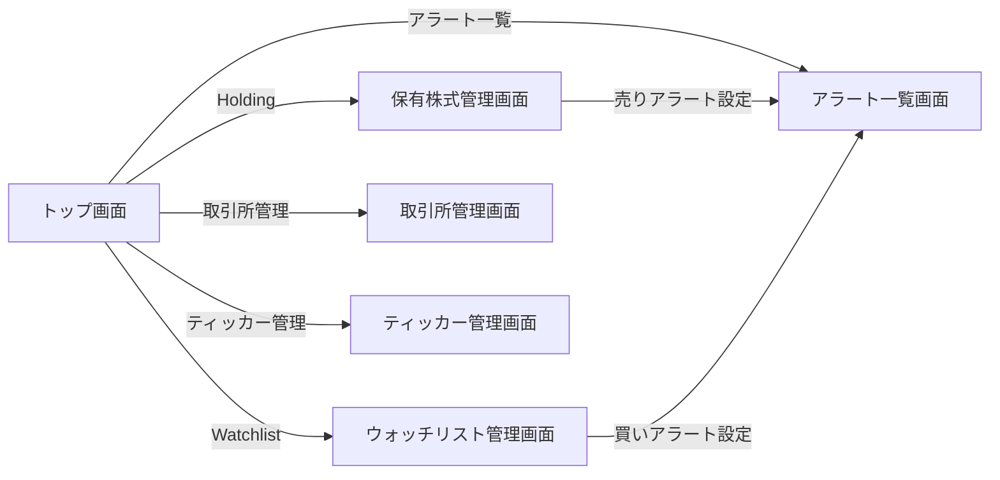

# Stock Tracker 要件定義書

## 1. ビジネス要件

### 1.1 背景・目的

**背景**:
- 株式投資において、タイムリーな価格情報と適切なタイミングでの売買判断が重要
- 既存の finance リポジトリで提供していた株価追跡・通知機能を、本プラットフォームで刷新
- モノレポ構成による開発効率向上、共通インフラ活用によるコスト削減を目指す

**目的**:
- リアルタイムな株価データの可視化（チャート表示）
- 条件ベースのアラート・通知による売買タイミングの最適化
- 保有株式の管理と目標価格の算出による投資判断支援

### 1.2 対象ユーザー

**プライマリーユーザー**:
- 個人投資家（株式トレーダー）
- 日々の株価変動をチェックし、売買判断を行うユーザー

**ユーザー特性**:
- 複数の銘柄を監視している
- 価格条件に基づいた通知を受け取りたい
- 保有株式の平均取得価格と目標価格を把握したい
- モバイル/デスクトップの両方から利用する

### 1.3 ビジネスゴール

**Phase 1（MVP）の目標**:
1. **株価の可視化**: リアルタイムな株価データをチャートで表示
2. **通知機能**: 価格条件に基づくアラート通知
3. **保有株式管理**: 平均取得価格、目標価格の算出

**Phase 2 以降の目標**:
- テクニカル指標の追加（移動平均、ボリンジャーバンドなど）
- 高度なパターン認識（赤三兵、三川明けの明星など）
- ポートフォリオ分析機能

---

## 2. 機能要件

### 2.1 ユースケース

#### UC-001: 株価チャート表示

**概要**: ユーザーが指定した取引所・ティッカーの株価チャートを表示する

**アクター**: ログインユーザー

**前提条件**:
- ユーザーがログイン済み
- 取引所・ティッカーが登録されている

**正常フロー**:
1. ユーザーがトップ画面にアクセス
2. 取引所を選択
3. ティッカーを選択
4. 時間枠を選択（5分足、1時間足、日足など）
5. システムが TradingView API から株価データを取得
6. ECharts でインタラクティブなチャートを表示

#### UC-002: アラート設定

**概要**: ユーザーが株価の条件を設定し、条件達成時に通知を受け取る

**アクター**: ログインユーザー

**前提条件**:
- ユーザーがログイン済み
- ブラウザで通知許可が有効

**正常フロー**:
1. ユーザーがアラート設定画面にアクセス
2. 取引所とティッカーを選択
3. 条件タイプを選択（価格が指定値を上回る/下回る）
4. 目標価格を入力
5. 通知頻度を選択
6. システムがアラート設定を保存

#### UC-003: 保有株式管理

**概要**: ユーザーが保有株式を登録し、平均取得価格と目標価格を確認する

**アクター**: ログインユーザー

**正常フロー**:
1. ユーザーが保有株式管理画面にアクセス
2. 新規登録ボタンをクリック
3. 取引所、ティッカー、保有数、平均取得価格を入力
4. システムが保有株式情報を保存
5. 目標価格を自動算出して表示

### 2.2 機能一覧

| 機能ID | 機能名                     | 説明                                           | 優先度 |
| ------ | -------------------------- | ---------------------------------------------- | ------ |
| F-001  | 株価データ取得             | TradingView API から株価データを取得           | 高     |
| F-002  | チャート表示               | ECharts で株価チャートを表示                   | 高     |
| F-003  | 取引所管理                 | 取引所の CRUD 操作                             | 高     |
| F-004  | ティッカー管理             | ティッカーの CRUD 操作                         | 高     |
| F-005  | アラート・通知機能         | 価格条件に基づく通知（Web Push）               | 高     |
| F-006  | 目標価格算出               | 保有株式の平均取得価格を参照して目標価格を提案  | 低     |
| F-007  | 保有株式管理               | 保有株式の CRUD 操作                           | 高     |
| F-008  | ウォッチリスト管理         | 買い候補銘柄の CRUD 操作                       | 高     |
| F-009  | ユーザー認証               | Auth サービス連携によるログイン・ログアウト    | 高     |
| F-010  | 権限管理                   | ロールベースのアクセス制御                      | 高     |

---

## 3. 非機能要件

### 3.1 パフォーマンス要件

| 項目                   | 要件                                    |
| ---------------------- | --------------------------------------- |
| チャート表示           | 初回ロード 2秒以内                      |
| 株価データ取得         | 1秒以内                                 |
| 通知遅延               | 条件達成から 1分以内                    |
| 同時接続数             | 想定 100ユーザー（Phase 1）            |

### 3.2 セキュリティ要件

**認証・認可**:
- Auth サービス（プラットフォーム共通）による JWT 認証
- ロールベースアクセス制御（RBAC）

**Stock Tracker 用のロール定義**:

| ロール名       | 権限（Permissions）                                      | 想定ユーザー                |
| -------------- | ------------------------------------------------------- | --------------------------- |
| `stock-viewer` | `stocks:read`                                            | ゲストユーザー（デフォルト） |
| `stock-user`   | `stocks:read`, `stocks:write-own`                        | 一般ユーザー                 |
| `stock-admin`  | `stocks:read`, `stocks:write-own`, `stocks:manage-data` | 管理者                       |

**Permission 定義**:

| Permission           | 説明                                                   |
| -------------------- | ------------------------------------------------------ |
| `stocks:read`        | チャート閲覧、取引所一覧取得、ティッカー一覧取得       |
| `stocks:write-own`   | 自分のアラート設定・保有株式管理                        |
| `stocks:manage-data` | 取引所・ティッカーの CRUD（マスタデータ管理）          |

**データ保護**:
- HTTPS 通信の強制
- DynamoDB のデータは保存時暗号化
- Web Push サブスクリプション情報の暗号化

**セキュリティ対策**:
- XSS 対策: React の自動エスケープ、CSP ヘッダー
- CSRF 対策: SameSite Cookie
- 入力バリデーション: クライアント・サーバー両方で実施

### 3.3 可用性要件

| 項目               | 要件                           |
| ------------------ | ------------------------------ |
| 稼働率             | 99.5%（ベストエフォート）      |
| RTO (復旧目標時間) | 4時間以内                      |
| RPO (復旧目標時点) | 1時間以内（DynamoDB PITR有効） |

**バックアップ戦略**:
- DynamoDB Point-in-Time Recovery (PITR) 有効化
- 保持期間: 35日間

### 3.4 保守性・拡張性要件

**コード品質**:
- TypeScript strict mode 有効
- ESLint による静的解析
- テストカバレッジ 80%以上（ビジネスロジック）

**モジュール化**:
- core パッケージ: ビジネスロジック（フレームワーク非依存）
- web パッケージ: Next.js UI
- batch パッケージ: Lambda 関数（通知バッチ）

**拡張ポイント**:
- 新しい条件タイプの追加（パターン認識など）
- 新しいチャートライブラリへの切り替え
- 複数の株価データソースへの対応

### 3.5 その他の非機能要件

**スケーラビリティ**:
- Lambda 自動スケール（Web）
- DynamoDB オンデマンドキャパシティ
- EventBridge Scheduler による定期実行（バッチ）

**インフラ**:
- **Web**: Lambda (Web Adapter) + CloudFront
- **Batch**: Lambda + EventBridge Scheduler
- **データストア**: DynamoDB
- **認証**: Auth サービス（本プラットフォーム共通）

**モニタリング**:
- CloudWatch Logs による統一ログ管理
- CloudWatch Alarms によるエラー監視

---

## 4. UI/UX 要件

### 4.1 画面一覧

| 画面名                     | パス          | 説明                                       | 優先度 |
| -------------------------- | ------------- | ------------------------------------------ | ------ |
| トップ画面（チャート表示） | `/`           | 株価チャート表示・取引所/ティッカー選択     | 高     |
| 保有株式管理画面           | `/holdings`   | 保有株式の CRUD 操作・売りアラート設定      | 高     |
| ウォッチリスト管理画面     | `/watchlist`  | 買い候補銘柄の CRUD 操作・買いアラート設定  | 高     |
| アラート一覧画面           | `/alerts`     | 全アラートの一覧表示・編集・削除           | 中     |
| 取引所管理画面             | `/exchanges`  | 取引所の CRUD 操作（stock-admin のみ）     | 中     |
| ティッカー管理画面         | `/tickers`    | ティッカーの CRUD 操作（stock-admin のみ） | 中     |

### 4.2 画面遷移図



### 4.3 ワイヤーフレーム

ワイヤーフレームは `docs/images/services/stock-tracker/` に格納されています。

### 4.4 UI要件概要

**トップ画面（チャート表示）**:
- 取引所・ティッカー選択ドロップダウン
- 時間枠選択ボタン
- ECharts によるインタラクティブなチャート表示

**保有株式管理画面**:
- 保有株式一覧テーブル（ティッカー、保有数、平均取得価格、目標価格）
- 新規登録・編集・削除機能
- 売りアラート設定への導線

**ウォッチリスト管理画面**:
- ウォッチリスト一覧テーブル（ティッカー、登録日時）
- 新規登録・削除機能
- 買いアラート設定への導線

**アラート一覧画面**:
- アラート一覧テーブル（ティッカー、条件、有効/無効）
- 新規作成・編集・削除機能
- 有効/無効切り替え

---

## 5. データ設計

### 5.1 DynamoDB テーブル設計

**Single Table Design** を採用し、1つのテーブルで全エンティティを管理します。

**テーブル名**: `nagiyu-stock-tracker-main-{env}`

**キー構成**:
- Partition Key: `PK` (String)
- Sort Key: `SK` (String)

**GSI**:
- GSI1: `GSI1PK`, `GSI1SK` (ユーザー別クエリ用)

### 5.2 エンティティ設計

**Exchange（取引所）**:
```
PK: EXCHANGE#{ExchangeID}
SK: METADATA
```

**Ticker（ティッカー）**:
```
PK: TICKER#{TickerID}
SK: METADATA
```

**Holding（保有株式）**:
```
PK: USER#{UserID}
SK: HOLDING#{HoldingID}
GSI1PK: USER#{UserID}
GSI1SK: HOLDING#{TickerID}
```

**Watchlist（ウォッチリスト）**:
```
PK: USER#{UserID}
SK: WATCHLIST#{WatchlistID}
GSI1PK: USER#{UserID}
GSI1SK: WATCHLIST#{TickerID}
```

**Alert（アラート）**:
```
PK: USER#{UserID}
SK: ALERT#{AlertID}
GSI1PK: USER#{UserID}
GSI1SK: ALERT#{TickerID}
```

**PushSubscription（Web Push サブスクリプション）**:
```
PK: USER#{UserID}
SK: PUSH#{Endpoint}
```

### 5.3 アクセスパターン

| パターン | 説明 | キー |
|---------|------|------|
| 取引所一覧取得 | 全取引所を取得 | PK begins_with "EXCHANGE#" |
| ティッカー一覧取得 | 全ティッカーを取得 | PK begins_with "TICKER#" |
| ユーザーの保有株式一覧 | 特定ユーザーの保有株式 | GSI1: GSI1PK = "USER#{UserID}", GSI1SK begins_with "HOLDING#" |
| ユーザーのアラート一覧 | 特定ユーザーのアラート | GSI1: GSI1PK = "USER#{UserID}", GSI1SK begins_with "ALERT#" |

---

## 6. Phase 1 スコープ定義

### 6.1 Phase 1 で実装する機能

- 取引所・ティッカーマスタの基本 CRUD
- 保有株式管理（CRUD）
- ウォッチリスト管理（CRUD）
- 価格ベースのシンプルなアラート（`PRICE_ABOVE`, `PRICE_BELOW`）
- リアルタイムチャート表示（TradingView 連携）
- Web Push 通知
- 取引時間外の通知抑制

### 6.2 Phase 1 でスコープ外の機能

以下の機能は Phase 2 以降で実装:
- テクニカル指標（移動平均、ボリンジャーバンド、RSI など）
- 高度なパターン認識（赤三兵、三川明けの明星など）
- ポートフォリオ分析機能
- 複数の株価データソース対応
- カスタムアラート条件（JavaScript ベースのカスタム条件式）
- バックテスト機能

---

## 7. 外部連携仕様

### 7.1 TradingView API

**パッケージ**: `@mathieuc/tradingview`

**用途**: 株価データのリアルタイム取得

**主要機能**:
- リアルタイム株価データの取得
- 複数タイムフレームのサポート（1m, 5m, 15m, 1h, 4h, 1d）
- WebSocket による自動更新

**設計判断**:
- TradingView を選定した理由: 既存 finance リポジトリでの動作実績、豊富なティッカー対応
- WebSocket 接続により、ポーリングよりも効率的なリアルタイム更新を実現
- タイムフレーム切り替えにより、ユーザーは短期・長期の両方の視点で株価を分析可能

### 7.2 Web Push 通知

**パッケージ**: `web-push`

**用途**: アラート通知の配信

**主要機能**:
- VAPID キーベースの認証
- Service Worker による通知受信
- サブスクリプション管理

**設計判断**:
- Web Push を選定した理由: ブラウザネイティブ機能で追加アプリ不要、iOS/Android 両対応
- VAPID 認証により、通知送信元を検証しセキュリティを確保
- Service Worker によりバックグラウンドでも通知を受信可能（ブラウザを閉じていても通知）
- サブスクリプション管理により、ユーザーごとに通知先デバイスを柔軟に管理

---

## 8. 用語集

| 用語 | 説明 |
|------|------|
| Exchange | 取引所（例: NYSE, NASDAQ） |
| Ticker | ティッカーシンボル（例: AAPL, NVDA） |
| Holding | 保有株式 |
| Watchlist | ウォッチリスト（買い候補銘柄） |
| Alert | アラート（価格条件に基づく通知設定） |
| Timeframe | 時間枠（例: 5分足、1時間足、日足） |
| VAPID | Voluntary Application Server Identification（Web Push 認証） |
| Single Table Design | DynamoDB の設計パターン（1テーブルで複数エンティティ管理） |

---

## 9. 参考リンク

- [アーキテクチャ設計書](./architecture.md)
- [API 仕様書](./api-spec.md)
- [デプロイ・運用マニュアル](./deployment.md)
- [テスト仕様書](./testing.md)
