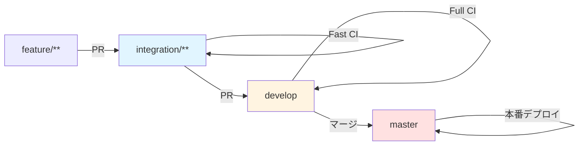

# Tools デプロイ・運用マニュアル

本ドキュメントは、Tools アプリのデプロイと運用に関する手順を説明します。

---

## 1. 環境構成

### 1.1 環境一覧

| 環境        | 用途               | デプロイ元ブランチ          | URL                                 |
| ----------- | ------------------ | --------------------------- | ----------------------------------- |
| dev (開発)  | 開発・検証環境     | `develop`, `integration/**` | `https://dev-tools.nagiyu.com`      |
| prod (本番) | 本番サービス提供   | `master`                    | `https://tools.nagiyu.com`          |

### 1.2 リソース構成

**主要リソース**:

- **ECR Repository**: Docker イメージ保存（`nagiyu/tools`）
- **Lambda Function**: Next.js 実行環境（Node.js 22 コンテナ、1024MB、30秒タイムアウト）
- **Lambda Function URL**: HTTP(S) エンドポイント（認証なし）
- **CloudFront Distribution**: CDN、カスタムドメイン
- **ACM Certificate**: SSL/TLS証明書（共通基盤）

**インフラ定義の場所**:

- CDK スタック: `infra/tools/lib/`
- CDK 設定: `infra/tools/cdk.json`

### 1.3 環境ごとのリソース名

| リソース           | dev 環境                    | prod 環境                    |
| ------------------ | --------------------------- | ---------------------------- |
| ECR Repository     | `nagiyu/tools`              | `nagiyu/tools`               |
| Lambda Function    | `nagiyu-tools-app-dev`      | `nagiyu-tools-app-prod`      |
| CloudFront         | `nagiyu-tools-cloudfront-dev` | `nagiyu-tools-cloudfront-prod` |

---

## 2. 前提条件

### 2.1 共有インフラ

以下がデプロイ済みであることを確認してください:

- [ ] **ACM 証明書** (CloudFront 用): [共通インフラ: ACM](../../infra/shared/acm.md) 参照

### 2.2 必要なツール

- Node.js（バージョンは package.json を参照）
- AWS CLI
- Docker

### 2.3 認証情報

GitHub Actions で自動デプロイを行うには、既存の IAM ユーザー (`nagiyu-github-actions`) の認証情報が必要です。

IAM ユーザーは `infra/shared/iam/users/github-actions-user.yaml` で定義されており、以下のポリシーがアタッチされています:
- `nagiyu-deploy-policy-core`
- `nagiyu-deploy-policy-container` (ECR 権限を含む)
- `nagiyu-deploy-policy-application` (Lambda 権限を含む)
- `nagiyu-deploy-policy-integration`

---

## 3. 初回セットアップ

### 3.1 手順概要

**注意**: 通常、初回セットアップは GitHub Actions により自動的に実行されます。手動セットアップは緊急時のみ必要です。

1. **ECR リポジトリ作成**: コンテナイメージ格納用リポジトリの作成
2. **Docker イメージビルド**: アプリケーションのコンテナイメージを作成
3. **インフラデプロイ**: Lambda, CloudFront などのリソースをデプロイ
4. **動作確認**: ヘルスチェック・機能確認

**リージョン戦略**:
- **すべてのリソース**: `us-east-1` (バージニア北部)
    - CloudFront 用 ACM 証明書との統一
    - シンプルなリソース管理
    - クロスリージョン設定の複雑さを回避

### 3.2 ECR リポジトリの作成

```bash
# 開発環境
npm run deploy -w infra-tools -- --context env=dev --context deploymentPhase=ecr-only

# 本番環境
npm run deploy -w infra-tools -- --context env=prod --context deploymentPhase=ecr-only
```

### 3.3 Docker イメージのビルドとプッシュ

```bash
# 1. ECR にログイン
aws ecr get-login-password --region us-east-1 | \
    docker login --username AWS --password-stdin <AWS_ACCOUNT_ID>.dkr.ecr.us-east-1.amazonaws.com

# 2. イメージのビルド（モノレポルートから実行）
docker build -t tools:latest -f services/tools/Dockerfile .

# 3. タグ付け
docker tag tools:latest <ECR_REGISTRY>/tools-dev:latest

# 4. プッシュ
docker push <ECR_REGISTRY>/tools-dev:latest
```

### 3.4 アプリケーションリソースのデプロイ

```bash
# Lambda 関数と CloudFront の作成
npm run deploy -w infra-tools -- --context env=dev --context deploymentPhase=full
```

### 3.5 動作確認

```bash
# Lambda 関数の確認
aws lambda get-function \
    --function-name nagiyu-tools-app-dev \
    --region us-east-1

# ヘルスチェック
curl https://<FUNCTION_URL>/api/health
```

---

## 4. CI/CD パイプライン

### 4.1 ワークフロー概要

Tools アプリでは、2段階のテスト戦略に基づく3つの GitHub Actions ワークフローを使用します:

#### 1. 高速検証ワークフロー (`.github/workflows/tools-verify-fast.yml`)

**目的**: integration/** ブランチへのプルリクエスト時に素早いフィードバックを提供

**トリガー条件**:

```yaml
on:
  pull_request:
    branches:
      - integration/**
    paths:
      - 'services/tools/**'
      - 'libs/**'
      - 'infra/tools/**'
      - '.github/workflows/tools-verify-fast.yml'
```

**ジョブ構成**:

1. **nextjs-build**: Next.js アプリケーションのビルド検証
    - 依存関係のインストール (`npm ci`)
    - プロダクションビルドの実行 (`npm run build`)
    - TypeScript 型チェックとビルドエラーの検出

2. **docker-build**: Lambda 用 Docker イメージのビルド検証
    - Dockerfile を使用したイメージビルド
    - ビルドエラーの早期検出
    - ECR へのプッシュは行わない (検証のみ)

3. **test**: 単体テストの実行
    - Jest テストスイートの実行 (`npm test`)
    - すべてのテストの合格を確認

4. **e2e-test**: E2Eテストの実行（chromium-mobile のみ）
    - Playwright テストの実行（`PROJECT=chromium-mobile`）
    - 高速フィードバックのため最小構成

5. **lint**: リントチェック
6. **format-check**: フォーマットチェック

**マージ条件**:
- すべてのジョブが成功すること

#### 2. 完全検証ワークフロー (`.github/workflows/tools-verify-full.yml`)

**目的**: develop ブランチへのプルリクエスト時に完全な品質検証を実施

**トリガー条件**:

```yaml
on:
  pull_request:
    branches:
      - develop
    paths:
      - 'services/tools/**'
      - 'libs/**'
      - 'infra/tools/**'
      - '.github/workflows/tools-verify-full.yml'
```

**ジョブ構成**:

1. **nextjs-build**: Next.js アプリケーションのビルド検証
2. **docker-build**: Lambda 用 Docker イメージのビルド検証
3. **test**: 単体テストの実行
4. **coverage**: テストカバレッジチェック
    - `npm run test:coverage` で80%未満の場合は失敗
5. **e2e-test**: E2Eテストの実行（全デバイス）
    - 全デバイス（chromium-desktop, chromium-mobile, webkit-mobile）で実行
6. **lint**: リントチェック
7. **format-check**: フォーマットチェック

**マージ条件**:
- すべてのジョブが成功すること
- カバレッジが80%以上であること
- GitHub のブランチプロテクションルールで必須チェックとして設定推奨

#### 3. デプロイワークフロー (`.github/workflows/tools-deploy.yml`)

**目的**: develop, integration/**, master ブランチへのプッシュ時に自動デプロイ

**トリガー条件**:

```yaml
on:
  push:
    branches:
      - develop
      - integration/**
      - master
    paths:
      - 'services/tools/**'
      - 'infra/tools/**'
      - '.github/workflows/tools-deploy.yml'
```

**ジョブ構成**:

1. **infrastructure**: ECR リポジトリの CDK スタックデプロイ
2. **build**: Docker イメージのビルドと ECR へのプッシュ
3. **deploy**: Lambda と CloudFront のデプロイ
4. **verify**: デプロイ後のヘルスチェック

**完全自動化**:
- インフラ (ECR, Lambda, CloudFront) の CDK スタックもワークフロー内で自動デプロイ
- 手動でのインフラセットアップは不要
- CDK コードがリポジトリに含まれているため、変更があれば自動で反映
- ACM 証明書とドメイン名は既存の共通インフラから自動取得

### 4.2 ブランチ戦略とデプロイフロー



| ブランチ         | 環境 | PR検証     | 自動デプロイ |
| ---------------- | ---- | ---------- | ------------ |
| `develop`        | 開発 | ✅ Full CI | ✅           |
| `integration/**` | 開発 | ✅ Fast CI | ✅           |
| `master`         | 本番 | -          | ✅           |

**注**: master ブランチへは直接プッシュせず、develop からのマージのみを想定しているため、PR検証は不要です。

### 4.3 GitHub Secrets の設定

GitHub リポジトリの Settings → Secrets and variables → Actions で以下を確認:

| Name                    | 説明                                   | 設定済み                   |
| ----------------------- | -------------------------------------- | -------------------------- |
| `AWS_ACCESS_KEY_ID`     | IAM ユーザーのアクセスキー ID          | ✓ (共通インフラで設定済み) |
| `AWS_SECRET_ACCESS_KEY` | IAM ユーザーのシークレットアクセスキー | ✓ (共通インフラで設定済み) |
| `AWS_REGION`            | デプロイ先リージョン (`us-east-1`)     | ✓ (共通インフラで設定済み) |

**注意**: これらのシークレットは既存の共通インフラワークフロー (ACM, VPC など) と共有されます。

### 4.4 ワークフロー実行例

#### プルリクエスト作成時

```bash
# feature ブランチから integration/** へのプルリクエスト作成
git checkout -b feature/new-tool
git push origin feature/new-tool

# GitHub でプルリクエストを integration/feature-test ブランチに作成
# → tools-verify-fast.yml が自動実行される
#   ✓ Next.js ビルド検証
#   ✓ Docker ビルド検証
#   ✓ 単体テスト実行
#   ✓ E2Eテスト実行（chromium-mobile のみ）
#   ✓ リントチェック
#   ✓ フォーマットチェック
# → すべて成功でマージ可能

# integration/** ブランチから develop へのプルリクエスト作成
# → tools-verify-full.yml が自動実行される
#   ✓ Next.js ビルド検証
#   ✓ Docker ビルド検証
#   ✓ 単体テスト実行
#   ✓ カバレッジチェック（80%以上）
#   ✓ E2Eテスト実行（全デバイス）
#   ✓ リントチェック
#   ✓ フォーマットチェック
# → すべて成功でマージ可能
```

#### マージ後のデプロイ

```bash
# プルリクエストをマージ
# → develop ブランチに push される
# → tools-deploy.yml が自動実行される
#   1. ECR スタックデプロイ
#   2. Docker イメージビルド & プッシュ
#   3. Lambda デプロイ
#   4. CloudFront デプロイ
#   5. ヘルスチェック
# → 開発環境へデプロイ完了
```

---

## 5. 手動デプロイ

### 5.1 Docker イメージの手動デプロイ

#### Docker イメージのビルドとプッシュ

```bash
# ECR ログイン
aws ecr get-login-password --region us-east-1 | \
    docker login --username AWS --password-stdin <AWS_ACCOUNT_ID>.dkr.ecr.us-east-1.amazonaws.com

# イメージのビルド（モノレポルートから実行）
docker build -t tools-app:latest -f services/tools/Dockerfile .

# タグ付け
docker tag tools-app:latest <ECR_REGISTRY>/tools-app-dev:latest

# プッシュ
docker push <ECR_REGISTRY>/tools-app-dev:latest
```

### 5.2 Lambda 関数の手動更新

```bash
aws lambda update-function-code \
    --function-name nagiyu-tools-app-dev \
    --image-uri <ECR_REGISTRY>/tools-dev:latest \
    --region us-east-1
```

---

## 6. 環境変数管理

### 6.1 環境変数一覧

| 環境変数      | 説明                         | 例          | 必須 |
| ------------- | ---------------------------- | ----------- | ---- |
| `NODE_ENV`    | Node.js 実行環境             | `production` | ✅   |
| `PORT`        | ポート番号（Lambda Web Adapter用） | `3000`      | ✅   |
| `APP_VERSION` | アプリケーションバージョン   | `1.0.0`      | ✅   |

### 6.2 環境変数の設定方法

**CDK での設定**:

環境変数は CDK スタックで自動的に設定されます:

```typescript
// lib/tools-stack.ts
environment: {
  NODE_ENV: 'production',
  PORT: '3000',
  APP_VERSION: packageJson.version,
}
```

**手動設定（緊急時）**:

```bash
aws lambda update-function-configuration \
    --function-name nagiyu-tools-app-dev \
    --environment Variables="{NODE_ENV=production,PORT=3000}" \
    --region us-east-1
```

---

## 7. ログ管理・監視

### 7.1 ログの確認

**Lambda ログ**:

- ロググループ: `/aws/lambda/nagiyu-tools-app-{env}`
- 保持期間: 7日

**ログの確認方法**:

```bash
# ログのリアルタイム確認
aws logs tail /aws/lambda/nagiyu-tools-app-dev --follow

# 特定期間のログ検索
aws logs filter-log-events \
    --log-group-name /aws/lambda/nagiyu-tools-app-dev \
    --start-time $(date -d '1 hour ago' +%s)000 \
    --filter-pattern "ERROR"
```

### 7.2 メトリクス

**Lambda メトリクス**:

CloudWatch で以下のメトリクスを確認できます:

- 実行時間 (Duration)
- エラー率 (Errors)
- 同時実行数 (ConcurrentExecutions)
- スロットル (Throttles)

**メトリクスの確認方法**:

```bash
# CloudWatch コンソールで確認
# Lambda > 関数 > tools-app-{env} > モニタリング
```

### 7.3 アラート設定（将来対応）

**現在の状態**: CloudWatch Alarm は未設定

**将来の推奨アラート設定**:

| アラート項目    | 閾値  | アクション       |
| --------------- | ----- | ---------------- |
| Lambda エラー率 | > 5%  | CloudWatch Alarm |
| Lambda 実行時間 | > 25s | CloudWatch Alarm |

必要に応じて CDK スタックに CloudWatch Alarm を追加する予定。

---

## 8. 運用手順

### 8.1 バージョン管理

#### 8.1.1 バージョン番号のルール

本プロジェクトは [Semantic Versioning](https://semver.org/) に準拠します:

- **メジャー (X.0.0)**: 破壊的変更
- **マイナー (0.X.0)**: 新機能追加（後方互換性あり）
- **パッチ (0.0.X)**: バグ修正

#### 8.1.2 バージョン管理の Single Source of Truth

**`services/tools/package.json` の `version` フィールドがすべてのバージョン情報の唯一の真実の情報源です。**

**他の場所（CDK パラメータ、環境変数、ドキュメント等）にバージョン番号を直接記載しないでください。**

#### 8.1.3 バージョン更新手順

新しいバージョンをリリースする際の手順:

```bash
# package.json のバージョンを更新（npm version コマンド推奨）
cd services/tools

# パッチバージョンアップ（例: 1.0.0 → 1.0.1）
npm version patch

# マイナーバージョンアップ（例: 1.0.0 → 1.1.0）
npm version minor

# メジャーバージョンアップ（例: 1.0.0 → 2.0.0）
npm version major

# コミット & プッシュ
git add .
git commit -m "chore: bump version to X.Y.Z"
git push origin <branch-name>
```

**`npm version` コマンドの動作:**
- `package.json` の `version` フィールドを自動更新
- Git タグを自動作成（`vX.Y.Z` 形式）
- 自動的に git commit を作成

#### 8.1.4 デプロイ時のバージョン設定

GitHub Actions が自動的に以下を実行します:

1. **`package.json` からバージョンを読み取り**
2. **CDK スタックにバージョン情報を渡す**
3. **Lambda 環境変数 `APP_VERSION` に設定**

#### 8.1.5 バージョン表示

デプロイされたアプリケーションのバージョンは以下で確認可能:

- **Footer**: すべてのページ下部に `vX.Y.Z` として表示
- **Health API**: `https://tools.nagiyu.com/api/health` のレスポンス

```json
{
    "status": "ok",
    "timestamp": "2025-12-18T12:34:56.789Z",
    "version": "1.0.0"
}
```

### 8.2 スケーリング対応

Lambda は自動スケーリングされます。必要に応じて以下を調整:
- メモリサイズ: 1024MB（現在の設定値）
- タイムアウト: 30秒（現在の設定値）
- 予約済み同時実行数: 未設定

### 8.3 セキュリティアップデート

依存パッケージの定期的な更新を実施してください。

```bash
# セキュリティ脆弱性のチェック
npm audit

# 脆弱性の自動修正
npm audit fix

# 破壊的変更を含む修正
npm audit fix --force
```

---

## 9. 障害対応

### 9.1 ロールバック手順

#### GitHub Actions からのロールバック

1. 前のコミットに戻す
2. 再度プッシュして自動デプロイを実行

```bash
git revert HEAD
git push origin <branch-name>
```

#### 手動ロールバック

```bash
# 前のイメージタグを確認
aws ecr describe-images --repository-name nagiyu/tools --region us-east-1

# 前のイメージタグを指定してロールバック
aws lambda update-function-code \
    --function-name nagiyu-tools-app-dev \
    --image-uri <ECR_REGISTRY>/tools-dev:<PREVIOUS_TAG> \
    --region us-east-1
```

### 9.2 よくある障害と対処法

#### デプロイが失敗する

**症状**: GitHub Actions のワークフローが失敗する

**原因と対処**:
- ECR ログインエラー → IAM ロールの権限を確認
- Lambda 更新エラー → Lambda 関数が存在するか確認
- ヘルスチェック失敗 → `/api/health` エンドポイントの実装を確認

#### Lambda が起動しない

**症状**: Function URL にアクセスできない

**原因と対処**:
- Docker イメージのビルドエラー → ローカルでイメージをビルドしてテスト
- 環境変数の設定ミス → Lambda の環境変数を確認
- メモリ不足 → Lambda のメモリサイズを増やす

#### PR検証ワークフローが失敗する

**症状**: プルリクエストのチェックが失敗する

**原因と対処**:

1. **Next.js ビルドエラー**
    - TypeScript の型エラー → `npm run build` をローカルで実行して確認
    - 依存関係の問題 → `package.json` と `package-lock.json` の整合性を確認

2. **Docker ビルドエラー**
    - Dockerfile の構文エラー → ローカルで `docker build` を実行して確認
    - ベースイメージの問題 → イメージのバージョンや可用性を確認

3. **単体テストの失敗**
    - テストコードのバグ → `npm test` をローカルで実行して修正
    - 新機能のテスト不足 → 追加した機能に対するテストを実装

**デバッグ方法:**
```bash
# ローカルで PR検証と同じステップを実行
cd services/tools

# 1. Next.js ビルド検証
npm ci
npm run build

# 2. Docker ビルド検証（モノレポルートから）
cd ../..
docker build -t tools-pr-test -f services/tools/Dockerfile .

# 3. テスト実行
cd services/tools
npm test
```

---

## 参考資料

- [GitHub Actions - OIDC を使用した AWS との連携](https://docs.github.com/ja/actions/deployment/security-hardening-your-deployments/configuring-openid-connect-in-amazon-web-services)
- [AWS Lambda - コンテナイメージを使用した関数の更新](https://docs.aws.amazon.com/lambda/latest/dg/gettingstarted-images.html)
- [プラットフォームブランチ戦略](../../branching.md)
- [プラットフォーム開発ガイドライン](../../development/rules.md)
- [共有インフラドキュメント](../../infra/README.md)

#### 前提条件

GitHub Actions で自動デプロイを行うには、既存の IAM ユーザー (`nagiyu-github-actions`) の認証情報が必要です。

IAM ユーザーは `infra/shared/iam/users/github-actions-user.yaml` で定義されており、以下のポリシーがアタッチされています:
- `nagiyu-deploy-policy-core`
- `nagiyu-deploy-policy-container` (ECR 権限を含む)
- `nagiyu-deploy-policy-application` (Lambda 権限を含む)
- `nagiyu-deploy-policy-integration`

#### GitHub Secrets の設定

GitHub リポジトリの Settings → Secrets and variables → Actions で以下を確認:

| Name | 説明 | 設定済み |
|------|------|---------|
| `AWS_ACCESS_KEY_ID` | IAM ユーザーのアクセスキー ID | ✓ (共通インフラで設定済み) |
| `AWS_SECRET_ACCESS_KEY` | IAM ユーザーのシークレットアクセスキー | ✓ (共通インフラで設定済み) |
| `AWS_REGION` | デプロイ先リージョン (`us-east-1`) | ✓ (共通インフラで設定済み) |

**注意**: これらのシークレットは既存の共通インフラワークフロー (ACM, VPC など) と共有されます。

#### ワークフロー詳細

ワークフローファイル: `.github/workflows/tools-deploy.yml`

**完全自動化:**
- インフラ (ECR, Lambda, CloudFront) の CDK スタックもワークフロー内で自動デプロイ
- 手動でのインフラセットアップは不要
- CDK コードがリポジトリに含まれているため、変更があれば自動で反映
- ACM 証明書とドメイン名は既存の共通インフラから自動取得

**トリガー条件:**
- `develop` ブランチ → 開発環境へデプロイ
- `integration/**` ブランチ → 開発環境へデプロイ
- `master` ブランチ → 本番環境へデプロイ

**実行内容:**
1. **インフラデプロイ**: ECR リポジトリの CDK スタックをデプロイ
2. **ビルド**: ECR リポジトリ URI を取得し、Docker イメージをビルドして ECR にプッシュ
3. **Lambda デプロイ**: Lambda 関数の CDK スタックを新しいイメージでデプロイ
4. **更新**: Lambda 関数コードを明示的に更新（CDK だけでは更新されない場合の保険）
5. **検証**: Function URL を取得してヘルスチェック実行
6. **CloudFront デプロイ**: CloudFront ディストリビューションの CDK スタックをデプロイ
    - ACM 証明書 ARN を共有インフラスタックのエクスポートから自動取得
    - ドメイン名を共有インフラスタックのエクスポートから自動取得し、環境に応じたサブドメインを構成 (prod: `tools.example.com`, dev: `dev-tools.example.com`)

**CDK との統合:**
- インフラとアプリケーションを一つのワークフローで完全自動デプロイ
- CDK スタック (`infra/tools/lib/`) が単一の真実の情報源
- インフラの変更 (リポジトリ名、関数名など) があってもワークフローの修正は不要
- ACM 証明書とドメイン名は CDK の共有リソース参照から動的に取得 (共有インフラとの連携)

### 2.3 デプロイ後の確認

#### Lambda 関数の確認

```bash
# 関数の状態確認
aws lambda get-function \
    --function-name tools-app-dev \
    --region us-east-1

# Function URL の取得
aws lambda get-function-url-config \
    --function-name tools-app-dev \
    --region us-east-1
```

#### ヘルスチェック

```bash
curl https://<FUNCTION_URL>/api/health
```

#### PWA 確認

デプロイ後、以下のPWA機能を確認:

1. **manifest.json の確認**
    ```bash
    curl https://<DOMAIN>/manifest.json
    ```

2. **Service Worker の確認**
    - ブラウザの開発者ツール → Application → Service Workers
    - Service Worker が登録されていることを確認

3. **インストール可能性の確認**
    - Chrome: アドレスバーにインストールアイコンが表示される
    - モバイル: 「ホーム画面に追加」が表示される

4. **Lighthouse PWAスコア**
    ```bash
    # Chrome DevTools で Lighthouse を実行
    # PWA カテゴリのスコアが 90 以上であることを確認
    ```

5. **オフライン動作確認**
    - ブラウザの開発者ツール → Network → Offline モードに切り替え
    - 基本的なページが表示されることを確認

---

## 3. CI/CD

### 3.1 ワークフロー概要

Tools アプリでは、2段階のテスト戦略に基づく3つの GitHub Actions ワークフローを使用します:

#### 1. 高速検証ワークフロー (`.github/workflows/tools-verify-fast.yml`)

**目的**: integration/** ブランチへのプルリクエスト時に素早いフィードバックを提供

**トリガー条件**:
```yaml
on:
  pull_request:
    branches:
        - integration/**
    paths:
        - 'services/tools/**'
        - 'libs/**'
        - 'infra/tools/**'
        - '.github/workflows/tools-verify-fast.yml'
```

**ジョブ構成**:

1. **nextjs-build**: Next.js アプリケーションのビルド検証
    - 依存関係のインストール (`npm ci`)
    - プロダクションビルドの実行 (`npm run build`)
    - TypeScript 型チェックとビルドエラーの検出

2. **docker-build**: Lambda 用 Docker イメージのビルド検証
    - Dockerfile を使用したイメージビルド
    - ビルドエラーの早期検出
    - ECR へのプッシュは行わない (検証のみ)

3. **test**: 単体テストの実行
    - Jest テストスイートの実行 (`npm test`)
    - すべてのテストの合格を確認

4. **e2e-test**: E2Eテストの実行（chromium-mobile のみ）
    - Playwright テストの実行（`PROJECT=chromium-mobile`）
    - 高速フィードバックのため最小構成

5. **lint**: リントチェック
6. **format-check**: フォーマットチェック

**マージ条件**:
- すべてのジョブが成功すること

#### 2. 完全検証ワークフロー (`.github/workflows/tools-verify-full.yml`)

**目的**: develop ブランチへのプルリクエスト時に完全な品質検証を実施

**トリガー条件**:
```yaml
on:
  pull_request:
    branches:
        - develop
    paths:
        - 'services/tools/**'
        - 'libs/**'
        - 'infra/tools/**'
        - '.github/workflows/tools-verify-full.yml'
```

**ジョブ構成**:

1. **nextjs-build**: Next.js アプリケーションのビルド検証
2. **docker-build**: Lambda 用 Docker イメージのビルド検証
3. **test**: 単体テストの実行
4. **coverage**: テストカバレッジチェック
    - `npm run test:coverage` で80%未満の場合は失敗
5. **e2e-test**: E2Eテストの実行（全デバイス）
    - 全デバイス（chromium-desktop, chromium-mobile, webkit-mobile）で実行
6. **lint**: リントチェック
7. **format-check**: フォーマットチェック

**マージ条件**:
- すべてのジョブが成功すること
- カバレッジが80%以上であること
- GitHub のブランチプロテクションルールで必須チェックとして設定推奨

#### 3. デプロイワークフロー (`.github/workflows/tools-deploy.yml`)

**目的**: develop, integration/**, master ブランチへのプッシュ時に自動デプロイ

**トリガー条件**:
```yaml
on:
  push:
    branches:
        - develop
        - integration/**
        - master
    paths:
        - 'services/tools/**'
        - 'infra/tools/**'
        - '.github/workflows/tools-deploy.yml'
```

**ジョブ構成**:

1. **infrastructure**: ECR リポジトリの CDK スタックデプロイ
2. **build**: Docker イメージのビルドと ECR へのプッシュ
3. **deploy**: Lambda と CloudFront のデプロイ

### 3.2 ブランチごとのデプロイ戦略

| ブランチ | 環境 | PR検証 | 自動デプロイ |
|---------|------|--------|------------|
| `develop` | 開発 | ✅ | ✅ |
| `integration/**` | 開発 | ✅ | ✅ |
| `master` | 本番 | - | ✅ |

**注**: master ブランチへは直接プッシュせず、develop からのマージのみを想定しているため、PR検証は不要です。

### 3.3 ワークフロー実行例

#### プルリクエスト作成時

```bash
# feature ブランチから integration/** へのプルリクエスト作成
git checkout -b feature/new-tool
git push origin feature/new-tool

# GitHub でプルリクエストを integration/feature-test ブランチに作成
# → tools-verify-fast.yml が自動実行される
#   ✓ Next.js ビルド検証
#   ✓ Docker ビルド検証
#   ✓ 単体テスト実行
#   ✓ E2Eテスト実行（chromium-mobile のみ）
#   ✓ リントチェック
#   ✓ フォーマットチェック
# → すべて成功でマージ可能

# integration/** ブランチから develop へのプルリクエスト作成
# → tools-verify-full.yml が自動実行される
#   ✓ Next.js ビルド検証
#   ✓ Docker ビルド検証
#   ✓ 単体テスト実行
#   ✓ カバレッジチェック（80%以上）
#   ✓ E2Eテスト実行（全デバイス）
#   ✓ リントチェック
#   ✓ フォーマットチェック
# → すべて成功でマージ可能
```

#### マージ後のデプロイ

```bash
# プルリクエストをマージ
# → develop ブランチに push される
# → tools-deploy.yml が自動実行される
#   1. ECR スタックデプロイ
#   2. Docker イメージビルド & プッシュ
#   3. Lambda デプロイ
#   4. CloudFront デプロイ
# → 開発環境へデプロイ完了
```

### 3.4 デプロイ承認フロー

現在は自動デプロイのみですが、将来的に本番環境への承認フローを追加する場合:

```yaml
deploy:
    environment:
        name: production
        url: https://tools.example.com
```

---

## 4. 監視・ログ

### 4.1 ログ監視

Lambda のログは CloudWatch Logs に自動的に保存されます。

```bash
# ログの確認
aws logs tail /aws/lambda/tools-app-dev --follow
```

---

## 5. 運用

### 5.1 バージョン管理

#### 5.1.1 バージョン番号のルール

本プロジェクトは [Semantic Versioning](https://semver.org/) に準拠します:

- **メジャー (X.0.0)**: 破壊的変更
- **マイナー (0.X.0)**: 新機能追加（後方互換性あり）
- **パッチ (0.0.X)**: バグ修正

#### 5.1.2 バージョン管理の Single Source of Truth

**`services/tools/package.json` の `version` フィールドがすべてのバージョン情報の唯一の真実の情報源です。**

**他の場所（CDK パラメータ、環境変数、ドキュメント等）にバージョン番号を直接記載しないでください。**

#### 5.1.3 バージョン更新手順

新しいバージョンをリリースする際の手順:

```bash
# package.json のバージョンを更新（npm version コマンド推奨）
cd services/tools

# パッチバージョンアップ（例: 1.0.0 → 1.0.1）
npm version patch

# マイナーバージョンアップ（例: 1.0.0 → 1.1.0）
npm version minor

# メジャーバージョンアップ（例: 1.0.0 → 2.0.0）
npm version major

# コミット & プッシュ
git add .
git commit -m "chore: bump version to X.Y.Z"
git push origin <branch-name>
```

**`npm version` コマンドの動作:**
- `package.json` の `version` フィールドを自動更新
- Git タグを自動作成（`vX.Y.Z` 形式）
- 自動的に git commit を作成

#### 5.1.4 デプロイ時のバージョン設定

GitHub Actions が自動的に以下を実行します:

1. **`package.json` からバージョンを読み取り**
    ```yaml
    - name: Get version from package.json
        run: |
        VERSION=$(node -p "require('./package.json').version")
        echo "app-version=$VERSION" >> "$GITHUB_OUTPUT"
    ```

2. **CDK スタックにバージョン情報を渡す**
    - CDK スタック内で `package.json` を直接読み込み
    - Lambda 環境変数として設定

3. **Lambda 環境変数 `APP_VERSION` に設定**
    - CDK が自動的に Lambda の環境変数として設定
    - アプリケーションは `process.env.APP_VERSION` から取得

#### 5.1.5 バージョン表示

デプロイされたアプリケーションのバージョンは以下で確認可能:

- **Footer**: すべてのページ下部に `vX.Y.Z` として表示
- **Health API**: `https://tools.example.com/api/health` のレスポンス

```json
{
    "status": "ok",
    "timestamp": "2025-12-18T12:34:56.789Z",
    "version": "1.0.0"
}
```

### 5.2 スケーリング対応

Lambda は自動スケーリングされます。必要に応じて以下を調整:
- メモリサイズ
- タイムアウト
- 予約済み同時実行数

### 5.3 セキュリティアップデート

依存パッケージの定期的な更新を実施してください。

---

## 6. 障害対応

### 6.1 ロールバック手順

#### GitHub Actions からのロールバック

1. 前のコミットに戻す
2. 再度プッシュして自動デプロイを実行

#### 手動ロールバック

```bash
# 前のイメージタグを指定
aws lambda update-function-code \
    --function-name tools-app-dev \
    --image-uri <ECR_REGISTRY>/tools-app-dev:<PREVIOUS_TAG> \
    --region us-east-1
```

### 7.3 よくある障害と対処法

#### デプロイが失敗する

**症状:** GitHub Actions のワークフローが失敗する

**原因と対処:**
- ECR ログインエラー → IAM ロールの権限を確認
- Lambda 更新エラー → Lambda 関数が存在するか確認
- ヘルスチェック失敗 → `/api/health` エンドポイントの実装を確認

#### Lambda が起動しない

**症状:** Function URL にアクセスできない

**原因と対処:**
- Docker イメージのビルドエラー → ローカルでイメージをビルドしてテスト
- 環境変数の設定ミス → Lambda の環境変数を確認
- メモリ不足 → Lambda のメモリサイズを増やす

#### PR検証ワークフローが失敗する

**症状:** プルリクエストのチェックが失敗する

**原因と対処:**

1. **Next.js ビルドエラー**
    - TypeScript の型エラー → `npm run build` をローカルで実行して確認
    - 依存関係の問題 → `package.json` と `package-lock.json` の整合性を確認

2. **Docker ビルドエラー**
    - Dockerfile の構文エラー → ローカルで `docker build` を実行して確認
    - ベースイメージの問題 → イメージのバージョンや可用性を確認

3. **単体テストの失敗**
    - テストコードのバグ → `npm test` をローカルで実行して修正
    - 新機能のテスト不足 → 追加した機能に対するテストを実装

**デバッグ方法:**
```bash
# ローカルで PR検証と同じステップを実行
cd services/tools

# 1. Next.js ビルド検証
npm ci
npm run build

# 2. Docker ビルド検証
docker build -t tools-pr-test .

# 3. テスト実行
npm test
```

---

## 参考資料

- [GitHub Actions - OIDC を使用した AWS との連携](https://docs.github.com/ja/actions/deployment/security-hardening-your-deployments/configuring-openid-connect-in-amazon-web-services)
- [AWS Lambda - コンテナイメージを使用した関数の更新](https://docs.aws.amazon.com/lambda/latest/dg/gettingstarted-images.html)

