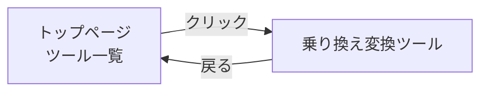

# Tools 要件定義書

---

## 1. ビジネス要件

### 1.1 背景・目的

**背景**:
- 日常的に使用する小さなツール (JSON整形、エンコード/デコード、乗り換え案内変換等) は多数存在するが、統合されたプラットフォームが必要
- 自分自身が最も使うツールから優先的に実装
- シンプルで使いやすいUIを重視

**目的**:
- 日常的に便利なツール群を一般公開し、誰でも無料で利用できるサービスとして提供
- 頻繁に使用する小さなツールを、統合されたプラットフォームとして提供
- モダンな技術スタック (Next.js, Material UI, AWS) を活用した実用的なWebアプリケーション

**プロジェクト情報**:
- プロジェクト名: Tools
- リポジトリ: nagiyu-platform (monorepo)
- 公開範囲: 一般公開 (インターネット経由でアクセス可能)

### 1.2 対象ユーザー

### 1.3 ビジネスゴール

1. **一般公開**: 誰でも無料でアクセスできるツール集として提供
2. **実用性**: 日常的に使いたいと思えるツール群の提供
3. **継続的な拡張**: 必要に応じて新しいツールを追加できる拡張可能な設計
4. **使いやすさ**: シンプルで直感的なUIによる高い利便性
5. **運用コスト補填**: Google AdSense による広告収益化（初期要件では考慮していなかったが、運用コストを賄うため導入）

**プライマリーユーザー**:
- **本人 (自分自身)**: 最も重要なユーザー
    - 日常的な作業で使用
    - 新しいツールの要件定義者

**セカンダリーユーザー**:
- **不特定多数の一般ユーザー**: インターネット経由でアクセスする全てのユーザー
    - 認証不要で誰でも利用可能
    - 開発者・非開発者を問わず利用可能
    - フィードバックは受け付けるが、個別要望には必ずしも対応しない

**ユーザー属性**:
- **技術レベル**: 特に制約なし (直感的に使えるUIを提供)
- **デバイス**: PC、タブレット、スマートフォン (PWA対応)
- **ブラウザ**: モダンブラウザ (Chrome、Firefox、Safari、Edge の最新版)

---

## 2. 機能要件

### 2.1 ユースケース

#### UC-001: 乗り換え情報を整形してコピーする

**概要**: ユーザーが乗り換え案内の情報を簡単に整形してコピーしたい

**アクター**: ユーザー

**前提条件**: ブラウザでToolsアプリにアクセス可能

**正常フロー**:
1. ユーザーがツール一覧から「乗り換え変換ツール」を選択
2. 乗り換え案内のテキストを入力フィールドに貼り付け
3. 「変換」ボタンをクリック
4. 整形された結果が画面に表示される
5. 「コピー」ボタンをクリック
6. クリップボードにテキストがコピーされる
7. 「コピーしました」のフィードバックが表示される

**代替フロー**:
- クリップボード読み取りボタンで自動取得
- 共有シート経由でのデータ受け取り（URLパラメータ）

**例外フロー**:
- 対応していない形式のテキストを入力した場合、エラーメッセージが表示される

**受入基準**:
- [ ] 乗り換え案内のテキストを入力できる
- [ ] パース結果が見やすい形式で表示される
- [ ] ワンクリックでクリップボードにコピーできる
- [ ] モバイル端末でも使いやすい

#### UC-002: 利用可能なツールを一覧で確認する

**概要**: 初めてのユーザーがどんなツールが利用できるか一目で確認したい

**アクター**: 初めてのユーザー

**前提条件**: Toolsアプリのトップページにアクセス

**正常フロー**:
1. ユーザーがToolsアプリのトップページにアクセス
2. ツール一覧がカード形式で表示される
3. クリックでツールページに遷移

**受入基準**:
- [ ] ツール一覧がカード形式で表示される
- [ ] 各ツールの説明が簡潔に記載されている
- [ ] クリックでツールページに遷移できる

#### UC-003: オフラインでもツールを使いたい

**概要**: モバイルユーザーがインターネット接続がない環境でもツールを使いたい

**アクター**: モバイルユーザー

**前提条件**: PWAとしてインストール済み

**正常フロー**:
1. ホーム画面からアイコンをタップして起動
2. オフラインでも基本的なツール（クライアント処理のみ）が動作

**受入基準**:
- [ ] PWAとしてホーム画面に追加できる
- [ ] オフラインでも基本的なツール (クライアント処理のみ) が動作する
- [ ] オンライン/オフライン状態が明確に表示される

#### UC-004: JSON を整形してコピーする

**概要**: ユーザーが JSON 文字列を見やすく整形してコピーしたい

**アクター**: ユーザー（開発者または一般ユーザー）

**前提条件**: ブラウザでToolsアプリにアクセス可能

**正常フロー**:
1. ユーザーがツール一覧から「JSON 整形ツール」を選択
2. JSON文字列を入力フィールドに貼り付け、またはクリップボード読み取りボタンで自動取得
3. 「整形」ボタンをクリック
4. 整形されたJSON（インデント2スペース）が出力エリアに表示される
5. 「コピー」ボタンをクリック
6. クリップボードに整形されたJSONがコピーされる
7. 「コピーしました」のフィードバックが表示される

**代替フロー**:
- 「圧縮」ボタンをクリックすると、1行に圧縮されたJSONが出力される
- 「クリア」ボタンをクリックすると、入力・出力がリセットされる

**例外フロー**:
- 無効なJSON文字列を入力した場合、エラーメッセージ（Snackbar）が表示される

**受入基準**:
- [ ] JSON文字列を入力できる
- [ ] 整形（Pretty Print）機能が動作する
- [ ] 圧縮（Minify）機能が動作する
- [ ] 無効なJSONの場合、エラーメッセージが表示される
- [ ] ワンクリックでクリップボードにコピーできる
- [ ] モバイル端末でも使いやすい

### 2.2 機能一覧

#### フェーズ1: 初期実装

| ID | 機能名 | 説明 | 優先度 |
|----|--------|------|--------|
| F-001 | 乗り換え変換ツール | 乗り換え情報をパースし、必要項目のみ抽出してクリップボードにコピー | 最高 |
| F-002 | ツール一覧ページ | 利用可能なツールの一覧を表示 | 高 |
| F-003 | 共通ヘッダー/フッター | 全ツール共通のナビゲーション | 高 |
| F-004 | レスポンシブデザイン | PC/タブレット/スマートフォンに対応 | 高 |
| F-005 | PWA対応 | オフライン利用、ホーム画面追加 | 中 |
| F-006 | 初回訪問ダイアログ | 旧バージョンからの移行案内ダイアログを初回訪問時に表示 | 中 |

#### フェーズ2: 拡張機能

| ID | 機能名 | 説明 | 優先度 |
|----|--------|------|--------|
| F-007 | Google AdSense 統合 | 広告収益化（本番環境のみ） | 中 |
| F-008 | JSON Formatter | JSONを整形、圧縮、検証 | 中 |

#### フェーズ3: 将来拡張 (将来実装)

| ID | 機能名 | 説明 | 優先度 |
|----|--------|------|--------|
| F-101 | Base64 Encoder/Decoder | Base64エンコード/デコード | 中 |
| F-102 | Hash Generator | MD5、SHA-256等のハッシュ生成 | 中 |
| F-103 | URL Encoder/Decoder | URLエンコード/デコード | 低 |
| F-104 | Timestamp Converter | Unix timestamp ⇔ 日時変換 | 低 |

### 2.2 各機能の詳細要件

#### F-001: 乗り換え変換ツール

**概要**
乗り換え案内のテキストを入力として受け取り、必要な情報 (出発地、到着地、時刻、乗り換え経路等) を抽出し、整形された形式でクリップボードにコピーする。

**入力**
- 乗り換え案内のテキスト
- クリップボードから直接読み取り (ブラウザのClipboard API使用)
- 共有シート経由でのデータ受け取り（URLパラメータ `?url=...` / `?text=...`）

**処理**
- テキストエリアに手動で貼り付け、またはクリップボード読み取りボタンで自動取得
- テキストをパース
- 必要な情報を抽出:
    - 日付
    - 出発地
    - 到着地
    - 出発時刻 / 到着時刻
    - 所要時間
    - 乗り換え回数
    - 運賃
    - 距離
    - 経路詳細 (駅名、時刻範囲、路線名、番線情報)

**出力**
- 整形されたテキスト形式 (Plain Text)
- ユーザーが選択した項目のみを出力（詳細表示トグル機能）
- クリップボードへの自動コピー
- 画面上でのプレビュー表示

**詳細表示トグル機能**
ユーザーがチェックボックスで出力項目を選択可能:
- ✅ 日付を表示
- ✅ 出発地・到着地を表示
- ✅ 出発時刻・到着時刻を表示
- ✅ 所要時間を表示
- ✅ 運賃を表示
- ✅ 乗換回数を表示
- ☐ 距離を表示
- ✅ ルート詳細を表示
  - ✅ 駅名を表示
  - ✅ 時刻範囲を表示
  - ✅ 路線名を表示
  - ☐ 番線情報を表示

設定はLocalStorageに保存し、次回訪問時も保持する。

**制約**
- 乗り換え案内サービスのフォーマット変更に依存する
- スクレイピングではなく、コピーされたテキスト情報のパース

**実装方針**
- フロントエンドのみで処理 (JavaScript)

---

#### F-002: ツール一覧ページ

**概要**
利用可能なツールをカード形式で一覧表示し、各ツールへのナビゲーションを提供。

**表示内容**
- ツール名
- 説明 (1〜2行)
- アイコン
- カテゴリタグ

**機能**
- カテゴリによるフィルタリング (将来実装)
- 検索機能 (将来実装)

---

#### F-003: 共通ヘッダー/フッター

**ヘッダー**
- アプリ名「Tools」を表示
- 現時点ではナビゲーションメニューなし (シンプルな構成)

**フッター**
- アプリケーションバージョン表示
- 将来実装予定のリンク (プライバシーポリシー、利用規約)

---

#### F-004: レスポンシブデザイン

**対応デバイス**
- デスクトップ (1920x1080以上)
- タブレット (768x1024程度)
- スマートフォン (375x667以上)

**実装方針**
- Material UIのBreakpointsを活用
- モバイルファーストデザイン

---

#### F-005: PWA対応

**機能**
- マニフェストファイルの提供
- Service Workerによるオフラインキャッシュ
- ホーム画面への追加
- Web Share Target API対応（共有シート対応）

**範囲**
- 静的アセット (HTML, CSS, JS) のキャッシュ
- オフラインでも基本的なツールは動作

**Web Share Target API（共有シート対応）**
- スマートフォンの共有メニューからToolsアプリを起動可能
- 受け取れるデータ:
    - テキスト（乗り換え案内のテキスト）
    - URL（乗り換え案内のURL）
- マニフェストファイルに `share_target` 設定を追加
- URLパラメータで受け取る:
    - `?text=...` - 共有されたテキスト
    - `?url=...` - 共有されたURL
- 各ツールページで `useSearchParams()` を使用してパラメータを読み取り

**実装順序**
1. PWA基本機能（マニフェスト、Service Worker）
2. Web Share Target API対応

---

#### F-006: 初回訪問ダイアログ

**概要**
ユーザーが初めてToolsアプリにアクセスした際に、旧バージョンからの移行案内を表示するダイアログを実装する。

**背景**
- 約1年前から同じドメインで旧バージョンのToolsアプリ (同名) を運用
- 新バージョンではPWAマニフェストや仕様が変更されている
- 旧バージョンをインストール済みのユーザーに、再インストールを促す必要がある

**表示条件**
- LocalStorageに初回訪問フラグ (`tools-migration-dialog-shown`) が存在しない場合
- すべてのページで表示される (RootLayout配下に実装)

**ダイアログ内容**
- **タイトル**: 「Toolsアプリが新しくなりました」
- **本文**:
    ```
    このアプリは以前のバージョンから大幅にアップデートされました。
    以前のバージョンをインストールされている方は、お手数ですが以下の手順で再インストールをお願いします。

    1. 旧バージョンのアプリをアンインストール
    2. このページから新バージョンを再インストール

    ※ データはすべて端末内に保存されており、外部に送信されることはありません。
    ```
- **UI要素**:
    - ✅ 「今後表示しない」チェックボックス (デフォルトでチェック済み)
    - 「閉じる」ボタン

**動作仕様**
1. 初回訪問時にダイアログを自動表示
2. 「閉じる」ボタンクリック時の挙動:
    - チェックボックスがON: LocalStorageにフラグを保存し、次回以降表示しない
    - チェックボックスがOFF: フラグを保存せず、次回訪問時も表示する
3. 背景クリックではダイアログを閉じない (明示的な「閉じる」操作を要求)

**LocalStorage仕様**
- **キー**: `tools-migration-dialog-shown`
- **値**: `true` (文字列または真偽値)
- **保存タイミング**: 「今後表示しない」がONの状態で「閉じる」をクリックしたとき

**実装方針**
- Material UIの`Dialog`コンポーネントを使用
- Client Componentとして実装 (`src/components/dialogs/MigrationDialog.tsx`)
- `ThemeRegistry`コンポーネント内に配置し、全ページで表示可能にする
- LocalStorageアクセスは`useEffect`で初回レンダリング時に実行
- プライベートモードなどLocalStorageが使用できない環境でもエラーを起こさない

**制約事項**:
- LocalStorageが無効化されている環境では、毎回ダイアログが表示される
- ブラウザのキャッシュクリア時にフラグもクリアされる

---

#### F-007: Google AdSense 統合

**概要**: Toolsアプリに Google AdSense を統合し、広告収益化を実現する。ルートドメイン (`nagiyu.com`) およびサブドメイン (`tools.nagiyu.com`) の両方で広告を表示する。

**背景**:
- 初期要件では収益化を考慮していなかったが、運用コストを賄うため広告収益化を導入
- ルートドメインで ECS 展開されているため、AdSense の審査要件を満たしている
- プライバシーポリシーと利用規約は既に実装済み

**ads.txt の配置**:
- ファイルパス: `services/tools/public/ads.txt`
- アクセスURL: `https://nagiyu.com/ads.txt`
- 内容: `google.com, pub-6784165593921713, DIRECT, f08c47fec0942fa0`

**AdSense スクリプトの統合**:
- 配置場所: `services/tools/src/app/layout.tsx` の `<head>` タグ内
- 表示条件: 本番環境のみ (`NODE_ENV === 'production'`)

**広告タイプ**: 自動広告（手動配置よりも最適化され、メンテナンスコストが低い）

**制約**:
- Google AdSense のポリシー準拠が必要
- 広告表示によりページ読み込み速度が低下する可能性
- トラフィック量に依存するため、収益は保証されない

**実装順序**:
1. ads.txt ファイルの作成
2. AdSense スクリプトの統合
3. ビルド & デプロイ
4. AdSense サイト登録 & 審査申請
5. 審査通過後、広告表示開始

**実装方針**:
- 本番環境のみで広告を表示
- パフォーマンスへの影響を最小限に抑える (`strategy="afterInteractive"`)

---

#### F-008: JSON Formatter

**概要**
JSON文字列の整形（Pretty Print）、圧縮（Minify）、検証（Validation）を行うツール。

**入力**
- JSON文字列
- テキストエリアに手動で貼り付け
- クリップボードから直接読み取り（Clipboard API使用）

**処理**
- **整形（Pretty Print）**: JSON を見やすい形式で整形（インデント2スペース固定）
- **圧縮（Minify）**: JSON を1行に圧縮（空白・改行を削除）
- **検証（Validation）**: JSON として有効かどうかを判定

**出力**
- 整形されたJSON文字列
- 圧縮されたJSON文字列
- 画面上でのプレビュー表示
- クリップボードへの自動コピー

**UI要素**
- 入力テキストエリア（textarea）
- クリップボード読み取りボタン
- 「整形」ボタン
- 「圧縮」ボタン
- 「クリア」ボタン
- 出力テキストエリア（読み取り専用）
- コピーボタン
- エラー表示（Snackbar）

**制約**
- インデント幅は2スペース固定
- キーのソート機能なし（将来検討）
- シンタックスハイライトなし（将来検討）
- ファイルアップロード/ダウンロードなし（将来検討）
- リアルタイム変換なし（ボタン押下でのみ変換）

**実装方針**
- フロントエンドのみで処理（JavaScript）
- `JSON.parse()` と `JSON.stringify()` を使用
- エラーハンドリング: JSON.parse() の例外をキャッチしてエラー表示

---

**実装順序**: ユーザーフィードバックや自身のニーズに応じて、追加ツールを優先順位付け。各ツールは独立して実装可能な設計。

#### E2Eテスト対象
- **乗り換え変換ツールの主要ユーザーフロー**
    - 入力 → 変換 → コピーの基本操作
    - クリップボード読み取り機能
    - クリップボード書き込み機能
- **Web Share Target機能**
    - URLパラメータ経由でのデータ受信（`?url=...`, `?text=...`）
    - 入力欄への自動挿入
    - URLパラメータのクリーンアップ
- **表示設定の永続化**
    - LocalStorageへの設定保存
    - ページリロード後の設定復元
- **初回訪問ダイアログ機能**
    - 初回訪問時のダイアログ自動表示
    - 「今後表示しない」チェックボックスの動作 (ON/OFF)
    - 「閉じる」ボタンによるダイアログクローズ
    - LocalStorageへのフラグ保存と読み込み
    - 2回目以降の訪問時の表示制御
- **エラーハンドリング**
    - 無効な入力形式
    - 空入力
    - パース失敗時のエラー表示
- **PWA機能**
    - オフライン動作（Service Worker）
    - マニフェスト読み込み
- **レスポンシブ表示**
    - モバイル表示
    - デスクトップ表示

#### テスト環境
- **ブラウザ**: Chromium（デスクトップ/モバイル）、Safari（モバイル）
- **フレームワーク**: Playwright
- **アクセシビリティ**: @axe-core/playwright による WCAG 2.1 Level AA 準拠確認

#### テストカバレッジ目標
- 主要ユーザーフローの100%カバー
- 単体テスト: lib/parsers, lib/formatters, lib/clipboard
- E2Eテスト: ページ遷移、ユーザー操作、エラーシナリオ

---

### 2.4 優先順位

#### フェーズ1の実装順序

1. **F-002: ツール一覧ページ** - まず全体の枠組みを作成
2. **F-003: 共通ヘッダー/フッター** - 基本レイアウトの確立
3. **F-001: 乗り換え変換ツール** - 最優先の機能実装
4. **F-004: レスポンシブデザイン** - 全ページに適用
5. **F-005: PWA対応** - 最後に追加機能として実装

#### フェーズ2以降

- ユーザーフィードバックや自身のニーズに応じて、追加ツールを優先順位付け
- 各ツールは独立して実装可能な設計

---

## 3. 非機能要件

### 3.1 パフォーマンス要件

| 項目 | 要件 |
|------|------|
| ページ初回ロード | 3秒以内（目標） |
| ツール処理 | 1秒以内（一般的なサイズのデータ） |
| ページ遷移 | 0.5秒以内 |
| 同時接続ユーザー数 | 初期は100ユーザー程度を想定 |
| データサイズ制限 | 10MB以内（ブラウザのメモリ制限を考慮） |

**スケーラビリティ**: CloudFrontのキャッシュやLambdaのスケーリングで対応

**備考**: 現時点では性能面の厳密な要求はなし。実運用で問題が発生した場合に最適化を検討。

### 3.2 セキュリティ要件
- ユーザー認証: 不要 (全機能を認証なしで提供)
- ユーザーデータ: サーバーに保存しない (処理はクライアント側またはステートレス)
- 個人情報: 取り扱わない

**セキュリティ対策**:
- HTTPS通信 (CloudFront + ACM)
- CSP (Content Security Policy) ヘッダーの設定
- XSS対策 (Reactのデフォルトのエスケープ処理に依存)
- CORS設定 (必要に応じて)

**データの取り扱い**:
- 入力データはブラウザ内で処理 (サーバーに送信しない方針)
- バックエンドAPIを使用する場合も、ログには機密情報を含めない

**備考**: 機密データを扱うツールは現時点で想定していない。

### 3.3 可用性要件

| 項目 | 要件 |
|------|------|
| 稼働率 | 99%以上（ベストエフォート） |
| RTO (復旧目標時間) | 24時間以内（ベストエフォート） |
| RPO (復旧目標時点) | N/A (ユーザーデータをサーバーに保存しない) |

**障害対応**:
- 障害検知: CloudWatch Alarmsで監視
- 復旧時間: 24時間以内 (ベストエフォート)

**備考**: 一般公開サービスだが、SLAは保証しない。メンテナンス時間は事前通知なしで実施可能（個人プロジェクトのため）。

### 3.4 保守性・拡張性要件
- TypeScriptによる型安全性
- ESLint, Prettierによるコード規約の統一
- ユニットテスト (重要な処理のみ)

**ドキュメント**:
- 本ドキュメント (要件定義、設計書) の維持
- コード内のコメント (複雑なロジックのみ)

**拡張性**:
- 新しいツールを追加しやすい設計
- コンポーネントの再利用性

**スケーラビリティ**:
- CloudFrontによるコンテンツ配信
- Next.jsのServer Side Rendering (SSR) を活用
- APIはLambdaでステートレスに実装
- 将来的にデータベースが必要になった場合はDynamoDBを検討

---

## 4. UI/UX 要件

### 4.1 画面一覧

| 画面名 | パス | 説明 | 優先度 |
|--------|------|------|--------|
| ツール一覧ページ | `/` | 利用可能なツールの一覧を表示 | 高 |
| 乗り換え変換ツール | `/transit-converter` | 乗り換え情報を変換してクリップボードにコピー | 最高 |
| JSON 整形ツール | `/json-formatter` | JSON を整形、圧縮、検証 | 中 |

### 4.2 画面遷移図



### 4.3 主要画面の UI 要件

#### トップページ (ツール一覧)

**概要**: 利用可能なツールをカード形式で一覧表示し、各ツールへのナビゲーションを提供

**主要UI要素**:
- ヘッダー: アプリ名「Tools」(中央揃え)
- メインコンテンツ: ツールカード一覧 (Grid レイアウト)
- フッター: バージョン表示、プライバシーポリシー、利用規約

**インタラクション**:
- カードクリックでツールページに遷移

**レイアウト**:
- PC: 3カラム
- タブレット: 2カラム
- スマートフォン: 1カラム

#### 乗り換え変換ツール

**概要**: 乗り換え案内のテキストを入力として受け取り、整形された形式でクリップボードにコピー

**主要UI要素**:
- ヘッダー: 共通
- 入力エリア: テキストフィールド (URLまたはテキスト貼り付け)
- クリップボード読み取りボタン (Clipboard API使用)
- 変換ボタン
- 詳細表示トグル: チェックボックスで出力項目を選択可能
- 出力エリア: 整形された結果表示
- コピーボタン
- フッター: 共通

**インタラクション**:
- 変換ボタンクリックでパース結果を表示
- コピーボタンクリックでクリップボードにコピー
- 詳細表示トグルで出力項目を切り替え（LocalStorageに保存）

**表示条件**: パース結果が正常に取得された場合のみ出力エリアを表示

#### JSON 整形ツール

**概要**: JSON文字列を整形、圧縮、検証するツール

**レイアウト方針**: 乗り換え変換ツールと統一した縦並びレイアウト

**主要UI要素**:
- ヘッダー: 共通
- 入力エリア: テキストエリア（textarea）
- クリップボード読み取りボタン（Clipboard API使用）
- アクションボタン:
  - 「整形」ボタン
  - 「圧縮」ボタン
  - 「クリア」ボタン
- 出力エリア: 整形/圧縮された結果表示（読み取り専用 textarea）
- コピーボタン
- エラー表示: Snackbar
- フッター: 共通

**インタラクション**:
- 整形ボタンクリックで整形されたJSONを出力エリアに表示
- 圧縮ボタンクリックで圧縮されたJSONを出力エリアに表示
- コピーボタンクリックでクリップボードにコピー
- クリアボタンクリックで入力・出力をリセット
- 無効なJSON入力時にエラーメッセージ（Snackbar）を表示

**表示条件**: 出力エリアは常に表示（変換結果がある場合のみ内容を表示）

### 4.4 レスポンシブ対応要件

| デバイス | 対応要件 |
|---------|---------|
| デスクトップ | 1920x1080以上、3カラムレイアウト |
| タブレット | 768x1024程度、2カラムレイアウト |
| モバイル | 375x667以上、1カラムレイアウト |

**実装方針**: Material UIのBreakpointsを活用、モバイルファーストデザイン

### 4.5 アクセシビリティ要件

- **WCAG 準拠レベル**: AA
- **キーボード操作**: すべての機能がキーボードで操作可能
- **スクリーンリーダー対応**: @axe-core/playwright による検証
- **カラーコントラスト**: WCAG 2.1 Level AA 準拠

### 4.6 UI/UX ガイドライン

- **デザインシステム**: Material-UI (MUI) v6.x
- **カラーパレット**: プライマリカラー #1976d2（青）
- **タイポグラフィ**: システムフォント（Geist フォントは削除済み）
- **スペーシング**: Material-UI のデフォルトスペーシング（8pxグリッド）

### 4.7 詳細 UI 設計ドキュメント

現時点では詳細UI設計ドキュメントは不要。将来的にUI が複雑化した場合に作成を検討。

---

## 5. スコープ外

以下は意図的にサポートしない、または現時点で実装しない機能です:

- ❌ **ユーザー認証・認可**: 全機能を認証なしで提供
- ❌ **ユーザーデータのサーバー保存**: 処理はクライアント側またはステートレス
- ❌ **多言語対応**: 日本語のみ
- ❌ **IE11等のレガシーブラウザ対応**: モダンブラウザのみ対応
- ❌ **複雑なデータ分析機能**: シンプルなツール群に限定
- ❌ **リアルタイム通信**: WebSocket等は使用しない

---

## 6. 用語集

| 用語 | 定義 |
|------|------|
| PWA | Progressive Web App。ホーム画面への追加、オフライン動作が可能なWebアプリ |
| SSR | Server Side Rendering。Next.jsによるサーバーサイドレンダリング |
| Lambda | AWS Lambda。サーバーレスコンピューティングサービス |
| CloudFront | AWS CloudFront。CDNサービス |
| ACM | AWS Certificate Manager。SSL/TLS証明書管理サービス |
| Material-UI (MUI) | React用のUIコンポーネントライブラリ |
| AdSense | Google AdSense。Webサイトに広告を表示し収益化するサービス |
