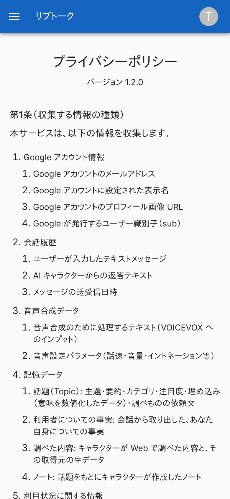
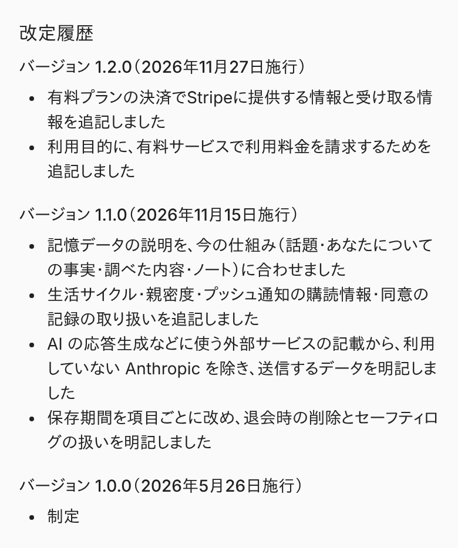
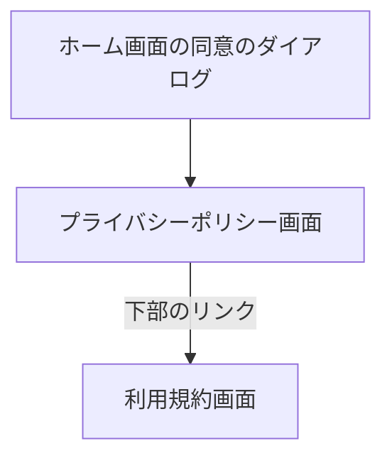

# プライバシーポリシー画面

リブトークのプライバシーポリシーを載せた公開ページ。

## 入口

- パスは `/legal/privacy`。ログインなしで開ける (ミドルウェアが `/legal/` 配下を通す)
- ホーム画面の同意のダイアログのリンク (別のタブで開く) から来る。もう一方のページの下部のリンクからも来る

## 表示するもの

- 見出し「プライバシーポリシー」と「バージョン 1.1.0」
- 条文。プライバシーポリシーは 9 条 (収集する情報の種類、情報の利用目的、情報の保管・削除、外部サービスの利用、セーフティログの取り扱い、ユーザーの権利、Cookie・セッション情報の取り扱い、個人情報保護法への準拠、プライバシーポリシーの変更)。条番号は並び順で振る
- 条文の後に「改定履歴」。版ごとに「バージョン {版}({施行日}施行)」と改定の要点の箇条書きを、新しい版を上にして並べる。初版は「制定」の 1 行。ホーム画面の改定のお知らせと同じデータから出す。条番号は振らない
- 下部に、利用規約へのリンク「利用規約を見る」
- ホーム画面を含む全画面のフッターのリンクは、同じ内容を、このページへ移らずダイアログで開く

## 操作

| 操作 | 結果 |
|---|---|
| 「利用規約を見る」 | [利用規約画面](./terms.md)を開く |

- 改定履歴の最新の版は、同意で保存する版と同じ値
- バージョンは、[同意](../term/consent.md)で保存する版と同じ値

## 画面の見た目

### 通常表示

画面の上部。本文は長く、条文が続く。

| スマホ |
|---|
|  |

### 改定履歴

条文の末尾。

| スマホ |
|---|
|  |

## つながり

```mermaid
flowchart TD
    C[ホーム画面の同意のダイアログ] --> S[プライバシーポリシー画面]
    S -->|下部のリンク| O[利用規約画面]
```
