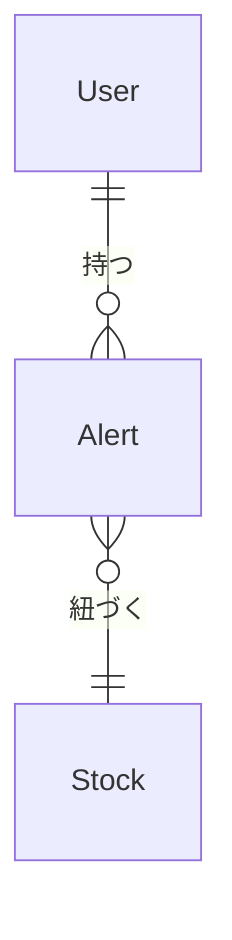

# {service-name} 外部設計書

<!--
    外部設計フェーズの成果物です。
    「何を作るか」ではなく「どんな UI・データ構造にするか・なぜか」を定義します。

    - コードを読めばわかる実装詳細は書かない
    - 「なぜこの画面構成・データ構造にしたか」の判断根拠を残す
    - 実装詳細（型定義・DB スキーマ・コンポーネント設計）は tasks/design.md に記述する

    入力: docs/services/{service}/requirements.md
    次に作成するドキュメント: docs/services/{service}/architecture.md
-->

## 1. 画面設計

### 1.1 画面一覧

| 画面 ID | 画面名 | パス | 対応ユースケース | 優先度 |
|--------|--------|------|--------------|-------|
| SCR-001 | {画面名} | /{path} | UC-001 | 高 |

### 1.2 画面遷移図

```mermaid
graph LR
    A[{画面名}] -->|{操作}| B[{画面名}]
    B -->|{操作}| C[{画面名}]
```

### 1.3 主要画面の設計

<!-- 重要な画面について記述する。すべての画面を書く必要はない。 -->

#### SCR-001: {画面名}

**概要**

<!-- この画面の目的と役割を 1〜2 文で記述する -->

**主要 UI 要素**

| 要素 | 種別 | 説明 |
|-----|------|------|
| {要素名} | ボタン / 入力 / リスト / ... | ... |

**ユーザーインタラクション**

| 操作 | 結果 |
|------|------|
| {操作} | {結果} |

**表示条件・状態**

<!-- ローディング・エラー・空状態など -->

- ローディング: ...
- エラー: ...
- 空状態: ...

### 1.4 レスポンシブ方針

<!-- モバイル・デスクトップ・タブレットへの対応方針 -->

- モバイル（スマートフォン）: ...
- デスクトップ: ...

### 1.5 アクセシビリティ方針

<!-- WCAG 準拠レベル・主要な配慮事項 -->

- ...

---

## 2. 概念データモデル

<!--
    ドメインオブジェクト間の関係を図示する。
    型定義・DB スキーマには言及しない（実装非依存）。
-->

### 2.1 主要エンティティ一覧

| エンティティ | 説明 | 主要な属性（概念レベル） |
|------------|------|-------------------|
| {エンティティ名} | ... | 名前、作成日時、... |

### 2.2 エンティティ関係図



---

## 3. 設計上の決定事項（ADR）

<!--
    この設計フェーズで行った重要な判断を記録する。
    「なぜそうしたか」を将来の自分・チームに伝えるために残す。
    小規模な変更では空でもよい。
-->

### ADR-001: {決定事項のタイトル}

**背景・問題**

<!-- どんな状況でこの決定が必要だったか -->

**決定**

<!-- 何を選んだか -->

**根拠・トレードオフ**

<!-- なぜそれを選んだか。他の選択肢と比べて何を犠牲にしたか -->
