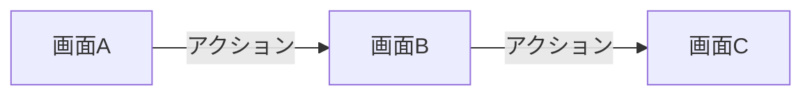

# {service-name} 要件定義書

<!-- 記入ガイド: サービス名を記述してください（例: Tools、codec-converter） -->

---

## 1. ビジネス要件

<!-- 記入ガイド: このサービスが解決するビジネス課題、提供する価値を記述してください -->

### 1.1 背景・目的

<!-- 記入ガイド: サービス開発の背景と目的を記述してください -->
<!-- 記入例: どのような課題があり、なぜこのサービスが必要か -->

### 1.2 対象ユーザー

<!-- 記入ガイド: 想定ユーザー層を記述してください（例: 一般ユーザー、管理者、開発者など） -->
<!-- 記入例: プライマリーユーザー、セカンダリーユーザーを明確に区別 -->

### 1.3 ビジネスゴール

<!-- 記入ガイド: 達成したいビジネス目標を記述してください -->
<!-- 記入例: 数値目標、定性的な目標、優先順位などを含める -->

---

## 2. 機能要件

<!-- 記入ガイド: サービスが提供する具体的な機能を記述してください -->

### 2.1 ユースケース

<!-- 記入ガイド: 主要なユースケースを記述してください -->

#### UC-001: {ユースケース名}

<!-- 記入ガイド: ユースケースごとに記述してください -->

- **概要**: {概要}
- **アクター**: {アクター}
- **前提条件**: {前提条件}
- **正常フロー**:
  1. {ステップ1}
  2. {ステップ2}
  3. {ステップ3}
- **代替フロー**: {代替フロー}
- **例外フロー**: {例外フロー}

### 2.2 機能一覧

<!-- 記入ガイド: 機能を表形式で一覧化してください -->
<!-- 記入例: 機能ID、機能名、説明、優先度を明記 -->

| 機能ID | 機能名   | 説明   | 優先度   |
| ------ | -------- | ------ | -------- |
| F-001  | {機能名} | {説明} | 高/中/低 |
| F-002  | {機能名} | {説明} | 高/中/低 |

---

## 3. 非機能要件

<!-- 記入ガイド: パフォーマンス、セキュリティ、可用性などの要件を記述してください -->

### 3.1 パフォーマンス要件

<!-- 記入ガイド: 応答時間、スループット、同時接続数などを記述してください -->

| 項目         | 要件   |
| ------------ | ------ |
| 応答時間     | {要件} |
| スループット | {要件} |
| 同時接続数   | {要件} |

### 3.2 セキュリティ要件

<!-- 記入ガイド: 認証、認可、データ保護などを記述してください -->
<!-- 記入例: 認証方式、暗号化、アクセス制御、セキュリティ対策 -->

### 3.3 可用性要件

<!-- 記入ガイド: 稼働率、復旧時間などを記述してください -->

| 項目               | 要件   |
| ------------------ | ------ |
| 稼働率             | {要件} |
| RTO (復旧目標時間) | {要件} |
| RPO (復旧目標時点) | {要件} |

### 3.4 保守性・拡張性要件

<!-- 記入ガイド: メンテナンス性、将来の拡張性に関する要件を記述してください -->
<!-- 記入例: コード品質、ドキュメント、モジュール化、拡張ポイント -->

### 3.5 その他の非機能要件

<!-- [任意] -->
<!-- 記入ガイド: 上記に該当しない非機能要件があれば記述してください -->
<!-- 記入例: スケーラビリティ、移植性、互換性、国際化など -->

---

## 4. UI/UX 要件

<!-- 記入ガイド: サービスのUI/UX要件を記述してください -->
<!-- 記入ガイド: 複雑なUIの場合は、サービス固有ドキュメント (ui-design.md) に詳細を記述し、ここからリンクしてください -->

### 4.1 画面一覧

<!-- 記入ガイド: サービスで提供する画面を表形式で記述してください -->

| 画面名   | パス     | 説明   | 優先度   |
| -------- | -------- | ------ | -------- |
| {画面名} | `{path}` | {説明} | 高/中/低 |

### 4.2 画面遷移図

<!-- 記入ガイド: Mermaid で画面遷移を記述してください -->

<!-- Draw.io を使用する場合は、上記 Mermaid を以下の形式に置き換えてください -->
<!--  -->

### 4.3 主要画面の UI 要件

<!-- 記入ガイド: 各画面の UI 要件を記述してください -->
<!-- 記入ガイド: 詳細な仕様（ワイヤーフレーム、コンポーネント詳細など）は ui-design.md に記述し、ここでは基本要件のみ記述 -->

#### 画面A

**概要**: {画面の概要}

**主要UI要素**:

- {UI要素1}: {説明}
- {UI要素2}: {説明}

**インタラクション**:

- {インタラクション1}: {説明}
- {インタラクション2}: {説明}

**表示条件**: {表示条件がある場合}

### 4.4 レスポンシブ対応要件

<!-- 記入ガイド: デスクトップ・モバイル対応の要件を記述してください -->

| デバイス     | 対応要件 |
| ------------ | -------- |
| デスクトップ | {要件}   |
| タブレット   | {要件}   |
| モバイル     | {要件}   |

### 4.5 アクセシビリティ要件

<!-- 記入ガイド: アクセシビリティ要件を記述してください -->

- **WCAG 準拠レベル**: {AA / AAA}
- **キーボード操作**: {要件}
- **スクリーンリーダー対応**: {要件}
- **カラーコントラスト**: {要件}

### 4.6 UI/UX ガイドライン

<!-- 記入ガイド: サービス固有の UI/UX ガイドラインを記述してください -->
<!-- 記入例: デザインシステム、カラーパレット、タイポグラフィ、スペーシングルールなど -->

- **デザインシステム**: {使用するデザインシステム（例: Material-UI、共通UIライブラリ `@nagiyu/ui` など）}
- **カラーパレット**: {カラー仕様}
- **タイポグラフィ**: {フォント仕様}

### 4.7 詳細 UI 設計ドキュメント

<!-- [任意] 複雑な UI の場合のみ -->
<!-- 記入ガイド: 詳細な UI 設計が必要な場合、サービス固有ドキュメントへのリンクを記述してください -->

詳細な UI 設計（ワイヤーフレーム、コンポーネント詳細、状態遷移など）は以下のドキュメントを参照してください:

- [UI 設計書 (ui-design.md)](./ui-design.md)

---

## 5. スコープ外

<!-- 記入ガイド: 意図的にサポートしない機能、または現時点で実装しない機能を記述してください -->
<!-- 記入例: 明確に「やらないこと」を定義することで、実装範囲を限定し、将来的な拡張方針を示す -->

- ❌ {スコープ外の機能1}
- ❌ {スコープ外の機能2}
- ❌ {スコープ外の機能3}

---

## 6. 用語集

<!-- [任意] -->
<!-- 記入ガイド: サービス固有の用語や略語を定義してください -->

| 用語   | 定義   |
| ------ | ------ |
| {用語} | {定義} |
