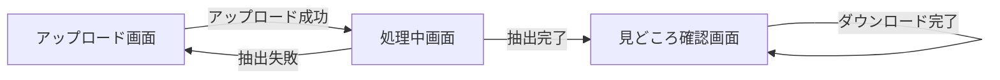
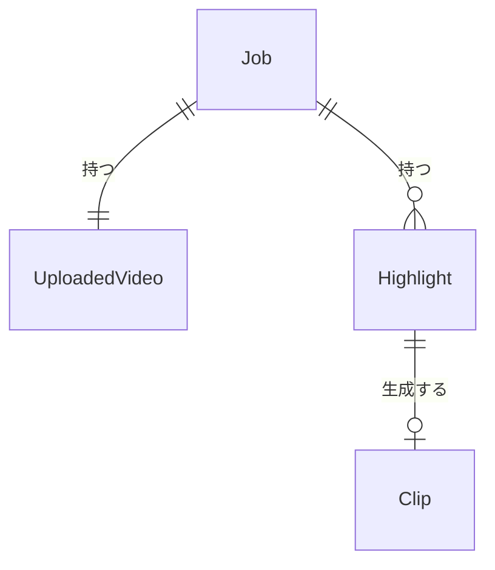

<!--
    このドキュメントは開発時のみ使用します。
    開発完了後に docs/services/quick-clip/external-design.md に統合して削除します。
-->

# さくっとクリップ (QuickClip) 外部設計書

---

## 1. 画面設計

### 1.1 画面一覧

| 画面 ID | 画面名 | パス | 対応ユースケース | 優先度 |
|--------|--------|------|--------------|-------|
| SCR-001 | アップロード画面 | / | UC-001 | 高 |
| SCR-002 | 処理中画面 | /jobs/{jobId} | UC-001 | 高 |
| SCR-003 | 見どころ確認画面 | /jobs/{jobId}/highlights | UC-002, UC-003 | 高 |

### 1.2 画面遷移図

### 1.3 主要画面の設計

#### SCR-001: アップロード画面

**概要**

動画ファイルを選択・アップロードして処理ジョブを開始する画面。

**主要 UI 要素**

| 要素 | 種別 | 説明 |
|-----|------|------|
| ファイル選択エリア | ドロップゾーン | ドラッグ&ドロップまたはクリックでファイルを選択 |
| アップロードボタン | ボタン | ファイル選択後に有効化される |
| エラーメッセージ | テキスト | ファイル検証エラー時に表示 |

**ユーザーインタラクション**

| 操作 | 結果 |
|------|------|
| ファイルをドロップ or クリックで選択 | ファイル名・サイズが表示され、アップロードボタンが有効化される |
| アップロードボタンをクリック | アップロード開始、完了後に SCR-002 へ遷移 |
| 非対応形式・サイズ超過のファイルを選択 | エラーメッセージを表示し、アップロードを無効化 |

**表示条件・状態**

- ローディング: アップロード中はプログレス表示（<!-- TODO: プログレスバーの仕様を確認 -->）
- エラー: バリデーションエラーメッセージをファイル選択エリア近くに表示
- 空状態: ファイル未選択時はアップロードボタンを無効化

---

#### SCR-002: 処理中画面

**概要**

見どころ抽出処理の進行状況を表示する画面。

**主要 UI 要素**

| 要素 | 種別 | 説明 |
|-----|------|------|
| ステータス表示 | テキスト | PENDING / PROCESSING / COMPLETED / FAILED |
| ステータス更新ボタン | ボタン | 手動でステータスを再取得する <!-- TODO: 自動ポーリングの要否を確認 --> |
| エラーメッセージ | テキスト | FAILED 時のみ表示 |

**ユーザーインタラクション**

| 操作 | 結果 |
|------|------|
| ステータス更新ボタンをクリック | 最新のジョブステータスを取得して表示 |
| COMPLETED 状態で確認ボタンをクリック | SCR-003 へ遷移 |

**表示条件・状態**

- PENDING: 「処理待ち」を表示
- PROCESSING: 「処理中」を表示
- COMPLETED: 「処理完了」を表示し、見どころ確認画面へのボタンを表示
- FAILED: 「処理失敗」とエラーメッセージを表示し、再アップロードへのリンクを表示

---

#### SCR-003: 見どころ確認画面

**概要**

抽出された見どころの一覧を表示し、プレビュー・採否チェック・時間調整・ダウンロードを行う画面。

**主要 UI 要素**

| 要素 | 種別 | 説明 |
|-----|------|------|
| 見どころ一覧 | リスト | 抽出された見どころの番号・開始〜終了時刻・採否状態を一覧表示 |
| 動画プレビュー | 動画プレイヤー | 選択した見どころの区間を再生 |
| 採否チェックボックス | チェックボックス | 「使える/使えない」を選択 |
| 開始時刻調整 | 入力 | 見どころの開始時刻を前後に調整 |
| 終了時刻調整 | 入力 | 見どころの終了時刻を前後に調整 |
| ダウンロードボタン | ボタン | 採用した見どころをZIPでダウンロード |

**ユーザーインタラクション**

| 操作 | 結果 |
|------|------|
| 見どころをクリック | 対応する動画区間がプレビューに表示される |
| 採否チェックを変更 | 採否状態が更新される（選択中の見どころ数がカウント表示される） |
| 開始・終了時刻を調整 | プレビューが調整後の区間で再生される |
| ダウンロードボタンをクリック | 採用した見どころを分割クリップとしてZIPダウンロード開始 |

**表示条件・状態**

- ローディング: 見どころ一覧取得中はスケルトン表示
- 空状態: 見どころが0件の場合「見どころが検出されませんでした」を表示
- ダウンロード中: ダウンロードボタンを無効化し、処理中を示すインジケーターを表示
- 採用0件: ダウンロードボタンを無効化

### 1.4 レスポンシブ方針

<!-- TODO: スマートフォン対応の要否・優先度を確認 -->

- モバイル（スマートフォン）: 動画プレビューの扱いを要確認
- デスクトップ: 見どころ一覧と動画プレビューを並列表示

### 1.5 アクセシビリティ方針

- キーボードナビゲーションで見どころ一覧を操作できる
- 動画プレビューには適切な `aria-label` を付与する

---

## 2. 概念データモデル

### 2.1 主要エンティティ一覧

| エンティティ | 説明 | 主要な属性（概念レベル） |
|------------|------|-------------------|
| Job | 動画処理ジョブ | ジョブID、ステータス、作成日時、有効期限 |
| UploadedVideo | アップロード済み動画 | ファイル名、ファイルサイズ、形式、保存パス |
| Highlight | 見どころ区間 | 開始時刻、終了時刻、採否ステータス、順序番号 |
| Clip | 分割クリップ | 対応するHighlight、ファイルパス |

### 2.2 エンティティ関係図

---

## 3. 設計上の決定事項（ADR）

### ADR-001: 見どころ抽出アルゴリズムの初期方針

**背景・問題**

Phase 1 では AI 非依存で動作する見どころ抽出が必要。

**決定**

動画フレームの変化量（ピクセル差分）と音量の大きさを組み合わせた機械的手法でスコアリングし、閾値を超えた区間を見どころとして抽出する。

**根拠・トレードオフ**

- AI不使用のため実装コストが低く、処理速度が速い
- 意味的な見どころは検出できないが、Phase 2 の AI 統合で補完する方針

<!-- TODO: 具体的なアルゴリズムや閾値の設定方針を確認 -->
