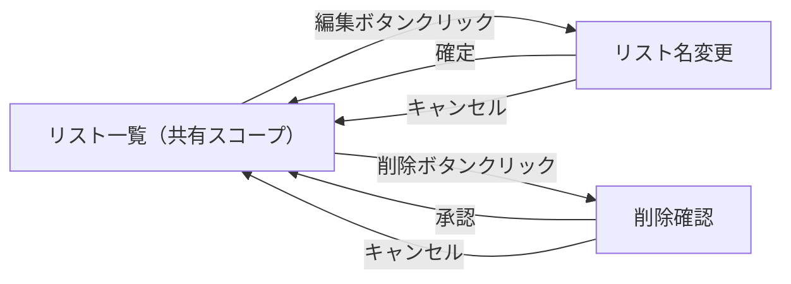
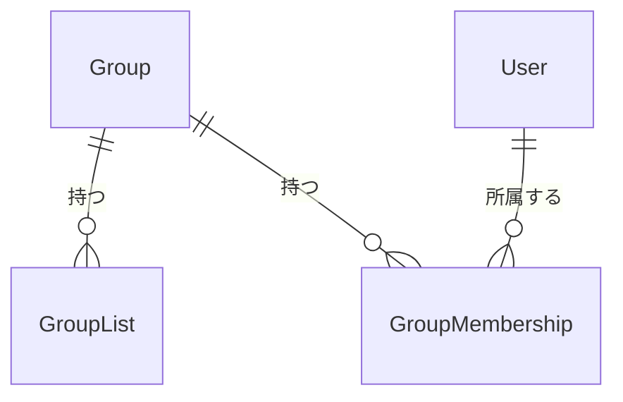

<!--
    このドキュメントは開発時のみ使用します。
    開発完了後に docs/services/share-together/external-design.md に統合して削除します。
-->

# Share Together - 共有リスト編集機能 外部設計書

---

## 1. 画面設計

### 1.1 画面一覧

| 画面 ID | 画面名 | パス | 対応ユースケース | 優先度 |
|--------|--------|------|--------------|-------|
| SCR-001 | リスト一覧（共有スコープ） | /lists | UC-001, UC-002 | 高 |

### 1.2 画面遷移図

### 1.3 主要画面の設計

#### SCR-001: リスト一覧（共有スコープ）サイドバー

**概要**

`ListWorkspace` のサイドバー部分。共有スコープ選択時に、各共有リストに編集・削除アイコンボタンを追加表示する。

**主要 UI 要素**

| 要素 | 種別 | 説明 |
|-----|------|------|
| 編集ボタン（鉛筆アイコン） | IconButton | 共有リストの名前変更ダイアログを開く |
| 削除ボタン（ゴミ箱アイコン） | IconButton | 削除確認後、共有リストを削除する |
| スナックバー | Snackbar | 操作の成功・失敗をユーザーに通知する |

**ユーザーインタラクション**

| 操作 | 結果 |
|------|------|
| 編集ボタンをクリック | リスト名入力プロンプトが表示され、確定するとリスト名が更新される |
| 削除ボタンをクリック | 確認ダイアログが表示され、承認するとリストが削除される |
| 削除後に他のリストが存在する | 先頭のリストに自動遷移する |
| 削除後にリストが0件になる | リスト未選択状態になる |

**表示条件・状態**

- 共有スコープ選択時のみ編集・削除ボタンを表示する
- 個人スコープではボタンを非表示にする（既存の挙動を維持）

### 1.4 レスポンシブ方針

- モバイル（スマートフォン）: 既存の `ListSidebar` の縦積みレイアウトを踏襲する
- デスクトップ: サイドバー幅内に収まるよう、アイコンボタンを小サイズで配置する

### 1.5 アクセシビリティ方針

- アイコンボタンには `aria-label` を付与する（例: `「{リスト名}」を編集`, `「{リスト名}」を削除`）

---

## 2. 概念データモデル

### 2.1 主要エンティティ一覧

| エンティティ | 説明 | 主要な属性（概念レベル） |
|------------|------|-------------------|
| GroupList | グループに紐づく共有 ToDo リスト | リスト名、グループID、作成日時 |
| GroupMembership | ユーザーとグループの紐付け | ユーザーID、グループID、ステータス |

### 2.2 エンティティ関係図

---

## 3. 設計上の決定事項（ADR）

### ADR-001: 共有リスト編集の権限を全承認済みメンバーに付与する

**背景・問題**

共有リストの編集・削除を許可する対象をオーナーに限定するか、全メンバーに開放するかを決定する必要がある。

**決定**

全承認済みメンバー（`status = ACCEPTED`）が編集・削除を実行できる。

**根拠・トレードオフ**

- 既存の API `PUT/DELETE /api/groups/{groupId}/lists/{listId}` はメンバーシップが `ACCEPTED` であれば許可する仕様であり、API 側の変更が不要
- 細粒度のロール管理は将来拡張（`docs/services/share-together/README.md` 将来拡張予定）として定義済みであり、MVP の追加機能としての本タスクにはオーバースペック
- 全メンバーが操作可能な設計は個人リスト操作の延長として直感的

### ADR-002: 名前変更の入力UIを `window.prompt` で実装する

**背景・問題**

共有リスト名変更の入力 UI として、`window.prompt`（個人リストと同一）を使用するか、モーダルダイアログを使用するかを決定する必要がある。

**決定**

個人リストの `handleRenameList` と同様に `window.prompt` を使用する。

**根拠・トレードオフ**

- 個人リストと実装パターンを統一することで、コードの一貫性と変更コストを最小化できる
- `CreateItemDialog` はすでに共有リスト作成に使用されており、名前変更専用の新規ダイアログを追加するとコンポーネント数が増加する
- `window.prompt` は簡易な入力用途として既存コードで採用されており、本タスクでも許容範囲と判断した
