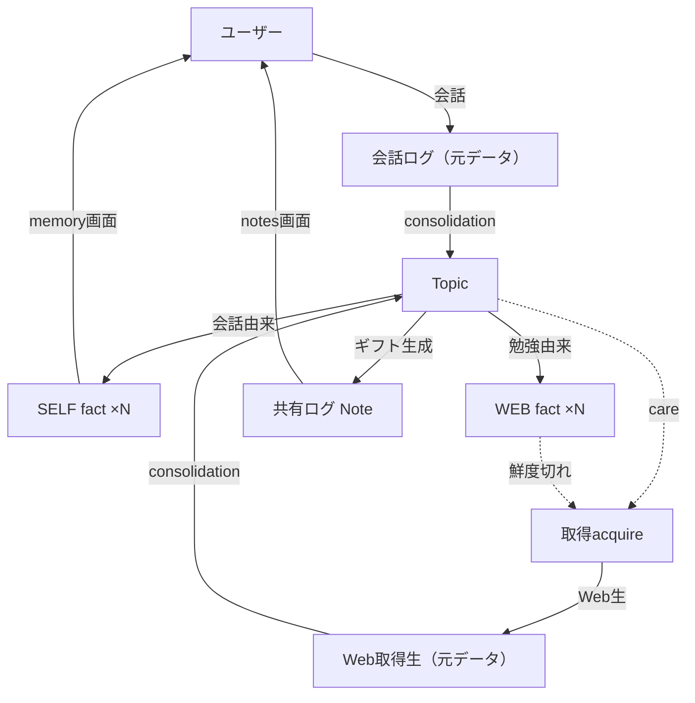

<!--
    このドキュメントは開発時のみ使用します。
    開発完了後に docs/services/livetalk/external-design.md に統合して削除します。
-->

# リブトーク 知識・記憶の Topic 中心モデル 外部設計書

## 1. 画面設計

### 1.1 画面一覧

| 画面 ID | 画面名 | パス | 対応ユースケース | 優先度 |
|--------|--------|------|--------------|-------|
| SCR-MEM | 記憶（私について覚えていること） | /memory | UC-003 | 高 |
| SCR-NOTE | ノート（調べてくれたこと） | /notes | UC-006 | 中 |

既存の 2 画面を踏襲する（新規画面は追加しない）。裏側のデータ源のみ差し替える。

### 1.3 主要画面の設計

#### SCR-MEM: 記憶

**概要**

キャラがユーザー自身について覚えていること（SELF fact）を一覧し、ユーザーが確認・削除できる。裏では複数 Topic の SELF fact を横断集約して表示する。

**主要 UI 要素**

| 要素 | 種別 | 説明 |
|-----|------|------|
| SELF fact 一覧 | リスト | ユーザー由来の事実。話題（Topic）でグルーピング可 |
| 削除 | ボタン | 1 件単位で決定的に削除する |

**ユーザーインタラクション**

| 操作 | 結果 |
|------|------|
| 削除 | 当該 SELF fact を物理削除し、所属 Topic の要約を即再生成（削除内容が導出物にも残らない） |

**表示条件・状態**

- 空状態: まだ覚えていることがない旨を表示。
- 注記: WEB（調べた知識）はこの画面に**出さない・削除対象にしない**（混入禁止）。編集は提供せず、訂正は会話または削除で行う（ADR-007 の前向き整合を踏襲）。

**設計判断（なぜ）**

- Tier 別タブ（A/B/C）を廃止する。想起は関連度で行うため、ユーザーに Tier の概念を見せる必要がない。
- ピン留めを廃止する。常時想起は関連度＋（必要なら）極小のコアプロフィールで代替する。

#### SCR-NOTE: ノート

**概要**

キャラが「あなたのために調べた」体験を贈るギフト面。共有ログ（Note）を新着順に表示し、中身は参照先 Topic の最新を反映する。

**主要 UI 要素**

| 要素 | 種別 | 説明 |
|-----|------|------|
| 共有ログ一覧 | リスト | 「◯月◯日、△△を調べたよ」の出来事。新着順 |
| 詳細 | 閲覧 | SELF フック＋WEB 内容の合成文。出典リンク |

**設計判断（なぜ）**

- 従来の「事実報告書」から「SELF を根拠に WEB を贈る手紙」に変える。同一 Topic に SELF/WEB が同居するため「なぜ調べたか」を根拠付きで語れる。
- 一回性（贈った瞬間）は共有ログ item で不変に保ち、中身は生きた Topic を参照する。

### 1.4 レスポンシブ方針

- PWA（モバイル優先）。既存方針を踏襲する。

### 1.5 アクセシビリティ方針

- 既存準拠。削除は確認ダイアログを設ける（不可逆操作）。

---

## 2. 概念データモデル

### 2.1 関係の要点

- **Topic** は話題を単位とする集約体で、**SELF fact（会話由来）**と **WEB fact（勉強由来）**を同居させる。これにより「話したこと」と「調べたこと」が同一話題で自動的にリンクする。
- **元データ**（会話ログ・Web 取得生）は 90 日 TTL のローリングで、集約カーソル以降が未集約。集約は元データを削除せずカーソルを進める。
- **Note（共有ログ）**は Topic を参照するギフトの記録。中身は最新の Topic を反映する。
- **care** は Topic の注目度で、自発リサーチと能動通知の優先度を駆動する（想起には使わない）。

### 2.2 想起・忘却の外部挙動

- **想起**: 会話に関連する Topic のみ文脈に入る（関連度 only）。関係ない話題は湧いてこない（旧「コーヒー病」を構造で回避）。
- **忘却**: SELF fact を削除すると、その場で当該 Topic の要約が再生成され、以降の応答に出てこない。LLM の「言うな」抑制に依存しない。
