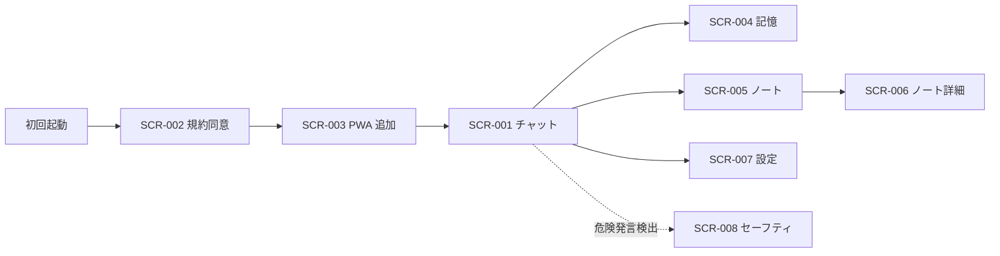
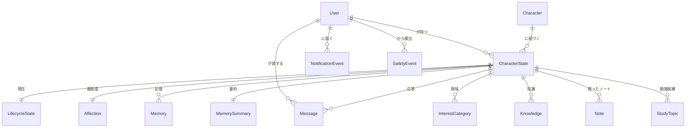

# リブトーク（LiveTalk）外部設計書

<!--
    このドキュメントは開発時のみ使用します。
    開発完了後に docs/services/livetalk/external-design.md および
    docs/services/livetalk/architecture.md（ADR）に統合して削除します。

    入力: tasks/livetalk/requirements.md
    親 Issue: #3182
-->

---

## 1. 画面設計

### 1.1 画面一覧

| 画面 ID | 画面名 | パス | 対応ユースケース | 優先度 | Phase |
|---|---|---|---|---|---|
| SCR-001 | チャット画面 | `/` | UC-001, UC-005 | 高 | 1 |
| SCR-002 | 利用規約・年齢同意 | `/onboarding/terms` | - | 高 | 2 |
| SCR-003 | オンボーディング（PWA 追加誘導） | `/onboarding/install` | - | 中 | 5 |
| SCR-004 | 記憶編集画面 | `/memory` | UC-004 | 中 | 3 |
| SCR-005 | ノート一覧 | `/notes` | - | 中 | 5 |
| SCR-006 | ノート詳細 | `/notes/[id]` | - | 中 | 5 |
| SCR-007 | 設定画面 | `/settings` | - | 中 | 5 |
| SCR-008 | セーフティ介入画面 | （モーダル） | UC-006 | 高 | 2 |

### 1.2 画面遷移図

### 1.3 主要画面の設計

#### SCR-001: チャット画面（メイン）

**概要**

Live2D アバターが常時表示され、ユーザーがテキストを入力してキャラと会話するメイン画面。本サービスの 9 割の時間はこの画面で過ごされる。

**主要 UI 要素**

| 要素 | 種別 | 説明 |
|---|---|---|
| Live2D Canvas | 描画領域 | 桃瀬ひよりが描画される。画面の主体（縦長レイアウトの上 60〜70%） |
| 応答テキスト表示 | 領域 | 直近のキャラ応答テキスト（ストリーミング表示） |
| 入力欄 | テキスト入力 | ユーザーのメッセージ入力 |
| 送信ボタン | ボタン | 入力送信 |
| ヘッダー（メニュー） | ボタン | 記憶 / ノート / 設定への遷移 |
| ライセンス表記 | テキスト | 「Live2D Cubism...」「VOICEVOX:冥鳴ひまり」常時表示（小さく） |

**ユーザーインタラクション**

| 操作 | 結果 |
|---|---|
| テキスト入力 + 送信 | LLM 応答生成 → 音声再生 + リップシンク |
| 起動 | キャラの第一声（時間帯・親密度・通知有無で変化） |
| メニュータップ | 各サブ画面へ遷移 |

**表示条件・状態**

- ローディング: キャラのモーションが「考え中」になる
- エラー: キャラの口調で「ちょっとごめんね、今うまく話せないみたい」を表示
- 空状態（初回）: キャラの自己紹介 + 名前確認

#### SCR-004: 記憶編集画面

**概要**

キャラがユーザーについて覚えている内容を Tier A/B/C 別に一覧表示し、編集・削除を可能にする。Ani / Replika 等で問題となった「誤情報の永続化」を構造的に解決するための画面。

**主要 UI 要素**

| 要素 | 種別 | 説明 |
|---|---|---|
| Tier タブ | タブ | Tier A（確定） / B（嗜好） / C（観測） の切替 |
| メモリリスト | リスト | 1 アイテム 1 行で表示、最終言及日 + 信頼度可視化 |
| 編集ボタン | ボタン | テキストを書き換え |
| 削除ボタン | ボタン | 該当記憶を削除 |
| 固定（Pin）ボタン | ボタン | 重要な記憶を Tier A に昇格固定 |

#### SCR-008: セーフティ介入画面（モーダル）

**概要**

危険発言検出時に LLM をバイパスして即時表示されるモーダル。キャラの口調で心配を表明し、専門機関への案内を行う。**機械的なホットライン番号貼り付けは避ける**。

**主要 UI 要素**

| 要素 | 種別 | 説明 |
|---|---|---|
| キャラからのメッセージ | テキスト | 「ねえ、今すごく心配。一人で抱え込まないでね」等 |
| リソースリスト | リスト | いのちの電話、よりそいホットライン、TELL Lifeline |
| 緊急時 119 案内 | ボタン | 緊急時の医療連絡先 |
| 閉じるボタン | ボタン | モーダルを閉じて通常会話に戻る |

### 1.4 レスポンシブ方針

- **モバイル（スマートフォン）**: プライマリ。縦長レイアウト、Live2D が画面上半分、入力欄が下部固定
- **タブレット**: モバイルレイアウトを拡大表示（中央寄せ、最大幅 480px 程度）
- **デスクトップ**: 同上。本サービスはモバイル前提

### 1.5 アクセシビリティ方針

- WCAG 2.1 Level AA を目標
- 文字サイズはユーザー設定可能（OS 設定に追従）
- スクリーンリーダー対応：応答テキストは独立した領域で読み上げ可能
- 色覚配慮：色のみに依存しない情報伝達
- 音声 OFF 時もテキストで完結する設計（電車内利用配慮）

---

## 2. 概念データモデル

### 2.1 主要エンティティ一覧

| エンティティ | 説明 | 主要な属性（概念レベル） |
|---|---|---|
| User | サービスを利用するユーザー | googleId、表示名、作成日時、最終起動時刻 |
| Character | キャラクター定義 | キャラ ID、名前、性格、嗜好、生活サイクル設定 |
| CharacterState | ユーザー × キャラの状態 | 親密度、最終接触日時 |
| LifecycleState | キャラの現在のサイクル状態 | 起床 / 就寝、現在の活動 |
| Message | 会話 1 件 | 発言者、本文、タイムスタンプ、音声 URL |
| Memory | 記憶アイテム | Tier、内容、信頼度、最終言及日 |
| MemorySummary | 圧縮要約 | コンテキスト本文、最終更新日 |
| Affection | 親密度 | 値、変動履歴 |
| InterestCategory | 興味カテゴリ | カテゴリ名、重み |
| Knowledge | 勉強済みの情報 | トピック、要約、ソース URL |
| Note | プレゼントノート | タイトル、本文、宛先メモ |
| StudyTopic | 勉強候補 | トピック、優先度、状態 |
| NotificationEvent | 通知配信履歴 | 種別、時刻、配信成否 |
| SafetyEvent | セーフティ検出ログ | 検出パターン、時刻、応答内容 |

### 2.2 エンティティ関係図

物理データモデル（DynamoDB Single Table 設計）は `design.md` で定義する。

---

## 3. 設計上の決定事項（ADR）

### ADR-001: Live2D はクライアント側でリアルタイム描画する（サーバー動画化しない）

**背景・問題**

サーバー側で Live2D を描画して動画として返す案を初期に検討したが、コスト・レイテンシ・帯域の観点で実用性が低い。同領域の既存サービス（Open-LLM-VTuber、Neuro-sama 等）はすべてクライアント描画を採用している。

**決定**

`pixi-live2d-display-lipsyncpatch`（MIT）を使い、ブラウザの WebGL でリアルタイム描画する。サーバーは「テキスト + 音声 + モーション指示」だけを返す。

**根拠・トレードオフ**

- ✅ 1 応答あたりの追加レイテンシがほぼゼロ
- ✅ サーバー GPU 不要、コストが線形に増えない
- ✅ 帯域はモーション JSON 数 KB のみ（動画 MB と比較）
- ✅ 既存 OSS（Open-LLM-VTuber）を参考にできる
- ⚠️ iOS Safari の WebGL は注意点があるが、Live2D は 2D メッシュなので 3D ほど重くない

### ADR-002: DynamoDB Single Table 設計、会話は 1 メッセージ 1 item で保存

**背景・問題**

「ユーザーごとに 1 レコードで会話を配列保持」が最初の検討案だったが、DynamoDB のアンチパターンであり、400KB 上限・書き込みコスト・並行競合・TTL 非対応の観点で破綻する。

**決定**

PK = `USER#<googleId>`、SK = `CHAR#<charId>#MSG#<ulid>` 等で、メッセージは個別 item として保存する。Single Table 設計の標準パターンに従う。

**根拠・トレードオフ**

- ✅ メッセージ数に上限がなくなる
- ✅ TTL で古いメッセージを自動削除可能
- ✅ 「直近 N 件取得」が効率的（Query + Limit）
- ✅ 圧縮要約は別 item（`MEMORY#SUMMARY`）として独立管理
- ⚠️ 全件読み出しは複数 item の Get が必要だが、本サービスでは不要

### ADR-003: VOICEVOX はセルフホスト、文単位で逐次パイプライン化

**背景・問題**

VOICEVOX はストリーミング合成に対応していない。長文を一括生成すると最初の音声まで数秒〜十数秒待たされる。

**決定**

LLM の応答ストリームを文区切り（。！？）で分割し、文単位で VOICEVOX に投げる。生成された音声を逐次クライアントへ送信して順次再生する。

**根拠・トレードオフ**

- ✅ 最初の音声まで 1〜2 秒（文 1 つの生成時間）
- ✅ CPU で十分（GPU 不要）
- ✅ ECS Fargate 1 タスクで安価に運用可能
- ⚠️ 文単位なのでアクセント・抑揚が文同士で繋がらない（許容）

### ADR-004: ECS Fargate 1 Task に Next.js + VOICEVOX の 2 コンテナ同居

**背景・問題**

VOICEVOX を独立サービスとして立てるか、Next.js と一緒に動かすか。dev 環境での検証を優先したい。

**決定**

MVP〜Phase 5 完了までは「1 ECS Task に 2 コンテナ」構成。Next.js から `localhost:50021` で VOICEVOX を叩く。VOICEVOX クライアントは環境変数で URL 差し替え可能とし、将来の共通サービス化に備える。

**根拠・トレードオフ**

- ✅ 単一デプロイ単位で「1 Docker のように扱える」
- ✅ ローカル / dev / prod の動作差を最小化
- ✅ コスト効率がよい（独立サービスの常駐コストを節約）
- ⚠️ スケール時に Next.js と VOICEVOX が一緒にスケール（許容、将来分離可）

### ADR-005: 親密度は上昇のみ、降下しない

**背景・問題**

Replika が無起動期間で親密度を下げて炎上した教訓を踏まえる。一方で、関係性の表現として上昇は必要。

**決定**

親密度は上昇のみ。長期無起動でも下げない。代わりに「久しぶり！」演出と通知文面の温度感調整で時間経過を表現する。

**根拠・トレードオフ**

- ✅ ダークパターン回避、ユーザーが気持ちよく戻ってこれる
- ✅ Replika との差別化として明確
- ⚠️ 親密度の意味が「累積接触量」になる（恣意的だが許容）

### ADR-006: 睡眠状態は応答ゲートではなくスタイル変調

**背景・問題**

キャラに「就寝中は応答しない」設計だと、夜型ユーザーが使えなくなる。デスクトップメイト的な「常に応答可能」が本サービスの魅力に合う。

**決定**

寝てる時間帯でも応答する。ただし応答スタイルが寝ぼけ口調 + 半目になる。「起きてる/寝てる」の 2 状態でフレーバーだけを変える。

**根拠・トレードオフ**

- ✅ 夜型ユーザーをカバー
- ✅ 「寝起きの会話」自体が親密度の演出になる
- ⚠️ LLM のスタイル維持が技術的に難しい（few-shot で誘導）

### ADR-007: メモリは階層化 + 信頼度スコア + ユーザー編集 UI

**背景・問題**

Ani / Replika で問題化した「誤情報の永続化」「些細な情報を毎回参照」を構造的に解決したい。

**決定**

メモリを Tier A/B/C/D に階層化し、信頼度スコアと cooldown を持たせる。LLM への注入は関連度フィルタを通したものに限定する。ユーザーが記憶を編集・削除できる UI を MVP の段階から提供する。

**根拠・トレードオフ**

- ✅ 「コーヒー好き」→毎回コーヒー繋ぎ問題が構造的に解決
- ✅ ユーザーが介入できる安心感
- ⚠️ UI の「機械っぽさ」が出るが、コンパニオン体験との両立は許容範囲

### ADR-008: 認可は既存プラットフォーム RBAC に乗る

**背景・問題**

新規 permission を作るか、独自の認可機構を作るか。

**決定**

既存 `libs/common/src/auth/` の RBAC に新 permission `livetalk:chat` を追加する。`live-talk-user` role を作り、必要なアカウントに付与する。

**根拠・トレードオフ**

- ✅ 既存基盤の恩恵を最大限受ける
- ✅ 他サービスとの統合運用が容易
- ✅ 「自分のみ」も「公開」も role 付与で制御可能
- ⚠️ プラットフォームの認可方針に縛られる（許容）

### ADR-009: セーフティは自前実装する（LLM 任せにしない）

**背景・問題**

OpenAI / Anthropic の安全機構は不十分。Character.AI / OpenAI の訴訟事例（Adam Raine 事件等）で開発者責任が確立されている。OpenAI 公式も「アプリ開発者の責任」と明言。

**決定**

入力時にキーワード辞書で危険発言を検出 → LLM をバイパスして強制テンプレ応答に切替。応答後も OpenAI Moderation API で二段チェック。日本のリソース（いのちの電話、よりそいホットライン、TELL Lifeline）を案内する。検出ログを別領域に保管する。

**根拠・トレードオフ**

- ✅ 法的責任の最小化
- ✅ Character.AI のような事故を構造的に回避
- ⚠️ false positive で会話が中断されることがある（許容、安全側に倒す）
- ⚠️ キーワード辞書のメンテが必要

### ADR-010: モデルは桃瀬ひより + 音声は冥鳴ひまりで MVP、後で差し替え可能

**背景・問題**

オリジナルキャラ・声を作るには時間とコスト。すぐ動くものを作りたい。

**決定**

- Live2D: 桃瀬ひより（Live2D 公式サンプル）
- 音声: VOICEVOX 冥鳴ひまり（speaker=14、ライセンス緩い）
- CharacterDefinition で抽象化し、将来差し替え可能とする

**根拠・トレードオフ**

- ✅ MVP がすぐ動く
- ✅ 法的リスク最小（公式サンプル + 緩いライセンス TTS）
- ⚠️ キャラ性と声が完全一致しない（許容、本格公開時に差し替え）
- ⚠️ 年商 1,000 万円超 or 中・大規模事業者になる前に Live2D 別途契約が必要

### ADR-011: 通知は指数バックオフ + 時間帯制限 + クリティカル escalation

**背景・問題**

Push 通知の頻度バランスが難しい。少なすぎると忘れられ、多すぎると鬱陶しい。

**決定**

- 平常通知：過去 N 回のやり取りの中央値間隔から算出、超過後は倍々で間隔拡大
- 時間帯：朝・夕方（ユーザー活動時間から学習）
- クリティカル escalation：新作・期間限定情報は時間帯外でも配信
- 上限：1 日 2 件まで（平常 1 件 + クリティカル 1 件）

**根拠・トレードオフ**

- ✅ ユーザーの生活リズムに自然に適応
- ✅ 「追わない」スタンスが他コンパニオンとの差別化に
- ⚠️ N 件のサンプルが溜まるまでは固定間隔（許容）

### ADR-012: 「知らない → 勉強しておく」は LLM tool use で強制ゲート化

**背景・問題**

LLM は学習済み知識でホイホイ即答する。プロンプトで「知らないと答えろ」と書いても守らない。

**決定**

知識ベース検索を LLM の tool として実装し、ヒット無しのトピックは強制的に「勉強しておくね」テンプレに切り替える。LLM の良心に頼らず、コード側で gating する。

**根拠・トレードオフ**

- ✅ 「同じ時間軸で生きてる」感の演出が確定する
- ✅ プロンプトインジェクション耐性も高い
- ⚠️ 一般常識まで「勉強する」と返してしまうリスクがあるので、分類精度に注意

---

## 4. ライセンス・コンプライアンス方針

### 4.1 表示義務

UI に常時表示する必要があるもの：

- 「Live2D Cubism」または Live2D ロゴ
- 「このキャラクターモデルは株式会社 Live2D より許諾を得て商用利用しています。」（商用利用時）
- 「VOICEVOX:冥鳴ひまり」
- イラスト原作: かにビーム（推奨）

### 4.2 ライセンス監査ポイント

- 年商 1,000 万円を超える前に Live2D に別途契約相談
- VOICEVOX 話者を変更する場合は対象話者のライセンス再確認
- pixi-live2d-display は MIT、Cubism Core はプロプライエタリ（HTTP 経由ではないので Cubism Core を bundle する場合は注意）

---

## 5. 将来の拡張ポイント

将来の差し替え・拡張が想定される箇所を明示しておく：

| 項目 | 抽象化レイヤー | 差し替え時の作業 |
|---|---|---|
| Live2D モデル | `CharacterDefinition` | モデル定義 + モーションマッピング差し替え |
| 音声合成エンジン | `VoiceClient` | クライアント実装の入れ替え |
| LLM プロバイダ | `LLMClient` | クライアント実装の入れ替え |
| VOICEVOX ホスティング | 環境変数 `VOICEVOX_URL` | 接続先 URL 変更のみ |
| 通知チャネル | 既存 Push 基盤 | 別チャネル追加時は通知抽象化必要 |

---

## 6. 関連ドキュメント

- 親 Issue: #3182
- 要件定義: [requirements.md](./requirements.md)
- 技術設計: [design.md](./design.md)
- プラットフォーム認証: `docs/development/authentication.md`
- プラットフォーム PWA: `docs/development/pwa.md`
- プラットフォームライブラリ: `docs/development/shared-libraries.md`
- ブランチ戦略: `docs/branching.md`
