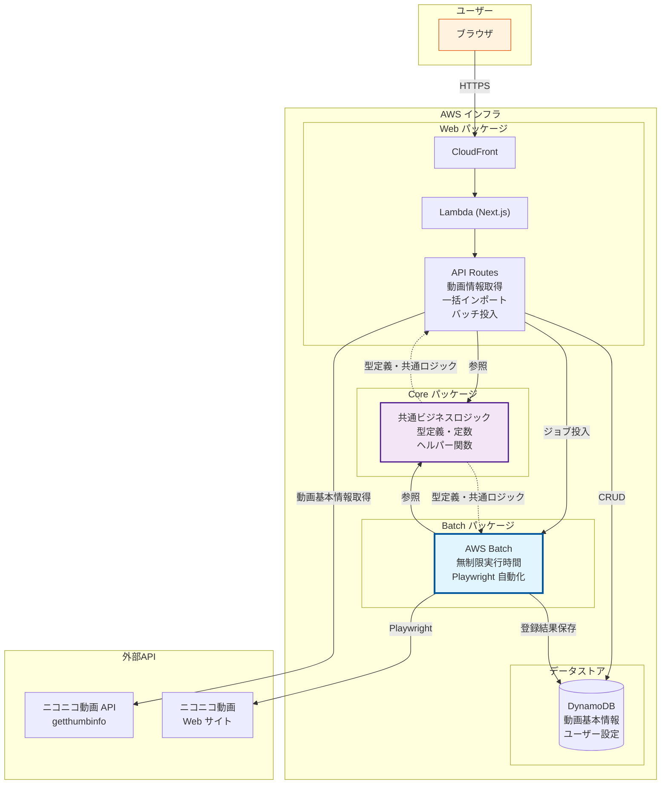
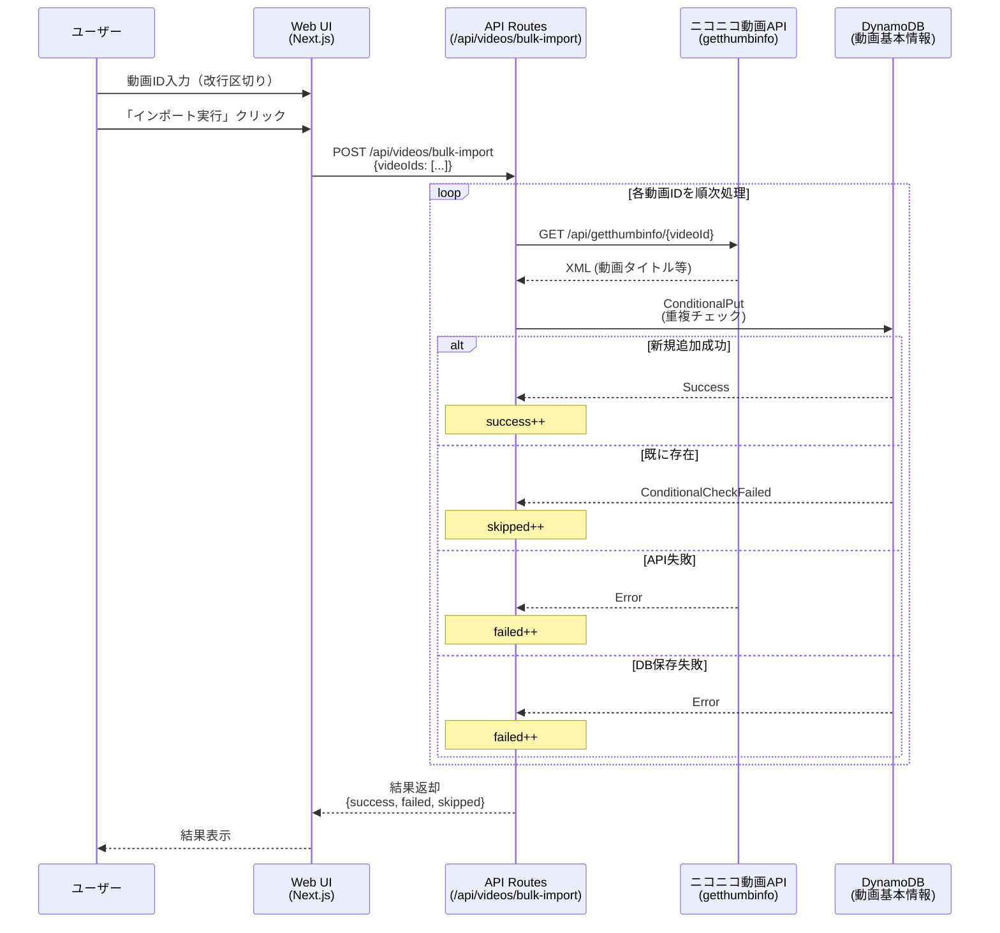
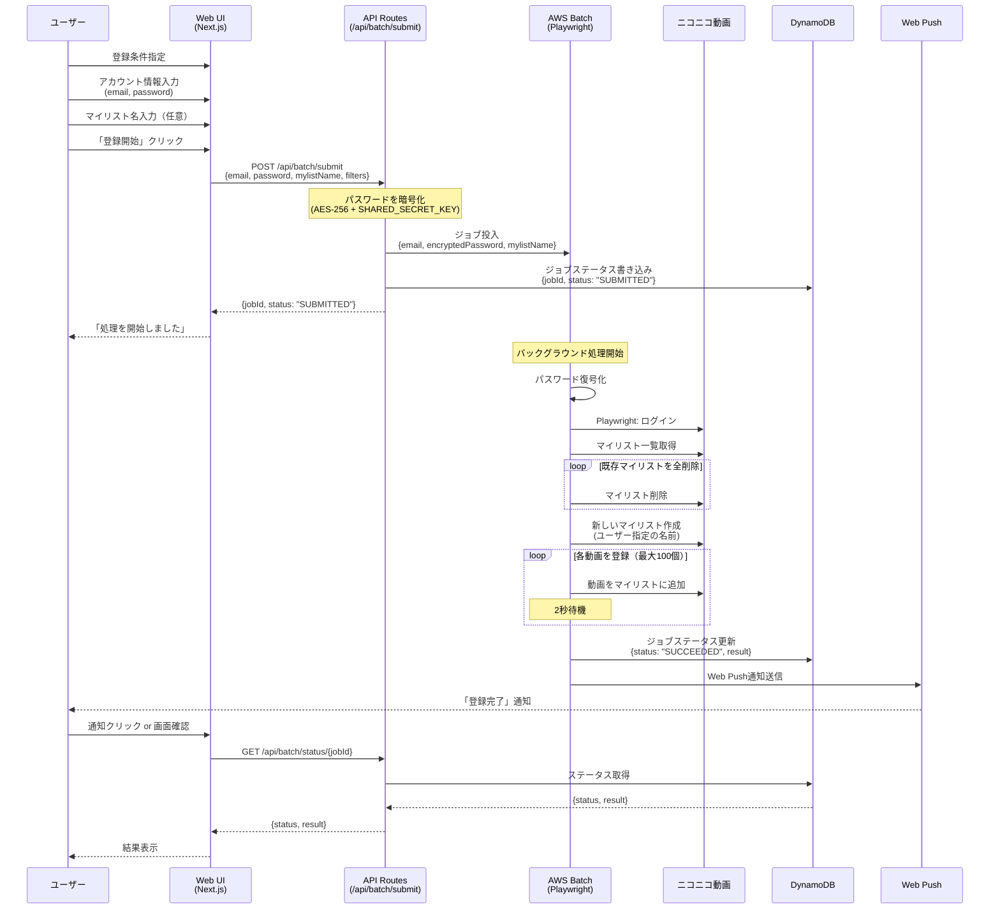
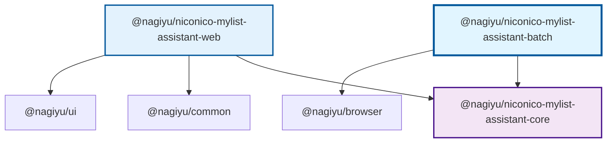
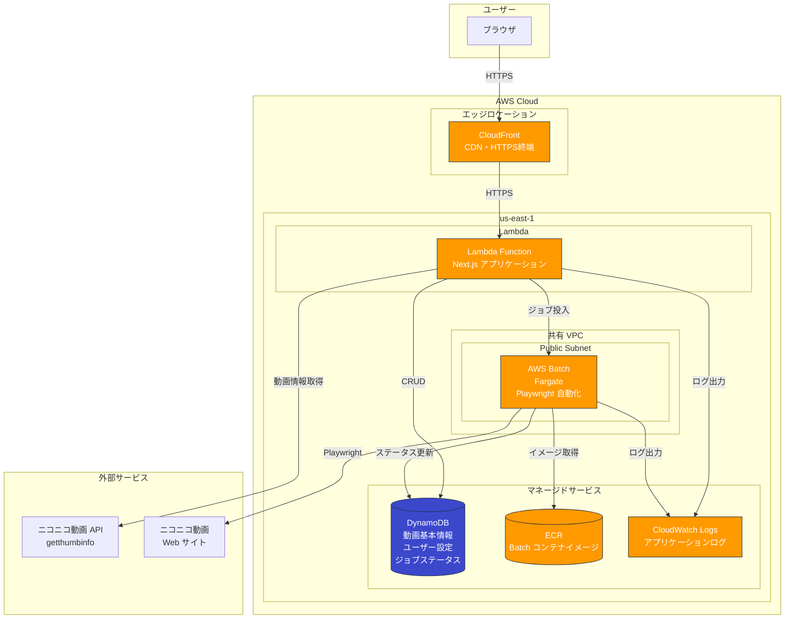
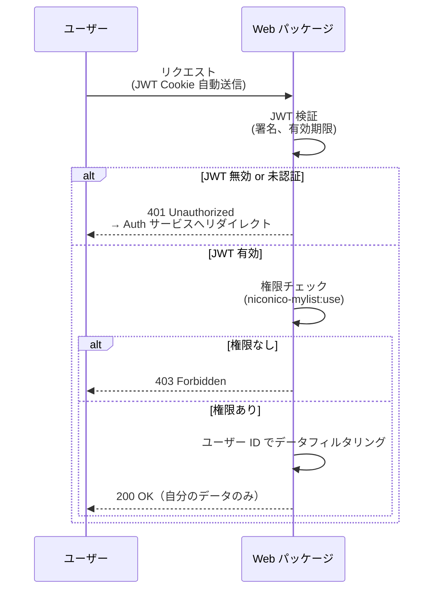
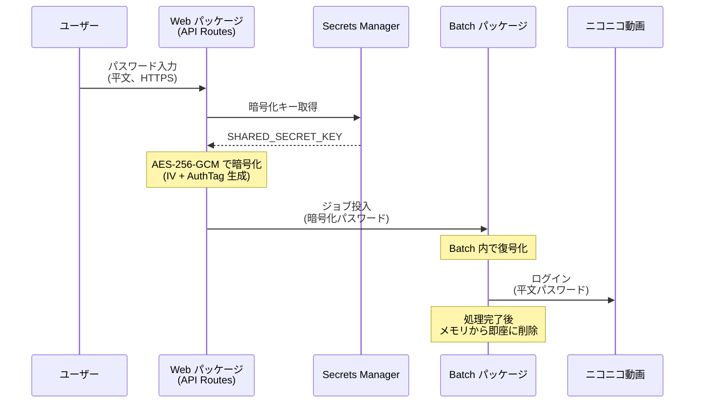

# niconico-mylist-assistant アーキテクチャ設計書

---

## 1. システム概要

niconico-mylist-assistant は、ニコニコ動画のマイリスト登録作業を自動化するサーバーレスアプリケーションです。ユーザーは Web UI（Next.js）を通じて条件を指定し、DynamoDB に保存された動画データから最大 100 個をランダムに選択してマイリストに一括登録できます。**AWS Batch** を採用することで Lambda の 15 分制限を回避し、各動画間に最低 2 秒の待機時間を設けることでニコニコ動画サーバーへの配慮を徹底しています。

本システムは **3 パッケージ構成（core / web / batch）** により、ビジネスロジック、Web フロントエンド、バッチ処理をそれぞれ独立したモジュールとして管理します。core パッケージは完全フレームワーク非依存の TypeScript ライブラリとして設計され、web パッケージ（Next.js）と batch パッケージ（Playwright 自動化）の両方から共通ロジックを再利用します。これにより、テストの容易性と保守性を確保しています。

### 1.1 全体構成図



---

## 2. 技術スタック

### 2.1 フロントエンド

| カテゴリ       | 技術          | 用途                             |
| -------------- | ------------- | -------------------------------- |
| フレームワーク | Next.js 16    | React ベースのフルスタック開発   |
| UI ライブラリ  | React 19      | ユーザーインターフェース構築     |
| コンポーネント | Material-UI 7 | マテリアルデザインコンポーネント |
| 言語           | TypeScript    | 型安全な開発                     |

### 2.2 バックエンド

| カテゴリ       | 技術       | 用途                       |
| -------------- | ---------- | -------------------------- |
| ランタイム     | Node.js 22 | JavaScript 実行環境        |
| 言語           | TypeScript | 型安全なサーバーサイド開発 |
| フレームワーク | Next.js 16 | API Routes による API 開発 |

### 2.3 インフラ

| カテゴリ           | 技術                 | 用途                             |
| ------------------ | -------------------- | -------------------------------- |
| コンピューティング | AWS Lambda           | Next.js アプリケーションの実行   |
| バッチ処理         | AWS Batch (Fargate)  | 長時間実行（マイリスト一括登録） |
| データベース       | Amazon DynamoDB      | 動画基本情報・ユーザー設定の保存 |
| ログ管理           | CloudWatch Logs      | アプリケーションログ             |
| CDN                | Amazon CloudFront    | コンテンツ配信                   |
| IaC                | AWS CDK (TypeScript) | インフラ定義                     |
| Push 通知          | web-push             | バッチ完了通知（VAPID 認証）     |

### 2.4 開発ツール

| カテゴリ             | 技術             | 用途                |
| -------------------- | ---------------- | ------------------- |
| パッケージマネージャ | npm              | 依存関係管理        |
| リンター             | ESLint           | コード品質チェック  |
| フォーマッター       | Prettier         | コード整形          |
| テスト               | Jest, Playwright | ユニット・E2Eテスト |

---

## 3. アーキテクチャパターン

### 3.1 データフロー

本サービスには主に2つのデータフローがあります：
1. **一括インポートフロー**: 動画IDからニコニコ動画APIで動画基本情報を取得してDynamoDBに保存
2. **マイリスト登録フロー**: 条件指定により動画を選択し、AWS Batchでマイリストに自動登録

#### 3.1.1 一括インポートフロー



**処理の特徴**:
- **順次処理**: 各動画IDをforループで1つずつ処理（並列処理なし）
- **エラー継続**: ニコニコAPI失敗やDB保存失敗が発生しても処理を継続
- **重複チェック**: DynamoDBのConditionalPut（`attribute_not_exists`）で重複を検出
- **結果集計**: 成功数、失敗数、スキップ数を集計して返却

#### 3.1.2 マイリスト登録フロー



**処理の特徴**:
- **非同期処理**: AWS Batchでバックグラウンド実行（Lambda の15分制限を回避）
- **暗号化**: ニコニコアカウントのパスワードはAPI Routes内で暗号化、Batch内でのみ復号化
- **マイリスト完全リセット**: 既存のマイリストを全削除してから新規作成
- **マイリスト名**: ユーザー指定、未指定時は日時デフォルト（例: `自動登録 2026/1/16 15:30:45`）
- **待機時間**: 各動画登録間に最低2秒待機（ニコニコ動画サーバーへの配慮）
- **完了通知**: Web Push通知 + DynamoDBステータス書き込みのハイブリッド方式

### 3.2 コンポーネント構成

本サービスは **3パッケージ構成** を採用し、ビジネスロジック、Webアプリケーション、バッチ処理をそれぞれ独立したモジュールとして管理します。

#### 3.2.1 パッケージ構成

```
services/niconico-mylist-assistant/
├── core/              # @nagiyu/niconico-mylist-assistant-core
├── web/               # @nagiyu/niconico-mylist-assistant-web
├── batch/             # @nagiyu/niconico-mylist-assistant-batch
└── package.json       # ワークスペースルート（将来的に追加）
```

#### 3.2.2 各パッケージの責務

##### core パッケージ (`@nagiyu/niconico-mylist-assistant-core`)

- **責務**: フレームワーク非依存の共通ビジネスロジック
- **提供機能**:
  - 型定義（動画基本情報、ユーザー設定、バッチジョブ等）
  - 定数定義（待機時間、上限数等）
  - Playwright ヘルパー関数
  - ニコニコ動画 API 連携（getthumbinfo）
  - マイリスト自動化ロジック
- **依存先**: なし（Pure TypeScript）
- **利用元**: web, batch

##### web パッケージ (`@nagiyu/niconico-mylist-assistant-web`)

- **責務**: ユーザーインターフェースとAPI提供
- **提供機能**:
  - フロントエンド（React + Material-UI）
  - API Routes（動画一括インポート、バッチジョブ投入、ステータス確認）
  - 認証（Auth プロジェクト連携）
  - DynamoDB 操作
- **依存先**:
  - `@nagiyu/niconico-mylist-assistant-core`
  - `@nagiyu/common`
  - `@nagiyu/ui`
- **デプロイ先**: AWS Lambda + CloudFront

##### batch パッケージ (`@nagiyu/niconico-mylist-assistant-batch`)

- **責務**: マイリスト登録の長時間バッチ処理
- **提供機能**:
  - Playwright によるニコニコ動画自動操作
  - パスワード復号化
  - マイリスト完全リセット + 新規作成
  - Web Push 通知送信
  - ジョブステータス更新
- **依存先**:
  - `@nagiyu/niconico-mylist-assistant-core`
  - `@nagiyu/browser`
- **デプロイ先**: AWS Batch (Docker コンテナ)

#### 3.2.3 依存関係図



---

## 4. データモデル

### 4.1 データベーススキーマ

本サービスは **DynamoDB 単一テーブル設計** を採用します。動画基本情報（全ユーザー共通）とユーザー設定（ユーザー固有）を1つのテーブルで管理し、コスト効率と管理の簡素化を実現します。

#### テーブル定義

**テーブル名**: `nagiyu-niconico-mylist-assistant-dynamodb-{environment}`
- 環境: `dev` または `prod`
- 作成方法: `infra/common/src/utils/naming.ts` の `getDynamoDBTableName()` を使用

**課金モード**: オンデマンド（On-Demand）

**キー構造**:
- **パーティションキー (PK)**: `string`
- **ソートキー (SK)**: `string`

#### エンティティ設計

本テーブルには2種類のエンティティを格納します：

##### 1. 動画基本情報（VIDEO）

全ユーザー共通の動画メタデータ。ニコニコ動画API（`getthumbinfo`）から取得した情報を保存します。

| 属性名 | 型 | 説明 | 必須 |
|--------|------|------|------|
| `PK` | String | `VIDEO#{videoId}` | ✓ |
| `SK` | String | `VIDEO#{videoId}` | ✓ |
| `entityType` | String | `"VIDEO"` （エンティティ識別用） | ✓ |
| `videoId` | String | 動画ID（例: `sm12345678`） | ✓ |
| `title` | String | 動画タイトル | ✓ |
| `thumbnailUrl` | String | サムネイル画像URL | ✓ |
| `length` | String | 再生時間（例: `5:30`） | ✓ |
| `createdAt` | String | 登録日時（ISO 8601形式） | ✓ |

**アクセスパターン**:
- 特定の動画情報を取得: `GetItem(PK=VIDEO#{videoId}, SK=VIDEO#{videoId})`
- 複数の動画情報を一括取得: `BatchGetItem` または個別に `GetItem`

**例**:
```json
{
    "PK": "VIDEO#sm12345678",
    "SK": "VIDEO#sm12345678",
    "entityType": "VIDEO",
    "videoId": "sm12345678",
    "title": "サンプル動画タイトル",
    "thumbnailUrl": "https://example.com/thumb.jpg",
    "length": "5:30",
    "createdAt": "2026-01-16T10:30:00Z"
}
```

##### 2. ユーザー設定（USER_SETTING）

各ユーザーが個別に設定するメタデータ（お気に入りフラグ、スキップフラグ、メモ）。

| 属性名 | 型 | 説明 | 必須 |
|--------|------|------|------|
| `PK` | String | `USER#{userId}` | ✓ |
| `SK` | String | `VIDEO#{videoId}` | ✓ |
| `entityType` | String | `"USER_SETTING"` （エンティティ識別用） | ✓ |
| `userId` | String | Auth プロジェクトの UserID | ✓ |
| `videoId` | String | 動画ID | ✓ |
| `isFavorite` | Boolean | お気に入りフラグ（デフォルト: `false`） | ✓ |
| `isSkip` | Boolean | スキップフラグ（デフォルト: `false`） | ✓ |
| `memo` | String | ユーザーのメモ | ✗ |
| `createdAt` | String | 登録日時（ISO 8601形式） | ✓ |
| `updatedAt` | String | 更新日時（ISO 8601形式） | ✓ |

**アクセスパターン**:
- 特定ユーザーの全動画設定を取得: `Query(PK=USER#{userId})`
- 特定ユーザーの特定動画設定を取得: `GetItem(PK=USER#{userId}, SK=VIDEO#{videoId})`
- 条件付きフィルタ（お気に入りのみ、スキップを除くなど）: アプリ側でフィルタリング

**例**:
```json
{
    "PK": "USER#auth0|abc123",
    "SK": "VIDEO#sm12345678",
    "entityType": "USER_SETTING",
    "userId": "auth0|abc123",
    "videoId": "sm12345678",
    "isFavorite": true,
    "isSkip": false,
    "memo": "お気に入りの曲",
    "createdAt": "2026-01-16T10:30:00Z",
    "updatedAt": "2026-01-16T12:00:00Z"
}
```

#### インデックス

**プライマリインデックスのみ使用**:
- パーティションキー (PK) + ソートキー (SK)

**GSI（Global Secondary Index）**: なし
- 条件付きフィルタ（`isFavorite=true`, `isSkip=false` など）はアプリ側で実装
- 理由: 現在の想定データ量（1ユーザーあたり1,000件程度）では、全件取得してアプリ側でフィルタリングする方がコスト効率が良い
- 将来的にデータ量が増加した場合（10,000件以上）は、GSI の追加を検討

#### データ整合性

**動画基本情報とユーザー設定の関係**:
- ユーザー設定（`USER_SETTING`）は、対応する動画基本情報（`VIDEO`）が存在することを前提とする
- 一括インポート時に動画基本情報を先に保存し、その後ユーザー設定を作成する
- 動画基本情報が削除された場合、対応するユーザー設定も削除する必要がある（アプリ側で制御）

**重複チェック**:
- 動画基本情報: `ConditionalPut` で `attribute_not_exists(PK)` を使用し、重複を防止
- ユーザー設定: 同一ユーザー・同一動画の組み合わせは上書き更新

#### 想定データ量とパフォーマンス

- **1ユーザーあたりの動画数**: 1,000件程度（中規模）
- **1動画あたりのデータサイズ**:
    - 動画基本情報: 約 500 bytes
    - ユーザー設定: 約 200 bytes
- **マイリスト登録時の読み取り**: `Query(PK=USER#{userId})` で全件取得（約 200 KB）
    - DynamoDB の読み取りキャパシティ: 200 KB ÷ 8 KB = 25 RCU（Eventually Consistent Read）
    - レスポンス時間: 数百ミリ秒程度

### 4.2 API 型定義

本サービスの主要APIの型定義を記述します。すべてのAPIは Next.js の API Routes として実装され、認証済みユーザーのみがアクセス可能です。

#### 動画一括インポート API

`POST /api/videos/bulk-import`

```typescript
interface BulkImportRequest {
    videoIds: string[];
}

interface BulkImportResponse {
    success: number;
    failed: number;
    skipped: number;
    total: number;
}
```

#### バッチジョブ投入 API

`POST /api/batch/submit`

```typescript
interface BatchSubmitRequest {
    email: string;
    password: string;
    mylistName?: string;
    filters: FilterConditions;
}

interface FilterConditions {
    excludeSkip: boolean;
    favoritesOnly: boolean;
}

interface BatchSubmitResponse {
    jobId: string;
    status: string;
}
```

#### バッチステータス取得 API

`GET /api/batch/status/{jobId}`

```typescript
interface BatchStatusResponse {
    jobId: string;
    status: BatchStatus;
    result?: BatchResult;
    createdAt: string;
    updatedAt: string;
}

type BatchStatus = "SUBMITTED" | "RUNNING" | "SUCCEEDED" | "FAILED";

interface BatchResult {
    registeredCount: number;
    failedCount: number;
    totalCount: number;
    errorMessage?: string;
}
```

---

## 5. インフラ構成

### 5.1 AWS 構成図



### 5.2 リソース一覧

| リソース | 説明 | 主要な設定 |
|---------|------|-----------|
| **CloudFront** | CDN・HTTPS 終端 | サービス固有ディストリビューション、CloudFrontStackBase 継承、TLS 1.2、HTTP/2・HTTP/3 有効 |
| **Lambda** | Next.js アプリケーション実行 | VPC 外、Function URL 使用 |
| **AWS Batch** | マイリスト登録バッチ処理 | Fargate、共有 VPC (Public Subnet)、vCPU/メモリは運用しながら調整 |
| **DynamoDB** | データストア | オンデマンドキャパシティ、単一テーブル設計、TTL 有効（ジョブステータス用、7日） |
| **ECR** | コンテナイメージ管理 | Batch 用 Playwright イメージ |
| **CloudWatch Logs** | ログ管理 | Lambda・Batch のアプリケーションログ |
| **共有 ACM 証明書** | SSL/TLS 証明書 | `*.nagiyu.com` ワイルドカード証明書（共有リソース） |
| **共有 VPC** | ネットワーク | Batch 用、Public Subnet のみ（共有リソース） |

### 5.3 ネットワーク設計

#### VPC 構成

本サービスは**プラットフォーム共有 VPC** を使用します。

| 環境 | VPC CIDR | サブネット | 用途 |
|------|----------|-----------|------|
| dev | `10.0.0.0/24` | Public (us-east-1a) | AWS Batch (Fargate) |
| prod | `10.1.0.0/24` | Public (us-east-1a, 1b) | AWS Batch (Fargate) |

#### 各コンポーネントのネットワーク配置

| コンポーネント | 配置 | 理由 |
|---------------|------|------|
| Lambda | VPC 外 | DynamoDB へのアクセスは VPC エンドポイント不要、コールドスタート短縮 |
| AWS Batch (Fargate) | 共有 VPC (Public Subnet) | ニコニコ動画へのインターネットアクセスが必要 |
| DynamoDB | マネージドサービス | VPC 外からアクセス（IAM 認証） |

#### セキュリティグループ

AWS Batch 用のセキュリティグループを**サービス専用で作成**します。

| セキュリティグループ | インバウンド | アウトバウンド |
|---------------------|-------------|---------------|
| Batch 用 SG | なし | HTTPS (443) - インターネット向け |

**注記**: Fargate タスクはインターネットへのアウトバウンド通信のみ必要（ニコニコ動画へのアクセス）。インバウンドは不要。

### 5.4 ドメイン設計

| 環境 | ドメイン名 |
|------|-----------|
| dev | `dev-niconico-mylist-assistant.nagiyu.com` |
| prod | `niconico-mylist-assistant.nagiyu.com` |

### 5.5 将来的な設定変更

| 項目 | 初期設定 | 将来的な変更 |
|------|---------|-------------|
| DynamoDB PITR | 無効 | 本番運用安定後に有効化 |
| Batch vCPU/メモリ | 最小構成 | 運用しながら調整 |

---

## 6. セキュリティ設計

### 6.1 認証・認可

#### 認証方式

本サービスは **Auth サービス** と連携し、Google OAuth による認証を行います。

| 項目 | 内容 |
|------|------|
| 認証方式 | Google OAuth（Auth サービス連携） |
| JWT Cookie | `nagiyu-session` |
| Cookie Domain | `.nagiyu.com`（全サブドメインで共有） |
| 有効期限 | 30日 |

Auth サービスで発行された JWT クッキーは `.nagiyu.com` ドメインで共有されるため、本サービス（`niconico-mylist-assistant.nagiyu.com`）でも自動的に認証情報が利用できます。

#### 認可方式

サービス単位の権限チェックを行います。

| 項目 | 内容 |
|------|------|
| 認可方式 | RBAC（Role-Based Access Control） |
| 必要権限 | `niconico-mylist:use` |
| 権限なし時 | 403 Forbidden |

**権限チェックの流れ:**



#### データアクセス制御

- ユーザーは **自分のデータのみ** アクセス可能
- DynamoDB のクエリ時に `userId` でフィルタリング
- 他ユーザーのデータにはアクセス不可

### 6.2 データ暗号化

#### 暗号化対象と方式

| 対象 | 暗号化方式 | 保存場所 | 備考 |
|------|-----------|----------|------|
| ニコニコパスワード | AES-256-GCM | メモリのみ（DB 保存なし） | API Routes で暗号化、Batch で復号 |
| 暗号化キー | - | AWS Secrets Manager | 環境変数 `SHARED_SECRET_KEY` |
| DynamoDB データ | AWS KMS（At Rest） | DynamoDB | AWS 管理キーによる自動暗号化 |
| 通信 | TLS 1.2+ | - | CloudFront ↔ Lambda 間 |

#### ニコニコパスワードの暗号化フロー



**重要:**
- パスワードは **DB に保存しない**
- バッチ処理内でのみ復号化し、処理完了後は即座にメモリから削除
- 暗号化には認証付き暗号（AES-256-GCM）を使用し、改ざん検知も行う

### 6.3 セキュリティヘッダー

CloudFront 共通設定（`CloudFrontStackBase`）を継承し、以下のセキュリティヘッダーを自動適用します。

| ヘッダー | 値 | 効果 |
|----------|-----|------|
| Strict-Transport-Security | max-age=63072000; includeSubDomains; preload | HTTPS 強制（2年間） |
| X-Content-Type-Options | nosniff | MIME スニッフィング防止 |
| X-Frame-Options | DENY | iframe 埋め込み禁止（クリックジャッキング対策） |
| X-XSS-Protection | 1; mode=block | ブラウザの XSS フィルタ有効化 |
| Referrer-Policy | strict-origin-when-cross-origin | リファラー情報の制御 |

**注記:**
- Content-Security-Policy（CSP）は現時点では設定しない
- 将来的にニコニコ動画のサムネイル画像読み込みなどで必要になった場合に検討

### 6.4 その他のセキュリティ対策

#### XSS 対策

| 対策 | 内容 |
|------|------|
| React エスケープ | React のデフォルト機能により、出力時に自動エスケープ |
| dangerouslySetInnerHTML | 使用しない |
| ユーザー入力 | 表示前にサニタイズ |

#### CSRF 対策

| 対策 | 内容 |
|------|------|
| SameSite Cookie | Auth サービスの JWT Cookie は `SameSite=Lax` |
| オリジン検証 | クロスオリジンリクエストを制限 |

#### 入力検証

| 対策 | 内容 |
|------|------|
| API Routes | リクエストパラメータを手動でバリデーション |
| 型チェック | TypeScript strict mode による型安全性 |
| 境界値チェック | 動画 ID の形式、配列の長さなどを検証 |

#### ログ出力

| 対策 | 内容 |
|------|------|
| 出力先 | CloudWatch Logs |
| 機密情報 | パスワード、暗号化キー等は **出力しない** |
| マスキング | 必要に応じてユーザー情報をマスキング |

#### Rate Limiting

| 対策 | 内容 |
|------|------|
| ニコニコ動画向け | 各動画登録間に **最低2秒** の待機時間 |
| API 側 | 現時点では設定しない（将来必要に応じて AWS WAF を検討） |

---

## 7. 技術選定理由

### 7.1 TypeScript + Playwright

**選定理由**:

- **プラットフォーム統一**: 本プラットフォームは TypeScript で統一されており、言語の一貫性を維持
- **型安全性**: TypeScript strict mode による実行時エラーの早期発見とバグ削減
- **メンテナンス性**: 単一言語での保守が容易、開発者の学習コスト削減
- **既存ノウハウ**: 本プラットフォームでは E2E テストに Playwright を既に採用しており、知見を活用可能

**代替案との比較（Python + Selenium）**:

| 項目 | TypeScript + Playwright | Python + Selenium |
|------|------------------------|-------------------|
| 実行速度 | 高速（並列実行、効率的な待機） | 比較的遅い |
| API 設計 | モダンで直感的、Promise ベース | 古典的、同期的 |
| 自動待機 | 組み込み（要素の可視性等を自動判定） | 明示的に記述が必要 |
| TypeScript サポート | 公式サポート | サードパーティ型定義 |
| ブラウザ自動化 | Chromium/Firefox/WebKit | 主要ブラウザ |
| プラットフォーム統一 | ✅ 統一可能 | ❌ 別言語が必要 |

**結論**: プラットフォームの技術統一と開発効率の観点から TypeScript + Playwright を採用

---

### 7.2 AWS Batch (Fargate)

**選定理由**:

- **時間制限なし**: Lambda の 15分制限を回避し、100個の動画登録（各2秒待機で最低200秒以上）を一括処理可能
- **シンプルな設計**: チェーン実行や分割処理が不要で、実装・運用がシンプル
- **安定性**: 長時間実行でも安定したコンテナ環境
- **コスト効率**: 使用時のみ課金（Fargate Spot も選択可能）
- **Playwright 互換**: Docker コンテナ内で Playwright + Chromium を問題なく実行可能

**代替案との比較（AWS Lambda）**:

| 項目 | AWS Batch (Fargate) | AWS Lambda |
|------|---------------------|------------|
| 実行時間制限 | なし | 最大15分 |
| 100動画の処理 | ✅ 一括処理可能 | ❌ 分割・チェーン実行が必要 |
| Chromium サイズ | 制限なし | 250MB 制限（Layer 含む） |
| コールドスタート | 数十秒〜数分 | 数秒 |
| コスト | 使用時間課金 | リクエスト + 実行時間課金 |
| 設定の複雑さ | やや複雑（Job Definition 等） | シンプル |

**結論**: マイリスト登録処理は長時間実行が前提のため、時間制限のない AWS Batch を採用。Lambda は Web アプリケーション（Next.js）の実行に使用

---

### 7.3 Amazon DynamoDB

**選定理由**:

- **スキーマレス**: 柔軟なデータ構造の変更が可能、将来の拡張に対応しやすい
- **コスト効率**: オンデマンドキャパシティで使用した分だけ課金、低トラフィック時のコストを最小化
- **サーバーレス親和性**: Lambda/Batch との統合が容易、IAM 認証でセキュアに接続
- **運用負荷**: フルマネージドで運用が簡単、バックアップ・暗号化が標準機能
- **スケーラビリティ**: 自動スケーリングでトラフィック増加にも対応

**代替案との比較（Amazon RDS）**:

| 項目 | DynamoDB | RDS (PostgreSQL/MySQL) |
|------|----------|------------------------|
| 課金モデル | 使用量課金（オンデマンド） | 常時稼働課金 |
| 接続管理 | 不要（HTTP API） | 接続プール管理が必要 |
| スキーマ | スキーマレス | 固定スキーマ |
| 複雑なクエリ | 制限あり（GSI で対応） | SQL で柔軟に対応 |
| トランザクション | 制限あり | フルサポート |
| 想定データ量との適合 | ✅ 適切（1ユーザー1,000件程度） | オーバースペック |
| Lambda との相性 | ✅ 良好 | 接続管理が複雑 |

**結論**: 想定データ量（1ユーザーあたり1,000件程度）とサーバーレスアーキテクチャとの親和性から DynamoDB を採用。RDS は常時稼働コストと接続管理の複雑さがデメリット

---

## 8. 制約事項

### 8.1 技術的制約

#### ニコニコ動画の HTML 構造依存

本サービスは Playwright によるブラウザ自動化でニコニコ動画を操作するため、HTML 構造に依存しています。

| リスク | 影響 | 対策 |
|--------|------|------|
| HTML 構造の予告なし変更 | セレクタが動作しなくなり、自動操作が失敗 | 複数の抽出戦略を並行実行（CSS セレクタ、JSON データ、正規表現など） |
| SPA 構造による動的レンダリング | 要素取得のタイミングが不安定 | Playwright の自動待機機能を活用、明示的な待機処理を追加 |
| ログインフローの変更 | 認証が失敗 | 定期的な動作確認と迅速な対応 |

**重要**: ニコニコ動画の仕様変更により、予告なくサービスが動作しなくなる可能性があります。その場合は速やかにコードを修正して対応します。

#### Rate Limiting

ニコニコ動画のサーバーに過度な負荷をかけないため、以下の制約を設けています。

| 項目 | 制約 | 理由 |
|------|------|------|
| 動画登録間の待機時間 | **最低 2 秒** | サーバーへの配慮、アカウント BAN 防止 |
| リトライ回数 | 最大 3 回 | 過度なリトライによる負荷を防止 |
| 1 回の登録可能動画数 | 最大 100 個 | マイリスト上限に合わせた設計 |

#### AWS Lambda のサイズ制限（参考）

| 項目 | 制限 | 本サービスの対応 |
|------|------|------------------|
| Lambda Layer サイズ | 250 MB（解凍時） | AWS Batch を採用することで回避 |
| Lambda 実行時間 | 最大 15 分 | AWS Batch を採用することで回避 |

**注記**: Playwright + Chromium のバイナリサイズは大きいため、Lambda ではなく AWS Batch を採用しています。

### 8.2 運用制約

#### 同時実行の制限

| 項目 | 制約 | 理由 |
|------|------|------|
| 同時実行ジョブ数 | **1 ユーザーあたり 1 ジョブまで** | リソースの競合防止、ニコニコ動画への過負荷防止 |
| 新規ジョブ投入 | 前のジョブが完了するまで不可 | 同一アカウントでの同時操作を防止 |

**実装方針**: バッチジョブ投入時に、同一ユーザーの実行中ジョブを DynamoDB で確認し、存在する場合はエラーを返却します。

#### ニコニコ動画のメンテナンス・障害時

| 状況 | 挙動 |
|------|------|
| ニコニコ動画がメンテナンス中 | ジョブは `FAILED` で終了 |
| ニコニコ動画が障害中 | リトライ後も失敗した場合、ジョブは `FAILED` で終了 |
| ログイン失敗 | ジョブは `FAILED` で終了、エラーメッセージを記録 |

**注記**: ニコニコ動画側の問題による失敗は許容範囲内とし、ユーザーには Web Push 通知でエラーを報告します。

#### ログ・データ保持期間

| 項目 | 保持期間 | 備考 |
|------|----------|------|
| CloudWatch Logs | 7 日 | Lambda・Batch のアプリケーションログ |
| ジョブステータス（DynamoDB） | 7 日（TTL） | 古いジョブ情報は自動削除 |
| 動画基本情報・ユーザー設定 | 無期限 | ユーザーが明示的に削除するまで保持 |

#### コスト最適化

本サービスは個人利用を想定しており、コストを最小限に抑える設計としています。

| 項目 | 設定 | 理由 |
|------|------|------|
| DynamoDB キャパシティ | オンデマンド | 低トラフィック時のコスト最小化 |
| AWS Batch vCPU/メモリ | 最小構成（0.25 vCPU / 512 MB から開始） | 必要に応じて調整 |
| DynamoDB PITR | 無効（初期） | 本番運用安定後に有効化を検討 |
| CloudWatch Logs 保持 | 7 日 | 過剰なログ蓄積を防止 |

**注記**: Fargate Spot の使用も検討可能ですが、ジョブの中断リスクがあるため、初期段階では通常の Fargate を使用します。

---

## 9. 将来拡張

本セクションでは、現在のスコープ外だが将来的に検討する機能や改善点をリストアップします。これらの拡張は、ユーザーからの要望や運用状況を踏まえて優先順位を判断し、段階的に実装を検討します。

### 9.1 他の動画サイトへの対応

**概要**: ニコニコ動画以外の動画共有サイト（YouTube、bilibili等）への対応

**背景**:
- 本サービスはニコニコ動画特有のマイリスト機能（上限100件、既存動画の削除と新規追加など）に最適化されている
- 他のサイトはAPIやマイリスト仕様が異なり、統一的な実装が困難

**実装アプローチ**:
- 各動画サイトごとに独立したサービスとして開発する方が現実的
- 共通化可能な部分:
    - Playwright Helper 関数（`@nagiyu/browser` への抽出）
    - 認証基盤（Auth プロジェクト連携）
    - DynamoDB テーブル設計パターン
    - AWS Batch を使用した長時間バッチ処理のアーキテクチャ
- サイト固有の実装:
    - 動画情報取得 API 連携
    - マイリスト登録ロジック（Playwright セレクタ、待機時間など）
    - データモデル（動画ID形式、メタデータ構造）

**優先度**: 低（ユーザーからの強い要望があれば検討）

### 9.2 マイリスト複数管理

**概要**: ユーザーが複数のマイリストを管理し、登録先を選択できる機能

**背景**:
- 現在の実装は「最初のマイリスト」に自動的にアクセスし、既存動画を削除してから新規登録を行う設計
- ニコニコ動画では複数のマイリストを作成可能だが、本サービスでは単一マイリストのみ対応

**実装アプローチ**:
- **UI拡張**:
    - マイリスト一覧取得機能（Playwright でマイリストページを解析）
    - マイリスト選択 UI（ドロップダウンまたはラジオボタン）
    - マイリスト名の表示とデフォルト選択機能
- **Batch処理の変更**:
    - ユーザーが選択したマイリストIDまたは名前を受け取る
    - 指定されたマイリストに動画を登録
    - 既存動画の削除は選択されたマイリストのみ対象
- **データモデルの拡張**:
    - ユーザー設定に `preferredMylistId` などの属性を追加（任意）
    - マイリスト情報のキャッシュ（マイリストID、名前、動画数など）

**注意点**:
- ニコニコ動画のマイリスト取得APIが複雑であり、Playwrightによる自動操作の安定性を損なう可能性がある
- マイリスト名やIDの変更に対応するため、定期的な再取得が必要

**優先度**: 中（ユーザーからの要望が高まれば対応を検討）

### 9.3 スケジュール実行

**概要**: 定期的にマイリスト登録を自動実行する機能

**背景**:
- 現在はユーザーが手動で「登録開始」ボタンをクリックする運用
- 定期的な自動登録により、ユーザーの手間を削減できる可能性がある

**実装アプローチ**:
- **スケジューラー**:
    - AWS EventBridge（旧 CloudWatch Events）を使用して定期実行をトリガー
    - ユーザーが設定した時間（例: 毎日午前9時）に自動実行
- **ユーザー設定**:
    - スケジュール実行の有効/無効フラグ
    - 実行頻度（毎日、毎週、毎月など）
    - 実行時刻の指定
    - 登録条件（お気に入りのみ、スキップを除くなど）の保存
- **ニコニコアカウント情報の管理**:
    - スケジュール実行のためには、ニコニコアカウント情報を暗号化して DynamoDB に保存する必要がある
    - セキュリティリスクを考慮し、ユーザーの明示的な同意を得る
    - 定期的なパスワード再入力を求める（例: 30日ごと）
- **通知**:
    - 実行完了時に Web Push 通知またはメール通知
    - エラー発生時も通知

**注意点**:
- 定期的な自動登録により、ユーザーが意図しないタイミングでマイリストが更新される可能性がある
- ニコニコ動画のサーバーへの配慮として、ユーザーが明示的に実行するフローを採用している現状と矛盾する可能性
- パスワードの暗号化保存はセキュリティリスクが高まるため、慎重な設計が必要

**優先度**: 低（ユーザーが手動で定期的に実行する運用を推奨）

### 9.4 その他の改善案

#### 9.4.1 動画のプレビュー・サムネイル表示

**概要**: 動画管理画面でサムネイル画像を表示し、動画のプレビューを可能にする

**実装アプローチ**:
- ニコニコ動画の `getthumbinfo` API で取得できる `thumbnail_url` を DynamoDB に保存
- 動画一覧画面でサムネイル画像を表示
- サムネイルクリックで動画ページへのリンクを開く

**優先度**: 中（ユーザビリティ向上）

#### 9.4.2 キーワード検索機能の実装

**概要**: Playwright でニコニコ動画を検索し、動画IDとタイトルを抽出する機能（要件定義の UC-004）

**実装アプローチ**:
- Playwright でニコニコ動画の検索ページにアクセス
- 検索結果から動画ID、タイトル、サムネイルを抽出
- 抽出結果を表示し、ユーザーが選択した動画を DynamoDB に保存

**注意点**:
- ニコニコ動画の HTML 構造変更により、抽出ロジックが動作しなくなる可能性がある
- 複数の抽出戦略を並行実行することでリスクを軽減

**優先度**: 中（手動での動画ID入力を補完する機能）

#### 9.4.3 バッチ処理の実行状況リアルタイム表示

**概要**: バッチ処理の進捗状況をリアルタイムで表示する

**実装アプローチ**:
- AWS Batch ジョブ内で進捗状況を DynamoDB に書き込む
- Web UI で定期的にポーリングして進捗状況を表示
- WebSocket や Server-Sent Events（SSE）による双方向通信も検討可能

**優先度**: 低（現状の Web Push 通知で十分に機能する）

#### 9.4.4 ダークモード対応

**概要**: Material-UI のダークテーマを使用したダークモード対応

**実装アプローチ**:
- Material-UI のテーマ切り替え機能を使用
- ユーザー設定にダークモードの有効/無効を保存
- システム設定（`prefers-color-scheme`）との連携

**優先度**: 低（ユーザーからの要望があれば対応）

#### 9.4.5 エクスポート・インポート機能

**概要**: 動画データ（動画基本情報 + ユーザー設定）を CSV や JSON 形式でエクスポート・インポートする機能

**実装アプローチ**:
- DynamoDB のデータを CSV または JSON 形式でダウンロード
- 外部ファイルから動画データをインポート（一括登録の代替手段）

**優先度**: 低（データバックアップやデータ移行に有用だが、現時点では必須ではない）

#### 9.4.6 Fargate Spot の使用

**概要**: AWS Batch で Fargate Spot を使用してコストを削減

**実装アプローチ**:
- Fargate Spot を使用することで、通常の Fargate より約 70% のコスト削減が可能
- ジョブの中断リスクがあるため、リトライ機構を強化

**注意点**:
- Spot インスタンスは予告なく中断される可能性がある
- 重要なジョブには通常の Fargate を使用し、優先度の低いジョブのみ Spot を使用する

**優先度**: 中（コスト最適化の観点から検討価値あり）

#### 9.4.7 DynamoDB PITR の有効化

**概要**: DynamoDB の Point-in-Time Recovery（PITR）を有効化し、データ損失リスクを軽減

**実装アプローチ**:
- 本番運用が安定した後、DynamoDB テーブルで PITR を有効化
- 過去 35 日間の任意の時点にデータを復元可能

**注意点**:
- PITR 有効化により、追加のストレージコストが発生

**優先度**: 中（本番運用安定後に有効化を推奨）
