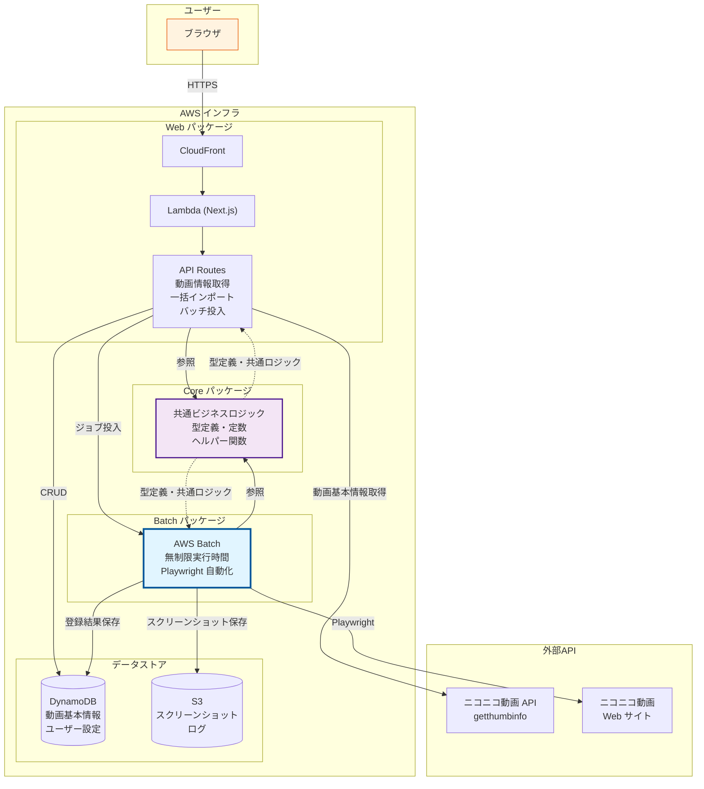
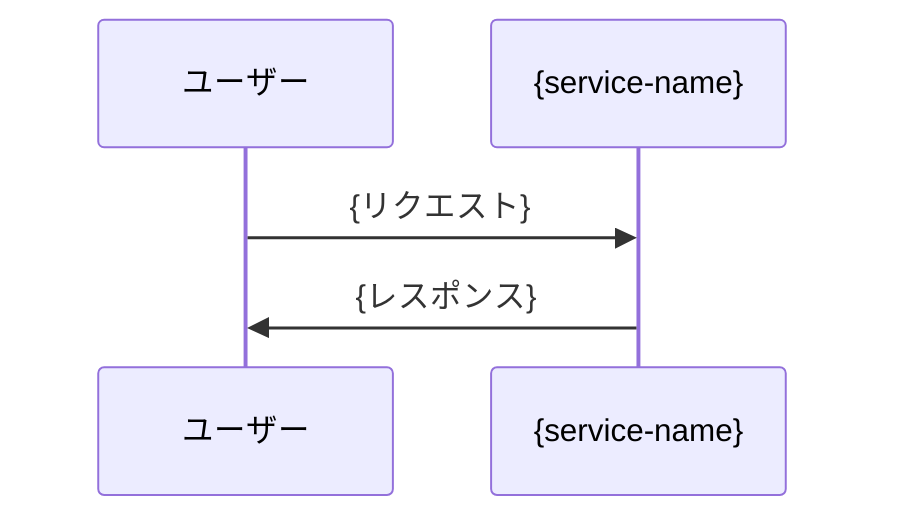

# niconico-mylist-assistant アーキテクチャ設計書

---

## 1. システム概要

niconico-mylist-assistant は、ニコニコ動画のマイリスト登録作業を自動化するサーバーレスアプリケーションです。ユーザーは Web UI（Next.js）を通じて条件を指定し、DynamoDB に保存された動画データから最大 100 個をランダムに選択してマイリストに一括登録できます。**AWS Batch** を採用することで Lambda の 15 分制限を回避し、各動画間に最低 2 秒の待機時間を設けることでニコニコ動画サーバーへの配慮を徹底しています。

本システムは **3 パッケージ構成（core / web / batch）** により、ビジネスロジック、Web フロントエンド、バッチ処理をそれぞれ独立したモジュールとして管理します。core パッケージは完全フレームワーク非依存の TypeScript ライブラリとして設計され、web パッケージ（Next.js）と batch パッケージ（Playwright 自動化）の両方から共通ロジックを再利用します。これにより、テストの容易性と保守性を確保しています。

### 1.1 全体構成図



---

## 2. 技術スタック

<!-- 記入ガイド: 使用する技術を表形式で記述してください -->

### 2.1 フロントエンド

| カテゴリ       | 技術          | 用途                             |
| -------------- | ------------- | -------------------------------- |
| フレームワーク | Next.js 16    | React ベースのフルスタック開発   |
| UI ライブラリ  | React 19      | ユーザーインターフェース構築     |
| コンポーネント | Material-UI 7 | マテリアルデザインコンポーネント |
| 言語           | TypeScript    | 型安全な開発                     |

### 2.2 バックエンド

| カテゴリ       | 技術       | 用途                       |
| -------------- | ---------- | -------------------------- |
| ランタイム     | Node.js 20 | JavaScript 実行環境        |
| 言語           | TypeScript | 型安全なサーバーサイド開発 |
| フレームワーク | Next.js 16 | API Routes による API 開発 |

### 2.3 インフラ

| カテゴリ           | 技術                 | 用途                             |
| ------------------ | -------------------- | -------------------------------- |
| コンピューティング | AWS Lambda           | Next.js アプリケーションの実行   |
| バッチ処理         | AWS Batch            | 長時間実行（マイリスト一括登録） |
| データベース       | Amazon DynamoDB      | 動画基本情報・ユーザー設定の保存 |
| ストレージ         | Amazon S3            | スクリーンショット・ログ保存     |
| CDN                | Amazon CloudFront    | コンテンツ配信                   |
| IaC                | AWS CDK (TypeScript) | インフラ定義                     |

### 2.4 開発ツール

| カテゴリ             | 技術             | 用途                |
| -------------------- | ---------------- | ------------------- |
| パッケージマネージャ | npm              | 依存関係管理        |
| リンター             | ESLint           | コード品質チェック  |
| フォーマッター       | Prettier         | コード整形          |
| テスト               | Jest, Playwright | ユニット・E2Eテスト |

---

## 3. アーキテクチャパターン

<!-- 記入ガイド: データフロー、コンポーネント構成、設計パターンを記述してください -->

### 3.1 データフロー

<!-- 記入ガイド: Mermaid シーケンス図でデータフローを記述してください。複雑な場合は Draw.io を使用 -->



<!-- Draw.io を使用する場合は、上記 Mermaid を以下の形式に置き換えてください -->
<!--  -->

### 3.2 コンポーネント構成

<!-- 記入ガイド: 主要なコンポーネントとその責務を記述してください -->

---

## 4. データモデル

<!-- 記入ガイド: データベーススキーマ、API型定義を記述してください -->

### 4.1 データベーススキーマ

<!-- [任意] データベースを使用する場合のみ -->
<!-- 記入ガイド: テーブル構造、主キー、インデックスを記述してください -->

### 4.2 API 型定義

<!-- [任意] APIを提供する場合のみ -->
<!-- 記入ガイド: 主要なリクエスト/レスポンス型を記述してください -->

---

## 5. インフラ構成

<!-- 記入ガイド: AWS リソース、ネットワーク設計を記述してください -->

### 5.1 AWS 構成図

<!-- 記入ガイド: Mermaid で AWS 構成を記述してください。複雑な場合は Draw.io を使用 -->

```mermaid
graph TD
    User[ユーザー] --> CF[CloudFront]
    CF --> Lambda[Lambda]
    Lambda --> DB[{データベース}]
```

<!-- Draw.io を使用する場合は、上記 Mermaid を以下の形式に置き換えてください -->
<!--  -->

### 5.2 リソース一覧

<!-- 記入ガイド: 使用する AWS リソースを表形式で記述してください -->

| リソース     | 説明   | 設定         |
| ------------ | ------ | ------------ |
| {リソース名} | {説明} | {主要な設定} |

### 5.3 ネットワーク設計

<!-- 記入ガイド: VPC、サブネット、セキュリティグループなどを記述してください -->

---

## 6. セキュリティ設計

<!-- 記入ガイド: 認証、認可、データ暗号化、セキュリティヘッダーなどを記述してください -->

### 6.1 認証・認可

### 6.2 データ暗号化

### 6.3 セキュリティヘッダー

### 6.4 その他のセキュリティ対策

---

## 7. 技術選定理由

<!-- 記入ガイド: 主要な技術の選定理由、代替案との比較を記述してください -->

### {技術名}

**理由**:

- {理由1}
- {理由2}

**代替案との比較**:

- {代替案1}: {比較結果}
- {代替案2}: {比較結果}

---

## 8. 制約事項

<!-- 記入ガイド: 技術的制約、運用制約を記述してください -->

### 8.1 技術的制約

### 8.2 運用制約

---

## 9. 将来拡張

<!-- 記入ガイド: 将来的に検討する機能や改善を記述してください -->
<!-- 記入例: 現在のスコープ外だが、将来的に実装を検討する機能や改善点をリストアップ -->

### 検討事項

- {拡張機能1}
- {拡張機能2}
- {改善案1}
