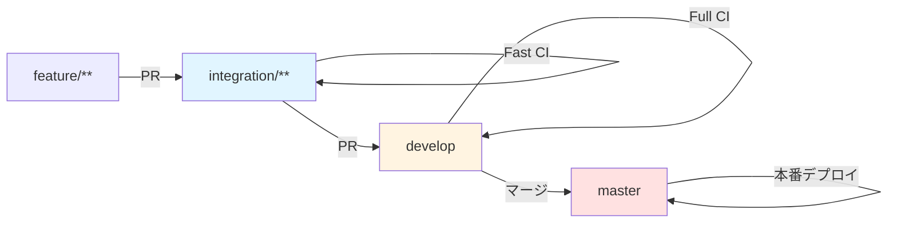

# niconico-mylist-assistant デプロイ・運用マニュアル

本ドキュメントは、niconico-mylist-assistant のデプロイと運用に関する手順を説明します。

---

## 1. 環境構成

### 1.1 環境一覧

| 環境        | 用途                         | デプロイ元ブランチ          | URL                                              |
| ----------- | ---------------------------- | --------------------------- | ------------------------------------------------ |
| dev (開発)  | 開発・検証用                 | `develop`, `integration/**` | `https://dev-niconico-mylist-assistant.nagiyu.com` |
| prod (本番) | 本番運用                     | `master`                    | `https://niconico-mylist-assistant.nagiyu.com`     |

### 1.2 リソース構成

**主要リソース**:

- **Lambda**: Next.js アプリケーション実行（VPC 外）
- **AWS Batch (Fargate)**: マイリスト登録バッチ処理（共有 VPC）
- **DynamoDB**: 動画基本情報・ユーザー設定・ジョブステータス
- **ECR**: Lambda / Batch 用コンテナイメージ
- **CloudFront**: CDN・HTTPS 終端
- **CloudWatch Logs**: アプリケーションログ
- **Secrets Manager**: 暗号化キー、テスト用アカウント情報

**インフラ定義の場所**:

- CDK スタック: `infra/niconico-mylist-assistant/`

### 1.3 環境ごとのリソース名

| リソース                  | dev 環境                                            | prod 環境                                             |
| ------------------------- | --------------------------------------------------- | ----------------------------------------------------- |
| Lambda 関数               | `niconico-mylist-assistant-web-dev`                 | `niconico-mylist-assistant-web-prod`                  |
| ECR (web)                 | `niconico-mylist-assistant-web-dev`                 | `niconico-mylist-assistant-web-prod`                  |
| ECR (batch)               | `niconico-mylist-assistant-batch-dev`               | `niconico-mylist-assistant-batch-prod`                |
| Batch Job Definition      | `niconico-mylist-assistant-batch-job-dev`           | `niconico-mylist-assistant-batch-job-prod`            |
| Batch Job Queue           | `niconico-mylist-assistant-queue-dev`               | `niconico-mylist-assistant-queue-prod`                |
| Batch Compute Environment | `niconico-mylist-assistant-compute-dev`             | `niconico-mylist-assistant-compute-prod`              |
| セキュリティグループ      | `niconico-mylist-assistant-batch-sg-dev`            | `niconico-mylist-assistant-batch-sg-prod`             |
| DynamoDB テーブル         | `nagiyu-niconico-mylist-assistant-dynamodb-dev`     | `nagiyu-niconico-mylist-assistant-dynamodb-prod`      |
| CloudWatch Logs (Lambda)  | `/aws/lambda/niconico-mylist-assistant-web-dev`     | `/aws/lambda/niconico-mylist-assistant-web-prod`      |
| CloudWatch Logs (Batch)   | `/aws/batch/niconico-mylist-assistant-dev`          | `/aws/batch/niconico-mylist-assistant-prod`           |

---

## 2. 前提条件

### 2.1 共有インフラ

以下がデプロイ済みであることを確認してください:

- [ ] **VPC**: `nagiyu-{env}-vpc` - [共有インフラ: VPC](../../docs/infra/shared/vpc.md) 参照
- [ ] **ACM 証明書** (CloudFront 用): [共有インフラ: ACM](../../docs/infra/shared/acm.md) 参照

### 2.2 必要なツール

- Node.js
- AWS CLI
- Docker

### 2.3 認証情報

GitHub Actions で自動デプロイを行うには、以下の GitHub Secrets が必要です:

| Name                    | 説明                                   | 設定済み                   |
| ----------------------- | -------------------------------------- | -------------------------- |
| `AWS_ACCESS_KEY_ID`     | IAM ユーザーのアクセスキー ID          | ✓ (共通インフラで設定済み) |
| `AWS_SECRET_ACCESS_KEY` | IAM ユーザーのシークレットアクセスキー | ✓ (共通インフラで設定済み) |
| `AWS_REGION`            | デプロイ先リージョン (`us-east-1`)     | ✓ (共通インフラで設定済み) |
| `AWS_ACCOUNT_ID`        | AWS アカウント ID                      | ✓ (共通インフラで設定済み) |

---

## 3. 初回セットアップ

### 3.1 手順概要

1. **Secrets Manager にシークレット作成**: テスト用アカウント情報を手動で作成（暗号化キーは CDK で自動生成）
2. **ECR リポジトリ作成**: コンテナイメージ格納用リポジトリの作成（CDK デプロイ）
3. **Docker イメージビルド**: web / batch のコンテナイメージを作成
4. **インフラデプロイ**: Lambda, CloudFront, Batch などのリソースをデプロイ
5. **動作確認**: ヘルスチェック・機能確認

### 3.2 Secrets Manager の設定

**注**: 暗号化キー（`niconico-mylist-assistant/shared-secret-key-{env}`）は SecretsStack により CDK デプロイ時に自動生成されます。手動で作成する必要はありません。

テスト用ニコニコアカウント（CI 統合テスト用）のみ、以下のコマンドで手動作成してください:

```bash
# テスト用ニコニコアカウント（CI 統合テスト用）
aws secretsmanager create-secret \
    --name niconico-mylist-assistant/test-account \
    --secret-string '{"email":"test@example.com","password":"your-password"}' \
    --region us-east-1
```

### 3.3 CDK スタック構成

本サービスは Auth に倣い、リソースごとにスタックを分割しています。

| スタック名 (dev)                                | スタック名 (prod)                                | 内容                                       |
| ----------------------------------------------- | ------------------------------------------------ | ------------------------------------------ |
| `NagiyuNiconicoMylistAssistantDynamoDBDev`      | `NagiyuNiconicoMylistAssistantDynamoDBProd`      | DynamoDB テーブル                          |
| `NagiyuNiconicoMylistAssistantSecretsDev`       | `NagiyuNiconicoMylistAssistantSecretsProd`       | Secrets Manager（暗号化キー自動生成）       |
| `NagiyuNiconicoMylistAssistantWebECRDev`        | `NagiyuNiconicoMylistAssistantWebECRProd`        | ECR リポジトリ（web）                      |
| `NagiyuNiconicoMylistAssistantBatchECRDev`      | `NagiyuNiconicoMylistAssistantBatchECRProd`      | ECR リポジトリ（batch）                    |
| `NagiyuNiconicoMylistAssistantLambdaDev`        | `NagiyuNiconicoMylistAssistantLambdaProd`        | Lambda 関数                                |
| `NagiyuNiconicoMylistAssistantCloudFrontDev`    | `NagiyuNiconicoMylistAssistantCloudFrontProd`    | CloudFront ディストリビューション          |
| `NagiyuNiconicoMylistAssistantBatchDev`         | `NagiyuNiconicoMylistAssistantBatchProd`         | Batch (Compute Env, Job Queue, Job Definition, SG) |
| `NagiyuNiconicoMylistAssistantIAMDev`           | `NagiyuNiconicoMylistAssistantIAMProd`           | IAM リソース（開発用ユーザー）             |

**CDK ディレクトリ構成**:

```
infra/niconico-mylist-assistant/
├── bin/
│   └── niconico-mylist-assistant.ts
├── lib/
│   ├── dynamodb-stack.ts
│   ├── secrets-stack.ts          # Secrets Manager スタック（暗号化キー）
│   ├── ecr-stacks.ts              # ECR スタック（web / batch）
│   ├── lambda-stack.ts
│   ├── cloudfront-stack.ts
│   ├── batch-stack.ts
│   ├── iam-stack.ts              # IAM スタック（開発用ユーザー）
│   └── policies/
│       ├── web-runtime-policy.ts   # Web 用ランタイムポリシー
│       └── batch-runtime-policy.ts # Batch 用ランタイムポリシー
├── package.json
├── cdk.json
└── tsconfig.json
```

### 3.4 インフラのデプロイ（手動）

#### DynamoDB, Secrets, ECR のデプロイ

**注**: SecretsStack は暗号化キーを自動生成します。初回デプロイ時に実行してください。

```bash
# 開発環境
npm run deploy --workspace=@nagiyu/infra-niconico-mylist-assistant -- \
    --context env=dev \
    "NagiyuNiconicoMylistAssistantDynamoDBDev" \
    "NagiyuNiconicoMylistAssistantSecretsDev" \
    "NagiyuNiconicoMylistAssistantWebECRDev" \
    "NagiyuNiconicoMylistAssistantBatchECRDev" \
    --require-approval never

# 本番環境
npm run deploy --workspace=@nagiyu/infra-niconico-mylist-assistant -- \
    --context env=prod \
    "NagiyuNiconicoMylistAssistantDynamoDBProd" \
    "NagiyuNiconicoMylistAssistantSecretsProd" \
    "NagiyuNiconicoMylistAssistantWebECRProd" \
    "NagiyuNiconicoMylistAssistantBatchECRProd" \
    --require-approval never
```

### 3.5 Docker イメージのビルドとプッシュ

#### web パッケージ（Lambda 用）

```bash
# 1. ECR にログイン
aws ecr get-login-password --region us-east-1 | \
    docker login --username AWS --password-stdin <AWS_ACCOUNT_ID>.dkr.ecr.us-east-1.amazonaws.com

# 2. イメージのビルド（モノレポルートから実行）
docker build -t niconico-mylist-assistant-web:latest \
    -f services/niconico-mylist-assistant/web/Dockerfile .

# 3. タグ付け & プッシュ
docker tag niconico-mylist-assistant-web:latest \
    <AWS_ACCOUNT_ID>.dkr.ecr.us-east-1.amazonaws.com/niconico-mylist-assistant-web-dev:latest
docker push <AWS_ACCOUNT_ID>.dkr.ecr.us-east-1.amazonaws.com/niconico-mylist-assistant-web-dev:latest
```

#### batch パッケージ（AWS Batch 用）

**注**: multi-stage buildにより、Docker内部で依存関係のインストールとビルドが自動的に実行されます。

```bash
# 1. イメージのビルド（モノレポルートから実行）
docker build -t niconico-mylist-assistant-batch:latest \
    -f services/niconico-mylist-assistant/batch/Dockerfile .

# 2. タグ付け & プッシュ
docker tag niconico-mylist-assistant-batch:latest \
    <AWS_ACCOUNT_ID>.dkr.ecr.us-east-1.amazonaws.com/niconico-mylist-assistant-batch-dev:latest
docker push <AWS_ACCOUNT_ID>.dkr.ecr.us-east-1.amazonaws.com/niconico-mylist-assistant-batch-dev:latest
```

### 3.6 アプリケーションリソースのデプロイ

**注意**: Lambda など認証を必要とするリソースのデプロイ時には、`nextAuthSecret` コンテキストパラメータを指定する必要があります。Auth サービスで使用している AUTH_SECRET と同じ値を使用してください。

```bash
# 開発環境（全スタック）
# nextAuthSecret は Auth サービスの AUTH_SECRET と同じ値を指定
npm run deploy --workspace=@nagiyu/infra-niconico-mylist-assistant -- \
    --context env=dev \
    --context nextAuthSecret=<AUTH_SECRET> \
    --all \
    --require-approval never

# 本番環境（全スタック）
npm run deploy --workspace=@nagiyu/infra-niconico-mylist-assistant -- \
    --context env=prod \
    --context nextAuthSecret=<AUTH_SECRET> \
    --all \
    --require-approval never
```

### 3.7 動作確認

```bash
# Lambda 関数の確認
aws lambda get-function \
    --function-name niconico-mylist-assistant-web-dev \
    --region us-east-1

# ヘルスチェック
curl https://dev-niconico-mylist-assistant.nagiyu.com/api/health
```

---

## 4. CI/CD パイプライン

### 4.1 ワークフロー概要

niconico-mylist-assistant では、**2段階CI戦略** により品質とスピードのバランスを実現しています。

**2段階CI戦略の比較**:

| 項目 | Fast CI | Full CI |
|------|---------|---------|
| **トリガー** | `integration/**` ブランチへのPR | `develop` ブランチへのPR |
| **実行時間** | 約 5-10 分 | 約 15-20 分 |
| **E2Eテスト** | chromium-mobile のみ | 全デバイス（chromium-desktop, chromium-mobile, webkit-mobile） |
| **カバレッジチェック** | スキップ（test は実行） | 80%未満で失敗 |
| **batch統合テスト** | スキップ | 実行（テスト専用アカウント使用） |
| **目的** | 開発中の素早いフィードバック | マージ前の完全な品質保証 |

**ジョブ依存関係**: 詳細なジョブ依存関係の設計については [testing.md セクション9.2](./testing.md#92-ジョブ依存関係needsの設計) を参照してください。

#### GitHub Actions ワークフロー

#### 1. 高速検証ワークフロー (`.github/workflows/niconico-mylist-assistant-verify-fast.yml`)

**目的**: integration/\*\* ブランチへのプルリクエスト時に素早いフィードバックを提供（約 5-10 分）

**トリガー条件**:

```yaml
on:
  pull_request:
    branches:
      - integration/**
    paths:
      - 'services/niconico-mylist-assistant/**'
      - 'libs/**'
      - 'infra/niconico-mylist-assistant/**'
      - 'package.json'
      - 'package-lock.json'
      - '.github/workflows/niconico-mylist-assistant-verify-fast.yml'
```

**標準ジョブ構成**:

| ジョブ名 | 説明 |
|---------|------|
| lint | ESLint によるコード品質チェック |
| format-check | Prettier によるフォーマットチェック |
| build-core | core パッケージのビルド検証 |
| build-web | web パッケージのビルド検証 |
| build-batch | batch パッケージのビルド検証 |
| build-infra | インフラ定義のビルド検証 |
| synth-infra | CDK スタックの synthesize |
| docker-build-web | web の Docker イメージビルド |
| docker-build-batch | batch の Docker イメージビルド |
| test-core | core ユニットテスト実行 |
| test-batch | batch ユニットテスト実行 |
| e2e-test-web | E2E テスト（**chromium-mobile のみ**） |
| report | 全ジョブの結果を PR にコメント |

#### 2. 完全検証ワークフロー (`.github/workflows/niconico-mylist-assistant-verify-full.yml`)

**目的**: develop ブランチへのプルリクエスト時に完全な品質検証を実施（約 15-20 分）

**トリガー条件**:

```yaml
on:
  pull_request:
    branches:
      - develop
    paths:
      - 'services/niconico-mylist-assistant/**'
      - 'libs/**'
      - 'infra/niconico-mylist-assistant/**'
      - 'package.json'
      - 'package-lock.json'
      - '.github/workflows/niconico-mylist-assistant-verify-full.yml'
```

**標準ジョブ構成**:

| ジョブ名 | 説明 |
|---------|------|
| lint | ESLint によるコード品質チェック |
| format-check | Prettier によるフォーマットチェック |
| build-core | core パッケージのビルド検証 |
| build-web | web パッケージのビルド検証 |
| build-batch | batch パッケージのビルド検証 |
| build-infra | インフラ定義のビルド検証 |
| synth-infra | CDK スタックの synthesize |
| docker-build-web | web の Docker イメージビルド |
| docker-build-batch | batch の Docker イメージビルド |
| test-core | core ユニットテスト実行 |
| test-batch | batch ユニットテスト実行 |
| **coverage** | **カバレッジチェック（80%未満で失敗）** |
| e2e-test-web | E2E テスト（**全デバイス**: chromium-desktop, chromium-mobile, webkit-mobile） |
| test-batch-integration | batch 統合テスト（実環境、テスト専用アカウント使用） |
| report | 全ジョブの結果を PR にコメント |

**Fast CI との主な違い**:
- ✅ **coverage** ジョブが追加され、カバレッジ80%未満で失敗
- ✅ **e2e-test-web** が全デバイスで実行（Fast CI は chromium-mobile のみ）
- ✅ **test-batch-integration** が追加され、実環境での統合テストを実行

#### 3. デプロイワークフロー (`.github/workflows/niconico-mylist-assistant-deploy.yml`)

**目的**: develop, integration/\*\*, master ブランチへのプッシュ時に自動デプロイ

**トリガー条件**:

```yaml
on:
  push:
    branches:
      - develop
      - integration/**
      - master
    paths:
      - 'services/niconico-mylist-assistant/**'
      - 'infra/niconico-mylist-assistant/**'
      - 'libs/**'
      - 'package.json'
      - 'package-lock.json'
      - '.github/workflows/niconico-mylist-assistant-deploy.yml'
```

**ジョブ構成**:

1. **prepare-infrastructure**: DynamoDB, ECR (Web/Batch) の CDK スタックデプロイ
2. **build-web**: Web Docker イメージのビルドと ECR へのプッシュ（latest + コミットハッシュ）
3. **build-batch**: Batch Docker イメージのビルドと ECR へのプッシュ（latest + コミットハッシュ）
4. **deploy**: Lambda, CloudFront, Batch の CDK デプロイ + Lambda イメージ更新
5. **verify**: デプロイ後のヘルスチェックと結果表示

**バージョンタグ管理**:
- 各イメージは `latest` タグと `<commit-sha>` タグの両方でプッシュされます
- Lambda は常に `latest` タグを使用して更新されます

### 4.2 ブランチ戦略とデプロイフロー



| ブランチ         | 環境 | PR 検証    | 自動デプロイ |
| ---------------- | ---- | ---------- | ------------ |
| `develop`        | 開発 | ✅ Full CI | ✅           |
| `integration/**` | 開発 | ✅ Fast CI | ✅           |
| `master`         | 本番 | -          | ✅           |

### 4.3 GitHub Secrets の設定

GitHub リポジトリの Settings → Secrets and variables → Actions で以下を確認:

| Name                    | 説明                                   | 設定済み                   |
| ----------------------- | -------------------------------------- | -------------------------- |
| `AWS_ACCESS_KEY_ID`     | IAM ユーザーのアクセスキー ID          | ✓ (共通インフラで設定済み) |
| `AWS_SECRET_ACCESS_KEY` | IAM ユーザーのシークレットアクセスキー | ✓ (共通インフラで設定済み) |
| `AWS_REGION`            | デプロイ先リージョン                   | ✓ (共通インフラで設定済み) |

---

## 5. 手動デプロイ

### 5.1 Docker イメージの手動デプロイ

```bash
# 1. ECR ログイン
aws ecr get-login-password --region us-east-1 | \
    docker login --username AWS --password-stdin <AWS_ACCOUNT_ID>.dkr.ecr.us-east-1.amazonaws.com

# 2. web イメージのビルド & プッシュ
docker build -t niconico-mylist-assistant-web:latest \
    -f services/niconico-mylist-assistant/web/Dockerfile .
docker tag niconico-mylist-assistant-web:latest \
    <AWS_ACCOUNT_ID>.dkr.ecr.us-east-1.amazonaws.com/niconico-mylist-assistant-web-dev:latest
docker push <AWS_ACCOUNT_ID>.dkr.ecr.us-east-1.amazonaws.com/niconico-mylist-assistant-web-dev:latest

# 3. batch イメージのビルド & プッシュ
docker build -t niconico-mylist-assistant-batch:latest \
    -f services/niconico-mylist-assistant/batch/Dockerfile .
docker tag niconico-mylist-assistant-batch:latest \
    <AWS_ACCOUNT_ID>.dkr.ecr.us-east-1.amazonaws.com/niconico-mylist-assistant-batch-dev:latest
docker push <AWS_ACCOUNT_ID>.dkr.ecr.us-east-1.amazonaws.com/niconico-mylist-assistant-batch-dev:latest
```

### 5.2 Lambda 関数の手動更新

```bash
aws lambda update-function-code \
    --function-name niconico-mylist-assistant-web-dev \
    --image-uri <AWS_ACCOUNT_ID>.dkr.ecr.us-east-1.amazonaws.com/niconico-mylist-assistant-web-dev:latest \
    --region us-east-1
```

---

## 6. 環境変数管理

### 6.1 環境変数一覧

#### Lambda 環境変数

| 環境変数               | 説明                       | 設定方法          |
| ---------------------- | -------------------------- | ----------------- |
| `DYNAMODB_TABLE_NAME`  | DynamoDB テーブル名        | CDK で自動設定    |
| `SHARED_SECRET_KEY`    | パスワード暗号化キー       | Secrets Manager → 環境変数 |
| `BATCH_JOB_QUEUE`      | Batch Job Queue ARN        | CDK で自動設定    |
| `BATCH_JOB_DEFINITION` | Batch Job Definition ARN   | CDK で自動設定    |
| `AUTH_SECRET`          | NextAuth 認証シークレット  | CDK でコンテキストパラメータから設定 |
| `AUTH_URL`             | Auth サービス URL          | CDK で自動設定（環境別） |
| `NEXT_PUBLIC_AUTH_URL` | Auth サービス URL（公開用）| CDK で自動設定（環境別） |
| `APP_URL`              | アプリケーション URL       | CDK で自動設定（環境別） |

#### Batch 環境変数

| 環境変数               | 説明                       | 設定方法          |
| ---------------------- | -------------------------- | ----------------- |
| `DYNAMODB_TABLE_NAME`  | DynamoDB テーブル名        | CDK で自動設定    |
| `SHARED_SECRET_KEY`    | パスワード復号キー         | Secrets Manager → 環境変数 |

### 6.2 リソース設定

#### Lambda 設定

| 項目                 | 設定値   |
| -------------------- | -------- |
| メモリサイズ         | 1024 MB  |
| タイムアウト         | 30 秒    |
| 予約済み同時実行数   | 設定なし |

#### Batch 設定

| 項目           | 設定値          |
| -------------- | --------------- |
| vCPU           | 0.25            |
| メモリ         | 512 MB          |
| タイムアウト   | 1800 秒（30 分）|
| リトライ回数   | 1               |

---

## 7. ログ管理・監視

### 7.1 ログの確認

**Lambda ログ**:

- ロググループ: `/aws/lambda/niconico-mylist-assistant-web-{env}`
- 保持期間: 7 日

**Batch ログ**:

- ロググループ: `/aws/batch/niconico-mylist-assistant-{env}`
- 保持期間: 7 日

**ログの確認方法**:

```bash
# Lambda ログのリアルタイム確認
aws logs tail /aws/lambda/niconico-mylist-assistant-web-dev --follow

# Batch ログの確認
aws logs tail /aws/batch/niconico-mylist-assistant-dev --follow

# 特定期間のログ検索
aws logs filter-log-events \
    --log-group-name /aws/lambda/niconico-mylist-assistant-web-dev \
    --start-time $(date -d '1 hour ago' +%s)000 \
    --filter-pattern "ERROR"
```

### 7.2 メトリクスとアラート

**Lambda メトリクス**:

- 実行時間 (Duration)
- エラー率 (Errors)
- 同時実行数 (ConcurrentExecutions)
- スロットル (Throttles)

**Batch メトリクス**:

- ジョブ数（成功/失敗）
- 実行時間

**アラート設定**: 初期段階では設定なし。必要に応じて後から追加。

---

## 8. 運用手順

### 8.1 バージョン管理

#### バージョン番号のルール

本プロジェクトは [Semantic Versioning](https://semver.org/) に準拠します:

- **メジャー (X.0.0)**: 破壊的変更
- **マイナー (0.X.0)**: 新機能追加（後方互換性あり）
- **パッチ (0.0.X)**: バグ修正

#### バージョン管理の Single Source of Truth

**`services/niconico-mylist-assistant/package.json` の `version` フィールドがすべてのバージョン情報の唯一の真実の情報源です。**

#### バージョン更新手順

```bash
# パッチバージョンアップ（例: 1.0.0 → 1.0.1）
npm version patch -w niconico-mylist-assistant

# マイナーバージョンアップ（例: 1.0.0 → 1.1.0）
npm version minor -w niconico-mylist-assistant

# メジャーバージョンアップ（例: 1.0.0 → 2.0.0）
npm version major -w niconico-mylist-assistant
```

**注**: `npm version` コマンドは自動的に Git タグとコミットを作成します。

### 8.2 スケーリング対応

Lambda は自動スケーリングされます。必要に応じて以下を調整:

- メモリサイズ: 1024 MB（初期値）
- タイムアウト: 30 秒（初期値）
- 予約済み同時実行数: 設定なし（初期値）

Batch は必要に応じて以下を調整:

- vCPU: 0.25（初期値）
- メモリ: 512 MB（初期値）

### 8.3 セキュリティアップデート

依存パッケージの定期的な更新を実施してください。

```bash
# セキュリティ脆弱性のチェック
npm audit

# 脆弱性の自動修正
npm audit fix

# 破壊的変更を含む修正
npm audit fix --force
```

---

## 9. 障害対応

### 9.1 ロールバック手順

#### GitHub Actions からのロールバック

1. 前のコミットに戻す
2. 再度プッシュして自動デプロイを実行

```bash
git revert HEAD
git push origin <branch-name>
```

#### 手動ロールバック

```bash
# 前のイメージタグを確認
aws ecr describe-images \
    --repository-name niconico-mylist-assistant-web-dev \
    --region us-east-1

# 前のイメージタグを指定してロールバック
aws lambda update-function-code \
    --function-name niconico-mylist-assistant-web-dev \
    --image-uri <AWS_ACCOUNT_ID>.dkr.ecr.us-east-1.amazonaws.com/niconico-mylist-assistant-web-dev:<PREVIOUS_TAG> \
    --region us-east-1
```

### 9.2 よくある障害と対処法

#### デプロイが失敗する

**症状**: GitHub Actions のワークフローが失敗する

**原因と対処**:

- ECR ログインエラー → IAM ロールの権限を確認
- Lambda 更新エラー → Lambda 関数が存在するか確認
- ヘルスチェック失敗 → エンドポイントの実装を確認

#### Lambda が起動しない

**症状**: Function URL にアクセスできない

**原因と対処**:

- Docker イメージのビルドエラー → ローカルでイメージをビルドしてテスト
- 環境変数の設定ミス → Lambda の環境変数を確認
- メモリ不足 → Lambda のメモリサイズを増やす

#### Batch ジョブが失敗する

**症状**: マイリスト登録が完了しない

**原因と対処**:

- ニコニコ動画のログイン失敗 → アカウント情報を確認
- HTML 構造の変更 → セレクタを更新
- タイムアウト → Batch のタイムアウト設定を確認

#### PR 検証ワークフローが失敗する

**症状**: プルリクエストのチェックが失敗する

**デバッグ方法**:

```bash
# ローカルで PR 検証と同じステップを実行

# 1. ビルド検証
npm run build -w niconico-mylist-assistant-core
npm run build -w niconico-mylist-assistant-web
npm run build -w niconico-mylist-assistant-batch

# 2. Docker ビルド検証
docker build -t niconico-mylist-assistant-web-test \
    -f services/niconico-mylist-assistant/web/Dockerfile .
docker build -t niconico-mylist-assistant-batch-test \
    -f services/niconico-mylist-assistant/batch/Dockerfile .

# 3. テスト実行
npm run test -w niconico-mylist-assistant-core

# 4. E2E テスト実行
npm run test:e2e -w niconico-mylist-assistant-web
```

---

## 10. 開発環境セットアップ

### 10.1 IAM 構成

本サービスでは、Web と Batch で実行ロールを分離し、それぞれに専用のマネージドポリシーを割り当てる設計を採用しています。開発用ユーザーには両方のポリシーがアタッチされます。

#### マネージドポリシー

| ポリシー名                                             | 用途                                     | 割り当て先                               |
| ------------------------------------------------------ | ---------------------------------------- | ---------------------------------------- |
| `niconico-mylist-assistant-web-runtime-{env}`          | DynamoDB 読み書き権限 (Query, GetItem, PutItem, UpdateItem, DeleteItem, Scan, BatchGetItem, BatchWriteItem)、AWS Batch ジョブ投入権限 (SubmitJob) | Web Lambda 実行ロール、開発用ユーザー    |
| `niconico-mylist-assistant-batch-runtime-{env}`        | DynamoDB 読み書き、CloudWatch Logs 書き込み | Batch ジョブロール、開発用ユーザー       |

#### 実行ロール

| リソース                  | 命名 (dev)                                             | アタッチされるポリシー                         |
| ------------------------- | ------------------------------------------------------ | ---------------------------------------------- |
| Web Lambda 実行ロール     | `niconico-mylist-assistant-web-execution-role-dev`     | `AWSLambdaBasicExecutionRole`, Web Runtime Policy |
| Batch ジョブロール        | `niconico-mylist-assistant-batch-job-role-dev`         | Batch Runtime Policy                           |
| 開発用 IAM ユーザー       | `niconico-mylist-assistant-dev-dev`                    | Web Runtime Policy, Batch Runtime Policy       |

**ポリシー分離の目的**:
- Web と Batch で異なる権限セットを適用（最小権限の原則）
- 開発用ユーザーは本番環境の Lambda/Batch と同じ権限でテスト可能
- マネージドポリシーとして定義することで、複数のリソース間で権限を共有

### 10.2 開発用 IAM ユーザーのセットアップ

1. CDK デプロイにより `niconico-mylist-assistant-dev-{env}` ユーザーが作成される（dev 環境のみ）
2. AWS コンソールでアクセスキーを手動発行
3. `aws configure --profile niconico-mylist-assistant-dev` で設定
4. `export AWS_PROFILE=niconico-mylist-assistant-dev` で使用

---

## 参考資料

- [GitHub Actions - OIDC を使用した AWS との連携](https://docs.github.com/ja/actions/deployment/security-hardening-your-deployments/configuring-openid-connect-in-amazon-web-services)
- [AWS Lambda - コンテナイメージを使用した関数の更新](https://docs.aws.amazon.com/lambda/latest/dg/gettingstarted-images.html)
- [プラットフォームブランチ戦略](../../docs/branching.md)
- [プラットフォーム開発ガイドライン](../../docs/development/rules.md)
- [共有インフラドキュメント](../../docs/infra/README.md)
