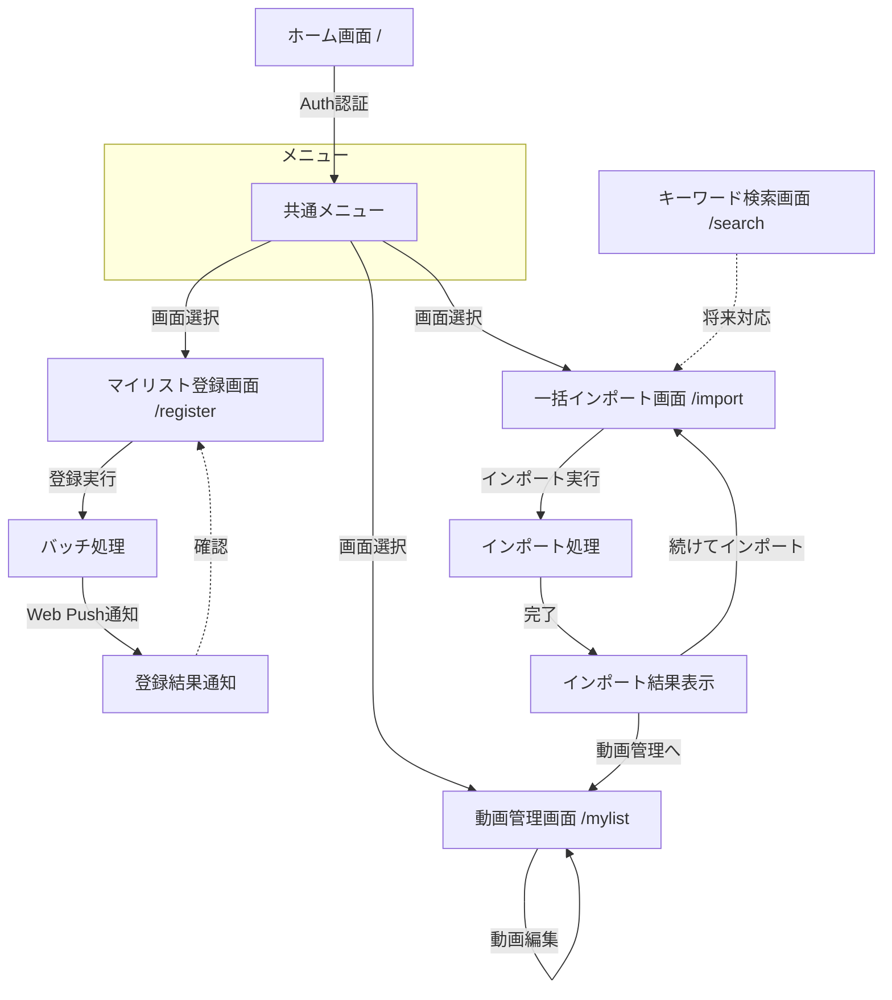

# niconico-mylist-assistant 要件定義書

---

## 1. ビジネス要件

### 1.1 背景・目的

#### 課題

ニコニコ動画で大量の動画をマイリストに登録する際、以下の課題がある:

- **手作業の負担**: 数十〜数百の動画を手動で登録するには、膨大な時間と労力がかかる
- **登録ミス**: 手作業によるミスや登録漏れが発生しやすい
- **条件指定の困難さ**: お気に入りの動画のみ、特定の条件で絞り込んで登録したいが、手動では煩雑

#### 既存実装からの移行

既存実装（Python + Selenium）は現在稼働しているが、以下の理由から TypeScript + Playwright への移行を決定:

1. **プラットフォーム統一**: 本プラットフォームは TypeScript で統一されており、Python との混在は保守性を低下させる
2. **型安全性**: TypeScript strict mode により、実行前にバグを検出でき、品質向上が期待できる
3. **メンテナンス性**: 単一言語での開発により、コードベース全体の保守が容易になる
4. **パフォーマンス**: Playwright は Selenium より高速で、モダンな API 設計により開発効率が向上する
5. **既存ノウハウの活用**: 本プラットフォームでは既に E2E テストに Playwright を採用しており、実績とノウハウが蓄積されている

#### 目的

本サービスは、ニコニコ動画のマイリスト登録作業を自動化し、以下を実現する:

- **作業効率化**: 手作業での登録時間を大幅に削減
- **登録精度の向上**: 自動化により、ミスや漏れをなくす
- **柔軟な条件指定**: お気に入りフラグ、スキップフラグなどによる条件指定を可能にする
- **プラットフォーム統一**: TypeScript への統一により、長期的な保守性を確保

### 1.2 対象ユーザー

#### プライマリーユーザー

**大量の動画をマイリスト登録したいユーザー**

- **ユースケース**:
    - ニコニコ動画で多数の動画をコレクションとして管理したい
    - 事前に登録しておいた動画リストから、条件を指定してマイリストに一括登録したい
    - お気に入りの動画のみ、またはスキップフラグを除いた動画のみを登録したい

- **ユーザー特性**:
    - ニコニコ動画のアカウントを持っている
    - 定期的にマイリスト登録を行う必要がある
    - 手作業での登録に時間を取られている
    - 技術的な知識は不要（Web UI で操作可能）

#### セカンダリーユーザー

本サービスは個人利用を想定しているため、セカンダリーユーザーは想定しない。

### 1.3 ビジネスゴール

#### 定量目標

- **一括登録可能動画数**: 最大 100 個の動画を 1 回の処理で登録可能
- **登録成功率**: 95% 以上の成功率を確保（ネットワークエラー等を除く）
- **動画基本情報取得時間**: 1 動画あたり平均 1 秒以内で情報を取得
- **一括インポート応答時間**: 10 動画のインポートを 10 秒以内で完了

#### 定性目標

1. **手作業時間の大幅削減**
    - 100 個の動画を手動で登録する場合、約 30 分〜1 時間かかるところを、自動化により待ち時間のみで完了
    - ユーザーは登録条件を指定してボタンを押すだけで済む

2. **安全性の優先**
    - **速度よりも安全性を重視**: ニコニコ動画のサーバーに過度な負荷をかけない
    - 各動画の登録間に最低 2 秒の待機時間を設けることで、サーバーへの配慮を徹底
    - リトライ機構は最大 3 回までに制限

3. **利便性の向上**
    - 条件指定による柔軟な登録（お気に入りのみ、スキップを除くなど）
    - 動画基本情報の一括インポート機能により、事前準備を効率化

4. **長期的な保守性の確保**
    - TypeScript への統一により、プラットフォーム全体で一貫した開発・保守が可能
    - 型安全性による品質向上と、既存ノウハウの活用

---

## 2. 機能要件

### 2.1 ユースケース

#### UC-001: マイリスト一括登録

- **概要**: 条件指定により DynamoDB から動画を選択し、ニコニコ動画のマイリストに自動登録する
- **アクター**: プライマリーユーザー（マイリスト登録を行いたいユーザー）
- **前提条件**:
    - ユーザーが Auth プロジェクトでログイン済み
    - DynamoDB に登録したい動画基本情報とユーザー設定が保存されている
    - ユーザーがニコニコ動画のアカウントを持っている
- **正常フロー**:
    1. ユーザーが登録条件を指定（「スキップを除く」「お気に入りのみ」など）
    2. システムが条件に合致する動画を DynamoDB から取得
    3. システムがランダムに最大 100 個を選択
    4. ユーザーがニコニコ動画のメールアドレスとパスワードを入力
    5. ユーザーが「登録開始」ボタンをクリック
    6. システムがアカウント情報を暗号化して AWS Batch ジョブに送信
    7. AWS Batch が Playwright で自動ログイン
    8. AWS Batch が既存のマイリスト動画を全て削除（マイリスト上限100件のため）
    9. AWS Batch が各動画をマイリストに登録（**各動画間に最低 2 秒待機**）
    10. システムが完了通知を Web Push で送信
    11. ユーザーが登録結果を確認
- **代替フロー**:
    - **3a**: 条件に合致する動画が 100 個未満の場合、取得したすべての動画を登録対象とする
    - **7a**: ユーザーのマイリストが存在しない場合、システムが自動的に新しいマイリストを作成する
    - **7b**: 既存のマイリスト（最初のマイリスト）が存在する場合、既存の全動画を削除してから新規登録を行う（マイリスト上限100件のため）
- **例外フロー**:
    - **4a**: ニコニコ動画のログインに失敗した場合、エラーメッセージを表示して処理を中断
    - **8a**: 動画登録中にネットワークエラーが発生した場合、最大 3 回までリトライ
    - **8b**: リトライ後も失敗した場合、該当動画をスキップして次の動画に進む
    - **8c**: 動画が削除されている、または非公開の場合、該当動画をスキップして次の動画に進む

#### UC-002: 動画一括インポート

- **概要**: 動画 ID を入力し、ニコニコ動画 API から動画基本情報を取得して DynamoDB に保存する
- **アクター**: プライマリーユーザー
- **前提条件**:
    - ユーザーが Auth プロジェクトでログイン済み
    - ユーザーが登録したい動画の ID を把握している
- **正常フロー**:
    1. ユーザーが動画 ID を改行区切りで入力（例: `sm12345678`）
    2. ユーザーが「インポート実行」ボタンをクリック
    3. システムが各動画 ID に対してニコニコ動画 API (`getthumbinfo`) を呼び出し
    4. システムが XML レスポンスから動画タイトルを取得
    5. システムが動画 ID とタイトル（動画基本情報）を DynamoDB に保存（重複チェック実施）
    6. システムがインポート結果を表示（成功数、スキップ数、失敗数）
- **代替フロー**:
    - **5a**: 既に同じ動画 ID が登録されている場合、スキップして次の動画に進む
- **例外フロー**:
    - **4a**: API 呼び出しが失敗した場合、該当動画をスキップして失敗数をカウント
    - **4b**: 動画が削除されている、または非公開の場合、該当動画をスキップして失敗数をカウント
    - **5a**: DynamoDB への保存が失敗した場合、エラーメッセージを表示して処理を中断

#### UC-003: ユーザー設定管理

- **概要**: 登録済み動画のお気に入りフラグ、スキップフラグ、メモを編集する
- **アクター**: プライマリーユーザー
- **前提条件**:
    - ユーザーが Auth プロジェクトでログイン済み
    - DynamoDB に編集対象の動画基本情報が保存されている
- **正常フロー**:
    1. ユーザーが動画管理画面を開く
    2. システムが DynamoDB からユーザーの動画一覧（動画基本情報 + ユーザー設定）を取得して表示
    3. ユーザーがお気に入りフラグをトグル、またはスキップフラグをトグル、またはメモを編集
    4. システムが変更内容（ユーザー設定）を DynamoDB に保存
    5. システムが保存完了メッセージを表示
- **代替フロー**:
    - **3a**: ユーザーが動画を削除する場合、確認ダイアログを表示してから DynamoDB から削除
- **例外フロー**:
    - **4a**: DynamoDB への保存が失敗した場合、エラーメッセージを表示して変更を破棄

#### UC-004: キーワード検索

- **概要**: Playwright でニコニコ動画を検索し、動画 ID とタイトルを抽出する（低優先度・将来対応）
- **アクター**: プライマリーユーザー
- **前提条件**:
    - ユーザーが Auth プロジェクトでログイン済み
- **正常フロー**:
    1. ユーザーが検索キーワードを入力
    2. ユーザーが「検索実行」ボタンをクリック
    3. システムが Playwright でニコニコ動画の検索ページにアクセス
    4. システムが検索結果から動画 ID とタイトルを抽出
    5. システムが抽出結果を表示（動画 ID、タイトル、サムネイル）
    6. ユーザーが登録したい動画を選択
    7. システムが選択された動画基本情報を DynamoDB に保存
- **代替フロー**:
    - なし
- **例外フロー**:
    - **3a**: ニコニコ動画へのアクセスに失敗した場合、エラーメッセージを表示
    - **4a**: HTML 構造が変更されて抽出に失敗した場合、エラーメッセージを表示

### 2.2 機能一覧

| 機能ID | 機能名                     | 説明                                                                                           | 優先度 |
| ------ | -------------------------- | ---------------------------------------------------------------------------------------------- | ------ |
| F-001  | マイリスト一括登録         | 条件指定により動画を選択し、AWS Batch でマイリストに自動登録                                  | 最優先 |
| F-002  | 登録条件指定               | スキップを除く、お気に入りのみなどの条件でフィルタリング                                      | 最優先 |
| F-003  | ランダム選択               | 条件に合致した動画から最大 100 個をランダムに選択                                              | 最優先 |
| F-004  | 動画一括インポート         | 動画 ID を改行区切りで入力し、ニコニコ動画 API から動画基本情報を取得して DynamoDB に保存      | 高     |
| F-005  | ユーザー設定管理（CRUD）   | 動画の作成・参照・更新・削除、お気に入りフラグ・スキップフラグ・メモの編集                     | 中     |
| F-006  | 動画一覧表示               | DynamoDB に登録された動画（動画基本情報 + ユーザー設定）を一覧表示                             | 中     |
| F-007  | 認証機能                   | Auth プロジェクトを使用したログイン・ログアウト                                                | 高     |
| F-008  | Web Push 通知              | バッチ処理完了時に通知を送信                                                                   | 中     |
| F-009  | キーワード検索             | Playwright でニコニコ動画を検索し、動画基本情報を抽出（将来対応）                              | 低     |
| F-010  | エラーハンドリング         | ネットワークエラー、API エラー、認証エラーなどを適切に処理し、ユーザーに通知                  | 高     |
| F-011  | 待機時間制御               | 各動画登録間に最低 2 秒の待機時間を設けることで、ニコニコ動画サーバーへの配慮を徹底           | 最優先 |
| F-012  | アカウント情報暗号化       | ニコニコアカウント情報を暗号化して送信し、バッチ処理内でのみ復号化                             | 高     |

---

## 3. 非機能要件

### 3.1 パフォーマンス要件

本サービスは**安全性を最優先**とし、ニコニコ動画のサーバーに過度な負荷をかけないことを重視します。

| 項目                         | 要件                                              | 備考                                                     |
| ---------------------------- | ------------------------------------------------- | -------------------------------------------------------- |
| 動画基本情報取得応答時間     | 10秒以内                                          | ニコニコ動画 API (`getthumbinfo`) の呼び出し             |
| 一括インポート応答時間       | 動画数に依存（1動画あたり平均1秒程度）            | API呼び出しとDynamoDB保存時間                            |
| 1動画あたりの登録時間        | 制限なし                                          | 安全性優先のため、速度よりも安定性を重視                 |
| **動画登録間の待機時間**     | **最低2秒（必須）**                               | **ニコニコ動画サーバーへの配慮（Rate Limiting対策）**    |
| バッチ処理タイムアウト       | 制限なし                                          | AWS Batch を使用することで Lambda の15分制限を回避       |
| 1回の登録可能動画数          | 最大100個                                         | マイリストの上限に合わせた設計                           |
| リトライ回数                 | 最大3回                                           | 過度なリトライを避け、失敗時はスキップして次に進む       |

**重要**: 本サービスは非公式ツールであるため、ニコニコ動画のサーバーに配慮し、**速度よりも安全性と安定性を優先**します。

### 3.2 セキュリティ要件

#### 認証

- **Google OAuth 認証**: Auth プロジェクトを使用したシングルサインオン
- **ユーザー識別**: Auth プロジェクトの UserID によるデータアクセス制御

#### ニコニコアカウント情報の保護

- **パスワード非保存**: ニコニコ動画のパスワードは DB に保存しない
- **暗号化送信**: フロントエンド → API Routes → AWS Batch の通信経路で暗号化
    - 環境変数 `SHARED_SECRET_KEY` を使用した暗号化
    - AWS Batch 内でのみ復号化
- **メモリ上での一時保持**: バッチ処理実行時のみメモリ上で保持し、処理終了後は即座に削除

#### データアクセス制御

- **ユーザー分離**: ユーザーは自分が登録した動画データ（動画基本情報 + ユーザー設定）のみアクセス可能
- **DynamoDB IAM制御**: IAM ロールによるアクセス制限

#### セキュリティ対策

- **XSS対策**: ユーザー入力のサニタイゼーション
- **CSRF対策**: Next.js の CSRF トークン保護
- **環境変数管理**: AWS Secrets Manager による機密情報管理

### 3.3 可用性要件

| 項目               | 要件              | 備考                                           |
| ------------------ | ----------------- | ---------------------------------------------- |
| 稼働率             | 99%以上           | AWS のサーバーレスアーキテクチャによる高可用性 |
| RTO (復旧目標時間) | 1時間以内         | CloudFormation による迅速な再デプロイ          |
| RPO (復旧目標時点) | リアルタイム      | DynamoDB の自動バックアップによるデータ保護    |

**考慮事項**:

- AWS Batch ジョブの失敗時は、ユーザーに Web Push 通知でエラーを報告
- ニコニコ動画側の障害やメンテナンスによる失敗は許容範囲内
- 個別動画の登録失敗時はスキップして次に進むことで、全体の処理を継続

### 3.4 保守性・拡張性要件

#### コード品質

- **TypeScript strict mode 必須**: 型安全性によるバグの早期発見
- **テストカバレッジ**: 80%以上を必須とする（ビジネスロジックを重点的にテスト）
- **ESLint**: プラットフォーム共通の Lint ルールに準拠
- **Prettier**: コードフォーマットの統一

#### ドキュメント

- **要件定義書**: 本ドキュメント
- **API仕様書**: OpenAPI 形式で記述
- **アーキテクチャドキュメント**: システム設計を明確に記述
- **README**: セットアップ手順、開発手順を記載

#### モジュール化

- **モノレポ構成**: Core、Web、Batch、Infra パッケージに分割
- **共通ライブラリ活用**: `@nagiyu/common`、`@nagiyu/browser`、`@nagiyu/ui` を活用
- **依存関係の一方向性**: `ui → browser → common` の方向性を保つ

#### 拡張ポイント

- **キーワード検索機能**: 将来的に Playwright による検索機能を追加可能
- **複数マイリスト対応**: 現在は最初のマイリストのみだが、将来的に複数対応可能
- **スケジュール実行**: 定期的な自動登録機能の追加も視野に入れた設計

### 3.5 その他の非機能要件

#### サーバーレスアーキテクチャ

- **Next.js on AWS Lambda**: フロントエンドとAPI Routes
- **AWS Batch**: 長時間実行が必要なマイリスト登録処理
- **DynamoDB**: 完全マネージドなNoSQLデータベース
- **CloudFront**: CDN による高速配信

#### スケーラビリティ

- **ユーザー数**: 現時点では個人利用を想定（同時ユーザー数: 数名程度）
- **将来的な拡張**: 複数ユーザーへの対応も視野に入れた設計
- **AWS の自動スケーリング**: Lambda、DynamoDB のオンデマンドスケーリング

#### 互換性

- **ブラウザ対応**: モダンブラウザ（Chrome、Firefox、Safari、Edge の最新版）
- **モバイル対応**: スマホファースト設計によるレスポンシブ対応
- **既存実装からの移行**: Python 版からのデータ移行は現時点でスコープ外

---

## 4. UI/UX 要件

本サービスは**スマホファースト**の設計を採用し、タッチ操作に最適化されたUIを提供します。

### 4.1 画面一覧

優先順位順に以下の画面を提供します:

| 画面名               | パス         | 説明                                                                 | 優先度 |
| -------------------- | ------------ | -------------------------------------------------------------------- | ------ |
| マイリスト登録画面   | `/register`  | 条件指定により動画を選択し、マイリストに一括登録するメイン機能画面 | 最優先 |
| 一括インポート画面   | `/import`    | 動画IDを入力し、ニコニコ動画APIから動画情報を取得して登録           | 高     |
| 動画管理画面         | `/mylist`    | 登録済み動画の一覧表示と、お気に入り・スキップフラグ・メモの編集   | 中     |
| ホーム画面           | `/`          | サービス概要とログイン                                               | 低     |
| キーワード検索画面   | `/search`    | Playwrightによるニコニコ動画検索（将来対応）                        | 低     |

### 4.2 画面遷移図

<!-- Draw.io での作成を推奨。後ほど手動で成形し .drawio.svg に変換するため、現時点では .drawio.svg のパスで記述 -->

<!-- 参考用 Mermaid (Draw.io 未作成時の暫定版) -->
<!--

-->

### 4.3 主要画面の UI 要件

#### マイリスト登録画面 (`/register`)

**概要**: 条件を指定して動画を選択し、ニコニコ動画のマイリストに一括登録する最重要画面

**主要UI要素**:

- **登録条件セクション**:
    - 「スキップを除く」チェックボックス（デフォルト: ON）
    - 「お気に入りのみ」チェックボックス（デフォルト: OFF）
    - 選択可能動画数の表示（例: 「条件に合致する動画: 250件 → ランダムで最大100件を選択」）
- **アカウント情報セクション**:
    - ニコニコ動画メールアドレス入力欄（type="email"）
    - ニコニコ動画パスワード入力欄（type="password"）
    - 注意書き: 「パスワードはデータベースに保存されません。暗号化してバッチ処理に送信されます。」
- **実行ボタン**:
    - 「登録開始」ボタン（プライマリカラー、大きめサイズ）
- **ステータス表示**:
    - バッチ処理の状態表示（待機中/実行中/完了/エラー）
    - ステータス確認ボタン（処理中のみ表示、手動で状態更新）

**インタラクション**:

- 条件変更時に選択可能動画数をリアルタイム更新
- 「登録開始」クリックでバッチジョブを投入し、Web Push通知を有効化
- バッチ処理完了時にWeb Push通知で結果を通知
- 処理中は他の操作をブロックせず、バックグラウンドで実行

**表示条件**: 認証済みユーザーのみアクセス可能

#### 一括インポート画面 (`/import`)

**概要**: 動画IDを入力し、ニコニコ動画APIから動画情報を取得してDynamoDBに保存

**主要UI要素**:

- **入力セクション**:
    - 動画ID入力欄（textarea、複数行対応、プレースホルダー: 「sm12345678\nsm87654321\n...」）
    - 入力例の表示
- **実行ボタン**:
    - 「インポート実行」ボタン（プライマリカラー）
- **結果表示セクション**:
    - 成功数、スキップ数、失敗数の表示
    - 詳細ログ（どの動画IDが成功/失敗したか）
    - 「動画管理画面へ」リンク

**インタラクション**:

- 「インポート実行」クリックで各動画IDに対してAPI呼び出し
- 進捗をリアルタイム表示（例: 「10 / 50 件処理中...」）
- 完了後に結果サマリーを表示
- エラー発生時も処理を継続し、最後に全結果を表示

**表示条件**: 認証済みユーザーのみアクセス可能

#### 動画管理画面 (`/mylist`)

**概要**: 登録済み動画の一覧表示と、お気に入り・スキップフラグ・メモの編集

**主要UI要素**:

- **動画一覧テーブル/カード**:
    - 動画ID、タイトル、お気に入りアイコン、スキップアイコン、メモプレビュー
    - モバイルではカード形式、デスクトップではテーブル形式
- **フィルタリング**:
    - 「お気に入りのみ」「スキップを除く」などの条件フィルタ
    - 検索ボックス（タイトルで検索）
- **インライン編集**:
    - お気に入りアイコンクリックでトグル
    - スキップアイコンクリックでトグル
    - メモ欄クリックでインライン編集
- **アクションボタン**:
    - 動画削除ボタン（確認ダイアログ付き）

**インタラクション**:

- お気に入り・スキップのトグル時に即座にDynamoDBに保存
- メモ編集後、フォーカスアウト時に自動保存
- 削除時は確認ダイアログを表示
- ページネーションまたは無限スクロール（動画数に応じて）

**表示条件**: 認証済みユーザーのみアクセス可能、自分の動画データのみ表示

#### ホーム画面 (`/`)

**概要**: サービス概要とログイン

**主要UI要素**:

- **サービス紹介セクション**:
    - サービス名とキャッチフレーズ
    - 主要機能の説明（一括登録、一括インポート、動画管理）
    - スクリーンショットまたはデモ動画（将来追加）
- **ログインボタン**:
    - 「ログイン」ボタン（Auth プロジェクト連携、OAuth認証画面へ遷移）
- **注意事項**:
    - 「非公式ツールです」という注意書き
    - 「ニコニコ動画のアカウントが必要です」という前提条件

**インタラクション**:

- 「ログイン」クリックでAuth プロジェクトのOAuth認証画面へ遷移
- ログイン済みの場合は自動的にマイリスト登録画面へリダイレクト

**表示条件**: 全ユーザーがアクセス可能

### 4.4 レスポンシブ対応要件

本サービスは**スマホファースト設計**を採用し、モバイルデバイスでの操作性を最優先します。

| デバイス     | 対応要件                                                                                          |
| ------------ | ------------------------------------------------------------------------------------------------- |
| モバイル     | **最優先**: タッチ操作に最適化、1カラムレイアウト、大きめのタップターゲット（最小44x44px）       |
| タブレット   | モバイルとデスクトップの中間レイアウト、横幅768px以上で2カラム対応                               |
| デスクトップ | テーブル形式の動画一覧、マルチカラムレイアウト、ホバーエフェクト                                  |

**ブレークポイント**:

- モバイル: `< 768px`
- タブレット: `768px ~ 1024px`
- デスクトップ: `> 1024px`

**タッチ最適化**:

- ボタン・リンクのタップターゲットは最小 44x44px
- スワイプジェスチャーによる画面遷移（検討中）
- フォーム入力時のキーボード表示を考慮したレイアウト

### 4.5 アクセシビリティ要件

本サービスは **WCAG 2.1 レベルAA** に準拠します。

- **WCAG 準拠レベル**: AA
- **キーボード操作**: すべてのインタラクティブ要素にキーボードでアクセス可能、Tab順序が論理的
- **スクリーンリーダー対応**:
    - ARIA属性の適切な使用（`aria-label`, `aria-describedby`, `role` など）
    - フォーム要素に適切な `label` 要素を関連付け
    - ステータス変更時に `aria-live` で通知
- **カラーコントラスト**: テキストと背景のコントラスト比 4.5:1 以上（大きいテキストは 3:1 以上）
- **フォーカス表示**: フォーカス可能な要素に明確なフォーカスインジケーターを表示
- **エラー表示**: エラーメッセージを色だけでなくテキストとアイコンで表示

### 4.6 UI/UX ガイドライン

- **デザインシステム**: Material-UI 7 (MUI) を採用
    - プラットフォーム共通UIライブラリ `@nagiyu/ui` を活用（該当コンポーネントがある場合）
    - Material Design の原則に従ったコンポーネント設計
- **カラーパレット**:
    - プライマリカラー: プラットフォーム共通のテーマカラーを使用
    - セカンダリカラー: アクセントカラーとして使用
    - エラーカラー: 赤系（削除、エラー表示）
    - 成功カラー: 緑系（成功通知、お気に入り）
    - 警告カラー: 黄色系（警告メッセージ）
- **タイポグラフィ**:
    - フォントファミリー: システムフォントスタック（Roboto, "Noto Sans JP", sans-serif）
    - 見出し: Material-UI の Typography コンポーネント（h1 ~ h6）
    - 本文: body1, body2
    - キャプション: caption
- **スペーシング**:
    - Material-UI の spacing 関数を使用（8pxグリッド）
    - モバイルでは余白を詰める（spacing(2) = 16px）
    - デスクトップでは余白を広げる（spacing(3) = 24px）
- **アニメーション**:
    - Material-UI の Transition コンポーネントを使用
    - ローディング時は CircularProgress または Skeleton
    - 画面遷移は Fade または Slide

### 4.7 詳細 UI 設計ドキュメント

詳細な UI 設計（ワイヤーフレーム、コンポーネント詳細、状態遷移など）は、実装フェーズで必要に応じて以下のドキュメントを作成します:

- [UI 設計書 (ui-design.md)](./ui-design.md)（将来作成予定）

現時点では、本要件定義書の内容で実装を開始します。複雑なUIコンポーネントが必要になった場合は、別途詳細設計ドキュメントを作成します。

---

## 5. スコープ外

以下の機能は、現時点ではスコープ外とします。将来的に必要性が高まった場合に検討します。

### 機能面

- ❌ 動画IDリストを直接入力して即座に登録する機能（DynamoDBを経由しない一時的な登録）
- ❌ 他の動画サイトへの対応（YouTube、bilibili等）
- ❌ マイリストの複数管理（現在は最初のマイリストのみ対応）
- ❌ スケジュール実行（定期的な自動登録）
- ❌ 動画のプレビュー・再生機能（ニコニコ動画へのリンクのみ提供）
- ❌ 既存データの移行機能（Python版からの移行ツール）
- ❌ 動画のダウンロード機能
- ❌ コメントの取得・表示機能

### UI/UX面

- ❌ ダークモード対応（将来的に Material-UI のテーマ切り替えで対応可能）
- ❌ 多言語対応（現時点では日本語のみ）
- ❌ カスタムテーマの作成（Material-UI のデフォルトテーマを使用）
- ❌ 詳細なアニメーション演出（基本的なトランジションのみ）
- ❌ オフライン対応（PWA の Service Worker は将来検討）

---

## 6. 用語集

### データモデルに関する用語

| 用語                                 | 定義                                                                                                     |
| ------------------------------------ | -------------------------------------------------------------------------------------------------------- |
| 動画基本情報（Video Basic Info）     | ニコニコ動画から取得できる動画本体の情報（動画ID、タイトルなど）。全ユーザーで共通のデータ。             |
| ユーザー設定（User Settings）        | 各ユーザーが個別に設定するメタデータ（お気に入りフラグ、スキップフラグ、メモなど）。ユーザーごとに異なる。 |
| 動画データ（Video Data）             | 「動画基本情報」と「ユーザー設定」を合わせた総称。文脈から明確な場合のみ使用。                           |
| IMusicCommon（仮）                   | DynamoDB テーブル名（既存実装から引用、仮称）。動画基本情報を格納（全ユーザー共通）。                    |
| IUserMusicSetting（仮）              | DynamoDB テーブル名（既存実装から引用、仮称）。ユーザー設定を格納（ユーザーごとに個別）。                |

### その他の用語

| 用語   | 定義   |
| ------ | ------ |
| {用語} | {定義} |
