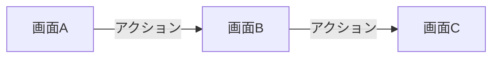

# niconico-mylist-assistant 要件定義書

---

## 1. ビジネス要件

### 1.1 背景・目的

#### 課題

ニコニコ動画で大量の動画をマイリストに登録する際、以下の課題がある:

- **手作業の負担**: 数十〜数百の動画を手動で登録するには、膨大な時間と労力がかかる
- **登録ミス**: 手作業によるミスや登録漏れが発生しやすい
- **条件指定の困難さ**: お気に入りの動画のみ、特定の条件で絞り込んで登録したいが、手動では煩雑

#### 既存実装からの移行

既存実装（Python + Selenium）は現在稼働しているが、以下の理由から TypeScript + Playwright への移行を決定:

1. **プラットフォーム統一**: 本プラットフォームは TypeScript で統一されており、Python との混在は保守性を低下させる
2. **型安全性**: TypeScript strict mode により、実行前にバグを検出でき、品質向上が期待できる
3. **メンテナンス性**: 単一言語での開発により、コードベース全体の保守が容易になる
4. **パフォーマンス**: Playwright は Selenium より高速で、モダンな API 設計により開発効率が向上する
5. **既存ノウハウの活用**: 本プラットフォームでは既に E2E テストに Playwright を採用しており、実績とノウハウが蓄積されている

#### 目的

本サービスは、ニコニコ動画のマイリスト登録作業を自動化し、以下を実現する:

- **作業効率化**: 手作業での登録時間を大幅に削減
- **登録精度の向上**: 自動化により、ミスや漏れをなくす
- **柔軟な条件指定**: お気に入りフラグ、スキップフラグなどによる条件指定を可能にする
- **プラットフォーム統一**: TypeScript への統一により、長期的な保守性を確保

### 1.2 対象ユーザー

#### プライマリーユーザー

**大量の動画をマイリスト登録したいユーザー**

- **ユースケース**:
    - ニコニコ動画で多数の動画をコレクションとして管理したい
    - 事前に登録しておいた動画リストから、条件を指定してマイリストに一括登録したい
    - お気に入りの動画のみ、またはスキップフラグを除いた動画のみを登録したい

- **ユーザー特性**:
    - ニコニコ動画のアカウントを持っている
    - 定期的にマイリスト登録を行う必要がある
    - 手作業での登録に時間を取られている
    - 技術的な知識は不要（Web UI で操作可能）

#### セカンダリーユーザー

本サービスは個人利用を想定しているため、セカンダリーユーザーは想定しない。

### 1.3 ビジネスゴール

#### 定量目標

- **一括登録可能動画数**: 最大 100 個の動画を 1 回の処理で登録可能
- **登録成功率**: 95% 以上の成功率を確保（ネットワークエラー等を除く）
- **動画情報取得時間**: 1 動画あたり平均 1 秒以内で情報を取得
- **一括インポート応答時間**: 10 動画のインポートを 10 秒以内で完了

#### 定性目標

1. **手作業時間の大幅削減**
    - 100 個の動画を手動で登録する場合、約 30 分〜1 時間かかるところを、自動化により待ち時間のみで完了
    - ユーザーは登録条件を指定してボタンを押すだけで済む

2. **安全性の優先**
    - **速度よりも安全性を重視**: ニコニコ動画のサーバーに過度な負荷をかけない
    - 各動画の登録間に最低 2 秒の待機時間を設けることで、サーバーへの配慮を徹底
    - リトライ機構は最大 3 回までに制限

3. **利便性の向上**
    - 条件指定による柔軟な登録（お気に入りのみ、スキップを除くなど）
    - 動画情報の一括インポート機能により、事前準備を効率化

4. **長期的な保守性の確保**
    - TypeScript への統一により、プラットフォーム全体で一貫した開発・保守が可能
    - 型安全性による品質向上と、既存ノウハウの活用

---

## 2. 機能要件

<!-- 記入ガイド: サービスが提供する具体的な機能を記述してください -->

### 2.1 ユースケース

<!-- 記入ガイド: 主要なユースケースを記述してください -->

#### UC-001: {ユースケース名}

<!-- 記入ガイド: ユースケースごとに記述してください -->

- **概要**: {概要}
- **アクター**: {アクター}
- **前提条件**: {前提条件}
- **正常フロー**:
  1. {ステップ1}
  2. {ステップ2}
  3. {ステップ3}
- **代替フロー**: {代替フロー}
- **例外フロー**: {例外フロー}

### 2.2 機能一覧

<!-- 記入ガイド: 機能を表形式で一覧化してください -->
<!-- 記入例: 機能ID、機能名、説明、優先度を明記 -->

| 機能ID | 機能名   | 説明   | 優先度   |
| ------ | -------- | ------ | -------- |
| F-001  | {機能名} | {説明} | 高/中/低 |
| F-002  | {機能名} | {説明} | 高/中/低 |

---

## 3. 非機能要件

<!-- 記入ガイド: パフォーマンス、セキュリティ、可用性などの要件を記述してください -->

### 3.1 パフォーマンス要件

<!-- 記入ガイド: 応答時間、スループット、同時接続数などを記述してください -->

| 項目         | 要件   |
| ------------ | ------ |
| 応答時間     | {要件} |
| スループット | {要件} |
| 同時接続数   | {要件} |

### 3.2 セキュリティ要件

<!-- 記入ガイド: 認証、認可、データ保護などを記述してください -->
<!-- 記入例: 認証方式、暗号化、アクセス制御、セキュリティ対策 -->

### 3.3 可用性要件

<!-- 記入ガイド: 稼働率、復旧時間などを記述してください -->

| 項目               | 要件   |
| ------------------ | ------ |
| 稼働率             | {要件} |
| RTO (復旧目標時間) | {要件} |
| RPO (復旧目標時点) | {要件} |

### 3.4 保守性・拡張性要件

<!-- 記入ガイド: メンテナンス性、将来の拡張性に関する要件を記述してください -->
<!-- 記入例: コード品質、ドキュメント、モジュール化、拡張ポイント -->

### 3.5 その他の非機能要件

<!-- [任意] -->
<!-- 記入ガイド: 上記に該当しない非機能要件があれば記述してください -->
<!-- 記入例: スケーラビリティ、移植性、互換性、国際化など -->

---

## 4. UI/UX 要件

<!-- 記入ガイド: サービスのUI/UX要件を記述してください -->
<!-- 記入ガイド: 複雑なUIの場合は、サービス固有ドキュメント (ui-design.md) に詳細を記述し、ここからリンクしてください -->

### 4.1 画面一覧

<!-- 記入ガイド: サービスで提供する画面を表形式で記述してください -->

| 画面名   | パス     | 説明   | 優先度   |
| -------- | -------- | ------ | -------- |
| {画面名} | `{path}` | {説明} | 高/中/低 |

### 4.2 画面遷移図

<!-- 記入ガイド: Mermaid で画面遷移を記述してください -->

<!-- Draw.io を使用する場合は、上記 Mermaid を以下の形式に置き換えてください -->
<!--  -->

### 4.3 主要画面の UI 要件

<!-- 記入ガイド: 各画面の UI 要件を記述してください -->
<!-- 記入ガイド: 詳細な仕様（ワイヤーフレーム、コンポーネント詳細など）は ui-design.md に記述し、ここでは基本要件のみ記述 -->

#### 画面A

**概要**: {画面の概要}

**主要UI要素**:

- {UI要素1}: {説明}
- {UI要素2}: {説明}

**インタラクション**:

- {インタラクション1}: {説明}
- {インタラクション2}: {説明}

**表示条件**: {表示条件がある場合}

### 4.4 レスポンシブ対応要件

<!-- 記入ガイド: デスクトップ・モバイル対応の要件を記述してください -->

| デバイス     | 対応要件 |
| ------------ | -------- |
| デスクトップ | {要件}   |
| タブレット   | {要件}   |
| モバイル     | {要件}   |

### 4.5 アクセシビリティ要件

<!-- 記入ガイド: アクセシビリティ要件を記述してください -->

- **WCAG 準拠レベル**: {AA / AAA}
- **キーボード操作**: {要件}
- **スクリーンリーダー対応**: {要件}
- **カラーコントラスト**: {要件}

### 4.6 UI/UX ガイドライン

<!-- 記入ガイド: サービス固有の UI/UX ガイドラインを記述してください -->
<!-- 記入例: デザインシステム、カラーパレット、タイポグラフィ、スペーシングルールなど -->

- **デザインシステム**: {使用するデザインシステム（例: Material-UI、共通UIライブラリ `@nagiyu/ui` など）}
- **カラーパレット**: {カラー仕様}
- **タイポグラフィ**: {フォント仕様}

### 4.7 詳細 UI 設計ドキュメント

<!-- [任意] 複雑な UI の場合のみ -->
<!-- 記入ガイド: 詳細な UI 設計が必要な場合、サービス固有ドキュメントへのリンクを記述してください -->

詳細な UI 設計（ワイヤーフレーム、コンポーネント詳細、状態遷移など）は以下のドキュメントを参照してください:

- [UI 設計書 (ui-design.md)](./ui-design.md)

---

## 5. スコープ外

<!-- 記入ガイド: 意図的にサポートしない機能、または現時点で実装しない機能を記述してください -->
<!-- 記入例: 明確に「やらないこと」を定義することで、実装範囲を限定し、将来的な拡張方針を示す -->

- ❌ {スコープ外の機能1}
- ❌ {スコープ外の機能2}
- ❌ {スコープ外の機能3}

---

## 6. 用語集

<!-- [任意] -->
<!-- 記入ガイド: サービス固有の用語や略語を定義してください -->

| 用語   | 定義   |
| ------ | ------ |
| {用語} | {定義} |
