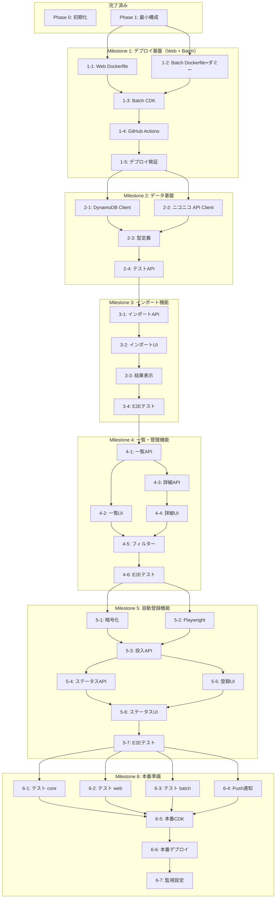

# niconico-mylist-assistant 実装ロードマップ

---

## 概要

本ロードマップは、**デプロイ駆動開発**のアプローチに基づき設計されています。開発初期段階でCI/CDとデプロイ基盤を整備し、以降は全ての機能をdev環境に継続的にデプロイして動作確認しながら進めます。

各タスクは `.github/agents/task.implement.agent.md` が実行することを前提とし、レビュー可能な粒度で分割されています。

---

## 完了済みフェーズ

### Phase 0: プロジェクト初期化 ✓

- core/web/batch パッケージの初期化
- CDK インフラスケルトン作成
- モノレポ設定

### Phase 1: 最小構成デプロイ ✓

- DynamoDB テーブル作成
- Lambda 関数デプロイ
- CloudFront ディストリビューション設定
- dev 環境での疎通確認完了

---

## Milestone 構成

```
Milestone 1: デプロイ基盤構築（Web + Batch）
    ↓
Milestone 2: データ基盤構築
    ↓
Milestone 3: 動画インポート機能
    ↓
Milestone 4: 動画一覧・管理機能
    ↓
Milestone 5: マイリスト自動登録機能
    ↓
Milestone 6: 本番準備
```

---

## Milestone 1: デプロイ基盤構築（Web + Batch）

**目標**: Web と Batch の両方を dev 環境にデプロイして動作確認

**方針**:
- Web と Batch の基盤を Milestone 1 で完成させる
- Codec Converter の実績を活用して AWS Batch CDK を実装
- デプロイ駆動開発: Milestone 1 完了後、全コンポーネントが dev 環境で動作

### Issue 1-1: Web Dockerfile 作成

**実装内容**:
- Next.js standalone build を使用した Dockerfile 作成
- multi-stage build によるイメージサイズ最適化
- 既存サービス（tools など）を参考に構成

**完了条件**:
- [ ] Dockerfile でビルドが成功
- [ ] コンテナが起動してヘルスチェックが通る

---

### Issue 1-2: Batch Dockerfile とダミー処理実装

**実装内容**:
- Playwright 実行環境の Dockerfile（基本構成は既存を利用）
- **ダミー処理の実装**:
  - 環境変数の読み取り（`DYNAMODB_TABLE_NAME` など）
  - 開始/完了ログの出力
  - タイムスタンプの表示
  - 3秒程度の待機処理
- エントリーポイント設定の確認

**完了条件**:
- [ ] ローカルで Docker イメージがビルドできる
- [ ] ローカルでコンテナが起動してログが出力される
- [ ] ダミー処理が正常に完了する（エラーなく終了）

---

### Issue 1-3: infra: AWS Batch 設定（CDK）

**実装内容**:
- Batch コンピューティング環境（Fargate）
  - **最小リソース**: vCPU 0.25, メモリ 512 MB
  - 共有 VPC の Public Subnet を使用
- ジョブ定義（ECR イメージを参照）
- ジョブキュー
- IAM ロール設定（最小権限: CloudWatch Logs 書き込みのみ）
- セキュリティグループ（アウトバウンド HTTPS のみ）

**参考**:
- 既存の codec-converter の Batch 実装
- [deployment.md:109-116](./deployment.md) の CDK スタック構成

**完了条件**:
- [ ] CDK デプロイが成功する
- [ ] Batch リソースが作成される（コンピューティング環境、ジョブ定義、ジョブキュー）
- [ ] IAM ロールが適切に設定される

---

### Issue 1-4: GitHub Actions ワークフロー作成

**実装内容**:
- PR マージ時の自動デプロイワークフロー
- dev 環境への CDK デプロイ
- **Web と Batch 両方の** Docker イメージのビルド・プッシュ
- バージョンタグ管理（latest + コミットハッシュ）
- ブランチ戦略（integration/* → develop）に対応

**参考**:
- 既存の `.github/workflows/` を参考

**完了条件**:
- [ ] develop ブランチへのマージで自動デプロイが実行される
- [ ] Web と Batch の Docker イメージが ECR にプッシュされる
- [ ] デプロイ成功時に dev 環境が更新される

---

### Issue 1-5: デプロイ検証（Web + Batch）

**実装内容**:
- 最小限の Web 画面をデプロイ
- ヘルスチェック API が正常応答することを確認
- **Batch のダミージョブを手動で投入して動作確認**
  - AWS コンソール/CLI でジョブ投入
  - CloudWatch Logs でログ確認
- dev 環境での動作確認手順をドキュメント化

**完了条件**:
- [ ] `https://dev-niconico-mylist-assistant.nagiyu.com` にアクセス可能
- [ ] CI/CD による自動デプロイが動作
- [ ] **Batch のダミージョブが `SUCCEEDED` で完了する**
- [ ] デプロイ手順が `tasks/niconico-mylist-assistant/deployment.md` に記載

---

## Milestone 2: データ基盤構築

**目標**: DynamoDB とニコニコ API へのアクセス層を実装し、dev 環境で動作確認

### Issue 2-1: core: DynamoDB クライアント実装

**実装内容**:
- DynamoDB Document Client のラッパー実装
- 動画基本情報の CRUD 操作
- 動画に対するユーザー設定（お気に入り、スキップ、メモ）の管理
- Single Table Design のアクセスパターン実装

**完了条件**:
- [ ] DynamoDB への読み書きが可能
- [ ] 型安全な API が提供される
- [ ] ユニットテストが実装される

---

### Issue 2-2: core: ニコニコ動画 API クライアント実装

**実装内容**:
- getthumbinfo API クライアント実装
- XML レスポンスパーサー（XML → TypeScript 型）
- エラーハンドリング（404、権限エラー等）
- レート制限対応

**完了条件**:
- [ ] ニコニコ動画 API から情報取得が可能
- [ ] エラーケースが適切に処理される
- [ ] ユニットテストが実装される

---

### Issue 2-3: core: 型定義整備

**実装内容**:
- 動画情報の型定義（Video, VideoMetadata）
- ユーザー設定の型定義（UserVideoSettings）
- DynamoDB アイテムの型定義
- API レスポンスの型定義

**完了条件**:
- [ ] 全ての型が `core/src/types/` に定義される
- [ ] 型エクスポートが適切に行われる

---

### Issue 2-4: web: データ基盤動作確認用 API 作成

**実装内容**:
- テスト用 API エンドポイント作成（`/api/test/db`, `/api/test/niconico`）
- DynamoDB 読み書きテスト
- ニコニコ API 呼び出しテスト
- dev 環境での動作確認

**完了条件**:
- [ ] dev 環境でテスト API が動作
- [ ] DynamoDB アクセスが確認できる
- [ ] ニコニコ API 呼び出しが確認できる

---

## Milestone 3: 動画インポート機能

**目標**: 動画 ID を入力して一括インポートできる

### Issue 3-1: web: 動画一括インポート API 実装

**実装内容**:
- `POST /api/videos/bulk-import` エンドポイント実装
- リクエストバリデーション（動画 ID 配列、最大件数チェック）
- ニコニコ API からの情報取得
- DynamoDB への保存
- 重複チェック（既存動画はスキップ）
- エラーハンドリング

**完了条件**:
- [ ] API が正常に動作する
- [ ] 重複チェックが機能する
- [ ] エラーが適切に返却される

---

### Issue 3-2: web: インポート画面 UI 実装

**実装内容**:
- 動画 ID 入力フォーム（テキストエリア、1行1ID）
- インポート実行ボタン
- Material-UI コンポーネント使用
- レスポンシブデザイン

**完了条件**:
- [ ] UI が実装される
- [ ] Material-UI のデザインに準拠
- [ ] モバイル対応

---

### Issue 3-3: web: インポート結果表示実装

**実装内容**:
- インポート結果の表示（成功/失敗/スキップ件数）
- 進捗インジケーター
- エラーメッセージ表示
- 結果詳細の表示

**完了条件**:
- [ ] 結果が適切に表示される
- [ ] エラー情報が分かりやすく表示される

---

### Issue 3-4: dev 環境での E2E テスト

**実装内容**:
- dev 環境で実際に動画 ID を入力してインポートテスト
- 各種エラーケースの確認
- 動作確認手順のドキュメント化

**完了条件**:
- [ ] dev 環境で動画インポートが成功
- [ ] エラーケースが正常に処理される

---

## Milestone 4: 動画一覧・管理機能

**目標**: インポートした動画を一覧表示・編集・削除できる

### Issue 4-1: web: 動画一覧 API 実装

**実装内容**:
- `GET /api/videos` エンドポイント実装
- ページネーション対応（DynamoDB の LastEvaluatedKey 使用）
- フィルタリング対応（お気に入り、スキップ）
- ソート機能

**完了条件**:
- [ ] API が正常に動作する
- [ ] ページネーションが機能する
- [ ] フィルターが適用される

---

### Issue 4-2: web: 動画一覧画面 UI 実装

**実装内容**:
- 動画カード表示（サムネイル、タイトル、投稿日時等）
- ページネーション UI
- フィルター UI（お気に入り、スキップ切り替え）
- Material-UI Grid レイアウト

**完了条件**:
- [ ] 動画一覧が表示される
- [ ] ページネーションが動作する
- [ ] フィルターが機能する

---

### Issue 4-3: web: 動画詳細・設定編集 API 実装

**実装内容**:
- `GET /api/videos/:id` エンドポイント実装
- `PUT /api/videos/:id/settings` エンドポイント実装（お気に入り、スキップ、メモ）
- `DELETE /api/videos/:id` エンドポイント実装

**完了条件**:
- [ ] 全ての API が正常に動作する
- [ ] 設定が永続化される

---

### Issue 4-4: web: 動画詳細・設定編集 UI 実装

**実装内容**:
- 動画詳細モーダルまたは専用ページ
- お気に入り/スキップトグルボタン
- メモ編集フォーム
- 削除ボタン（確認ダイアログ付き）

**完了条件**:
- [ ] UI が実装される
- [ ] 設定変更が即座に反映される
- [ ] 削除確認ダイアログが表示される

---

### Issue 4-5: web: フィルター機能実装

**実装内容**:
- フィルター状態管理
- フィルター適用時の API 呼び出し
- URL クエリパラメータとの同期

**完了条件**:
- [ ] フィルターが正常に動作する
- [ ] ブラウザバック/フォワードで状態が保持される

---

### Issue 4-6: dev 環境での E2E テスト

**実装内容**:
- dev 環境で一覧表示から削除までの一連の操作をテスト
- 各種機能の動作確認

**完了条件**:
- [ ] dev 環境で全機能が動作する
- [ ] お気に入り/スキップ設定が正常に保存される
- [ ] 動画削除が成功する

---

## Milestone 5: マイリスト自動登録機能

**目標**: 条件を指定してマイリストに自動登録できる

**前提**: Milestone 1 で AWS Batch の基盤が動作確認済み

### Issue 5-1: core: 暗号化ユーティリティ実装

**実装内容**:
- AES-256-GCM による暗号化/復号化関数
- Secrets Manager からのキー取得
- エラーハンドリング
- メモリ上での安全な取り扱い

**完了条件**:
- [ ] 暗号化/復号化が正常に動作する
- [ ] Secrets Manager キーが適切に使用される
- [ ] ユニットテストが実装される（カバレッジ 80% 以上）

---

### Issue 5-2: batch: Playwright 自動化スクリプト実装

**実装内容**:
- ニコニコ動画ログイン処理
- マイリスト作成処理
- 動画登録処理（2秒待機厳守）
- エラーハンドリング・リトライロジック
- スクリーンショット取得（デバッグ用）

**完了条件**:
- [ ] ローカルで Playwright スクリプトが動作する
- [ ] 2秒待機が遵守される
- [ ] エラー時に適切にリトライされる

---

### Issue 5-3: web: バッチ投入 API 実装

**実装内容**:
- `POST /api/mylist/register` エンドポイント実装
- 条件に基づく動画選択ロジック（お気に入り、スキップ除外、ランダム選択）
- AWS Batch ジョブ投入
- ジョブ ID の返却

**完了条件**:
- [ ] API が正常に動作する
- [ ] 動画選択ロジックが正しい
- [ ] Batch ジョブが投入される

---

### Issue 5-4: web: ジョブステータス確認 API 実装

**実装内容**:
- `GET /api/mylist/status/:jobId` エンドポイント実装
- AWS Batch ジョブステータス取得
- CloudWatch Logs からのログ取得（オプション）

**完了条件**:
- [ ] ジョブステータスが取得できる
- [ ] リアルタイムに状態が更新される

---

### Issue 5-5: web: マイリスト登録画面 UI 実装

**実装内容**:
- 登録条件指定フォーム（最大件数、お気に入りのみ等）
- ニコニコアカウント入力フォーム（暗号化保存）
- マイリスト名入力
- 実行ボタン

**完了条件**:
- [ ] UI が実装される
- [ ] アカウント情報が暗号化される

---

### Issue 5-6: web: ジョブステータス表示 UI 実装

**実装内容**:
- ジョブステータスのリアルタイム表示
- 進捗インジケーター
- 完了/エラー時の通知
- ログ表示（オプション）

**完了条件**:
- [ ] ステータスが表示される
- [ ] 定期的にポーリングされる
- [ ] 完了時に通知が表示される

---

### Issue 5-7: dev 環境での E2E テスト

**実装内容**:
- dev 環境で実際にマイリスト登録ジョブを実行
- テストアカウントでの動作確認
- ニコニコ動画での登録確認

**完了条件**:
- [ ] dev 環境で全フローが動作する
- [ ] ニコニコ動画のマイリストに動画が登録される
- [ ] ジョブステータスが UI に表示される

---

## Milestone 6: 本番準備

**目標**: 本番環境で安定稼働できる状態にする

### Issue 6-1: テスト整備（core）

**実装内容**:
- core パッケージのユニットテスト追加
- カバレッジ 80% を目標
- モック・スタブの整備

**完了条件**:
- [ ] カバレッジ 80% 以上
- [ ] 全テストがパスする

---

### Issue 6-2: テスト整備（web）

**実装内容**:
- API エンドポイントのテスト
- E2E テスト（Playwright）
- 主要フローのテストシナリオ作成

**完了条件**:
- [ ] E2E テストが実装される
- [ ] CI でテストが実行される

---

### Issue 6-3: テスト整備（batch）

**実装内容**:
- Playwright スクリプトの統合テスト
- テスト専用アカウントでの実行
- エラーケースのテスト

**完了条件**:
- [ ] バッチ処理のテストが実装される
- [ ] 全テストがパスする

---

### Issue 6-4: Web Push 通知実装

**実装内容**:
- VAPID キー生成・設定
- Push 購読 API 実装（`POST /api/push/subscribe`）
- バッチ完了時の通知送信処理
- 通知許可 UI

**完了条件**:
- [ ] Push 通知が送信される
- [ ] バッチ完了時に通知が届く

---

### Issue 6-5: 本番環境 CDK 設定

**実装内容**:
- 本番環境用 Stack 作成
- 環境変数の分離
- リソース命名規則の適用

**完了条件**:
- [ ] 本番環境の CDK 設定が完了
- [ ] CDK diff で差分が確認できる

---

### Issue 6-6: 本番環境デプロイ

**実装内容**:
- 本番環境への CDK デプロイ
- ドメイン設定（`niconico-mylist-assistant.nagiyu.com`）
- SSL 証明書設定
- 動作確認

**完了条件**:
- [ ] 本番環境にデプロイされる
- [ ] ドメインでアクセス可能
- [ ] 全機能が動作する

---

### Issue 6-7: 監視・ログ設定

**実装内容**:
- CloudWatch Logs 設定
- CloudWatch Alarms 設定（エラー率、レイテンシ等）
- ダッシュボード作成

**完了条件**:
- [ ] ログが適切に記録される
- [ ] アラームが設定される
- [ ] ダッシュボードで監視できる

---

## 依存関係図



---

## 並列実装の可能性

各 Milestone 内で以下のタスクは並列実装可能です：

### Milestone 2
- Issue 2-1（DynamoDB）と Issue 2-2（ニコニコAPI）は並列可能
- Issue 2-3（型定義）は両方完了後

### Milestone 3
- Issue 3-2（UI）と Issue 3-3（結果表示）は並列可能

### Milestone 4
- Issue 4-2（一覧UI）と Issue 4-3（詳細API）は並列可能
- Issue 4-4（詳細UI）と Issue 4-5（フィルター）は並列可能

### Milestone 5
- Issue 5-1（暗号化）と Issue 5-2（Playwright）は並列可能
- Issue 5-3（投入API）と Issue 5-4（ステータスAPI）は並列可能
- Issue 5-5（登録UI）と Issue 5-6（ステータスUI）は並列可能

### Milestone 6
- Issue 6-1〜6-4 は全て並列可能

---

## 重要事項

### デプロイ駆動開発
- Milestone 1 完了後、全ての変更は dev 環境に自動デプロイされる
- 各 Issue 完了時に dev 環境で動作確認を行う
- 問題があればすぐに修正し、次の Issue に進む

### タスク粒度
- 各 Issue は 1〜3日で完了できる粒度
- レビュー可能な範囲でコミットを分割
- 大きすぎる Issue は分割を検討

### ドキュメント駆動
- 実装前に関連ドキュメント（`tasks/niconico-mylist-assistant/` 配下）を確認
- 不明瞭な仕様があれば、実装前にドキュメントを更新
- 実装完了後、必要に応じてドキュメントを更新

### 注意事項
- インフラ変更時は必ず `cdk diff` を確認してからデプロイ
- ニコニコ動画への自動操作は 2秒待機を厳守
- 認証情報（ニコニコアカウント）は必ず暗号化して保存
- 本番デプロイ前に dev 環境で十分に検証

---

## 完了条件

各 Milestone 完了時に以下を確認：

- [ ] 全 Issue が完了
- [ ] dev 環境で動作確認済み
- [ ] テストがパス
- [ ] ドキュメントが更新済み
- [ ] PR がマージ済み

最終完了条件（Milestone 6）：

- [ ] 本番環境で全機能が動作
- [ ] テストが CI で自動実行される
- [ ] バッチ完了時に Push 通知が届く
- [ ] 監視・ログが適切に設定されている
