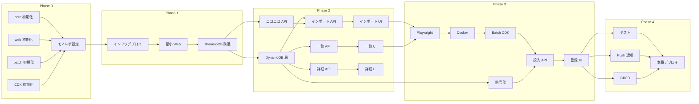

# niconico-mylist-assistant 実装ロードマップ

---

## 概要

本ロードマップは、早期に開発環境へデプロイして動作確認を行いながら機能を充実させていく方針で設計されています。また、GitHub Copilot Agent による並列実装を考慮し、依存関係のないタスクは同時に進行可能な構成としています。

---

## フェーズ構成

```
Phase 0: プロジェクト初期化（並列可能）
    ↓
Phase 1: 最小構成デプロイ（dev 環境で動作確認）
    ↓
Phase 2: コア機能実装（並列可能）
    ↓
Phase 3: バッチ処理実装
    ↓
Phase 4: 品質向上・本番準備
```

---

## Phase 0: プロジェクト初期化

**目標**: 3 パッケージ構成のスケルトンを作成し、ローカルでビルドが通る状態にする

### 0-1. ディレクトリ構成作成（並列可能）

以下の 4 タスクは並列実行可能:

#### 0-1a. core パッケージ初期化

- `services/niconico-mylist-assistant/packages/core/` を作成
- package.json, tsconfig.json 設定
- 型定義ファイルのスケルトン作成（`src/types/index.ts`）
- 空の index.ts エクスポート

#### 0-1b. web パッケージ初期化

- `services/niconico-mylist-assistant/packages/web/` を作成
- Next.js 16 プロジェクト初期化
- Material-UI 7 設定
- 既存サービス（tools など）の設定を参考に統一

#### 0-1c. batch パッケージ初期化

- `services/niconico-mylist-assistant/packages/batch/` を作成
- package.json, tsconfig.json 設定
- Playwright 依存追加
- Dockerfile スケルトン作成

#### 0-1d. CDK インフラ初期化

- `infra/niconico-mylist-assistant/` を作成
- 既存 CDK プロジェクト（auth, tools など）を参考に構成
- Stack のスケルトン作成（DynamoDB, Lambda, Batch, CloudFront）

### 0-2. モノレポ設定

- ルートの package.json に workspace 追加
- パッケージ間の依存関係設定（web/batch → core）

### 完了条件

- [ ] `npm install` が成功
- [ ] `npm run build` が全パッケージで成功
- [ ] TypeScript の型チェックが通る

---

## Phase 1: 最小構成デプロイ

**目標**: 開発環境（dev）に最小構成をデプロイし、エンドツーエンドの疎通確認を行う

### 1-1. インフラデプロイ（CDK）

- DynamoDB テーブル作成（Single Table Design）
- Lambda 関数（Next.js）デプロイ
- CloudFront ディストリビューション設定
- IAM ロール・ポリシー設定

### 1-2. 最小 Web アプリ

- ヘルスチェック API（`GET /api/health`）
- 簡易トップページ（「niconico-mylist-assistant」表示のみ）
- 認証連携（Auth プロジェクト）の疎通確認

### 1-3. DynamoDB 疎通確認

- テストデータの手動投入
- API からのデータ取得確認

### 完了条件

- [ ] `https://dev-niconico-mylist-assistant.nagiyu.com` にアクセス可能
- [ ] ヘルスチェック API が 200 を返す
- [ ] DynamoDB へのアクセスが成功

---

## Phase 2: コア機能実装

**目標**: 一括インポート機能と動画一覧機能を実装

### 並列実装グループ A（データ層）

#### 2-A1. core: DynamoDB アクセス層

- DynamoDB クライアント実装
- 動画基本情報の CRUD 操作
- ユーザー設定の CRUD 操作
- Single Table Design のアクセスパターン実装

#### 2-A2. core: ニコニコ動画 API クライアント

- getthumbinfo API クライアント実装
- レスポンスパーサー（XML → 型定義）
- エラーハンドリング

### 並列実装グループ B（API 層）- グループ A 完了後

#### 2-B1. web: 一括インポート API

- `POST /api/videos/bulk-import` 実装
- バリデーション（配列長チェック）
- ニコニコ動画 API からの情報取得
- DynamoDB への保存
- 重複チェック（既存動画はスキップ）

#### 2-B2. web: 動画一覧 API

- `GET /api/videos` 実装
- ページネーション対応
- フィルタリング対応（お気に入り、スキップ）

#### 2-B3. web: 動画詳細・更新・削除 API

- `GET /api/videos/:id` 実装
- `PUT /api/videos/:id/settings` 実装
- `DELETE /api/videos/:id` 実装

### 並列実装グループ C（UI 層）- グループ B と並列可能

#### 2-C1. web: 一括インポート画面

- 動画 ID 入力フォーム（テキストエリア）
- インポート実行ボタン
- 結果表示（成功/失敗/スキップ件数）

#### 2-C2. web: 動画一覧画面

- 動画カード表示
- ページネーション UI
- フィルター UI（お気に入り、スキップ）

#### 2-C3. web: 動画詳細・設定編集

- 動画詳細表示
- お気に入り/スキップトグル
- メモ編集
- 削除機能

### 完了条件

- [ ] 動画 ID を入力して一括インポートが成功
- [ ] インポートした動画が一覧に表示される
- [ ] お気に入り/スキップの設定が保存される
- [ ] 動画の削除が成功

---

## Phase 3: バッチ処理実装

**目標**: マイリスト一括登録機能（AWS Batch）を実装

### 3-1. batch: Playwright 自動化

- ニコニコ動画ログイン処理
- マイリスト作成処理
- 動画登録処理（2 秒待機）
- エラーハンドリング・リトライ

### 3-2. batch: Docker イメージ

- Playwright 動作環境の Dockerfile
- ECR へのプッシュ設定

### 3-3. CDK: AWS Batch 設定

- Batch コンピューティング環境
- ジョブ定義
- ジョブキュー

### 3-4. web: バッチ投入 API

- `POST /api/mylist/register` 実装
- 条件に基づく動画選択ロジック
- Batch ジョブ投入
- ジョブステータス取得 API

### 3-5. web: マイリスト登録画面

- 登録条件指定フォーム
- ニコニコアカウント入力（暗号化保存）
- 実行ボタン
- ジョブステータス表示

### 3-6. core: 暗号化ユーティリティ

- AES-256-GCM 暗号化/復号化
- KMS キー連携

### 完了条件

- [ ] Web UI からマイリスト登録ジョブを投入できる
- [ ] Batch ジョブが正常に実行される
- [ ] ニコニコ動画のマイリストに動画が登録される
- [ ] ジョブステータスが UI に表示される

---

## Phase 4: 品質向上・本番準備

**目標**: テスト整備、Push 通知、本番デプロイ準備

### 並列実装グループ D

#### 4-D1. テスト整備

- core: ユニットテスト（カバレッジ 80%）
- web: E2E テスト（主要フロー）
- batch: 統合テスト（テスト専用アカウント）

#### 4-D2. Web Push 通知

- VAPID キー生成・設定
- Push 購読 API 実装
- バッチ完了時の通知送信

#### 4-D3. CI/CD パイプライン

- GitHub Actions ワークフロー作成
- ブランチ戦略に基づくデプロイ設定

### 4-E. 本番デプロイ

- 本番環境の CDK デプロイ
- ドメイン設定（`niconico-mylist-assistant.nagiyu.com`）
- 動作確認

### 完了条件

- [ ] テストが CI で自動実行される
- [ ] バッチ完了時に Push 通知が届く
- [ ] 本番環境で全機能が動作する

---

## 依存関係図



---

## 並列実装ガイド

GitHub Copilot Agent で並列実装する際の指針:

### Phase 0 での並列化

4 つの初期化タスク（0-1a〜0-1d）は完全に独立しているため、4 エージェントで同時実行可能。

### Phase 2 での並列化

1. **グループ A（2-A1, 2-A2）**: core パッケージ内で並列実行可能
2. **グループ B（2-B1〜2-B3）**: グループ A 完了後、3 つの API を並列実行可能
3. **グループ C（2-C1〜2-C3）**: API の型定義が決まれば、API 実装と並列で UI 実装可能

### Phase 4 での並列化

テスト整備、Push 通知、CI/CD は互いに独立しているため並列実行可能。

---

## 注意事項

- 各フェーズ完了時に dev 環境で動作確認を行う
- インフラ変更時は必ず CDK diff を確認してからデプロイ
- ニコニコ動画への自動操作は 2 秒待機を厳守
- 認証情報（ニコニコアカウント）は必ず暗号化して保存
