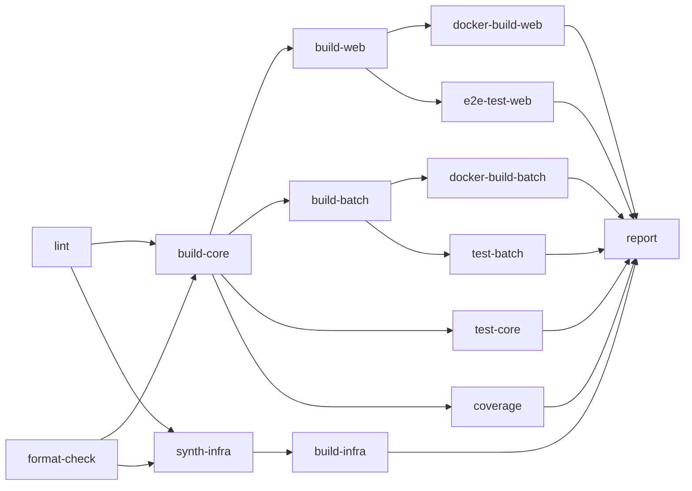

# niconico-mylist-assistant テスト仕様書

---

## 1. テスト戦略概要

### 1.1 テストの目的

本サービスのテストは、以下を目的として実施します:

- **主要機能の動作保証**: 動画インポート、ユーザー設定管理、マイリスト登録の正常動作を保証
- **リグレッション防止**: コード変更による既存機能の破壊を防止
- **UI 変更への耐性**: ニコニコ動画の HTML 構造変更を早期検知
- **品質保証**: ビジネスロジックの正確性を担保

### 1.2 テスト方針

本サービスは **3 パッケージ構成**（core / web / batch）を採用しており、各パッケージの特性に応じたテスト戦略を適用します。

#### 基本方針

- **スマホファースト**: モバイル環境でのテストを優先（Fast CI では chromium-mobile のみ）
- **品質とスピードのバランス**: 2段階CI戦略により、開発速度と品質保証を両立
- **自動化**: CI/CD で継続的にテストを実行（全PR で自動実行）

#### パッケージ別方針

- **ビジネスロジック集約**: ビジネスロジックは core パッケージに集約し、ユニットテストで品質を担保
  - **Pure Business Logic Functions パターン** を採用し、副作用のない純粋関数（`libs/`）を重点的にテスト
  - カバレッジ目標: **80%以上（必須）**
- **E2E 重視**: web パッケージは E2E テストでユーザーフローをカバー
  - 主要なユーザーシナリオを網羅
  - 実環境（DynamoDB dev, ニコニコ動画 API）を使用
- **実環境テスト**: batch パッケージはテスト専用アカウントを使用した実環境統合テストで品質を担保
  - Playwright による実際のブラウザ自動化をテスト
  - UI 変更の早期検知

### 1.3 パッケージ別テスト戦略

| パッケージ | ユニットテスト | E2E / 統合テスト | カバレッジ目標 | 品質担保の方法 |
|-----------|--------------|-----------------|---------------|---------------|
| **core** | 重点的に実施 | - | 80% | ユニットテスト |
| **web** | 最小限 | E2E テスト | 対象外 | E2E テスト |
| **batch** | 最小限 | 統合テスト（実環境） | 対象外 | 統合テスト |

---

## 2. テストデバイス/ブラウザ構成

### 2.1 Playwright デバイス構成

| デバイス名 | 用途 | 画面サイズ | User Agent |
|-----------|------|-----------|------------|
| chromium-desktop | デスクトップ Chrome | 1920x1080 | Chrome (最新安定版) |
| chromium-mobile | モバイル Chrome | Pixel 5 相当 | Chrome Mobile (Android) |
| webkit-mobile | モバイル Safari | iPhone 相当 | Safari Mobile (iOS) |

### 2.2 テスト優先順位

本サービスは **2段階CI戦略** を採用し、開発速度と品質のバランスを実現しています。

#### Fast CI (高速フィードバック)

- **対象デバイス**: chromium-mobile のみ
- **目的**: 開発中の素早いフィードバックループ（約 5-10 分）
- **トリガー**: `integration/**` ブランチへの PR
- **実行内容**:
  - ビルド検証（全パッケージ）
  - ユニットテスト（core, batch）
  - E2E テスト（chromium-mobile のみ）
  - カバレッジチェック: **スキップ**（test は実行）
  - batch 統合テスト: **スキップ**

#### Full CI (完全テスト)

- **対象デバイス**: chromium-desktop, chromium-mobile, webkit-mobile（全3種）
- **目的**: マージ前の完全な品質保証（約 15-20 分）
- **トリガー**: `develop` ブランチへの PR
- **実行内容**:
  - ビルド検証（全パッケージ）
  - ユニットテスト（core, batch）
  - E2E テスト（**全デバイス**）
  - カバレッジチェック: **80%未満で失敗**
  - batch 統合テスト: **実行**（テスト専用アカウント使用）

#### スマホファーストの実践

モバイル環境を優先してテスト。Fast CI では chromium-mobile のみを実行し、開発速度を重視しています。Full CI でデスクトップとiOS（webkit）を追加検証することで、品質とスピードのバランスを実現しています。

---

## 3. カバレッジ目標

### 3.1 カバレッジ目標値

| パッケージ | カバレッジ目標 | 測定方法 | 備考 |
|-----------|--------------|----------|------|
| core (ビジネスロジック) | 80% 以上 | Jest coverage | 必須 |
| web | 対象外 | - | E2E テストでカバー |
| batch | 対象外 | - | 統合テストでカバー |

### 3.2 カバレッジ対象外

以下は Jest のカバレッジ対象外とします（E2E テストまたは統合テストでカバー）:

- `web/app/**/page.tsx` - Next.js App Router の page コンポーネント
- `web/app/**/layout.tsx` - レイアウトコンポーネント
- `web/app/api/**` - API Routes（E2E でカバー）
- `batch/**` - バッチ処理（統合テストでカバー）

### 3.3 カバレッジ計測方法

```bash
# core パッケージのカバレッジレポート生成
npm run test:coverage --workspace=niconico-mylist-assistant-core

# カバレッジ結果の確認
# - コンソール出力: サマリー
# - coverage/lcov-report/index.html: 詳細レポート
```

---

## 4. E2E テストシナリオ

### 4.1 テストシナリオ一覧

| シナリオ ID | シナリオ名 | 概要 | 優先度 | Fast CI | Full CI |
|------------|-----------|------|--------|---------|---------|
| E2E-001 | 動画一括インポート | 動画 ID 入力 → API 呼び出し → 結果表示 | 高 | ✅ | ✅ |
| E2E-002 | 動画一覧表示 | 動画一覧取得 → フィルタリング → ページネーション | 高 | ✅ | ✅ |
| E2E-003 | ユーザー設定編集 | お気に入り/スキップトグル、メモ編集 | 高 | ✅ | ✅ |
| E2E-004 | 動画削除 | 確認ダイアログ → 削除実行 → 一覧更新 | 中 | - | ✅ |
| E2E-005 | マイリスト登録（バッチ投入） | 条件指定 → アカウント入力 → バッチ投入 | 中 | - | ✅ |
| E2E-006 | エラーハンドリング | 不正な動画 ID、API エラー時の表示 | 中 | - | ✅ |
| E2E-007 | 未認証時のリダイレクト | 未ログイン状態でのアクセス制御 | 低 | - | ✅ |

### 4.2 シナリオ詳細

#### E2E-001: 動画一括インポート

**目的**: 動画 ID を入力し、ニコニコ動画 API から動画基本情報を取得して DynamoDB に保存する機能をテスト

**前提条件**:

- ユーザーが認証済み（モック JWT）
- DynamoDB (dev) にアクセス可能

**テスト手順**:

1. 一括インポート画面にアクセス
2. 動画 ID を入力（例: `sm12345678`）
3. 「インポート実行」ボタンをクリック
4. 進捗表示を確認
5. 結果サマリー（成功数、スキップ数、失敗数）を確認

**期待結果**:

- 動画基本情報が DynamoDB に保存される
- 結果サマリーが正しく表示される

**テストファイル**: `web/tests/e2e/bulk-import.spec.ts`

**実行環境要件**:

- ニコニコ動画 API（getthumbinfo）への実アクセス
- DynamoDB (dev) への実アクセス

---

#### E2E-002: 動画一覧表示

**目的**: 登録済み動画の一覧表示とフィルタリング機能をテスト

**前提条件**:

- ユーザーが認証済み（モック JWT）
- テスト用動画データが DynamoDB に登録済み

**テスト手順**:

1. 動画管理画面にアクセス
2. 動画一覧が表示されることを確認
3. 「お気に入りのみ」フィルタを適用
4. フィルタ結果を確認
5. ページネーション操作（該当する場合）

**期待結果**:

- 動画一覧が正しく表示される
- フィルタリングが正しく動作する

**テストファイル**: `web/tests/e2e/video-list.spec.ts`

---

#### E2E-003: ユーザー設定編集

**目的**: お気に入りフラグ、スキップフラグ、メモの編集機能をテスト

**前提条件**:

- ユーザーが認証済み（モック JWT）
- テスト用動画データが DynamoDB に登録済み

**テスト手順**:

1. 動画管理画面にアクセス
2. お気に入りアイコンをクリックしてトグル
3. スキップアイコンをクリックしてトグル
4. メモ欄をクリックして編集、フォーカスアウト

**期待結果**:

- 各設定が即座に DynamoDB に保存される
- UI が更新される

**テストファイル**: `web/tests/e2e/user-settings.spec.ts`

---

#### E2E-004: 動画削除

**目的**: 動画削除機能と確認ダイアログをテスト

**前提条件**:

- ユーザーが認証済み（モック JWT）
- テスト用動画データが DynamoDB に登録済み

**テスト手順**:

1. 動画管理画面にアクセス
2. 削除ボタンをクリック
3. 確認ダイアログが表示されることを確認
4. 「削除」を確定
5. 一覧から動画が削除されることを確認

**期待結果**:

- 確認ダイアログが表示される
- 削除後、一覧が更新される

**テストファイル**: `web/tests/e2e/video-delete.spec.ts`

---

#### E2E-005: マイリスト登録（バッチ投入）

**目的**: マイリスト登録条件の指定とバッチジョブ投入機能をテスト

**前提条件**:

- ユーザーが認証済み（モック JWT）
- テスト用動画データが DynamoDB に登録済み

**テスト手順**:

1. マイリスト登録画面にアクセス
2. 登録条件を指定（「スキップを除く」等）
3. ニコニコアカウント情報を入力
4. 「登録開始」ボタンをクリック
5. バッチ投入成功メッセージを確認

**期待結果**:

- バッチジョブが投入される（モック）
- ステータスが「処理を開始しました」と表示される

**テストファイル**: `web/tests/e2e/batch-submit.spec.ts`

**実行環境要件**:

- AWS Batch API はモック

---

#### E2E-006: エラーハンドリング

**目的**: 各種エラー時の適切なエラー表示をテスト

**前提条件**:

- ユーザーが認証済み（モック JWT）

**テスト手順**:

1. 不正な動画 ID でインポートを実行
2. エラーメッセージが表示されることを確認
3. 存在しない動画 ID でインポートを実行
4. 失敗数にカウントされることを確認

**期待結果**:

- 適切なエラーメッセージが表示される
- 処理は継続され、結果サマリーに反映される

**テストファイル**: `web/tests/e2e/error-handling.spec.ts`

---

#### E2E-007: 未認証時のリダイレクト

**目的**: 未認証状態でのアクセス制御をテスト

**前提条件**:

- 未認証状態（JWT Cookie なし）

**テスト手順**:

1. 認証が必要な画面に直接アクセス
2. ログインページへリダイレクトされることを確認

**期待結果**:

- 401 エラーまたはログインページへリダイレクト

**テストファイル**: `web/tests/e2e/auth-redirect.spec.ts`

---

### 4.3 E2E テスト実装状況

#### 実装済みテストファイル

| テストファイル | テストスイート数 | テストケース数 | カバー範囲 |
|---------------|-----------------|----------------|-----------|
| `e2e/test-setup.spec.ts` | 1 | 3 | テスト環境のセットアップ検証 |
| `e2e/video-list.spec.ts` | 3 | 43 | 動画一覧表示、フィルタリング、ページネーション、URL同期 |
| `e2e/video-detail.spec.ts` | 1 | 9 | 動画詳細モーダル、設定変更、削除確認 |
| `e2e/bulk-import.spec.ts` | 3 | 15 | 一括インポートAPI、UI、ナビゲーション |
| **合計** | **8** | **70** | **全主要機能** |

#### テスト実行構成

- **デバイス数**: 3（chromium-desktop, chromium-mobile, webkit-mobile）
- **総テスト実行数**: 70 × 3 = **210 テスト**
- **テストヘルパー**: `e2e/helpers/test-data.ts`（テストデータ管理）

#### 主要テストシナリオ詳細

##### 1. テストセットアップ検証 (`test-setup.spec.ts`)

- 認証チェックバイパスの動作確認
- ヘルスチェックエンドポイントのアクセス確認
- 保護されたエンドポイントへの認証なしアクセス確認
- 固定テストユーザーIDの使用確認

##### 2. 動画一覧ページ (`video-list.spec.ts`)

**動画一覧表示（11テスト）**:
- 動画一覧ページの表示
- フィルターコントロールの表示
- 空状態の表示
- 動画カードの表示
- お気に入りトグル
- スキップトグル
- お気に入りフィルター
- スキップフィルター
- ページネーション表示
- 次ページへの遷移
- 最終ページへの遷移

**ナビゲーション（3テスト）**:
- ナビゲーションリンクの表示
- ホームへの遷移
- インポートページへの遷移

**URL同期（14テスト）**:
- お気に入りフィルター変更時のURL更新
- スキップフィルター変更時のURL更新
- 両フィルター変更時のURL更新
- ページ変更時のURL更新
- フィルター維持したままのページ遷移
- フィルター変更時のページリセット
- ブラウザバック時の状態維持
- ブラウザフォワード時の状態維持
- フィルター付きURLへの直接アクセス

##### 3. 動画詳細モーダル (`video-detail.spec.ts`)

- モーダルの開閉
- 動画情報の表示（サムネイル、タイトル、リンク、メモ）
- お気に入りトグル
- スキップトグル
- メモの保存
- 削除確認ダイアログの表示
- 削除キャンセル
- 一覧の更新

##### 4. 一括インポート (`bulk-import.spec.ts`)

**API テスト（8テスト）**:
- バリデーション: 配列チェック
- バリデーション: 空配列チェック
- バリデーション: 最大100件チェック
- バリデーション: 動画IDフォーマットチェック
- 正常なインポート
- スキップ機能（既存動画）

**UI テスト（5テスト）**:
- インポートフォームの表示
- 動画ID入力時のボタン有効化
- 空入力のバリデーション
- 101件以上のバリデーション
- 複数区切り文字のパース

**ナビゲーション（2テスト）**:
- ナビゲーションリンクの確認
- ホームへの遷移

#### テスト環境設定

**Playwright設定** (`playwright.config.ts`):
- ベースURL: `http://localhost:3000`（開発サーバー自動起動）
- リトライ: CI環境で2回
- ワーカー数: CI環境で1（並列なし）
- トレース: 失敗時のみ
- スクリーンショット: 失敗時のみ
- ビデオ: 失敗時のみ保持

**環境変数** (`.env.test`):
- `USE_IN_MEMORY_DB=true`: インメモリDynamoDB使用
- `SKIP_AUTH_CHECK=true`: 認証チェックバイパス
- `X-Test-Mode=true`: テストモードヘッダー

#### CI/CD統合

**Fast CI** (`niconico-mylist-assistant-verify-fast.yml`):
- トリガー: `integration/**` ブランチへのPR
- デバイス: chromium-mobile のみ
- 実行時間: 約5-10分

**Full CI** (`niconico-mylist-assistant-verify-full.yml`):
- トリガー: `develop` ブランチへのPR
- デバイス: 全3種（chromium-desktop, chromium-mobile, webkit-mobile）
- 実行時間: 約15-20分

---

## 5. ユニットテスト対象

### 5.1 テスト対象の分類

#### core パッケージ (core/)

ビジネスロジックを集約し、重点的にユニットテストを実施します。本パッケージは **Pure Business Logic Functions パターン** を採用し、副作用のない純粋関数（`libs/`）と副作用のあるサービス層（`services/`）を分離しています。

##### 重点テスト対象: Pure Business Logic Functions (`src/libs/`)

**カバレッジ目標: 80% 以上（MUST）**

- **動画選択ロジック** (`libs/video-selector.ts`)
    - 条件指定による動画フィルタリング（お気に入りのみ、スキップを除く）
    - ランダム選択（最大100個）
    - ユーザー設定との照合

- **バリデーション** (`libs/validators.ts`)
    - 動画 ID の形式チェック
    - インポート上限チェック
    - リクエストパラメータのバリデーション

- **フォーマッター** (`libs/formatters.ts`)
    - マイリスト名のデフォルト生成（日時ベース）
    - 日時フォーマット
    - 動画情報の正規化

- **定数・エラーメッセージ** (`libs/constants.ts`)
    - エラーメッセージ定数の定義
    - ビジネスルール定数（待機時間、上限数）

**テスト戦略**:
- AAA パターン（Arrange, Act, Assert）で記述
- 純粋関数はモック化しない（副作用がないため）
- エラーメッセージは定数で検証
- 境界値・エッジケースを重点的にテスト

##### サービス層 (`src/services/`)

**カバレッジ目標: 対象外（統合テスト・E2Eでカバー）**

- **ニコニコ動画 API 連携** (`services/niconico-api.service.ts`)
    - getthumbinfo API の呼び出し（外部API、副作用あり）
    - XML レスポンスのパース

- **マイリスト自動化** (`services/mylist-automation.service.ts`)
    - Playwright によるニコニコ動画自動操作（副作用あり）
    - ログイン処理、マイリスト操作

- **暗号化処理** (`services/encryption.service.ts`)
    - パスワードの暗号化・復号化（AES-256-GCM、副作用あり）

- **Web Push 通知** (`services/web-push.service.ts`)
    - バッチ完了通知の送信（副作用あり）

**テスト戦略**:
- 外部依存（API、Playwright）はモック化
- 統合テストまたは E2E テストでカバー

##### データアクセス層 (`src/repositories/`, `src/mappers/`, `src/entities/`)

**カバレッジ目標: 対象外（E2Eでカバー、または Repository 単体テスト）**

- **Entity 定義** (`entities/`)
    - 動画基本情報、ユーザー設定、バッチジョブの型定義

- **Repository Interface & 実装** (`repositories/`)
    - DynamoDB 実装、InMemory テスト実装

- **Mapper** (`mappers/`)
    - Entity ↔ DynamoDB Item 変換、バリデーション

**テスト戦略**:
- E2E テストで実データアクセスをカバー
- 必要に応じて Repository 単体テストを実施

#### web パッケージ (web/)

最小限のユニットテストのみ。主に E2E でカバー。

- ユニットテスト対象なし（E2E でカバー）

#### batch パッケージ (batch/)

最小限のユニットテストのみ。主に統合テストでカバー。

- ユニットテスト対象なし（統合テストでカバー）

### 5.2 テスト対象外

以下はユニットテストの対象外とします:

- ❌ `web/app/**/page.tsx` - E2E でカバー（React 19 + Jest 互換性問題）
- ❌ `web/app/api/**` - E2E でカバー
- ❌ `batch/src/**` - 統合テストでカバー

---

## 6. 統合テスト（batch パッケージ）

### 6.1 テスト戦略

batch パッケージは、テスト専用ニコニコアカウントを使用した実環境統合テストで品質を担保します。

| 項目 | 内容 |
|-----|------|
| **テスト用アカウント** | テスト専用ニコニコアカウントを使用 |
| **実行タイミング** | Full CI |
| **認証情報管理** | AWS Secrets Manager |

### 6.2 統合テストシナリオ

#### BATCH-001: マイリスト登録フロー

**目的**: ニコニコ動画へのログインからマイリスト登録までの一連のフローをテスト

**テストフロー**:

1. テスト専用アカウントでログイン
2. 既存のテスト用マイリストがあれば削除
3. テスト用マイリスト作成（例: `CI_TEST_YYYYMMDD_HHMMSS`）
4. 動画登録（1-2 件程度、待機時間 2 秒）
5. 登録結果の確認
6. テスト用マイリスト削除
7. ログアウト

**期待結果**:

- 各ステップが正常に完了する
- セレクタが正しく動作する（UI 変更の検知）

**テストファイル**: `batch/tests/integration/mylist-registration.spec.ts`

**実行環境要件**:

- テスト専用ニコニコアカウント
- AWS Secrets Manager からの認証情報取得
- 事前に DynamoDB に登録済みの動画データ

### 6.3 テスト用データの準備

統合テストで使用する動画データは、事前に DynamoDB (dev) に登録しておきます。

| 項目 | 内容 |
|-----|------|
| **動画数** | 2-3 件程度 |
| **データ管理** | テスト開始時に存在確認、なければスキップ |
| **クリーンアップ** | テスト用マイリストは削除、DynamoDB のデータは保持 |

---

## 7. 外部連携のモック方針

### 7.1 方針一覧

| 連携先 | E2E テスト | 統合テスト (batch) | 備考 |
|-------|-----------|-------------------|------|
| ニコニコ動画 API (getthumbinfo) | 実 API | - | 負荷のかからない程度に |
| ニコニコ動画 Web サイト | - | 実環境 | テスト専用アカウント使用 |
| Auth プロジェクト | モック | - | JWT を直接発行 |
| DynamoDB | 実環境 (dev) | 実環境 (dev) | テストデータはクリーンアップ |
| AWS Batch | モック | - | 投入 API のレスポンスのみ |

### 7.2 テストデータのクリーンアップ

E2E テスト後、テストで作成したデータは削除します。

```typescript
// テストデータのクリーンアップ例
afterEach(async () => {
    // テストで作成した動画データを削除
    await cleanupTestVideos(testVideoIds);
});
```

---

## 8. テスト実行方法

### 8.1 ローカル環境での実行

#### ユニットテスト (core)

```bash
# すべてのユニットテストを実行
npm run test --workspace=niconico-mylist-assistant-core

# ウォッチモード（ファイル変更時に自動実行）
npm run test:watch --workspace=niconico-mylist-assistant-core

# カバレッジレポート生成
npm run test:coverage --workspace=niconico-mylist-assistant-core
```

#### E2E テスト (web)

```bash
# すべての E2E テストを実行
npm run test:e2e --workspace=niconico-mylist-assistant-web

# 特定のデバイスのみ実行
npm run test:e2e --workspace=niconico-mylist-assistant-web -- --project=chromium-mobile
npm run test:e2e --workspace=niconico-mylist-assistant-web -- --project=chromium-desktop
npm run test:e2e --workspace=niconico-mylist-assistant-web -- --project=webkit-mobile

# UI モードで実行（デバッグ用）
npm run test:e2e:ui --workspace=niconico-mylist-assistant-web

# ブラウザ表示モード（headed モード）
npm run test:e2e:headed --workspace=niconico-mylist-assistant-web
```

#### 統合テスト (batch)

```bash
# 統合テストを実行（要: 認証情報設定）
npm run test:integration --workspace=niconico-mylist-assistant-batch
```

### 8.2 CI 環境での実行

#### GitHub Actions

GitHub Actions で自動実行されます。

**Fast CI** (`.github/workflows/niconico-mylist-assistant-verify-fast.yml`):

- **トリガー**: `integration/**` ブランチへの PR
- **ブランチフィルター**: `integration/**`
- **パスフィルター**: サービス関連ファイルのみ
- **実行内容**:
  - ビルド検証（core, web, batch, infra）
  - Docker ビルド検証（web, batch）
  - lint / format-check
  - core ユニットテスト（カバレッジチェックなし）
  - batch ユニットテスト
  - E2E テスト（**chromium-mobile のみ**）
- **実行時間**: 約 5-10 分
- **目的**: 開発中の素早いフィードバック

**Full CI** (`.github/workflows/niconico-mylist-assistant-verify-full.yml`):

- **トリガー**: `develop` ブランチへの PR
- **ブランチフィルター**: `develop`
- **パスフィルター**: サービス関連ファイルのみ
- **実行内容**:
  - ビルド検証（core, web, batch, infra）
  - Docker ビルド検証（web, batch）
  - lint / format-check
  - core ユニットテスト + **カバレッジチェック（80%以上必須）**
  - batch ユニットテスト
  - E2E テスト（**全デバイス**: chromium-desktop, chromium-mobile, webkit-mobile）
  - batch 統合テスト（実環境、テスト専用アカウント使用）
- **実行時間**: 約 15-20 分
- **目的**: マージ前の完全な品質保証

#### 標準ジョブ構成

両ワークフローとも以下の標準ジョブで構成されています：

| ジョブ名 | 説明 | Fast CI | Full CI |
|---------|------|---------|---------|
| lint | ESLint によるコード品質チェック | ✅ | ✅ |
| format-check | Prettier によるフォーマットチェック | ✅ | ✅ |
| build-core | core パッケージのビルド検証 | ✅ | ✅ |
| build-web | web パッケージのビルド検証 | ✅ | ✅ |
| build-batch | batch パッケージのビルド検証 | ✅ | ✅ |
| build-infra | インフラ定義のビルド検証 | ✅ | ✅ |
| synth-infra | CDK スタックの synthesize | ✅ | ✅ |
| docker-build-web | web の Docker イメージビルド | ✅ | ✅ |
| docker-build-batch | batch の Docker イメージビルド | ✅ | ✅ |
| test-core | core ユニットテスト実行 | ✅ | ✅ |
| test-batch | batch ユニットテスト実行 | ✅ | ✅ |
| coverage | カバレッジチェック（80%未満で失敗） | - | ✅ |
| e2e-test-web | E2E テスト（デバイス数が異なる） | ✅ (1) | ✅ (3) |
| test-batch-integration | batch 統合テスト（実環境） | - | ✅ |
| report | 全ジョブの結果を PR にコメント | ✅ | ✅ |

#### 環境変数

CI 環境で必要な環境変数:

```bash
# AWS 認証（GitHub Secrets から取得）
AWS_ACCESS_KEY_ID=<GitHub Secrets>
AWS_SECRET_ACCESS_KEY=<GitHub Secrets>
AWS_REGION=us-east-1

# テスト用認証情報（AWS Secrets Manager から取得）
# - ニコニコ動画テスト用アカウント（username, password）
# - 暗号化キー（SHARED_SECRET_KEY）

# CI フラグ（Playwright の動作制御）
CI=true

# デバイス指定（Fast CI で使用）
PROJECT=chromium-mobile  # Fast CI のみ
```

---

## 9. CI/CD 統合

### 9.1 ワークフロー構成

本サービスは **2段階CI戦略** を採用しています。

| ワークフロー | トリガー | 実行内容 | 目的 |
|------------|---------|---------|------|
| niconico-mylist-assistant-verify-fast | PR to `integration/**` | ビルド、core ユニット、E2E (chromium-mobile) | 開発中の素早いフィードバック |
| niconico-mylist-assistant-verify-full | PR to `develop` | ビルド、core ユニット + カバレッジ、E2E (全デバイス)、batch 統合 | マージ前の完全な品質検証 |
| niconico-mylist-assistant-deploy | Push to `develop` or `master` | デプロイ（テストは verify で完了済み） | 本番環境へのデプロイ |

#### Fast CI と Full CI の違い

**Fast CI (integration/** ブランチ):**
- **E2Eテスト**: chromium-mobile のみ（スマホ環境に特化）
- **統合テスト**: スキップ
- **カバレッジチェック**: スキップ（test は実行）
- **実行時間**: 約 5-10 分
- **目的**: 開発中の素早いフィードバックループ

**Full CI (develop ブランチ):**
- **E2Eテスト**: 全デバイス（chromium-desktop, chromium-mobile, webkit-mobile）
- **統合テスト**: batch パッケージの統合テストを実行
- **カバレッジチェック**: core パッケージで 80% 未満の場合は失敗
- **実行時間**: 約 15-20 分
- **目的**: マージ前の完全な品質保証

### 9.2 ジョブ依存関係（needs）の設計

CI ワークフローでは `needs` を使ってジョブ間の依存関係を設定し、以下の効果を得ています：

1. **早期失敗**: lint/format が失敗した場合、ビルド・テストをスキップ
2. **リソース節約**: 前提ジョブが失敗すると後続ジョブが実行されない
3. **明確な依存関係**: ビルド順序が保証される

#### ジョブ依存関係グラフ（core/web/batch 構成）



#### ジョブ依存関係の詳細

| ジョブ             | 依存先（needs）    | 理由                             |
| ------------------ | ------------------ | -------------------------------- |
| lint               | なし               | 最初に実行                       |
| format-check       | なし               | lint と並列実行                  |
| build-core         | lint, format-check | コード品質確認後にビルド         |
| synth-infra        | lint, format-check | infra も lint 後に検証           |
| build-web          | build-core         | core のビルド成果物に依存        |
| build-batch        | build-core         | 同上                             |
| test-core          | build-core         | ビルド成功後にテスト             |
| coverage           | build-core         | ビルド成功後にカバレッジチェック |
| build-infra        | synth-infra        | synth 成功後にビルド             |
| docker-build-web   | build-web          | ビルド成功後に Docker ビルド     |
| docker-build-batch | build-batch        | 同上                             |
| test-batch         | build-batch        | ビルド成功後にテスト             |
| e2e-test-web       | build-web          | ビルド成功後に E2E               |
| report             | 全ジョブ           | 最後に結果を集約                 |

**設計のポイント**:
- **並列実行の最大化**: 依存関係のないジョブ（lint と format-check）は並列実行
- **段階的な検証**: 品質チェック → ビルド → テスト → Docker の順で段階的に検証
- **失敗時の無駄な実行を防止**: 前提条件が満たされない場合は後続ジョブをスキップ
- **明示的な依存関係**: ビルド成果物を使用するジョブは明確に依存を宣言

### 9.3 パスフィルター

変更対象のファイルに応じて適切なワークフローのみを実行します。

```yaml
paths:
  - 'services/niconico-mylist-assistant/**'  # サービス本体
  - 'infra/niconico-mylist-assistant/**'     # インフラ定義
  - 'libs/**'                                 # 共通ライブラリ
  - 'package.json'                            # ルートパッケージ定義
  - 'package-lock.json'                       # 依存関係ロック
  - '.github/workflows/niconico-mylist-assistant-verify-*.yml'  # ワークフロー自体
```

**パスフィルターの利点**:
- 無関係な変更でワークフローが実行されず、CIリソースを節約
- 変更対象に応じた適切なテストのみ実行され、高速なフィードバック

### 9.4 ブランチ保護ルール

#### `integration/**` ブランチ

- ✅ PR 必須（直接プッシュ禁止）
- ✅ `niconico-mylist-assistant-verify-fast` ワークフローの成功が必須
  - ビルド検証（core, web, batch, infra）
  - lint / format-check
  - core ユニットテスト
  - E2E テスト（chromium-mobile のみ）

#### `develop` ブランチ

- ✅ PR 必須（直接プッシュ禁止）
- ✅ `niconico-mylist-assistant-verify-full` ワークフローの成功が必須
  - ビルド検証（core, web, batch, infra）
  - Docker ビルド検証（web, batch）
  - lint / format-check
  - core ユニットテスト + **カバレッジチェック（80%以上）**
  - batch ユニットテスト
  - E2E テスト（**全デバイス**: chromium-desktop, chromium-mobile, webkit-mobile）
  - batch 統合テスト（実環境）

**カバレッジチェックの動作**:
Jest の設定ファイル（`jest.config.ts`）で `coverageThreshold` を定義しているため、テストカバレッジが 80% を下回ると `npm run test:coverage` コマンドが非ゼロの終了コードで終了し、GitHub Actions のジョブが自動的に失敗します。これにより PR マージを防ぎます。

```typescript
// jest.config.ts
coverageThreshold: {
    global: {
        branches: 80,
        functions: 80,
        lines: 80,
        statements: 80,
    },
}
```

#### `master` ブランチ

- ✅ PR 必須（直接プッシュ禁止）
- ✅ 全ての CI/CD チェックの成功が必須
- ✅ レビュー承認が必須（推奨）

### 9.5 テスト失敗時の対応

#### ユニットテスト失敗

1. ローカルで再現確認
2. 該当テストを修正
3. カバレッジを再確認

#### E2E テスト失敗

1. GitHub Actions のアーティファクトを確認（スクリーンショット、動画、トレース）
2. ローカルで再現確認（`npm run test:e2e:ui`）
3. 不安定なテストの場合はリトライ設定を追加

#### 統合テスト失敗（batch）

1. CloudWatch Logs でエラーログを確認
2. ニコニコ動画の UI 変更の可能性を確認
3. セレクタの修正が必要な場合は core パッケージを更新

#### カバレッジ不足

1. カバレッジレポートを確認（`coverage/lcov-report/index.html`）
2. カバーされていないコードを特定
3. 必要なテストを追加

---

## 10. 既知の問題・制約

### 10.1 技術的制約

#### React 19 + Jest 互換性問題

**問題内容**: React 19 の新しいアーキテクチャと Jest の組み合わせにおいて、Next.js App Router の page コンポーネントを直接ユニットテストすることができない

**影響範囲**: `web/app/**/page.tsx`

**回避策**: E2E テストでカバー。page コンポーネントはカバレッジ対象外に設定

**将来の対応**: React 19 の testing ecosystem が成熟した時点で再評価

#### ニコニコ動画の HTML 構造依存

**問題内容**: Playwright によるブラウザ自動化でニコニコ動画を操作するため、HTML 構造に依存

**影響範囲**: batch パッケージの Playwright セレクタ

**回避策**:
- 統合テストで定期的にセレクタの動作を確認
- 複数の抽出戦略を並行実行（CSS セレクタ、JSON データ、正規表現など）

**将来の対応**: UI 変更検知時は速やかにセレクタを修正

### 10.2 環境依存のテスト

以下のテストは特定の環境が必要です:

| テスト | 必要な環境 |
|-------|-----------|
| E2E テスト | DynamoDB (dev) へのアクセス、ニコニコ動画 API へのアクセス |
| batch 統合テスト | AWS Secrets Manager からの認証情報取得、テスト専用ニコニコアカウント |

---

## 11. テスト作成ガイドライン

### 11.1 ユニットテスト作成ガイドライン

#### 原則

- **Pure Business Logic Functions パターンの採用**: `libs/` 配下の純粋関数を重点的にテスト（カバレッジ 80% 以上必須）
- **一つのテストで一つの検証**: テストケースを小さく保つ
- **AAA パターン**: Arrange（準備）、Act（実行）、Assert（検証）
- **純粋関数はモック化しない**: 副作用がないため、実関数をそのまま実行

#### Pure Business Logic Functions のテスト

**対象**: `core/src/libs/` 配下の純粋関数

**テストの基本構造**:

```typescript
// libs/video-selector.ts のテスト例
describe('selectVideos', () => {
    // Arrange: テストデータの準備
    const videos = [
        { VideoID: 'sm1', Title: 'Video 1', /* ... */ },
        { VideoID: 'sm2', Title: 'Video 2', /* ... */ },
        { VideoID: 'sm3', Title: 'Video 3', /* ... */ },
    ];

    it('指定数の動画をランダムに選択する', () => {
        // Act: 関数の実行
        const result = selectVideos(videos, 2);

        // Assert: 結果の検証
        expect(result).toHaveLength(2);
        expect(videos).toContain(result[0]);
        expect(videos).toContain(result[1]);
    });

    it('選択数が0以下の場合、エラーを投げる', () => {
        expect(() => selectVideos(videos, 0))
            .toThrow(VIDEO_SELECTOR_ERROR_MESSAGES.INVALID_COUNT);
    });
});
```

**重要なポイント**:
- **純粋関数はモック化しない**: `selectVideos()` は副作用がないため、そのまま実行
- **エラーメッセージは定数で検証**: `VIDEO_SELECTOR_ERROR_MESSAGES.INVALID_COUNT`
- **境界値・エッジケースを網羅**: 0, 負数, 上限超過, 空配列など

#### Services 層のテスト

**対象**: `core/src/services/` 配下のサービス（外部依存あり）

**テストの基本構造**:

```typescript
// services/niconico-api.service.ts のテスト例
describe('NiconicoApiService', () => {
    it('動画情報を取得できる', async () => {
        // Arrange: 外部APIをモック化
        const mockFetch = jest.fn().mockResolvedValue({
            ok: true,
            text: () => Promise.resolve('<thumb>...</thumb>'),
        });
        global.fetch = mockFetch;

        const service = new NiconicoApiService();

        // Act
        const result = await service.fetchVideoInfo('sm12345678');

        // Assert
        expect(result.VideoID).toBe('sm12345678');
        expect(mockFetch).toHaveBeenCalledWith(
            'https://ext.nicovideo.jp/api/getthumbinfo/sm12345678'
        );
    });
});
```

**重要なポイント**:
- **外部依存はモック化**: fetch, DynamoDB, Playwright など
- **統合テスト・E2Eでカバー**: Services 層は統合テストで品質保証

#### 命名規則

```typescript
describe('動画選択ロジック', () => {
    describe('selectVideos', () => {
        it('正常系: 指定数の動画を選択できる', () => {
            // テストコード
        });

        it('異常系: 選択数が不正な場合はエラー', () => {
            // テストコード
        });

        it('エッジケース: 動画数が不足している場合はエラー', () => {
            // テストコード
        });
    });
});
```

#### モック対象

以下のような副作用がある処理のみモック化:

- **外部 API 呼び出し**（ニコニコ動画 API） - `services/`
- **DynamoDB 操作** - `repositories/`
- **Playwright 操作** - `services/`
- **暗号化キーの取得**（Secrets Manager） - `services/`

**Pure Business Logic Functions（`libs/`）はモック化しない**

### 11.2 E2E テスト作成ガイドライン

#### 原則

- **ユーザー視点**: 実際の利用シナリオに沿って記述
- **安定性優先**: 不安定なテストは修正するか削除
- **独立性**: テスト間で状態を共有しない
- **クリーンアップ**: テストデータは必ず削除

#### テスト粒度

- 主要フローは細かくテスト
- 枝葉の機能は重要度に応じて判断
- 過度に細かいテストは避ける（メンテナンスコスト増）

#### 認証のモック

```typescript
// テスト用 JWT を直接設定
test.beforeEach(async ({ context }) => {
    await context.addCookies([
        {
            name: 'nagiyu-session',
            value: generateTestJWT({ userId: 'test-user-id' }),
            domain: 'localhost',
            path: '/',
        },
    ]);
});
```

#### E2E テスト環境設定

**インメモリDBと認証バイパス**（Milestone 4.5 で実装）:

本サービスでは、E2E テスト実行時にインメモリDBを使用し、認証チェックをバイパスすることで、高速で独立したテストを実現しています。

**設定方法**:

`playwright.config.ts` の `webServer.env` で環境変数を設定:

```typescript
webServer: {
  command: 'npm run dev',
  url: 'http://localhost:3000/api/health',
  env: {
    USE_IN_MEMORY_DB: 'true',    // インメモリDBを使用
    SKIP_AUTH_CHECK: 'true',      // 認証チェックをバイパス
  },
}
```

**テスト用ユーザーID**:

認証バイパス時、固定のテストユーザーが自動的に設定されます:
- ユーザーID: `test-user-id`
- メール: `test@example.com`
- 名前: `Test User`

**テストデータ管理**:

各テスト前にデータをクリアして独立性を保証:

```typescript
import { clearTestData } from './helpers/test-data';

test.beforeEach(async () => {
  // テスト間でデータをクリア
  await clearTestData();
});
```

**利点**:
- ✅ 実DynamoDBへの依存なし（高速実行）
- ✅ テスト間のデータ独立性が保証される
- ✅ 認証設定なしでテスト可能
- ✅ CIでの安定した実行

### 11.3 統合テスト作成ガイドライン（batch）

#### 原則

- **実環境テスト**: テスト専用アカウントを使用した実環境テスト
- **クリーンアップ必須**: テスト用マイリストは必ず削除
- **待機時間の遵守**: 動画登録間の 2 秒待機を守る

#### テスト構造

```typescript
describe('マイリスト登録フロー', () => {
    let testMylistName: string;

    beforeAll(async () => {
        // テスト専用アカウントでログイン
        await login(testAccount);
    });

    afterAll(async () => {
        // テスト用マイリストを削除
        await deleteMylist(testMylistName);
        // ログアウト
        await logout();
    });

    it('マイリストを作成して動画を登録できる', async () => {
        testMylistName = `CI_TEST_${Date.now()}`;
        // テスト実行
    });
});
```

---

## 12. トラブルシューティング

### 12.1 よくある問題

#### E2E テストがタイムアウトする

**症状**: E2E テストが Playwright のタイムアウト（30 秒）で失敗

**原因**: ページのロードが遅い、または要素が見つからない

**解決方法**:
1. `npm run test:e2e:ui` で UI モードで確認
2. セレクタが正しいか確認
3. 必要に応じて `waitFor` を追加

#### 統合テストでログインに失敗する

**症状**: ニコニコ動画へのログインが失敗

**原因**: 認証情報の問題、または UI 変更

**解決方法**:
1. AWS Secrets Manager の認証情報を確認
2. ニコニコ動画のログインページの UI 変更を確認
3. セレクタを更新

#### カバレッジが 80% に達しない

**症状**: core パッケージのカバレッジが目標値未満

**原因**: テストケースの不足

**解決方法**:
1. カバレッジレポートで未カバーの行を確認
2. 不足しているテストケースを追加
3. テスト困難なコードは設計を見直す

### 12.2 デバッグ方法

#### ユニットテストのデバッグ

```bash
# 特定のテストのみ実行
npm run test --workspace=niconico-mylist-assistant-core -- --testNamePattern="getVideoInfo"

# デバッグ情報を出力
npm run test --workspace=niconico-mylist-assistant-core -- --verbose
```

#### E2E テストのデバッグ

```bash
# UI モードで実行（ステップバイステップで確認）
npm run test:e2e:ui --workspace=niconico-mylist-assistant-web

# ブラウザ表示モードで実行
npm run test:e2e:headed --workspace=niconico-mylist-assistant-web

# トレースビューアーで結果を確認
npx playwright show-trace {trace-file}
```

#### 統合テストのデバッグ

```bash
# ヘッドモードで実行（ブラウザ表示）
HEADLESS=false npm run test:integration --workspace=niconico-mylist-assistant-batch

# スクリーンショットを保存
# テストコード内で page.screenshot() を追加
```

---

## 13. 参考資料

### プラットフォームドキュメント

- [テスト戦略 (全体方針)](../../docs/development/testing.md)
- [コーディング規約](../../docs/development/rules.md)
- [共通設定ファイル](../../docs/development/configs.md)

### サービス固有ドキュメント

- [要件定義](./requirements.md)
- [アーキテクチャ設計](./architecture.md)
- [API 仕様書](./api-spec.md)
- [デプロイ・運用](./deployment.md)
