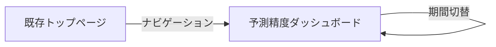
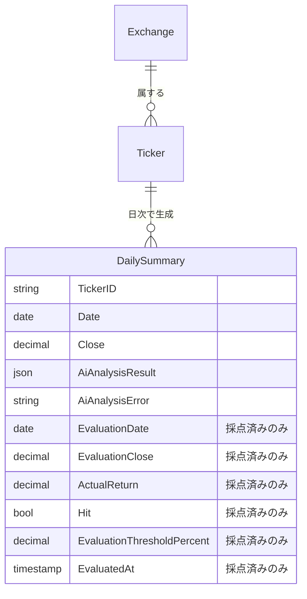

# Stock Tracer 予測精度の自動採点・可視化基盤 - 外部設計

<!--
    このドキュメントは開発時のみ使用します。
    開発完了後（作業 8）に docs/services/stock-tracker/external-design.md に統合し、削除します。

    関連 Issue: #3018
    入口ドキュメント: tasks/stock-tracer-prediction-evaluation/README.md
-->

> **本ドキュメントは確定版**（作業 2 で PoC FB を反映済み）。後続作業（3 以降の backend / API / UI 配線）はこの設計に従う。

---

## 1. 画面設計

### 1.1 画面一覧

| 画面 ID | 画面名 | パス | 対応ユースケース | 優先度 |
|---------|--------|------|------------------|--------|
| SCR-001 | 予測精度ダッシュボード | `/prediction-evaluation` | UC-002 | 高 |

### 1.2 画面遷移図



ナビゲーションは `ThemeRegistry` の「予測精度」リンク（`stocks:read` 権限保有時のみ表示）から遷移する。Phase 1 では本ページから他ページへの動的遷移はない。

### 1.3 主要画面の設計

#### SCR-001: 予測精度ダッシュボード

**概要**

AI 予測の採点結果を期間別に可視化する単一ページ画面。日毎の的中率（方向精度）を目視確認するための土台 UI で、AI 改善ロジック（Phase 2-4）の評価基盤として位置付ける。

**画面レイアウト（確定版）**

```
┌─────────────────────────────────────────────────────────┐
│ ヘッダー（既存ナビゲーション）                                │
├─────────────────────────────────────────────────────────┤
│                                                         │
│  予測精度ダッシュボード                                       │
│  直近 30 日の方向精度: 56.4%（採点 218 件、総合精度 58.2%）    │
│  ┌────────────────────────────────────────────────┐    │
│  │ ⓘ  PoC 段階：本ダッシュボードはモックデータを表示...     │    │
│  └────────────────────────────────────────────────┘    │
│  ─────────────────────────────────────                  │
│  [集計期間: 直近 30 日 ▼]                                │
│                                                         │
│  日次の方向精度推移                                        │
│  ┌─────────────────────────────────────────┐           │
│  │     ╱╲    ╱╲                            │           │
│  │    ╱  ╲  ╱  ╲    ╱──╲                   │           │
│  │ ──╱    ╲╱    ╲──╱    ╲── 折れ線：方向精度  │           │
│  │ ▮  ▮▮  ▮▮▮ ▮  ▮▮▮ ▮▮ 棒（右軸）：判定件数│           │
│  └─────────────────────────────────────────┘           │
│  [数値テーブル: 日付 / 方向精度 / 判定済み件数]              │
│                                                         │
│  シグナル別の精度                                          │
│  BULLISH  ████████████░░░░░  61.2%  (n=82)             │
│  NEUTRAL  ███████████░░░░░░  60.5%  (n=57)             │
│  BEARISH  ████████░░░░░░░░░  53.8%  (n=79)             │
│  [数値テーブル: シグナル / 精度 / 件数]                     │
│                                                         │
└─────────────────────────────────────────────────────────┘
```

**主要 UI 要素**

| 要素 | 種別 | 説明 |
|------|------|------|
| 主要指標テキスト | 見出し直下のサブタイトル（`Typography variant="subtitle1"` / `color="text.secondary"`） | `期間ラベル + 方向精度 + 採点件数 + 総合精度` の 1 行。判定済み 0 件のときは「期間ラベル: 採点済みの予測がありません」。読み込み中は「期間ラベル: 集計中...」 |
| PoC 注記アラート | Material-UI `Alert severity="info"` | 作業 7（本物 API への切替）が完了するまで残す。完了時に削除 |
| 期間セレクタ | `@nagiyu/ui` の `Select` | 直近 7 日 / **直近 30 日（デフォルト）** / 直近 90 日 / 全期間 |
| 日次推移グラフ | echarts 2 軸：折れ線（方向精度 %、左軸 0-100）+ 棒（判定済み件数、右軸） | 本ダッシュボードの中心指標。数値テーブルを併設して a11y 担保 |
| シグナル別精度 | echarts 棒グラフ + 数値テーブル | BULLISH 緑 / NEUTRAL グレー / BEARISH 赤。棒上に精度値ラベル |

**ユーザーインタラクション**

| 操作 | 結果 |
|------|------|
| 期間ドロップダウンを変更 | 主要指標テキスト・日次推移グラフ・シグナル別グラフが再集計され表示更新（ローディング表示あり） |

**表示条件・状態**

- **ローディング**: `summary.loading` が true の間は `LoadingState`、主要指標テキストは「集計中...」
- **空状態（判定済み 0 件）**: 主要指標テキストが「期間ラベル: 採点済みの予測がありません」に変化。下位の日次推移・シグナル別セクション自体は描画しない（情報量がないため）
- **エラー**: `summary.error` がセットされたら `ErrorAlert` を主要指標テキストと期間セレクタの間に表示。再読み込みはブラウザのリロードで対応（専用ボタンは Phase 1 では設けない）
- **未認証 / `stocks:read-evaluation` 権限なし**: 既存認証フロー経由でログイン誘導 + 権限なし時は `ErrorAlert` で「予測精度ダッシュボードを表示する権限がありません。」。Phase 1 では `stock-admin` ロールのみ閲覧可能（`stock-viewer` / `stock-user` には公開しない）

### 1.4 レスポンシブ方針

- モバイル：縦スタック表示。グラフは最小高さ 240-280px、テーブルは横スクロール許容
- デスクトップ：縦並びのまま。日次推移グラフは最小高さ 360px に拡張
- 既存 Material-UI のブレークポイントに準拠

### 1.5 アクセシビリティ方針

- 既存 web 全体の方針に準拠
- グラフは数値を別途テーブル形式で参照可能にする（スクリーンリーダー対応）
- 色のみで状態を伝えない（精度高低を色 + 数値ラベルで表現）

---

## 2. 概念データモデル

### 2.1 主要エンティティ一覧

| エンティティ | 説明 | 主要な属性（概念レベル） |
|--------------|------|--------------------------|
| 既存：日次サマリー（採点結果を統合） | AI 解析・OHLCV に加え、採点結果（Evaluation\* フィールド）も同レコードに保持 | 銘柄、日付、OHLCV、AI 解析結果、AI 解析エラー、採点日、採点終値、実績リターン、Hit/Miss、採点閾値、採点タイムスタンプ |
| 既存：銘柄 | 銘柄マスター（既存） | 銘柄 ID、名前、取引所 ID |
| 既存：取引所 | 取引所マスター（既存） | 取引所 ID、名前、タイムゾーン、取引時間 |

採点結果は独立エンティティとせず DailySummary に optional フィールドとして同居させる（A 案）。決定理由は [`design.md`](./design.md) §2.1 を参照。

### 2.2 エンティティ関係図



採点済みかどうかは `EvaluatedAt` の有無で判別する。物理 DB スキーマ（PK/SK・GSI 設計）は [`design.md`](./design.md) を参照。

---

## 3. 設計上の決定事項（ADR）

### ADR-001: ダッシュボードを既存 web に新規ページとして追加する

**背景・問題**

精度可視化のための表示手段として、(a) 既存 web に新規ページ追加 / (b) 別アプリ（管理ダッシュボード等）として独立 / (c) DynamoDB 直接参照のみ、の選択肢があった。

**決定**

(a) 既存 web に新規ページを追加する。

**根拠・トレードオフ**

- 既存認証フローが流用でき、運用がシンプル
- Material-UI コンポーネントを既存の規約通り使えるので開発コストが低い
- 「採点データを見ること」自体が利用者にとって新たな価値の一部であり、メインの web 体験から切り離す必要がない
- 別アプリ案は infra コストと認証実装の二重化が発生するため不採用

### ADR-002: シグナル別精度に NEUTRAL を含めて表示する

**背景・問題**

NEUTRAL は実取引上「アクションなし」を意味するが、シグナル分布や AI が「逃げているだけかどうか」を判断する材料として可視化する価値がある。

**決定**

シグナル別精度棒グラフには NEUTRAL を含めて 3 段階で表示する。NEUTRAL 比率は独立指標としては UI に出さず、シグナル別の `count` から導出可能な情報として扱う。

**根拠・トレードオフ**

- NEUTRAL 比率を独立カードに出すと、4-5 個並ぶ KPI の中で「精度ではない値」が混ざり座りが悪い
- シグナル別棒グラフで NEUTRAL の棒の存在と件数が見えれば、保守的すぎる挙動の検知は十分可能
- 一方で「方向精度（BULLISH+BEARISH のみ）」を主要指標テキストの中心数値に据えることで、実用的な精度感は一目で分かるようにする

### ADR-003: KPI カードを廃止し、見出し直下の主要指標テキスト 1 行に集約する

**背景・問題**

PoC では `総合精度 / 方向精度 / NEUTRAL 比率 / 判定済み件数 / AI 失敗件数` の KPI カード 5 枚をページ上部に並べていたが、本ダッシュボードの主目的（評価基盤の据え付け、日毎の的中率を目視確認）に照らすと過剰だった。

**決定**

KPI カードという UI 要素そのものを廃止し、ページ見出し直下のサブタイトルテキスト 1 行に主要指標を集約する：

```
直近 N 日の方向精度: XX.X%（採点 N 件、総合精度 XX.X%）
```

判定済み 0 件のときは「期間ラベル: 採点済みの予測がありません」、ロード中は「期間ラベル: 集計中...」。

**根拠・トレードオフ**

- カード形式は 1-2 指標を強調する用途にしては装飾過剰で、「マーケティング用ダッシュボード」風になりがち。土台ツールとしては情報密度を優先する
- 中心指標は日次推移グラフ（折れ線）であり、KPI カードを KPI セクションとして独立に置く必要性が薄い
- モバイルでも 1 行に収まり、レイアウトが整う

### ADR-004: NEUTRAL 比率・AI 失敗件数・判定済み件数の単独カードを廃止する

**背景・問題**

PoC で個別の KPI カードとして並んでいた 3 指標について、保持する意義を再評価した。

**決定**

- **NEUTRAL 比率**: 単独表示を廃止。シグナル別棒グラフから視覚的に把握する
- **AI 失敗件数**: UI から完全に外す。AI 解析失敗は「予測精度の分析」とは性質が違う運用監視指標で、UI で出すのが妥当でない。将来 CloudWatch メトリクス等で監視する想定
- **判定済み件数**: 単独表示を廃止。日次推移グラフの右軸棒で件数推移は把握可能。期間全体の合計は主要指標テキストの括弧内に併記する

**根拠・トレードオフ**

- 主要指標が絞られることで「何を見るダッシュボードか」が明確になる
- AI 失敗件数は捨てる判断だが、現状他で監視する術もないため Phase 1 ではトレードオフとして許容（将来の運用監視整備で取り戻す）
- 判定済み件数を主要指標テキストの括弧内に残すのは、精度値の信頼性チェック（n=5 か n=500 か）を一目で確認できるようにするため

### ADR-005: 銘柄別・取引所別の集計表示を Phase 1 UI から外す

**背景・問題**

PoC では銘柄別精度テーブル（ソート可、最低件数フィルタ可）と取引所別テーブルを実装していたが、本タスクの目的（評価基盤の据え付け）に照らすと優先度は低い。

**決定**

Phase 1 UI からは銘柄別・取引所別の表示を外す。将来 AI 改善ロジック（Phase 2-4）が必要としたとき、または運用観点で「どの銘柄が外れやすい」を確認したくなったときに、API + UI を再追加する想定。

データ側（DailySummary に Evaluation\* フィールドを保存）は影響を受けないため、将来集計の素材は変わらず蓄積される。

**根拠・トレードオフ**

- 統計的に意味のある粒度（最低件数フィルタ）の議論や、銘柄詳細遷移の検討を Phase 1 から外せる
- 「どの銘柄が外れやすいか」が見えなくなるが、Phase 1 では「全体精度の動きを定量的に把握できる」が達成できれば十分
- 再追加時は API レスポンス型の拡張のみで済む（DB スキーマ変更は不要）

### ADR-006: KPI 前期比は Phase 1 では実装しない

**背景・問題**

主要指標テキストに「前期比 +1.2pt」のような差分を出すと改善トレンドが一目で分かるが、Phase 1 ではデータ蓄積が始まったばかりで前期との比較が意味を成しにくい（特に「全期間」期間では定義しづらい）。

**決定**

Phase 1 では前期比は出さない。データが数十日分以上蓄積されてから、Phase 2 以降の改善ロジック評価フェーズで再検討する。

**根拠・トレードオフ**

- 前期定義（直近 7 日に対する前 7 日 / 同期間前年 等）の決め込みコストを後回しにできる
- ノイズ（少数サンプルでの大きな差分）が UI に出ない
- 改善施策の効果は当面、推移グラフを目視で読み取る運用で代替

### ADR-007: 過去データ遡及採点はダッシュボード初期表示に含めない

**背景・問題**

蓄積済みの予測データを遡って採点すれば初期表示時から豊富なデータが見えるが、本 Issue のスコープからは外している。

**決定**

Phase 1 では新規予測のみ採点する。ダッシュボード初期は「採点済みの予測がありません」または少ないデータからスタートし、日次で増えていく。

**根拠・トレードオフ**

- スコープを絞り Phase 1 を最短で完了することを優先
- 遡及採点は別 Issue でリスクと工数を独立して評価する
- 初期データが少ない問題は数日〜数週間で自然解消する

### ADR-008: 予測精度ダッシュボードのアクセス制御は専用 permission を新設する

**背景・問題**

PoC では既存の `stocks:read` 権限でガードしていたが、本ダッシュボードは AI 改善判断のための **運用者向け** 機能であり、一般 Stock 利用者（`stock-viewer` / `stock-user`）に公開する性質ではない。一方で `stocks:manage-data`（マスタデータ管理）を流用するのも意味が拡散する（read 用途とマスタデータ管理は性質が違う）。

**決定**

新規 permission **`stocks:read-evaluation`** を導入し、Phase 1 では `stock-admin` ロールにのみ付与する。

- `libs/common/src/auth/types.ts` の `Permission` 型に追加
- `libs/common/src/auth/roles.ts` の `stock-admin` の `permissions` 配列に追加
- ダッシュボードページ（`page.tsx`）とナビゲーション（`ThemeRegistry.tsx`）のガードを `stocks:read-evaluation` に切り替え
- 精度集計 API（`/api/prediction-evaluation/summary`）でも同じ permission をチェック

実装作業は本タスク（作業 2）のスコープ外。`tasks.md` の **作業 6（精度集計 API）** で API 実装と同タイミングで行う。

**根拠・トレードオフ**

- 命名が意図と一致する（`stocks:read-evaluation`）。`stocks:read` 流用だと「Stock 関連の閲覧者なら誰でも見える」と読めてしまう
- `stocks:manage-data` 流用案も検討したが、本来「マスタデータの書き込み」を表す名前なので、read 用途を載せると意味が拡散する
- 将来「精度ダッシュボードだけ見せる中間ロール」（例：データサイエンス担当者）を作りたい時に、permission を分けておけば対応コストが低い
- Phase 2 以降で一般利用者にも公開する判断になった場合、permission 自体を `stock-user` 等に付与し直すか、別 permission（例：`stocks:read-evaluation-summary`）を切る選択がある
