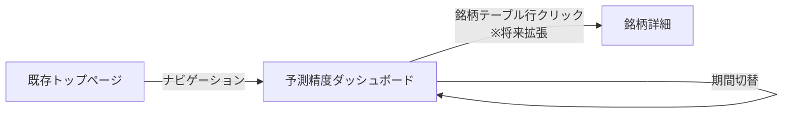
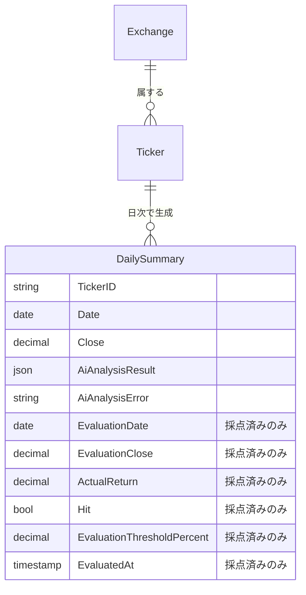

# Stock Tracer 予測精度の自動採点・可視化基盤 - 外部設計

<!--
    このドキュメントは開発時のみ使用します。
    開発完了後（作業 8）に docs/services/stock-tracker/external-design.md に統合し、削除します。

    関連 Issue: #3018
    入口ドキュメント: tasks/stock-tracer-prediction-evaluation/README.md
-->

> **注記**: 本ドキュメントは **PoC 前の暫定案**。`tasks.md` の作業 1（UI PoC）で本案ベースに実物を作り、作業 2（PoC FB 反映で要件再確定）でレビュー結果を踏まえた **確定版** に更新する。確定版の内容は最終的に作業 8 で `docs/services/stock-tracker/external-design.md` に統合される。
>
> 作業 1 ではここに記載された画面構成・UI 要素を出発点として PoC を実装する。FB によって変わる可能性が高いのは：KPI カードの種類と並び、グラフの選択、銘柄テーブルの列構成、補助情報の見せ方、レスポンシブ時の縦積み順、空状態・エラーの文言。一方でほぼ変わらないと想定しているのは：認証ガード方式、Material-UI を使う前提、Fast CI の chromium-mobile を E2E に使う前提。

---

## 1. 画面設計

### 1.1 画面一覧

| 画面 ID | 画面名 | パス | 対応ユースケース | 優先度 |
|---------|--------|------|------------------|--------|
| SCR-001 | 予測精度ダッシュボード | `/prediction-evaluation`（仮） | UC-002 | 高 |

パス名は実装時に既存の URL 規約と整合する形で確定する（例：既存の銘柄一覧が `/tickers` なら `/prediction-evaluation` でも良いし、`/predictions/evaluation` のようなネスト構造でも良い）。

### 1.2 画面遷移図



Phase 1 では銘柄テーブル行クリックでの銘柄詳細遷移は実装しない（将来拡張）。

### 1.3 主要画面の設計

#### SCR-001: 予測精度ダッシュボード

**概要**

AI 予測の採点結果を期間・切り口別に可視化する単一ページ画面。Phase 1 の中核 UI。

**画面レイアウト（概念）**

```
┌─────────────────────────────────────────────────────────┐
│ ヘッダー（既存ナビゲーション）                                │
├─────────────────────────────────────────────────────────┤
│                                                         │
│  予測精度ダッシュボード                  [期間: 30日 ▼]    │
│  ─────────────────────────────────────                  │
│                                                         │
│  ┌─────────┐ ┌─────────┐ ┌─────────┐ ┌─────────┐      │
│  │ 総合精度 │ │ 方向精度 │ │NEUTRAL比│ │ 判定済  │      │
│  │  52.3%  │ │  56.1%  │ │  31.2%  │ │  1,248  │      │
│  └─────────┘ └─────────┘ └─────────┘ └─────────┘      │
│                                                         │
│  方向精度の推移                                           │
│  ┌─────────────────────────────────────────┐           │
│  │     ╱╲    ╱╲                            │           │
│  │    ╱  ╲  ╱  ╲    ╱──╲                   │           │
│  │ ──╱    ╲╱    ╲──╱    ╲──               │           │
│  └─────────────────────────────────────────┘           │
│                                                         │
│  シグナル別ヒット率                                        │
│  BULLISH  ████████████░░░░░  61.2%  (n=512)            │
│  NEUTRAL  ███████████░░░░░░  53.8%  (n=389)            │
│  BEARISH  ████████░░░░░░░░░  47.3%  (n=347)            │
│                                                         │
│  ┌────────────────────┐  ┌──────────────────┐         │
│  │ 銘柄別ヒット率      │  │ 取引所別ヒット率  │         │
│  │ ───────────────    │  │ ──────────────   │         │
│  │ AAPL    65%  n=42  │  │ NASDAQ  54%      │         │
│  │ TSLA    58%  n=38  │  │ NYSE    51%      │         │
│  │ ...                │  │ ...              │         │
│  └────────────────────┘  └──────────────────┘         │
│                                                         │
│  補助情報                                                 │
│  AI 解析失敗件数: 23 件（採点対象外）                       │
│                                                         │
└─────────────────────────────────────────────────────────┘
```

**主要 UI 要素**

| 要素 | 種別 | 説明 |
|------|------|------|
| 期間セレクタ | ドロップダウン | 7 日 / 30 日 / 90 日 / 全期間。デフォルト 30 日 |
| KPI カード（4 種） | カード | 総合精度・方向精度・NEUTRAL 比率・判定済み件数。数値と前期比（任意で実装） |
| 推移グラフ | 折れ線グラフ | 日次の方向精度。X 軸：日付、Y 軸：精度 % |
| シグナル別ヒット率 | 横棒グラフ | BULLISH / NEUTRAL / BEARISH ごとに棒で表示、件数を併記 |
| 銘柄別ヒット率テーブル | テーブル | 銘柄・ヒット率・件数。ソート可、最低件数フィルタ（デフォルト n ≥ 5） |
| 取引所別ヒット率 | 小規模テーブル | 取引所・ヒット率・件数 |
| AI 失敗件数 | テキスト | 採点対象外として除外された件数を補助情報として表示 |

**ユーザーインタラクション**

| 操作 | 結果 |
|------|------|
| 期間ドロップダウンを変更 | 全集計値が再計算され表示更新（ローディング表示あり） |
| 銘柄テーブルのヘッダクリック | 該当列でソート（昇順/降順切替） |
| 銘柄テーブルの最低件数フィルタ変更 | フィルタ適用後の銘柄のみ表示 |

**表示条件・状態**

- **ローディング**: 集計データ取得中はスケルトン表示
- **空状態**: 採点済み予測がゼロの場合「まだ採点データがありません。新規予測の翌営業日終値が確定すると表示されます」
- **エラー**: API エラー時はエラーメッセージと再読み込みボタン
- **未認証**: 既存認証フローでログインページにリダイレクト

### 1.4 レスポンシブ方針

- モバイル：縦スタック表示。KPI カードは 2×2 グリッド、テーブルは横スクロール許容
- デスクトップ：上記レイアウト通り
- 既存 Material-UI のブレークポイントに準拠

### 1.5 アクセシビリティ方針

- 既存 web 全体の方針に準拠
- グラフは数値を別途テーブル/リスト形式でも参照可能にする（スクリーンリーダー対応）
- 色のみで状態を伝えない（精度高低を色 + 数値で表現）

---

## 2. 概念データモデル

### 2.1 主要エンティティ一覧

| エンティティ | 説明 | 主要な属性（概念レベル） |
|--------------|------|--------------------------|
| 既存：日次サマリー（採点結果を統合） | AI 解析・OHLCV に加え、採点結果（Evaluation\* フィールド）も同レコードに保持 | 銘柄、日付、OHLCV、AI 解析結果、AI 解析エラー、採点日、採点終値、実績リターン、Hit/Miss、採点閾値、採点タイムスタンプ |
| 既存：銘柄 | 銘柄マスター（既存） | 銘柄 ID、名前、取引所 ID |
| 既存：取引所 | 取引所マスター（既存） | 取引所 ID、名前、タイムゾーン、取引時間 |

採点結果は独立エンティティとせず DailySummary に optional フィールドとして同居させる（A 案）。決定理由は [`design.md`](./design.md) §2.1 を参照。

### 2.2 エンティティ関係図



採点済みかどうかは `EvaluatedAt` の有無で判別する。物理 DB スキーマ（PK/SK・GSI 設計）は [`design.md`](./design.md) を参照。

---

## 3. 設計上の決定事項（ADR）

### ADR-001: ダッシュボードを既存 web に新規ページとして追加する

**背景・問題**

精度可視化のための表示手段として、(a) 既存 web に新規ページ追加 / (b) 別アプリ（管理ダッシュボード等）として独立 / (c) DynamoDB 直接参照のみ、の選択肢があった。

**決定**

(a) 既存 web に新規ページを追加する。

**根拠・トレードオフ**

- 既存認証フローが流用でき、運用がシンプル
- Material-UI コンポーネントを既存の規約通り使えるので開発コストが低い
- 「採点データを見ること」自体が利用者にとって新たな価値の一部であり、メインの web 体験から切り離す必要がない
- 別アプリ案は infra コストと認証実装の二重化が発生するため不採用

### ADR-002: シグナル別ヒット率に NEUTRAL を含めて表示する

**背景・問題**

NEUTRAL は実取引上「アクションなし」を意味するが、シグナル分布や AI が「逃げているだけかどうか」を判断する材料として可視化する価値がある。

**決定**

シグナル別ヒット率には NEUTRAL を含めて 3 段階で表示する。同時に「方向精度（BULLISH+BEARISH のみ）」を KPI カードで別出ししてバランスを取る。

**根拠・トレードオフ**

- NEUTRAL 比率が極端に高い場合は AI が保守的すぎる可能性が見える
- 方向精度を KPI カード上位に置くことで、実用的な精度指標が一目で分かる
- 1 つの指標に丸めると「どこが強いか」が見えなくなるため、両方併記

### ADR-003: 銘柄別テーブルに最低件数フィルタを設ける

**背景・問題**

採点件数が少ない銘柄は精度の信頼区間が広く、ランキング上位/下位に表示されると誤った印象を与える。

**決定**

銘柄別テーブルにデフォルトで「件数 5 以上」のフィルタを設け、ユーザーが値を変更できるようにする。

**根拠・トレードオフ**

- 統計的に意味のある粒度の銘柄に絞られる
- フィルタ値は変更可能なので、低件数銘柄を確認したいケースにも対応可能
- 厳密な信頼区間表示までは Phase 1 のスコープ外（後続フェーズで検討）

### ADR-004: 過去データ遡及採点はダッシュボード初期表示に含めない

**背景・問題**

蓄積済みの予測データを遡って採点すれば初期表示時から豊富なデータが見えるが、本 Issue のスコープからは外している。

**決定**

Phase 1 では新規予測のみ採点する。ダッシュボード初期は「データなし」または少ないデータからスタートし、日次で増えていく。

**根拠・トレードオフ**

- スコープを絞り Phase 1 を最短で完了することを優先
- 遡及採点は別 Issue でリスクと工数を独立して評価する
- 初期データが少ない問題は数日〜数週間で自然解消する
