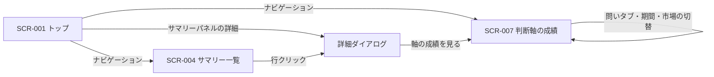
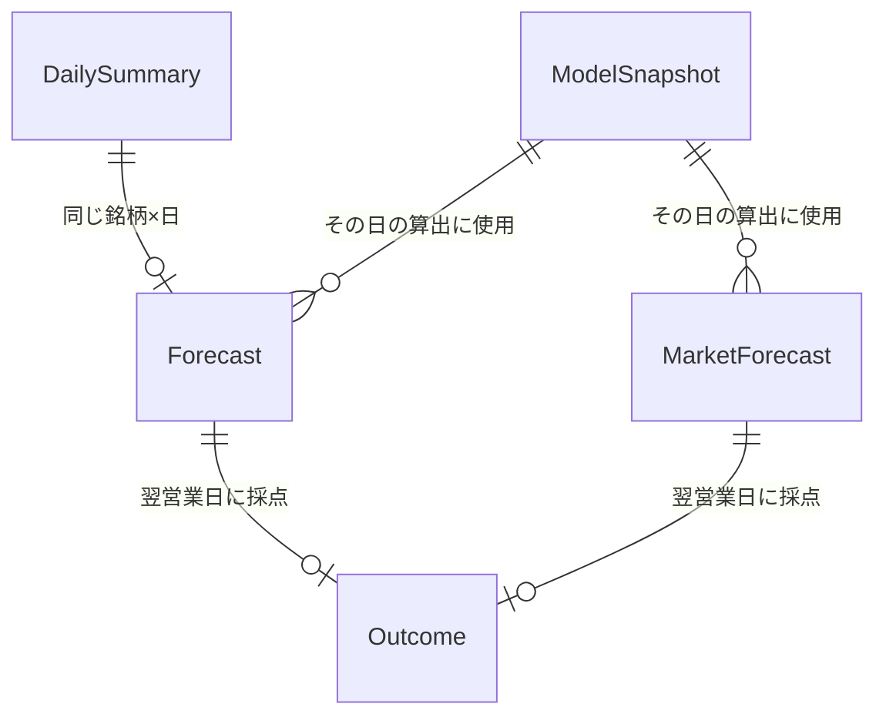

# Stock Tracker v4.0.0 外部設計書

<!--
    このドキュメントは開発時のみ使用します。
    開発完了後に docs/services/stock-tracker/external-design.md に統合して削除します。

    入力: tasks/stock-tracker-v4/requirements.md
    次に作成するドキュメント: tasks/stock-tracker-v4/design.md
-->

本書は v4.0.0 で変わる画面・API を定める。変わらない画面（SCR-002 保有株式・SCR-003 アラート・SCR-005 取引所・SCR-006 ティッカー）は `docs/services/stock-tracker/external-design.md` のまま変更しない。

---

## 1. 画面設計

### 1.1 画面一覧（変更分）

| 画面 ID | 画面名 | パス | 対応要件 | 変更 |
|--------|--------|------|---------|------|
| SCR-001 | トップ画面（チャート表示） | `/` | FR-17 | サマリーパネルを確度の要約に置き換える |
| SCR-004 | サマリー一覧画面 | `/summaries` | FR-15・FR-16・FR-18 | 市場の荒れ予報カードを追加。一覧の列と詳細ダイアログを置き換える |
| SCR-007 | 判断軸の成績画面 | `/axis-performance` | FR-19 | 予測精度ダッシュボード（`/prediction-evaluation`）を置き換える。画面 ID は引き継ぐ |

- 旧パス `/prediction-evaluation` は `/axis-performance` へリダイレクトする（ブックマーク対策）。
- SCR-007 は `stocks:read` で閲覧できる（FR-20・ADR-V4-03）。ナビゲーションには `/summaries` と同じ条件で表示する。

### 1.2 画面遷移図（変更分）

### 1.3 表示の共通ルール

画面をまたいで同じ表記を使う。

**確度のラベル**（FR-11a・FR-15）

| 問い | 中立帯の外（上側） | 中立帯の外（下側） | 中立帯の内側 |
|------|------------------|------------------|------------|
| 方向（Q-DIR） | 「強含み 56%」 | 「弱含み 58%」 | 「中立」 |
| 荒れ（Q-VOL） | 「荒れそう 64%」 | 「平常」 | 「平常」 |
| 市場の荒れ（Q-MKT） | 「荒れそう 64%」 | 「平常」 | 「平常」 |

- 方向の下側は、**そちら向きの確率**で表示する。P(市場平均を上回る) = 42% なら「弱含み 58%」。
- 荒れの下側（平常より穏やか）は、要件どおり「平常」にまとめる。
- 中立・平常は控えめな色で出す。強含み／弱含み／荒れそうは色を付けるが、色だけに頼らずラベル文字で区別する（アクセシビリティ）。
- 確率は整数 % で表示する。基準値も併記する箇所では「基準 50%」と書く。

**基準日の表記**

- 確度は「その日の引け時点で出した、翌営業日についての確率」である。画面には「9/25 引け時点」のように基準日を必ず出し、「明日」の意味を取り違えないようにする。

**確度がない場合**

| 状態 | 表示 |
|------|------|
| v4 稼働前の日付のサマリー（確度レコードなし） | 「—」。ツールチップ「この日の確度はありません」 |
| 確度の算出に失敗した（NFR-2） | 「—」。ツールチップ「確度を算出できませんでした」。OHLCV・パターンは通常どおり表示する |
| 平常の算出に必要な履歴が足りない銘柄（登録直後など） | 荒れは「—」。方向は基準値付近の確率が出るので通常どおり表示する |

**寄与の表記**（FR-16）

- 寄与は「その軸によって確率が何 pt 動いたか」で表示する（例: 「+2.1pt」「−0.8pt」）。合成は対数オッズの加算になるため、軸ごとの寄与を基準値からの差に分解できる（design.md）。
- 件数不足で重みがほぼゼロの軸は、寄与の横に「件数不足」の目印を付ける。

---

### 1.4 画面の設計

#### SCR-004: サマリー一覧画面（`/summaries`）

**概要**

市場全体の荒れ予報と、銘柄ごとの確度・点灯軸数を一覧で確認する画面。`stocks:read` 権限が必要。

**主要 UI 要素**

| 要素 | 種別 | 説明 |
|-----|------|------|
| 市場の荒れ予報カード | 情報カード（JP・US の 2 枚） | 一覧より上に置く。市場ごとに Q-MKT のラベル・確率・基準値・基準日を表示する（FR-18）。取引所セレクタの選択に関係なく、常に 2 市場とも出す |
| 取引所セレクタ | ドロップダウン | 現行どおり |
| ティッカー一覧 | テーブル | 列: シンボル／銘柄名／保有／方向／荒れ／点灯／買いアラート数／売りアラート数 |
| 方向・荒れ列 | セル | 共通ルールのラベル。列見出しのクリックで確率順に並べ替える（方向は P(上回る)、荒れは P(荒れる)） |
| 点灯列 | セル | 合致した単一パターンの数。内訳を「3（買2売1）」のように添える。複合パターン軸（合致数 ≥ 2）と数値型軸（大きさ系）は数えない（ADR-V4-04） |
| 詳細ダイアログ | ダイアログ | 後述。SCR-001 からも同じものを開く |

- 撤去する列: 投資判断・予測リターン・確信度（FR-22）、買いシグナル数・売りシグナル数（点灯列に統合）。

**ユーザーインタラクション**

| 操作 | 結果 |
|------|------|
| 方向／荒れの列見出しをクリック | 確率の降順 → 昇順 → 既定順で並べ替える |
| ティッカー行をクリック | 詳細ダイアログが開く |
| 市場の荒れ予報カードの「？」 | 「明日、市場全体（登録銘柄の平均）の値幅が平常を上回る確率」という説明と、基準値の意味を表示する |

**表示条件・状態**

- 確率は大半の銘柄で 50% 付近に集まり、「中立」「平常」が多くなる前提で設計する。中立が多いこと自体が「手がかりが少ない」という正しい情報である（要件 FR-15）。
- 市場の荒れ予報の算出に失敗したときは、カードに「—」を出す。
- **参考値の表記**: Q-MKT は 1 日 1 件（市場ごと）しか採点が溜まらず、稼働開始時点で約 90 日分しかない。確率の信頼性が低い間は、カードに「過去の日数が少なく参考値」と添える（API の `lowSample`）。市場ごとの採点済み日数が約 1 年（250 営業日）に達したら外す（design.md §1.5）。

---

#### 詳細ダイアログ（SCR-001・SCR-004 共通）

**概要**

1 銘柄の確度を、基準値・同じ確率帯の過去実績・軸の内訳とあわせて示す。「表示された確率を信じてよいか」と「何が確率を動かしたか」を判断できるようにする（FR-16）。

**構成（上から）**

| 要素 | 種別 | 説明 |
|-----|------|------|
| ヘッダ | テキスト | 銘柄名・シンボル・基準日（「9/25 引け時点」） |
| 確度カード（方向・荒れの 2 枚） | 情報カード | ラベルと確率、基準値、基準値との差（「基準 50% ／ +6pt」）。その下に**同じ確率帯の過去実績**を 1 行で出す（「55〜60% の帯の実績: 的中 57%（212 件）」）。件数が少ない帯は「件数が少なく参考値」と添える |
| 内訳タブ | タブ（方向／荒れ） | カードに対応する問いの内訳を切り替える |
| 内訳テーブル | テーブル | 列: 軸名／値／過去成績（件数・的中率・基準差）／寄与。寄与の絶対値の大きい順に並べる |
| 点灯していない軸 | 折りたたみ | 点灯型で点灯しなかった軸は、既定で閉じた折りたたみにまとめる（寄与は 0 か、ごく小さい） |
| 日足チャート | チャート | 現行どおり（直近 50 本） |
| アラート作成ボタン | ボタン | 現行どおり |
| 成績画面への導線 | リンク | 「判断軸の成績を見る」→ SCR-007（対応する問いのタブを開く） |

- **値の列**: 点灯型は「点灯」、数値型は平常比で表示する（例: 「直近 5 日の値幅 1.4 倍（平常比）」）。
- **撤去する要素**: AI 解析（価格変動・パターン分析・サポート／レジスタンス・関連市場動向・投資判断）、パターン分析の買い／売り一覧。パターンの点灯は内訳テーブルに含まれる。

**表示条件・状態**

- 確度がない場合は共通ルールに従い、カードに「—」、内訳テーブルの代わりに理由を出す。チャートとアラート作成は通常どおり使える。

---

#### SCR-001: トップ画面（サマリーパネルのみ変更）

**変更内容**

日次サマリーパネルの AI 由来の表示（投資判断・予測リターン・確信度・AI 判定・サポート／レジスタンス）を、次の要約に置き換える（FR-17）。保有株式・アラートのパネルは変更しない。

| 要素 | 説明 |
|-----|------|
| 基準日 | 「9/25 引け時点」 |
| 方向 | 共通ルールのラベル＋基準値 |
| 荒れ | 共通ルールのラベル＋基準値 |
| 点灯 | 点灯数と買い／売りの内訳 |
| 詳細ボタン | 詳細ダイアログを開く |

---

#### SCR-007: 判断軸の成績画面（`/axis-performance`）

**概要**

全軸の成績と、合成した確度の成績（キャリブレーション）を問いごとに確認する画面。予測精度ダッシュボードを置き換える（FR-19）。`stocks:read` 権限で閲覧できる。

**主要 UI 要素**

| 要素 | 種別 | 説明 |
|-----|------|------|
| 期間セレクタ | トグル | 30 日／90 日／全期間。期間は**予測日**で切る |
| 市場フィルタ | トグル | 全体／JP／US。Q-MKT タブでは JP／US のみ |
| 問いタブ | タブ | 方向／荒れ／市場の荒れ |
| 見出し行 | テキスト | 対象期間の採点済み件数と基準値（「採点済み 8,120 件 ／ 基準 50.3%」） |
| 確度の成績 | 表＋信頼度図 | 確率帯（5pt 刻み）ごとの件数・予測の平均・実際の的中率。信頼度図は対角線（完全なキャリブレーション）と比べて描く。見出しの下に、現在の中立帯を「基準値 +0〜+5pt は中立」のように文字で示す（FR-8） |
| 軸ごとの成績 | テーブル | 列: 軸名／種類（点灯型・数値型）／件数／的中率／基準差／平均超過リターン（方向タブのみ）／現在の重み。各列で並べ替え可能。件数不足の軸には目印を付ける（FR-7） |

- 「現在の重み」は最新の算出日の重みを、棒の長さと符号（+／−）で表示する。数値型軸の「的中率」は、値が平常より高い側（上位の区分）での的中率とする（定義は design.md）。

**ユーザーインタラクション**

| 操作 | 結果 |
|------|------|
| 期間・市場・問いを切り替え | 表と図を再集計して表示する |
| 軸名をクリック | その軸の説明（定義・対象の問い）をツールチップで表示する |

**表示条件・状態**

- 採点が 1 件もない期間は空状態メッセージを表示する。
- 確率帯の件数が少ない行（目安 30 件未満）は薄く表示する。

---

### 1.5 レスポンシブ方針（変更分）

- 市場の荒れ予報カードは、モバイル幅では 2 枚を縦に積む。
- サマリー一覧は、モバイル幅では「シンボル／方向／荒れ／点灯」を優先して表示し、ほかの列は横スクロールで見せる（現行の方式に合わせる）。
- 詳細ダイアログの内訳テーブルは、モバイル幅では「軸名／寄与」だけを行に出し、値と過去成績は行を展開して見せる。
- 成績画面の軸テーブルは、モバイル幅では「軸名／件数／基準差／現在の重み」を優先する。

---

## 2. API（変更分）

認証・権限は現行どおり `withAuth` で行う。型の詳細は design.md に書く。

| メソッド | パス | 権限 | 変更 | 説明 |
|---------|------|------|------|------|
| GET | `/api/summaries?date=` | `stocks:read` | 変更 | 各ティッカーに確度の要約（方向・荒れの確率・基準値・ラベル区分・点灯数）を追加し、AI 関連フィールドを外す。レスポンスの最上位に市場の荒れ予報（JP・US）を追加する |
| GET | `/api/summaries/{tickerId}` | `stocks:read` | 変更 | 単体版。上と同じ形 |
| GET | `/api/forecasts/{tickerId}?date=` | `stocks:read` | 新規 | 詳細ダイアログ用。問いごとの確率・基準値・中立帯・同じ確率帯の過去実績・軸の内訳（値・過去成績・寄与・件数不足フラグ） |
| GET | `/api/axis-performance?question=&period=&market=` | `stocks:read` | 新規 | SCR-007 用。確率帯ごとの実績と、軸ごとの成績・現在の重み |
| GET | `/api/prediction-evaluation/summary` | — | 撤去 | FR-23 |
| POST | `/api/summaries/refresh` | `stocks:manage-data` | 変更なし | サマリー生成バッチを起動する（確度の算出も同じ流れで走る） |

- 一覧 API に内訳まで載せると、全銘柄分の軸データでレスポンスが重くなる。詳細は開いたときに取る（ADR-V4-02）。

---

## 3. 概念データモデル（追加分）

| エンティティ | 説明 | 単位 |
|------------|------|------|
| 判断軸の定義（Axis） | 軸 ID・名前・種類（点灯型／数値型）・対象の問い・算出方法。**コードで定義**し、DB には持たない | — |
| 確度レコード（Forecast） | その日に算出した軸の値・点灯状態、問いごとの確率・基準値・中立帯・寄与。予測時点の値として保存し、書き換えない（FR-12） | 銘柄 × 日 |
| 市場の確度レコード（MarketForecast） | 市場レベル軸の値と Q-MKT の確率・基準値・中立帯 | 市場 × 日 |
| 採点結果（Outcome） | 翌営業日の実績（超過リターン・値幅・平常比）と、問いごとの当否。確度レコードに付ける | 確度レコードと同じ |
| 重みのスナップショット（ModelSnapshot） | その日の算出に使った重み・基準値・中立帯・軸ごとの成績集計 | 問い × 算出した市場 × 日 |

- 既存の DailySummary は変更しない（AI 関連フィールドも残す。FR-24）。確度は別のレコードとして持ち、判断軸の追加で既存レコードを移行しなくて済むようにする（NFR-7）。保存形式は design.md で決める。

---

## 4. 設計上の決定事項（ADR）

### ADR-V4-01: 同市場平均と荒れ予報の単位を「市場（JP / US）」にする

**背景・問題**: 要件の初版は「同じ取引所」を単位としていた。しかし登録銘柄は TSE 67・NYSE 36・NASDAQ 33・AMEX 1 で、AMEX では同市場平均との差が常に 0 になり、AMEX 単独の荒れ予報も意味を持たない。

**決定**: JP（TSE）と US（NASDAQ・NYSE・AMEX）の 2 市場を単位とする（人と合意済み。requirements.md も更新済み）。

**根拠・トレードオフ**: 先行分析（#3831）も JP / US 単位で行っており、その結果とそのまま比べられる。取引所ごとの差（NASDAQ にハイテクが多い等）は区別できなくなるが、取引所単位では銘柄数が少なく平均が不安定になる。

### ADR-V4-02: 詳細ダイアログの内訳は専用 API で取る

**背景・問題**: 内訳は銘柄ごとに約 35 軸（方向 29・荒れ 6）あり、一覧の全銘柄分を載せるとレスポンスが大きくなる。

**決定**: 一覧 API は要約だけを返し、内訳は `/api/forecasts/{tickerId}` で開いたときに取る。

**根拠・トレードオフ**: ダイアログを開くたびに 1 往復増えるが、一覧の表示速度を優先する。既存の `/api/summaries/{tickerId}` と同じく、トップ画面からも同じ API を使える。

### ADR-V4-03: `stocks:read-evaluation` 権限を廃止する

**背景・問題**: 予測精度ダッシュボードは管理者だけが見る実験的な画面だったため、専用の権限を設けていた（旧 ADR-009）。v4 では確度が一般ユーザーの判断材料になり、その根拠となる成績も同じ権限で見られるべきである（FR-20）。

**決定**: SCR-007 は `stocks:read` で閲覧できるようにし、`stocks:read-evaluation` は Permission 型と stock-admin ロールから削除する（人と合意済み）。

**根拠・トレードオフ**: 使われない権限が残ると、ロール設計を読む人が混乱する。将来、管理者向けの分析機能を分けたくなったら、そのときに改めて権限を設ける。

### ADR-V4-04: 「点灯数」は単一パターンの合致数とする

**背景・問題**: 一覧の「点灯」列は、点灯している軸の数を示す（FR-15）。数値型軸（値幅・出来高比）は毎日値を持つため、「点灯」の概念がない。

**決定**: 点灯列は、合致した単一パターンだけを数え、買い／売りの内訳を添える。複合パターン軸と数値型軸は数えない。これらの効き具合は、確度と詳細ダイアログの内訳で見せる。

**根拠・トレードオフ**:

- 複合軸（買い合致数 ≥ 2）を数えると、買いパターン 2 つの銘柄が「3（買3）」になり、構成パターンと二重に数えてしまう。
- 数値型軸にしきい値を設けて「点灯」とみなす案もあるが、しきい値が恣意的になる。
- 結果として、現行の買い／売りシグナル数をまとめた形になり、利用者にとっても連続性がある。
