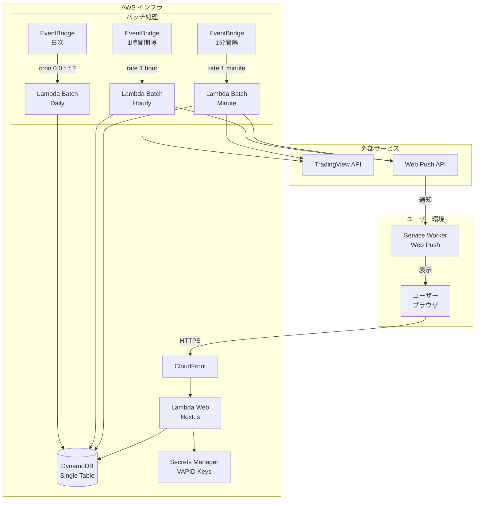
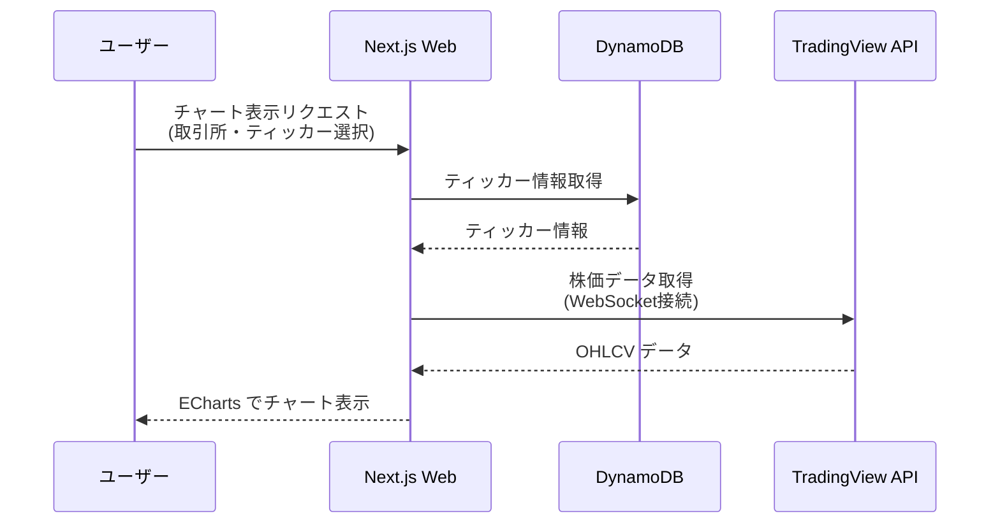
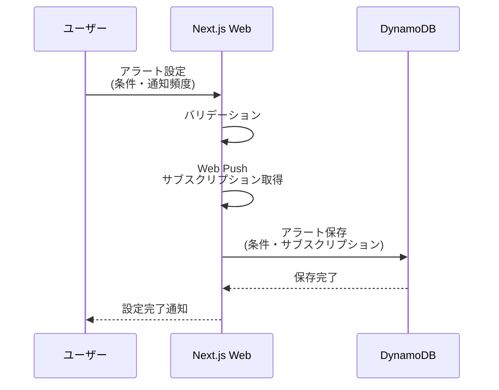
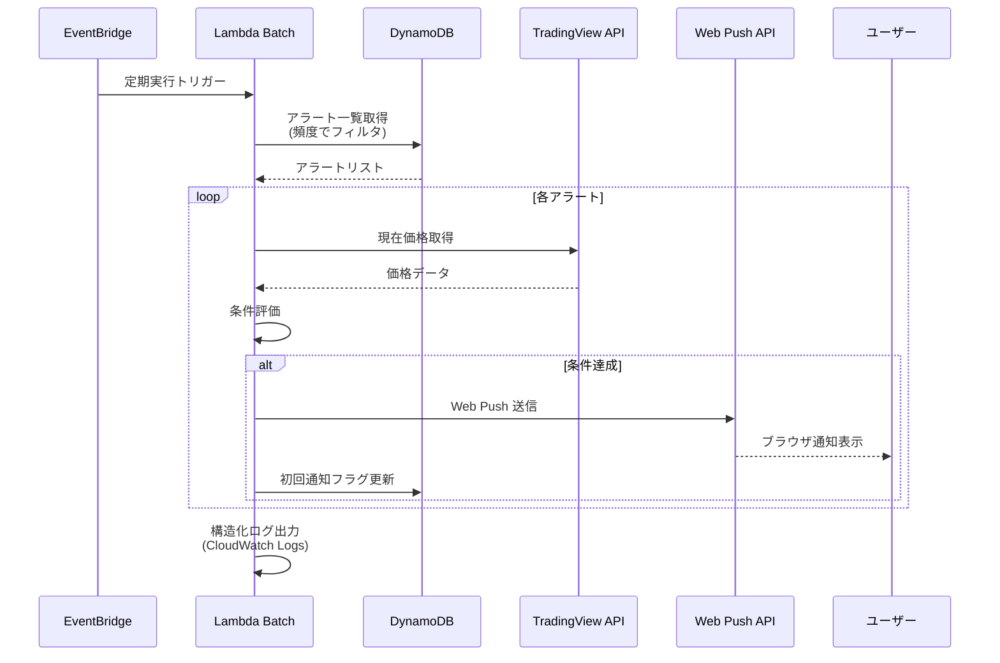

# Stock Tracker アーキテクチャ設計書

**ステータス**: Draft（設計段階）
**作成日**: 2026-01-13
**最終更新**: 2026-01-13

---

## 1. システム概要

Stock Tracker は、株価のリアルタイム監視と条件ベースのアラート通知を提供するサービスです。TradingView API から株価データを取得し、ユーザーが設定した条件（価格閾値など）を満たした場合に Web Push 通知を送信します。また、保有株式の管理とウォッチリスト機能により、投資判断を支援します。

### 1.1 全体構成図



---

## 2. 技術スタック

### 2.1 フロントエンド

| カテゴリ | 技術 | 用途 |
|---------|------|------|
| フレームワーク | Next.js 15.x (App Router) | サーバーサイドレンダリング、ルーティング |
| UI ライブラリ | Material-UI v7 | UIコンポーネント |
| チャート表示 | ECharts | インタラクティブな株価チャート |
| 言語 | TypeScript | 型安全な開発 |
| 通知 | Web Push API | ブラウザ通知 |

### 2.2 バックエンド

| カテゴリ | 技術 | 用途 |
|---------|------|------|
| ランタイム | Node.js 20.x | Lambda 実行環境 |
| フレームワーク | Next.js 15.x (API Routes) | RESTful API エンドポイント |
| 認証 | NextAuth.js + @nagiyu/auth-core | JWT ベース認証 |
| 外部API | @mathieuc/tradingview (^3.5.1) | 株価データ取得 |

### 2.3 インフラ

| カテゴリ | 技術 | 用途 |
|---------|------|------|
| コンピューティング | AWS Lambda (Web Adapter) | Next.js アプリケーション実行 |
| バッチ処理 | AWS Lambda + EventBridge Scheduler | 定期的なアラート処理 |
| データベース | Amazon DynamoDB | Single Table Design |
| シークレット管理 | AWS Secrets Manager | VAPID キー保管 |
| CDN | Amazon CloudFront | コンテンツ配信 |
| コンテナレジストリ | Amazon ECR | Docker イメージ管理 |
| IaC | AWS CDK (TypeScript) | インフラ定義 |

### 2.4 開発ツール

| カテゴリ | 技術 | 用途 |
|---------|------|------|
| パッケージマネージャ | npm | 依存関係管理 |
| リンター | ESLint | コード品質チェック |
| フォーマッター | Prettier | コード整形 |
| テスト | Jest, Playwright | ユニット・E2Eテスト |

---

## 3. アーキテクチャパターン

### 3.1 データフロー

#### チャート表示フロー



#### アラート設定フロー



#### アラート通知フロー



### 3.2 コンポーネント構成

#### パッケージ構成

```
services/stock-tracker/
├── core/                      # ビジネスロジック層
│   ├── src/
│   │   ├── repositories/     # DynamoDB アクセス層
│   │   │   ├── exchange.ts
│   │   │   ├── ticker.ts
│   │   │   ├── holding.ts
│   │   │   ├── watchlist.ts
│   │   │   └── alert.ts
│   │   ├── services/         # ビジネスロジック
│   │   │   ├── alert-evaluator.ts    # アラート条件評価
│   │   │   └── price-calculator.ts   # 目標価格算出
│   │   ├── validation/       # バリデーション関数
│   │   ├── types.ts          # 型定義
│   │   └── index.ts
│   └── tests/unit/
├── web/                       # Next.js UI 層
│   ├── src/
│   │   ├── app/              # App Router
│   │   │   ├── api/         # API Routes
│   │   │   ├── layout.tsx
│   │   │   └── page.tsx
│   │   ├── components/       # UI コンポーネント
│   │   ├── lib/
│   │   │   └── aws-clients.ts    # DynamoDB クライアントのシングルトン
│   │   └── types/
│   ├── tests/e2e/
│   ├── Dockerfile
│   └── package.json
└── batch/                     # バッチ処理層
    ├── src/
    │   ├── minute.ts         # 1分間隔バッチ (MINUTE_LEVEL)
    │   ├── hourly.ts         # 1時間間隔バッチ (HOURLY_LEVEL)
    │   ├── daily.ts          # 日次バッチ (データクリーンアップ)
    │   └── lib/
    │       ├── aws-clients.ts    # DynamoDB クライアントのシングルトン
    │       ├── retry.ts          # リトライロジック
    │       └── logger.ts         # 構造化ログ出力
    ├── tests/integration/
    └── package.json
```

#### 責務分離

- **core パッケージ**: フレームワーク非依存のビジネスロジック、相対パスで import
- **web パッケージ**: Next.js UI、API Routes、path alias (`@/`) 使用可能
- **batch パッケージ**: Lambda バッチ処理、EventBridge Scheduler からの定期実行

---

## 4. データモデル

### 4.1 DynamoDB スキーマ (Single Table Design)

#### メインテーブル: `nagiyu-stock-tracker-main-{env}`

| エンティティ | PK | SK | Type | 備考 |
|------------|----|----|------|------|
| Exchange | `EXCHANGE#{ExchangeID}` | `METADATA` | `Exchange` | 取引所マスタ |
| Ticker | `TICKER#{TickerID}` | `METADATA` | `Ticker` | ティッカーマスタ |
| Holding | `USER#{UserID}` | `HOLDING#{TickerID}` | `Holding` | 保有株式 |
| Watchlist | `USER#{UserID}` | `WATCHLIST#{TickerID}` | `Watchlist` | ウォッチリスト |
| Alert | `USER#{UserID}` | `ALERT#{AlertID}` | `Alert` | アラート設定 |

#### GSI1: UserIndex (ユーザーごとのデータ取得)

| PK | SK | 用途 |
|----|----|------|
| `{UserID}` | `Holding#{TickerID}` | ユーザーの全保有株式 |
| `{UserID}` | `Watchlist#{TickerID}` | ユーザーの全ウォッチリスト |
| `{UserID}` | `Alert#{AlertID}` | ユーザーの全アラート |

#### GSI2: AlertIndex (バッチ処理用)

| PK | SK | 用途 |
|----|----|------|
| `ALERT#{Frequency}` | `{UserID}#{AlertID}` | 頻度ごとのアラート一覧 |

**例**:
- `ALERT#MINUTE_LEVEL` | `user-123#alert-abc`
- `ALERT#HOURLY_LEVEL` | `user-456#alert-def`

#### GSI3: ExchangeTickerIndex (取引所ごとのティッカー一覧)

| PK | SK | 用途 |
|----|----|------|
| `{ExchangeID}` | `TICKER#{TickerID}` | 取引所ごとのティッカー一覧 |

#### アクセスパターン

```typescript
// 1. ユーザーの全アラートを取得
docClient.query({
  TableName: 'nagiyu-stock-tracker-main-dev',
  KeyConditionExpression: 'PK = :pk AND begins_with(SK, :sk)',
  ExpressionAttributeValues: {
    ':pk': 'USER#user-123',
    ':sk': 'ALERT#',
  },
});

// 2. 1分間隔のアラートをバッチ取得 (GSI2)
docClient.query({
  TableName: 'nagiyu-stock-tracker-main-dev',
  IndexName: 'AlertIndex',
  KeyConditionExpression: 'PK = :pk',
  ExpressionAttributeValues: {
    ':pk': 'ALERT#MINUTE_LEVEL',
  },
});

// 3. 取引所ごとのティッカー一覧 (GSI3)
docClient.query({
  TableName: 'nagiyu-stock-tracker-main-dev',
  IndexName: 'ExchangeTickerIndex',
  KeyConditionExpression: 'PK = :pk',
  ExpressionAttributeValues: {
    ':pk': 'NASDAQ',
  },
});

// 4. 全取引所を取得 (Scan with filter)
docClient.scan({
  TableName: 'nagiyu-stock-tracker-main-dev',
  FilterExpression: 'Type = :type',
  ExpressionAttributeValues: {
    ':type': 'Exchange',
  },
});
```

### 4.2 エンティティ詳細

| Entity | 主要属性 | 備考 |
|--------|---------|------|
| Exchange | ExchangeID, Name, Timezone, Start, End | 取引所マスタ (例: NASDAQ, NYSE) |
| Ticker | TickerID, Symbol, Name, ExchangeID | ティッカーマスタ (例: NSDQ:NVDA) |
| Holding | UserID, TickerID, Quantity, AveragePrice, Currency | 保有株式管理 |
| Watchlist | UserID, TickerID, ExchangeID | ウォッチリスト |
| Alert | UserID, TickerID, ConditionList, Frequency, SubscriptionEndpoint, SubscriptionValid | アラート設定、Web Push サブスクリプション管理 |

### 4.3 エンティティ属性定義

#### Exchange（取引所）

| 属性 | 型 | 必須 | 変更可否 | 備考 |
|------|---|------|---------|------|
| ExchangeID | string | ✅ | ❌ | PK。1-50文字、英数字とハイフン |
| Name | string | ✅ | ✅ | 1-200文字 |
| Key | string | ✅ | ❌ | TradingView API用。1-20文字、英大文字と数字のみ。変更不可 |
| Timezone | string | ✅ | ✅ | IANA形式（例: America/New_York） |
| Start | string | ✅ | ✅ | HH:MM形式。時間外取引込みの開始時刻 |
| End | string | ✅ | ✅ | HH:MM形式。時間外取引込みの終了時刻 |
| CreatedAt | number | ✅ | ❌ | Unix timestamp |
| UpdatedAt | number | ✅ | ✅ | Unix timestamp |

**TradingView API**: 常に `session: "extended"` で取得

#### Ticker（ティッカー）

| 属性 | 型 | 必須 | 変更可否 | 備考 |
|------|---|------|---------|------|
| TickerID | string | ✅ | ❌ | PK。`{Exchange.Key}:{Symbol}` 形式で自動生成 |
| Symbol | string | ✅ | ✅ | 1-20文字、英大文字と数字のみ。変更時は再作成推奨 |
| Name | string | ✅ | ✅ | 1-200文字 |
| ExchangeID | string | ✅ | ❌ | 取引所ID |
| CreatedAt | number | ✅ | ❌ | Unix timestamp |
| UpdatedAt | number | ✅ | ✅ | Unix timestamp |

#### Holding（保有株式）

| 属性 | 型 | 必須 | 備考 |
|------|---|------|------|
| UserID | string | ✅ | ユーザーID |
| TickerID | string | ✅ | ティッカーID |
| ExchangeID | string | ✅ | 取引所ID |
| Quantity | number | ✅ | 0.0001〜1,000,000,000 |
| AveragePrice | number | ✅ | 0.01〜1,000,000 |
| Currency | string | ✅ | 通貨コード（例: USD, JPY） |
| CreatedAt | number | ✅ | Unix timestamp |
| UpdatedAt | number | ✅ | Unix timestamp |

#### Watchlist（ウォッチリスト）

| 属性 | 型 | 必須 | 備考 |
|------|---|------|------|
| UserID | string | ✅ | ユーザーID |
| TickerID | string | ✅ | ティッカーID |
| ExchangeID | string | ✅ | 取引所ID |
| CreatedAt | number | ✅ | Unix timestamp |

#### Alert（アラート）

| 属性 | 型 | 必須 | 備考 |
|------|---|------|------|
| AlertID | string | ✅ | UUID v4 |
| UserID | string | ✅ | ユーザーID |
| TickerID | string | ✅ | ティッカーID |
| ExchangeID | string | ✅ | 取引所ID |
| Mode | string | ✅ | `Buy` または `Sell` |
| Frequency | string | ✅ | `MINUTE_LEVEL` または `HOURLY_LEVEL` |
| Enabled | boolean | ✅ | 有効/無効フラグ |
| ConditionList | array | ✅ | 条件配列。Phase 1は1条件のみ |
| ConditionList[].field | string | ✅ | Phase 1は `price` 固定 |
| ConditionList[].operator | string | ✅ | `gte`, `lte` のみ（Phase 1） |
| ConditionList[].value | number | ✅ | 0.01〜1,000,000 |
| SubscriptionEndpoint | string | ✅ | Web Push エンドポイント |
| SubscriptionKeysP256dh | string | ✅ | Web Push 公開鍵 |
| SubscriptionKeysAuth | string | ✅ | Web Push 認証シークレット |
| CreatedAt | number | ✅ | Unix timestamp |
| UpdatedAt | number | ✅ | Unix timestamp |

**GSI2 (AlertIndex)**:
- PK: `ALERT#{Frequency}` (例: `ALERT#MINUTE_LEVEL`)
- SK: `{UserID}#{AlertID}`

**Phase 1 での変更点**:
- `Enabled` フラグを追加（アラートの一時無効化）
- `FirstNotificationSent` フラグを削除（条件達成時は毎回通知）
- `ConditionList[].operator` は `gte`, `lte` のみ対応（`eq` は Phase 2）

### 4.4 データ整合性ルール

- **Exchange.Key**: 作成後変更不可（TickerID生成に使用）
- **TickerID**: `{Exchange.Key}:{Symbol}` から自動生成、変更不可
- **Ticker.Symbol**: 変更時は実質的に削除→再作成を推奨
- **関連データ削除**: Exchange/Ticker削除時、関連するHolding/Watchlist/Alertがあれば削除不可
- **TTL**: Phase 1では使用しない

詳細な型定義は実装時に `core/src/types.ts` で定義。

---

## 5. インフラ構成

### 5.1 AWS 構成図


### 5.2 リソース一覧

#### Lambda 関数

| リソース名 | 説明 | 設定 |
|---------|------|------|
| stock-tracker-web-{env} | Next.js Web アプリケーション | Runtime: Node.js 20.x<br/>Timeout: 30秒<br/>Memory: 1024MB<br/>Architecture: x86_64 |
| stock-tracker-batch-minute-{env} | 1分間隔バッチ (MINUTE_LEVEL アラート) | Runtime: Node.js 20.x<br/>Timeout: 50秒<br/>Memory: 512MB |
| stock-tracker-batch-hourly-{env} | 1時間間隔バッチ (HOURLY_LEVEL アラート) | Runtime: Node.js 20.x<br/>Timeout: 5分<br/>Memory: 512MB |
| stock-tracker-batch-daily-{env} | 日次バッチ (データクリーンアップ) | Runtime: Node.js 20.x<br/>Timeout: 10分<br/>Memory: 512MB |

#### DynamoDB テーブル

| リソース名 | 説明 | 設定 |
|---------|------|------|
| nagiyu-stock-tracker-main-{env} | メインテーブル (Single Table Design) | Billing: On-Demand<br/>PITR: 有効 (35日保持)<br/>TTL: 有効<br/>Encryption: AWS Managed |

#### EventBridge ルール

| リソース名 | スケジュール | ターゲット |
|---------|------------|----------|
| stock-tracker-batch-minute-{env} | rate(1 minute) | stock-tracker-batch-minute-{env} |
| stock-tracker-batch-hourly-{env} | rate(1 hour) | stock-tracker-batch-hourly-{env} |
| stock-tracker-batch-daily-{env} | cron(0 0 * * ? *) | stock-tracker-batch-daily-{env} |

#### Secrets Manager

| リソース名 | 説明 | 設定 |
|---------|------|------|
| nagiyu-stock-tracker-vapid-{env} | VAPID キーペア (Web Push 用) | JSON 形式<br/>{ publicKey, privateKey } |

#### CloudFront Distribution

| リソース名 | 説明 | 設定 |
|---------|------|------|
| stock-tracker-{env} | CDN 配信 | Origin: Lambda Function URL<br/>Cache: Disabled (SSR)<br/>HTTP/2: 有効<br/>HTTPS Only |

#### ECR リポジトリ

| リソース名 | 説明 | 設定 |
|---------|------|------|
| nagiyu-stock-tracker-web-ecr-{env} | Web Lambda 用イメージ | Image Scan: 有効<br/>Lifecycle: 最新10イメージ保持 |
| nagiyu-stock-tracker-batch-ecr-{env} | Batch Lambda 用イメージ | Image Scan: 有効<br/>Lifecycle: 最新10イメージ保持 |

### 5.3 ネットワーク設計

#### VPC 不要

- Lambda は VPC 外で実行 (パブリックインターネットアクセス)
- DynamoDB は VPC Endpoint 不要 (パブリック API 使用)
- TradingView API へのアクセスに VPC 不要

#### セキュリティグループ

VPC を使用しないため、セキュリティグループは不要。

#### IAM ロールとポリシー

**マネージドポリシー (再利用可能)**:

1. **WebRuntimePolicy** (`stock-tracker-web-runtime-{env}`)
    - DynamoDB: Query, GetItem, PutItem, UpdateItem, DeleteItem, Scan
    - DynamoDB GSI: すべてのインデックスへのアクセス
    - Secrets Manager: VAPID キー、NextAuth Secret の読み取り
    - 使用先: Web Lambda 実行ロール、開発用 IAM ユーザー

2. **BatchRuntimePolicy** (`stock-tracker-batch-runtime-{env}`)
    - DynamoDB: Query, Scan, UpdateItem のみ（最小権限）
    - DynamoDB GSI: AlertIndex へのアクセス
    - Secrets Manager: VAPID キーの読み取り
    - 使用先: Batch Lambda 実行ロール（3関数共通）、開発用 IAM ユーザー

**Lambda 実行ロール**:

1. **Web 用実行ロール** (`stock-tracker-web-execution-role-{env}`)
    - マネージドポリシー: AWSLambdaBasicExecutionRole, WebRuntimePolicy
    - 信頼ポリシー: Lambda サービスロール

2. **Batch 用実行ロール** (`stock-tracker-batch-execution-role-{env}`)
    - マネージドポリシー: AWSLambdaBasicExecutionRole, BatchRuntimePolicy
    - 信頼ポリシー: Lambda サービスロール
    - 共有: 3つの Batch Lambda 関数で共通使用

**開発用 IAM ユーザー（dev 環境のみ）**:
- ユーザー名: `stock-tracker-dev-dev`
- マネージドポリシー: WebRuntimePolicy + BatchRuntimePolicy
- 用途: ローカル開発環境で Web/Batch 両方のテスト実行
- アクセスキー: AWS コンソールで手動発行（90日ごとにローテーション推奨）
- メリット:
    - 本番環境の Lambda と全く同じ権限でテスト可能
    - デプロイ前に権限不足エラーを検出できる
    - DynamoDB、Secrets Manager への直接アクセスが可能
- セキュリティ:
    - 本番環境 (prod) では作成されない
    - アクセスキーは安全に保管（AWS Secrets Manager 推奨）
    - 定期的なローテーション必須

---

## 6. セキュリティ設計

### 6.1 認証・認可

#### 認証方式

- **NextAuth.js + @nagiyu/auth-core**: JWT ベース認証
- **Cookie ベース**: `__Secure-next-auth.session-token`
- **有効期限**: 30日間
- **セッション戦略**: JWT (サーバーレス対応)

#### 認可方式

- **RBAC (Role-Based Access Control)**: `@nagiyu/common` の権限管理を使用
- **Permission 形式**: `{resource}:{action}` (例: `stocks:read`, `stocks:write-own`)

**Stock Tracker 用ロール**:

| ロール名 | 権限 | 説明 |
|---------|------|------|
| `stock-viewer` | `stocks:read` | チャート閲覧のみ |
| `stock-user` | `stocks:read`, `stocks:write-own` | アラート設定・Holding 管理 |
| `stock-admin` | `stocks:read`, `stocks:write-own`, `stocks:manage-data` | マスタデータ管理 |

#### Middleware による認証チェック

```typescript
// services/stock-tracker/web/src/middleware.ts
export default auth((req) => {
  const skipAuthCheck = process.env.SKIP_AUTH_CHECK === 'true';
  if (skipAuthCheck) {
    return NextResponse.next();
  }

  const isAuthenticated = !!req.auth;
  if (!isAuthenticated) {
    const authUrl = process.env.NEXT_PUBLIC_AUTH_URL;
    const signInUrl = new URL(`${authUrl}/signin`);
    signInUrl.searchParams.set('callbackUrl', req.nextUrl.pathname);
    return NextResponse.redirect(signInUrl);
  }

  return NextResponse.next();
});

export const config = {
  matcher: ['/((?!api|_next/static|_next/image|favicon.ico).*)'],
  runtime: 'nodejs',
};
```

### 6.2 データ暗号化

#### 保存時暗号化

- **DynamoDB**: AWS マネージドキー (デフォルト有効)
- **Secrets Manager**: AWS マネージドキー
- **CloudWatch Logs**: 暗号化なし (機密情報は含まない)

#### 通信時暗号化

- **HTTPS 強制**: CloudFront で HTTP → HTTPS リダイレクト
- **TLS 1.2 以上**: CloudFront の最小 TLS バージョン設定

### 6.3 セキュリティヘッダー

#### CloudFront Response Headers Policy

```typescript
const responseHeadersPolicy = new cloudfront.ResponseHeadersPolicy(this, 'ResponseHeadersPolicy', {
  securityHeadersBehavior: {
    contentTypeOptions: { override: true },
    frameOptions: { frameOption: cloudfront.HeadersFrameOption.DENY, override: true },
    referrerPolicy: {
      referrerPolicy: cloudfront.HeadersReferrerPolicy.STRICT_ORIGIN_WHEN_CROSS_ORIGIN,
      override: true
    },
    strictTransportSecurity: {
      accessControlMaxAge: cdk.Duration.seconds(63072000),
      includeSubdomains: true,
      override: true
    },
    xssProtection: { protection: true, modeBlock: true, override: true },
  },
  corsOptions: {
    accessControlAllowOrigins: ['https://*.nagiyu.com'],
    accessControlAllowMethods: ['GET', 'POST', 'PUT', 'DELETE', 'OPTIONS'],
    accessControlAllowHeaders: ['*'],
    accessControlAllowCredentials: true,
    originOverride: true,
  },
});
```

### 6.4 その他のセキュリティ対策

#### 入力バリデーション

- クライアント・サーバー両方で実施
- 型安全性 (TypeScript strict mode)
- バリデーションライブラリの使用を検討

#### XSS 対策

- React のデフォルトエスケープを信頼
- `dangerouslySetInnerHTML` 禁止
- CSP ヘッダーの設定

#### CSRF 対策

- SameSite Cookie (`lax`)
- NextAuth.js の CSRF トークン

#### Secrets 管理

- **VAPID キー**: AWS Secrets Manager で管理
- **環境変数**: Lambda 環境変数経由で注入
- **ローテーション**: Phase 1 では不要

```typescript
// Lambda での環境変数設定
environment: {
  VAPID_PUBLIC_KEY: vapidSecret.secretValueFromJson('publicKey').unsafeUnwrap(),
  VAPID_PRIVATE_KEY: vapidSecret.secretValueFromJson('privateKey').unsafeUnwrap(),
}
```

---

## 7. 技術選定理由

### Next.js 15.x (App Router)

**理由**:
- サーバーサイドレンダリング (SSR) による初回ロード高速化
- App Router によるモダンなルーティング
- API Routes で RESTful API を簡単に実装
- Lambda との統合が容易 (standalone ビルド)

**代替案との比較**:
- **Vite + React**: SSR が複雑、API サーバーが別途必要
- **Remix**: Next.js と同等だが、エコシステムが小さい

### Material-UI v7

**理由**:
- プラットフォーム標準 UI ライブラリ (`@nagiyu/ui` で共通化)
- コンポーネントが豊富、カスタマイズ性が高い
- TypeScript サポートが充実

**代替案との比較**:
- **Chakra UI**: Material Design に準拠していない
- **Ant Design**: プラットフォーム標準ではない

### ECharts

**理由**:
- インタラクティブな株価チャートに最適
- ローソク足チャート (Candlestick) をネイティブサポート
- パフォーマンスが高い (大量データに対応)

**代替案との比較**:
- **Chart.js**: 株価チャートに特化していない
- **TradingView Lightweight Charts**: ライセンス制約、カスタマイズ性が低い

### DynamoDB Single Table Design

**理由**:
- サーバーレスアーキテクチャに最適 (オンデマンドキャパシティ)
- アクセスパターンを事前に定義しやすい (GSI で最適化)
- コスト効率が高い (Phase 1 では $5-10/月程度)

**代替案との比較**:
- **RDS (PostgreSQL)**: サーバーレスに不向き、コストが高い
- **Aurora Serverless**: DynamoDB より複雑、コストが高い

### @mathieuc/tradingview

**理由**:
- TradingView API の非公式ライブラリ (実績あり)
- finance リポジトリで動作確認済み
- WebSocket ベースでリアルタイムデータ取得

**代替案との比較**:
- **TradingView 公式 API**: 企業向け有料プラン必須
- **Yahoo Finance API**: サポート終了、不安定

### EventBridge Scheduler

**理由**:
- Lambda の定期実行に最適
- cron 式と rate 式をサポート
- 無料枠が大きい (1ヶ月 1,400万回)

**代替案との比較**:
- **CloudWatch Events**: EventBridge の旧バージョン (推奨されない)
- **Step Functions**: オーバースペック、コストが高い

---

## 8. 制約事項

### 8.1 技術的制約

#### TradingView API

- **非公式ライブラリ**: 公式サポートなし、仕様変更のリスク
- **レート制限**: 明示的な制限は不明だが、過度なリクエストは避ける
- **データ精度**: リアルタイムではなく、若干の遅延がある

#### Lambda タイムアウト

- **Web Lambda**: 30秒 (API Gateway 統合の最大値)
- **Batch Lambda**: 最大15分 (処理時間に応じて調整)

#### DynamoDB

- **アイテムサイズ**: 最大400KB
- **Scan 操作**: 大量データには不向き (GSI で最適化)

#### Web Push API

- **ブラウザ依存**: Safari は制限あり (iOS 16.4 以降で対応)
- **通知許可**: ユーザーが明示的に許可する必要がある
- **有効期限**: サブスクリプションが無効になることがある

### 8.2 運用制約

#### データ保持期間

- **DynamoDB PITR**: 35日間
- **CloudWatch Logs**: デフォルト無期限 (コスト削減のため将来的に制限を検討)

#### スケーラビリティ

- **Phase 1 想定**: ユーザー数 100人、アラート数 500個
- **Lambda 同時実行**: アカウント制限 (デフォルト 1,000)
- **DynamoDB スループット**: オンデマンドキャパシティで自動スケール

#### コスト

- **Phase 1 想定**: 月額 $10-20 程度
- **スケール時**: ユーザー数・アラート数に応じて増加

---

## 9. 将来拡張

### Phase 2 以降で検討する機能

#### TradingView API キャッシュ

- **目的**: リクエスト数削減、レスポンス高速化
- **実装案**: DynamoDB に短期キャッシュ (TTL: 1分)
- **課題**: キャッシュによるノイズ (遅延データ) の対策

#### テクニカル指標

- **移動平均**: SMA, EMA
- **ボリンジャーバンド**: 標準偏差ベース
- **MACD**: トレンド判定
- **実装場所**: core/services/technical-indicators.ts

#### パターン認識

- **ローソク足パターン**: 赤三兵、三川明けの明星、三川宵の明星
- **チャートパターン**: ヘッドアンドショルダー、ダブルトップ
- **実装場所**: core/services/pattern-recognition.ts

#### ポートフォリオ分析

- **総資産額**: 保有株式の時価総額合計
- **損益率**: 平均取得価格と現在価格の差
- **リスク分析**: ボラティリティ、シャープレシオ
- **実装場所**: core/services/portfolio-analyzer.ts

#### 複数通貨の自動換算

- **目的**: USD/JPY レートの自動取得と換算
- **データソース**: 為替 API (Alpha Vantage, Fixer.io など)
- **実装場所**: core/services/currency-converter.ts

#### リアルタイム通知 (WebSocket)

- **目的**: TradingView API のリアルタイムデータを即座に通知
- **実装案**: WebSocket 接続を維持、価格変動時に即通知
- **課題**: Lambda の接続維持制限 (最大15分)

#### モバイルアプリ (PWA 化)

- **目的**: ネイティブアプリのような UX
- **実装案**: next-pwa で Service Worker 対応
- **Phase 1 検討可能**: 比較的簡単に実装可能

#### 無効なサブスクリプション管理 UI

- **目的**: 手動削除の代わりに UI で管理
- **実装案**: アラート一覧で無効フラグを表示、削除ボタン追加
- **Phase 2 で検討**: 優先度は低い

---

**変更履歴**:
- 2026-01-13: 初版作成 (Draft)
