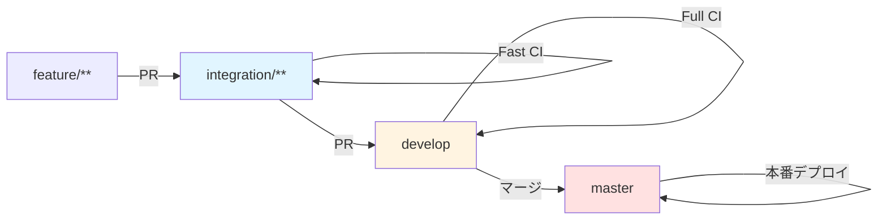

# Stock Tracker デプロイ・運用マニュアル

本ドキュメントは、Stock Tracker のデプロイと運用に関する手順を説明します。

---

## 1. 環境構成

### 1.1 環境一覧

| 環境        | 用途                     | デプロイ元ブランチ          | URL                                       |
| ----------- | ------------------------ | --------------------------- | ----------------------------------------- |
| dev (開発)  | 開発・テスト環境         | `develop`, `integration/**` | `https://dev-stock-tracker.nagiyu.com`    |
| prod (本番) | 本番環境（実運用）       | `master`                    | `https://stock-tracker.nagiyu.com`        |

### 1.2 リソース構成

**主要リソース**:

- **Lambda (Web)**: Next.js アプリケーション実行（株価チャート表示、API Routes）
- **Lambda (Batch - 3関数)**: 定期実行バッチ処理（アラート条件チェック、Web Push 通知送信）
    - `stock-tracker-batch-minute-{env}`: 1分間隔（MINUTE_LEVEL アラート処理）
    - `stock-tracker-batch-hourly-{env}`: 1時間間隔（HOURLY_LEVEL アラート処理）
    - `stock-tracker-batch-daily-{env}`: 日次（データクリーンアップ）
- **DynamoDB**: Single Table Design（取引所、ティッカー、保有株式、ウォッチリスト、アラート）
- **CloudFront**: CDN 配信
- **ECR**: Docker イメージ格納（Web 用、Batch 用の2リポジトリ）
- **EventBridge Scheduler**: バッチ処理のトリガー（3つのルール）
- **Secrets Manager**: VAPID キー（Web Push 用）、NextAuth Secret
- **CloudWatch Logs**: アプリケーションログ保存（保持期間: 30日）
- **CloudWatch Alarms**: Lambda エラー率、実行時間、スロットリング、DynamoDB スロットリング監視
- **SNS**: CloudWatch Alarms の通知先（メール通知）

**インフラ定義の場所**:

- CDK スタック: `infra/stock-tracker/lib/`

### 1.3 環境ごとのリソース名

| リソース                  | dev 環境                               | prod 環境                               |
| ------------------------- | -------------------------------------- | --------------------------------------- |
| Lambda (Web)              | `stock-tracker-web-dev`                | `stock-tracker-web-prod`                |
| Lambda (Batch - Minute)   | `stock-tracker-batch-minute-dev`       | `stock-tracker-batch-minute-prod`       |
| Lambda (Batch - Hourly)   | `stock-tracker-batch-hourly-dev`       | `stock-tracker-batch-hourly-prod`       |
| Lambda (Batch - Daily)    | `stock-tracker-batch-daily-dev`        | `stock-tracker-batch-daily-prod`        |
| DynamoDB テーブル         | `nagiyu-stock-tracker-main-dev`        | `nagiyu-stock-tracker-main-prod`        |
| ECR (Web)                 | `stock-tracker-web-dev`                | `stock-tracker-web-prod`                |
| ECR (Batch)               | `stock-tracker-batch-dev`              | `stock-tracker-batch-prod`              |
| CloudFront Distribution   | `stock-tracker-dev`                    | `stock-tracker-prod`                    |
| EventBridge Rule (Minute) | `stock-tracker-batch-minute-dev`       | `stock-tracker-batch-minute-prod`       |
| EventBridge Rule (Hourly) | `stock-tracker-batch-hourly-dev`       | `stock-tracker-batch-hourly-prod`       |
| EventBridge Rule (Daily)  | `stock-tracker-batch-daily-dev`        | `stock-tracker-batch-daily-prod`        |
| Secrets Manager (VAPID)   | `nagiyu-stock-tracker-vapid-dev`       | `nagiyu-stock-tracker-vapid-prod`       |
| Secrets Manager (Auth)    | `nagiyu-auth-nextauth-secret-dev`      | `nagiyu-auth-nextauth-secret-prod`      |
| CloudWatch Log Group (Web)| `/aws/lambda/stock-tracker-web-dev`    | `/aws/lambda/stock-tracker-web-prod`    |
| CloudWatch Log Group (Batch Minute)| `/aws/lambda/stock-tracker-batch-minute-dev` | `/aws/lambda/stock-tracker-batch-minute-prod` |
| CloudWatch Log Group (Batch Hourly)| `/aws/lambda/stock-tracker-batch-hourly-dev` | `/aws/lambda/stock-tracker-batch-hourly-prod` |
| CloudWatch Log Group (Batch Daily) | `/aws/lambda/stock-tracker-batch-daily-dev`  | `/aws/lambda/stock-tracker-batch-daily-prod`  |
| SNS Topic                 | `nagiyu-stock-tracker-alarms-dev`      | `nagiyu-stock-tracker-alarms-prod`      |

---

## 2. 前提条件

### 2.1 共有インフラ

以下がデプロイ済みであることを確認してください:

- [ ] **ACM 証明書** (CloudFront 用、us-east-1): `nagiyu-shared-acm-certificate-arn`
    - ワイルドカード証明書（`*.nagiyu.com`）
    - Export 値で CDK から参照可能
- [ ] **Auth サービス**: NextAuth Secret が Secrets Manager に登録済み
    - `nagiyu-auth-nextauth-secret-{env}`
- [ ] **共有 IAM ユーザー**: `nagiyu-github-actions`（CI/CD 用）

**注**: Route 53 は使用しません。DNS レコードは外部 DNS サービスで管理してください。

### 2.2 必要なツール

- Node.js
- AWS CLI
- Docker

### 2.3 認証情報

**GitHub Actions Secrets** (共通インフラで設定済み):

- `AWS_ACCESS_KEY_ID`: IAM ユーザー `nagiyu-github-actions` のアクセスキー
- `AWS_SECRET_ACCESS_KEY`: IAM ユーザー `nagiyu-github-actions` のシークレットキー
- `AWS_REGION`: `us-east-1`
- `DOMAIN_NAME`: ドメイン名（ACM 用）

---

## 3. 初回セットアップ

### 3.1 手順概要

1. **Secrets スタックデプロイ**: VAPID キーの Secrets Manager リソース作成（PLACEHOLDER 値）
2. **VAPID キー生成と上書き**: 実際の VAPID キーを生成して Secrets Manager に設定
3. **ECR リポジトリ作成**: コンテナイメージ格納用リポジトリの作成（Web 用、Batch 用）
4. **Docker イメージビルド**: Web Lambda と Batch Lambda のコンテナイメージを作成
5. **インフラデプロイ**: Lambda, DynamoDB, CloudFront, EventBridge, CloudWatch Alarms などのリソースをデプロイ
6. **動作確認**: ヘルスチェック・機能確認

### 3.2 Secrets スタックのデプロイ

**VAPID キー（Web Push 用）**の Secrets Manager リソースを CDK で作成します。

```bash
# 開発環境の Secrets スタックをデプロイ
npm run deploy -w @nagiyu/infra-stock-tracker -- NagiyuStockTrackerSecretsDev \
    --context env=dev

# 本番環境の Secrets スタックをデプロイ
npm run deploy -w @nagiyu/infra-stock-tracker -- NagiyuStockTrackerSecretsProd \
    --context env=prod
```

このデプロイにより、以下の Secrets Manager シークレットが `PLACEHOLDER` 値で作成されます：
- `nagiyu-stock-tracker-vapid-{env}`: VAPID キーペア（初期値: PLACEHOLDER）

### 3.3 VAPID キーの生成と上書き

初回デプロイ後、実際の VAPID キーを生成して Secrets Manager の値を上書きします。

```bash
# 1. VAPID キーペアの生成
npx web-push generate-vapid-keys

# 出力例:
# =======================================
# Public Key:
# BNcRd...（省略）...xyz
#
# Private Key:
# tBHI...（省略）...abc
# =======================================

# 2. AWS Console で Secrets Manager を開く
# https://console.aws.amazon.com/secretsmanager/

# 3. シークレット `nagiyu-stock-tracker-vapid-dev` を選択

# 4. "Retrieve secret value" → "Edit" をクリック

# 5. JSON 形式で実際の VAPID キーを入力して保存:
# {
#   "publicKey": "BNcRd...xyz",
#   "privateKey": "tBHI...abc"
# }

# 6. 本番環境でも同様に `nagiyu-stock-tracker-vapid-prod` を更新
#    ※ 本番環境と開発環境で異なる VAPID キーペアを使用してください
```

**重要**:
- CDK では `PLACEHOLDER` 値でシークレットを作成し、スタック管理下に置きます
- 実際の VAPID キーは初回デプロイ後に AWS Console で手動上書きします
- 以降の CDK デプロイでは、既存のシークレット値は保持されます（上書きされません）

### 3.4 ECR リポジトリの作成

```bash
# 開発環境の ECR スタックをデプロイ
npm run deploy -w @nagiyu/infra-stock-tracker -- NagiyuStockTrackerECRDev \
    --context env=dev

# 本番環境の ECR スタックをデプロイ
npm run deploy -w @nagiyu/infra-stock-tracker -- NagiyuStockTrackerECRProd \
    --context env=prod
```

このデプロイにより、以下の ECR リポジトリが作成されます：
- `stock-tracker-web-{env}`: Web Lambda 用イメージ格納
- `stock-tracker-batch-{env}`: Batch Lambda 用イメージ格納

### 3.5 Docker イメージのビルドとプッシュ

#### Web Lambda 用イメージ

```bash
# 1. ECR にログイン
ACCOUNT_ID=$(aws sts get-caller-identity --query Account --output text)
aws ecr get-login-password --region us-east-1 | \
    docker login --username AWS --password-stdin ${ACCOUNT_ID}.dkr.ecr.us-east-1.amazonaws.com

# 2. Web イメージのビルド
docker build -t stock-tracker-web:latest \
    -f services/stock-tracker/web/Dockerfile .

# 3. タグ付け（開発環境）
docker tag stock-tracker-web:latest \
    ${ACCOUNT_ID}.dkr.ecr.us-east-1.amazonaws.com/stock-tracker-web-dev:latest

# 4. プッシュ
docker push ${ACCOUNT_ID}.dkr.ecr.us-east-1.amazonaws.com/stock-tracker-web-dev:latest
```

#### Batch Lambda 用イメージ

```bash
# 1. Batch イメージのビルド
docker build -t stock-tracker-batch:latest \
    -f services/stock-tracker/batch/Dockerfile .

# 2. タグ付け（開発環境）
docker tag stock-tracker-batch:latest \
    ${ACCOUNT_ID}.dkr.ecr.us-east-1.amazonaws.com/stock-tracker-batch-dev:latest

# 3. プッシュ
docker push ${ACCOUNT_ID}.dkr.ecr.us-east-1.amazonaws.com/stock-tracker-batch-dev:latest
```

### 3.6 アプリケーションリソースのデプロイ

```bash
# 開発環境
npm run deploy -w @nagiyu/infra-stock-tracker -- \
    --context env=dev \
    --all \
    --require-approval never

# 本番環境
npm run deploy -w @nagiyu/infra-stock-tracker -- \
    --context env=prod \
    --all \
    --require-approval never
```

### 3.7 動作確認

```bash
# Lambda 関数の確認（Web）
aws lambda get-function \
    --function-name stock-tracker-web-dev \
    --region us-east-1

# Lambda 関数の確認（Batch - Minute）
aws lambda get-function \
    --function-name stock-tracker-batch-minute-dev \
    --region us-east-1

# ヘルスチェック
curl https://dev-stock-tracker.nagiyu.com/api/health

# 期待される出力:
# {
#   "status": "ok",
#   "timestamp": "2026-01-14T12:34:56.789Z",
#   "version": "1.0.0"
# }
```

---

## 4. CI/CD パイプライン

### 4.1 ワークフロー概要

Stock Tracker では、以下の GitHub Actions ワークフローを使用します:

#### 1. 高速検証ワークフロー (`.github/workflows/stock-tracker-verify-fast.yml`)

**目的**: integration/\*\* ブランチへのプルリクエスト時に素早いフィードバックを提供

**トリガー条件**:

```yaml
on:
  pull_request:
    branches:
      - integration/**
    paths:
      - 'services/stock-tracker/**'
      - 'libs/**'
      - 'infra/stock-tracker/**'
```

**ジョブ構成**:

1. **build-web**: Web パッケージのビルド検証
2. **build-batch**: Batch パッケージのビルド検証
3. **docker-build-web**: Web Docker イメージのビルド検証
4. **docker-build-batch**: Batch Docker イメージのビルド検証
5. **test-core**: Core パッケージの単体テスト実行
6. **e2e-test**: E2Eテストの実行（chromium-mobile のみ）
7. **lint**: リントチェック（全パッケージ）
8. **format-check**: フォーマットチェック（全パッケージ）
9. **infra-test**: CDK スタックの型チェックとテスト

#### 2. 完全検証ワークフロー (`.github/workflows/stock-tracker-verify-full.yml`)

**目的**: develop ブランチへのプルリクエスト時に完全な品質検証を実施

**トリガー条件**:

```yaml
on:
  pull_request:
    branches:
      - develop
    paths:
      - 'services/stock-tracker/**'
      - 'libs/**'
      - 'infra/stock-tracker/**'
```

**ジョブ構成**:

1. **build-web**: Web パッケージのビルド検証
2. **build-batch**: Batch パッケージのビルド検証
3. **docker-build-web**: Web Docker イメージのビルド検証
4. **docker-build-batch**: Batch Docker イメージのビルド検証
5. **test-core**: Core パッケージの単体テスト実行
6. **coverage**: テストカバレッジチェック（80%以上必須）
7. **e2e-test**: E2Eテストの実行（全デバイス: chromium-desktop, chromium-mobile, webkit-mobile）
8. **lint**: リントチェック（全パッケージ）
9. **format-check**: フォーマットチェック（全パッケージ）
10. **infra-test**: CDK スタックの型チェックとテスト

#### 3. デプロイワークフロー (`.github/workflows/stock-tracker-deploy.yml`)

**目的**: develop, integration/\*\*, master ブランチへのプッシュ時に自動デプロイ

**トリガー条件**:

```yaml
on:
  push:
    branches:
      - develop
      - integration/**
      - master
    paths:
      - 'services/stock-tracker/**'
      - 'infra/stock-tracker/**'
```

**ジョブ構成**:

1. **prepare-infrastructure**: ECR リポジトリの CDK スタックデプロイ
2. **build-web**: Web Docker イメージのビルドと ECR へのプッシュ
3. **build-batch**: Batch Docker イメージのビルドと ECR へのプッシュ
4. **deploy**: Lambda, DynamoDB, CloudFront, EventBridge, CloudWatch Alarms の CDK デプロイ
    - Secrets Manager から VAPID キーと NextAuth Secret を取得
    - CDK Context で渡す
5. **verify**: デプロイ後のヘルスチェック

### 4.2 ブランチ戦略とデプロイフロー



| ブランチ         | 環境 | PR検証     | 自動デプロイ |
| ---------------- | ---- | ---------- | ------------ |
| `develop`        | 開発 | ✅ Full CI | ✅           |
| `integration/**` | 開発 | ✅ Fast CI | ✅           |
| `master`         | 本番 | -          | ✅           |

### 4.3 GitHub Secrets の設定

GitHub リポジトリの Settings → Secrets and variables → Actions で以下を確認:

| Name                    | 説明                                   | 設定済み                   |
| ----------------------- | -------------------------------------- | -------------------------- |
| `AWS_ACCESS_KEY_ID`     | IAM ユーザーのアクセスキー ID          | ✓ (共通インフラで設定済み) |
| `AWS_SECRET_ACCESS_KEY` | IAM ユーザーのシークレットアクセスキー | ✓ (共通インフラで設定済み) |
| `AWS_REGION`            | デプロイ先リージョン（`us-east-1`）    | ✓ (共通インフラで設定済み) |
| `DOMAIN_NAME`           | ドメイン名（ACM 用）                   | ✓ (共通インフラで設定済み) |

**注**: VAPID キーと NextAuth Secret は Secrets Manager で管理されるため、GitHub Secrets への登録は不要です。

### 4.4 ワークフロー実行例

#### プルリクエスト作成時

```bash
# feature ブランチから integration/** へのプルリクエスト作成
git checkout -b feature/new-feature
git push origin feature/new-feature

# GitHub でプルリクエストを integration/feature-test ブランチに作成
# → stock-tracker-verify-fast.yml が自動実行される
#   ✓ Web/Batch ビルド検証
#   ✓ Web/Batch Docker ビルド検証
#   ✓ Core 単体テスト実行
#   ✓ E2Eテスト実行（chromium-mobile のみ）
#   ✓ リント・フォーマットチェック
#   ✓ インフラテスト
# → すべて成功でマージ可能

# integration/** ブランチから develop へのプルリクエスト作成
# → stock-tracker-verify-full.yml が自動実行される
#   ✓ Web/Batch ビルド検証
#   ✓ Web/Batch Docker ビルド検証
#   ✓ Core 単体テスト実行
#   ✓ カバレッジチェック（80%以上）
#   ✓ E2Eテスト実行（全デバイス: chromium-desktop, chromium-mobile, webkit-mobile）
#   ✓ リント・フォーマットチェック
#   ✓ インフラテスト
# → すべて成功でマージ可能
```

#### マージ後のデプロイ

```bash
# プルリクエストをマージ
# → develop ブランチに push される
# → stock-tracker-deploy.yml が自動実行される
#   1. ECR の CDK スタックデプロイ
#   2. Web Docker イメージビルド & プッシュ
#   3. Batch Docker イメージビルド & プッシュ
#   4. Secrets Manager から VAPID キーと NextAuth Secret を取得
#   5. Lambda, DynamoDB, CloudFront, EventBridge, CloudWatch Alarms の CDK デプロイ
#   6. ヘルスチェック
# → 開発環境へデプロイ完了
```

---

## 5. 手動デプロイ

### 5.1 Docker イメージの手動デプロイ

#### Web Lambda 用イメージ

```bash
# 1. ECR ログイン
ACCOUNT_ID=$(aws sts get-caller-identity --query Account --output text)
aws ecr get-login-password --region us-east-1 | \
    docker login --username AWS --password-stdin ${ACCOUNT_ID}.dkr.ecr.us-east-1.amazonaws.com

# 2. イメージのビルド
docker build -t stock-tracker-web:latest \
    -f services/stock-tracker/web/Dockerfile .

# 3. タグ付け & プッシュ（開発環境）
docker tag stock-tracker-web:latest \
    ${ACCOUNT_ID}.dkr.ecr.us-east-1.amazonaws.com/stock-tracker-web-dev:latest
docker push ${ACCOUNT_ID}.dkr.ecr.us-east-1.amazonaws.com/stock-tracker-web-dev:latest
```

#### Batch Lambda 用イメージ

```bash
# 1. イメージのビルド
docker build -t stock-tracker-batch:latest \
    -f services/stock-tracker/batch/Dockerfile .

# 2. タグ付け & プッシュ（開発環境）
docker tag stock-tracker-batch:latest \
    ${ACCOUNT_ID}.dkr.ecr.us-east-1.amazonaws.com/stock-tracker-batch-dev:latest
docker push ${ACCOUNT_ID}.dkr.ecr.us-east-1.amazonaws.com/stock-tracker-batch-dev:latest
```

### 5.2 Lambda 関数の手動更新

#### Web Lambda

```bash
ACCOUNT_ID=$(aws sts get-caller-identity --query Account --output text)
ECR_REGISTRY="${ACCOUNT_ID}.dkr.ecr.us-east-1.amazonaws.com"

aws lambda update-function-code \
    --function-name stock-tracker-web-dev \
    --image-uri ${ECR_REGISTRY}/stock-tracker-web-dev:latest \
    --region us-east-1

# Lambda 更新完了を待機
aws lambda wait function-updated \
    --function-name stock-tracker-web-dev \
    --region us-east-1
```

#### Batch Lambda（3関数）

```bash
ACCOUNT_ID=$(aws sts get-caller-identity --query Account --output text)
ECR_REGISTRY="${ACCOUNT_ID}.dkr.ecr.us-east-1.amazonaws.com"

# Minute バッチ
aws lambda update-function-code \
    --function-name stock-tracker-batch-minute-dev \
    --image-uri ${ECR_REGISTRY}/stock-tracker-batch-dev:latest \
    --region us-east-1

# Hourly バッチ
aws lambda update-function-code \
    --function-name stock-tracker-batch-hourly-dev \
    --image-uri ${ECR_REGISTRY}/stock-tracker-batch-dev:latest \
    --region us-east-1

# Daily バッチ
aws lambda update-function-code \
    --function-name stock-tracker-batch-daily-dev \
    --image-uri ${ECR_REGISTRY}/stock-tracker-batch-dev:latest \
    --region us-east-1
```

---

## 6. 環境変数管理

### 6.1 環境変数一覧

#### Web Lambda

| 環境変数                  | 説明                                   | 例                                      | 必須 |
| ------------------------- | -------------------------------------- | --------------------------------------- | ---- |
| `NODE_ENV`                | Node.js 実行環境                       | `production`                            | ✅   |
| `DYNAMODB_TABLE_NAME`     | DynamoDB テーブル名                    | `nagiyu-stock-tracker-main-dev`         | ✅   |
| `AUTH_SECRET`             | NextAuth.js シークレット               | `<Secrets Manager から取得>`            | ✅   |
| `AUTH_URL`                | Auth サービス URL                      | `https://auth.nagiyu.com`               | ✅   |
| `NEXT_PUBLIC_AUTH_URL`    | クライアント側 Auth URL                | `https://auth.nagiyu.com`               | ✅   |
| `APP_URL`                 | Stock Tracker URL                      | `https://stock-tracker.nagiyu.com`      | ✅   |
| `VAPID_PUBLIC_KEY`        | VAPID 公開鍵（Web Push 用）            | `<Secrets Manager から取得>`            | ✅   |
| `VAPID_PRIVATE_KEY`       | VAPID 秘密鍵（Web Push 用）            | `<Secrets Manager から取得>`            | ✅   |
| `SKIP_AUTH_CHECK`         | 認証スキップ（テスト用）               | `false`                                 | ❌   |

#### Batch Lambda（3関数共通）

| 環境変数              | 説明                       | 例                              | 必須 |
| --------------------- | -------------------------- | ------------------------------- | ---- |
| `NODE_ENV`            | Node.js 実行環境           | `production`                    | ✅   |
| `DYNAMODB_TABLE_NAME` | DynamoDB テーブル名        | `nagiyu-stock-tracker-main-dev` | ✅   |
| `BATCH_TYPE`          | バッチタイプ識別子         | `MINUTE` / `HOURLY` / `DAILY`   | ✅   |
| `VAPID_PUBLIC_KEY`    | VAPID 公開鍵（Web Push 用）| `<Secrets Manager から取得>`    | ✅   |
| `VAPID_PRIVATE_KEY`   | VAPID 秘密鍵（Web Push 用）| `<Secrets Manager から取得>`    | ✅   |

### 6.2 環境変数の設定方法

**CDK での設定**:

環境変数は CDK スタックで自動的に設定されます:

```typescript
// lib/stock-tracker-stack.ts
environment: {
  NODE_ENV: environment,
  DYNAMODB_TABLE_NAME: dynamoTable.tableName,
  AUTH_SECRET: nextAuthSecret,
  AUTH_URL: authUrl,
  NEXT_PUBLIC_AUTH_URL: authUrl,
  APP_URL: appUrl,
  VAPID_PUBLIC_KEY: vapidSecret.secretValueFromJson('publicKey').unsafeUnwrap(),
  VAPID_PRIVATE_KEY: vapidSecret.secretValueFromJson('privateKey').unsafeUnwrap(),
}
```

**手動設定（緊急時）**:

```bash
aws lambda update-function-configuration \
    --function-name stock-tracker-web-dev \
    --environment Variables="{NODE_ENV=production,DYNAMODB_TABLE_NAME=nagiyu-stock-tracker-main-dev}" \
    --region us-east-1
```

---

## 7. ログ管理・監視

### 7.1 ログの確認

**Lambda ログ**:

- **Web Lambda**: `/aws/lambda/stock-tracker-web-{env}`
- **Batch Lambda (Minute)**: `/aws/lambda/stock-tracker-batch-minute-{env}`
- **Batch Lambda (Hourly)**: `/aws/lambda/stock-tracker-batch-hourly-{env}`
- **Batch Lambda (Daily)**: `/aws/lambda/stock-tracker-batch-daily-{env}`
- **保持期間**: 30日

**ログの確認方法**:

```bash
# ログのリアルタイム確認（Web Lambda）
aws logs tail /aws/lambda/stock-tracker-web-dev --follow

# ログのリアルタイム確認（Batch Lambda - Minute）
aws logs tail /aws/lambda/stock-tracker-batch-minute-dev --follow

# 特定期間のログ検索
aws logs filter-log-events \
    --log-group-name /aws/lambda/stock-tracker-web-dev \
    --start-time $(date -d '1 hour ago' +%s)000 \
    --filter-pattern "ERROR"

# 複数のロググループから同時検索
aws logs tail \
    /aws/lambda/stock-tracker-batch-minute-dev \
    /aws/lambda/stock-tracker-batch-hourly-dev \
    /aws/lambda/stock-tracker-batch-daily-dev \
    --follow
```

### 7.2 メトリクスとアラート

**Lambda メトリクス**:

- **実行時間 (Duration)**: Lambda の実行時間（ms）
- **エラー率 (Errors)**: 実行失敗の割合
- **同時実行数 (ConcurrentExecutions)**: 同時に実行されている Lambda 関数の数
- **スロットリング (Throttles)**: 同時実行数上限による実行拒否の回数

**スロットリングとは**:
- AWS Lambda にはアカウントごとに同時実行数の上限があります（デフォルト: 1,000）
- 同時実行数が上限に達すると、新しいリクエストは拒否されます（HTTP 429 エラー）
- Web Lambda: ユーザーリクエストが集中すると画面が開けない
- Batch Lambda: アラート通知が処理されない

**DynamoDB メトリクス**:

- **読み書きキャパシティ**: オンデマンドモードで自動スケール
- **スロットリング (ReadThrottleEvents, WriteThrottleEvents)**: 急激なトラフィック増加で発生する可能性
- **ユーザーエラー率 (UserErrors)**: バリデーションエラーなど

**CloudWatch Alarms の設定**:

CDK で自動的に以下のアラームが設定されます:

| アラーム項目                         | 閾値                | 評価期間 | アクション                           |
| ------------------------------------ | ------------------- | -------- | ------------------------------------ |
| Lambda (Web) エラー率                | 5%以上              | 5分      | SNS トピックにメール通知             |
| Lambda (Web) 実行時間                | 平均 20秒以上       | 5分      | SNS トピックにメール通知             |
| Lambda (Web) スロットリング          | 1件以上             | 5分      | SNS トピックにメール通知             |
| Lambda (Batch - Minute) エラー率     | 10%以上             | 5分      | SNS トピックにメール通知             |
| Lambda (Batch - Minute) 実行時間     | 平均 40秒以上       | 5分      | SNS トピックにメール通知             |
| Lambda (Batch - Minute) スロットリング | 1件以上          | 5分      | SNS トピックにメール通知             |
| Lambda (Batch - Hourly) エラー率     | 10%以上             | 5分      | SNS トピックにメール通知             |
| Lambda (Batch - Hourly) 実行時間     | 平均 4分以上        | 5分      | SNS トピックにメール通知             |
| Lambda (Batch - Hourly) スロットリング | 1件以上          | 5分      | SNS トピックにメール通知             |
| Lambda (Batch - Daily) エラー率      | 10%以上             | 5分      | SNS トピックにメール通知             |
| Lambda (Batch - Daily) 実行時間      | 平均 8分以上        | 5分      | SNS トピックにメール通知             |
| Lambda (Batch - Daily) スロットリング | 1件以上           | 5分      | SNS トピックにメール通知             |
| DynamoDB ReadThrottleEvents          | 1件以上             | 5分      | SNS トピックにメール通知             |
| DynamoDB WriteThrottleEvents         | 1件以上             | 5分      | SNS トピックにメール通知             |

**SNS トピック**:
- トピック名: `nagiyu-stock-tracker-alarms-{env}`
- 通知先: メール（初回デプロイ後に SNS サブスクリプションを確認してください）

**SNS サブスクリプションの確認**:

```bash
# SNS トピックのサブスクリプション一覧を確認
aws sns list-subscriptions-by-topic \
    --topic-arn arn:aws:sns:us-east-1:<ACCOUNT_ID>:nagiyu-stock-tracker-alarms-dev \
    --region us-east-1

# メールアドレスが登録されていない場合は追加
aws sns subscribe \
    --topic-arn arn:aws:sns:us-east-1:<ACCOUNT_ID>:nagiyu-stock-tracker-alarms-dev \
    --protocol email \
    --notification-endpoint your-email@example.com \
    --region us-east-1

# 確認メールが届くので、リンクをクリックして承認
```

### 7.3 X-Ray トレーシング

**X-Ray の有効化**:

Stock Tracker では、すべての Lambda 関数で AWS X-Ray トレーシングが有効化されています。

**トレーシング対象**:

```
[ユーザー] → [CloudFront] → [Lambda Web] → [DynamoDB]
                                           → [TradingView API]

[EventBridge] → [Lambda Batch] → [DynamoDB]
                                → [TradingView API]
                                → [Web Push API]
```

**X-Ray コンソールでの確認**:

```bash
# X-Ray サービスマップを確認
# AWS Console → X-Ray → Service Map

# トレースの確認
# AWS Console → X-Ray → Traces
```

**X-Ray で確認できる情報**:
- 各処理の実行時間（ボトルネック特定）
- エラー発生箇所の特定
- 外部API呼び出しの遅延
- Lambda コールドスタート時間
- DynamoDB クエリのパフォーマンス

**コスト**:
- 記録されたトレース: 最初の100万件/月 無料、以降 $5.00/百万件
- 取得されたトレース: 最初の100万件/月 無料、以降 $0.50/百万件
- Phase 1 の想定トラフィック（約34万トレース/月）では無料枠内に収まります

---

## 8. 運用手順

### 8.1 バージョン管理

#### 8.1.1 バージョン番号のルール

本プロジェクトは [Semantic Versioning](https://semver.org/) に準拠します:

- **メジャー (X.0.0)**: 破壊的変更
- **マイナー (0.X.0)**: 新機能追加（後方互換性あり）
- **パッチ (0.0.X)**: バグ修正

#### 8.1.2 バージョン管理の Single Source of Truth

**`services/stock-tracker/web/package.json` の `version` フィールドがすべてのバージョン情報の唯一の真実の情報源です。**

#### 8.1.3 バージョン更新手順

```bash
# パッチバージョンアップ（例: 1.0.0 → 1.0.1）
npm version patch -w stock-tracker-web

# マイナーバージョンアップ（例: 1.0.0 → 1.1.0）
npm version minor -w stock-tracker-web

# メジャーバージョンアップ（例: 1.0.0 → 2.0.0）
npm version major -w stock-tracker-web
```

**注**: `npm version` コマンドは自動的に Git タグとコミットを作成します。

### 8.2 スケーリング対応

Lambda は自動スケーリングされます。必要に応じて以下を調整:

**Web Lambda**:
- メモリサイズ: 1024 MB
- タイムアウト: 30秒
- 予約済み同時実行数: 未設定（必要に応じて設定）

**Batch Lambda**:
- **Minute**: メモリ 512 MB、タイムアウト 50秒
- **Hourly**: メモリ 512 MB、タイムアウト 5分
- **Daily**: メモリ 512 MB、タイムアウト 10分

**DynamoDB**:
- オンデマンドモードで自動スケール
- 急激なトラフィック増加にも対応（数秒〜数分で適応）

**同時実行数上限の緩和**:

AWS Lambda の同時実行数上限（デフォルト: 1,000）を超える場合は、AWS サポートに緩和リクエストを申請してください（無料）。

### 8.3 セキュリティアップデート

依存パッケージの定期的な更新を実施してください。

```bash
# セキュリティ脆弱性のチェック
npm audit

# 脆弱性の自動修正
npm audit fix

# 破壊的変更を含む修正
npm audit fix --force
```

---

## 9. 障害対応

### 9.1 ロールバック手順

#### GitHub Actions からのロールバック

1. 前のコミットに戻す
2. 再度プッシュして自動デプロイを実行

```bash
git revert HEAD
git push origin <branch-name>
```

#### 手動ロールバック（Lambda 関数コード）

```bash
# 前のイメージタグを確認
aws ecr describe-images \
    --repository-name stock-tracker-web-dev \
    --region us-east-1 \
    --query 'sort_by(imageDetails,& imagePushedAt)[-5:].[imageTags[0],imagePushedAt]' \
    --output table

# 前のイメージタグを指定してロールバック（Web Lambda）
ACCOUNT_ID=$(aws sts get-caller-identity --query Account --output text)
aws lambda update-function-code \
    --function-name stock-tracker-web-dev \
    --image-uri ${ACCOUNT_ID}.dkr.ecr.us-east-1.amazonaws.com/stock-tracker-web-dev:<PREVIOUS_TAG> \
    --region us-east-1

# 前のイメージタグを指定してロールバック（Batch Lambda - Minute）
aws lambda update-function-code \
    --function-name stock-tracker-batch-minute-dev \
    --image-uri ${ACCOUNT_ID}.dkr.ecr.us-east-1.amazonaws.com/stock-tracker-batch-dev:<PREVIOUS_TAG> \
    --region us-east-1

# 同様に Hourly, Daily もロールバック
```

#### CloudFormation スタック全体のロールバック

AWS コンソールから CloudFormation スタックを手動でロールバック:

1. AWS Console → CloudFormation
2. スタック `NagiyuStockTrackerDev` または `NagiyuStockTrackerProd` を選択
3. "Stack actions" → "Roll back"
4. 前のスタックバージョンを選択してロールバック

### 9.2 よくある障害と対処法

#### デプロイが失敗する

**症状**: GitHub Actions のワークフローが失敗する

**原因と対処**:

- **ECR ログインエラー** → IAM ロール `nagiyu-github-actions` の権限を確認
- **Lambda 更新エラー** → Lambda 関数が存在するか確認
- **ヘルスチェック失敗** → `/api/health` エンドポイントの実装を確認
- **Secrets Manager アクセスエラー** → VAPID キーまたは NextAuth Secret が登録されているか確認

#### Lambda が起動しない

**症状**: Function URL にアクセスできない

**原因と対処**:

- **Docker イメージのビルドエラー** → ローカルでイメージをビルドしてテスト
- **環境変数の設定ミス** → Lambda の環境変数を確認（`AUTH_SECRET`, `VAPID_PUBLIC_KEY` など）
- **メモリ不足** → Lambda のメモリサイズを増やす（CloudWatch Logs で "out of memory" を確認）

#### Batch Lambda がアラートを処理しない

**症状**: アラート条件を満たしているのに通知が来ない

**原因と対処**:

- **EventBridge Scheduler が無効** → EventBridge ルールが有効か確認
- **DynamoDB データ不整合** → Alert エンティティの `Enabled` フラグを確認
- **Web Push サブスクリプションの問題** → サブスクリプション情報が正しいか確認
- **取引時間外** → 取引所の取引時間設定を確認

#### DynamoDB スロットリングが発生

**症状**: CloudWatch Alarms で DynamoDB スロットリングアラートが発生

**原因と対処**:

- **急激なトラフィック増加** → オンデマンドモードは数秒〜数分で自動適応します。一時的な現象であれば問題ありません
- **継続的なスロットリング** → アプリケーションコードで無駄なクエリがないか確認、GSI の活用を検討

#### PR検証ワークフローが失敗する

**症状**: プルリクエストのチェックが失敗する

**デバッグ方法**:

```bash
# ローカルで PR検証と同じステップを実行

# 1. Core パッケージのビルド検証
npm run build -w stock-tracker-core

# 2. Web パッケージのビルド検証
npm run build -w stock-tracker-web

# 3. Batch パッケージのビルド検証
npm run build -w stock-tracker-batch

# 4. Web Docker ビルド検証
docker build -t stock-tracker-web-pr-test -f services/stock-tracker/web/Dockerfile .

# 5. Batch Docker ビルド検証
docker build -t stock-tracker-batch-pr-test -f services/stock-tracker/batch/Dockerfile .

# 6. Core 単体テスト実行
npm run test -w stock-tracker-core

# 7. Core カバレッジチェック（Full CI のみ）
npm run test:coverage -w stock-tracker-core

# 8. E2Eテスト実行
npm run test:e2e -w stock-tracker-web
```

### 9.3 エスカレーションフロー

**レベル1 - 軽微な障害**:
- 影響範囲: 一部機能の一時的な不具合
- 対応: 開発チームで対処

**レベル2 - 中程度の障害**:
- 影響範囲: 主要機能の停止、多数のユーザーに影響
- 対応: プラットフォームチーム全体で対処、必要に応じてロールバック

**レベル3 - 重大な障害**:
- 影響範囲: サービス全体の停止
- 対応: 即座にロールバック、AWS サポートへのエスカレーション検討

---

## 10. 削除手順

### 10.1 リソースの削除

**注意**: DynamoDB テーブルを削除するとデータも失われます。バックアップを取得してから削除してください。

```bash
# CDK スタックの削除（開発環境）
npm run cdk -w @nagiyu/infra-stock-tracker -- destroy \
    --context env=dev \
    --all

# CDK スタックの削除（本番環境）
npm run cdk -w @nagiyu/infra-stock-tracker -- destroy \
    --context env=prod \
    --all
```

**削除される主要リソース**:
- Lambda 関数（Web, Batch - 3関数）
- DynamoDB テーブル
- CloudFront Distribution
- EventBridge Scheduler ルール（3つ）
- CloudWatch Logs ロググループ（4つ）
- CloudWatch Alarms（13個）
- SNS トピック
- IAM ロール（4つ）

**削除されないリソース**:
- ECR リポジトリ（手動削除が必要）
- Secrets Manager シークレット（手動削除が必要）

**ECR リポジトリの削除**:

```bash
# Web リポジトリの削除
aws ecr delete-repository \
    --repository-name stock-tracker-web-dev \
    --force \
    --region us-east-1

# Batch リポジトリの削除
aws ecr delete-repository \
    --repository-name stock-tracker-batch-dev \
    --force \
    --region us-east-1
```

**Secrets Manager シークレットの削除**:

```bash
# VAPID キーの削除
aws secretsmanager delete-secret \
    --secret-id nagiyu-stock-tracker-vapid-dev \
    --force-delete-without-recovery \
    --region us-east-1
```

---

## 参考資料

- [GitHub Actions - OIDC を使用した AWS との連携](https://docs.github.com/ja/actions/deployment/security-hardening-your-deployments/configuring-openid-connect-in-amazon-web-services)
- [AWS Lambda - コンテナイメージを使用した関数の更新](https://docs.aws.amazon.com/lambda/latest/dg/gettingstarted-images.html)
- [AWS X-Ray - Lambda での X-Ray の使用](https://docs.aws.amazon.com/lambda/latest/dg/services-xray.html)
- [AWS EventBridge Scheduler - スケジュール式](https://docs.aws.amazon.com/scheduler/latest/UserGuide/schedule-types.html)
- [DynamoDB - オンデマンドキャパシティモード](https://docs.aws.amazon.com/amazondynamodb/latest/developerguide/HowItWorks.ReadWriteCapacityMode.html#HowItWorks.OnDemand)
- [プラットフォームブランチ戦略](../../docs/branching.md)
- [プラットフォーム開発ガイドライン](../../docs/development/rules.md)
- [共有インフラドキュメント](../../docs/infra/README.md)
- [Stock Tracker 要件定義書](./requirements.md)
- [Stock Tracker アーキテクチャ設計書](./architecture.md)
- [Stock Tracker API 仕様書](./api-spec.md)
- [Stock Tracker テスト仕様書](./testing.md)
