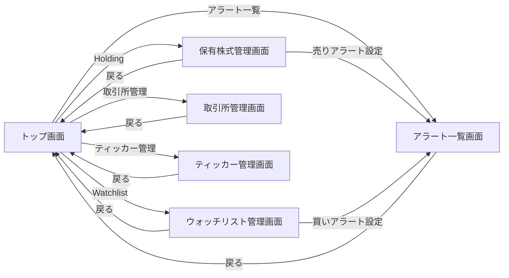

# Stock Tracker 要件定義書

**ステータス**: Draft（構想段階）
**作成日**: 2026-01-13
**最終更新**: 2026-01-13

---

## 1. ビジネス要件

### 1.1 背景・目的

**背景**:
- 株式投資において、タイムリーな価格情報と適切なタイミングでの売買判断が重要
- 既存の finance リポジトリで提供していた株価追跡・通知機能を、本プラットフォームで刷新
- モノレポ構成による開発効率向上、共通インフラ活用によるコスト削減を目指す

**目的**:
- リアルタイムな株価データの可視化（チャート表示）
- 条件ベースのアラート・通知による売買タイミングの最適化
- 保有株式の管理と目標価格の算出による投資判断支援

### 1.2 対象ユーザー

**プライマリーユーザー**:
- 個人投資家（株式トレーダー）
- 日々の株価変動をチェックし、売買判断を行うユーザー

**ユーザー特性**:
- 複数の銘柄を監視している
- 価格条件に基づいた通知を受け取りたい
- 保有株式の平均取得価格と目標価格を把握したい
- モバイル/デスクトップの両方から利用する

### 1.3 ビジネスゴール

**Phase 1（MVP）の目標**:
1. **株価の可視化**: リアルタイムな株価データをチャートで表示
2. **通知機能**: 価格条件に基づくアラート通知
3. **保有株式管理**: 平均取得価格、目標価格の算出

**Phase 2 以降の目標**:
- テクニカル指標の追加（移動平均、ボリンジャーバンドなど）
- 高度なパターン認識（赤三兵、三川明けの明星など）
- ポートフォリオ分析機能

---

## 2. 機能要件

### 2.1 ユースケース

#### UC-001: 株価チャート表示

**概要**: ユーザーが指定した取引所・ティッカーの株価チャートを表示する

**アクター**: ログインユーザー

**前提条件**:
- ユーザーがログイン済み
- 取引所・ティッカーが登録されている

**正常フロー**:
1. ユーザーがトップ画面にアクセス
2. 取引所を選択（例: NYSE）
3. ティッカーを選択（例: AAPL）
4. 時間枠を選択（例: 5分足、1時間足、日足）
5. システムが TradingView API から株価データを取得
6. ECharts でインタラクティブなチャートを表示

**代替フロー**:
- データ取得に失敗した場合、エラーメッセージを表示
- 選択されたティッカーが存在しない場合、エラーメッセージを表示

**例外フロー**:
- TradingView API がタイムアウトした場合、再試行を促す

#### UC-002: アラート設定

**概要**: ユーザーが株価の条件を設定し、条件達成時に通知を受け取る

**アクター**: ログインユーザー

**前提条件**:
- ユーザーがログイン済み
- 取引所・ティッカーが登録されている
- ブラウザで通知許可が有効

**正常フロー**:
1. ユーザーがアラート設定画面にアクセス
2. 取引所とティッカーを選択
3. 条件タイプを選択（例: 価格が指定値を上回る）
4. 目標価格を入力（例: 150 USD）
5. 通知頻度を選択（例: 1時間ごと）
6. 保存ボタンをクリック
7. システムがアラート設定を DynamoDB に保存

**代替フロー**:
- 無効な価格（負の数、文字列など）が入力された場合、バリデーションエラーを表示

**例外フロー**:
- 通知許可がブロックされている場合、許可を促すメッセージを表示

#### UC-003: 保有株式管理

**概要**: ユーザーが保有株式を登録し、平均取得価格と目標価格を確認する

**アクター**: ログインユーザー

**前提条件**:
- ユーザーがログイン済み

**正常フロー**:
1. ユーザーが MyTicker 画面にアクセス
2. 新規登録ボタンをクリック
3. 取引所、ティッカー、保有数、平均取得価格を入力
4. 保存ボタンをクリック
5. システムが保有株式情報を DynamoDB に保存
6. 目標価格（買い・売り）を自動算出して表示

**代替フロー**:
- 無効な数値が入力された場合、バリデーションエラーを表示

### 2.2 機能一覧

| 機能ID | 機能名                     | 説明                                           | 優先度 |
| ------ | -------------------------- | ---------------------------------------------- | ------ |
| F-001  | 株価データ取得             | TradingView API から株価データを取得           | 高     |
| F-002  | チャート表示               | ECharts で株価チャートを表示                   | 高     |
| F-003  | 取引所管理                 | 取引所の CRUD 操作                             | 高     |
| F-004  | ティッカー管理             | ティッカーの CRUD 操作                         | 高     |
| F-005  | アラート・通知機能         | 価格条件に基づく通知（Web Push）。取引所の取引時間外は通知を抑制 | 高     |
| F-006  | 目標価格算出               | Alert 機能で保有株式の平均取得価格を参照して目標価格を自動提案 | 低     |
| F-007  | 保有株式管理（Holding）    | 保有株式の CRUD 操作。Holding から直接売りアラート設定可能 | 高     |
| F-008  | ウォッチリスト管理         | 買い候補銘柄の CRUD 操作。Watchlist から直接買いアラート設定可能 | 高     |
| F-009  | ユーザー認証               | Auth サービス連携によるログイン・ログアウト    | 高     |
| F-010  | 権限管理                   | プラットフォーム統合のロールによるアクセス制御（stock-viewer/stock-user/stock-admin） | 高     |

---

## 3. 非機能要件

### 3.1 パフォーマンス要件

| 項目                   | 要件                                    |
| ---------------------- | --------------------------------------- |
| チャート表示           | 初回ロード 2秒以内                      |
| 株価データ取得         | 1秒以内（TradingView API のレスポンス）|
| 通知遅延               | 条件達成から 1分以内                    |
| 同時接続数             | 想定 100ユーザー（Phase 1）            |

### 3.2 セキュリティ要件

**認証・認可**:
- **認証**: Auth サービス（本プラットフォーム共通）による認証
    - JWT トークンベースのセッション管理
    - プラットフォームレベルでユーザーの ID を特定
- **認可**: プラットフォーム統合のロールベースアクセス制御（RBAC）
    - Auth サービスの `User.roles` で一元管理
    - `@nagiyu/common` ライブラリの `hasPermission` 関数を使用
    - Permission形式: `{resource}:{action}` (例: `stocks:read`, `stocks:write`)

**Stock Tracker 用のロール定義**:

`@nagiyu/common` の `ROLES` に以下を追加:

| ロール名       | 権限（Permissions）                                      | 想定ユーザー                |
| -------------- | ------------------------------------------------------- | --------------------------- |
| `stock-viewer` | `stocks:read`                                            | ゲストユーザー（デフォルト） |
| `stock-user`   | `stocks:read`, `stocks:write-own`                        | 一般ユーザー                 |
| `stock-admin`  | `stocks:read`, `stocks:write-own`, `stocks:manage-data` | Stock Tracker 管理者         |

**Permission 定義**:

| Permission           | 説明                                                   |
| -------------------- | ------------------------------------------------------ |
| `stocks:read`        | チャート閲覧、取引所一覧取得、ティッカー一覧取得       |
| `stocks:write-own`   | 自分のアラート設定・Holding 管理                        |
| `stocks:manage-data` | 取引所・ティッカーの CRUD（マスタデータ管理）          |

**ロール判定フロー**:
1. Auth サービスで認証（JWT トークン検証）
2. JWT から `UserID` と `roles` を取得
3. `hasPermission(user.roles, 'stocks:read')` で権限チェック
4. ロールが未割り当ての場合、デフォルトで閲覧のみ可能（`stocks:read` のみ許可）

**権限マトリクス**:

| 機能                   | stock-viewer | stock-user | stock-admin | admin (platform) |
| ---------------------- | ------------ | ---------- | ----------- | ---------------- |
| チャート閲覧           | ✅            | ✅          | ✅           | ✅                |
| 取引所一覧取得         | ✅            | ✅          | ✅           | ✅                |
| ティッカー一覧取得     | ✅            | ✅          | ✅           | ✅                |
| Holding 管理（CRUD）   | ❌            | ✅          | ✅           | ✅                |
| Watchlist 管理（CRUD） | ❌            | ✅          | ✅           | ✅                |
| アラート設定（CRUD）   | ❌            | ✅          | ✅           | ✅                |
| 取引所 CRUD            | ❌            | ❌          | ✅           | ✅                |
| ティッカー CRUD        | ❌            | ❌          | ✅           | ✅                |

**備考**:
- プラットフォームの `admin` ロールは、全サービスの全権限を持つため、Stock Tracker の全機能にもアクセス可能
- ユーザーのロール割り当ては、Auth サービスの API (`POST /api/users/{userId}/roles`) で実施
- ロール変更には `roles:assign` 権限が必要（`admin` ロールのみ）

**データ保護**:
- HTTPS 通信の強制（すべての API）
- DynamoDB のデータは保存時暗号化（デフォルト有効）
- Web Push 通知のサブスクリプション情報は暗号化して保存

**セキュリティ対策**:
- XSS 対策: React の自動エスケープ、CSP ヘッダー
- CSRF 対策: SameSite Cookie、CSRF トークン
- SQL Injection 対策: DynamoDB 使用（SQL なし）
- 入力バリデーション: クライアント・サーバー両方で実施

### 3.3 可用性要件

| 項目               | 要件                           |
| ------------------ | ------------------------------ |
| 稼働率             | 99.5%（ベストエフォート）      |
| RTO (復旧目標時間) | 4時間以内                      |
| RPO (復旧目標時点) | 1時間以内（DynamoDB PITR有効） |

**バックアップ戦略**:
- DynamoDB Point-in-Time Recovery (PITR) 有効化
- 保持期間: 35日間

### 3.4 保守性・拡張性要件

**コード品質**:
- TypeScript strict mode 有効
- ESLint による静的解析
- テストカバレッジ 80%以上（ビジネスロジック）

**モジュール化**:
- core パッケージ: ビジネスロジック（フレームワーク非依存）
- web パッケージ: Next.js UI
- batch パッケージ: Lambda 関数（通知バッチ）

**拡張ポイント**:
- 新しい条件タイプの追加（パターン認識など）
- 新しいチャートライブラリへの切り替え
- 複数の株価データソースへの対応

### 3.5 その他の非機能要件

**スケーラビリティ**:
- Lambda 自動スケール（Web）
- DynamoDB オンデマンドキャパシティ
- EventBridge Scheduler による定期実行（バッチ）

**インフラ**:
- **Web**: Lambda (Web Adapter) + CloudFront
- **Batch**: Lambda + EventBridge Scheduler
    - 処理時間が長い場合は AWS Batch への移行を検討
- **データストア**: DynamoDB
- **認証**: Auth サービス（本プラットフォーム共通）

**モニタリング**:
- CloudWatch Logs による統一ログ管理
- CloudWatch Alarms によるエラー監視
- X-Ray による分散トレーシング（任意）

**コスト**:
- Lambda 実行時のみ課金
- DynamoDB オンデマンドキャパシティ
- 想定月間コスト: Phase 1 では $10-20 程度

---

## 4. UI/UX 要件

### 4.1 画面一覧

| 画面名                     | パス          | 説明                                       | 優先度 |
| -------------------------- | ------------- | ------------------------------------------ | ------ |
| トップ画面（チャート表示） | `/`           | 株価チャート表示・取引所/ティッカー選択     | 高     |
| 保有株式管理画面           | `/holdings`   | 保有株式の CRUD 操作・売りアラート設定      | 高     |
| ウォッチリスト管理画面     | `/watchlist`  | 買い候補銘柄の CRUD 操作・買いアラート設定  | 高     |
| アラート一覧画面           | `/alerts`     | 全アラートの一覧表示・編集・削除           | 中     |
| 取引所管理画面             | `/exchanges`  | 取引所の CRUD 操作（stock-admin のみ）     | 中     |
| ティッカー管理画面         | `/tickers`    | ティッカーの CRUD 操作（stock-admin のみ） | 中     |

### 4.2 画面遷移図



**備考**:
- ユーザーロール管理は Auth サービスの管理画面で実施するため、Stock Tracker サービス内には画面を設けない
- 保有株式管理画面とウォッチリスト管理画面から直接アラート設定が可能（UX 向上）

### 4.3 ワイヤーフレーム

主要画面のワイヤーフレームを以下のパスで提供します。各ワイヤーフレームは draw.io 形式で作成されており、調整後に SVG 形式に変換して最終版として参照します。

| 画面名                     | ワイヤーフレームパス（drawio）                      | 最終版（SVG）                                   |
| -------------------------- | -------------------------------------------------- | ----------------------------------------------- |
| トップ画面（チャート表示） | `wireframes/top-screen.drawio`                     | `wireframes/top-screen.drawio.svg`              |
| 保有株式管理画面           | `wireframes/holding-screen.drawio`                 | `wireframes/holding-screen.drawio.svg`          |
| ウォッチリスト管理画面     | `wireframes/watchlist-screen.drawio`               | `wireframes/watchlist-screen.drawio.svg`        |
| アラート一覧画面           | `wireframes/alert-screen.drawio`                   | `wireframes/alert-screen.drawio.svg`            |
| 取引所管理画面             | `wireframes/exchange-screen.drawio`                | `wireframes/exchange-screen.drawio.svg`         |
| ティッカー管理画面         | `wireframes/ticker-screen.drawio`                  | `wireframes/ticker-screen.drawio.svg`           |

**注記**:
- ワイヤーフレームは共通部品（ヘッダー、フッター）を含まず、画面固有の要素のみを記載
- 最終的な UI 実装時は Material-UI v7 のコンポーネントを使用し、プラットフォームのデザインガイドラインに準拠

### 4.4 主要画面の UI 要件

#### トップ画面（チャート表示）

**概要**: 株価チャートを表示し、取引所・ティッカー・時間枠を選択できる画面

**主要UI要素**:
- Header: 共通ヘッダー（`@nagiyu/ui`）
- 取引所セレクトボックス: ドロップダウンで選択
- ティッカーセレクトボックス: ドロップダウンで選択
- 時間枠セレクトボックス: ドロップダウンで選択（1分、5分、15分、1時間、日足など）
- チャート表示エリア: ECharts によるインタラクティブなチャート
- Footer: 共通フッター（`@nagiyu/ui`）

**インタラクション**:
- 取引所変更時: ティッカー一覧を再取得して更新
- ティッカー変更時: チャートデータを再取得して更新
- 時間枠変更時: チャートデータを再取得して更新
- チャートのズーム・パン操作: ECharts の標準機能

**表示条件**: ログインユーザーのみアクセス可能

#### ウォッチリスト管理画面

**概要**: 買い候補銘柄を管理し、買いアラートを設定する画面

**主要UI要素**:
- 新規登録ボタン
- ウォッチリスト一覧テーブル
    - 取引所・ティッカー
    - ティッカー名
    - 買いアラート設定ボタン（状態により表示切り替え）
    - 削除ボタン
- ウォッチリスト登録フォーム（モーダル）
    - 取引所（ドロップダウン）
    - ティッカー（ドロップダウン）

**買いアラート設定ボタンの状態**:
- **未設定状態**:
    - 表示: `🔔 買いアラート`
    - 色: オレンジ (#FF9800)
    - クリック時: 現在画面でアラート設定モーダルを表示（ティッカー・取引所は自動入力、Mode は Buy 固定）
- **設定済み状態**:
    - 表示: `✅ アラート設定済`
    - 色: 青 (#2196F3)
    - クリック時: アラート一覧画面に遷移し、該当アラートの編集モーダルを自動で開く
        - 遷移先URL: `/alerts?ticker={TickerID}&mode=Buy&openModal=true`

**インタラクション**:
- 新規登録ボタンクリック: フォーム表示
- 削除ボタンクリック: 確認ダイアログ表示後、削除
- 買いアラート設定ボタンクリック: 上記の状態により挙動が変化

**表示条件**: ログインユーザーのみアクセス可能

**備考**:
- ウォッチリストから直接買いアラートを設定できる（UX 向上）
- アラート設定時、ティッカー・取引所は自動入力され、Mode は Buy に固定される
- アラート設定済みの場合、ボタンの見た目と挙動が変化し、ワンクリックでアラート編集画面にアクセス可能
- 現在価格は表示しない（トップ画面のチャートで確認可能、Phase 1 ではスコープを最小化）
- 将来的にパターンマッチング機能を追加予定（Phase 2）

#### アラート一覧画面

**概要**: 全てのアラート（買い・売り）を一覧表示し、編集・削除する画面

**主要UI要素**:
- アラート一覧テーブル
    - モード（Buy / Sell）
    - 取引所・ティッカー
    - 条件タイプ
    - 目標価格
    - 通知頻度
    - 時間枠
    - 編集・削除ボタン
- アラート設定フォーム（モーダル）

**インタラクション**:
- 編集ボタンクリック: フォーム表示（既存データを表示）
- 削除ボタンクリック: 確認ダイアログ表示後、削除

**表示条件**: ログインユーザーのみアクセス可能

**備考**:
- この画面では新規登録は行わない（Holding または Watchlist から設定）
- 編集機能のみ提供（ティッカー・取引所・Mode は変更不可）

#### 保有株式管理画面（Holding）

**概要**: 保有株式を管理し、売りアラートを設定する画面

**主要UI要素**:
- 新規登録ボタン
- 保有株式一覧テーブル
    - 取引所・ティッカー
    - 保有数
    - 平均取得価格
    - 通貨
    - 売りアラート設定ボタン（状態により表示切り替え）
    - 編集・削除ボタン
- 保有株式登録フォーム（モーダル）
    - 取引所（ドロップダウン）
    - ティッカー（ドロップダウン）
    - 保有数
    - 平均取得価格
    - 通貨（ドロップダウン）

**売りアラート設定ボタンの状態**:
- **未設定状態**:
    - 表示: `🔔 売りアラート`
    - 色: 緑 (#4CAF50)
    - クリック時: 現在画面でアラート設定モーダルを表示（ティッカー・取引所は自動入力、Mode は Sell 固定）
- **設定済み状態**:
    - 表示: `✅ アラート設定済`
    - 色: 青 (#2196F3)
    - クリック時: アラート一覧画面に遷移し、該当アラートの編集モーダルを自動で開く
        - 遷移先URL: `/alerts?ticker={TickerID}&mode=Sell&openModal=true`

**インタラクション**:
- 新規登録ボタンクリック: フォーム表示
- 編集ボタンクリック: フォーム表示（既存データを表示）
- 削除ボタンクリック: 確認ダイアログ表示後、削除
- 売りアラート設定ボタンクリック: 上記の状態により挙動が変化

**表示条件**: ログインユーザーのみアクセス可能

**備考**:
- 保有株式から直接売りアラートを設定できる（UX 向上）
- アラート設定時、ティッカー・取引所は自動入力され、Mode は Sell に固定される
- アラート設定済みの場合、ボタンの見た目と挙動が変化し、ワンクリックでアラート編集画面にアクセス可能
- 平均取得価格を参考に目標価格を提案（例: 平均 × 1.2 = 20% 利益）

#### 取引所管理画面

**概要**: 取引所のマスタデータを管理する画面（stock-admin のみ）

**主要UI要素**:
- 新規登録ボタン
- 取引所一覧テーブル
    - 取引所ID（システム内部ID）
    - 取引所名
    - APIキー（TradingView API 用）
    - タイムゾーン
    - 取引時間（開始-終了）
    - 編集・削除ボタン
    - ティッカー一覧ボタン（該当取引所のティッカー一覧へ遷移）
- 取引所登録フォーム（モーダル）
    - 取引所ID（一意、英数字、例: `NASDAQ`, `NYSE`）
    - 取引所名（例: `NASDAQ Stock Market`）
    - APIキー（TradingView API 用、例: `NSDQ`, `NYSE`）
    - タイムゾーン（IANA 形式、例: `America/New_York`, `Asia/Tokyo`）
    - 取引開始時間（24時間形式 HH:MM）
    - 取引終了時間（24時間形式 HH:MM）

**インタラクション**:
- 新規登録ボタンクリック: フォーム表示
- 編集ボタンクリック: フォーム表示（既存データを表示）
- 削除ボタンクリック: 確認ダイアログ表示後、削除（関連ティッカーがある場合は削除不可）
- ティッカー一覧ボタンクリック: ティッカー管理画面へ遷移（該当取引所でフィルタ）

**表示条件**: stock-admin ロールのみアクセス可能

**備考**:
- 取引所IDはシステム内部で使用する識別子（わかりやすい名前）
- APIキーは TradingView API 呼び出し時に使用する取引所コード
- タイムゾーンと取引時間は、Alert 機能で取引時間外の通知を抑制するために使用
- Phase 1 では取引日（平日のみ、祝日など）は考慮しない

#### ティッカー管理画面

**概要**: ティッカーのマスタデータを管理する画面（stock-admin のみ）

**主要UI要素**:
- 取引所フィルタ（ドロップダウン）
- 新規登録ボタン
- ティッカー一覧テーブル
    - ティッカーID（TradingView API 形式、例: `NSDQ:NVDA`）
    - シンボル（例: `NVDA`）
    - ティッカー名（例: `NVIDIA Corporation`）
    - 取引所（例: `NASDAQ`）
    - 編集・削除ボタン
- ティッカー登録フォーム（モーダル）
    - シンボル（例: `NVDA`）
    - ティッカー名（例: `NVIDIA Corporation`）
    - 取引所（ドロップダウンで選択）

**インタラクション**:
- 取引所フィルタ変更: テーブルを再取得して更新
- 新規登録ボタンクリック: フォーム表示
- 編集ボタンクリック: フォーム表示（既存データを表示）
- 削除ボタンクリック: 確認ダイアログ表示後、削除

**表示条件**: stock-admin ロールのみアクセス可能

**備考**:
- ティッカーIDは `{Exchange.Key}:{Symbol}` の形式で自動生成される（例: `NSDQ:NVDA`）
- シンボルと取引所の組み合わせは一意である必要がある
- TradingView API 呼び出し時はティッカーIDをそのまま使用可能

### 4.5 レスポンシブ対応要件

| デバイス     | 対応要件                                                   |
| ------------ | ---------------------------------------------------------- |
| デスクトップ | フル機能提供、チャートは画面幅いっぱいに表示               |
| タブレット   | フル機能提供、レイアウトを調整                             |
| モバイル     | フル機能提供（PWA 対応予定）、チャートはスワイプ操作に対応 |

**モバイルファースト設計**:
- 本プラットフォームの方針に従い、モバイル優先で設計
- デスクトップでは追加情報を表示（例: より詳細な統計情報）

### 4.6 アクセシビリティ要件

- **WCAG 準拠レベル**: AA
- **キーボード操作**: すべての操作がキーボードで可能
- **スクリーンリーダー対応**: ARIA ラベルの適切な設定
- **カラーコントラスト**: WCAG AA 基準を満たす（4.5:1 以上）

### 4.7 UI/UX ガイドライン

- **デザインシステム**: Material-UI v7、共通UIライブラリ `@nagiyu/ui`
- **カラーパレット**: 本プラットフォーム共通のテーマカラー
- **タイポグラフィ**: Material-UI のデフォルトフォント

---

## 5. データ設計

### 5.1 DynamoDB テーブル設計の方針

既存の finance サービスでは Single Table Design を採用していましたが、以下の課題がありました：

**既存の課題**:
- PK/SK の設計が複雑で、クエリパターンが限定的
- ユーザーごとのデータ取得に GSI が必要
- データタイプの識別に `DataType` 属性を使用しているが、一貫性がない

**改善方針**:
- **Single Table Design を継続**するが、PK/SK の設計を見直し
- **GSI を活用**してユーザーごとのデータ取得を効率化
- **データタイプの命名規則を統一**

### 5.2 テーブル設計（Draft）

#### メインテーブル

**テーブル名**: `nagiyu-stock-tracker-main-{env}`
- **開発環境**: `nagiyu-stock-tracker-main-dev`
- **本番環境**: `nagiyu-stock-tracker-main-prod`

**命名規則**: プラットフォーム標準 `nagiyu-{service}-{entity}-{env}` に準拠

**主要属性**:
| 属性名 | 型     | 説明                                     |
| ------ | ------ | ---------------------------------------- |
| PK     | String | パーティションキー                       |
| SK     | String | ソートキー                               |
| Type   | String | データタイプ（統一命名）                 |
| ...    | ...    | エンティティ固有の属性                   |

**GSI1: UserIndex**
- **PK**: `UserID`
- **SK**: `Type#ID`
- **用途**: ユーザーごとのデータ取得（Holding、Alert など）

**GSI2: ExchangeTickerIndex**
- **PK**: `ExchangeID`
- **SK**: `TickerID`
- **用途**: 取引所ごとのティッカー一覧取得

#### エンティティ設計

##### 1. Exchange（取引所）

**PK**: `EXCHANGE#{ExchangeID}`
**SK**: `METADATA`
**Type**: `Exchange`

**属性**:
- `ExchangeID`: 取引所ID（システム内部ID、例: `NASDAQ`, `NYSE`, `TSE`）
- `Name`: 取引所名（例: `NASDAQ Stock Market`）
- `Key`: TradingView API で使用する取引所コード（例: `NSDQ`, `NYSE`, `TSE`）
- `Timezone`: タイムゾーン（IANA 形式、例: `America/New_York`, `Asia/Tokyo`）
- `Start`: 取引開始時間（24時間形式、例: `09:30`）
- `End`: 取引終了時間（24時間形式、例: `16:00`）
- `CreatedAt`: 作成日時（Unix timestamp）
- `UpdatedAt`: 更新日時（Unix timestamp）

**備考**:
- `ExchangeID` はシステム内部で使用する識別子（わかりやすい名前）
- `Key` は TradingView API 呼び出し時に使用する取引所コード
- `Timezone` + `Start`/`End` を使用して、Alert 機能で取引時間外の通知を抑制する
- 取引日（平日のみ、祝日対応など）は Phase 1 では考慮しない（将来的に拡張可能）

##### 2. Ticker（ティッカー）

**PK**: `TICKER#{TickerID}`
**SK**: `METADATA`
**Type**: `Ticker`

**属性**:
- `TickerID`: ティッカーID（TradingView API 形式、例: `NSDQ:NVDA`, `NYSE:AAPL`）
- `Symbol`: ティッカーシンボル（例: `NVDA`, `AAPL`）
- `Name`: ティッカー名（例: `NVIDIA Corporation`, `Apple Inc.`）
- `ExchangeID`: 取引所ID（例: `NASDAQ`, `NYSE`）
- `CreatedAt`: 作成日時（Unix timestamp）
- `UpdatedAt`: 更新日時（Unix timestamp）

**備考**:
- `TickerID` は `{Exchange.Key}:{Symbol}` の形式で自動生成される（TradingView API 形式）
- TradingView API 呼び出し時は `TickerID` をそのまま使用可能
- `Symbol` と `ExchangeID` の組み合わせは一意である必要がある

**GSI2（ExchangeTickerIndex）**:
- **PK**: `ExchangeID` (例: `NASDAQ`)
- **SK**: `TickerID` (例: `NSDQ:NVDA`)

##### 3. Holding（保有株式）

**PK**: `USER#{UserID}`
**SK**: `HOLDING#{TickerID}`
**Type**: `Holding`

**属性**:
- `UserID`: ユーザーID
- `TickerID`: ティッカーID（例: `NYSE:AAPL`, `NSDQ:NVDA`）
- `ExchangeID`: 取引所ID（例: `NYSE`, `NASDAQ`）
- `Quantity`: 保有数（例: `100`）
- `AveragePrice`: 平均取得価格（例: `150.5`）
- `Currency`: 通貨（例: `USD`, `JPY`）
- `CreatedAt`: 作成日時（Unix timestamp）
- `UpdatedAt`: 更新日時（Unix timestamp）

**GSI1（UserIndex）**:
- **PK**: `UserID`
- **SK**: `Holding#{TickerID}`

##### 4. Watchlist（ウォッチリスト）

**PK**: `USER#{UserID}`
**SK**: `WATCHLIST#{TickerID}`
**Type**: `Watchlist`

**属性**:
- `UserID`: ユーザーID
- `TickerID`: ティッカーID（例: `NYSE:AAPL`, `NSDQ:NVDA`）
- `ExchangeID`: 取引所ID（例: `NYSE`, `NASDAQ`）
- `CreatedAt`: 作成日時（Unix timestamp）

**GSI1（UserIndex）**:
- **PK**: `UserID`
- **SK**: `Watchlist#{TickerID}`

**備考**:
- Watchlist は買い候補銘柄を管理するエンティティ
- Holding との違い: 保有数や平均取得価格を持たない（まだ保有していない）
- 将来的にパターンマッチング機能を追加する際の基盤となる

##### 5. Alert（アラート設定）

**PK**: `USER#{UserID}`
**SK**: `ALERT#{AlertID}`
**Type**: `Alert`

**属性**:
- `AlertID`: アラートID（UUID v4）
- `UserID`: ユーザーID
- `ExchangeID`: 取引所ID
- `TickerID`: ティッカーID
- `Mode`: アラートモード（`Buy` / `Sell`）
- `Frequency`: 通知頻度（`MINUTE_LEVEL` / `HOURLY_LEVEL`）
- `Enabled`: 有効/無効フラグ（boolean）
- `ConditionList`: 条件リスト（配列、Phase 1 は1条件のみ）
    - `field`: フィールド名（Phase 1 は `price` 固定）
    - `operator`: 演算子（`gte` / `lte`）
    - `value`: 目標価格（数値）
- `SubscriptionEndpoint`: Web Push エンドポイント
- `SubscriptionKeysP256dh`: Web Push 公開鍵
- `SubscriptionKeysAuth`: Web Push 認証シークレット
- `CreatedAt`: 作成日時（Unix timestamp）
- `UpdatedAt`: 更新日時（Unix timestamp）

**GSI1（UserIndex）**:
- **PK**: `UserID`
- **SK**: `Alert#{AlertID}`

**GSI2（AlertIndex - バッチ処理用）**:
- **PK**: `ALERT#{Frequency}` (例: `ALERT#MINUTE_LEVEL`, `ALERT#HOURLY_LEVEL`)
- **SK**: `{UserID}#{AlertID}`

**備考**:
- `Mode`: Buy は Watchlist から、Sell は Holding から作成される
- Phase 1 では `TerminalID` は使用しない（Phase 2 で複数デバイス対応時に追加検討）
- Phase 1 では `FirstNotificationSent` フラグは使用しない（条件達成時は毎回通知）
- `Enabled` フラグで一時的にアラートを無効化可能
- `Frequency` により、1分間隔バッチまたは1時間間隔バッチで処理される

##### 5. User（ユーザー情報）

**方針**: Auth サービスで管理するため、Stock Tracker では保持しない。必要に応じて Auth サービスの API を呼び出す。

### 5.3 データアクセスパターン

| アクセスパターン                     | 使用するインデックス | キー条件                               |
| ------------------------------------ | -------------------- | -------------------------------------- |
| 全取引所を取得                       | メインテーブル       | PK = `EXCHANGE#*`                      |
| 特定の取引所を取得                   | メインテーブル       | PK = `EXCHANGE#{ExchangeID}`           |
| 取引所ごとのティッカー一覧を取得     | GSI2                 | PK = `{ExchangeID}`                    |
| ユーザーの保有株式一覧を取得         | GSI1                 | PK = `{UserID}`, SK begins_with `Holding#` |
| ユーザーのウォッチリスト一覧を取得   | GSI1                 | PK = `{UserID}`, SK begins_with `Watchlist#` |
| ユーザーのアラート設定一覧を取得     | GSI1                 | PK = `{UserID}`, SK begins_with `Alert#` |
| 特定のアラート設定を取得             | メインテーブル       | PK = `USER#{UserID}`, SK = `ALERT#{AlertID}` |

---

## 6. Phase 1 スコープ定義

### 6.1 Phase 1（MVP）で実装する機能

#### チャート表示
- **対応時間枠（Timeframe）**: `1`, `5`, `60`, `D` （1分、5分、1時間、日足）のみ
    - 理由: MVP として基本的な時間枠で十分。他の時間枠は Phase 2 で追加
- **Session タイプ**: `extended` 固定
    - 時間外取引も含めたデータを取得

#### アラート機能
- **条件数**: 1アラートにつき1条件のみ
    - `ConditionList` は配列形式だが、Phase 1 では要素は1つのみ
    - 複数条件（AND/OR）は Phase 2 で実装
- **演算子**: `gte` (>=), `lte` (<=) の2つのみ
    - 完全一致 (`eq`) は Phase 2 で実装
- **通知動作**: 条件達成時、毎回継続通知
    - `Frequency` に応じた間隔（MINUTE_LEVEL: 1分、HOURLY_LEVEL: 1時間）でチェック
    - 条件達成中は毎回通知（通知量で緊急度を把握）
    - 通知が煩わしい場合は `Enabled` フラグで無効化可能
- **有効/無効フラグ**: `Enabled` フィールドを実装
    - UI で ON/OFF 切り替え可能

#### 取引時間外の通知抑制
- **時間帯チェック**: Exchange.Start/End で判定
- **曜日チェック**: 土日は通知を抑制
- **祝日**: Phase 1 では考慮しない（Phase 2 で検討）

#### Web Push 通知
- **デバイス対応**: 1ユーザー1デバイスのみ（Phase 1 制約）
    - 複数デバイスで同じアカウントにログインした場合、最後にログインしたデバイスに通知
    - UI で「このデバイスで通知を受け取る」と明示
    - Phase 2 で複数デバイス対応（Alert と Subscription を分離）
- **サブスクリプション管理**: 手動削除のみ
  - 自動削除（無効検知）は Phase 2 で実装

#### 目標価格の自動算出
- **実装する**: Holding の `AveragePrice` から算出
- **計算式**: `AveragePrice × 1.2`（20%利益）固定
    - Phase 2 でユーザーが利益率をカスタマイズ可能に
- **UI**: アラート設定時にデフォルト値として提案（編集可能）

#### 画面
- **全6画面を実装**: トップ（チャート）、保有株式、ウォッチリスト、アラート一覧、取引所管理、ティッカー管理

### 6.2 Phase 1 でスコープ外の機能

#### チャート関連
1. **追加の時間枠**
    - `3`, `15`, `30`, `120`, `240`, `W`, `M`（3分、15分、30分、2時間、4時間、週足、月足）
    - 理由: MVP として基本的な時間枠で十分
    - Phase 2 で実装予定

#### アラート関連
2. **追加の演算子**
    - 完全一致 (`eq`)
    - 理由: 株価のような変動する値では実用性が低い
    - Phase 2 で実装予定

3. **複数条件（AND/OR 組み合わせ）**
    - 例: 価格が $850 以上 AND 出来高が 100万以上
    - 理由: 実装が複雑、Phase 1 では単純な価格条件のみ
    - Phase 2 で実装予定

4. **複数デバイス対応**
    - Alert と Subscription の分離
    - UI での「どのデバイスに通知するか」選択機能
    - 理由: Phase 1 はシンプルな実装を優先
    - Phase 2 で実装予定（データマイグレーション含む）

5. **サブスクリプション自動削除**
    - 無効になった Subscription の自動検知・削除
    - 理由: 手動削除で十分（Phase 1）
    - Phase 2 で実装予定

#### 分析機能
6. **高度なテクニカル指標**
    - 移動平均、ボリンジャーバンド、MACD など
    - 理由: MVP 範囲を最小化するため
    - Phase 2 で実装予定

7. **高度なパターン認識**
    - 赤三兵、三川明けの明星、三川宵の明星など
    - 理由: 実装が複雑、Phase 1 では基本的な価格条件のみ
    - Phase 2 で実装予定

8. **ポートフォリオ分析**
    - 総資産額、損益率、リスク分析など
    - 理由: MVP 範囲外
    - Phase 2 で実装予定

#### その他
9. **複数通貨の自動換算**
    - USD/JPY レートの自動取得と換算
    - 理由: 手動入力で十分（Phase 1）
    - Phase 2 で実装予定

10. **バックテスト機能**
    - 過去データを使った売買シミュレーション
    - 理由: 高度な機能、Phase 1 では不要
    - Phase 3 以降で検討

11. **リアルタイム通知（WebSocket）**
    - 現在価格のリアルタイム更新
    - 理由: TradingView API の制限、Phase 1 では定期ポーリング
    - Phase 2 で WebSocket 対応を検討

12. **祝日対応**
    - 祝日の取引時間外通知抑制
    - 理由: 実装が複雑（祝日カレンダー管理が必要）
    - Phase 2 で実装予定

---

## 7. 実装時の依存作業

Stock Tracker の実装開始前に、以下の共通ライブラリの拡張が必要です:

### 7.1 `@nagiyu/common` ライブラリへのロール・Permission追加

**ファイル**: `libs/common/src/auth/roles.ts`

**追加するロール定義**:

```typescript
export const ROLES = {
  // 既存のロール
  admin: {
    id: 'admin',
    name: '管理者',
    description: 'Phase 1 ではユーザー管理とロール割り当ての全権限を持つ',
    permissions: ['users:read', 'users:write', 'roles:assign'],
  },
  'user-manager': {
    id: 'user-manager',
    name: 'ユーザー管理者',
    description: 'ユーザー管理のみ可能',
    permissions: ['users:read', 'users:write'],
  },

  // Stock Tracker 用のロール（追加）
  'stock-viewer': {
    id: 'stock-viewer',
    name: 'Stock 閲覧者',
    description: 'Stock Tracker のチャート閲覧のみ可能',
    permissions: ['stocks:read'],
  },
  'stock-user': {
    id: 'stock-user',
    name: 'Stock ユーザー',
    description: 'Stock Tracker のアラート設定・Holding 管理が可能',
    permissions: ['stocks:read', 'stocks:write-own'],
  },
  'stock-admin': {
    id: 'stock-admin',
    name: 'Stock 管理者',
    description: 'Stock Tracker のマスタデータ管理が可能',
    permissions: ['stocks:read', 'stocks:write-own', 'stocks:manage-data'],
  },
} as const satisfies Record<string, RoleDefinition>;
```

**追加する Permission 型定義**:

```typescript
// libs/common/src/auth/types.ts
export type Permission =
  // 既存の Permission
  | 'users:read'
  | 'users:write'
  | 'roles:assign'
  // Stock Tracker 用の Permission（追加）
  | 'stocks:read'
  | 'stocks:write-own'
  | 'stocks:manage-data';
```

**テスト追加**:
- `libs/common/tests/unit/auth/roles.test.ts` にロール定義のテスト追加
- `libs/common/tests/unit/auth/permissions.test.ts` に Permission チェックのテスト追加

**作業担当**: @nagiyu/common の保守担当者（または Stock Tracker 実装者）

---

## 8. 用語集

| 用語            | 定義                                                                     |
| --------------- | ------------------------------------------------------------------------ |
| Exchange        | 取引所（例: NYSE, NASDAQ, TSE）                                          |
| Ticker          | ティッカーシンボル（例: AAPL, GOOGL）                                    |
| Holding         | ユーザーが登録した保有株式（旧: MyTicker）                               |
| Watchlist       | ユーザーが登録した買い候補銘柄                                            |
| Alert           | 価格条件に基づく通知設定（旧: FinanceNotification）                       |
| TradingView API | 株価データを提供する外部 API                                             |
| ECharts         | インタラクティブなチャートライブラリ                                     |
| Web Push        | ブラウザの通知機能（Service Worker 経由）                                |
| Timeframe       | ローソク足の時間枠（1分、5分、1時間、日足など）                          |
| Session         | 取引セッション（regular: 通常取引、extended: 時間外取引）                |
| Condition       | アラート条件（価格が指定値を上回る、下回るなど）                          |
| Frequency       | 通知頻度（1分ごと、1時間ごとなど）                                        |
| Mode            | アラートモード（Buy: 買いアラート、Sell: 売りアラート）                   |
| SourceType      | アラート作成元（Holding: 保有株式から、Watchlist: ウォッチリストから）    |

---

## 7.1. TradingView API 仕様

### 7.1.1. 使用ライブラリ

- **パッケージ**: `@mathieuc/tradingview` (^3.5.1)
- **実績**: nagiyu/finance リポジトリで動作確認済み
- **認証**: 不要（WebSocket API を使用）
- **データ形式**: OHLCV（始値・高値・安値・終値・出来高）

### 7.1.2. 基本実装パターン（finance リポジトリより）

```typescript
import * as TradingView from '@mathieuc/tradingview';

const market = `${exchange}:${ticker}`;  // 例: "NASDAQ:AAPL"
const client = new TradingView.Client();
const chart = new client.Session.Chart();

chart.setMarket(market, { timeframe: '1', session: 'regular' });

chart.onUpdate(() => {
  const currentPrice = chart.periods[0].close;
  // 価格データを使用
  chart.delete();
  client.end();
});
```

### 7.1.3. Stock Tracker での使用方針

- **リアルタイム監視**: 1分足 (`timeframe: '1'`)
- **セッション**: 時間外取引を含む (`session: 'extended'`)
- **バッチ処理**: 10分間ループで1分ごとにチェック（finance 実績パターン）
- **エラー処理**: リトライ3回、失敗時はアラート一時停止
- **リソース管理**: `chart.delete()` と `client.end()` を必ず呼び出し

---

## 7.2. Web Push 通知仕様

### 7.2.1. 使用ライブラリとプロトコル

- **プロトコル**: Web Push API（W3C標準）
- **VAPID**: Voluntary Application Server Identification（認証用）
- **実績**: nagiyu/finance リポジトリで動作確認済み
- **共通ライブラリ**: nagiyu-nextjs-common の `useNotificationManager` フック

### 7.2.2. アーキテクチャ

```
[バッチ処理] → [通知エンドポイント] → [Service Worker] → [ブラウザ通知]
     ↓                  ↓
[条件チェック]    [Web Push API]
```

### 7.2.3. 実装コンポーネント

**サーバー側** (nagiyu-typescript-common):
- `NotificationService.sendPushNotification()`: 通知送信処理
- `SubscriptionType`: サブスクリプション情報の型定義

**クライアント側** (nagiyu-nextjs-common):
- `useNotificationManager`: React フック（登録・解除・送信）
- `/public/sw.js`: Service Worker（通知表示・クリック処理）

**バッチ処理** (finance 実績):
- `FinanceNotificationService.notification()`: 条件チェック＆通知送信

### 7.2.4. データフロー

1. **ユーザーが通知を許可**: クライアントが PushManager でサブスクリプション作成
2. **サブスクリプション保存**: `{ endpoint, keys: { p256dh, auth } }` を DynamoDB に保存
3. **バッチ処理**: アラート条件を満たしたら通知エンドポイントに POST
4. **Service Worker**: `push` イベントを受信してブラウザ通知を表示
5. **通知クリック**: `notificationclick` イベントで該当ページを開く

### 7.2.5. Stock Tracker での使用方針

- **VAPID キー**: 環境変数で管理（公開鍵・秘密鍵ペア）
- **サブスクリプション管理**: ユーザー×デバイスごとに DynamoDB に保存
- **通知エンドポイント**: `/api/send-notification` (Next.js API Route)
- **通知ペイロード**: `{ title, body, icon, data: { exchangeId, tickerId, timeframe } }`
- **クリック時の遷移**: チャート詳細ページ（銘柄とtimeframeをクエリパラメータで渡す）

---

## 8. 次のステップ

1. **データ設計の詳細化**: DynamoDB テーブル設計の最終確認
2. **API 設計**: REST API エンドポイントの定義
3. **UI 設計**: ワイヤーフレーム・モックアップの作成
4. **技術検証**: TradingView API の動作確認、ECharts の評価
5. **実装計画**: Phase 1 の実装スケジュール策定

---

**変更履歴**:
- 2026-01-13: 初版作成（Draft）
